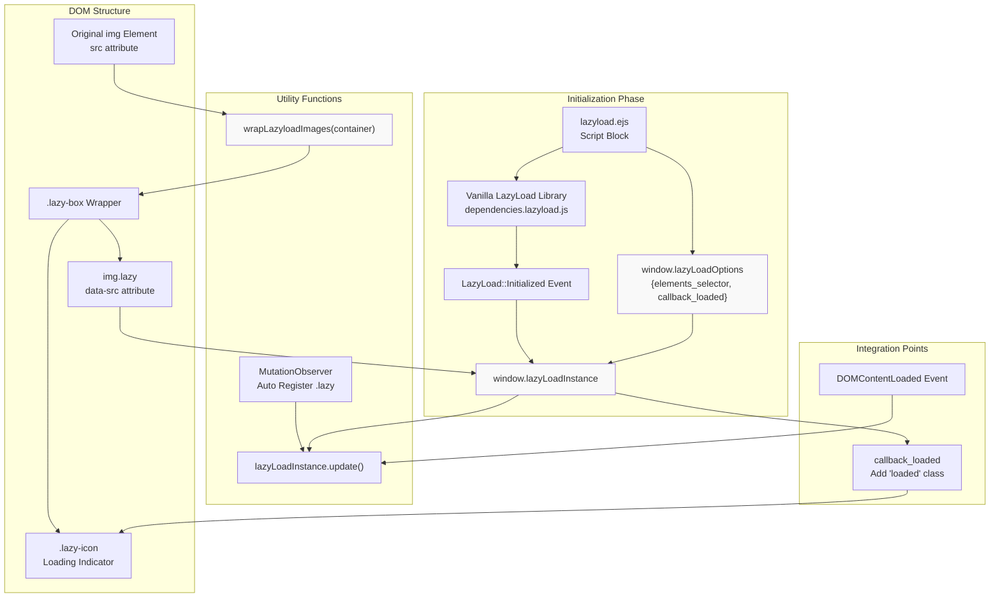
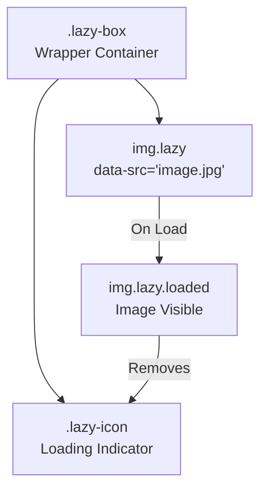
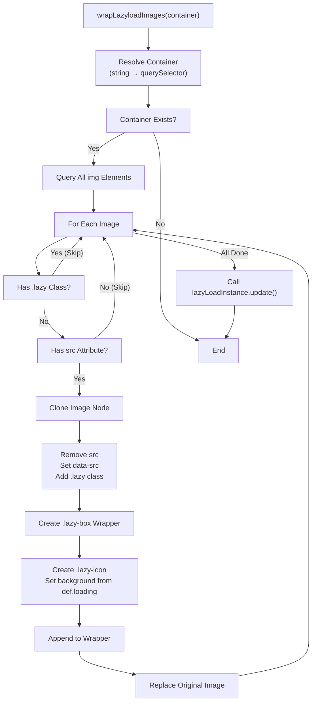
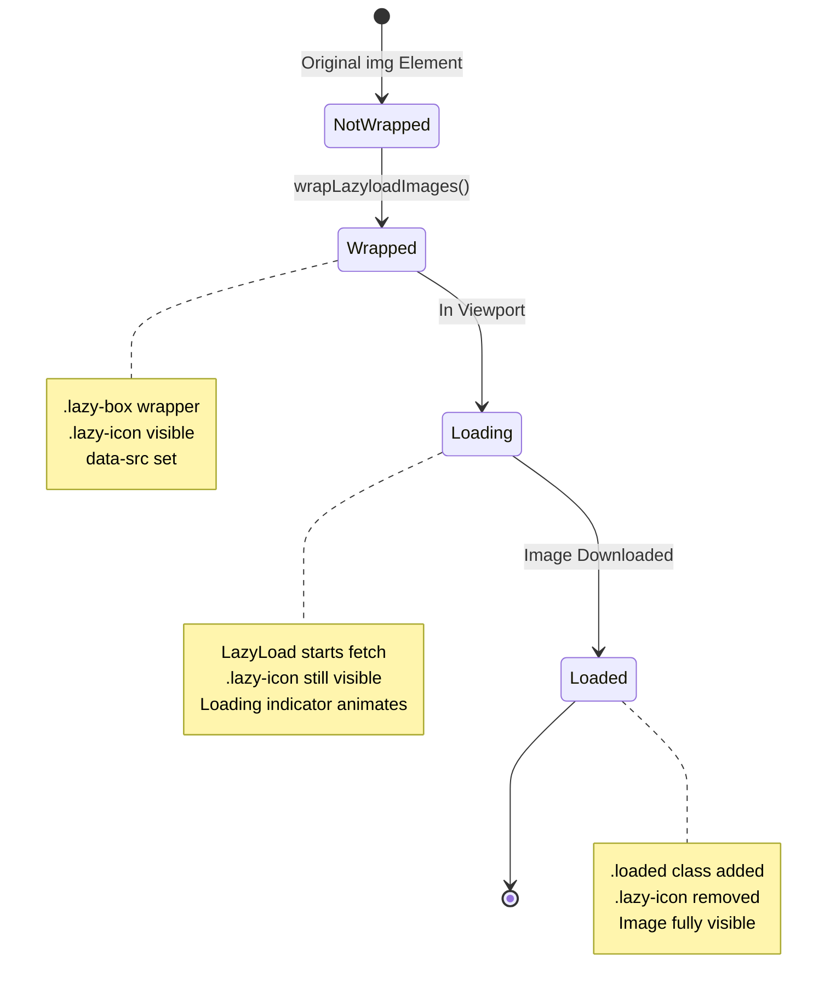

# 懒加载与图片处理

<details>
<summary>相关源码文件</summary>

生成此页面时参考的主题源码文件：

- [layout/_partial/scripts/lazyload.ejs](../../../layout/_partial/scripts/lazyload.ejs)
- [layout/layout.ejs](../../../layout/layout.ejs)
- [source/css/_plugins/index.styl](../../../source/css/_plugins/index.styl)
- [source/css/_plugins/lazyload.styl](../../../source/css/_plugins/lazyload.styl)

</details>

## 目的与范围

本文介绍 Stellar 如何为图片实现懒加载以优化页面加载性能：vanilla-lazyload 库集成、图片包装工具、加载状态视觉反馈系统。

通用插件配置见[插件系统](plugin-system.md)。

---

## 系统概览

懒加载系统把图片加载推迟到图片接近视口时，减少初始页面加载时间与带宽消耗。它用第三方 **vanilla-lazyload** 库，配合自定义初始化逻辑与 DOM 操作工具。

**关键组件：**

| 组件 | 用途 |
|------|------|
| `vanilla-lazyload` 库 | 监控滚动并加载图片的核心懒加载引擎 |
| `window.lazyLoadOptions` | LazyLoad 行为的全局配置对象 |
| `window.lazyLoadInstance` | LazyLoad 单例实例引用 |
| `wrapLazyloadImages()` | 把普通图片转换为可懒加载格式的工具函数 |
| `.lazy-box` 包装 | 带加载指示的懒加载图片容器结构 |

**参考源码**：[layout/_partial/scripts/lazyload.ejs](../../../layout/_partial/scripts/lazyload.ejs)

---

## 架构图



**参考源码**：[layout/_partial/scripts/lazyload.ejs](../../../layout/_partial/scripts/lazyload.ejs)

---

## Vanilla LazyLoad 集成

主题用 **vanilla-lazyload** 库，一个轻量、无依赖的懒加载方案。库从配置的 CDN 异步加载。

### 库加载

```javascript
// 从 dependencies 配置异步加载
<script async src="<%- url_for(theme.dependencies.lazyload.js) %>"></script>
```

`window.lazyLoadOptions` 在脚本加载前定义时库自动初始化，就绪时派发自定义 `LazyLoad::Initialized` 事件。

**参考源码**：[layout/_partial/scripts/lazyload.ejs](../../../layout/_partial/scripts/lazyload.ejs)

---

## 配置与初始化

### 全局配置对象

主题定义 `window.lazyLoadOptions` 配置 LazyLoad 行为：

| 选项 | 值 | 用途 |
|------|-----|------|
| `elements_selector` | `".lazy"` | 要懒加载的图片 CSS 选择器 |
| `callback_loaded` | 函数 | 图片加载完成时执行 |

`callback_loaded` 函数执行两个动作：

1. 给图片元素添加 `loaded` 类
2. 从包装中移除加载指示（`.lazy-icon`）

**参考源码**：[layout/_partial/scripts/lazyload.ejs](../../../layout/_partial/scripts/lazyload.ejs)

### 实例引用

主题捕获并存储 LazyLoad 实例供手动控制：

```javascript
window.addEventListener("LazyLoad::Initialized", function (event) {
    window.lazyLoadInstance = event.detail.instance;
}, false);
```

该实例引用支持：

- DOM 变化后的手动 update 调用
- 强制加载特定图片
- 整页导航后的重新扫描

**参考源码**：[layout/_partial/scripts/lazyload.ejs](../../../layout/_partial/scripts/lazyload.ejs)

### 初始更新触发

页面加载时懒加载系统显式更新以检测懒图片：

```javascript
document.addEventListener('DOMContentLoaded', function () {
    window.lazyLoadInstance?.update();
});
```

**参考源码**：[layout/_partial/scripts/lazyload.ejs](../../../layout/_partial/scripts/lazyload.ejs)

---

## 图片包装结构

懒加载系统把图片包装进含加载指示的容器结构。

### HTML 结构



**结构组件：**

| 元素 | 类 | 用途 |
|------|-----|------|
| 包装 `<div>` | `.lazy-box` | 定位与样式容器 |
| 图片 `` | `.lazy` | LazyLoad 库的目标（无 `src`） |
| 图片 `` | `.lazy.loaded` | 图片成功加载后添加 |
| 图标 `<div>` | `.lazy-icon` | 加载动画/图标（加载完成移除） |

### 属性变换

原始图片变换如下：

| 原始 | 变换后 |
|------|--------|
| `` | `` |
| `src` 属性 | 移除（防止立即加载） |
| N/A | `data-src` 属性（LazyLoad 目标） |
| N/A | `.lazy` 类（选择器匹配） |

**参考源码**：[layout/_partial/scripts/lazyload.ejs](../../../layout/_partial/scripts/lazyload.ejs)

---

## wrapLazyloadImages 工具函数

`wrapLazyloadImages()` 把容器中的现有图片转换为可懒加载格式。

### 函数签名

```javascript
window.wrapLazyloadImages = (container)
```

**参数：**

- `container`——CSS 选择器字符串或 DOM 元素引用

### 处理流程



### 实现细节

函数逐个处理图片：

1. **跳过条件**：已带 `.lazy` 类的图片跳过，避免重复处理
2. **属性迁移**：把 `src` 复制到 `data-src` 并移除 `src`
3. **图标配置**：用 `def.loading`（全局默认）作加载指示背景图
4. **更新通知**：调用 `lazyLoadInstance.update()` 注册新的懒图片

**参考源码**：[layout/_partial/scripts/lazyload.ejs](../../../layout/_partial/scripts/lazyload.ejs)

---

## 页面加载后的懒加载更新

主题为普通整页导航，每次页面加载执行一次初始化扫描（DOMContentLoaded 时 `lazyLoadInstance.update()`）。

- **动态插入的 `.lazy` 元素**：`lazyload.ejs` 内置 MutationObserver（rAF 节流），检测到新增 `.lazy` 元素后自动调用 `lazyLoadInstance.update()` 重新注册，第三方自定义脚本无需手动触发。
- **普通 `` 转换**：数据服务动态插入的普通图片仍经 `wrapLazyloadImages()` 包装为懒加载标记，该函数末尾同样调用 update 注册。

**参考源码**：[layout/_partial/scripts/lazyload.ejs](../../../layout/_partial/scripts/lazyload.ejs)

---

## CSS 样式

懒加载系统始终导入其样式，不同于条件插件导入。

### 插件导入策略

```stylus
// 始终导入（非条件）
@import 'lazyload'

// 其他插件条件导入
if hexo-config('plugins.swiper.enable')
  @import 'swiper'
```

`lazyload.styl` 无条件导入，因为懒加载被视为核心性能特性而非可选插件。

**参考源码**：[source/css/_plugins/index.styl](../../../source/css/_plugins/index.styl)

---

## 加载状态与视觉反馈

### 状态转换图



### 类状态

| 状态 | 类 | 可见性 | 图标 |
|------|-----|--------|------|
| 初始 | `.lazy` | 隐藏/占位 | 可见 |
| 加载中 | `.lazy` | 获取中 | 可见 |
| 已加载 | `.lazy.loaded` | 可见 | 已移除 |

### 回调执行

图片成功加载时执行 `callback_loaded`：

```javascript
callback_loaded: (el) => {
    el.classList.add('loaded');
    const wrapper = el.closest('.lazy-box');
    const icon = wrapper?.querySelector('.lazy-icon');
    if (icon) icon.remove();
}
```

**过程：**

1. 给图片元素添加 `.loaded` 类（用于 CSS 过渡）
2. 向上查找 `.lazy-box` 包装
3. 查找并移除 `.lazy-icon` 加载指示

**参考源码**：[layout/_partial/scripts/lazyload.ejs](../../../layout/_partial/scripts/lazyload.ejs)

---

## 汇总表

| 特性 | 实现 | 触发点 |
|------|------|--------|
| 库 | vanilla-lazyload | 异步脚本加载 |
| 配置 | `window.lazyLoadOptions` | 库加载前 |
| 实例访问 | `window.lazyLoadInstance` | LazyLoad::Initialized 事件 |
| 图片包装 | `wrapLazyloadImages()` | 手动调用 / 标签插件 |
| 加载更新 | `lazyLoadInstance.update()` | 页面加载 / MutationObserver 自动触发 / 新内容插入 |
| 加载回调 | `callback_loaded` | 每张图片加载完成 |
| 加载指示 | `.lazy-icon` | 随包装创建 |
| 已加载状态 | `.loaded` 类 | 回调时添加 |

**参考源码**：[layout/_partial/scripts/lazyload.ejs](../../../layout/_partial/scripts/lazyload.ejs)、[source/css/_plugins/index.styl](../../../source/css/_plugins/index.styl)
