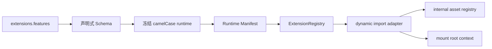

# Extension 系统

Stellar v2 把搜索、评论、标签能力、可选功能、数据服务与缓存统一归入 `extensions`。构建期生成严格的页面 Runtime Manifest，浏览器由单一 ESM bootstrap 建立 Extension 生命周期与 request/cache 客户端。

## 配置结构

```yaml
extensions:
  search: {}
  comments: {}
  tags: {}
  features: {}
  services: {}
  cache: {}
```

YAML 中 Stellar 自有字段统一使用 snake_case，解析后的 JavaScript 使用 camelCase。已声明对象按键合并，数组完整替换，不做类型强转；第三方 provider 参数袋保留上游字段名。

旧根 `search/comments/tag_plugins/dependencies/data_services/data_cache/plugins/api_host` 已退出运行时并由 Schema 直接拒绝。

## Feature 注册表

| ID | 默认 | 用途 |
|----|------|------|
| `lazy_loading` | 始终启用 | 图片懒加载的 `transition/fix_ratio` 行为 |
| `preload` | enabled | Flying Pages 预加载 |
| `lightbox` | enabled | Fancybox 图片灯箱 |
| `reveal` | enabled | ScrollReveal 入场动画 |
| `ai_summary` | disabled | Tianli GPT 摘要实现 |
| `math` | provider=null | KaTeX / MathJax provider |
| `diagrams` | disabled | Mermaid 图表 |
| `code_copy` | enabled | 代码复制 |
| `adaptive_text` | enabled | 背景自适应文字 |
| `card_hover` | disabled | 卡片光斑与倾斜 |
| `cjk_typography` | disabled | Heti 中文排版 |

```yaml
extensions:
  features:
    lightbox:
      enabled: true
      provider: fancybox
      mode: auto
      selector: .timenode p>img
    reveal:
      enabled: true
      provider: scrollreveal
      distance: 8px
      duration: 1000
      interval: 100
      scale: 1
    card_hover:
      enabled: true
      spotlight_color: 'rgba(255, 255, 255, 0.25)'
      max_tilt: 3
```

所有布尔状态统一使用 `enabled`。`fancybox/scrollreveal/tianli_gpt/copycode/heti` 等 v1 ID 分别收敛为职责命名；KaTeX 与 MathJax 是 `features.math.provider`，Mermaid 是 `features.diagrams`。Swiper 是主题内置容器能力，按 DOM 需求加载，不再公开配置。

页面 Front Matter 通过 `render.math` 与 `render.diagrams` 选择内容渲染能力，不直接配置官方资源 URL。

## Tag Extension

标签插件行为位于 `extensions.tags.<tag_id>`。当前注册 `note/checkbox/quot/emoji/icon/button/image/copy/timeline/mark/hashtag/okr/gallery/chat`：

```yaml
extensions:
  tags:
    timeline:
      max_height: 80vh
    chat:
      endpoint: https://siteinfo.listentothewind.cn/api/v1
```

标签渲染器只读取冻结的 `hexo.stellar.config.extensions.tags`，不再访问 `theme.tag_plugins`。

## 内部资源所有权

官方 Extension 的 JS/CSS/inject、Marked、LazyLoad、评论库和数据服务脚本由 [extension-assets.js](../../../scripts/lib/extension-assets.js) 深度冻结登记。公开 Schema 不提供这些地址，站点覆盖中的 `js/css/src/inject` 会被拒绝或不属于已声明对象。

这条边界把业务配置与主题实现资源分开：升级资源版本随主题代码评审和发布，不让站点配置形成第二套依赖锁。

## 加载链



`layout/_partial/scripts/runtime.ejs` 只输出 `#stellar-runtime-config` JSON 和 `/js/runtime/index.mjs`。manifest 条目含 `id/module/config/when`；`when.selector` 未命中时不会 import adapter。`ExtensionRegistry.mount(root, context)` 顺序挂载，重复 mount 先释放旧实例，`unmount(root)` 逆序清理；import、mount、unmount 失败只派发 `stellar:extension-error`，不会阻断其它 Extension。Runtime 启动失败时立即添加 `sr-fallback`，正文保持可见。

旧 `document.write`、同步 utils 补载、`_pluginQueue`、`stellar.initPlugin` 与插件恢复看门狗已删除。`utils.js` 只保留迁移期 DOM/经典资源工具，不再拥有 Extension 注册或网络缓存算法。

核心防闪烁样式在构建期按 `extensions.features.*.enabled` 条件导入；Swiper、Fancybox、Mermaid 与评论样式在 DOM 命中时按需注入。

## 服务与缓存

```yaml
extensions:
  services:
    site_info:
      endpoint:
    github:
      api_url: https://api.github.com
      raw_url: https://raw.githubusercontent.com
      gist_url: https://gist.github.com
      card_url: https://github-readme-stats.vercel.app
  cache:
    enabled: true
    default_ttl: 3600
    ttl: {}
    max_entries: 200
```

GitHub 地址统一为完整 URL。manifest 直接携带冻结的 camelCase cache 配置；`createRequestClient()` 提供同 method+URL 并发去重、按 service TTL、超时重试、fresh 命中、stale 失败回退、200 KiB 单条限制和最旧条目淘汰。它调用原生 `fetch` 而不替换 `window.fetch` 或 XHR 原型，并以 `stellar:request-start/end` 通知锚点稳定器。迁移期 `utils.request` 只是数据服务 callback/loading 语义的薄适配。

相关源码：[_config.yml](../../../_config.yml)、[scripts/schema/config-schema.js](../../../scripts/schema/config-schema.js)、[scripts/lib/browser-runtime.js](../../../scripts/lib/browser-runtime.js)、[layout/_partial/scripts/runtime.ejs](../../../layout/_partial/scripts/runtime.ejs)、[source/js/runtime/index.mjs](../../../source/js/runtime/index.mjs)、[source/js/runtime/extension-registry.mjs](../../../source/js/runtime/extension-registry.mjs)、[source/js/runtime/request-cache.mjs](../../../source/js/runtime/request-cache.mjs)、[source/css/_plugins/index.styl](../../../source/css/_plugins/index.styl)。
