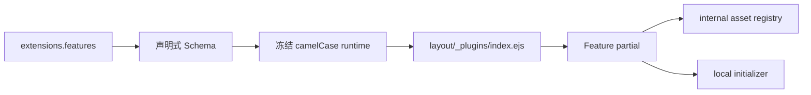

# Extension 系统

Stellar v2 把搜索、评论、标签能力、可选功能、数据服务与缓存统一归入 `extensions`。本切片交付的是配置入口、严格 Schema、冻结运行时和现有加载链迁移；完整 Extension 生命周期、模块协议与 request/cache 重构仍属于 M4。

## 配置结构

```yaml
extensions:
  search: {}
  comments: {}
  tags: {}
  features: {}
  services: {}
  cache: {}
```

YAML 中 Stellar 自有字段统一使用 snake_case，解析后的 JavaScript 使用 camelCase。已声明对象按键合并，数组完整替换，不做类型强转；第三方 provider 参数袋保留上游字段名。

旧根 `search/comments/tag_plugins/dependencies/data_services/data_cache/plugins/api_host` 已退出运行时并由 Schema 直接拒绝。

## Feature 注册表

| ID | 默认 | 用途 |
|----|------|------|
| `lazy_loading` | 始终启用 | 图片懒加载的 `transition/fix_ratio` 行为 |
| `preload` | enabled | Flying Pages 预加载 |
| `lightbox` | enabled | Fancybox 图片灯箱 |
| `reveal` | enabled | ScrollReveal 入场动画 |
| `ai_summary` | disabled | Tianli GPT 摘要实现 |
| `math` | provider=null | KaTeX / MathJax provider |
| `diagrams` | disabled | Mermaid 图表 |
| `code_copy` | enabled | 代码复制 |
| `adaptive_text` | enabled | 背景自适应文字 |
| `card_hover` | disabled | 卡片光斑与倾斜 |
| `cjk_typography` | disabled | Heti 中文排版 |

```yaml
extensions:
  features:
    lightbox:
      enabled: true
      provider: fancybox
      mode: auto
      selector: .timenode p>img
    reveal:
      enabled: true
      provider: scrollreveal
      distance: 8px
      duration: 1000
      interval: 100
      scale: 1
    card_hover:
      enabled: true
      spotlight_color: 'rgba(255, 255, 255, 0.25)'
      max_tilt: 3
```

所有布尔状态统一使用 `enabled`。`fancybox/scrollreveal/tianli_gpt/copycode/heti` 等 v1 ID 分别收敛为职责命名；KaTeX 与 MathJax 是 `features.math.provider`，Mermaid 是 `features.diagrams`。Swiper 是主题内置容器能力，按 DOM 需求加载，不再公开配置。

页面 Front Matter 通过 `render.math` 与 `render.diagrams` 选择内容渲染能力，不直接配置官方资源 URL。

## Tag Extension

标签插件行为位于 `extensions.tags.<tag_id>`。当前注册 `note/checkbox/quot/emoji/icon/button/image/copy/timeline/mark/hashtag/okr/gallery/chat`：

```yaml
extensions:
  tags:
    timeline:
      max_height: 80vh
    chat:
      endpoint: https://siteinfo.listentothewind.cn/api/v1
```

标签渲染器只读取冻结的 `hexo.stellar.config.extensions.tags`，不再访问 `theme.tag_plugins`。

## 内部资源所有权

官方 Extension 的 JS/CSS/inject、Marked、LazyLoad、评论库和数据服务脚本由 [extension-assets.js](../../../scripts/lib/extension-assets.js) 深度冻结登记。公开 Schema 不提供这些地址，站点覆盖中的 `js/css/src/inject` 会被拒绝或不属于已声明对象。

这条边界把业务配置与主题实现资源分开：升级资源版本随主题代码评审和发布，不让站点配置形成第二套依赖锁。

## 加载链



Feature partial 经 `stellar.initPlugin(fn, name, options)` 注册。`bootstrap.ejs` 在 `utils.js` 前提供队列，`layout/_plugins/index.ejs` 保留兜底注册点；ScrollReveal 仍有独立看门狗，第三方库失败时恢复 `.slide-up` 内容可见性。

核心防闪烁样式在构建期按 `extensions.features.*.enabled` 条件导入；Swiper、Fancybox、Mermaid 与评论样式在 DOM 命中时按需注入。

## 服务与缓存

```yaml
extensions:
  services:
    site_info:
      endpoint:
    github:
      api_url: https://api.github.com
      raw_url: https://raw.githubusercontent.com
      gist_url: https://gist.github.com
      card_url: https://github-readme-stats.vercel.app
  cache:
    enabled: true
    default_ttl: 3600
    ttl: {}
    max_entries: 200
```

GitHub 地址统一为完整 URL。浏览器当前仍接收由 EJS 投影的内部 service/cache 形状，以保持本切片行为不变；公开 YAML 和 Node/EJS 消费方不再读取旧根。M4 再替换内部生命周期协议。

相关源码：[_config.yml](../../../_config.yml)、[scripts/schema/config-schema.js](../../../scripts/schema/config-schema.js)、[layout/_plugins/index.ejs](../../../layout/_plugins/index.ejs)、[source/css/_plugins/index.styl](../../../source/css/_plugins/index.styl)。
