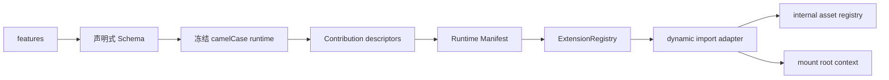

# Extension 系统

Stellar v2 将搜索、评论、标签能力、可选功能和数据服务分别收敛到 `search/comments/tags/features/services` 根配置。构建期再将它们投影为严格的页面 Runtime Manifest，浏览器由单一 ESM bootstrap 建立 Extension 生命周期与 request/cache 客户端。

## 配置结构

```yaml
search: {}
comments: {}
tags: {}
features: {}
services: {}
```

YAML 中 Stellar 自有字段统一使用 snake_case，解析后的 JavaScript 使用 camelCase。已声明对象按键合并，数组完整替换，不做类型强转；第三方 provider 参数袋保留上游字段名。

旧根 `tag_plugins/dependencies/data_services/data_cache/plugins/api_host` 已退出运行时；`search/comments` 保留为根配置，但旧版子字段会由 Schema 直接拒绝。

## 贡献注册表与 Feature

Runtime Manifest 内置 Extension、Feature 和 selector 组件由 [contribution-registry.js](../../../scripts/lib/contribution-registry.js) 的统一 descriptor 登记。每条声明包含 ID/类型、ESM 入口、内置资源键、激活条件、可选 Schema/i18n、文档与行为测试。`browser-runtime.js` 按注册表顺序投影页面 Manifest，不另存 ID、入口或资源白名单。

该 descriptor 是主题内部构建契约，不是第三方 manifest/API。新增功能的维护面与 Card Hover 演练见[贡献架构指南](../../guides/contribution-architecture.md)。

| ID | 默认 | 用途 |
|----|------|------|
| `lazy_loading` | 始终启用 | 图片懒加载的 `transition/auto_aspect_ratio` 行为 |
| `link_prefetch` | enabled | Flying Pages 链接预取 |
| `lightbox` | enabled | Fancybox 图片灯箱 |
| `reveal` | enabled | 原生滚动入场动画 |
| `math` | provider=null | KaTeX / MathJax provider |
| `diagrams` | provider=null | Mermaid 图表 |
| `card_hover` | disabled | 卡片光斑与倾斜 |
| `heti` | disabled | Heti 中文排版 |

```yaml
features:
  lightbox:
    enabled: true
    selector: .timenode p>img
  reveal:
    enabled: true
  card_hover:
    enabled: true
```

Reveal 由主题内置的 `IntersectionObserver` 与 Web Animations API 实现，不请求第三方资源；只公开启用开关，动画距离、时长、错峰和缩放由主题统一维护。Fancybox 的实现固定，MathJax 只使用 v3。Mermaid 通过 `diagrams.provider: mermaid` 选择并使用官方样式。代码复制与自适应文字固定开启，不公开配置；AI Summary 已整体删除。

页面 Front Matter 通过 `render.math` 与 `render.diagrams` 选择内容渲染能力，不直接配置官方资源 URL。

## Tag Extension

标签插件行为位于 `tags.<tag_id>`。公开配置只注册 `note/checkbox/quot/emoji/icon/button/mark/hashtag/gallery`；Image、Timeline、OKR 与 Chat 的固定策略不再公开配置。

```yaml
tags:
  emoji:
    default_source: blobcat
    sources:
      blobcat: https://cdn.example/{name}.gif
  gallery:
    size: mix
    aspect_ratio: square
```

标签渲染器只读取冻结的 `hexo.stellar.config.tags`，不再访问 `theme.tag_plugins`。

## 内部资源所有权

官方 Extension 的 JS/CSS/inject、Marked、LazyLoad、评论库、数据服务脚本，以及固定 provider 与 request/cache 策略由 [internal-constants.js](../../../scripts/lib/internal-constants.js) 深度冻结真值。每类 Runtime 资源的消费所有权由 contribution descriptor 登记，CI 拒绝未登记或重复所有的 asset。`extension-assets.js` 仅保留兼容导出。公开 Schema 不提供这些实现细节。

这条边界把业务配置与主题实现资源分开：升级资源版本随主题代码评审和发布，不让站点配置形成第二套依赖锁。

## 加载链



`layout/_partial/scripts/runtime.ejs` 只输出 `#stellar-runtime-config` JSON 和 `/js/runtime/index.mjs`。manifest 条目含 `id/module/config/when`；`when.selector` 未命中时不会 import adapter。`ExtensionRegistry.mount(root, context)` 顺序挂载，重复 mount 先释放旧实例，`unmount(root)` 逆序清理；import、mount、unmount 失败只派发 `stellar:extension-error`，不会阻断其它 Extension。Reveal 不预先隐藏 `.slide-up`，首次观察已处于视口内的元素也不播放动画，因此页面切换、Runtime 启动或 Extension 加载失败时正文都按默认样式直接显示。

旧 `document.write`、同步 utils 补载、`_pluginQueue`、`stellar.initPlugin` 与插件恢复看门狗已删除。`utils.js` 只保留迁移期 DOM/经典资源工具，不再拥有 Extension 注册或网络缓存算法。

非首屏 SVG 占位符替换和 dropdown 浮层也使用内部 selector Extension：只有页面出现 `svg.icon[data-icon]` 或 `details.dropdown` 时，runtime 才加载 `/js/icons.js` 或 `/js/plugins/dropdown.js`。脚本通过内部 `stellar:legacy-feature-ready` 事件向 runtime 交付 `mount(root)` 适配器，不暴露新的全局 API；Extension 卸载时会中止图标请求，或断开 dropdown observer、全局监听与待执行动画帧。它们不新增公开配置，并保持原 DOM 与交互。

Contribution 的 `kind` 描述产品归类，`entry.adapter` 描述运行时调用约定，两者不能互相替代。凡声明 `entry.adapter: feature` 的 descriptor（包括内部 component）在投影 Runtime Manifest 时都必须携带 `config.feature=<id>`，供共享 `feature.mjs` 分派；独立 Feature 继续保留同名字段以维持既有 Manifest 形状。注册表测试统一枚举共享 adapter 条目，阻止 component 再次遗漏分派 ID。

核心防闪烁样式只服务确有加载占位需求的功能；Reveal 只对首次观察时位于视口外、之后滚入视口的元素临时施加 Web Animations API 动画，不需要隐藏态 CSS。Swiper、Fancybox、Mermaid 与评论样式在 DOM 命中时按需注入。

Card Hover 使用独立 `card-hover.mjs` adapter 加载内置脚本并对当前 root 执行 `mountAll/unmountAll`。它的 ID、入口、asset、`.card-hover` 激活、Schema 与测试只在 descriptor 关联，不再出现于通用 Feature dispatch。

## 服务与内部缓存

```yaml
services:
  site_info:
    provider: site_info_api
    site_info_api:
      endpoint: https://api.xaox.cc/site_info/v1?url={href}
  rating:
    provider: star_vote
    star_vote:
      endpoint: https://star-vote.xaox.cc/api/rating
  vote:
    provider: star_vote
    star_vote:
      endpoint: https://star-vote.xaox.cc/api/vote
  github:
    api_url: https://api.github.com
    raw_url: https://raw.githubusercontent.com
    gist_url: https://gist.github.com
  github_card:
    provider: github_readme_stats
    github_readme_stats:
      endpoint: https://github-readme-stats.vercel.app
```

Site Info、Rating 与 Vote 默认选择 xaox.cc 公共实例对应的 provider，可覆盖选中参数袋内的自部署地址或以 `provider: null` 关闭；三者的预期远程失败完全静默并保留静态兜底。统一解析接缝只向消费方提供选中的参数袋。GitHub 地址统一为完整 URL。Runtime Manifest 携带主题内部注入且冻结的 cache/request policy；`createRequestClient()` 提供同 method+URL 并发去重、按 service TTL、超时重试、fresh 命中、stale 失败回退、200 KiB 单条限制和最旧条目淘汰。站点不再调节这些实现常量。客户端调用原生 `fetch` 而不替换 `window.fetch` 或 XHR 原型，并以 `stellar:request-start/end` 通知锚点稳定器。

相关源码：[_config.yml](../../../_config.yml)、[scripts/schema/config-schema.js](../../../scripts/schema/config-schema.js)、[scripts/lib/contribution-registry.js](../../../scripts/lib/contribution-registry.js)、[scripts/lib/contribution-audit.js](../../../scripts/lib/contribution-audit.js)、[scripts/lib/internal-constants.js](../../../scripts/lib/internal-constants.js)、[scripts/lib/browser-runtime.js](../../../scripts/lib/browser-runtime.js)、[layout/_partial/scripts/runtime.ejs](../../../layout/_partial/scripts/runtime.ejs)、[source/js/runtime/index.mjs](../../../source/js/runtime/index.mjs)、[source/js/runtime/extension-registry.mjs](../../../source/js/runtime/extension-registry.mjs)、[source/js/runtime/request-cache.mjs](../../../source/js/runtime/request-cache.mjs)、[source/css/_plugins/index.styl](../../../source/css/_plugins/index.styl)。
