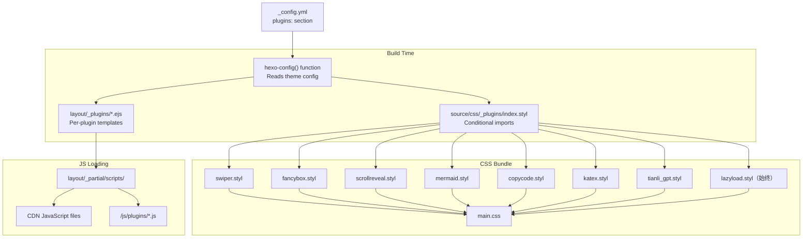
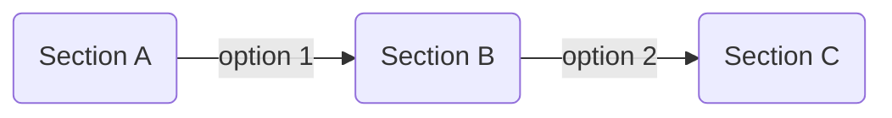

# 插件系统

<details>
<summary>相关源码文件</summary>

生成此页面时参考的主题源码文件：

- [.github/workflows/npm-publish.yml](../../../.github/workflows/npm-publish.yml)
- [.npmignore](../../../.npmignore)
- [LICENSE](../../../LICENSE)
- [README.md](../../../README.md)
- [_config.yml](../../../_config.yml)
- [layout/_partial/scripts/lazyload.ejs](../../../layout/_partial/scripts/lazyload.ejs)
- [layout/layout.ejs](../../../layout/layout.ejs)
- [package.json](../../../package.json)
- [scripts/helpers/json_ld.js](../../../scripts/helpers/json_ld.js)
- [source/css/_plugins/index.styl](../../../source/css/_plugins/index.styl)

</details>

## 目的与范围

本文介绍 Stellar 的条件插件加载系统。主题支持多个可选功能插件（swiper、fancybox、scrollreveal、mermaid、copycode、katex、tianli_gpt、preload 等），可经配置启用或禁用。系统通过配置驱动的条件导入协调 CSS 与 JavaScript 加载，保证只有启用插件贡献包体积。

评论系统等第三方集成见[评论系统](comment-systems.md)；标签使用时按需加载的数据服务见[数据服务 API](../06-数据服务与组件/data-service-apis.md)。

---

## 配置系统

### 插件配置结构

插件在 `_config.yml` 的 `plugins` 小节配置。每个插件有 `enable` 标志与插件专属选项，全部插件遵循一致模式。

```yaml
plugins:
  plugin_name:
    enable: true/false  # 总开关
    # 插件专属配置
```

**配置位置与结构：**

| 配置字段 | 类型 | 用途 |
|----------|------|------|
| `enable` | Boolean | 插件激活总开关 |
| `js` | String | JavaScript 库的 CDN URL |
| `css` | String | 样式表 CDN URL |
| `inject` | String | 注入的原始 HTML（简单插件） |
| 插件专属选项 | 各种 | 每个插件的自定义配置 |

**参考源码**：[_config.yml](../../../_config.yml)

---

## 插件加载架构

插件系统实现双重加载策略：CSS 与 JavaScript 基于相同配置标志条件加载，保证一致性与最优性能。



**插件加载架构：CSS/JS 协调**

系统分两阶段运行：

1. **构建期**：Hexo-Stylus 读取配置并条件导入 CSS 模块；EJS 模板渲染插件初始化代码
2. **运行时**：HTML 只包含启用插件的 CSS 与 JS

**参考源码**：[_config.yml](../../../_config.yml)、[source/css/_plugins/index.styl](../../../source/css/_plugins/index.styl)

---

## CSS 插件加载

### 条件导入模式

CSS 加载系统用 Stylus 的 `if` 指令配合 `hexo-config()` 函数条件导入插件样式表。这在构建期完成，禁用插件对 CSS 包贡献 0 字节。

**index.styl 中的导入逻辑：**

```stylus
// 始终加载的核心插件
@import 'lazyload'
@import 'aplayer'

if hexo-config('plugins.swiper.enable')
  @import 'swiper'
if hexo-config('plugins.scrollreveal.enable')
  @import 'scrollreveal'
if hexo-config('plugins.fancybox.enable')
  @import 'fancybox'
if hexo-config('plugins.mermaid.style_optimization')
  @import 'mermaid'
if hexo-config('plugins.copycode.enable')
  @import 'copycode'
if hexo-config('plugins.tianli_gpt.enable')
  @import 'tianli_gpt'
if hexo-config('plugins.katex.enable')
  @import 'katex'
```

### 评论系统条件导入

评论系统样式遵循同样模式，检查主 `service` 或 `custom_css` 数组中的存在性：

```stylus
if hexo-config('comments.service') == 'beaudar' or index(hexo-config('comments.custom_css'), 'beaudar') >= 0
  @import 'comments/beaudar'
```

**注意**：`custom_css` 数组允许即使不是主服务也加载评论样式，支持不同页面多评论系统。

**参考源码**：[source/css/_plugins/index.styl](../../../source/css/_plugins/index.styl)

---

## JavaScript 插件加载

### EJS 模板系统

JavaScript 插件经 `layout/_plugins/` 中的独立 EJS 模板加载。每个模板：

1. 检查配置中的 `enable` 标志
2. 输出外部 CDN 库的 `<script>` 标签
3. 输出内联初始化代码
4. 经全局变量向 JavaScript 暴露配置

以 preload 插件为例：

```ejs
<% if (conf.enable) { %>
  <%- utils.js(conf.flying_pages) %>
<% } %>
```

`conf` 变量包含来自 `_config.yml` 的插件配置对象。

**参考源码**：[layout/_plugins/preload.ejs](../../../layout/_plugins/preload.ejs)

### 插件初始化模式

插件通常遵循此初始化模式：

1. **配置暴露**：全局配置对象
2. **脚本加载**：外部 CDN 或本地 JS 文件
3. **自动初始化**：插件在页面加载时初始化
4. **API 暴露**：插件经 `window.stellar` 命名空间暴露 API

---

## 内建插件

### Preload（链接预加载）

**用途**：鼠标悬停时预取站内链接，提升导航体感速度。

**配置：**

```yaml
preload:
  enable: true
  service: flying_pages # flying_pages
  flying_pages: https://gcore.jsdelivr.net/npm/flying-pages@2/flying-pages.min.js
```

**加载条件**：`hexo-config('plugins.preload.enable')`

**参考源码**：[_config.yml](../../../_config.yml)

---

### Fancybox（图片灯箱）

**用途**：在灯箱覆盖层中显示图片，支持缩放、导航与图库功能。

**配置：**

```yaml
fancybox:
  enable: true
  js: https://gcore.jsdelivr.net/npm/@fancyapps/ui@5.0/dist/fancybox/fancybox.umd.js
  css: https://gcore.jsdelivr.net/npm/@fancyapps/ui@5.0/dist/fancybox/fancybox.css
  selector: .timenode p>img  # 启用灯箱的图片 CSS 选择器
```

**选择器配置**：`selector` 字段指定哪些图片获得灯箱功能，多个选择器用逗号分隔。

**常见选择器：**

- `.md-text img:not([class])`——所有无类 Markdown 图片
- `.tk-content img:not([class*="emo"])`——Twikoo 评论图片（排除表情）
- `#waline_container .vcontent img`——Waline 评论图片

**参考源码**：[_config.yml](../../../_config.yml)

---

### Swiper（轮播/滑块）

**用途**：为图片图库与内容滑块提供触控轮播功能。

**配置：**

```yaml
swiper:
  enable: true
  css: https://unpkg.com/swiper@10.3/swiper-bundle.min.css
  js: https://unpkg.com/swiper@10.3/swiper-bundle.min.js
```

**加载条件**：`hexo-config('plugins.swiper.enable')`

**参考源码**：[_config.yml](../../../_config.yml)

---

### ScrollReveal（滚动动画）

**用途**：元素滚动进入视口时播放动画。

**配置：**

```yaml
scrollreveal:
  enable: #true  # 默认注释掉——可能引起空白页问题
  js: https://gcore.jsdelivr.net/npm/scrollreveal@4.0/dist/scrollreveal.min.js
  distance: 8px
  duration: 1000  # ms
  interval: 100   # ms
  scale: 1        # 0.1~1
```

**⚠️ 重要**：ScrollReveal 默认禁用并标记慎用，配置注释为「慎用，有些时候打开页面空白」。

**参考源码**：[_config.yml](../../../_config.yml)

---

### Mermaid（图表渲染）

**用途**：把 mermaid 语法渲染为流程图、时序图、甘特图等。

**配置：**

```yaml
mermaid:
  enable: # true  # 可全局或经 front-matter 按页启用
  style_optimization: false  # 使用 Stellar 自定义样式
  js: https://gcore.jsdelivr.net/npm/mermaid@v9/dist/mermaid.min.js
  theme: neutral  # default | dark | forest | neutral
```

**启用方式：**

1. **全局**：配置 `enable: true`
2. **按页**：front-matter 添加 `mermaid: true`
3. **依赖**：需安装 `hexo-filter-mermaid-diagrams` 包

**Markdown 用法：**

````markdown

````

**参考源码**：[_config.yml](../../../_config.yml)

---

### CopyCode（代码块复制按钮）

**用途**：为代码块添加复制按钮。

**配置：**

```yaml
copycode:
  enable: true
  default_text: 'Copy'
  success_text: 'Copied'
  toast: 复制成功  # Toast 通知文本
```

**特性：**

- 代码块悬停时出现按钮
- 复制成功视觉反馈
- 可选 toast 通知
- 支持 Markdown 中全部代码块

**参考源码**：[_config.yml](../../../_config.yml)

---

### KaTeX（数学渲染）

**用途**：渲染 LaTeX 数学表达式。

**配置：**

```yaml
katex:
  enable: #true
  inject: |
    <link rel="stylesheet" href="https://cdn.jsdelivr.net/npm/katex@0.16.23/dist/katex.min.css" crossorigin="anonymous">
```

**特殊模式**：KaTeX 用 `inject` 字段做简单 HTML 注入，而非独立 EJS 模板，适合只需添加样式表或简单脚本标签的插件。

**渲染器要求**：需要 `hexo-renderer-markdown-it-plus` 作为 Markdown 渲染器：

```bash
npm uninstall hexo-renderer-marked --save
npm install hexo-renderer-markdown-it-plus --save
```

**注意**：`hexo-renderer-markdown-it-plus` 默认启用 KaTeX，`enable` 标志只控制样式表注入。

**参考源码**：[_config.yml](../../../_config.yml)

---

### TianliGPT（AI 摘要）

**用途**：提供 AI 驱动的文章摘要与推荐。

**配置：**

```yaml
tianli_gpt: 
  enable: #true
  js: https://jsd.onmicrosoft.cn/gh/qxchuckle/Post-Summary-AI@6.0/chuckle-post-ai.min.js
  field: post  # all, post, wiki
  key: 5Q5mpqRK5DkwT1X9Gi5e  # API key
  total_length: 1000  # 字符数限制（最大 5000）
  typewriter: true  # 打字机动画
  summary_directly: true  # 直接显示摘要
  rec_method: all  # all, web（推荐范围）
  hide_shuttle: true  # 隐藏矩阵穿梭
  summary_toggle: false
  interface:
    name: AI摘要
    introduce: 'AI 助手介绍文本'
```

**field 范围：**

- `all`：全部页面启用
- `post`：仅博客文章
- `wiki`：仅 wiki 页面

**参考源码**：[_config.yml](../../../_config.yml)

---

### Heti（中文排版）

**用途**：专为中文网页内容设计的排版样式增强。

**配置：**

```yaml
heti:
  enable: false  # 此插件会和代码块冲突，仅适用于纯中文博主
  css: https://unpkg.com/heti@0.9/umd/heti.min.css
  js: https://unpkg.com/heti@0.9/umd/heti-addon.min.js
```

**参考源码**：[_config.yml](../../../_config.yml)

---

## 添加自定义插件

### 插件集成步骤

**步骤 1：配置**

在 `_config.yml` 的 `plugins` 小节添加插件配置：

```yaml
plugins:
  custom_plugin:
    enable: false
    js: https://cdn.example.com/custom-plugin.js
    css: https://cdn.example.com/custom-plugin.css
    # 插件专属选项
```

**步骤 2：CSS 集成（可选）**

插件需要自定义 CSS 时：

1. 创建 `source/css/_plugins/custom_plugin.styl`
2. 在 `source/css/_plugins/index.styl` 添加条件导入：

```stylus
if hexo-config('plugins.custom_plugin.enable')
  @import 'custom_plugin'
```

**步骤 3：JavaScript 加载**

创建 `layout/_plugins/custom_plugin.ejs`：

```ejs
<% if (conf.enable) { %>
  <% if (conf.css) { %>
    <%- utils.css(conf.css) %>
  <% } %>
  <% if (conf.js) { %>
    <%- utils.js(conf.js) %>
  <% } %>
  <script>
    // 初始化代码
    document.addEventListener('DOMContentLoaded', function() {
      if (typeof CustomPlugin !== 'undefined') {
        CustomPlugin.init({
          // 把 conf 选项传给插件
        });
      }
    });
  </script>
<% } %>
```

**步骤 4：注入模式（简单插件）**

只需简单 HTML 注入的插件用 `inject` 字段：

```yaml
plugins:
  simple_plugin:
    enable: true
    inject: |
      <link rel="stylesheet" href="https://cdn.example.com/plugin.css">
      <script src="https://cdn.example.com/plugin.js"></script>
```

这无需独立 EJS 文件。

**参考源码**：[_config.yml](../../../_config.yml)

---

## 插件加载工具

### 可用辅助函数

| 函数 | 用途 | 示例 |
|------|------|------|
| `utils.css(url)` | 生成样式表链接 | `<%- utils.css(conf.css) %>` |
| `utils.js(url)` | 生成脚本标签 | `<%- utils.js(conf.js) %>` |
| `url_for(path)` | 生成绝对 URL | `<%- url_for('/js/plugins/custom.js') %>` |
| `hexo-config(path)` | 读取主题配置（Stylus） | `hexo-config('plugins.name.enable')` |

**本地插件文件：**

自定义 JavaScript 放在 `/source/js/plugins/` 并用 `url_for()` 引用：

```ejs
<%- utils.js('/js/plugins/custom.js') %>
```

**参考源码**：[_config.yml](../../../_config.yml)

---

## 配置参考表

### 全部内建插件

| 插件 | 默认 | 用途 | 依赖 |
|------|------|------|------|
| `preload` | `true` | 链接预加载 | flying_pages |
| `fancybox` | `true` | 图片灯箱 | @fancyapps/ui |
| `swiper` | `true` | 轮播 | swiper |
| `scrollreveal` | `false` | 滚动动画 | scrollreveal |
| `tianli_gpt` | `false` | AI 摘要 | 需要 API key |
| `katex` | `false` | 数学渲染 | hexo-renderer-markdown-it-plus |
| `mathjax` | `false` | 数学渲染（备选） | 无 |
| `mermaid` | `false` | 图表渲染 | hexo-filter-mermaid-diagrams |
| `copycode` | `true` | 复制代码按钮 | 无 |
| `heti` | `false` | 中文排版 | 无 |

**参考源码**：[_config.yml](../../../_config.yml)

---

## 性能考虑

### 包体积优化

条件加载系统保证最优性能：

1. **构建期消除**：禁用 CSS 插件贡献 0 字节
2. **懒 JavaScript 加载**：多数插件用 `defer` 或 `async` 属性
3. **CDN 优化**：外部库从 CDN 加载，浏览器缓存
4. **选择性启用**：按页启用标志（如 front-matter 的 `mermaid: true`）

### 按插件类型的加载策略

| 策略 | 插件 | 影响 |
|------|------|------|
| 始终加载 | copycode、lazyload | 最小（< 5KB） |
| 条件 CSS | 全部带样式的插件 | 禁用时为零 |
| 条件 JS | fancybox、swiper | 禁用时为零 |
| 按需 | mermaid、tianli_gpt | 仅设置标志时 |
| 注入模式 | katex、mathjax | 简单样式表注入 |

**参考源码**：[source/css/_plugins/index.styl](../../../source/css/_plugins/index.styl)

---

## 整页导航下的插件行为

主题为普通整页导航（PJAX 已移除），插件在每次页面加载时随页面一起初始化，无需 PJAX 式的导航后重初始化事件。希望响应页面加载的插件可监听 `DOMContentLoaded` 或使用 `stellar.initPage()` 的初始化序列。

**参考源码**：[source/js/main.js](../../../source/js/main.js)
