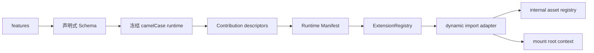

# Extension 系统

Stellar v2 将搜索、评论、标签能力、可选功能和数据服务分别收敛到 `search/comments/tags/features/services` 根配置。构建期再将它们投影为严格的页面 Runtime Manifest，浏览器由单一 ESM bootstrap 建立 Extension 生命周期与 request/cache 客户端。

## 配置结构

```yaml
search: {}
comments: {}
tags: {}
features: {}
services: {}
```

YAML 中 Stellar 自有字段统一使用 snake_case，解析后的 JavaScript 使用 camelCase。已声明对象按键合并，数组完整替换，不做类型强转；第三方 provider 参数袋保留上游字段名。

旧根 `tag_plugins/dependencies/data_services/data_cache/plugins/api_host` 已退出运行时；`search/comments` 保留为根配置，但旧版子字段会由 Schema 直接拒绝。

## 贡献注册表与 Feature

Runtime Manifest 内置 Extension、Feature 和 selector 组件由 [contribution-registry.js](../../../scripts/lib/contribution-registry.js) 的统一 descriptor 登记。每条声明包含 ID/类型、ESM 入口、内置资源键、激活条件、可选 Schema/i18n、文档与行为测试。`browser-runtime.js` 按注册表顺序投影页面 Manifest，不另存 ID、入口或资源白名单。

该 descriptor 是主题内部构建契约，不是第三方 manifest/API。新增功能的维护面与 Card Hover 演练见[贡献架构指南](../../guides/contribution-architecture.md)。

| ID | 默认 | 用途 |
|----|------|------|
| `color_scheme_switch` | disabled | 设置页与系统偏好驱动的明暗模式切换 |
| `lazy_loading` | 始终启用 | 图片懒加载的 `transition/auto_aspect_ratio` 行为 |
| `link_prefetch` | enabled | Flying Pages 链接预取 |
| `lightbox` | enabled | Fancybox 图片灯箱 |
| `reveal` | enabled | 原生滚动入场动画 |
| `math` | provider=null | KaTeX / MathJax provider |
| `diagrams` | provider=null | Mermaid 图表 |
| `card_hover` | spotlight=false、tilt=false | 光斑与倾斜独立控制 |
| `partial_navigation` | enabled | 同集合兼容页面局部导航 |
| `image_optimization` | enabled | 构建期图片尺寸与颜色增量预处理 |
| `heti` | disabled | Heti 中文排版 |

```yaml
features:
  lightbox:
    enabled: true
    selector: .timenode p>img
  reveal:
    enabled: true
  card_hover:
    spotlight: true
    tilt: true
```

Reveal 由主题内置的 `IntersectionObserver` 与 Web Animations API 实现，不请求第三方资源；只公开启用开关，动画距离、时长、错峰和缩放由主题统一维护。Fancybox 的实现固定，MathJax 只使用 v3。Mermaid 通过 `diagrams.provider: mermaid` 选择并使用官方样式。代码复制与自适应文字固定开启，不公开配置；AI Summary 已整体删除。

页面 Front Matter 通过 `render.math` 与 `render.diagrams` 选择内容渲染能力，不直接配置官方资源 URL。

## Tag Extension

标签插件行为位于 `tags.<tag_id>`。公开配置只注册 `note/checkbox/quot/emoji/icon/button/mark/hashtag/gallery`；Image、Timeline、OKR 与 Chat 的固定策略不再公开配置。

```yaml
tags:
  emoji:
    default_source: blobcat
    sources:
      blobcat: https://cdn.example/{name}.gif
  gallery:
    size: mix
    aspect_ratio: square
```

标签渲染器只读取冻结的 `hexo.stellar.config.tags`，不再访问 `theme.tag_plugins`。

## 内部资源所有权

主题自身 Runtime、adapter、局部样式与请求策略由 [internal-constants.js](../../../scripts/lib/internal-constants.js) 维护。descriptor 的 `resources` 仅登记内部资源的消费所有权；第三方地址从对应服务配置读取。

## 加载链



`layout/_partial/scripts/runtime.ejs` 只输出 `#stellar-runtime-config` JSON 和 `/js/runtime/index.js`。manifest 条目含 `id/module/config/when`；`when.selector` 未命中时不会 import adapter。`ExtensionRegistry.mount(root, context)` 顺序挂载，重复 mount 先释放旧实例，`unmount(root)` 逆序清理；import、mount、unmount 失败只派发 `stellar:extension-error`，不会阻断其它 Extension。Reveal 不在静态 CSS 中预先隐藏正文；其挂载后的临时隐藏由对应 Extension 负责恢复。

旧 `document.write`、同步 utils 补载、`_pluginQueue`、`stellar.initPlugin` 与插件恢复看门狗已删除。`utils.js` 只保留迁移期 DOM/经典资源工具，不再拥有 Extension 注册或网络缓存算法。

非首屏 SVG 占位符替换和 dropdown 浮层也使用原生 selector Extension：只有页面出现 `svg.icon[data-icon]` 或 `details.dropdown` 时，runtime 才动态导入对应模块并调用 `mount(root, context)`。Extension 卸载时会中止图标请求，或断开 dropdown observer、全局监听与待执行动画帧；两者不经过经典脚本或全局事件桥接，不新增公开配置，并保持原 DOM 与交互。

每个功能使用独立 ESM adapter，由 descriptor 直接登记入口。Extension 生命周期区分 document 与 page 作用域，支持局部导航的卸载和重挂载；异步资源、请求和 observer 随作用域取消或释放。

Reveal 首次观察时保留视口内元素的直接显示，对视口外待入场元素临时隐藏；进入视口时恢复透明度并播放动画，卸载或初始化异常时恢复原始透明度。减少动态效果偏好下不执行动画。Swiper、Fancybox、Mermaid 与评论样式按需加载。

Card Hover 使用独立 `card-hover.js` adapter 加载内置脚本并对当前 root 执行 `mountAll/unmountAll`。它的 ID、入口、asset、`.card-hover` 激活、Schema 与测试只在 descriptor 关联，不再出现于通用 Feature dispatch。

## 部署故障排查：动态数据和 SVG 不显示

数据服务、非首屏 SVG、搜索、评论和部分交互都由 `/js/runtime/index.js` 启动。这个入口未执行时，多个看似无关的功能会同时失效；应先排查 Runtime，而不是分别修改组件配置。

### 确认线上实际加载的资源

1. 在浏览器开发者工具的 Console 和 Network 中找到 `/js/runtime/index.js`。
2. 当前页面应输出 `<script type="module" src=".../js/runtime/index.js">`，响应状态应为 200。
3. `Content-Type` 应为 `text/javascript` 或 `application/javascript`，不能是 `application/octet-stream`。
4. 如果线上页面的入口或模块内容与本地生成结果不同，执行 `hexo clean && hexo generate`，重新部署整个 `public/`，并清理 CDN/浏览器缓存。

可用以下命令快速核对生成结果和线上响应：

```sh
rg -F '/js/runtime/index.js' public/index.html
curl -I https://example.com/js/runtime/index.js
```

如果桌面端正常而手机异常，应比较两端命中的远端 IP、`Server` 与 `Content-Type`。不同网络可能被 DNS/CDN 调度到不同源站，例如桌面端命中 Vercel、手机命中 OpenResty；需要让所有源站和缓存节点部署同一份产物，而不是只修复其中一个节点。

### 1Panel/OpenResty 上报 MIME 错误

如果 `/js/runtime/index.js` 或其导入模块返回 `application/octet-stream`，浏览器会拒绝执行模块。检查实际响应节点的 OpenResty/Nginx 配置，确保加载了 MIME 类型映射，且 `.js` 映射到 `application/javascript` 或 `text/javascript`。

在 1Panel 中可从“网站 → 网站 → 目标站点 → 配置文件”检查相关设置；同时确认静态资源规则没有覆盖 MIME 映射。保存后重载 OpenResty，并再次通过 Network 或 `curl -I` 确认入口和导入模块的响应头。

### Gulp/Babel 破坏 ESM

当前 Runtime 虽然使用 `.js` 扩展名，文件内容仍是 ESM。如果站点用 Gulp 把 `public/**/*.js` 全部交给 Babel，默认模块转换可能生成浏览器不能直接执行的 CommonJS，并出现 `exports is not defined`、`require is not defined` 或动态 import 失败。最稳妥的方式是让 Runtime 目录原样发布：

```js
gulp.src([
  './public/**/*.js',
  '!./public/**/*.min.js',
  '!./public/js/runtime/**/*.js'
])
```

如果必须处理 Runtime，Babel 至少要保留 ESM（`modules: false`），压缩器也必须启用 module 模式；修改后仍要检查生成文件保留 `import`/`export`，且模块之间的相对路径没有变化。主题无法控制站点自己的部署后处理，因此自定义压缩管线必须明确保留这条边界。

## 服务与内部缓存

```yaml
services:
  site_info:
    provider: site_info_api
    site_info_api:
      endpoint: https://site-info.example.com/site_info/v1?url={href}
  rating:
    provider: star_vote
    star_vote:
      endpoint: https://vote.example.com/api/rating
  vote:
    provider: star_vote
    star_vote:
      endpoint: https://vote.example.com/api/vote
  github:
    api_url: https://api.github.com
    raw_url: https://raw.githubusercontent.com
    gist_url: https://gist.github.com
  github_card:
    provider: github_readme_stats
    github_readme_stats:
      endpoint: https://github-stats-extended.vercel.app
```

Site Info、Rating 与 Vote 默认选择内置 provider，但 endpoint 默认 null，须填写自部署地址，或以 `provider: null` 关闭；三者的预期远程失败完全静默并保留静态兜底。统一解析接缝只向消费方提供选中的参数袋。GitHub 地址统一为完整 URL。Runtime Manifest 携带主题内部注入且冻结的 cache/request policy；`createRequestClient()` 提供同 method+URL 并发去重、按 service TTL、超时重试、fresh 命中、stale 失败回退、200 KiB 单条限制和最旧条目淘汰。站点不再调节这些实现常量。客户端调用原生 `fetch` 而不替换 `window.fetch` 或 XHR 原型，并以 `stellar:request-start/end` 通知锚点稳定器。

相关源码：[_config.yml](../../../_config.yml)、[scripts/schema/config-schema.js](../../../scripts/schema/config-schema.js)、[scripts/lib/contribution-registry.js](../../../scripts/lib/contribution-registry.js)、[ci/lib/contribution-audit.js](../../../ci/lib/contribution-audit.js)、[scripts/lib/internal-constants.js](../../../scripts/lib/internal-constants.js)、[scripts/lib/browser-runtime.js](../../../scripts/lib/browser-runtime.js)、[layout/_partial/scripts/runtime.ejs](../../../layout/_partial/scripts/runtime.ejs)、[source/js/runtime/index.js](../../../source/js/runtime/index.js)、[source/js/runtime/extension-registry.js](../../../source/js/runtime/extension-registry.js)、[source/js/runtime/request-cache.js](../../../source/js/runtime/request-cache.js)、[source/css/_plugins/index.styl](../../../source/css/_plugins/index.styl)。

## 第三方资源覆盖

第三方资源地址配置在对应服务中，省略或 `null` 使用主题默认值；显式值支持 HTTP(S) 或站点本地路径。资源字段由主题提取，不传给上游初始化参数，也不改变功能启用条件。覆盖资源不代表支持任意上游 API 版本。

配置入口与默认地址以 [_config.yml](../../../_config.yml) 为准。功能的 `project()` 就近提取资源字段；评论由模型合并页面选项后输出独立的 `options` 与 `assets`，参见 [评论系统](comment-systems.md#客户端资源)。共享 Marked 由数据服务 Extension 从 `services.markdown.js` 加载，其他消费者复用加载结果。

KaTeX 的 `css` 与 `css_integrity` 在配置中配对维护。仅覆盖 CSS 地址时清除继承哈希；显式提供哈希时使用新配对，`css_integrity: null` 不附加 SRI。升级库只需修改对应默认配置，无需同步资源登记表。

## 当前开发版补充

rc.4 之后，Reveal 增加 duration（默认 800ms）、interval（默认 200ms）、distance（默认 8px）与 blur（默认 4px）。duration、interval、blur 非负，distance 可为负；interval 为 0 同时播放，distance 为 0 无位移，blur 为 0 无模糊。上述参数位于 features.reveal，首屏可见元素直接显示；卸载或初始化失败恢复可读状态。

Site Info、Rating、Vote 的 endpoint 默认 null，示例地址必须替换为自部署服务。评论发现容器后立即异步加载，不再等待进入视口，且不阻塞其他 Extension。
