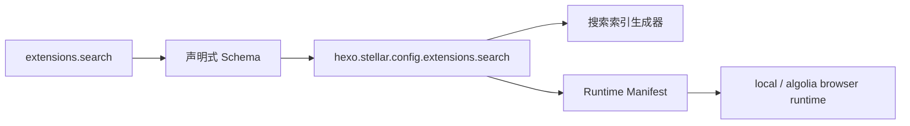

# 搜索功能

Stellar v2 的搜索配置属于 `extensions.search`。公开 YAML 使用注册式 provider ID，当前内置 `local` 与 `algolia`；解析后由冻结的 `hexo.stellar.config.extensions.search` 提供 camelCase ViewModel。

## 配置契约

```yaml
extensions:
  search:
    provider: local # local / algolia / null
    providers:
      local:
        scope: all # post / page / all
        include_content: true
        cache_ttl_seconds: 86400
      algolia:
        appId:
        apiKey:
        indexName:
```

`providers.local` 是 Stellar 封闭 Schema；`providers.algolia` 是第三方参数袋，保留 Algolia 上游字段名。索引固定输出 `/search.json`，客户端固定按首次需要懒加载；旧路径不兼容读取。

| 字段 | 说明 |
|------|------|
| `provider` | 激活的搜索实现；`null` 停用搜索插件 |
| `scope` | 索引 Post、Page 或两者 |
| `include_content` | 是否把全文写入索引 |
| `cache_ttl_seconds` | 本地搜索缓存秒数；`0` 不缓存 |

## 本地搜索

本地 provider 在 Hexo 构建期生成 JSON 索引。正文经过 HTML 清理后输出 `title/content/url/anchors`；标题锚点记录在正文中的 offset，搜索结果可携带 `?kw=` 与 hash 跳转到命中章节并高亮关键词。

客户端使用 `localStorage` 键 `search_cache_v4`：

- 首次聚焦搜索框时加载；新鲜缓存直接使用，过期缓存先展示后后台刷新。
- `cache_ttl_seconds: 0` 时不复用缓存。
- 请求失败时优先回退已有缓存；没有缓存则恢复可重试状态。

页面与集合是否进入索引只由 v2 `visibility.searchable` 控制。

## Algolia

Algolia provider 把 `appId/apiKey/indexName` 原样交给上游客户端。Algolia SDK 地址由主题内部 Extension 资源注册表提供，不属于公开配置，站点不能通过 `js` 字段替换。

## 公共交互

两种 provider 共用 `source/js/search/shortcut.js`。桌面端 `Command+K` 或 `Ctrl+K` 聚焦 `#search-input`；输入法组合、窄屏、无搜索框或其它编辑区域保持浏览器原生行为。结果卡片复用公共 collection surface 与 Card Hover 静态契约。

## 消费链



相关源码：[_config.yml](../../../_config.yml)、[scripts/generators/search.js](../../../scripts/generators/search.js)、[scripts/lib/browser-runtime.js](../../../scripts/lib/browser-runtime.js)、[source/js/runtime/extensions/search.mjs](../../../source/js/runtime/extensions/search.mjs)、[source/js/search/local-search.js](../../../source/js/search/local-search.js)、[source/js/search/algolia-search.js](../../../source/js/search/algolia-search.js)。
