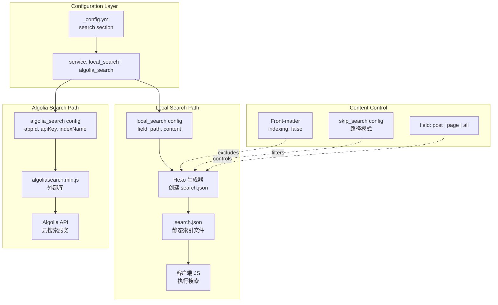
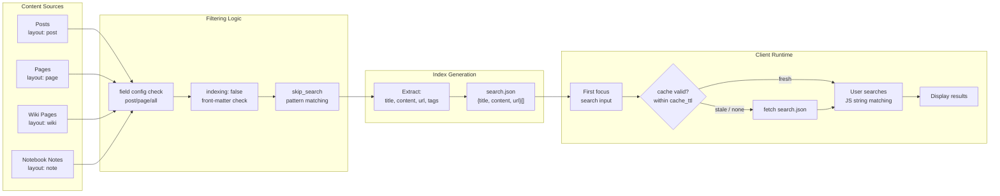
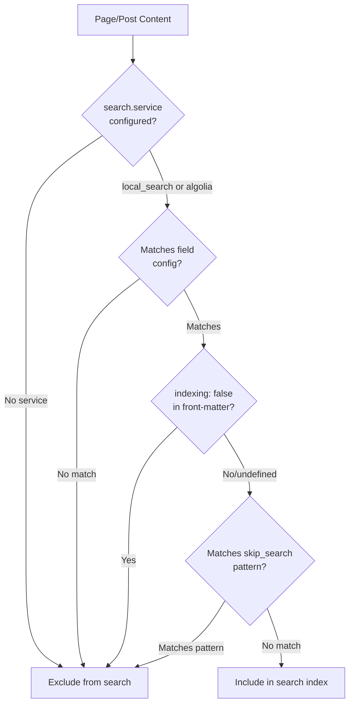

# 搜索功能

<details>
<summary>相关源码文件</summary>

生成此页面时参考的主题源码文件：

- [.github/workflows/npm-publish.yml](../../../.github/workflows/npm-publish.yml)
- [.npmignore](../../../.npmignore)
- [LICENSE](../../../LICENSE)
- [README.md](../../../README.md)
- [_config.yml](../../../_config.yml)
- [package.json](../../../package.json)
- [source/css/_components/sidebar/search.styl](../../../source/css/_components/sidebar/search.styl)
- [source/js/plugins/card-hover.js](../../../source/js/plugins/card-hover.js)
- [source/js/search/local-search.js](../../../source/js/search/local-search.js)
- [source/js/search/algolia-search.js](../../../source/js/search/algolia-search.js)
- [source/js/search/shortcut.js](../../../source/js/search/shortcut.js)

</details>

## 目的与范围

本文介绍集成在 Stellar 主题中的搜索功能，包括本地搜索与 Algolia 搜索实现：搜索索引如何生成、控制可搜索内容的配置项，以及两种搜索服务的运行差异。

其他外部集成见[评论系统](comment-systems.md)。

---

## 搜索服务架构

Stellar 支持两种经 `search.service` 设置配置的搜索实现：

| 服务 | 类型 | 说明 | 适用场景 |
|------|------|------|----------|
| `local_search` | 客户端 | 构建期生成静态 `search.json` 文件 | 中小站点、无外部依赖 |
| `algolia_search` | 外部 API | 用 Algolia 托管搜索服务 | 需要高级搜索功能的大型站点 |

搜索系统覆盖全部三种内容类型（博客、Wiki、笔记本），可在全局与页面级选择性启用/禁用。

**配置流程**



**参考源码**：[_config.yml](../../../_config.yml)

---

## 键盘激活

本地搜索与 Algolia 共用 `source/js/search/shortcut.js`：桌面布局按 `Command+K`（macOS）或 `Ctrl+K`（Windows / Linux）会聚焦 `#search-input`。处理器只在搜索框存在、移动端左栏按钮不可见且当前不处于其它编辑区域时阻止浏览器默认行为；输入法组合状态、窄屏、无搜索框、其它 `input` / `textarea` / `select` / `contenteditable` 均保持原生快捷键。

快捷键只调用 `focus()`，不会清空搜索词、改变现有选区或重置结果。搜索框已经聚焦时仍会阻止浏览器接管 `Command/Ctrl+K`。该行为没有配置项或可视提示。

**参考源码**：[layout/_plugins/index.ejs](../../../layout/_plugins/index.ejs)、[source/js/search/shortcut.js](../../../source/js/search/shortcut.js)

---

## 本地搜索系统

### 配置项

本地搜索系统在 Hexo 构建过程中生成静态 JSON 索引，配置于 `search.local_search` 小节：

```yaml
search:
  service: local_search
  local_search:
    field: all           # post, page, all
    path: /search.json   # 搜索索引输出路径
    content: true        # 索引中包含全文内容
    lazy_load: true      # 懒加载：首次聚焦搜索框时才请求搜索数据（默认开启）；站点内容较多时建议关闭，防止首次搜索卡顿
    cache_ttl: 86400     # 搜索数据缓存时长（秒），默认 1 天；设为 0 表示不缓存，建议按内容更新频率调整
    skip_search: []      # 排除的路径模式
```

**配置参数：**

| 参数 | 类型 | 选项 | 说明 |
|------|------|------|------|
| `field` | string | `post`、`page`、`all` | 搜索索引包含哪些内容类型 |
| `path` | string | 任意路径 | `search.json` 生成位置（相对站点根） |
| `content` | boolean | `true`、`false` | 索引是否包含完整文章/页面内容（增大文件但启用内容搜索） |
| `lazy_load` | boolean | `true`、`false` | 懒加载：页面加载不请求搜索数据，首次聚焦搜索框才加载（默认 `true`）；站点内容较多时建议关闭，防止首次搜索卡顿 |
| `cache_ttl` | number | 秒 | 搜索数据缓存时长，默认 `86400`（1 天）；`0` 表示不缓存、每次聚焦都请求，建议按内容更新频率调整 |
| `skip_search` | array | 路径模式 | 排除在搜索索引之外的路径模式列表 |

### 客户端加载与缓存

客户端搜索数据带有效期缓存（`localStorage` 键 `search_cache_v4`，结构 `{ ts, ttl, data }`）：

- `lazy_load: true`（默认）：页面加载时不请求 `/search.json`、不初始化搜索。首次聚焦搜索框时：缓存未过期 → 立即出结果且不发请求；缓存过期 → 先用旧数据出结果并后台静默刷新；无缓存 → 显示加载态（搜索图标绿色）并拉取，完成后初始化。
- `cache_ttl` 控制缓存有效期（秒）：未过期不发起网络请求；过期后后台刷新；`0` 表示不缓存、每次聚焦都请求。
- 请求失败时回退已有缓存；无缓存则清除加载态并告警，再次聚焦可重试。
- `lazy_load: false` 时保持页面加载预取，但缓存新鲜时同样不重复请求。

内容较多的站点建议关闭懒加载（`lazy_load: false`），避免首次搜索时等待索引加载；`cache_ttl` 建议按内容更新频率调整（更新频繁可调小，更新稀少可调大，`0` 表示不缓存）。

### 搜索索引生成

搜索索引在 Hexo 构建期间生成，包含全部可搜索内容的结构化数据：

**本地搜索数据流水线**



### field 选项

`field` 参数控制搜索索引包含的内容类型：

- **`post`**：仅博客文章（`layout: post` 或 `layout: topic` 的页面）
- **`page`**：仅独立页面（`layout: page`）
- **`all`**：全部内容类型，包括文章、页面、wiki 页面与笔记本笔记

影响可搜索内容范围与生成的 `search.json` 文件大小。

### 内容索引行为

`content: true` 时搜索索引包含每页全文，启用基于内容的搜索。生成的 `search.json` 结构通常为：

```json
[
  {
    "title": "Page Title",
    "content": "Full page content text...",
    "url": "/path/to/page/",
    "anchors": [
      { "id": "section-id", "text": "Section Title", "offset": 18 }
    ]
  },
  ...
]
```

`anchors` 为可选字段：有标题的页面会输出章节锚点（`id` 为标题锚点、`offset` 为标题文本在 `content` 中的起始位置），无标题页面省略。客户端按锚点把结果拆分为章节：每个命中章节生成一条结果（显示页面标题 + 章节名），点击链接携带 `?kw=<关键词>` 与 `#<锚点>` 直接跳转到对应章节；目标页加载后会用黄色 mark 高亮关键词。

`content: false` 时只索引标题与 URL，显著减小文件但搜索仅限标题匹配。

### 结果卡片交互

本地搜索与 Algolia 使用一致的结果结构：页面标题位于链接上方，不参与跳转；章节名与摘要位于链接内。链接静止时即通过 `.ui-collection-adapter` 使用所在 surface 原本的 hover 背景与阴影：glass 显示半透明顶部光照和高光边，card/sidebar/content 使用对应实色反馈。

启用 `plugins.card_hover` 后，只有链接组合 `.card-hover.card-hover--spotlight`，hover 仅叠加鼠标跟随光斑，不产生上浮或 3D 倾斜；页面标题保持静止。搜索每次替换结果前通过 `stellar.cardHover.unmountAll(resultArea)` 清理旧链接，插入后再用 `mountAll(resultList)` 挂载新链接。插件关闭、脚本失败、粗指针或减少动态效果时保留静态玻璃背景与原有跳转。

**参考源码**：[_config.yml](../../../_config.yml)、[source/js/search/local-search.js](../../../source/js/search/local-search.js)

---

## Algolia 搜索集成

Algolia 提供更高级的云端搜索方案，适合大型站点或需要拼写容错、分面搜索、分析等功能的场景。

### 配置

```yaml
search:
  service: algolia_search
  algolia_search:
    appId: YOUR_APP_ID
    apiKey: YOUR_SEARCH_API_KEY
    indexName: YOUR_INDEX_NAME
    js: https://gcore.jsdelivr.net/algoliasearch/3/algoliasearch.min.js
```

**配置参数：**

| 参数 | 类型 | 说明 |
|------|------|------|
| `appId` | string | Algolia 应用 ID（Algolia 控制台获取） |
| `apiKey` | string | 仅搜索 API 密钥（公开，客户端使用安全） |
| `indexName` | string | Algolia 中搜索索引名 |
| `js` | URL | Algolia 搜索库的 CDN URL |

### Algolia 设置要求

使用 Algolia 搜索：

1. **申请 Algolia Docsearch**：访问 https://docsearch.algolia.com/apply/ 申请免费 Docsearch 服务
2. **配置索引**：在 Algolia 控制台设置搜索索引
3. **填充索引**：用 Algolia crawler 或 API 填充内容
4. **添加凭据**：把 `appId`、`apiKey`、`indexName` 复制到主题配置

与本地搜索不同，Algolia 需要外部设置，索引托管在 Algolia 服务器而非生成静态文件。

**参考源码**：[_config.yml](../../../_config.yml)、[source/js/search/algolia-search.js](../../../source/js/search/algolia-search.js)

---

## 控制搜索收录

### 页面级 front-matter 控制

单个页面可在 front-matter 中设置 `indexing: false` 排除在搜索索引之外：

```yaml
---
title: Private Page
indexing: false
---
```

无论其他配置如何，该页面都不会出现在搜索索引中。

### skip_search 配置

`skip_search` 数组允许按路径模式排除内容：

```yaml
search:
  local_search:
    skip_search:
      - /draft/*
      - /private/*
      - /temp-notes/*
```

`skip_search` 中的路径模式与内容路径匹配，匹配内容在生成时排除出搜索索引。

### 收录控制流程



**参考源码**：[_config.yml](../../../_config.yml)

---

## 本地搜索与 Algolia 对比

| 特性 | 本地搜索 | Algolia 搜索 |
|------|----------|--------------|
| **设置复杂度** | 简单（仅配置） | 需要外部账户与设置 |
| **成本** | 免费 | 有免费档，大用量付费 |
| **性能** | 客户端处理，随内容规模伸缩 | 服务端处理，稳定快速 |
| **索引位置** | 站点提供的静态文件 | 托管在 Algolia 服务器 |
| **搜索特性** | 基础字符串匹配 | 高级（拼写容错、分面、分析） |
| **离线支持** | 可能（索引在本地） | 需要联网 |
| **文件体积影响** | 随内容增长（尤其 `content: true`） | 无本地文件开销 |
| **隐私** | 全部搜索在客户端 | 搜索查询发送给 Algolia |
| **实时更新** | 需要重建站点 | 可独立更新索引 |

**建议**：中小站点用本地搜索（简单、隐私优先）；大型站点用 Algolia（高级搜索特性、性能与内容规模无关）。

**参考源码**：[_config.yml](../../../_config.yml)

---

## 与内容系统的集成

搜索是跨全部三种内容系统的统一功能：

- **博客系统**：搜索文章标题与内容
- **Wiki 系统**：搜索所有项目中的文档页
- **笔记本系统**：搜索所有笔记本中的单条笔记

搜索功能尊重 `menu_id` 系统，可用 `field` 配置参数按内容类型过滤。

**参考源码**：[_config.yml](../../../_config.yml)
