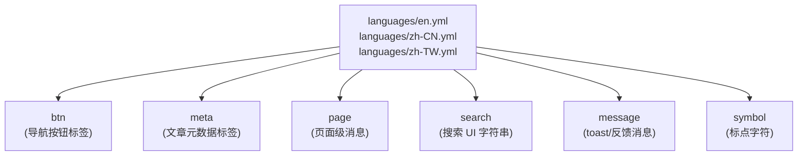
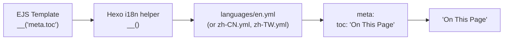
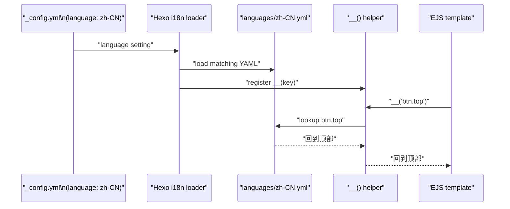

# 本地化系统

<details>
<summary>相关源码文件</summary>

生成此页面时参考的主题源码文件：

- [languages/en.yml](../../../languages/en.yml)
- [languages/zh-CN.yml](../../../languages/zh-CN.yml)
- [languages/zh-TW.yml](../../../languages/zh-TW.yml)
- [layout/_partial/menubtn.ejs](../../../layout/_partial/menubtn.ejs)
- [layout/_partial/widgets/toc.ejs](../../../layout/_partial/widgets/toc.ejs)

</details>

本页介绍 hexo-theme-stellar 的国际化（i18n）基础设施：语言文件格式、可用翻译键、模板如何访问翻译字符串、如何添加新语言。搜索 UI 字符串见[搜索功能](../07-外部集成/search.md)；使用 `page.error.*` 键的错误页见[错误页](../03-内容系统/error-pages.md)。

---

## 概览

主题使用 Hexo 内置 i18n 系统。语言文件位于 `languages/` 目录。渲染时 Hexo 按站点 `_config.yml` 的 `language` 设置选择对应文件，并向所有 EJS 模板暴露 `__()` 辅助函数，把点分键路径解析为本地化字符串。

**随附语言文件：**

| 文件 | 语言 |
|------|------|
| `languages/en.yml` | 英语 |
| `languages/zh-CN.yml` | 简体中文 |
| `languages/zh-TW.yml` | 繁体中文 |

---

## 文件结构

每个语言文件是扁平的 YAML 文档，组织为六个顶层分组。每个文件必须定义相同键；缺失键按 Hexo 默认行为回退到 `en.yml` 的值。

**语言文件分组映射：**



**参考源码**：[languages/en.yml](../../../languages/en.yml)、[languages/zh-CN.yml](../../../languages/zh-CN.yml)、[languages/zh-TW.yml](../../../languages/zh-TW.yml)

---

## 键组参考

### `btn`——导航按钮标签

用于导航栏、侧边栏与文章页脚中的按钮。

| 键 | `en.yml` 值 | 说明 |
|----|-------------|------|
| `btn.home` | `Home` | |
| `btn.blog` | `Blog` | |
| `btn.wiki` | `Wiki` | |
| `btn.topic` | `Topic` | |
| `btn.notebook` | `Notebook` | |
| `btn.recent_publish` | `Recent` | |
| `btn.all_wiki` | `All Products` | |
| `btn.category` | `Category` | 单数 |
| `btn.categories` | `Categories` | 复数 |
| `btn.tag` | `Tag` | 单数 |
| `btn.tags` | `Tags` | 复数 |
| `btn.archives` | `Archives` | |
| `btn.all_posts` | `All Posts` | |
| `btn.getting_started` | `Getting Started` | |
| `btn.docs` | `Documentation` | Wiki Hero 内置文档按钮 |
| `btn.source` | `Source` | Wiki Hero 仓库按钮 |
| `btn.copy` | `Copy` | Wiki Hero 终端复制按钮及其辅助标签 |
| `btn.edit` | `Edit This Page` | |
| `btn.top` | `Scroll to Top` | 用于 TOC 组件页脚 |
| `btn.comments` | `Join Discussion` | 用于 TOC 组件页脚 |

**参考源码**：[languages/en.yml](../../../languages/en.yml)

---

### `meta`——文章元数据标签

用于文章页头、页脚、侧边栏与 TOC 组件。

| 键 | `en.yml` 值 | 说明 |
|----|-------------|------|
| `meta.recent_update` | `Recent Update` | |
| `meta.tag_tree` | `Tags` | |
| `meta.all_notes` | `All Notes` | |
| `meta.toc` | `On This Page` | TOC 组件标题 |
| `meta.read_next` | `READ NEXT` | |
| `meta.prev` | `Prev` | |
| `meta.next` | `Next` | |
| `meta.older` | `Older` | |
| `meta.newer` | `Newer` | |
| `meta.references` | `References` | |
| `meta.related_posts` | `Related Posts` | |
| `meta.back_to_top` | `Back to top` | |
| `meta.more` | `More` | |
| `meta.created_author` | `'%s posted on'` | `%s` = 作者名（见插值） |
| `meta.created` | `'Posted on'` | |
| `meta.updated` | `'Updated on'` | |
| `meta.license` | `License` | |
| `meta.share` | `Share` | |
| `meta.contributors` | `Page Contributors` | |
| `meta.available` | `Available for` | Wiki 卡片适用范围标签 |
| `meta.wiki_project` | `Wiki project` | Wiki Hero 导航辅助标签 |
| `meta.project_preview` | `Project preview` | Wiki Hero 预览区辅助标签 |
| `meta.install_method` | `Installation method` | Wiki Hero 终端标签组辅助标签 |
| `meta.command` | `Command %s` | Wiki Hero 未命名命令标签；`%s` = 序号 |
| `meta.date_suffix.just` | `Just` | 相对时间 |
| `meta.date_suffix.min` | `minutes ago` | 相对时间 |
| `meta.date_suffix.hour` | `hours ago` | 相对时间 |
| `meta.date_suffix.day` | `days ago` | 相对时间 |
| `meta.date_suffix.month` | `months ago` | 相对时间 |

**参考源码**：[languages/en.yml](../../../languages/en.yml)

---

### `page`——页面级消息

目前只定义 404 错误页字符串。

| 键 | `en.yml` 值 |
|----|-------------|
| `page.error.what` | `Page Not Found` |
| `page.error.why` | `The address may be entered incorrectly or the address has been deleted.` |
| `page.error.action` | `Back to Home` |

**参考源码**：[languages/en.yml](../../../languages/en.yml)

---

### `search`——搜索 UI 字符串

| 键 | `en.yml` 值 | 说明 |
|----|-------------|------|
| `search.search` | `Search` | 输入框占位符 |
| `search.search_in` | `Search in %s` | `%s` = 站点/区块名 |
| `search.no_results` | `No Results!` | 空状态消息 |

**参考源码**：[languages/en.yml](../../../languages/en.yml)

---

### `message`——Toast 与反馈消息

| 键 | `en.yml` 值 | 说明 |
|----|-------------|------|
| `message.copied` | `Copied!` | 复制到剪贴板后 |
| `message.fetching_latest_release` | `'%s is fetching the latest release…'` | 历史兼容键；Wiki Hero 已改为无文字加载态，当前不再使用 |
| `message.theme_switched.light` | `Switched to Light Mode` | |
| `message.theme_switched.dark` | `Switched to Dark Mode` | |
| `message.theme_switched.auto` | `Switched to Auto Mode` | |

**参考源码**：[languages/en.yml](../../../languages/en.yml)

---

### `symbol`——标点字符

这些键提供适合语言环境的标点。东亚语言用全角标点，英语用标准 ASCII。

| 键 | English | Chinese |
|----|---------|---------|
| `symbol.comma` | `, ` | `，` |
| `symbol.period` | `. ` | `。` |
| `symbol.colon` | `: ` | `：` |
| `symbol.brackets_l` | `(` | `（` |
| `symbol.brackets_r` | `)` | `）` |

**参考源码**：[languages/en.yml](../../../languages/en.yml)、[languages/zh-CN.yml](../../../languages/zh-CN.yml)

---

## `__()` 辅助函数

Hexo 在所有 EJS 模板中注册全局 `__()` 辅助函数，接受点分键路径，返回当前站点语言的本地化字符串。

**签名：**

```
__(key: string, ...args: string[]): string
```

**代码库中的模板用法示例：**

- `__("meta.toc")`——解析 TOC 组件标题
- `__('btn.top')`——解析回到顶部按钮标签
- `__('btn.comments')`——解析评论按钮标签

**键路径解析：**



**参考源码**：[layout/_partial/widgets/toc.ejs](../../../layout/_partial/widgets/toc.ejs)

---

## `%s` 插值

部分键含 `%s` 作为 sprintf 风格的位置占位符。模板中使用该键时向 `__()` 传第二个参数填充。

**使用 `%s` 的键：**

| 键 | 模板 | 示例输出 |
|----|------|----------|
| `meta.created_author` | `'%s posted on'` | `xaoxuu posted on` |
| `search.search_in` | `'Search in %s'` | `Search in My Blog` |

`%s` 令牌由 Hexo i18n 的 sprintf 实现替换（调用方传额外参数给 `__()`）。

**模板用法模式：**

```
__('meta.created_author', author.name)
// => "本文由 xaoxuu 发布于"  (zh-CN)
```

**参考源码**：[languages/en.yml](../../../languages/en.yml)、[languages/zh-CN.yml](../../../languages/zh-CN.yml)

---

## 语言选择机制



站点 `language` 配置值（如 `zh-CN`）直接匹配 `languages/` 下的文件名前缀。Hexo 对所选文件缺失的任何键处理回退到 `en.yml`。

**参考源码**：[languages/en.yml](../../../languages/en.yml)、[languages/zh-CN.yml](../../../languages/zh-CN.yml)

---

## 添加新语言

添加新语言（如日语 `ja`）的步骤：

1. 创建 `languages/ja.yml`
2. 以 `languages/en.yml` 完整结构为模板复制——六个键组必须齐全
3. 翻译每个值，特别注意：
   - `meta.created_author` 与 `search.search_in` 中的 `%s` 占位符——翻译字符串中必须保留
   - `symbol.*` 键——使用适合语言环境的标点
4. 在站点 `_config.yml` 设置 `language: ja`

**新语言文件的最小清单：**

| 组 | 要翻译的键 |
|----|------------|
| `btn` | 18 个键 |
| `meta` | 19 个键 + 5 个 `date_suffix` 子键 |
| `page` | `page.error` 下 3 个键 |
| `search` | 3 个键 |
| `message` | 4 个键 |
| `symbol` | 5 个标点键 |

**参考源码**：[languages/en.yml](../../../languages/en.yml)

---

## 键到模板的交叉引用

```mermaid
flowchart TD
  en["languages/en.yml"]

  subgraph "btn group"
    btntop["btn.top"]
    btncomments["btn.comments"]
  end

  subgraph "meta group"
    metatoc["meta.toc"]
    metacreated["meta.created"]
    metaupdated["meta.updated"]
    metalicense["meta.license"]
    metareadnext["meta.read_next"]
    metacreatedauthor["meta.created_author\n(%s = author)"]
  end

  subgraph "search group"
    searchsearch["search.search"]
    searchin["search.search_in\n(%s = site name)"]
    searchnoresults["search.no_results"]
  end

  subgraph "page group"
    pageerror["page.error.what\npage.error.why\npage.error.action"]
  end

  subgraph "message group"
    msgcopied["message.copied"]
    msgtheme["message.theme_switched.*"]
  end

  en --> btntop
  en --> btncomments
  en --> metatoc
  en --> metacreated
  en --> metaupdated
  en --> metalicense
  en --> metareadnext
  en --> metacreatedauthor
  en --> searchsearch
  en --> searchin
  en --> searchnoresults
  en --> pageerror
  en --> msgcopied
  en --> msgtheme

  btntop --> toc["layout/_partial/widgets/toc.ejs"]
  btncomments --> toc
  metatoc --> toc
  metacreated --> article_footer["layout/_partial/main/article/article_footer.ejs"]
  metaupdated --> article_footer
  metalicense --> article_footer
  metacreatedauthor --> article_footer
  metareadnext --> read_next["layout/_partial/main/article/read_next.ejs"]
  searchsearch --> search_ui["search widget"]
  searchin --> search_ui
  searchnoresults --> search_ui
  pageerror --> error_page["layout/404.ejs"]
  msgcopied --> copycode["client-side copycode JS"]
  msgtheme --> theme_switch["client-side theme switch JS"]
```



**参考源码**：[languages/en.yml](../../../languages/en.yml)、[layout/_partial/widgets/toc.ejs](../../../layout/_partial/widgets/toc.ejs)
