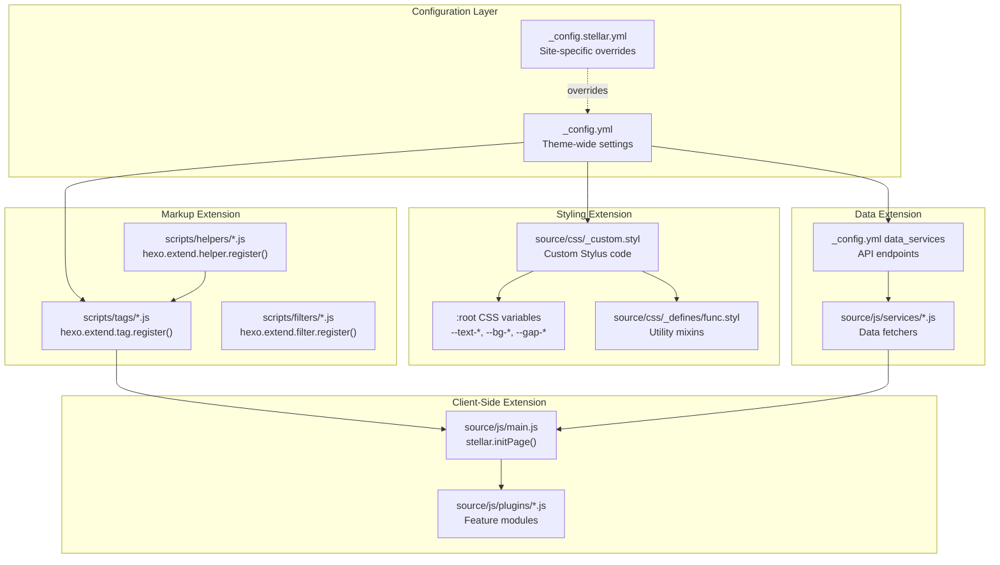
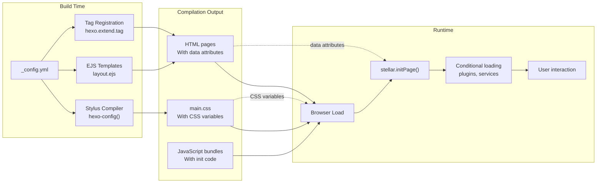
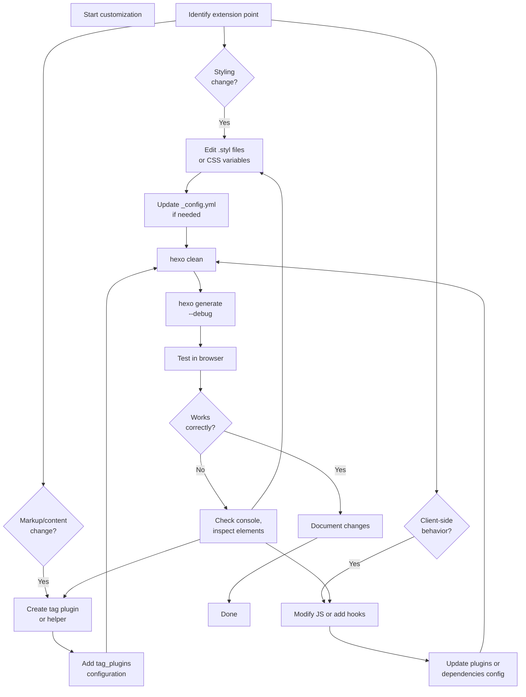

# 高级主题

<details>
<summary>相关源码文件</summary>

生成此页面时参考的主题源码文件：

- [_config.yml](../../../_config.yml)
- [source/css/_custom.styl](../../../source/css/_custom.styl)
- [source/css/_defines/func.styl](../../../source/css/_defines/func.styl)
- [source/js/main.js](../../../source/js/main.js)
- [package.json](../../../package.json)

</details>

本节面向想超越基础配置修改 Stellar 的开发者，介绍高级定制技术与扩展点：主题扩展架构概览、自定义样式、标签插件开发与性能优化指南。

基础主题配置见[配置系统](../00-总览与安装配置/configuration.md)；内建插件与特性见[外部集成总览](../07-外部集成/integrations-overview.md)。

---

## 主题扩展架构

Stellar 在系统不同层提供多个扩展点，无需修改主题核心文件即可定制。

**主题扩展点与文件位置**



**参考源码**：[_config.yml](../../../_config.yml)、[source/css/_custom.styl](../../../source/css/_custom.styl)、[source/css/_defines/func.styl](../../../source/css/_defines/func.styl)

## 定制层概览

主题定制系统跨三个主要层运行：样式、标记与客户端行为。

**定制层交互模型**



**参考源码**：[source/css/_custom.styl](../../../source/css/_custom.styl)、[layout/layout.ejs](../../../layout/layout.ejs)

### 第 1 层：样式系统

样式层用带令牌设计系统的 Stylus，可经以下方式定制：

- **设计令牌**：定义于 [source/css/_custom.styl](../../../source/css/_custom.styl)
- **CSS 自定义属性**：`:root` 选择器中的运行时变量
- **工具混入**：[source/css/_defines/func.styl](../../../source/css/_defines/func.styl) 中的可复用函数

关键扩展点：

- 覆盖 `$fs-*`、`$border-*`、`$c-*` 变量做全局修改
- 定制 `trans*()`、`newblur()`、`hoverable-card()` 混入效果
- 修改 `--gap-*`、`--width-*` CSS 变量做响应式行为

详细技巧见[自定义样式与主题覆盖](custom-styling-overrides.md)。

### 第 2 层：标记生成

标记层处理内容文件并生成 HTML：

- **标签插件**：经 `scripts/tags/` 的 `hexo.extend.tag.register()` 扩展 Markdown 语法
- **辅助函数**：经 `scripts/helpers/` 的 `hexo.extend.helper.register()` 提供模板函数
- **过滤器**：经 `scripts/filters/` 的 `hexo.extend.filter.register()` 处理内容

关键扩展点：

- 为新的内容类型创建自定义 `` 标签
- 添加模板工具辅助函数
- 注册过滤器在生成时转换内容

实现模式见[创建自定义标签插件](custom-tag-plugins.md)。

### 第 3 层：客户端行为

客户端层处理交互与动态特性：

- **stellar.initPage()**：来自 [source/js/main.js](../../../source/js/main.js) 的主初始化函数
- **条件加载**：基于页面内容的按需脚本加载
- **整页导航**：普通页面加载（PJAX 已移除）

关键扩展点：

- 挂接 `stellar.initPage()` 做自定义初始化
- 添加新特性的条件加载器

加载策略见[性能优化](performance.md)。

---

## 扩展点参考

常见定制任务与对应扩展点：

| 任务 | 扩展点 | 关键文件 | 配置 |
|------|--------|----------|------|
| **改颜色/字体** | 设计令牌 | [source/css/_custom.styl](../../../source/css/_custom.styl) | `style.color`、`style.font-family` |
| **添加 CSS 效果** | 工具混入 | [source/css/_defines/func.styl](../../../source/css/_defines/func.styl) | N/A |
| **自定义侧边栏背景** | 组件样式 | `source/css/_components/sidebar/sidebar.styl` | `style.leftbar.background-image` |
| **新 Markdown 语法** | 标签插件 | `scripts/tags/lib/*.js` | `tag_plugins.*` |
| **自定义小部件** | 小部件系统 | `layout/_partial/widgets/*.ejs` | `_data/widgets.yml` |
| **外部 API 数据** | 数据服务 | `source/js/services/*.js` | `data_services.*` |
| **修改页面初始化** | 主 JS | [source/js/main.js](../../../source/js/main.js) | N/A |
| **添加搜索功能** | 搜索服务 | `source/js/search/*.js` | `search.local_search` |
| **自定义评论系统** | 评论集成 | `layout/_partial/comments/*.ejs` | `comments.service` |

**参考源码**：[_config.yml](../../../_config.yml)

---

## 开发工作流

**主题定制典型开发周期**



### 快速开始命令

```bash
# 带自动重载的开发服务器
hexo server --debug

# 测试前清理缓存
hexo clean && hexo generate

# 检查 Stylus 编译错误
hexo generate --debug 2>&1 | grep -i stylus

# 验证配置语法
node -e "console.log(require('js-yaml').load(require('fs').readFileSync('_config.yml')))"
```

---

## 子主题概览

本节概览三个主要高级主题，详细实现指南见各专属页面。

### 10.1 自定义样式与主题覆盖

自定义主题外观的技巧：

- 覆盖设计令牌与 CSS 变量
- 创建自定义 Stylus 混入与函数
- 扩展组件样式（侧边栏、导航栏、卡片）
- 用 `hexo-config()` 做条件编译
- 主题继承模式

关键概念：设计令牌系统、CSS 自定义属性、Stylus 编译、组件架构。

### 10.2 创建自定义标签插件

扩展 Markdown 语法的模式：

- 用 `hexo.extend.tag.register()` 注册标签插件
- 用 `ctx.args.map()` 解析参数
- 带 `{ends: true}` 选项的块标签
- 在标签插件中访问主题配置
- 用 Stylus 样式化自定义标签插件

关键概念：Hexo 插件系统、参数解析、HTML 生成、主题集成。

### 10.3 性能优化

优化策略与最佳实践：

- 图片与脚本的懒加载配置
- 基于页面内容的插件条件加载
- CDN 配置与缓存策略
- preload 预加载与导航优化
- 构建期性能改进

关键概念：多层加载、按需资源、缓存策略、性能监控。

---

## 开发依赖

主题需要以下构建期依赖（安装主题时自动安装，另有 `glob`）：

| 包 | 版本 | 用途 |
|----|------|------|
| `hexo-renderer-ejs` | ^2.0.0 | EJS 模板渲染 |
| `hexo-renderer-stylus` | ^3.0.1 | Stylus CSS 预处理 |
| `cheerio` | ^1.1.0 | 生成器 HTML 解析 |
| `probe-image-size` | ^7.2.3 | 懒加载图片尺寸检测 |
| `glob` | ^10.4.0 | 文件通配匹配 |

主题兼容 Hexo 6.3.0 及以上版本（已验证至 8.1.2）。

**参考源码**：[package.json](../../../package.json)、[README.md](../../../README.md)

---

## 许可与署名

Stellar 主题以 MIT 协议发布，允许在正确署名下自由使用、修改与分发。主题包含对外部图标库与第三方服务的致谢。

扩展主题或创建插件时，在代码中保留署名注释，保持贡献链并帮助其他开发者理解代码来源。

**参考源码**：[LICENSE](../../../LICENSE)
