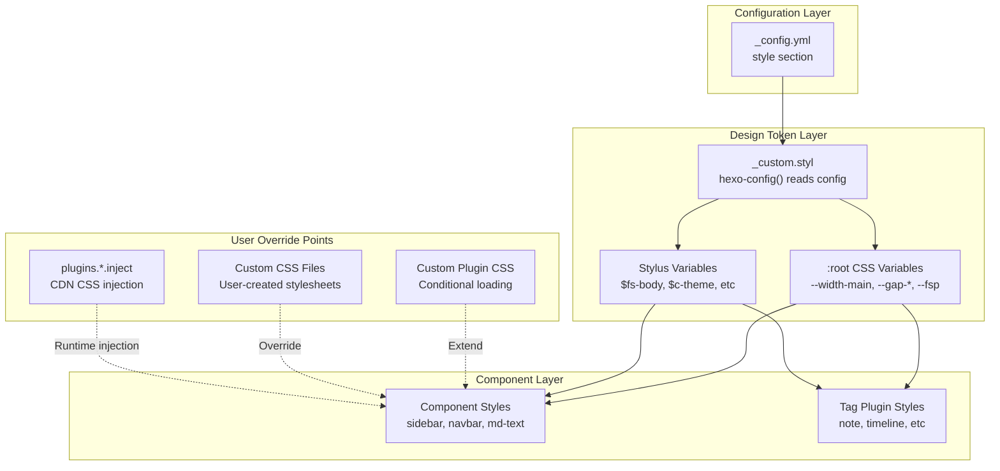
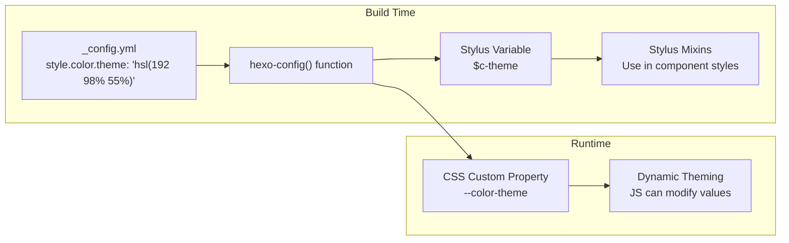
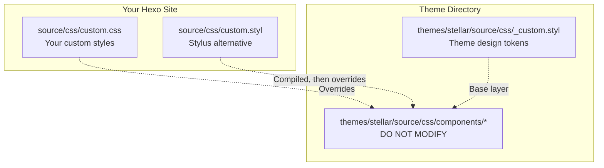
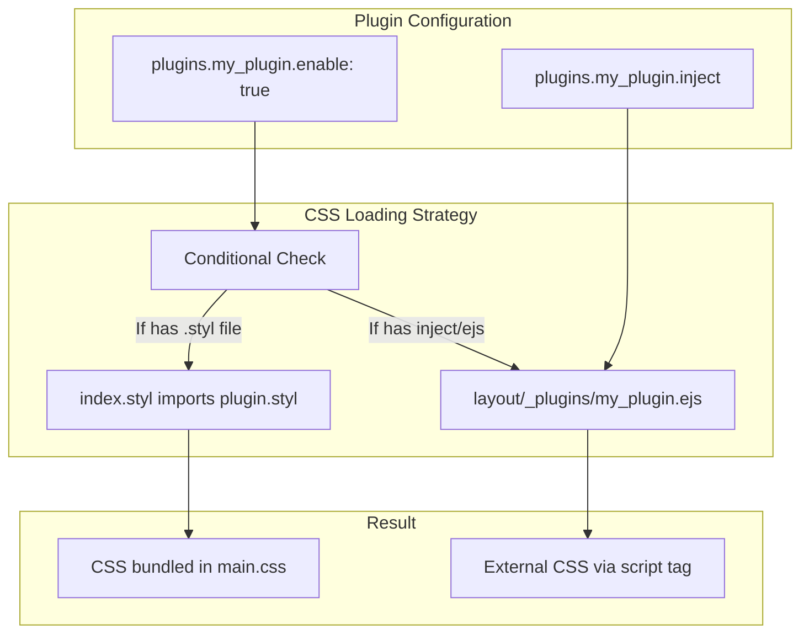
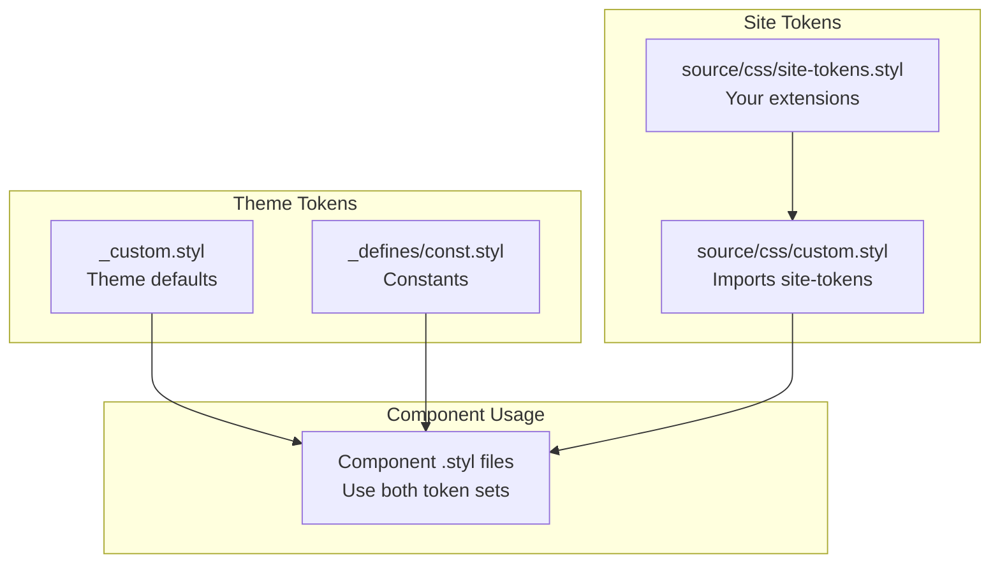

# 自定义样式与主题覆盖

<details>
<summary>相关源码文件</summary>

生成此页面时参考的主题源码文件：

- [.github/workflows/npm-publish.yml](../../../.github/workflows/npm-publish.yml)
- [.npmignore](../../../.npmignore)
- [LICENSE](../../../LICENSE)
- [README.md](../../../README.md)
- [_config.yml](../../../_config.yml)
- [package.json](../../../package.json)
- [source/css/_custom.styl](../../../source/css/_custom.styl)

</details>

本文介绍无需修改主题核心文件即可定制 Stellar 外观的技巧：覆盖默认样式、注入自定义 CSS、创建自定义样式插件、扩展设计令牌系统，在保持可升级性的同时实现期望的视觉效果。

内建设计令牌系统与 CSS 变量见[设计令牌与 CSS 变量](../01-样式系统/design-tokens.md)；排版、颜色与响应式配置分别见[排版系统](../01-样式系统/typography.md)、[颜色与深色模式](../01-样式系统/colors-dark-mode.md)与[响应式设计](../01-样式系统/responsive-design.md)。

---

## 样式架构概览

Stellar 实现四级样式级联，无需修改主题源码即可在多个层面定制。



**定制发生在三个层面：**

1. **配置层**：修改 `_config.yml` 中 `style` 小节的值
2. **覆盖点**：注入自定义 CSS 或创建覆盖文件
3. **扩展点**：创建带条件 CSS 加载的新插件

**参考源码**：[_config.yml](../../../_config.yml)、[source/css/_custom.styl](../../../source/css/_custom.styl)

---

## 基于配置的样式定制

定制主题外观的主要方式是通过 `_config.yml` 的 `style` 小节。该方法无需创建文件且兼容主题更新。

### 可用配置项

| 配置键 | 用途 | 示例值 |
|--------|------|--------|
| `style.prefers_theme` | 初始主题模式 | `auto`、`light`、`dark` |
| `style.font-size.root` | 基准字号（影响全部 rem 单位） | `16px`、`18px` |
| `style.font-size.body` | 正文字号 | `17px`、`1.0625rem` |
| `style.font-family.body` | 正文字体栈 | 系统字体或自定义 |
| `style.color.theme` | 主题主色 | `hsl(192 98% 55%)` |
| `style.color.accent` | 强调色 | `hsl(14 100% 57%)` |
| `style.border-radius.card` | 卡片圆角 | `16px`、`8px`、`0px` |
| `style.leftbar.background-image` | 侧边栏背景图 | 图片 URL 或空 |

### 示例定制

**增大整体字号：**

```yaml
style:
  font-size:
    root: 18px      # 影响所有 rem 尺寸
    body: 18px      # 正文字号
```

**更改主题颜色：**

```yaml
style:
  color:
    theme: 'hsl(280 80% 60%)'    # 紫色主题
    accent: 'hsl(30 100% 50%)'   # 橙色强调
    link: 'hsl(280 80% 60%)'     # 紫色链接
```

**减小圆角更锐利：**

```yaml
style:
  border-radius:
    card-l: 8px
    card: 4px
    card-s: 2px
    bar: 2px
```

**禁用侧边栏背景图：**

```yaml
style:
  leftbar:
    background-image: # 留空使用纯色
    background-color-light: var(--card)
    background-color-dark: var(--card)
```

这些配置值由 `_custom.styl` 在构建期用 `hexo-config()` 消费，编译为 Stylus 变量与 CSS 自定义属性。

**参考源码**：[_config.yml](../../../_config.yml)、[source/css/_custom.styl](../../../source/css/_custom.styl)

---

## 理解设计令牌流

主题经多阶段转换过程把配置值转换为可用 CSS。



**关键转换点：**

1. **YAML 到 Stylus**：`hexo-config('style.font-size.body')` → `$fs-body` 变量
2. **Stylus 到 CSS 属性**：`:root { --fsp: $fs-body }` → 运行时 CSS 变量
3. **组件消费**：组件用 `$fs-body`（静态）或 `var(--fsp)`（动态）

**参考源码**：[source/css/_custom.styl](../../../source/css/_custom.styl)

---

## 用于运行时主题化的 CSS 自定义属性

主题在 `:root` 选择器暴露 CSS 自定义属性，可经 JavaScript 动态修改或在自定义 CSS 中覆盖。

### 核心 CSS 变量

```stylus
:root
  // 布局尺寸
  --width-main: 720px
  --side-content-width: 224px
  
  // 间距
  --gap-base: 16px  // 组件内部基础间距（固定）
  --gap-page: 16px  // 页面级留白；≥laptop 自动放宽为 32px
  
  // 排版
  --fsp: $fs-body
  --fsh2: 'calc(%s + 11px)' % var(--fsp)
  --fsh3: 'calc(%s + 7px)' % var(--fsp)
  --fsh4: 'calc(%s + 4px)' % var(--fsp)
  
  // 段落间距
  --gap-p: 'calc(%s + 4px)' % $fs-body
  --gap-p-compact: 'calc(%s * 0.75)' % $fs-body
```

这些变量随媒体查询自动响应。例如 `--side-content-width` 随视口大小调整；间距令牌分两级：`--gap-base` 固定 16px（组件内部间距），`--gap-page` 按断点分档（≤`$device-laptop`/1180px 为 16px，≥1180px 为 32px）控制页面级留白。

### 覆盖 CSS 变量

创建自定义 CSS 文件覆盖这些值：

```css
/* 更宽的主内容区 */
:root {
  --width-main: 860px;
  --side-content-width: 280px;
}

/* 更紧凑的间距 */
:root {
  --gap-base: 12px;
  --gap-page: 24px;
}

/* 更大的标题 */
:root {
  --fsh2: calc(var(--fsp) + 16px);
  --fsh3: calc(var(--fsp) + 12px);
}
```

主题间距令牌默认已分档；若自定义 CSS 加载在主题之后，上述覆盖会全局生效（覆盖所有分档）。

**参考源码**：[source/css/_custom.styl](../../../source/css/_custom.styl)

---

## 经配置注入自定义 CSS

插件配置中的 `inject` 字段允许插入外部 CSS 文件，无需创建主题文件。

### 使用 Inject 块

```yaml
plugins:
  custom_styles:
    enable: true
    inject: |
      <link rel="stylesheet" href="/css/my-custom-styles.css">
      <link rel="stylesheet" href="https://cdn.example.com/custom-theme.css">
```

`inject` 块接受原始 HTML，插入页面 `<head>`。适合：

- 从 CDN 加载外部样式表
- 包含站点 `source/` 目录的自定义 CSS 文件
- 添加厂商前缀或 polyfill

### 示例：自定义 KaTeX 样式

主题对 KaTeX 集成使用此方式：

```yaml
plugins:
  katex:
    enable: true
    inject: |
      <link rel="stylesheet" href="https://cdn.jsdelivr.net/npm/katex@0.16.23/dist/katex.min.css" crossorigin="anonymous">
```

**参考源码**：[_config.yml](../../../_config.yml)

---

## 创建自定义 CSS 文件

大幅定制时，在 Hexo 站点的 `source/` 目录创建专属 CSS 文件（这些是**用户站点**文件，不属于主题仓库）。

### 文件放置策略



**推荐结构：**

1. **`source/css/custom.css`**：纯 CSS 覆盖
2. **`source/css/custom.styl`**：可访问主题混入的 Stylus
3. **`source/css/custom-dark.css`**：深色模式专属覆盖

### 示例：自定义 CSS 文件

**文件：`source/css/custom.css`**

```css
/* 覆盖卡片样式 */
.md-text .card {
  background: linear-gradient(135deg, #667eea 0%, #764ba2 100%);
  border: none;
  padding: 2rem;
}

/* 定制代码块 */
.highlight {
  border-radius: 0;
  box-shadow: 0 4px 12px rgba(0, 0, 0, 0.15);
}

/* 调整侧边栏 */
#l_left .widget {
  backdrop-filter: blur(20px) saturate(180%);
  background-color: rgba(255, 255, 255, 0.05);
}
```

**在配置中引用：**

```yaml
plugins:
  custom_theme:
    enable: true
    inject: <link rel="stylesheet" href="/css/custom.css">
```

**参考源码**：[_config.yml](../../../_config.yml)

---

## 创建自定义样式插件

主题支持经插件配置条件加载 CSS，可创建只在启用时加载的可复用样式包。

### 插件 CSS 架构



### 方法 1：Stylus 插件（打包）

**步骤 1：创建插件 Stylus 文件**（用户站点文件）

**文件：`source/css/plugins/my-theme-plugin.styl`**

```stylus
.my-custom-layout
  background: linear-gradient(45deg, $c-theme, $c-accent)
  padding: var(--gap-base)
  border-radius: $border-card
  
  .custom-header
    color: white
    font-size: var(--fsh2)
    margin-bottom: var(--gap-padding)
```

**步骤 2：在样式入口添加条件导入**

```stylus
if hexo-config('plugins.my_theme_plugin.enable')
  @import 'plugins/my-theme-plugin'
```

**步骤 3：在配置中启用**

```yaml
plugins:
  my_theme_plugin:
    enable: true
```

该 CSS 在构建期打包进 `main.css`。

### 方法 2：外部 CSS 插件（按需）

**步骤 1：创建 EJS 模板**（主题内 `layout/_plugins/my_external_plugin.ejs`）

```ejs
<%
const conf = theme.plugins.my_external_plugin;
if (conf && conf.enable) {
  if (conf.css) {
%>
  <%- utils.css(conf.css) %>
<%
  }
  if (conf.inject) {
%>
  <%- conf.inject %>
<%
  }
}
%>
```

**步骤 2：配置外部 CSS**

```yaml
plugins:
  my_external_plugin:
    enable: true
    css: https://cdn.example.com/my-plugin.css
    inject: |
      <link rel="stylesheet" href="/css/local-plugin.css">
```

主题的 `fancybox`、`swiper`、`katex` 等插件使用此方式。

**参考源码**：[_config.yml](../../../_config.yml)

---

## 高级：扩展设计令牌系统

深度定制时可在站点创建并行令牌文件扩展 `_custom.styl` 中定义的设计令牌。

### 令牌扩展策略



### 创建扩展令牌

**文件：`source/css/site-tokens.styl`**（用户站点文件）

```stylus
// 扩展颜色板
$c-success = #10b981
$c-warning = #f59e0b
$c-error = #ef4444
$c-info = #3b82f6

// 扩展间距比例
$spacing-xs = 4px
$spacing-sm = 8px
$spacing-md = 16px
$spacing-lg = 24px
$spacing-xl = 32px
$spacing-2xl = 48px

// 扩展排版比例
$fs-xs = 0.75rem
$fs-sm = 0.875rem
$fs-base = 1rem
$fs-lg = 1.125rem
$fs-xl = 1.25rem
$fs-2xl = 1.5rem

// 自定义 CSS 属性
:root
  --color-success: $c-success
  --color-warning: $c-warning
  --color-error: $c-error
```

**文件：`source/css/custom.styl`**（用户站点文件）

```stylus
// 导入扩展令牌
@import 'site-tokens'

// 在自定义组件中使用扩展令牌
.status-badge
  padding: $spacing-sm $spacing-md
  border-radius: $border-button
  font-size: $fs-sm
  
  &.success
    background: rgba($c-success, 0.1)
    color: $c-success
```

**参考源码**：[source/css/_custom.styl](../../../source/css/_custom.styl)

---

## 覆盖组件专属样式

必要时可用 CSS 特异性或 `!important` 声明选择性覆盖主题组件样式。

### 常见覆盖目标

| 组件 | 选择器 | 常见覆盖 |
|------|--------|----------|
| 侧边栏 | `#l_left` | 背景、模糊效果 |
| 主内容 | `.l_main .main` | 宽度、内边距 |
| 文章卡片 | `.md-text .post-card` | 布局、间距 |
| 代码块 | `.highlight` | 颜色、边框、内边距 |
| 导航 | `.menubar` | 位置、样式 |
| 小部件 | `.widget` | 背景、边框 |

### 示例：侧边栏定制

```css
/* 移除侧边栏模糊效果 */
#l_left .widgets {
  backdrop-filter: none !important;
  background-color: var(--card) !important;
}

/* 定制侧边栏小部件 */
#l_left .widget {
  border: 1px solid var(--block-border);
  margin-bottom: 1.5rem;
}
```

### 示例：代码块定制

```css
/* 自定义代码块主题 */
.highlight {
  background: #1e1e1e !important;
  border-left: 4px solid var(--theme);
}

.highlight .gutter {
  background: #252526;
  border-right: 1px solid #3e3e42;
}
```

**参考源码**：[_config.yml](../../../_config.yml)

---

## 深色模式定制

主题支持自动深色模式检测，可用媒体查询或 CSS 变量为深浅模式提供不同覆盖。

### 方法 1：媒体查询方式

```css
/* 浅色模式覆盖 */
@media (prefers-color-scheme: light) {
  :root {
    --custom-bg: #ffffff;
    --custom-text: #1a1a1a;
  }
}

/* 深色模式覆盖 */
@media (prefers-color-scheme: dark) {
  :root {
    --custom-bg: #1a1a1a;
    --custom-text: #e5e5e5;
  }
}
```

### 方法 2：data 属性方式

主题给 `<html>` 元素添加 `[data-theme]` 属性：

```css
/* 浅色模式 */
html[data-theme='light'] .custom-card {
  background: white;
  box-shadow: 0 2px 8px rgba(0, 0, 0, 0.1);
}

/* 深色模式 */
html[data-theme='dark'] .custom-card {
  background: #2d2d2d;
  box-shadow: 0 2px 8px rgba(0, 0, 0, 0.3);
}
```

配置初始主题偏好：

```yaml
style:
  prefers_theme: auto  # auto, light, or dark
```

**参考源码**：[_config.yml](../../../_config.yml)

---

## 主题定制最佳实践

### 1. 优先使用配置

写自定义 CSS 前先检查是否可用 `_config.yml` 实现。这保证：

- 兼容主题更新
- 全站一致
- 更易维护

### 2. 善用 CSS 自定义属性

动态值用 CSS 自定义属性：

```css
/* 好：使用 CSS 变量 */
.custom-element {
  padding: var(--gap-padding);
  font-size: var(--fsp);
}

/* 避免：硬编码值 */
.custom-element {
  padding: 16px;
  font-size: 17px;
}
```

### 3. 组织自定义样式

按逻辑组织自定义 CSS 文件：

```
source/css/
├── custom.css              # 主自定义样式
├── custom-components.css   # 自定义组件
├── custom-dark.css         # 深色模式覆盖
└── custom-responsive.css   # 响应式调整
```

### 4. 跨断点测试

主题有多个断点，在以下位置测试定制：

- 手机：< 768px
- 平板：768px - 1024px
- 桌面：1024px+
- 2K：1920px+
- 4K：3840px+

### 5. 避免修改主题文件

**绝不**编辑 `themes/stellar/` 目录内的文件（主题源码变更应提交到 stellar 仓库）。应：

- 使用配置选项
- 在 `source/css/` 创建自定义 CSS 文件
- 对外部资源用 inject 块

### 6. 记录定制内容

保留定制参考注释：

```css
/**
 * Custom Theme Overrides
 * 
 * Purpose: Brand-specific styling
 * Author: Your Name
 * Date: 2024-01-01
 */
```

### 7. 性能考虑

- 最小化外部 CSS 请求
- 相关样式打包在一起
- 可选特性用条件加载
- 避免过多 `!important` 声明

**参考源码**：[_config.yml](../../../_config.yml)、[source/css/_custom.styl](../../../source/css/_custom.styl)

---

## 常见定制模式

### 模式 1：品牌颜色

```yaml
# _config.yml
style:
  color:
    theme: 'hsl(220 80% 55%)'      # 品牌主色
    accent: 'hsl(340 80% 55%)'     # 品牌次要色
    link: 'hsl(220 80% 55%)'       # 链接用品牌主色
```

### 模式 2：排版比例

```yaml
# _config.yml
style:
  font-size:
    root: 18px                      # 更大基准
    body: 1.125rem                  # 18px 正文（随 root 缩放）
    code: 90%                       # 行内代码相对文本
    codeblock: 0.9375rem            # 15px 代码块
```

### 模式 3：极简边框

```yaml
# _config.yml
style:
  border-radius:
    card-l: 0px
    card: 0px
    card-s: 0px
    bar: 0px
```

```css
/* custom.css */
.md-text .card,
.widget,
.highlight {
  border: 1px solid var(--block-border);
  box-shadow: none;
}
```

### 模式 4：宽布局

```css
/* custom.css */
:root {
  --width-main: 960px;
}

@media screen and (min-width: 1920px) {
  :root {
    --width-main: 1200px;
  }
}
```

### 模式 5：玻璃拟态侧边栏

```yaml
# _config.yml
style:
  leftbar:
    background-image: url(https://example.com/pattern.jpg)
    blur-px: 20px
    background-opacity: 0.6
```

```css
/* custom.css */
#l_left {
  backdrop-filter: blur(20px) saturate(180%);
}
```

**参考源码**：[_config.yml](../../../_config.yml)、[source/css/_custom.styl](../../../source/css/_custom.styl)

---

## 自定义样式故障排查

### 样式未生效

**解决：**

1. 清理 Hexo 缓存：`hexo clean`
2. 检查 CSS 特异性——用浏览器 DevTools
3. 确认文件已加载——检查 Network 面板
4. 确认 inject 块在正确的插件小节
5. 检查 Stylus/CSS 语法错误

### Stylus 构建错误

**解决：**

1. 验证 Stylus 语法——缩进很重要
2. 检查变量名——确认已定义
3. 检查 `@import` 路径——必须相对
4. 确认已安装 `hexo-renderer-stylus`

### 深色模式问题

**解决：**

1. 用 CSS 自定义属性而非固定颜色
2. 配置中测试 `prefers_theme: dark`
3. 提供显式深色模式覆盖
4. 用 `var(--text-p1)` 等主题变量

### 导航后样式问题

主题为普通整页导航（PJAX 已移除），样式随每次完整页面加载重新应用；若自定义脚本需在每次加载初始化，挂接到 `DOMContentLoaded` 或 `stellar.initPage()`。

**参考源码**：[_config.yml](../../../_config.yml)

---

本文提供定制 Stellar 外观的基础知识。具体样式系统的实现细节见第 2 节相关页面；用 JavaScript 创建自定义功能组件见[创建自定义标签插件](custom-tag-plugins.md)。
