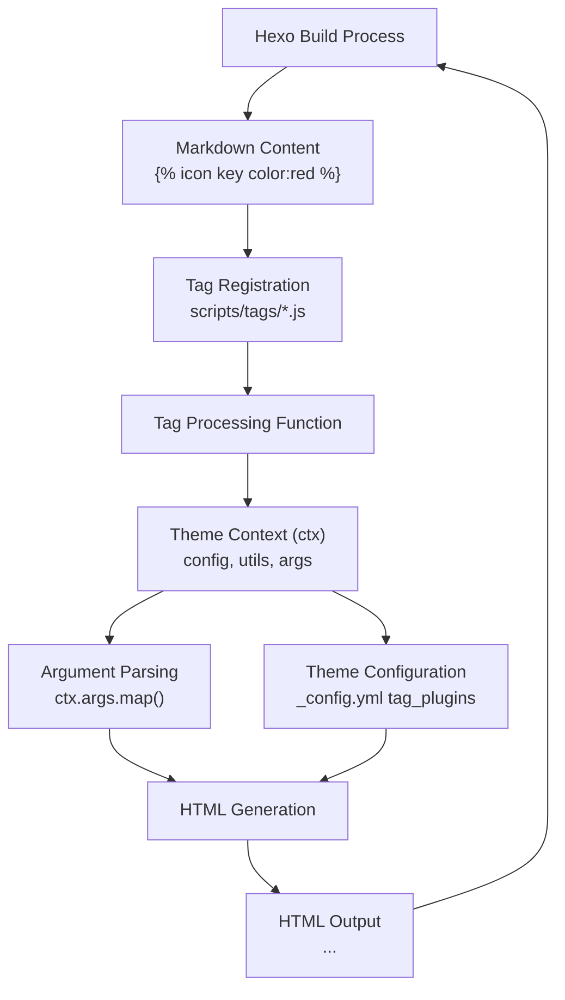
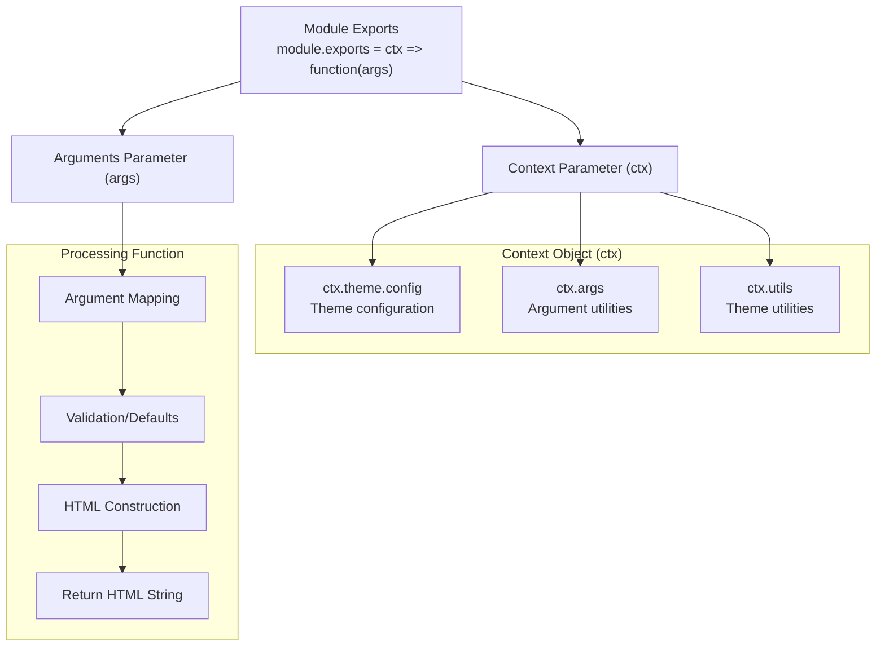
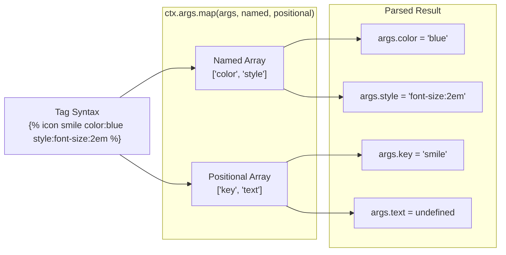
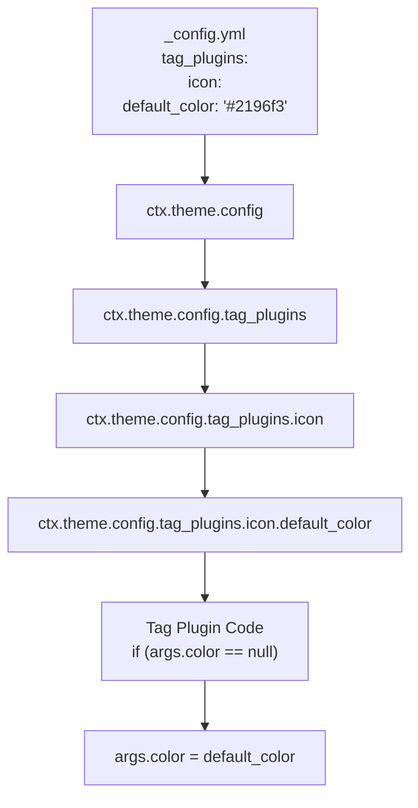
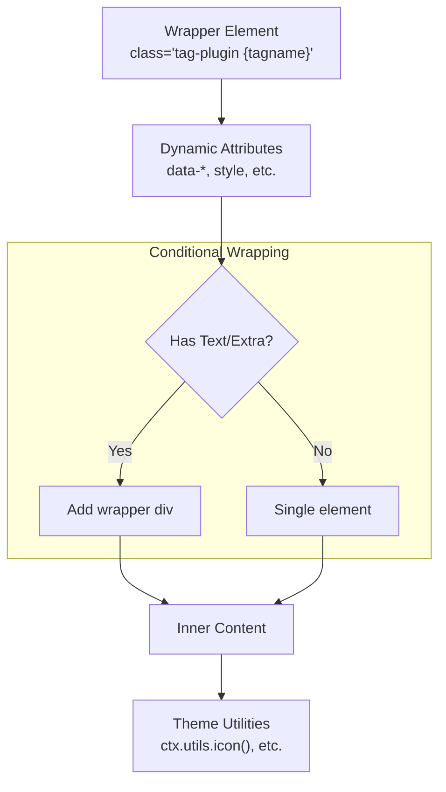
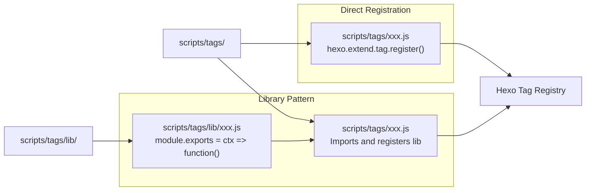
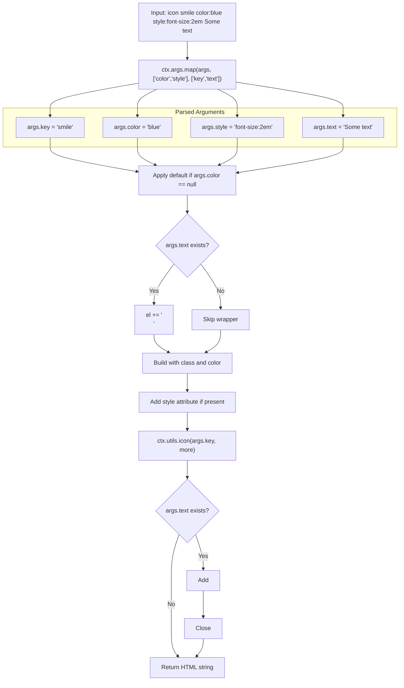

# 创建自定义标签插件

<details>
<summary>相关源码文件</summary>

生成此页面时参考的主题源码文件：

- [scripts/tags/index.js](../../../scripts/tags/index.js)
- [scripts/tags/lib/icon.js](../../../scripts/tags/lib/icon.js)

</details>

## 目的与范围

本文提供创建与 Stellar 主题集成的自定义 Hexo 标签插件的技术指南：标签插件架构、参数处理模式、主题上下文访问与 Stellar 标签系统使用的 HTML 生成模式。

现有内建标签插件文档见[标签插件总览](../04-标签插件/tag-plugins-overview.md)、[提示框与容器标签插件](../04-标签插件/note-container-tags.md)、[时间线与媒体标签](../04-标签插件/timeline-media-tags.md)与[链接、网格与横幅标签](../04-标签插件/link-grid-banner-tags.md)。样式化自定义标签输出见[自定义样式与主题覆盖](custom-styling-overrides.md)。

## 标签插件架构

Stellar 中的标签插件是 Hexo 扩展，在站点生成阶段把自定义 Markdown 语法转换为 HTML。它们遵循与 Stellar 主题上下文与配置系统集成的特定模式。



**标签插件处理流程**

处理流程如下：

1. Hexo 在 Markdown 处理中遇到标签语法
2. 调用已注册的标签函数（带解析后的参数）
3. 主题上下文提供工具与配置访问
4. 参数映射为命名参数
5. 用主题工具与配置生成 HTML
6. 返回 HTML 字符串并插入输出

**参考源码**：[scripts/tags/lib/icon.js](../../../scripts/tags/lib/icon.js)

## 基础标签插件结构

Stellar 标签插件遵循接收主题上下文并返回处理函数的特定模块模式。



**标签插件模块结构**

基本结构：

| 组件 | 类型 | 用途 |
|------|------|------|
| `module.exports` | Function | 返回标签处理函数 |
| `ctx` | Object | 含配置与工具的主题上下文 |
| `function(args)` | Function | 处理标签参数并生成 HTML |
| 返回值 | String | 插入页面的 HTML 标记 |

**示例结构：**

```javascript
module.exports = ctx => function(args) {
  // 1. 解析参数
  args = ctx.args.map(args, [...named], [...positional])
  
  // 2. 从主题配置应用默认值
  if (args.property == null) {
    args.property = ctx.theme.config.tag_plugins.tagname.default_value
  }
  
  // 3. 构建 HTML
  var el = '<div class="tag-plugin tagname">'
  el += '...'
  el += '</div>'
  
  // 4. 返回 HTML 字符串
  return el
}
```

**参考源码**：[scripts/tags/lib/icon.js](../../../scripts/tags/lib/icon.js)

## 参数处理模式

Stellar 提供 `ctx.args.map()` 工具把标签参数解析为命名与位置参数。

### 命名参数

命名参数用 `key:value` 语法，在第一个数组参数中指定。

### 位置参数

位置参数是空格分隔的值，在第二个数组参数中指定。



**参数映射过程**

`ctx.args.map()` 函数签名：

| 参数 | 类型 | 说明 |
|------|------|------|
| `args` | Array | Hexo 的原始参数 |
| `named` | Array | 命名参数键（如 `['color', 'style']`） |
| `positional` | Array | 按顺序的位置参数键（如 `['key', 'text']`） |
| 返回 | Object | 带属性的解析后参数对象 |

**icon.js 的解析示例：**

```javascript
args = ctx.args.map(args, ['color', 'style'], ['key', 'text'])
// 解析：
// 结果：
// {
//   key: 'smile',
//   color: 'red',
//   style: 'font-size:2em',
//   text: 'Hello'
// }
```

**参考源码**：[scripts/tags/lib/icon.js](../../../scripts/tags/lib/icon.js)

## 访问主题上下文与配置

`ctx` 对象提供主题配置、工具与辅助函数访问。

### 配置访问模式

标签插件可读取主题配置提供默认值与行为选项：



**配置访问路径：**

| 上下文路径 | 用途 | 示例 |
|------------|------|------|
| `ctx.theme.config` | 根主题配置 | 访问任意配置小节 |
| `ctx.theme.config.tag_plugins` | 标签插件配置 | 访问标签专属设置 |
| `ctx.theme.config.tag_plugins.{tagname}` | 特定标签配置 | 访问单个标签配置 |

**icon.js 示例：**

```javascript
if (args.color == null) {
  args.color = ctx.theme.config.tag_plugins.icon.default_color
}
```

该模式允许用户在 `_config.yml` 配置默认行为：

```yaml
tag_plugins:
  icon:
    default_color: '#2196f3'
```

**参考源码**：[scripts/tags/lib/icon.js](../../../scripts/tags/lib/icon.js)

### 可用上下文工具

| 工具命名空间 | 用途 | 常用函数 |
|--------------|------|----------|
| `ctx.args` | 参数处理 | `map()`、`joinTags()` |
| `ctx.utils` | 主题工具 | `icon()`、文本处理 |
| `ctx.theme.config` | 配置访问 | 全部主题设置 |

**参考源码**：[scripts/tags/lib/icon.js](../../../scripts/tags/lib/icon.js)

## HTML 生成模式

标签插件通过构建字符串并利用主题工具生成 HTML。Stellar 遵循一致输出结构模式。

### HTML 结构模式



**HTML 生成模式**

### 使用 ctx.args.joinTags()

`ctx.args.joinTags()` 把参数对象转换为 HTML 属性字符串：

```javascript
ctx.args.joinTags(args, ['color'])
// 返回：['color="blue"']（args.color = 'blue' 时）
// 用 .join(' ') 连接创建属性字符串
```

**icon.js 示例：**

```javascript
var el = ''
if (args.text) {
  el += `<div class="tag-plugin icon-wrap">`
}
el += `<span class="tag-plugin icon colorful" ${ctx.args.joinTags(args, ['color']).join(' ')}>`
var more = ''
if (args.style) {
  more += `style="${args.style}"`
}
el += ctx.utils.icon(args.key, more)
el += `</span>`
if (args.text) {
  el += `<span class="text">${args.text}</span>`
  el += '</div>'
}
return el
```

该模式：

1. 有文本时条件包装进容器
2. 添加基础 `span`，类 `tag-plugin icon colorful`
3. 用 `joinTags()` 把颜色添加为属性
4. 提供自定义样式时添加
5. 用 `ctx.utils.icon()` 生成图标 HTML
6. 有文本内容时添加

**参考源码**：[scripts/tags/lib/icon.js](../../../scripts/tags/lib/icon.js)

### CSS 类约定

所有标签插件遵循命名约定：

| 类模式 | 用途 | 示例 |
|--------|------|------|
| `tag-plugin` | 全部标签输出的基础类 | 始终存在 |
| `tag-plugin {tagname}` | 特定标签标识 | `tag-plugin icon` |
| 额外语义类 | 功能修饰符 | `colorful`、`icon-wrap` |

**参考源码**：[scripts/tags/lib/icon.js](../../../scripts/tags/lib/icon.js)

## 集成与注册

标签插件放在 `scripts/tags/` 目录时自动注册。Hexo 初始化时加载该目录的全部 JavaScript 文件。



**标签插件注册模式**

### 文件组织

Stellar 用两层组织：

| 目录 | 用途 | 模式 |
|------|------|------|
| `scripts/tags/` | 注册文件 | 调用 `hexo.extend.tag.register()` 的小文件 |
| `scripts/tags/lib/` | 实现文件 | 可复用模块中的核心逻辑 |

### 注册语法

典型注册模式：

```javascript
// scripts/tags/tagname.js
'use strict'

hexo.extend.tag.register('tagname', require('./lib/tagname')(hexo), {
  ends: false  // 块标签为 true
})
```

块标签（带开始/结束标签）：

```javascript
hexo.extend.tag.register('tagname', require('./lib/tagname')(hexo), {
  ends: true
})
```

块标签把开始与结束标签之间的内容作为参数接收：

```javascript
module.exports = ctx => function(args, content) {
  // args: 开始标签的参数
  // content: 开始与结束标签之间的文本
  // ...
}
```

**参考源码**：[scripts/tags/lib/icon.js](../../../scripts/tags/lib/icon.js)

## 参数处理参考

### 常见参数模式

| 模式 | 命名参数 | 位置参数 | 示例语法 |
|------|----------|----------|----------|
| 简单键值 | `['color', 'size']` | `['key']` | `` |
| 键 + 文本 | `['color', 'style']` | `['key', 'text']` | `` |
| 多位置参数 | `[]` | `['title', 'url', 'desc']` | `` |
| 仅选项 | `['style', 'class']` | `[]` | `` |

### 特殊参数处理

**默认值：**

始终检查 `null` 或 `undefined` 并应用默认值：

```javascript
if (args.color == null) {
  args.color = ctx.theme.config.tag_plugins.tagname.default_color
}
```

**布尔标志：**

布尔标志检查存在性：

```javascript
args = ctx.args.map(args, ['collapsed', 'open'], ['title'])
const isOpen = args.open !== undefined || args.collapsed === undefined
```

**CSS 样式字符串：**

允许用户传任意 CSS：

```javascript
var more = ''
if (args.style) {
  more += `style="${args.style}"`
}
```

**参考源码**：[scripts/tags/lib/icon.js](../../../scripts/tags/lib/icon.js)

## 最佳实践

### 错误处理

标签插件应优雅处理缺失或无效参数：

```javascript
module.exports = ctx => function(args) {
  args = ctx.args.map(args, ['color'], ['key'])
  
  // 校验必填参数
  if (!args.key) {
    return '<span class="tag-plugin error">Icon key required</span>'
  }
  
  // 应用安全默认值
  args.color = args.color || '#666'
  
  // 继续处理...
}
```

### 性能考虑

| 实践 | 理由 |
|------|------|
| 最小化字符串拼接 | 用数组与 join 或模板字面量 |
| 避免重处理 | 标签在构建期间对每次出现运行 |
| 缓存计算值 | 相同计算重复时 |
| 保持依赖轻量 | 标签插件每次构建都加载 |

### HTML 安全

不可信输入始终转义：

```javascript
// 不可信内容
el += `<span>${escapeHtml(args.text)}</span>`

// 可信内容（图标、主题工具）
el += ctx.utils.icon(args.key)
```

### CSS 集成

标签插件输出应与主题样式系统集成：

1. 所有输出用 `tag-plugin` 基础类
2. 添加语义类名作样式钩子
3. 支持 `class:` 参数供用户定制
4. 尽量用主题颜色变量
5. 在 `source/css/` 提供匹配标签类的样式

### 配置设计

向 `_config.yml` 添加配置时：

```yaml
tag_plugins:
  mytag:
    default_color: '#2196f3'
    default_size: 'medium'
    enable_feature: true
```

代码中访问：

```javascript
const config = ctx.theme.config.tag_plugins.mytag || {}
args.color = args.color || config.default_color || '#666'
```

**参考源码**：[scripts/tags/lib/icon.js](../../../scripts/tags/lib/icon.js)

## 完整示例：图标标签插件

图标标签插件演示全部关键模式：

**用法：**

```markdown

```

**实现流程：**



**图标标签插件处理流程**

**关键技术：**

1. **条件包装**：有文本时才添加包装 div
2. **默认配置**：从主题配置读取 `default_color`
3. **属性生成**：用 `ctx.args.joinTags()` 生成属性
4. **样式集成**：支持内联 `style:` 参数
5. **工具使用**：用 `ctx.utils.icon()` 生成图标

**参考源码**：[scripts/tags/lib/icon.js](../../../scripts/tags/lib/icon.js)

---

本指南覆盖在 Stellar 中创建自定义标签插件的核心模式。样式化自定义标签输出见[自定义样式与主题覆盖](custom-styling-overrides.md)；更复杂标签插件示例见[提示框与容器标签插件](../04-标签插件/note-container-tags.md)与[链接、网格与横幅标签](../04-标签插件/link-grid-banner-tags.md)。
