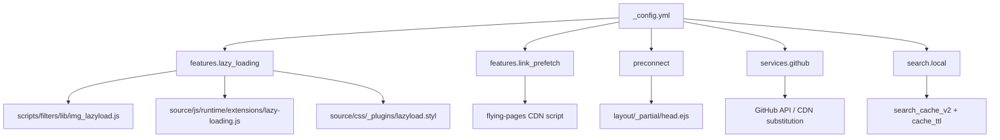
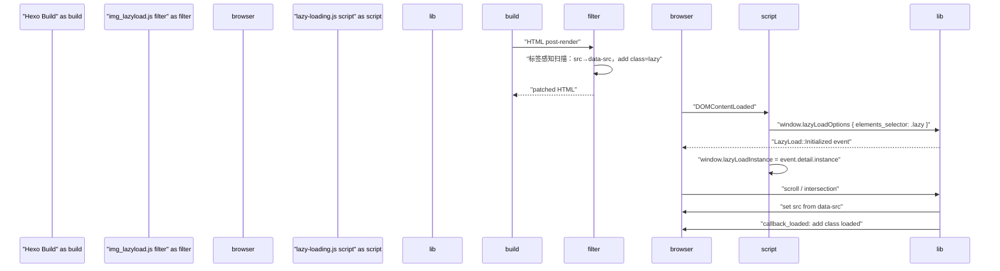

# 性能优化

<details>
<summary>相关源码文件</summary>

生成此页面时参考的主题源码文件：

- [.github/workflows/npm-publish.yml](../../../.github/workflows/npm-publish.yml)
- [.npmignore](../../../.npmignore)
- [LICENSE](../../../LICENSE)
- [README.md](../../../README.md)
- [_config.yml](../../../_config.yml)
- [source/js/runtime/extensions/lazy-loading.js](../../../source/js/runtime/extensions/lazy-loading.js)
- [layout/_partial/head.ejs](../../../layout/_partial/head.ejs)
- [layout/layout.ejs](../../../layout/layout.ejs)
- [package.json](../../../package.json)
- [scripts/filters/lib/img_lazyload.js](../../../scripts/filters/lib/img_lazyload.js)
- [scripts/lib/image-metadata.js](../../../scripts/lib/image-metadata.js)
- [scripts/lib/image-metadata.js](../../../scripts/lib/image-metadata.js)
- [source/css/_plugins/index.styl](../../../source/css/_plugins/index.styl)
- [source/css/plugins/](../../../source/css/plugins/)
- [source/css/comments/](../../../source/css/comments/)
- [source/js/utils.js](../../../source/js/utils.js)
- [scripts/generators/stellar-icons.js](../../../scripts/generators/stellar-icons.js)
- [source/js/search/local-search.js](../../../source/js/search/local-search.js)

</details>

本页介绍 hexo-theme-stellar 内置的性能特性：图片懒加载、链接预加载、图片宽高比预缓存、搜索数据缓存、CDN 主机替换与 `preconnect` 提示。每个特性可经 `_config.yml` 独立配置。

协调这些特性运行时的客户端初始化见[前端交互概览](../05-前端交互/client-side-overview.md)；搜索缓存流水线详见[搜索功能](../07-外部集成/search.md)；完整懒加载与图片处理流水线见[懒加载与图片处理](../07-外部集成/lazy-loading-images.md)。

---

## 特性概览

下图把每个性能特性映射到配置键与主要实现文件。

**性能特性映射**



**参考源码**：[_config.yml](../../../_config.yml)

---

## 图片懒加载

### 工作原理

懒加载把屏幕外图片的网络请求推迟到图片进入视口。分三层实现：

| 层 | 文件 | 职责 |
|----|------|------|
| 构建过滤器 | `scripts/filters/lib/img_lazyload.js` | 在渲染 HTML 中把 `src` 重写为 `data-src` |
| 运行时脚本 | `source/js/runtime/extensions/lazy-loading.js` | 加载 `vanilla-lazyload` 并配置回调 |
| CSS 过渡 | `source/css/_plugins/lazyload.styl` | 定义占位与淡入/模糊进入动画 |

**懒加载流水线**



**参考源码**：[scripts/filters/lib/img_lazyload.js](../../../scripts/filters/lib/img_lazyload.js)、[source/js/runtime/extensions/lazy-loading.js](../../../source/js/runtime/extensions/lazy-loading.js)

### 配置

```yaml
features:
  lazy_loading:
    transition: fade   # blur | fade
    auto_aspect_ratio: true
```

- `transition: blur`——未加载图片应用 `filter: blur(20px)`，加载时过渡为清晰
- `transition: fade`——仅透明度过渡（0.38s）
- `auto_aspect_ratio`——为 `true` 时，仅在 Hexo server 开发模式扫描图片并把 `ratio:W/H` 写回 Markdown；生产构建不改源文件

### 单图选择退出

`img_lazyload.js` 过滤器（`after_render:html`）以属性感知方式扫描真实 `` 标签：兼容双引号/单引号/无引号（HTML 压缩器产物）的 `src`，并完整跳过 `<script>`/`<style>`/注释区域，避免与压缩器（如 hexo-minify 的 `removeAttributeQuotes`）组合时正则跨标签越界、误改写页内内联脚本。跳过以下 `` 标签：

- 已含 `data-src` / `data-srcset`（重复防护）
- 含 `srcset`（交给浏览器原生处理）
- 内联 `data:image…`（base64 data URI）
- 含 ` no-lazy ` 属性

**参考源码**：[scripts/filters/lib/img_lazyload.js](../../../scripts/filters/lib/img_lazyload.js)

### 动态内容懒加载

`window.wrapLazyloadImages(container)` 辅助函数供动态生成的内容（如数据服务小部件）使用，把普通 `` 即时转换为懒加载兼容标记，并调用 `lazyLoadInstance.update()` 重新扫描。

`lazy-loading.js` 同时内置 MutationObserver 兜底：检测到新增 `.lazy` 元素后自动调用 `lazyLoadInstance.update()` 重新注册，因此直接插入懒加载标记（``）的第三方脚本无需手动触发更新。

**参考源码**：[source/js/runtime/extensions/lazy-loading.js](../../../source/js/runtime/extensions/lazy-loading.js)

---

## 链接预加载（Flying Pages）

`link_prefetch` 在用户点击前预取页面资源，降低可感知的导航延迟。

```yaml
features:
  link_prefetch:
    enabled: true
```

**参考源码**：[_config.yml](../../../_config.yml)

启用时把 `flying-pages` 脚本注入页面。它在 `mouseover` 事件时用 `<link rel="prefetch">` 或 Fetch API（视浏览器支持）预取页面。主题无专属 JS 包装——直接注入 CDN 脚本。

---

## 图片宽高比预缓存

图片尺寸与平均色由 [image-metadata.js](../../../scripts/lib/image-metadata.js) 在生成后增量提取，写入站点持久缓存并补全同一批 HTML。首次处理远程图片会增加构建时间，后续复用完整条目；失败采用延迟重试，不阻断页面生成。详见[图片处理](../07-外部集成/lazy-loading-images.md)。

## 搜索数据缓存

本地搜索系统在构建期把可搜索内容序列化为固定的 `/search.json`。客户端缓存带 TTL（`search.local.cache_ttl_seconds`，默认 `86400` 秒 = 1 天），以 `search_cache_v4` 键写入 `localStorage`；`0` 表示不缓存。

搜索索引固定按需懒加载；页面和 Collection 是否进入索引由 `visibility.searchable` 唯一控制。

搜索数据生成与客户端 `searchFunc` 逻辑详见[搜索功能](../07-外部集成/search.md)。

**参考源码**：[source/js/search/local-search.js](../../../source/js/search/local-search.js)

---

## GitHub 服务 URL

`services.github` 使用完整 URL 配置明确的 GitHub API、Raw 与 Gist 地址；可替换的卡片能力单独使用 provider 结构，适合经代理镜像或本地缓存层路由。

```yaml
services:
  github:
    api_url: https://api.github.com
    raw_url: https://raw.githubusercontent.com
    gist_url: https://gist.github.com
  github_card:
    provider: github_readme_stats
    github_readme_stats:
      endpoint: https://github-stats-extended.vercel.app
```

**参考源码**：[_config.yml](../../../_config.yml)

这些值被数据服务脚本（ghinfo、ghcard、contributors 等）构造 API URL 时消费；GitHub Card 只读取选中的 provider 参数袋。替换为镜像主机可降低 `github.com` 访问缓慢地区用户的延迟。

---

## DNS Preconnect 提示

v2 的 `preconnect` 列表在 HTML `<head>` 输出 `<link rel="preconnect">` 标签，提示浏览器在资源请求前与 CDN 源建立 TCP+TLS 连接。默认值由 Schema 唯一提供，主题 `_config.yml` 镜像展示该值；站点在 `_config.stellar.yml` 中完整替换该数组。

```yaml
preconnect:
  - https://gcore.jsdelivr.net
  - https://unpkg.com
```

**参考源码**：[_config.yml](../../../_config.yml)、[layout/_partial/head.ejs](../../../layout/_partial/head.ejs)

默认为空数组。只添加页面实际使用的 CDN 源（如 jsDelivr、unpkg、Cloudflare）。解析期会规范化并稳定去重 origin，`<link>` 标签由 head partial 渲染。head 模板细节见[HTML Head 与 SEO 元数据](../02-布局系统/head-seo.md)。

---

## 按需资源加载（CSS/JS 外置）

主题把「每页都可能用到」与「少数页面才用到」的资源分开：

- **核心样式 `main.css`** 只保留基础与必要的加载反馈规则（`.lazy` 显隐、aplayer、copycode 等）；Reveal 不再预设隐藏态样式。swiper/fancybox/mermaid 与五种评论系统样式移入 `source/css/plugins/`、`source/css/comments/` 独立编译，前端在 DOM 检测命中时经 `utils.css()` 按需注入。
- **重复脚本外置**：`utils` 保持同步基础能力，页面级功能由单一 ESM runtime 按 Runtime Manifest 启动；图标白名单由构建期生成器 `scripts/generators/stellar-icons.js` 输出为 `/js/stellar-icons.js`，约 6KB 的 SVG 数据不再随每个页面重复传输。
- **图标异步加载**：除首屏关键图标（搜索、菜单、leftbar/rightbar、arrow-left）与 TOC 底部操作按钮（回到顶部/参与讨论，由模板调用处 `inline=true` 内联）外，`icon()` 输出的其余 SVG 改为 `<svg data-icon>` 占位符；构建期生成器按命名空间输出 `js/icons/{ns}.json`，Runtime Manifest 仅在 selector 命中时动态导入 deferred-icons 模块，再按页拉取实际用到的命名空间并原位替换为内联 SVG。页面 HTML 不再重复携带全量图标（全站由约 3MB 内联 SVG 降至仅首屏关键图标），图标数据跨页与回访命中缓存。
- **按页裁剪**：`tagtree.js` 仅在与 tagtree 小部件渲染相同的条件下输出；评论脚本本就按页输出。

收益：每页内联脚本由约 31~34KB 降至约 10~13KB；无插件/评论页面不再下载对应 CSS；外置文件跨页与回访命中缓存。

---

## 构建期性能（generate 阶段）

Collection Pipeline 复用每个集合的规范模型，PageViewModel registry 在单次构建内缓存页面投影，归档模板复用文章模型。缓存按 Hexo 实例与构建周期隔离，避免多站点和增量构建串用旧状态。源码配置校验保留在入口，避免每次模板访问重复执行完整校验。

性能判断使用同一运行时、相同输入和后处理范围；图片冷缓存网络预处理应与已有元数据的重复构建分别统计，不以历史站点耗时代表当前版本。

## 候选包首屏核心 JS 门禁

`npm run performance:check` 在同一 Node/zlib 运行时，用固定博客输入构建公开基线与当前 npm tarball，报告本地资源清单。分别列出直接 JS、静态依赖、可达动态 import 与声明资源，以及 CSS、inline script 和 HTML。动态可达不等于延后加载；inline 已包含在 HTML 中，不能再次相加。gzip 使用每资源压缩估计，第三方网络资源不纳入本地清单。

当前报告为 comparisonOnly，不以某个百分比降幅阻断正常修改；构建或资源收集失败仍使检查失败。检查属于性能专项和 `release:check`，普通 `npm run check` 不运行。权威实现见 [check-performance.js](../../../ci/check-performance.js)。

## 汇总表

| 特性 | 配置键 | 默认 | 主要文件 |
|------|--------|------|----------|
| 图片懒加载 | 内置 Feature | 启用 | `img_lazyload.js`、`lazy-loading.js`、`lazyload.styl` |
| 懒加载过渡 | `features.lazy_loading.transition` | `fade` | `lazyload.styl` |
| 链接预加载 | `features.link_prefetch.enabled` | `true`（flying_pages） | 内部资源注册表 |
| 配色选择器 | `features.color_scheme_switch.enabled` | `false` | `color-scheme-switch.js`（按需） |
| 图片比例缓存 | Hexo 事件 | 自动 | `image-metadata.js`、`image-metadata.js` |
| 搜索缓存 | `search.local.cache_ttl_seconds` | `localStorage`（TTL 默认 1 天） | `local-search.js`（客户端） |
| GitHub URL | `services.github` | GitHub 默认 | 数据服务脚本 |
| DNS preconnect | `preconnect` | 空 | `head.ejs` |
| 按需样式 | 插件/评论 CSS 独立文件 | 运行时注入 | `plugins/*.css`、`comments/*.css` |
| 脚本外置 | 构建期生成 icons + 外部 JS | 每页内联减少约 20KB | `utils.js`、`stellar-icons.js` |
| 图标异步加载 | 按命名空间生成 `js/icons/*.json`，selector 命中后替换占位符 | 非首屏图标不再进入 HTML | `stellar-icons.js`、`icons.js` |

**参考源码**：[_config.yml](../../../_config.yml)
