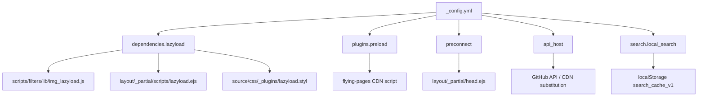
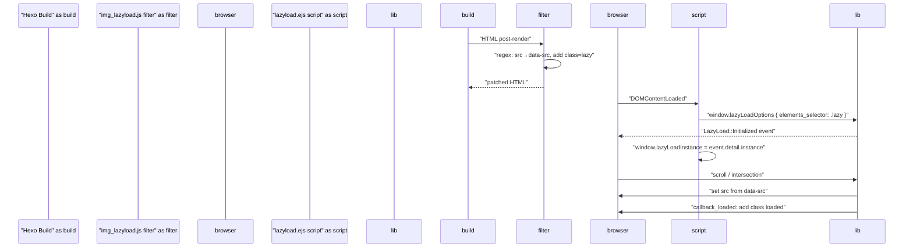
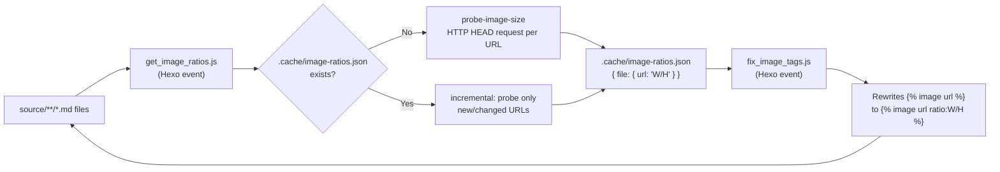

# 性能优化

<details>
<summary>相关源码文件</summary>

生成此页面时参考的主题源码文件：

- [.github/workflows/npm-publish.yml](../../../.github/workflows/npm-publish.yml)
- [.npmignore](../../../.npmignore)
- [LICENSE](../../../LICENSE)
- [README.md](../../../README.md)
- [_config.yml](../../../_config.yml)
- [layout/_partial/scripts/lazyload.ejs](../../../layout/_partial/scripts/lazyload.ejs)
- [layout/_partial/head.ejs](../../../layout/_partial/head.ejs)
- [layout/layout.ejs](../../../layout/layout.ejs)
- [package.json](../../../package.json)
- [scripts/filters/lib/img_lazyload.js](../../../scripts/filters/lib/img_lazyload.js)
- [scripts/events/lib/get_image_ratios.js](../../../scripts/events/lib/get_image_ratios.js)
- [scripts/events/lib/fix_image_tags.js](../../../scripts/events/lib/fix_image_tags.js)
- [source/css/_plugins/index.styl](../../../source/css/_plugins/index.styl)
- [source/js/search/local-search.js](../../../source/js/search/local-search.js)

</details>

本页介绍 hexo-theme-stellar 内置的性能特性：图片懒加载、链接预加载、图片宽高比预缓存、搜索数据缓存、CDN 主机替换与 `preconnect` 提示。每个特性可经 `_config.yml` 独立配置。

协调这些特性运行时的客户端初始化见[前端交互概览](../05-前端交互/client-side-overview.md)；搜索缓存流水线详见[搜索功能](../07-外部集成/search.md)；完整懒加载与图片处理流水线见[懒加载与图片处理](../07-外部集成/lazy-loading-images.md)。

---

## 特性概览

下图把每个性能特性映射到配置键与主要实现文件。

**性能特性映射**



**参考源码**：[_config.yml](../../../_config.yml)

---

## 图片懒加载

### 工作原理

懒加载把屏幕外图片的网络请求推迟到图片进入视口。分三层实现：

| 层 | 文件 | 职责 |
|----|------|------|
| 构建过滤器 | `scripts/filters/lib/img_lazyload.js` | 在渲染 HTML 中把 `src` 重写为 `data-src` |
| 运行时脚本 | `layout/_partial/scripts/lazyload.ejs` | 加载 `vanilla-lazyload` 并配置回调 |
| CSS 过渡 | `source/css/_plugins/lazyload.styl` | 定义占位与淡入/模糊进入动画 |

**懒加载流水线**



**参考源码**：[scripts/filters/lib/img_lazyload.js](../../../scripts/filters/lib/img_lazyload.js)、[layout/_partial/scripts/lazyload.ejs](../../../layout/_partial/scripts/lazyload.ejs)

### 配置

```yaml
dependencies:
  lazyload:
    js: https://gcore.jsdelivr.net/npm/vanilla-lazyload@19.1/dist/lazyload.min.js
    transition: fade   # blur | fade
    fix_ratio: true    # true | false
```

- `transition: blur`——未加载图片应用 `filter: blur(20px)`，加载时过渡为清晰
- `transition: fade`——仅透明度过渡（0.38s）
- `fix_ratio`——为 `true` 时构建过滤器同时嵌入 1×1 透明占位，让图片加载前保留布局空间

### 单图选择退出

`img_lazyload.js` 过滤器跳过以下 `` 标签：

- 已含 `data-srcset`（重复防护）
- 内联 `src="data:image…"`（base64 data URI）
- 含 ` no-lazy ` 属性

**参考源码**：[scripts/filters/lib/img_lazyload.js](../../../scripts/filters/lib/img_lazyload.js)

### 动态内容懒加载

`window.wrapLazyloadImages(container)` 辅助函数供动态生成的内容（如数据服务小部件）使用，把普通 `` 即时转换为懒加载兼容标记，并调用 `lazyLoadInstance.update()` 重新扫描。

`lazyload.ejs` 同时内置 MutationObserver 兜底：检测到新增 `.lazy` 元素后自动调用 `lazyLoadInstance.update()` 重新注册，因此直接插入懒加载标记（``）的第三方脚本无需手动触发更新。

**参考源码**：[layout/_partial/scripts/lazyload.ejs](../../../layout/_partial/scripts/lazyload.ejs)

---

## 链接预加载（Flying Pages）

`preload` 插件在用户点击前把外部页面载入缓存，消除可感知的导航延迟。

```yaml
plugins:
  preload:
    enable: true
    service: flying_pages
    flying_pages: https://gcore.jsdelivr.net/npm/flying-pages@2/flying-pages.min.js
```

**参考源码**：[_config.yml](../../../_config.yml)

启用时把 `flying-pages` 脚本注入页面。它在 `mouseover` 事件时用 `<link rel="prefetch">` 或 Fetch API（视浏览器支持）预取页面。主题无专属 JS 包装——直接注入 CDN 脚本。

---

## 图片宽高比预缓存

为防止懒加载图片出现时布局偏移（CLS），主题可在构建期预计算并把 `aspect-ratio` 值直接烘焙进 `` 标签调用。

### 两阶段流水线

**图片比例预缓存流水线**



**参考源码**：[scripts/events/lib/get_image_ratios.js](../../../scripts/events/lib/get_image_ratios.js)、[scripts/events/lib/fix_image_tags.js](../../../scripts/events/lib/fix_image_tags.js)

### 阶段 1——`get_image_ratios.js`

- 用 `glob` 扫描全部 `source/**/*.md` 文件
- 用正则解析 `` 标签
- 标签已含 `ratio:` 时直接存入缓存，不做网络访问
- 否则用 `probe-image-size` 经 HTTP 获取图片尺寸
- 每次探测后增量写入 `scripts/.cache/image-ratios.json`，避免中断丢数据
- 每次运行清理不再被 Markdown 引用的陈旧缓存条目

**参考源码**：[scripts/events/lib/get_image_ratios.js](../../../scripts/events/lib/get_image_ratios.js)

### 阶段 2——`fix_image_tags.js`

- 读取 `scripts/.cache/image-ratios.json`
- 对每个无 `ratio:` 参数的 `` 标签原位注入 `ratio:W/H`
- 把修改后的 Markdown 文件写回磁盘

**参考源码**：[scripts/events/lib/fix_image_tags.js](../../../scripts/events/lib/fix_image_tags.js)

### 消费者

渲染时 `image` 标签插件读取 `ratio` 参数，在包装的 `.image-bg` 元素上设置 `aspect-ratio: W/H`。这锁定图片加载前的容器高度，消除垂直布局偏移。

---

## 搜索数据缓存

本地搜索系统在构建期把全部站点内容序列化为 `/search.json`。首次加载时客户端获取该文件并缓存在 `localStorage`（键 `search_cache_v1`）。后续访问使用缓存副本，避免重复网络请求。

搜索数据生成与客户端 `searchFunc` 逻辑详见[搜索功能](../07-外部集成/search.md)。

**参考源码**：[source/js/search/local-search.js](../../../source/js/search/local-search.js)

---

## CDN 与 API 主机替换

`_config.yml` 的 `api_host` 小节允许替换默认 GitHub API 与原始内容主机名，适合经代理镜像或本地缓存层路由。

```yaml
api_host:
  ghapi: api.github.com           # GitHub REST API
  ghraw: raw.githubusercontent.com # 原始文件内容
  gist:  gist.github.com
  ghcard: github-readme-stats.vercel.app
```

**参考源码**：[_config.yml](../../../_config.yml)

这些值被数据服务脚本（ghinfo、ghcard、contributors 等）构造 API URL 时消费。替换为镜像主机可降低 `github.com` 访问缓慢地区用户的延迟。

---

## DNS Preconnect 提示

`_config.yml` 的 `preconnect` 列表在 HTML `<head>` 输出 `<link rel="preconnect">` 标签，提示浏览器在资源请求前与 CDN 源建立 TCP+TLS 连接。

```yaml
preconnect:
  # - https://gcore.jsdelivr.net
  # - https://unpkg.com
```

**参考源码**：[_config.yml](../../../_config.yml)

默认全部注释。添加实际使用的 CDN 源（如 jsDelivr、unpkg、Cloudflare）。`<link>` 标签由 head partial 渲染。head 模板细节见[HTML Head 与 SEO 元数据](../02-布局系统/head-seo.md)。

---

## 汇总表

| 特性 | 配置键 | 默认 | 主要文件 |
|------|--------|------|----------|
| 图片懒加载 | `dependencies.lazyload` | 启用 | `img_lazyload.js`、`lazyload.ejs`、`lazyload.styl` |
| 懒加载过渡 | `dependencies.lazyload.transition` | `fade` | `lazyload.styl` |
| 链接预加载 | `plugins.preload.enable` | `true`（flying_pages） | CDN 脚本 |
| 图片比例缓存 | Hexo 事件 | 自动 | `get_image_ratios.js`、`fix_image_tags.js` |
| 搜索缓存 | `search.local_search` | `localStorage` | `local-search.js`（客户端） |
| API 主机覆盖 | `api_host` | GitHub 默认 | 数据服务脚本 |
| DNS preconnect | `preconnect` | 空 | `head.ejs` |

**参考源码**：[_config.yml](../../../_config.yml)
