# Stellar 主题中文知识库（全量）> 合并版：包含全部领域页面，供 RAG 或一次性上下文导入。以 themes/stellar/ 源码（1.39.1）为事实来源。> 注意：各页面内的相对链接按原文件位置计算，本合并版中请按标题检索。---
title: 配置系统
domain: 总览与安装配置
tags:
  - 配置
  - YAML
  - site_tree
---

# 配置系统

<details>
<summary>相关源码文件</summary>

生成此页面时参考的主题源码文件：

- [.github/workflows/npm-publish.yml](../../../.github/workflows/npm-publish.yml)
- [.npmignore](../../../.npmignore)
- [LICENSE](../../../LICENSE)
- [README.md](../../../README.md)
- [_config.yml](../../../_config.yml)
- [package.json](../../../package.json)

</details>

## 目的与范围

配置系统是驱动 Stellar 主题行为、外观与功能启用的核心控制机制。本文介绍 `_config.yml` 的结构、层级覆盖模式、配置值在渲染流水线中的流向，以及各子系统如何消费配置。

安装与初始化见[安装与启动](installation.md)，样式相关配置见[样式系统](../01-样式系统/styling-overview.md)，插件配置见[插件系统](../07-外部集成/plugin-system.md)。

## 配置架构

配置系统实现三级级联，值可以在越来越具体的范围内被覆盖：

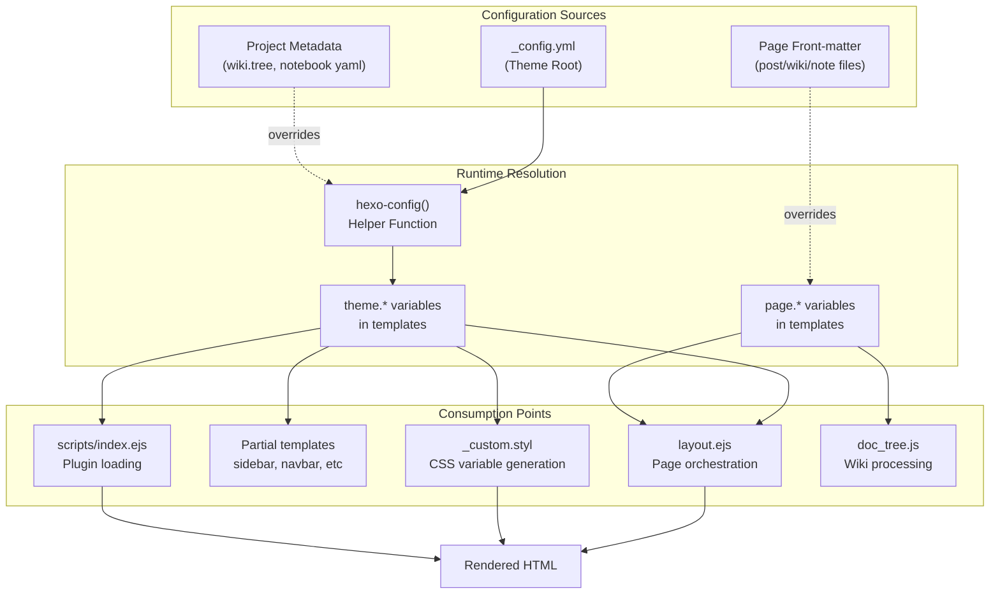
```mermaid
graph TB
    subgraph "Configuration Sources"
        THEMECONFIG["_config.yml<br/>(Theme Root)"]
        PROJMETA["Project Metadata<br/>(wiki.tree, notebook yaml)"]
        PAGEMETA["Page Front-matter<br/>(post/wiki/note files)"]
    end
    
    subgraph "Runtime Resolution"
        HEXOCONFIG["hexo-config()<br/>Helper Function"]
        PAGEVAR["page.* variables<br/>in templates"]
        THEMEVAR["theme.* variables<br/>in templates"]
    end
    
    subgraph "Consumption Points"
        LAYOUT["layout.ejs<br/>Page orchestration"]
        PARTIAL["Partial templates<br/>sidebar, navbar, etc"]
        CSSGEN["_custom.styl<br/>CSS variable generation"]
        JSLOAD["scripts/index.ejs<br/>Plugin loading"]
        DOCTREE["doc_tree.js<br/>Wiki processing"]
    end
    
    THEMECONFIG --> HEXOCONFIG
    PROJMETA -.overrides.-> HEXOCONFIG
    PAGEMETA -.overrides.-> PAGEVAR
    
    HEXOCONFIG --> THEMEVAR
    THEMEVAR --> LAYOUT
    THEMEVAR --> PARTIAL
    THEMEVAR --> CSSGEN
    THEMEVAR --> JSLOAD
    PAGEVAR --> LAYOUT
    PAGEVAR --> DOCTREE
    
    LAYOUT --> OUTPUT["Rendered HTML"]
    CSSGEN --> OUTPUT
    JSLOAD --> OUTPUT
```

**参考源码**：[_config.yml](../../../_config.yml)

配置从 `_config.yml` 经由 Hexo 的主题变量系统（`theme.*`）流动，页面级覆盖通过 `page.*` 变量实现。`hexo-config()` 辅助函数让 Stylus 文件也能访问配置值。

## 配置文件结构

`_config.yml` 按逻辑小节组织，控制不同子系统：

| 小节 | 用途 |
|------|------|
| `stellar` | 主题元数据与资源路径 |
| `preconnect`、`canonical`、`open_graph`、`structured_data` | SEO 与 meta 标签 |
| `logo`、`menubar` | 侧边栏品牌与导航 |
| `site_tree` | 各页面类型布局定义与侧边栏小部件分配 |
| `pin_slider` | 列表页置顶内容轮播（navbar top 上方） |
| `notebook` | 笔记本系统配置 |
| `article` | 文章显示与元数据设置 |
| `search` | 搜索服务配置 |
| `comments` | 评论系统集成 |
| `footer` | 页脚内容与社交链接 |
| `tag_plugins` | 标签插件外观与行为 |
| `dependencies` | 核心 JavaScript 依赖（CDN） |
| `data_services` | 按需加载的数据服务 |
| `plugins` | 功能插件启用与 CDN 地址 |
| `style` | 设计令牌与主题变量 |
| `default` | 默认资源兜底 |
| `api_host` | API 端点主机 |
| `data_cache` | 数据缓存 |
| `system` | 内部 Hexo 覆盖 |

**参考源码**：[_config.yml](../../../_config.yml)

## 层级覆盖系统

配置值的解析遵循「越具体的范围覆盖越宽泛的范围」：

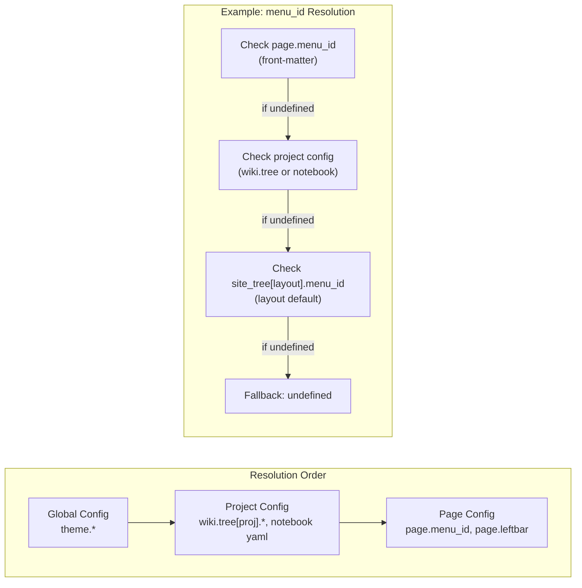
```mermaid
graph LR
    subgraph "Resolution Order"
        direction LR
        GLOBAL["Global Config<br/>theme.*"]
        PROJECT["Project Config<br/>wiki.tree[proj].*, notebook yaml"]
        PAGE["Page Config<br/>page.menu_id, page.leftbar"]
    end
    
    subgraph "Example: menu_id Resolution"
        direction TB
        CHECK1["Check page.menu_id<br/>(front-matter)"]
        CHECK2["Check project config<br/>(wiki.tree or notebook)"]
        CHECK3["Check site_tree[layout].menu_id<br/>(layout default)"]
        FALLBACK["Fallback: undefined"]
    end
    
    GLOBAL --> PROJECT
    PROJECT --> PAGE
    
    CHECK1 -->|"if undefined"| CHECK2
    CHECK2 -->|"if undefined"| CHECK3
    CHECK3 -->|"if undefined"| FALLBACK
```

**参考源码**：[_config.yml](../../../_config.yml)（`site_tree` 小节）

### 示例：`menu_id` 解析

对 wiki 页面，`menu_id`（控制菜单栏高亮）的解析顺序为：

1. **页面级**：`page.menu_id`（front-matter）
2. **项目级**：`wiki.tree[project_name].menu_id`
3. **布局级**：`theme.site_tree.wiki.menu_id`
4. **全局兜底**：`undefined`

### 示例：侧边栏小部件分配

侧边栏小部件遵循同样模式：

1. **页面级**：`page.leftbar` / `page.rightbar`（front-matter）
2. **笔记本级**：笔记页使用笔记本 YAML 中的 `note_leftbar` / `note_rightbar`
3. **布局级**：`theme.site_tree[layout].leftbar` / `rightbar`
4. **默认**：空侧边栏

**参考源码**：[_config.yml](../../../_config.yml)（`site_tree` 小节）

## 核心配置小节

### Stellar 元数据

`stellar` 小节定义主题身份与核心资源路径：

```yaml
stellar:
  version: '1.39.1'
  homepage: 'https://xaoxuu.com/wiki/stellar/'
  repo: 'https://github.com/xaoxuu/hexo-theme-stellar'
  main_css: /css/main.css
  main_js: /js/main.js
```

这些值用于模板中的版本展示、资源加载与文档链接。

**参考源码**：[_config.yml](../../../_config.yml)

### SEO 与 meta 标签

`canonical`、`open_graph`、`structured_data` 小节控制 SEO 行为：

- **`canonical`**：通过 `originalHost` 与备用站主机列表校验域名，检测并警告克隆站
- **`open_graph`**：启用 Open Graph meta 标签，用于社交分享
- **`structured_data`**：为 JSON-LD 结构化数据生成提供数据

这些由 head 模板消费并生成相应 meta 标签。实现细节见[HTML Head 与 SEO 元数据](../02-布局系统/head-seo.md)。

**参考源码**：[_config.yml](../../../_config.yml)

### Logo 与菜单栏配置

`logo` 小节支持从 `_config.yml` 动态替换值：

```yaml
logo:
  avatar: '[{config.avatar}](/about/)'
  title: '[{config.title}](/)' 
  subtitle: '{config.subtitle}'
```

`{config.*}` 占位符会被替换为 Hexo 主 `_config.yml` 中的值。`menubar` 定义导航按钮（`id`、`theme`、`icon`、`title`、`url` 等属性）。

**参考源码**：[_config.yml](../../../_config.yml)

### 站点树：布局定义

`site_tree` 是最关键的配置块，为每种页面类型定义布局特征：

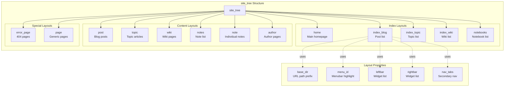
```mermaid
graph TB
    subgraph "site_tree Structure"
        SITETREE["site_tree"]
        
        subgraph "Index Layouts"
            HOME["home<br/>Main homepage"]
            INDEXBLOG["index_blog<br/>Post list"]
            INDEXTOPIC["index_topic<br/>Topic list"]
            INDEXWIKI["index_wiki<br/>Wiki list"]
            NOTEBOOKS["notebooks<br/>Notebook list"]
        end
        
        subgraph "Content Layouts"
            POST["post<br/>Blog posts"]
            TOPIC["topic<br/>Topic articles"]
            WIKI["wiki<br/>Wiki pages"]
            NOTES["notes<br/>Note list"]
            NOTE["note<br/>Individual notes"]
            AUTHOR["author<br/>Author pages"]
        end
        
        subgraph "Special Layouts"
            ERROR["error_page<br/>404 pages"]
            PAGE["page<br/>Generic pages"]
        end
    end
    
    subgraph "Layout Properties"
        BASEDIR["base_dir<br/>URL path prefix"]
        MENUID["menu_id<br/>Menubar highlight"]
        LEFTBAR["leftbar<br/>Widget list"]
        RIGHTBAR["rightbar<br/>Widget list"]
        NAVTABS["nav_tabs<br/>Secondary nav"]
    end
    
    SITETREE --> HOME
    SITETREE --> INDEXBLOG
    SITETREE --> INDEXTOPIC
    SITETREE --> INDEXWIKI
    SITETREE --> NOTEBOOKS
    SITETREE --> POST
    SITETREE --> TOPIC
    SITETREE --> WIKI
    SITETREE --> NOTES
    SITETREE --> NOTE
    SITETREE --> AUTHOR
    SITETREE --> ERROR
    SITETREE --> PAGE
    
    INDEXBLOG -.uses.-> BASEDIR
    INDEXBLOG -.uses.-> MENUID
    INDEXBLOG -.uses.-> LEFTBAR
    INDEXBLOG -.uses.-> RIGHTBAR
    INDEXBLOG -.uses.-> NAVTABS
```

**参考源码**：[_config.yml](../../../_config.yml)（`site_tree` 小节）

每种布局定义可包含：

| 属性 | 类型 | 用途 |
|------|------|------|
| `base_dir` | String | 生成页面的 URL 路径前缀 |
| `menu_id` | String | 要高亮的菜单栏项 ID |
| `leftbar` | String/Array | 左栏小部件列表（逗号分隔） |
| `rightbar` | String/Array | 右栏小部件列表（逗号分隔） |
| `nav_tabs` | Object | 次级导航标签（标题-URL 对） |

#### 示例：博客文章布局

```yaml
post:
  menu_id: post
  leftbar: related, recent
  rightbar: ghrepo, toc
```

所有博客文章（`layout: post`）将：

- 高亮 `post` 菜单栏项
- 左栏显示 `related`、`recent` 小部件
- 右栏显示 `ghrepo`、`toc` 小部件

**参考源码**：[_config.yml](../../../_config.yml)

#### 示例：Wiki 布局

```yaml
index_wiki:
  base_dir: wiki
  menu_id: wiki
  leftbar: related, recent
  rightbar: 
  nav_tabs:
    # 'more': https://github.com/xaoxuu

wiki:
  menu_id: wiki
  leftbar: tree, related, recent
  rightbar: ghrepo, toc
```

`index_wiki` 定义 wiki 列表页，`wiki` 定义单个 wiki 页面。注意 wiki 页面左栏的 `tree` 小部件用于展示项目结构。

**参考源码**：[_config.yml](../../../_config.yml)

### 置顶内容轮播

所有带 navbar top 的列表页（首页/归档/标签/分类/专栏/wiki 列表等）上方自动展示置顶内容轮播，无需开关配置：只要有置顶内容即渲染，自动轮播间隔固定 5000ms。

- 博客类列表（首页/归档/标签/分类/专栏等）放置顶文章（文章 front-matter `pin: true|number`，兼容 `sticky` 别名；只要设置即置顶，按数值降序排序，`true` 视作 1，0/负数同样参与）；
- wiki 列表放置顶 wiki 项目（数据文件 `pin: true|number`，规则同上）；专栏列表页与其他博客列表页一致展示置顶文章；
- 轮播区宽高比与非置顶文章统一，由 `article.cover_ratio` 控制（修改该值即可整体调整）；
- 无置顶内容时不渲染；轮播进度按内容类型分组缓存到 localStorage（切换 tab 不重置）。

**参考源码**：[_config.yml](../../../_config.yml)、[layout/_partial/main/pin_slider.ejs](../../../layout/_partial/main/pin_slider.ejs)

### 笔记本配置

`notebook` 小节提供默认值，可被单个笔记本 YAML 覆盖：

```yaml
notebook:
  auto_excerpt: 128
  per_page: null  # null 继承 Hexo 配置
  order_by: -updated
  license: false
  share: false
```

这些值会级联到笔记本 YAML（如 `source/_data/notebooks/mynotebook.yml`），后者可覆盖 `per_page`、`order_by`、`license`、`share`、`leftbar`、`rightbar`、`note_leftbar`、`note_rightbar` 等字段。

**参考源码**：[_config.yml](../../../_config.yml)

### 文章配置

`article` 小节控制内容显示特征：

| 字段 | 类型 | 默认 | 用途 |
|------|------|------|------|
| `type` | `tech` / `story` | `tech` | 布局风格（tech 紧凑、story 宽松） |
| `indent` | Boolean | `false` | 段落首行两字缩进 |
| `cover_ratio` | Number | `2` | 文章卡片封面宽高比 |
| `banner_ratio` | Number | `2.5` | 文章横幅宽高比 |
| `auto_banner` | Boolean | `false` | 根据标签自动从 Unsplash 获取横幅 |
| `auto_excerpt` | Number | `128` | 自动摘要提取字符数 |
| `license` | String/Boolean | 许可文本 | 文章默认许可声明 |
| `share` | Array | `[]` | 分享按钮：`wechat`、`weibo`、`email`、`link` |

这些可在专栏配置或页面 front-matter 中覆盖。

**参考源码**：[_config.yml](../../../_config.yml)

### 样式配置

`style` 小节定义设计令牌，由 `source/css/_custom.styl` 消费：

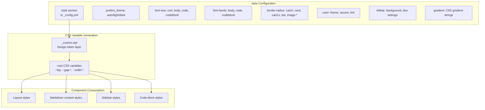
```mermaid
graph TB
    subgraph "style Configuration"
        STYLE["style section<br/>in _config.yml"]
        
        THEME["prefers_theme: auto/light/dark"]
        FONTSIZE["font-size: root, body, code, codeblock"]
        FONTFAMILY["font-family: body, code, codeblock"]
        BORDER["border-radius: card-l, card, card-s, bar, image-*"]
        COLOR["color: theme, accent, link"]
        LEFTBAR["leftbar: background, blur settings"]
        GRADIENT["gradient: CSS gradient strings"]
    end
    
    subgraph "CSS Variable Generation"
        CUSTOMSTYL["_custom.styl<br/>Design token layer"]
        CSSROOT[":root CSS variables<br/>--fsp, --gap-*, --width-*"]
    end
    
    subgraph "Component Consumption"
        LAYOUT["Layout styles"]
        MDTEXT["Markdown content styles"]
        SIDEBAR["Sidebar styles"]
        CODEBLOCK["Code block styles"]
    end
    
    STYLE --> CUSTOMSTYL
    CUSTOMSTYL --> CSSROOT
    
    CSSROOT --> LAYOUT
    CSSROOT --> MDTEXT
    CSSROOT --> SIDEBAR
    CSSROOT --> CODEBLOCK
```

**参考源码**：[_config.yml](../../../_config.yml)（`style` 小节）

关键样式配置：

1. **字号**：`font-size.root` 设置基准字号（影响所有 `rem` 单位）；`font-size.body` 可用 `px` 或 `rem`
2. **圆角**：`border-radius` 从 `card-l`（24px，大卡片）到 `card-s`（12px，小卡片）渐进
3. **颜色**：`color.theme` / `color.accent` / `color.link` 使用 HSL 值，便于精确调色
4. **左栏外观**：支持纯色、渐变或带模糊效果的背景图

完整样式细节见[设计令牌与 CSS 变量](../01-样式系统/design-tokens.md)。

**参考源码**：[_config.yml](../../../_config.yml)

### 插件配置

`plugins` 小节采用条件加载模式：

```yaml
plugins:
  fancybox:
    enable: true
    js: https://gcore.jsdelivr.net/npm/@fancyapps/ui@5.0/dist/fancybox/fancybox.umd.js
    css: https://gcore.jsdelivr.net/npm/@fancyapps/ui@5.0/dist/fancybox/fancybox.css
    selector: .timenode p>img
```

每个插件配置通常包含：

- `enable`：布尔开关，控制是否加载
- JavaScript / CSS 的 CDN 地址
- 插件专属选项

`inject` 字段允许直接注入内联脚本/样式，而无需单独创建 EJS 文件。

插件加载机制见[插件系统](../07-外部集成/plugin-system.md)。

**参考源码**：[_config.yml](../../../_config.yml)（`plugins` 小节）

### 数据服务配置

`data_services` 小节定义数据组件的按需加载：

```yaml
data_services:
  mdrender:
    js: /js/services/mdrender.js
  siteinfo:
    js: /js/services/siteinfo.js
    api: https://api.xaox.cc/site_info/v1?url={href}
  rating:
    js: /js/services/rating.js
    api: https://star-vote.xaox.cc/api/rating
```

每个服务指定：

- `js`：客户端 JavaScript 实现路径
- `api`：（可选）后端 API 端点，支持 `{href}` 等占位符

服务仅在对应标签插件被使用时加载（如 `` 触发 `ghinfo.js`）。

**参考源码**：[_config.yml](../../../_config.yml)（`data_services` 小节）

### 评论系统配置

`comments` 小节支持多种第三方服务，采用单服务激活模型：

```yaml
comments:
  service: beaudar  # beaudar, utterances, giscus, twikoo, waline, artalk
  comment_title: 快来参与讨论吧~
```

每个服务有专属子配置小节。只有 `comments.service` 指定的服务会被加载。

集成细节见[评论系统](../07-外部集成/comment-systems.md)。

**参考源码**：[_config.yml](../../../_config.yml)（`comments` 小节）

## 配置访问方式

### EJS 模板中

通过 `theme` 对象访问配置：

```ejs
<% if (theme.stellar.version) { %>
  Version: <%= theme.stellar.version %>
<% } %>

<% const menuId = page.menu_id || theme.site_tree[layout]?.menu_id %>
```

### Stylus 文件中

`hexo-config()` 函数从 `_config.yml` 取值：

```stylus
$root-font-size = hexo-config('style.font-size.root')
$theme-color = hexo-config('style.color.theme')

:root
  font-size: $root-font-size
  --theme-color: $theme-color
```

**参考源码**：[source/css/_custom.styl](../../../source/css/_custom.styl)

### 数据处理脚本中

Node.js 脚本通过 Hexo 的 `config` 对象访问配置：

```javascript
// 在 scripts/events/lib/doc_tree.js 中
hexo.theme.config.site_tree.index_wiki.base_dir
```

## 配置解析示例

下面是系统为 wiki 页面解析配置的过程：

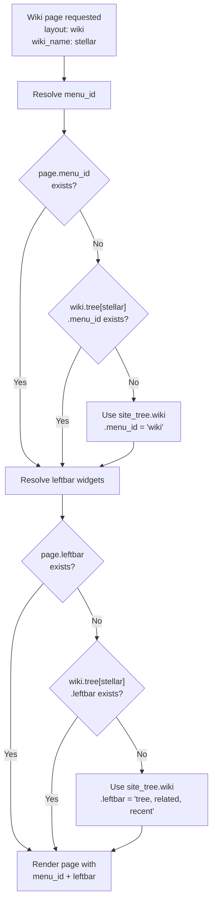
```mermaid
flowchart TD
    START["Wiki page requested<br/>layout: wiki<br/>wiki_name: stellar"]
    
    CHECK_MENU["Resolve menu_id"]
    PAGE_MENU{"page.menu_id<br/>exists?"}
    PROJ_MENU{"wiki.tree[stellar]<br/>.menu_id exists?"}
    LAYOUT_MENU["Use site_tree.wiki<br/>.menu_id = 'wiki'"]
    
    CHECK_SIDEBAR["Resolve leftbar widgets"]
    PAGE_LB{"page.leftbar<br/>exists?"}
    PROJ_LB{"wiki.tree[stellar]<br/>.leftbar exists?"}
    LAYOUT_LB["Use site_tree.wiki<br/>.leftbar = 'tree, related, recent'"]
    
    RENDER["Render page with<br/>menu_id + leftbar"]
    
    START --> CHECK_MENU
    CHECK_MENU --> PAGE_MENU
    PAGE_MENU -->|"Yes"| CHECK_SIDEBAR
    PAGE_MENU -->|"No"| PROJ_MENU
    PROJ_MENU -->|"Yes"| CHECK_SIDEBAR
    PROJ_MENU -->|"No"| LAYOUT_MENU
    LAYOUT_MENU --> CHECK_SIDEBAR
    
    CHECK_SIDEBAR --> PAGE_LB
    PAGE_LB -->|"Yes"| RENDER
    PAGE_LB -->|"No"| PROJ_LB
    PROJ_LB -->|"Yes"| RENDER
    PROJ_LB -->|"No"| LAYOUT_LB
    LAYOUT_LB --> RENDER
```

**参考源码**：[_config.yml](../../../_config.yml)

## 默认资源配置

`default` 小节为缺失资源提供兜底：

| 资源类型 | 用途 | 示例 |
|----------|------|------|
| `avatar` | 用户头像 | 默认头像 |
| `cover` | 文章封面 | 缺失封面的占位 |
| `banner` | 文章横幅 | 默认头图 |
| `loading` | 加载指示 | 加载动画 SVG |
| `image_onerror` | 图片加载失败兜底 | 图片加载失败时显示的图标 |

这些默认值避免出现破图，保证资源缺失时的一致性体验。

**参考源码**：[_config.yml](../../../_config.yml)

## 系统配置

`system` 小节包含内部覆盖：

```yaml
system:
  override_pretty_urls: true
```

这确保 URL 格式化不受 Hexo `pretty_urls` 配置影响，减少边界情况、提升可靠性。

**参考源码**：[_config.yml](../../../_config.yml)

## 配置最佳实践

### 1. 覆盖层级策略

只在必要层级做覆盖：

- 全局默认值保证全站一致
- 项目级用于 wiki 或笔记本的专属行为
- 页面级仅用于个别例外

### 2. 菜单 ID 一致性

保持相关布局的 `menu_id` 一致。例如所有博客相关页面都用 `menu_id: post`：

```yaml
site_tree:
  index_blog:
    menu_id: post
  post:
    menu_id: post
  topic:
    menu_id: post
```

**参考源码**：[_config.yml](../../../_config.yml)

### 3. 小部件分配模式

常见组合：

| 页面类型 | 左栏 | 右栏 |
|----------|------|------|
| 博客文章 | `related, recent` | `ghrepo, toc` |
| Wiki 页面 | `tree, related, recent` | `ghrepo, toc` |
| 笔记页 | `tagtree, recent` | `toc` |

### 4. 样式令牌使用

优先使用设计令牌而非硬编码值：

- 用 `style.color.theme`、`style.color.accent` 保持一致配色
- 用 `style.border-radius.*` 保持统一圆角
- 用 `style.font-size.*` 实现可伸缩排版

### 5. 插件按需启用

只启用需要的插件以优化性能。`enable: false` 的插件不会贡献任何代码。

**参考源码**：[_config.yml](../../../_config.yml)

---

配置系统的强大之处在于层级覆盖模式与各子系统的紧密集成。理解解析顺序与可用配置点，即可在不改主题代码的前提下实现精确定制。

---

---
title: 安装与启动
domain: 总览与安装配置
tags:
  - 安装
  - npm
  - 环境要求
---

# 安装与启动

<details>
<summary>相关源码文件</summary>

生成此页面时参考的主题源码文件：

- [.github/workflows/npm-publish.yml](../../../.github/workflows/npm-publish.yml)
- [.npmignore](../../../.npmignore)
- [LICENSE](../../../LICENSE)
- [README.md](../../../README.md)
- [_config.yml](../../../_config.yml)
- [package.json](../../../package.json)

</details>

本文介绍 Stellar Hexo 主题的安装过程，包括环境要求、依赖安装与首次启用。重点是让主题文件进入你的 Hexo 项目并完成首次启用。

详细配置见[配置系统](configuration.md)，样式与主题定制见[样式系统](../01-样式系统/styling-overview.md)。

---

## 目的与范围

本文说明如何：

- 确认开发环境满足 Stellar 的要求
- 通过 npm 安装主题包
- 在 Hexo 配置中启用主题
- 理解主题的依赖结构
- 验证安装是否成功

本文**不**涉及内容创作、高级配置或具体功能设置，这些内容见后续章节。

---

## 环境要求

Stellar 面向现代 Hexo 环境构建，需要兼容的 Node.js 版本。

### 版本要求

| 组件 | 版本要求 | 说明 |
|------|----------|------|
| **Hexo** | 6.3.0 ~ latest（已验证至 8.1.2） | 核心静态站点生成器 |
| **hexo-cli** | 4.3.0 ~ latest | 命令行工具 |
| **Node.js** | >= 22 | 建议选择 LTS 版本 |
| **npm** | 随 Node.js 安装 | 包管理器 |

**重要**：请选择 Node.js LTS（长期支持）版本，过新的非 LTS 版本可能与 Hexo 生态兼容性不佳。

### 验证命令

```bash
# 检查已安装版本
hexo version
node --version
npm --version
```

**参考源码**：[README.md](../../../README.md)

---

## 安装方式

Stellar 以 npm 包形式分发，安装到 Hexo 项目的 `node_modules` 目录，遵循标准 Hexo 主题安装模式。

### 安装流程

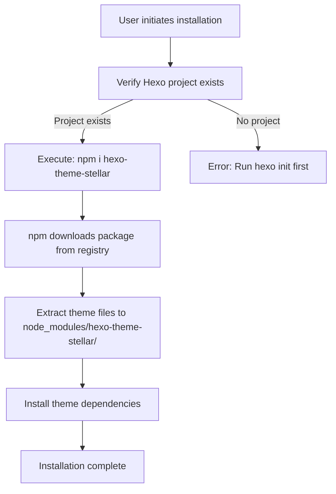
```mermaid
graph TB
    START["User initiates installation"]
    CHECK["Verify Hexo project exists"]
    NPM["Execute: npm i hexo-theme-stellar"]
    DOWNLOAD["npm downloads package from registry"]
    EXTRACT["Extract theme files to node_modules/hexo-theme-stellar/"]
    DEPS["Install theme dependencies"]
    COMPLETE["Installation complete"]
    
    START --> CHECK
    CHECK -->|Project exists| NPM
    CHECK -->|No project| ERROR["Error: Run hexo init first"]
    NPM --> DOWNLOAD
    DOWNLOAD --> EXTRACT
    EXTRACT --> DEPS
    DEPS --> COMPLETE
```

### 安装命令

在 Hexo 项目根目录执行：

```bash
npm i hexo-theme-stellar
```

该命令会：

1. 从 npm registry 下载主题包
2. 安装到 `node_modules/hexo-theme-stellar/`
3. 自动安装 `package.json` 中声明的全部依赖
4. 使主题对 Hexo 可用

**参考源码**：[README.md](../../../README.md)、[package.json](../../../package.json)

---

## 主题包结构

`package.json` 定义了主题的身份、依赖与元数据，理解它有助于排查安装问题。

### 包元数据

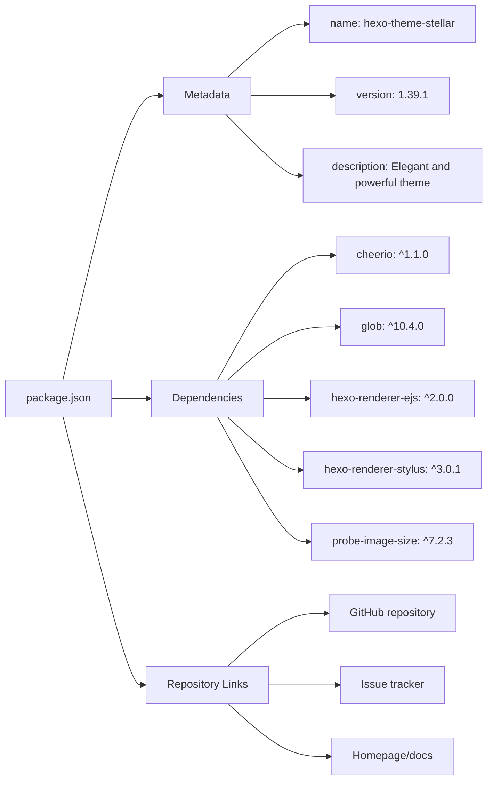
```mermaid
graph LR
    PKG["package.json"]
    META["Metadata"]
    DEPS["Dependencies"]
    REPO["Repository Links"]
    
    PKG --> META
    PKG --> DEPS
    PKG --> REPO
    
    META --> NAME["name: hexo-theme-stellar"]
    META --> VER["version: 1.39.1"]
    META --> DESC["description: Elegant and powerful theme"]
    
    DEPS --> CHEERIO["cheerio: ^1.1.0"]
    DEPS --> GLOB["glob: ^10.4.0"]
    DEPS --> EJS["hexo-renderer-ejs: ^2.0.0"]
    DEPS --> STYLUS["hexo-renderer-stylus: ^3.0.1"]
    DEPS --> PROBE["probe-image-size: ^7.2.3"]
    
    REPO --> GIT["GitHub repository"]
    REPO --> ISSUES["Issue tracker"]
    REPO --> HOME["Homepage/docs"]
```

### 核心依赖

主题依赖以下包，安装时会自动装入：

| 依赖 | 版本 | 用途 |
|------|------|------|
| **cheerio** | ^1.1.0 | HTML/XML 解析与操作（内容处理） |
| **glob** | ^10.4.0 | 文件通配匹配 |
| **hexo-renderer-ejs** | ^2.0.0 | EJS 模板渲染引擎（渲染布局文件） |
| **hexo-renderer-stylus** | ^3.0.1 | Stylus CSS 预处理器（编译主题样式） |
| **probe-image-size** | ^7.2.3 | 图片尺寸探测（懒加载占位） |

这些依赖分别负责：

- **cheerio**：标签插件与辅助函数中的 DOM 操作
- **glob**：脚本中的文件批量匹配
- **hexo-renderer-ejs**：渲染 `.ejs` 布局模板
- **hexo-renderer-stylus**：把 `.styl` 编译为 CSS
- **probe-image-size**：无需下载完整图片即可获取图片尺寸

**参考源码**：[package.json](../../../package.json)

---

## 主题启用

安装完成后，必须显式在 Hexo 站点配置中启用主题，Hexo 不会自动切换到新安装的主题。

### 启用流程

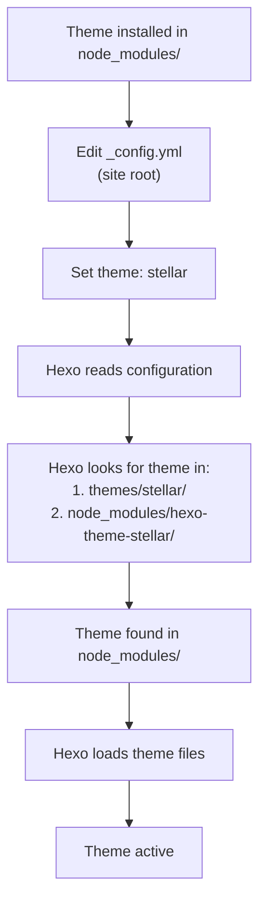
```mermaid
graph TD
    INSTALL["Theme installed in node_modules/"]
    CONFIG["Edit _config.yml<br/>(site root)"]
    SETTHEME["Set theme: stellar"]
    HEXO_READS["Hexo reads configuration"]
    LOOKUP["Hexo looks for theme in:<br/>1. themes/stellar/<br/>2. node_modules/hexo-theme-stellar/"]
    FOUND["Theme found in node_modules/"]
    LOADS["Hexo loads theme files"]
    READY["Theme active"]
    
    INSTALL --> CONFIG
    CONFIG --> SETTHEME
    SETTHEME --> HEXO_READS
    HEXO_READS --> LOOKUP
    LOOKUP --> FOUND
    FOUND --> LOADS
    LOADS --> READY
```

### 修改配置

打开 Hexo 站点根目录的 `_config.yml`（不是主题的 `_config.yml`），设置：

```yaml
theme: stellar
```

这一行告诉 Hexo 使用 Stellar 主题。如果主题不在传统的 `themes/` 目录，Hexo 会自动在 `node_modules/hexo-theme-stellar/` 中查找。

**参考源码**：[README.md](../../../README.md)

---

## 主题配置文件

Stellar 自带一份覆盖全部主题功能的配置文件，位于主题包内，是主题功能的集中控制点。

### 配置文件位置

```
node_modules/hexo-theme-stellar/_config.yml
```

该文件按主题域分成若干小节，主要小节如下：

| 小节 | 用途 |
|------|------|
| `stellar` | 主题版本、首页、仓库地址、资源路径 |
| `preconnect` | 需要预连接的 CDN 域名 |
| `canonical` | 源站域名、备用站与克隆站检测 |
| `open_graph` / `structured_data` | SEO 元数据 |
| `site_tree` | 站点结构树：各页面类型的菜单与左右侧栏 |
| `notebook` | 笔记本系统配置 |
| `article` | 文章显示、摘要、许可等 |
| `comments` | 评论服务（beaudar / utterances / giscus / twikoo / waline / artalk） |
| `search` | 搜索服务（local_search / algolia_search） |
| `footer` | 页脚社交链接等 |
| `tag_plugins` | 标签插件行为与样式 |
| `dependencies` | marked、lazyload 等 CDN 依赖 |
| `data_services` | 按需加载的数据服务 API |
| `plugins` | 外部插件集成（fancybox、swiper、scrollreveal、mermaid、katex 等） |
| `style` | 设计令牌、颜色、字体、间距 |
| `default` | 默认占位图 |
| `api_host` | GitHub API 端点 |
| `data_cache` | 数据缓存 |
| `system` | 内部系统覆盖 |

### 关键配置字段

主题通过以下字段标识自身：

```yaml
stellar:
  version: '1.39.1'           # 主题版本号
  homepage: 'https://xaoxuu.com/wiki/stellar/'  # 文档站
  repo: 'https://github.com/xaoxuu/hexo-theme-stellar'  # 源码仓库
  main_css: /css/main.css     # 主 CSS 包路径
  main_js: /js/main.js        # 主 JS 包路径
```

这些值用于主题版本展示、文档链接与资源加载。

**参考源码**：[_config.yml](../../../_config.yml)

---

## 安装后的目录结构

安装成功后，项目结构包含：

```
your-hexo-site/
├── _config.yml                          # 站点配置（theme: stellar）
├── package.json                         # 站点依赖
├── node_modules/
│   └── hexo-theme-stellar/              # 主题包
│       ├── _config.yml                  # 主题配置
│       ├── package.json                 # 主题包定义
│       ├── layout/                      # EJS 模板
│       ├── source/                      # CSS/JS/图片
│       │   ├── css/
│       │   └── js/
│       ├── scripts/                     # Hexo 脚本（helpers、标签插件）
│       └── languages/                   # i18n 文件
└── source/                              # 你的内容
```

主题完全从 `node_modules/hexo-theme-stellar/` 运行，Hexo 会自动发现并加载该位置的全部主题组件。

**参考源码**：[package.json](../../../package.json)

---

## 验证步骤

安装并启用后，验证主题是否正常工作。

### 验证清单

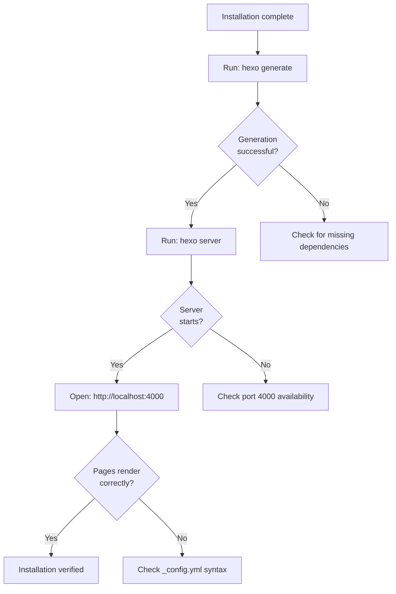
```mermaid
graph TD
    START["Installation complete"]
    
    GEN["Run: hexo generate"]
    CHECK_GEN{Generation<br/>successful?}
    
    SERVER["Run: hexo server"]
    CHECK_SERVER{Server<br/>starts?}
    
    BROWSER["Open: http://localhost:4000"]
    CHECK_RENDER{Pages render<br/>correctly?}
    
    SUCCESS["Installation verified"]
    
    ERROR_GEN["Check for missing dependencies"]
    ERROR_SERVER["Check port 4000 availability"]
    ERROR_RENDER["Check _config.yml syntax"]
    
    START --> GEN
    GEN --> CHECK_GEN
    CHECK_GEN -->|Yes| SERVER
    CHECK_GEN -->|No| ERROR_GEN
    
    SERVER --> CHECK_SERVER
    CHECK_SERVER -->|Yes| BROWSER
    CHECK_SERVER -->|No| ERROR_SERVER
    
    BROWSER --> CHECK_RENDER
    CHECK_RENDER -->|Yes| SUCCESS
    CHECK_RENDER -->|No| ERROR_RENDER
```

### 要执行的命令

1. **生成静态文件**：
   ```bash
   hexo generate
   ```
   用 Stellar 主题编译你的内容，确认无报错。

2. **启动开发服务器**：
   ```bash
   hexo server
   ```
   在 `http://localhost:4000` 启动本地服务。

3. **浏览器访问**：
   打开 `http://localhost:4000`，检查：
   - 页面是否带 Stellar 样式渲染
   - 导航元素是否出现
   - 浏览器开发者工具控制台无报错

### 常见安装问题

| 问题 | 原因 | 解决 |
|------|------|------|
| `Cannot find module 'hexo-theme-stellar'` | 主题未安装 | 执行 `npm i hexo-theme-stellar` |
| `hexo-renderer-ejs not found` | 缺少渲染器 | 应自动安装；可手动 `npm i hexo-renderer-ejs` |
| `hexo-renderer-stylus not found` | 缺少渲染器 | 应自动安装；可手动 `npm i hexo-renderer-stylus` |
| 页面显示 Hexo 默认主题 | 主题未启用 | 修改 `_config.yml`，设置 `theme: stellar` |
| CSS 未加载 | 资源路径错误 | 主题资源应自动从 `node_modules/` 加载 |

**参考源码**：[README.md](../../../README.md)、[package.json](../../../package.json)

---

## 版本管理

主题采用语义化版本，版本信息维护在两处。

### 版本位置

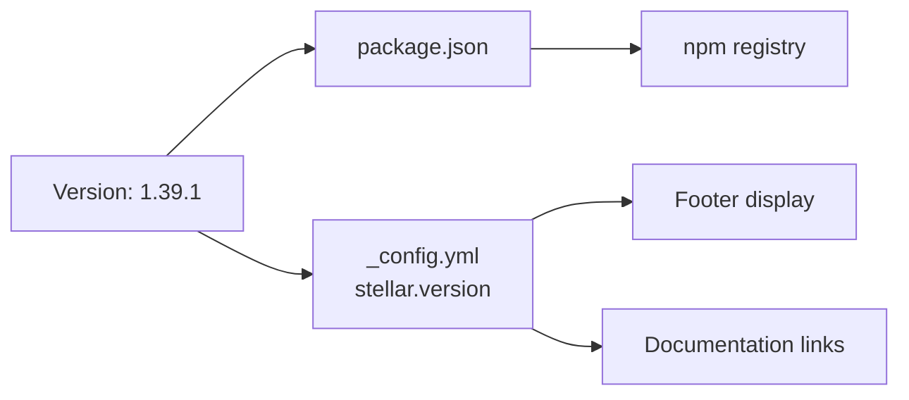
```mermaid
graph LR
    VER["Version: 1.39.1"]
    
    PKG["package.json"]
    CONFIG["_config.yml<br/>stellar.version"]
    
    VER --> PKG
    VER --> CONFIG
    
    PKG --> NPM["npm registry"]
    CONFIG --> FOOTER["Footer display"]
    CONFIG --> DOCS["Documentation links"]
```

- **package.json**：`"version": "1.39.1"`，供 npm 分发使用
- **_config.yml**：`stellar.version: '1.39.1'`，用于展示与文档链接

两处必须保持一致。版本号遵循 `MAJOR.MINOR.PATCH` 格式。

### 更新主题

```bash
npm update hexo-theme-stellar
```

或指定版本：

```bash
npm install hexo-theme-stellar@1.39.1
```

更新后请重新生成站点：

```bash
hexo clean
hexo generate
```

**参考源码**：[package.json](../../../package.json)、[_config.yml](../../../_config.yml)、[.github/workflows/npm-publish.yml](../../../.github/workflows/npm-publish.yml)

---

## 下一步

安装成功后：

1. **配置主题**：见[配置系统](configuration.md)，全面了解 `_config.yml` 选项
2. **搭建内容类型**：见[内容系统](../03-内容系统/content-overview.md)，了解博客、wiki、笔记本系统
3. **定制样式**：见[样式系统](../01-样式系统/styling-overview.md)的设计令牌配置
4. **启用插件**：见[插件系统](../07-外部集成/plugin-system.md)，了解 fancybox、mermaid、katex 等可选功能

主题现在已按默认设置可用。所有功能都可以通过配置文件启用和定制，无需修改主题源码。

**参考源码**：[README.md](../../../README.md)、[_config.yml](../../../_config.yml)

---

---
title: 总览
domain: 总览与安装配置
tags:
  - 架构
  - 总览
---

# 总览

<details>
<summary>相关源码文件</summary>

生成此页面时参考的主题源码文件：

- [.github/workflows/npm-publish.yml](../../../.github/workflows/npm-publish.yml)
- [.npmignore](../../../.npmignore)
- [LICENSE](../../../LICENSE)
- [README.md](../../../README.md)
- [_config.yml](../../../_config.yml)
- [layout/_partial/head.ejs](../../../layout/_partial/head.ejs)
- [layout/_partial/scripts/lazyload.ejs](../../../layout/_partial/scripts/lazyload.ejs)
- [layout/layout.ejs](../../../layout/layout.ejs)
- [package.json](../../../package.json)
- [scripts/helpers/json_ld.js](../../../scripts/helpers/json_ld.js)
- [source/css/_plugins/index.styl](../../../source/css/_plugins/index.styl)
- [source/js/main.js](../../../source/js/main.js)

</details>

Stellar 是一个功能全面的 Hexo 主题，内置四套并行内容管理系统：博客系统、文档（wiki）系统、专栏（topic）系统与笔记本（notebook）系统。本文从架构层面概述这些系统如何协同工作，以及主题如何把内容从配置、服务端渲染一路处理到客户端交互。

安装说明见[安装与启动](installation.md)，详细配置选项见[配置系统](configuration.md)。

## 架构理念

Stellar 采用**五层架构**，把配置、数据处理、渲染、客户端行为与样式分离，使主题可以支持多种内容类型并保持一致性，同时允许深度定制。

主题是**配置驱动**的：几乎所有行为都由 [_config.yml](../../../_config.yml) 控制，它是主题设置、内容布局、插件启用与样式参数的唯一事实来源。

### 核心架构分层

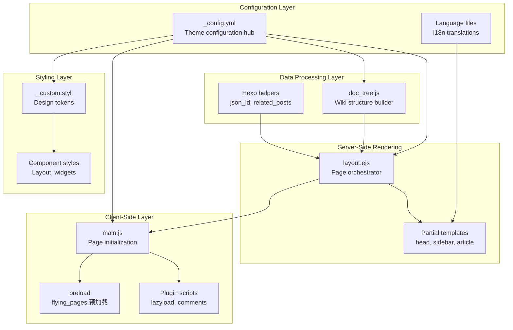
```mermaid
graph TB
    subgraph Configuration["Configuration Layer"]
        CONFIG["_config.yml<br/>Theme configuration hub"]
        LANG["Language files<br/>i18n translations"]
    end
    
    subgraph DataProcessing["Data Processing Layer"]
        DOCTREE["doc_tree.js<br/>Wiki structure builder"]
        HELPERS["Hexo helpers<br/>json_ld, related_posts"]
    end
    
    subgraph ServerRender["Server-Side Rendering"]
        LAYOUT["layout.ejs<br/>Page orchestrator"]
        PARTIALS["Partial templates<br/>head, sidebar, article"]
    end
    
    subgraph ClientSide["Client-Side Layer"]
        MAINJS["main.js<br/>Page initialization"]
        PRELOAD["preload<br/>flying_pages 预加载"]
        PLUGINS["Plugin scripts<br/>lazyload, comments"]
    end
    
    subgraph Styling["Styling Layer"]
        CUSTOM["_custom.styl<br/>Design tokens"]
        COMPONENTS["Component styles<br/>Layout, widgets"]
    end
    
    CONFIG --> DOCTREE
    CONFIG --> LAYOUT
    CONFIG --> MAINJS
    CONFIG --> CUSTOM
    LANG --> PARTIALS
    DOCTREE --> LAYOUT
    HELPERS --> LAYOUT
    LAYOUT --> PARTIALS
    LAYOUT --> MAINJS
    MAINJS --> PRELOAD
    MAINJS --> PLUGINS
    CUSTOM --> COMPONENTS
```

**参考源码**：[_config.yml](../../../_config.yml)、[layout/layout.ejs](../../../layout/layout.ejs)、[source/js/main.js](../../../source/js/main.js)、[scripts/helpers/json_ld.js](../../../scripts/helpers/json_ld.js)

## 配置级联

配置系统采用三级层级：页面级设置覆盖项目级设置，项目级设置再覆盖主题全局默认值。这一模式贯穿整个主题，用于控制布局、样式与行为。

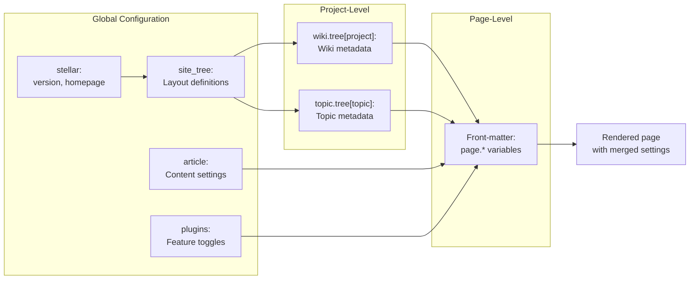
```mermaid
graph LR
    subgraph Global["Global Configuration"]
        STELLAR["stellar:<br/>version, homepage"]
        SITETREE["site_tree:<br/>Layout definitions"]
        ARTICLE["article:<br/>Content settings"]
        PLUGINS["plugins:<br/>Feature toggles"]
    end
    
    subgraph Project["Project-Level"]
        WIKITREE["wiki.tree[project]:<br/>Wiki metadata"]
        TOPICTREE["topic.tree[topic]:<br/>Topic metadata"]
    end
    
    subgraph Page["Page-Level"]
        FRONTMATTER["Front-matter:<br/>page.* variables"]
    end
    
    STELLAR --> SITETREE
    SITETREE --> WIKITREE
    SITETREE --> TOPICTREE
    WIKITREE --> FRONTMATTER
    TOPICTREE --> FRONTMATTER
    ARTICLE --> FRONTMATTER
    PLUGINS --> FRONTMATTER
    
    FRONTMATTER --> OUTPUT["Rendered page<br/>with merged settings"]
```

**参考源码**：[_config.yml](../../../_config.yml)、[layout/layout.ejs](../../../layout/layout.ejs)

`site_tree` 配置为不同类型的页面（博客文章、wiki 页面、笔记本页面等）定义默认布局，单个页面可通过 front-matter 覆盖这些默认值。同样，`article.type`、`article.indent` 等样式选项也可以在 wiki/topic 项目级或页面级覆盖。

## 页面渲染流水线

主题遵循四阶段渲染流水线，从构建期一直到客户端交互状态：

### 阶段 1：构建期数据处理

在 Hexo 构建阶段，主题处理内容文件并构造数据结构。其中 `doc_tree.js` 脚本（见[文档系统](../03-内容系统/wiki-docs.md)）尤其重要——它处理 wiki 配置，构建带小节、标签与交叉引用的层级化文档结构。

### 阶段 2：服务端渲染

`layout.ejs` 负责组装页面：

1. **确定页面特征**（[layout/layout.ejs](../../../layout/layout.ejs)）：
   - `page_type`："index" 或 "content"
   - `article_type`："tech" 或 "story"（影响排版与间距）
   - `indent`：是否段落首行缩进

2. **组装 HTML 结构**（[layout/layout.ejs](../../../layout/layout.ejs)）：
   - `<head>` 元数据、SEO 标签与样式
   - `#l_cover` 页面封面/横幅
   - `.l_body` 包含 `.l_left`（左栏）、`.l_main`（内容区）、`.l_right`（右栏）
   - 脚本与初始化代码

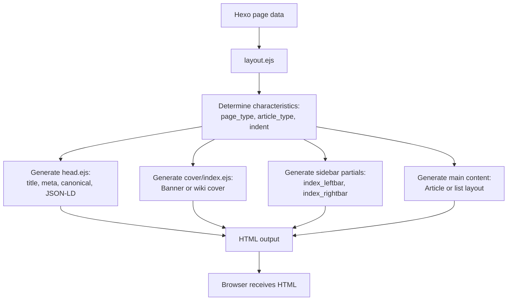
```mermaid
flowchart TD
    HEXODATA["Hexo page data"]
    LAYOUT["layout.ejs"]
    
    HEXODATA --> LAYOUT
    
    LAYOUT --> DETERMINE["Determine characteristics:<br/>page_type, article_type, indent"]
    DETERMINE --> HEAD["Generate head.ejs:<br/>title, meta, canonical, JSON-LD"]
    DETERMINE --> COVER["Generate cover/index.ejs:<br/>Banner or wiki cover"]
    DETERMINE --> SIDEBAR["Generate sidebar partials:<br/>index_leftbar, index_rightbar"]
    DETERMINE --> CONTENT["Generate main content:<br/>Article or list layout"]
    
    HEAD --> HTML["HTML output"]
    COVER --> HTML
    SIDEBAR --> HTML
    CONTENT --> HTML
    
    HTML --> BROWSER["Browser receives HTML"]
```

**参考源码**：[layout/layout.ejs](../../../layout/layout.ejs)、[layout/_partial/head.ejs](../../../layout/_partial/head.ejs)

### 阶段 3：客户端初始化

页面在浏览器中加载后，`stellar.initPage()`（[source/js/main.js](../../../source/js/main.js)）初始化交互功能：

- **目录（TOC）** 滚动同步
- **侧边栏** 交互处理
- **相对时间** 时间戳显示
- **标签页组件** tab 内容切换
- **评论系统** 重新初始化（如有）

### 阶段 4：页面导航与预加载

主题使用普通整页导航；可选的 `plugins.preload`（flying_pages）会在鼠标悬停时预加载站内链接，提升导航体验。PJAX 已于 v1.35.0 移除，详见主题仓库 `docs/designs/2026-08-08-pjax-removal.md`。

**参考源码**：[source/js/main.js](../../../source/js/main.js)、[_config.yml](../../../_config.yml)（`plugins.preload` 小节）

## 内容类型系统

Stellar 支持四套并行内容系统，各有独立的页面类型与导航模式：

### 系统对比

| 系统 | 列表页 | 内容页 | 主要特性 |
|------|--------|--------|----------|
| **博客** | `index_blog` | `post` | 分类、标签、分页、相关文章 |
| **文档（wiki）** | `index_wiki` | `wiki` | 项目树、小节、层级导航 |
| **专栏（topic）** | `index_topic` | `topic` | 系列文章、沉浸式阅读 |
| **笔记本** | `notebooks` → `notes` | `note` | 标签树导航、轻量笔记 |

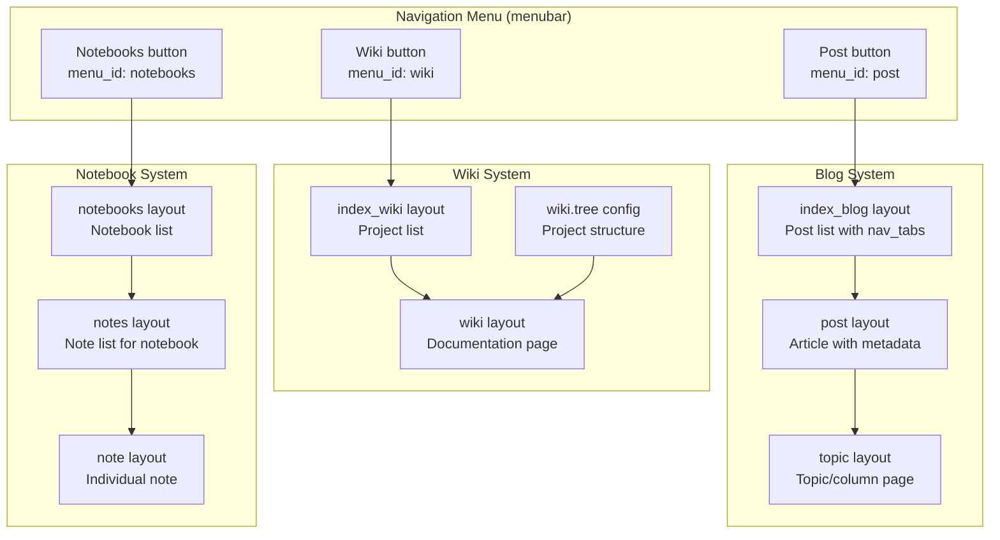
```mermaid
graph TB
    subgraph MenuBar["Navigation Menu (menubar)"]
        MENU1["Post button<br/>menu_id: post"]
        MENU2["Wiki button<br/>menu_id: wiki"]
        MENU3["Notebooks button<br/>menu_id: notebooks"]
    end
    
    subgraph BlogSystem["Blog System"]
        BLOGINDEX["index_blog layout<br/>Post list with nav_tabs"]
        BLOGPOST["post layout<br/>Article with metadata"]
        BLOGTOPIC["topic layout<br/>Topic/column page"]
    end
    
    subgraph WikiSystem["Wiki System"]
        WIKIINDEX["index_wiki layout<br/>Project list"]
        WIKIPAGE["wiki layout<br/>Documentation page"]
        WIKITREE["wiki.tree config<br/>Project structure"]
    end
    
    subgraph NotebookSystem["Notebook System"]
        NBLIST["notebooks layout<br/>Notebook list"]
        NOTELIST["notes layout<br/>Note list for notebook"]
        NOTEPAGE["note layout<br/>Individual note"]
    end
    
    MENU1 --> BLOGINDEX
    MENU2 --> WIKIINDEX
    MENU3 --> NBLIST
    
    BLOGINDEX --> BLOGPOST
    BLOGPOST --> BLOGTOPIC
    
    WIKIINDEX --> WIKIPAGE
    WIKITREE --> WIKIPAGE
    
    NBLIST --> NOTELIST
    NOTELIST --> NOTEPAGE
```

**参考源码**：[_config.yml](../../../_config.yml)（`site_tree` 小节）、[README.md](../../../README.md)

每个系统通过 `site_tree` 配置决定左右侧边栏显示哪些小部件。例如 wiki 页面左侧显示 tree（页面树）小部件，博客文章显示相关文章小部件。

## 关键子系统

### SEO 与元数据

`head.ejs` 局部模板生成完整的元数据（[layout/_partial/head.ejs](../../../layout/_partial/head.ejs)）：

- **标题生成**：支持 wiki/分类/标签上下文
- **Meta 描述**：来自页面摘要或项目描述
- **规范链接（canonical URL）**：处理重复内容
- **JSON-LD 结构化数据**：供搜索引擎使用（[scripts/helpers/json_ld.js](../../../scripts/helpers/json_ld.js)）
- **Open Graph 标签**：社交分享

### 插件系统

插件采用条件加载模式（[source/css/_plugins/index.styl](../../../source/css/_plugins/index.styl)）。主题检查配置中的 `plugins.*.enable` 标志，按需加载对应 CSS 与 JavaScript，包括：

- 图片增强（fancybox、swiper）
- 代码功能（copycode、语法高亮）
- 数学渲染（katex、mathjax）
- 图表（mermaid）
- 性能（scrollreveal、preload/flying_pages）

详见[插件系统](../07-外部集成/plugin-system.md)。

### 评论集成

评论系统根据 `comments.service` 配置条件加载。每种评论服务（Beaudar、Twikoo、Waline、Artalk、Giscus）都在 `window.stellar.initComments` 注册自己的初始化函数，页面加载完成后调用。

详见[评论系统](../07-外部集成/comment-systems.md)。

### 规范链接与克隆站检测

主题实现了两阶段规范链接系统（[source/js/main.js](../../../source/js/main.js)）：

1. 检查当前域名是否匹配配置的原始站点
2. 校验官方备用域名
3. 对非官方克隆站显示警告
4. 在适当时机注入 `noindex` meta 标签

这有助于防止内容被未经授权的站点复制，同时支持合法的备份部署。

## 数据流总结

下图展示数据从配置到渲染输出的完整流向：

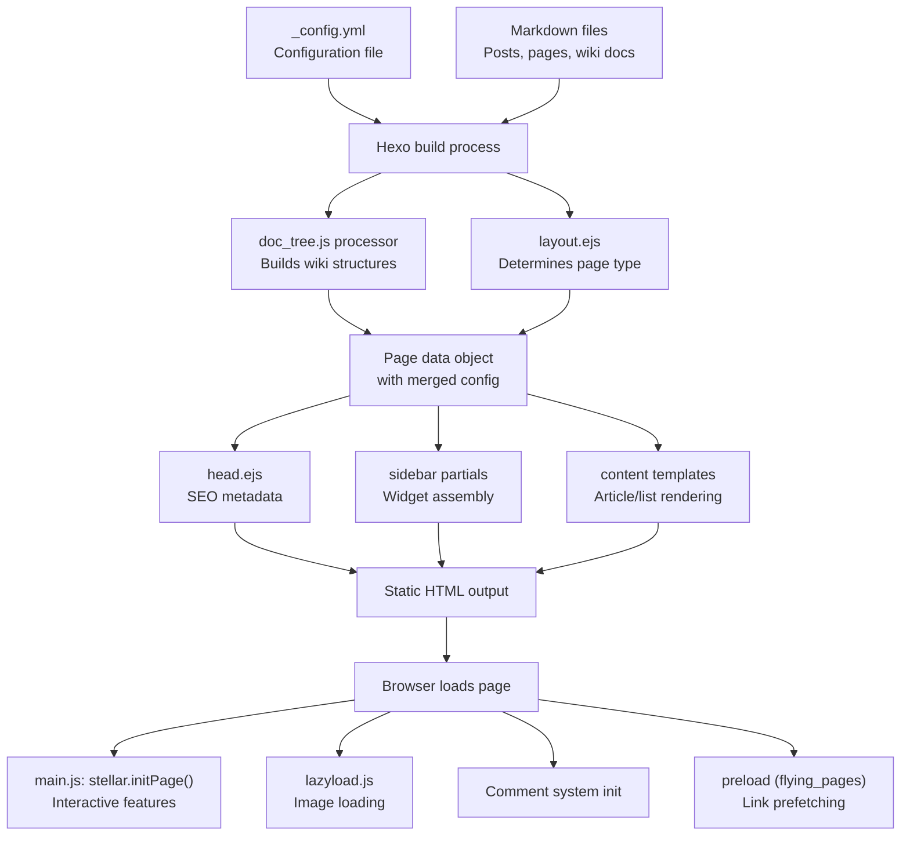
```mermaid
flowchart TD
    CONFIG["_config.yml<br/>Configuration file"]
    MARKDOWN["Markdown files<br/>Posts, pages, wiki docs"]
    
    CONFIG --> HEXO["Hexo build process"]
    MARKDOWN --> HEXO
    
    HEXO --> DOCTREE["doc_tree.js processor<br/>Builds wiki structures"]
    HEXO --> LAYOUTEJS["layout.ejs<br/>Determines page type"]
    
    DOCTREE --> PAGEDATA["Page data object<br/>with merged config"]
    LAYOUTEJS --> PAGEDATA
    
    PAGEDATA --> HEADEJS["head.ejs<br/>SEO metadata"]
    PAGEDATA --> SIDEBAREJS["sidebar partials<br/>Widget assembly"]
    PAGEDATA --> CONTENTEJS["content templates<br/>Article/list rendering"]
    
    HEADEJS --> STATICHTML["Static HTML output"]
    SIDEBAREJS --> STATICHTML
    CONTENTEJS --> STATICHTML
    
    STATICHTML --> BROWSER["Browser loads page"]
    
    BROWSER --> MAINJS["main.js: stellar.initPage()<br/>Interactive features"]
    BROWSER --> LAZYLOAD["lazyload.js<br/>Image loading"]
    BROWSER --> COMMENTS["Comment system init"]
    BROWSER --> PRELOAD["preload (flying_pages)<br/>Link prefetching"]
```

**参考源码**：[_config.yml](../../../_config.yml)、[layout/layout.ejs](../../../layout/layout.ejs)、[source/js/main.js](../../../source/js/main.js)

## 技术栈

主题基于以下技术构建：

- **Hexo**：静态站点生成器（Node.js）
- **EJS**：HTML 模板引擎
- **Stylus**：CSS 预处理器，带设计令牌体系
- **原生 JavaScript**：客户端代码无框架依赖
- **外部库（CDN）**：marked.js（运行时 Markdown 渲染）、vanilla-lazyload（图片懒加载）

**依赖** 定义在 [package.json](../../../package.json) 与 [_config.yml](../../../_config.yml)（`dependencies` 小节）。

## 目录结构概览

主题关键目录：

- `layout/` — EJS 模板
  - `layout.ejs` — 主布局编排
  - `_partial/` — 可复用模板组件
  - `_plugins/` — 插件集成模板
- `source/` — 客户端资源
  - `css/` — Stylus 样式
  - `js/` — JavaScript
    - `main.js` — 核心初始化
    - `plugins/` — 可选功能
    - `services/` — 数据服务
- `scripts/` — Hexo 构建期脚本
  - `helpers/` — 模板辅助函数
  - `generators/` — 页面生成器
  - `tags/` — 标签插件
  - `events/` — 构建事件处理

## 版本与分发

主题版本定义在两处：
- [_config.yml](../../../_config.yml) — `stellar.version`
- [package.json](../../../package.json) — `version` 字段

Stellar 通过 npm 以 `hexo-theme-stellar` 分发，采用 MIT 协议开源。

**参考源码**：[_config.yml](../../../_config.yml)、[package.json](../../../package.json)、[README.md](../../../README.md)

---

本文为理解 Stellar 架构提供了基础。更深入的子系统细节请参考后续各章节。

---

---
title: 代码块与语法高亮
domain: 样式系统
tags:
  - 代码块
  - 语法高亮
  - highlight
---

# 代码块与语法高亮

<details>
<summary>相关源码文件</summary>

生成此页面时参考的主题源码文件：

- [source/css/_common/base.styl](../../../source/css/_common/base.styl)
- [source/css/_common/highlight.styl](../../../source/css/_common/highlight.styl)
- [source/css/_plugins/comments/artalk.styl](../../../source/css/_plugins/comments/artalk.styl)

</details>

本文介绍 Stellar 的代码块样式与语法高亮系统：行内代码样式、多行代码块结构、语法令牌配色、语言专属样式与 GitHub Gist 集成。样式系统全部实现在 [source/css/_common/highlight.styl](../../../source/css/_common/highlight.styl)，包含语言检测与令牌配色逻辑。

copycode、mermaid 等插件化语法高亮/图表功能见[插件系统](../07-外部集成/plugin-system.md)。

---

## 代码块结构

Stellar 用基于表格的布局实现代码块，以便在代码旁显示可选行号。结构为 `.highlight` 容器内嵌 `<table>`，含两列：`.gutter`（行号）与 `.code`（代码内容）。

### DOM 结构

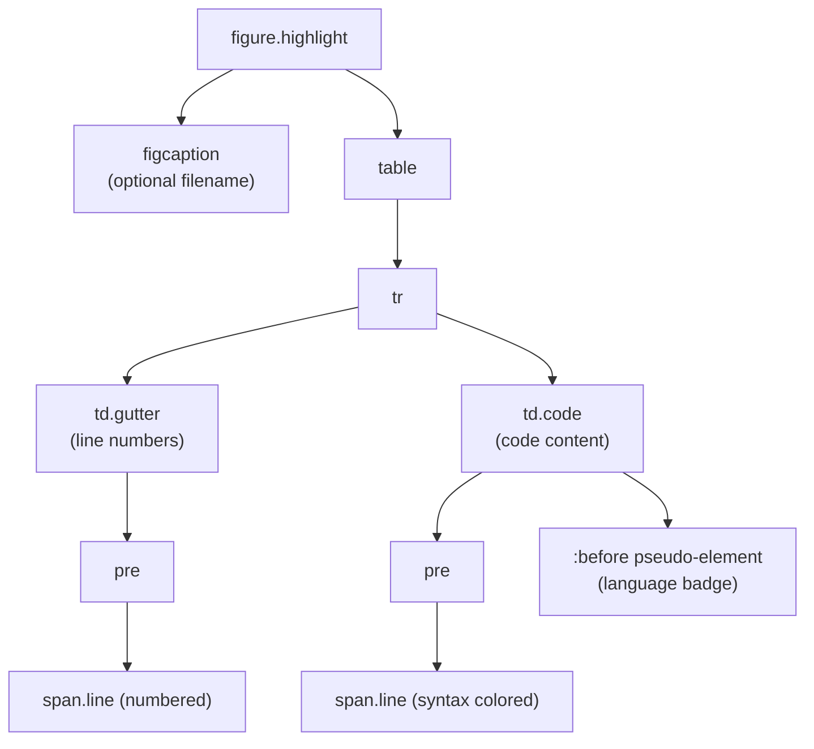
```mermaid
graph TB
    HIGHLIGHT["figure.highlight"]
    FIGCAPTION["figcaption<br/>(optional filename)"]
    TABLE["table"]
    TR["tr"]
    GUTTER["td.gutter<br/>(line numbers)"]
    CODE["td.code<br/>(code content)"]
    GUTTERPRE["pre"]
    CODEPRE["pre"]
    GUTTERLINES["span.line (numbered)"]
    CODELINES["span.line (syntax colored)"]
    
    HIGHLIGHT --> FIGCAPTION
    HIGHLIGHT --> TABLE
    TABLE --> TR
    TR --> GUTTER
    TR --> CODE
    GUTTER --> GUTTERPRE
    CODE --> CODEPRE
    GUTTERPRE --> GUTTERLINES
    CODEPRE --> CODELINES
    
    BADGE[":before pseudo-element<br/>(language badge)"]
    CODE --> BADGE
```

**参考源码**：[source/css/_common/highlight.styl](../../../source/css/_common/highlight.styl)

### 关键结构元素

`.highlight` 容器实现：

- **基础样式**：圆角用 `$border-card`，背景用 `--block` CSS 变量，`corner-shape: superellipse(1.2)` 实现平滑圆角
- **溢出处理**：容器与嵌套表格自动溢出，支持横向滚动
- **字体族**：`$ff-codeblock` 等宽字体
- **最小宽度**：移动端及以上 180px

表格结构移除默认表格样式（透明背景、无边框），并通过 `scrollbar-codeblock()` 配置自定义滚动条。

**参考源码**：[source/css/_common/highlight.styl](../../../source/css/_common/highlight.styl)

---

## 行内代码样式

行内代码元素按上下文使用不同样式规则，主题区分通用行内代码与样式化代码块。

### 行内代码变体

| 选择器 | 场景 | 样式 |
|--------|------|------|
| `p>code:not([class])` | 段落内代码 | `--block` 背景、`0.2em` padding、4px 圆角 |
| `li>code:not([class])` | 列表项内代码 | 同段落代码 |
| `code`（裸选择器） | 字体配置 | 字体族 `$ff-code`、平滑调整 |

`:not([class])` 确保带语言类（如 `<code class="language-javascript">`）的代码块不受行内样式规则影响。

**样式细节：**

- **字号**：`$fs-code`
- **颜色**：`var(--text-code)`，随主题切换的语义色
- **字体平滑**：显式设置 `-webkit-font-smoothing: auto` 与 `-moz-osx-font-smoothing: auto`

**参考源码**：[source/css/_common/highlight.styl](../../../source/css/_common/highlight.styl)

---

## 行号列（Gutter）

`.gutter` 列显示行号，样式设计为不打扰阅读。

### Gutter 配置

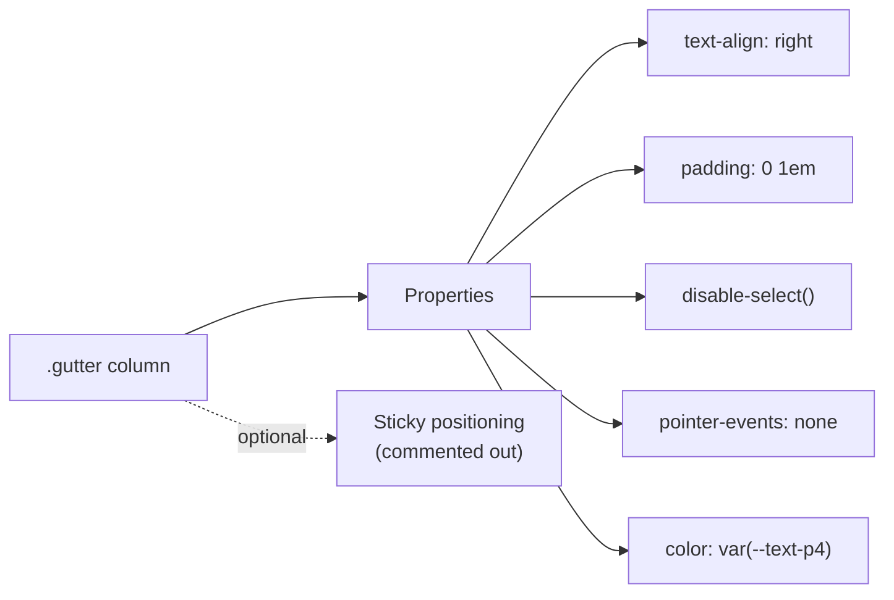
```mermaid
graph LR
    GUTTER[".gutter column"]
    PROPS["Properties"]
    NOSTICKY["Sticky positioning<br/>(commented out)"]
    
    GUTTER --> PROPS
    PROPS --> ALIGN["text-align: right"]
    PROPS --> PAD["padding: 0 1em"]
    PROPS --> SELECT["disable-select()"]
    PROPS --> POINTER["pointer-events: none"]
    PROPS --> COLOR["color: var(--text-p4)"]
    
    GUTTER -.optional.-> NOSTICKY
```

gutter 实现：

- **禁用指针事件**：`pointer-events: none` 防止交互
- **禁止选中**：`disable-select()` 混入
- **右对齐**：数字靠右
- **低对比颜色**：`var(--text-p4)` 弱化存在感
- **可选 sticky 定位**：`position: sticky` 与 `background: var(--block)` 被注释掉，窄屏体验更好

有 gutter 时，代码列调整 padding：

```stylus
.gutter+.code pre
  padding-left: 0.25em
```

**参考源码**：[source/css/_common/highlight.styl](../../../source/css/_common/highlight.styl)

---

## 语言徽章系统

主题用 CSS `:before` 伪元素在代码块右上角自动显示语言标签，系统检测 `.highlight` 元素上的语言类。

### 徽章实现

语言徽章绝对定位：

- **位置**：`top: 0, right: 0`
- **样式**：透明度 0.25、font-weight 700、颜色用 `--theme` 变量
- **内边距**：`4px 0.5rem`

### 支持的语言

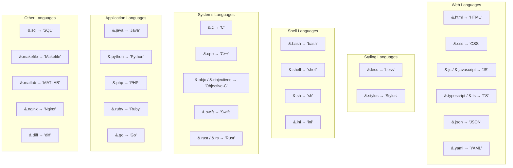
```mermaid
graph TB
    subgraph "Web Languages"
        HTML["&.html → 'HTML'"]
        CSS["&.css → 'CSS'"]
        JS["&.js / &.javascript → 'JS'"]
        TS["&.typescript / &.ts → 'TS'"]
        JSON["&.json → 'JSON'"]
        YAML["&.yaml → 'YAML'"]
    end
    
    subgraph "Styling Languages"
        LESS["&.less → 'Less'"]
        STYLUS["&.stylus → 'Stylus'"]
    end
    
    subgraph "Shell Languages"
        BASH["&.bash → 'bash'"]
        SHELL["&.shell → 'shell'"]
        SH["&.sh → 'sh'"]
        INI["&.ini → 'ini'"]
    end
    
    subgraph "Systems Languages"
        C["&.c → 'C'"]
        CPP["&.cpp → 'C++'"]
        OBJC["&.objc / &.objectivec → 'Objective-C'"]
        SWIFT["&.swift → 'Swift'"]
        RUST["&.rust / &.rs → 'Rust'"]
    end
    
    subgraph "Application Languages"
        JAVA["&.java → 'Java'"]
        PYTHON["&.python → 'Python'"]
        PHP["&.php → 'PHP'"]
        RUBY["&.ruby → 'Ruby'"]
        GO["&.go → 'Go'"]
    end
    
    subgraph "Other Languages"
        SQL["&.sql → 'SQL'"]
        MAKEFILE["&.makefile → 'Makefile'"]
        MATLAB["&.matlab → 'MATLAB'"]
        NGINX["&.nginx → 'Nginx'"]
        DIFF["&.diff → 'diff'"]
    end
```

徽章系统用 Stylus 父引用语法（`&`）生成复合选择器。例如 `&.python .code:before` 生成 `.highlight.python .code:before`。

**参考源码**：[source/css/_common/highlight.styl](../../../source/css/_common/highlight.styl)

---

## 语法令牌配色

主题为语法高亮令牌定义完整调色板，组合预定义颜色与 CSS 自定义属性。

### 颜色令牌定义

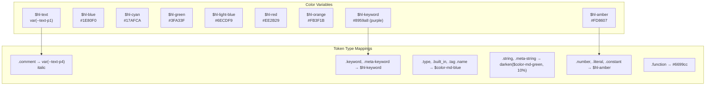
```mermaid
graph TB
    subgraph "Color Variables"
        KEYWORD["$hl-keyword<br/>#8959a8 (purple)"]
        BLUE["$hl-blue<br/>#1E80F0"]
        CYAN["$hl-cyan<br/>#17AFCA"]
        GREEN["$hl-green<br/>#3FA33F"]
        LIGHTBLUE["$hl-light-blue<br/>#6ECDF9"]
        RED["$hl-red<br/>#EE2B29"]
        ORANGE["$hl-orange<br/>#FB3F1B"]
        AMBER["$hl-amber<br/>#FD8607"]
        TEXT["$hl-text<br/>var(--text-p1)"]
    end
    
    subgraph "Token Type Mappings"
        COMMENTS[".comment → var(--text-p4)<br/>italic"]
        KEYWORDS[".keyword, .meta-keyword → $hl-keyword"]
        TYPES[".type, .built_in, .tag .name → $color-md-blue"]
        STRINGS[".string, .meta-string → darken($color-md-green, 10%)"]
        NUMBERS[".number, .literal, .constant → $hl-amber"]
        FUNCTIONS[".function → #6699cc"]
    end
    
    KEYWORD --> KEYWORDS
    TEXT --> COMMENTS
    AMBER --> NUMBERS
```

**参考源码**：[source/css/_common/highlight.styl](../../../source/css/_common/highlight.styl)

### 令牌类型分类

语法高亮系统把令牌分为语义组：

| 分类 | 令牌类 | 颜色 |
|------|--------|------|
| **注释** | `.comment` | `var(--text-p4)` + 斜体 |
| **关键字** | `.keyword`、`.meta-keyword`、`.javascript .function` | `$hl-keyword`（#8959a8） |
| **类型** | `.type`、`.built_in`、`.tag .name` | `$color-md-blue` |
| **变量** | `.variable`、`.regexp` 及各类 XML/HTML/CSS | `$hl-amber` |
| **数字** | `.number`、`.preprocessor`、`.literal`、`.constant` | `$hl-amber` |
| **字符串** | `.string`、`.meta-string` | `darken($color-md-green, 10%)` |
| **属性** | `.title`、`.attr`、`.attribute` | `$color-md-indigo` |
| **函数** | `.function` 及各类语言专属 | `#6699cc` |

`.marked` 类提供行高亮，使用半透明黄色背景（`alpha(#FED542, .4)`）。

**参考源码**：[source/css/_common/highlight.styl](../../../source/css/_common/highlight.styl)

---

## 语言专属令牌覆盖

部分语言需要不同于默认方案的专属配色。主题为 HTML、CSS、JSON、YAML 与 Objective-C 家族提供覆盖。

### HTML/CSS/Less/Stylus 覆盖

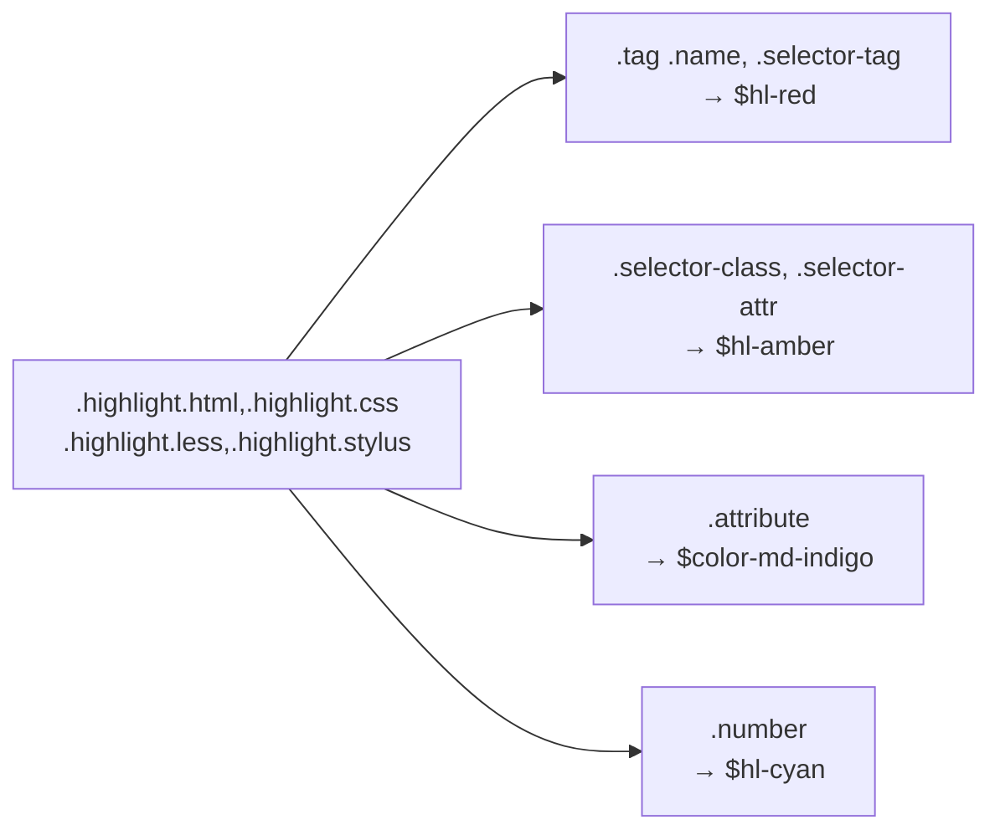
```mermaid
graph LR
    HTMLCSS[".highlight.html,.highlight.css<br/>.highlight.less,.highlight.stylus"]
    
    HTMLCSS --> TAG[".tag .name, .selector-tag<br/>→ $hl-red"]
    HTMLCSS --> CLASS[".selector-class, .selector-attr<br/>→ $hl-amber"]
    HTMLCSS --> ATTR[".attribute<br/>→ $color-md-indigo"]
    HTMLCSS --> NUM[".number<br/>→ $hl-cyan"]
```

这些语言：

- **标签名**：红色（`$hl-red`）用于 HTML/CSS 元素选择器
- **类与属性选择器**：琥珀色（`$hl-amber`）
- **属性名**：靛蓝（`$color-md-indigo`）
- **数字**：青色（`$hl-cyan`）而非默认琥珀

**参考源码**：[source/css/_common/highlight.styl](../../../source/css/_common/highlight.styl)

### Objective-C/Swift/C 覆盖

```mermaid
graph LR
    OBJC[".highlight.objc,.highlight.objectivec<br/>.highlight.swift,.highlight.c"]
    
    OBJC --> META[".meta<br/>→ $hl-keyword"]
    OBJC --> CLASS[".class<br/>→ $hl-text"]
```

C 家族语言：

- **Meta 指令**：预处理器指令用关键字色（紫）
- **类名**：用文本色而非默认橙色

**参考源码**：[source/css/_common/highlight.styl](../../../source/css/_common/highlight.styl)

### JSON 令牌覆盖

```mermaid
graph LR
    JSON[".highlight.json"]
    
    JSON --> ATTR[".attr<br/>→ #E24F5A (red)"]
    JSON --> LITERAL[".literal<br/>→ $color-md-indigo"]
```

JSON：

- **属性名**：红色（`#E24F5A`）用于对象键
- **字面量**：靛蓝用于 `true`、`false`、`null`

**参考源码**：[source/css/_common/highlight.styl](../../../source/css/_common/highlight.styl)

### YAML 令牌覆盖

```mermaid
graph LR
    YAML[".highlight.yaml"]
    
    YAML --> ATTR[".attr<br/>→ #E24F5A (red)"]
```

YAML 属性名用红色（`#E24F5A`），与 JSON 保持一致。

**参考源码**：[source/css/_common/highlight.styl](../../../source/css/_common/highlight.styl)

---

## 文件名显示

代码块可在 `<figcaption>` 元素中显示可选文件名，位于代码上方。

figcaption 样式包括：

- **颜色**：`var(--text-p2)` 次级文本
- **字号**：`$fs-codeblock`
- **字重**：500 中等强调
- **定位**：inline-block，左边距 0.5rem
- **徽章样式**：内部 `<span>` 有底部圆角与 `--block` 背景

结构让文件名像标签页一样出现在代码块顶部。

**参考源码**：[source/css/_common/highlight.styl](../../../source/css/_common/highlight.styl)

---

## GitHub Gist 集成

主题为内嵌 GitHub Gist 提供专属样式，使其与 Stellar 设计体系视觉融合。

### Gist 样式系统

```mermaid
graph TB
    GIST[".md-text .gist"]
    GISTFILE[".gist-file<br/>(container)"]
    GISTDATA[".gist-data<br/>(code area)"]
    HIGHLIGHT[".highlight<br/>(syntax colored code)"]
    GISTMETA[".gist-meta<br/>(footer)"]
    
    GIST --> GISTFILE
    GISTFILE --> GISTDATA
    GISTFILE --> GISTMETA
    GISTDATA --> HIGHLIGHT
    
    BORDER["border: 1px solid var(--block-border)<br/>border-radius: $border-card<br/>corner-shape: superellipse(1.2)"]
    BGOVERRIDE["--bgColor-default: var(--block)"]
    NOBORDER[".highlight:<br/>border: none<br/>border-radius: 0"]
    
    GISTFILE --> BORDER
    GISTDATA --> BGOVERRIDE
    HIGHLIGHT --> NOBORDER
```

Gist 集成覆盖 GitHub 默认样式：

- **容器边框**：用主题 `--block-border`、`$border-card` 圆角与 superellipse 形状
- **背景颜色**：把 `--bgColor-default` 设为 `var(--block)`，保持主题一致
- **高亮样式**：移除嵌套 `.highlight` 的边框/圆角，加 1em 垂直 padding
- **代码内部**：文字用 `var(--text-p1)`，字体用 `$ff-codeblock`
- **Meta 页脚**：`var(--block)` 背景

保证内嵌 Gist 与主题视觉语言一致，同时保留其语法高亮。

**参考源码**：[source/css/_common/highlight.styl](../../../source/css/_common/highlight.styl)

---

## Pre 标签与 HLJS 集成

主题通过专门的 `<pre>` 样式支持 highlight.js（HLJS）等替代高亮系统。

### HLJS 风格代码块

带 `.hljs` 类的代码块：

```stylus
.md-text pre
  >.caption
    color: var(--text-p3)
  >.hljs
    padding: 1rem
    border-radius: $border-card
    line-height: 1.5
    box-sizing: border-box
```

应用：

- **标题颜色**：`var(--text-p3)`
- **内边距**：1rem
- **圆角**：`$border-card`
- **行高**：1.5

无类的裸 `<pre>` 标签同样按代码块处理，`--block` 背景与标准边距。

**参考源码**：[source/css/_common/highlight.styl](../../../source/css/_common/highlight.styl)

---

## 滚动条配置

代码块通过 `scrollbar-codeblock()` 函数配置自定义滚动条，值来自主题配置。

### 滚动条应用

滚动条应用到 `.highlight` 内的嵌套表格：

```stylus
scrollbar-codeblock(convert(hexo-config('style.codeblock.scrollbar')))
```

该调用：

1. 从 `_config.yml` 读取 `style.codeblock.scrollbar`
2. 用 `convert()` 转换
3. 通过 `scrollbar-codeblock()` 混入应用滚动条样式

代码行超出容器宽度出现横向溢出时才显示滚动条。

**参考源码**：[source/css/_common/highlight.styl](../../../source/css/_common/highlight.styl)

---

## 评论系统代码样式

Artalk 评论系统包含专属代码块样式，保证评论内容一致性。

### Artalk 代码覆盖

```mermaid
graph TB
    CMT[".cmt-body.artalk"]
    
    CMT --> FIX1[".artalk pre code<br/>background: none"]
    CMT --> FIX2[".atk-layer-wrap pre code<br/>background: none"]
    CMT --> FIX3[".atk-content a pre>code<br/>padding: 0"]
    
    INLINE["Inline code inherits<br/>base theme styling"]
    
    FIX1 -.removes.-> INLINE
    FIX2 -.removes.-> INLINE
```

Artalk 集成：

- **背景移除**：`pre code` 设置 `background: none`，防止双重背景
- **文本域样式**：移除背景、边框，设置编辑器 padding/margin
- **链接内代码**：`padding: 0`

避免主题行内代码样式与 Artalk 评论渲染冲突。

**参考源码**：[source/css/_plugins/comments/artalk.styl](../../../source/css/_plugins/comments/artalk.styl)

---

## 基础 Pre 元素样式

基础 `<pre>` 元素在 `.highlight` 系统之前获得基础样式。

### Pre 元素配置

```stylus
pre
  font-family: $ff-codeblock
  font-size: $fs-codeblock
  tab-size: 4
  -moz-tab-size: 4
  -o-tab-size: 4
  -webkit-tab-size: 4
```

设定：

- **字体族**：`$ff-codeblock` 等宽字体
- **字号**：`$fs-codeblock`
- **制表符**：全浏览器 4 空格（标准、Mozilla、Opera、WebKit）

这些基础样式保证在语言专属或高亮专属样式应用前的一致渲染。

**参考源码**：[source/css/_common/base.styl](../../../source/css/_common/base.styl)

---

## 视觉效果集成

代码块与工具层定义的模糊与圆角效果集成。

### 应用效果

`.highlight` 容器使用：

- **圆角**：`$border-card` 设计令牌
- **圆角形状**：`corner-shape: superellipse(1.2)`，iOS 风格平滑圆角
- **背景**：`var(--block)` 主题感知 CSS 变量

这些效果是主题整体视觉语言的一部分，详见[Stylus 工具与混入](stylus-utilities.md)。

**参考源码**：[source/css/_common/highlight.styl](../../../source/css/_common/highlight.styl)

---

---
title: 颜色与深色模式
domain: 样式系统
tags:
  - 颜色
  - 深色模式
  - HSL
---

# 颜色与深色模式

<details>
<summary>相关源码文件</summary>

生成此页面时参考的主题源码文件：

- [source/css/_components/partial/navbar.styl](../../../source/css/_components/partial/navbar.styl)
- [source/css/_components/sidebar/search.styl](../../../source/css/_components/sidebar/search.styl)
- [source/css/_components/sidebar/sidebar.styl](../../../source/css/_components/sidebar/sidebar.styl)
- [source/css/_custom.styl](../../../source/css/_custom.styl)
- [source/css/_defines/func.styl](../../../source/css/_defines/func.styl)
- [source/css/_defines/theme_base.styl](../../../source/css/_defines/theme_base.styl)
- [source/css/_common/highlight.styl](../../../source/css/_common/highlight.styl)

</details>

## 目的与范围

本文介绍 Stellar 的颜色系统与深色模式实现：主题色如何配置、语义化颜色令牌的 CSS 变量架构，以及支持浅色、深色与系统偏好自动检测的多模式主题系统。

字体与排版见[排版系统](typography.md)；响应式见[响应式设计](responsive-design.md)；通用 CSS 工具与混入见[Stylus 工具与混入](stylus-utilities.md)。

## 颜色配置系统

主题颜色始于 `_config.yml` 的 `style.color` 小节，经 `_custom.styl`、`theme_base.styl` 与 `:root` CSS 块三阶段流水线转换为 Stylus 变量与 CSS 自定义属性。

### 配置到 CSS 的流程

**颜色变量流水线**

```mermaid
graph TD
    CONFIG[""_config.yml
 style.color.*""]
    CUSTOM[""_custom.styl
 $c-theme, $c-accent, $c-link""]
    THEME_BASE[""theme_base.styl
 x-set-theme-with-color()
 x-set-link-with-color()
 x-set-bg-colors()
 x-set-text-colors()""]
    ROOT["":root { }
 CSS custom properties""]
    COMPONENTS[""Component .styl files
 var(--theme), var(--link), etc.""]

    CONFIG -->|"hexo-config()"| CUSTOM
    CUSTOM -->|"$c-theme, $c-accent, $c-link"| THEME_BASE
    THEME_BASE -->|"dynamic-theme-light()
 dynamic-theme-dark()"| ROOT
    ROOT -->|"var() references"| COMPONENTS
```

**参考源码**：[source/css/_custom.styl](../../../source/css/_custom.styl)、[source/css/_defines/theme_base.styl](../../../source/css/_defines/theme_base.styl)

### 主要颜色变量

三个主颜色值从 `_config.yml` 读取并转换为 `_custom.styl` 中的 Stylus 变量：

| 配置键 | Stylus 变量 | 生成的 CSS 属性 |
|--------|-------------|----------------|
| `style.color.theme` | `$c-theme` | `--theme`、`--theme-a10/20/30`、`--hue`、`--sat`、`--light` |
| `style.color.accent` | `$c-accent` | `--accent` |
| `style.color.link` | `$c-link` | `--link`、`--link-a20` |

配置转换使用 `hexo-config()` 与 `convert()`。

另外，`$c-base-hue`（默认 `210deg`）控制所有背景与文字颜色计算的基础色相，定义于 `_custom.styl`，被 `theme_base.styl` 全程消费。

### 基于 HSLA 的颜色生成（theme_base.styl）

`source/css/_defines/theme_base.styl` 提供一组 Stylus 函数，用 HSLA 颜色模型生成 CSS 变量声明，无需复制十六进制值即可实现组件级动态透明度。

**核心工具函数：**

| 函数 | 输出 CSS 变量 | 说明 |
|------|--------------|------|
| `x-hsla(h, s, l, a)` | （内联值） | 由分量参数构造 `hsla()` 字符串 |
| `x-theme-alpha(a)` | （内联值） | 用 `--hue`、`--sat`、`--light` 返回指定透明度 `a` 的主题色 |
| `x-set-theme-with-color($color)` | `--hue`、`--sat`、`--light`、`--alpha`、`--theme`、`--theme-a10/20/30` | 把 Stylus 颜色分解为 HSL 通道变量 |
| `x-set-link-with-color($color)` | `--link`、`--link-a20` | 设置链接色与半透明变体 |
| `x-set-bg-colors($scheme)` | `--bg-a20/50/60/75/100` | 设置按透明度阶梯的白/黑背景 |
| `x-set-text-colors($scheme)` | `--text`、`--text-p1/2/3/4`、`--text-meta`、`--text-code`、`--text-a10/20`、`--block`、`--block-border` | 设置完整文字与块颜色层级 |

**参考源码**：[source/css/_defines/theme_base.styl](../../../source/css/_defines/theme_base.styl)

`:root` 块用 `_custom.styl` 的 Stylus 变量调用这些函数。`$c-accent` 直接作为 `--accent` 应用，不做 HSLA 分解（不需要透明度变体）。

## CSS 变量架构

主题使用语义化 CSS 变量系统：令牌按用途命名而非外观。所有变量由 `theme_base.styl` 的函数定义在 `:root` 上，主题模式切换时自动更换值。

### 语义化颜色令牌图

**CSS 自定义属性参考**

```mermaid
graph TB
    ROOT["":root
(theme_base.styl)""]

    subgraph "Text (x-set-text-colors)"
        T0[""--text""]
        T1[""--text-p1""]
        T2[""--text-p2""]
        T3[""--text-p3""]
        T4[""--text-p4""]
        TM[""--text-meta""]
        TC[""--text-code""]
        TA[""--text-a10, --text-a20""]
    end

    subgraph "Background (x-set-bg-colors)"
        BG1[""--bg-a20""]
        BG2[""--bg-a50""]
        BG3[""--bg-a60""]
        BG4[""--bg-a75""]
        BG5[""--bg-a100""]
        BK[""--block""]
        BB[""--block-border""]
        BGM[""--background""]
        CD[""--card""]
    end

    subgraph "Interactive (x-set-theme-with-color / x-set-link-with-color)"
        TH[""--theme""]
        TH1[""--theme-a10/20/30""]
        LK[""--link""]
        LK2[""--link-a20""]
        AC[""--accent""]
    end

    ROOT --> T0
    ROOT --> BG1
    ROOT --> TH
```

**参考源码**：[source/css/_defines/theme_base.styl](../../../source/css/_defines/theme_base.styl)

### 颜色变量分类

**文字层级**（`x-set-text-colors($scheme)` 生成）：

| 变量 | Alpha | 用法示例 |
|------|-------|----------|
| `--text` | 1.0 | 主要正文 |
| `--text-p1` | 0.8 | 较强次级文本 |
| `--text-p2` | 0.7 | 普通次级文本 |
| `--text-p3` | 0.5 | 弱化文本 |
| `--text-p4` | 0.4 | 很弱文本，如行号 |
| `--text-meta` | 0.2 | 元信息、装饰 |
| `--text-code` | 0.9 | 行内代码；深色模式下覆盖 |

深色模式下 `--text-code` 显式设为暖色（HSL 20, 75%, 60%），而非标准 alpha 派生值。

**背景层级：**

- `--background`：页面根背景（`dynamic-theme-light()` / `dynamic-theme-dark()`）
- `--card`：卡片表面色；设置站点背景图时为 `rgba(white, 0.5)`
- `--block`：组件内部填充（代码块、表头等）
- `--block-border`：组件边框/分隔线色
- `--bg-a20` ~ `--bg-a100`：按透明度阶梯的中性背景，用于遮罩与状态

**交互：**

- `--theme`、`--theme-a10/20/30`：品牌主色与透明度变体
- `--accent`：悬停目标色（来自 `$c-accent`，直接应用在 `:root`）
- `--link`、`--link-a20`：超链接色与半透明变体

**参考源码**：[source/css/_defines/theme_base.styl](../../../source/css/_defines/theme_base.styl)、[source/css/_common/base.styl](../../../source/css/_common/base.styl)、[source/css/_common/highlight.styl](../../../source/css/_common/highlight.styl)

## 深色模式实现

主题实现三态主题系统：显式浅色、显式深色、系统偏好自动检测。三种状态都在 `theme_base.styl` 的 `:root` 层解析。

### `dynamic-theme-light()` 与 `dynamic-theme-dark()`

两个 Stylus 混入为各自模式定义完整颜色变量集：

| 混入 | 关键变量 |
|------|----------|
| `dynamic-theme-light()` | `--background: hsla(210, 20%, 98%, 1)`、`--card: white`（背景图时为半透明），然后调用 `x-set-bg-colors('light')` 与 `x-set-text-colors('light')` |
| `dynamic-theme-dark()` | `--background: hsla(210, 8%, 12%, 1)`（手机端为黑色）、`--card: hsla(210, 10%, 24%, 1)`（或半透明），然后调用 `x-set-bg-colors('dark')` 与 `x-set-text-colors('dark')` |

**参考源码**：[source/css/_defines/theme_base.styl](../../../source/css/_defines/theme_base.styl)

### 主题模式切换机制

**theme_base.styl 中 `:root` 选择器解析**

```mermaid
flowchart TD
    A["":root
(always applied)""]
    B[""@media (prefers-color-scheme: dark)""]
    C["":root[data-theme='light']""]
    D["":root[data-theme='dark']""]
    LIGHT[""dynamic-theme-light()""]
    DARK[""dynamic-theme-dark()""]

    A -->|"default"| LIGHT
    A --> B
    B -->|"system prefers dark"| DARK
    C -->|"explicit override"| LIGHT
    D -->|"explicit override"| DARK
```

**参考源码**：[source/css/_defines/theme_base.styl](../../../source/css/_defines/theme_base.styl)

`<html>` 元素上的 `data-theme` 属性提供显式用户覆盖。缺省时 `:root` 内的 `@media (prefers-color-scheme: dark)` 提供系统级自动检测。

### 组件中的主题选择器模式

当 CSS 变量无法表达模式专属覆盖（如 `backdrop-filter` 透明度、`box-shadow` 细节）时，组件文件重复三段式选择器：

**模式 1 — 显式深色：**

```
:root[data-theme="dark"] &
```

**模式 2 — 系统偏好兜底：**

```
@media (prefers-color-scheme: dark)
```

### `ondark()` / `onlight()` 混入模式

`ondark()` 与 `onlight()` 是 Stylus 块混入，作为其他混入中的简写容器。`func.styl` 的 `hoverable-card()` 展示了完整模式：

结构为：

1. 用 `onlight()` / `ondark()` 块定义模式专属属性值
2. 在 `:root[data-theme="light"]` 与 `:root[data-theme="dark"]` 下应用同样的块，实现显式覆盖
3. 在 `:root:not([data-theme])` 内应用默认值加 `@media (prefers-color-scheme: dark)` 兜底，实现自动检测

这保证：

- 显式 `data-theme` 属性优先于系统偏好
- 无 `data-theme` 时应用系统偏好
- 两者皆无时默认浅色

同一模式也出现在 `newblur()`、侧边栏样式与搜索样式中。

**参考源码**：[source/css/_defines/func.styl](../../../source/css/_defines/func.styl)、[source/css/_components/sidebar/sidebar.styl](../../../source/css/_components/sidebar/sidebar.styl)、[source/css/_components/sidebar/search.styl](../../../source/css/_components/sidebar/search.styl)

## 颜色应用模式

### 侧边栏背景色

左栏（`.l_left .sidebg`）支持图片背景与纯色背景，各有深色模式调整。`$leftbar-background-image`、`$leftbar-background-color-light`、`$leftbar-background-color-dark` 从 `_config.yml` 经 `_custom.styl` 读取。

**`.l_left .sidebg` 背景解析逻辑**

```mermaid
flowchart TD
    START[""$leftbar-background-image set?""]
    IMG[""Image mode:
 filter: saturate blur opacity(--background-opacity)""]
    DARK_IMG[""Dark: --background-opacity *= 0.75"
[:root[data-theme=dark] / prefers-color-scheme:dark]"]
    COLOR_CHECK[""$leftbar-background-color-light/dark set?""]
    COLOR[""Color mode:
 background-color: $leftbar-background-color-light""]
    DARK_COLOR[""Dark: background-color: $leftbar-background-color-dark""]
    NONE[""Default: transparent""]

    START -->|"yes"| IMG
    IMG --> DARK_IMG
    START -->|"no"| COLOR_CHECK
    COLOR_CHECK -->|"yes"| COLOR
    COLOR --> DARK_COLOR
    COLOR_CHECK -->|"no"| NONE
```

**参考源码**：[source/css/_components/sidebar/sidebar.styl](../../../source/css/_components/sidebar/sidebar.styl)、[source/css/_custom.styl](../../../source/css/_custom.styl)

| 变量 | 来源 | 用途 |
|------|------|------|
| `$leftbar-background-image` | `_custom.styl` | 背景图 URL |
| `$leftbar-background-color-light` | `_custom.styl` | 浅色模式纯色 |
| `$leftbar-background-color-dark` | `_custom.styl` | 深色模式纯色 |
| `--blur-px` | `sidebar.styl` CSS 变量 | 图片模糊半径 |
| `--background-opacity` | `sidebar.styl` CSS 变量 | 图片透明度；深色模式乘以 0.75 |

### 导航栏激活状态颜色

导航栏激活链接浅色模式用 `--bg-a60`，深色模式回退到硬编码 `rgba(white, 0.25)`——因为 `--bg-a60`（白色 60% 透明度）在深色玻璃表面视觉上不明显。

这是语义变量在浅色模式足够、但深色模式需要直接覆盖的代表性案例。

## 语法高亮颜色系统

代码块采用混合方案：语法令牌用固定 Stylus 颜色常量，文字与背景用随主题模式切换的语义 CSS 变量。

### 语法令牌颜色常量

定义于 `highlight.styl`：

| Stylus 变量 | Hex | 令牌用途 |
|-------------|-----|----------|
| `$hl-keyword` | `#8959a8` | 关键字、`javascript .function` |
| `$hl-blue` | `#1E80F0` | 类型、内建对象、标签名 |
| `$hl-cyan` | `#17AFCA` | HTML/CSS 上下文中的数字 |
| `$hl-green` | `#3FA33F` | 字符串、diff 新增 |
| `$hl-red` | `#EE2B29` | diff 删除、HTML 标签名 |
| `$hl-orange` | `#FB3F1B` | — |
| `$hl-amber` | `#FD8607` | 变量、数字字面量、常量 |

**主题感知令牌变量：**

- `$hl-text` 解析为 `var(--text-p1)`——主代码文字，随深色模式切换
- `.comment` 用 `var(--text-p4)` 加 `font-style: italic`
- 语言标签徽章用 `var(--theme)` 的 25% 透明度

**参考源码**：[source/css/_common/highlight.styl](../../../source/css/_common/highlight.styl)

### 块级颜色分配

行内代码与代码块都用 `var(--block)` 作背景，由 `x-set-text-colors()` 定义并随主题模式自动切换。

- 行内代码（`p>code:not([class])`、`li>code:not([class])`）：`background: var(--block)`、`color: var(--text-code)`
- 代码块（`.md-text .highlight`）：`background: var(--block)`、局部 `--theme: var(--text-p3)`

深色模式下 `--text-code` 切换为暖琥珀色（`dynamic-theme-dark()` 中显式设置），而非标准中性 alpha 派生值。

## 模糊与玻璃效果

`func.styl` 的 `newblur()` 混入用堆叠的 `::before` / `::after` 伪元素加 `backdrop-filter` 实现磨砂玻璃效果。两个伪元素都用标准选择器模式做深色模式调整。

### `newblur()` 层结构

**`newblur()` 伪元素组成**

```mermaid
graph TB
    ELEM[""Element (.navbar-blur)
 newblur() applied""]
    BEFORE[""&:before
 backdrop-filter: blur(8px)
 background: rgba(white, 0.3)""]
    AFTER[""&:after
 backdrop-filter: saturate blur
 mask: linear-gradient
 box-shadow: inset rgba(white, 0.5)""]
    DARK_BEFORE[""Dark mode:
 background: rgba(white, 0.2)""]
    DARK_AFTER[""Dark mode:
 box-shadow: inset rgba(white, 0.2)""]

    ELEM --> BEFORE
    ELEM --> AFTER
    BEFORE -->|":root[data-theme=dark]
 @media prefers-color-scheme:dark"| DARK_BEFORE
    AFTER -->|":root[data-theme=dark]
 @media prefers-color-scheme:dark"| DARK_AFTER
```

**参考源码**：[source/css/_defines/func.styl](../../../source/css/_defines/func.styl)

- `&:before`：基础模糊层。浅色 `rgba(white, 0.3)`；深色降到 `rgba(white, 0.2)`。
- `&:after`：饱和度 + 模糊层，带渐变遮罩与内嵌高亮环。深色模式下环透明度从 `0.5` 降到 `0.2`。
- 元素自身 `text-shadow`：浅色为高透明度白色光晕；深色为近乎透明的黑色阴影。

应用于 `.navbar-blur`。

## 最佳实践

### 使用颜色变量

**推荐：** 使用随主题模式切换的语义变量

```stylus
color: var(--text-p1)
background: var(--block)
border-color: var(--block-border)
```

**避免：** 不响应主题变化的硬编码颜色

```stylus
color: #333333  // 深色模式下不会变
background: white  // 深色模式下不会变
```

### 实现自定义主题感知样式

需要主题专属行为的自定义样式遵循此模式：

```stylus
.custom-component
  // 两种模式通用的基础样式
  color: var(--text)
  
  // 浅色模式专属
  :root[data-theme="light"] &
    // 浅色模式覆盖
  
  // 深色模式专属
  :root[data-theme="dark"] &
    // 深色模式覆盖
  
  // 系统偏好（未设置 data-theme 时）
  :root:not([data-theme]) &
    // 默认（通常为浅色）样式
    @media (prefers-color-scheme: dark)
      // 系统偏好深色时的样式
```

**参考源码**：[source/css/_defines/func.styl](../../../source/css/_defines/func.styl)

### 颜色变量命名

主题命名约定：

- **文字：** `--text`、`--text-p1` ~ `--text-p4`（强调度递减）
- **背景：** 页面背景用 `--bg-*`，组件背景用 `--block`
- **边框：** `--block-border` 与组件专属边框变量
- **交互：** `--link`、`--accent`、`--theme`
- **透明度混合：** `--bg-a20`、`--bg-a50` 等（数字表示近似不透明度）

**参考源码**：[source/css/_common/base.styl](../../../source/css/_common/base.styl)、[source/css/_components/partial/navbar.styl](../../../source/css/_components/partial/navbar.styl)

---

---
title: 设计令牌与 CSS 变量
domain: 样式系统
tags:
  - 设计令牌
  - CSS 变量
  - Stylus
---

# 设计令牌与 CSS 变量

<details>
<summary>相关源码文件</summary>

生成此页面时参考的主题源码文件：

- [source/css/_custom.styl](../../../source/css/_custom.styl)

</details>

## 目的与范围

本文介绍 `_custom.styl` 中实现的设计令牌系统，它是 Stellar 主题的基础样式层。设计令牌是保存视觉设计属性（字体、颜色、间距、边框等）的命名变量。主题采用双层方案：Stylus 变量用于构建期配置，CSS 自定义属性用于运行时主题与响应式适配。

排版细节（字号策略与响应式缩放）见[排版系统](typography.md)；颜色系统与深色模式见[颜色与深色模式](colors-dark-mode.md)；响应式模式与断点见[响应式设计](responsive-design.md)。

**参考源码**：[source/css/_custom.styl](../../../source/css/_custom.styl)

## 架构概览

设计令牌系统以三层级联把配置值转化为可用的设计原语：

```mermaid
graph TB
    subgraph "Configuration Source"
        CONFIG["_config.yml<br/>style section"]
    end
    
    subgraph "Build-Time Layer"
        HEXOCONFIG["hexo-config() function"]
        STYLUSVARS["Stylus Variables<br/>$ff-body, $c-theme, $border-card"]
        CALCULATIONS["Calculated Values<br/>$fsh1-$fsh5, $fsp0-$fsp3"]
    end
    
    subgraph "Runtime Layer"
        CSSROOT[":root CSS Custom Properties"]
        CSSWIDTH["--width-main"]
        CSSGAP["--gap-margin, --gap-padding"]
        CSSFONT["--fsp, --fsh2, --fsh3"]
    end
    
    subgraph "Component Consumption"
        LAYOUTS["Layout Styles<br/>sidebar, navbar, main"]
        COMPONENTS["Component Styles<br/>md-text, post-card"]
        UTILITIES["Utility Functions<br/>func.styl mixins"]
    end
    
    CONFIG --> HEXOCONFIG
    HEXOCONFIG --> STYLUSVARS
    STYLUSVARS --> CALCULATIONS
    STYLUSVARS --> CSSROOT
    CALCULATIONS --> CSSROOT
    
    CSSROOT --> CSSWIDTH
    CSSROOT --> CSSGAP
    CSSROOT --> CSSFONT
    
    STYLUSVARS --> LAYOUTS
    STYLUSVARS --> COMPONENTS
    STYLUSVARS --> UTILITIES
    
    CSSWIDTH --> LAYOUTS
    CSSGAP --> COMPONENTS
    CSSFONT --> COMPONENTS
```

`hexo-config()` 函数在构建期读取配置并转换为 Stylus 变量；部分值以 CSS 自定义属性暴露在 `:root` 选择器中，支持响应式设计与用户偏好的运行时修改。

**参考源码**：[source/css/_custom.styl](../../../source/css/_custom.styl)

## 配置驱动的变量生成

### hexo-config 函数模式

所有设计令牌都通过 `hexo-config()` 函数来自主题的 `_config.yml`，按键路径取值：

```mermaid
graph LR
    subgraph "Configuration Keys"
        STYLEFONT["style.font-family.*"]
        STYLESIZE["style.font-size.*"]
        STYLECOLOR["style.color.*"]
        STYLEBORDER["style.border-radius.*"]
        STYLELEFT["style.leftbar.*"]
        STYLESITE["style.site.*"]
    end
    
    subgraph "Stylus Variable Assignments"
        FFBODY["$ff-body = convert(hexo-config('style.font-family.body'))"]
        FFCODE["$ff-code = convert(hexo-config('style.font-family.code'))"]
        FSROOT["$fs-root = convert(hexo-config('style.font-size.root'))"]
        FSBODY["$fs-body = convert(hexo-config('style.font-size.body'))"]
        CTHEME["$c-theme = convert(hexo-config('style.color.theme'))"]
        CACCENT["$c-accent = convert(hexo-config('style.color.accent'))"]
        BORDERCARD["$border-card = convert(hexo-config('style.border-radius.card'))"]
        LEFTBG["$leftbar-background-image = hexo-config('style.leftbar.background-image')"]
    end
    
    STYLEFONT --> FFBODY
    STYLEFONT --> FFCODE
    STYLESIZE --> FSROOT
    STYLESIZE --> FSBODY
    STYLECOLOR --> CTHEME
    STYLECOLOR --> CACCENT
    STYLEBORDER --> BORDERCARD
    STYLELEFT --> LEFTBG
```

`convert()` 是 Stylus 辅助函数，确保取回的值类型正确。

**参考源码**：[source/css/_custom.styl](../../../source/css/_custom.styl)

## Stylus 变量分类

### 字体变量

主题定义三类字体变量，均取自配置：

| 变量 | 配置键 | 用途 |
|------|--------|------|
| `$ff-body` | `style.font-family.body` | 正文字体 |
| `$ff-code` | `style.font-family.code` | 行内代码字体 |
| `$ff-codeblock` | `style.font-family.codeblock` | 代码块字体 |
| `$fs-root` | `style.font-size.root` | 根 HTML 字号 |
| `$fs-body` | `style.font-size.body` | 默认正文字号 |
| `$fs-code` | `style.font-size.code` | 行内代码字号 |
| `$fs-codeblock` | `style.font-size.codeblock` | 代码块字号 |

额外的固定字号令牌：

```
$fs-15 = .9375rem  // 约 15px
$fs-14 = .875rem   // 约 14px
$fs-13 = .8125rem  // 约 13px
$fs-12 = .75rem    // 约 12px
```

**参考源码**：[source/css/_custom.styl](../../../source/css/_custom.styl)

### 计算字号令牌

主题基于 `$fs-body` 生成标题与段落的计算字号：

```mermaid
graph TB
    FSBODY["$fs-body<br/>(from config)"]
    
    subgraph "Header Sizes"
        FSH1["$fsh1 = calc($fs-body + 9px)"]
        FSH2["$fsh2 = calc($fs-body + 11px)"]
        FSH3["$fsh3 = calc($fs-body + 7px)"]
        FSH4["$fsh4 = calc($fs-body + 4px)"]
        FSH5["$fsh5 = calc($fs-body + 2px)"]
    end
    
    subgraph "Paragraph Variations"
        FSP0["$fsp0 = calc($fs-body - 0px)"]
        FSP1["$fsp1 = calc($fs-body - 1px)"]
        FSP2["$fsp2 = calc($fs-body - 2px)"]
        FSP3["$fsp3 = calc($fs-body - 3px)"]
    end
    
    FSBODY --> FSH1
    FSBODY --> FSH2
    FSBODY --> FSH3
    FSBODY --> FSH4
    FSBODY --> FSH5
    FSBODY --> FSP0
    FSBODY --> FSP1
    FSBODY --> FSP2
    FSBODY --> FSP3
```

这些计算用字符串插值配合 CSS `calc()` 保持动态尺寸，实际 Stylus 代码格式：

```stylus
$fsh1 = 'calc(%s + 9px)' % $fs-body
$fsp1 = 'calc(%s - 1px)' % $fs-body
```

**参考源码**：[source/css/_custom.styl](../../../source/css/_custom.styl)

### 颜色变量

颜色令牌定义主题的视觉身份：

| 变量 | 配置键 | 用途 |
|------|--------|------|
| `$c-theme` | `style.color.theme` | 主题色 |
| `$c-accent` | `style.color.accent` | 强调色 |
| `$c-link` | `style.color.link` | 链接色 |
| `$c-base-hue` | 固定 `210deg` | 背景/文字色的基础色相 |

`$c-base-hue` 控制 HSL 颜色系统中生成背景色与文字色的基础色相，通常不需要修改。

**参考源码**：[source/css/_custom.styl](../../../source/css/_custom.styl)

### 背景变量

背景配置支持图片与颜色定制：

| 变量 | 配置键 | 用途 |
|------|--------|------|
| `$site-background-image` | `style.site.background-image` | 全站背景图 |
| `$leftbar-background-image` | `style.leftbar.background-image` | 左栏背景图 |
| `$leftbar-background-color-light` | `style.leftbar.background-color-light` | 左栏浅色模式颜色 |
| `$leftbar-background-color-dark` | `style.leftbar.background-color-dark` | 左栏深色模式颜色 |

**参考源码**：[source/css/_custom.styl](../../../source/css/_custom.styl)

### 圆角变量

主题采用三档圆角体系保持视觉一致：

```mermaid
graph LR
    subgraph "Card Borders"
        CARDL["$border-card-l<br/>Large cards"]
        CARD["$border-card<br/>Standard cards"]
        CARDS["$border-card-s<br/>Small cards"]
    end
    
    subgraph "Image Borders"
        IMAGEL["$border-image-l<br/>Large images"]
        IMAGE["$border-image<br/>Standard images"]
        IMAGES["$border-image-s<br/>Small images"]
    end
    
    subgraph "UI Elements"
        BAR["$border-bar<br/>Navigation bars"]
        BUTTON["$border-button = 8px<br/>Buttons (fixed)"]
    end
    
    CONFIG["_config.yml<br/>style.border-radius.*"] --> CARDL
    CONFIG --> CARD
    CONFIG --> CARDS
    CONFIG --> IMAGEL
    CONFIG --> IMAGE
    CONFIG --> IMAGES
    CONFIG --> BAR
```

`$border-button` 硬编码为 `8px`，不从配置派生。

**参考源码**：[source/css/_custom.styl](../../../source/css/_custom.styl)

### 图标 Data URI

主题把 SVG 图标以内嵌 data URI 形式打包，提升性能：

| 变量 | 用途 |
|------|------|
| `$iQuoteLeft` | 左引号图标 |
| `$iQuoteRight` | 右引号图标 |
| `$iH3Left` | H3 前缀图标（左 V 形） |
| `$iH3Right` | H3 前缀图标（右 V 形） |
| `$iLoadingIcon` | 加载动画图标 |

这些 data URI 是完整且 URL 编码的 SVG 字符串，可直接用于 CSS `url()`，无需外部文件依赖。

**参考源码**：[source/css/_custom.styl](../../../source/css/_custom.styl)

### 阴影定义

盒阴影令牌提供一致的层级效果：

| 变量 | 用途 | 阴影值 |
|------|------|--------|
| `$boxshadow-card` | 标准卡片 | `0 1px 2px 0px rgba(0,0,0,0.1)` |
| `$boxshadow-float` | 浮动元素 | `0 4px 8px 0px rgba(0,0,0,0.05)` |
| `$boxshadow-card-float` | 悬停抬升卡片 | `0 12px 16px -4px rgba(0,0,0,0.2)` |
| `$boxshadow-button` | 按钮立体感 | `0 0 2px 0px rgba(0,0,0,0.04), 0 0 8px 0px rgba(0,0,0,0.04)` |
| `$boxshadow-block` | 块级元素 | `0 1px 4px 0px rgba(0,0,0,0.02), 0 2px 8px 0px rgba(0,0,0,0.02)` |
| `$boxshadow-toast` | Toast 通知 | `0 4px 8px 0px rgba(0,0,0,0.1), 0 12px 16px -4px rgba(0,0,0,0.2)` |

阴影系统使用低透明度值营造深度，避免过重视觉。

**参考源码**：[source/css/_custom.styl](../../../source/css/_custom.styl)

## CSS 自定义属性系统

### 动态布局变量

`:root` 选择器定义可运行时修改的 CSS 自定义属性：

```mermaid
graph TB
    subgraph "Core Layout Properties"
        WIDTHMAIN["--width-main<br/>Default: 720px"]
        SIDEWIDTH["--side-content-width<br/>Default: 224px"]
    end
    
    subgraph "Spacing System"
        MARGIN["--gap-margin<br/>16px"]
        PADDING["--gap-padding<br/>16px"]
        GAPMAX["--gap-max<br/>calc(margin + padding)"]
        GAPP["--gap-p<br/>calc($fs-body + 4px)"]
        GAPCOMPACT["--gap-p-compact<br/>calc($fs-body * 0.75)"]
    end
    
    subgraph "Font Size Properties"
        FSP["--fsp<br/>$fs-body"]
        FSH2["--fsh2<br/>calc(--fsp + 11px)"]
        FSH3["--fsh3<br/>calc(--fsp + 7px)"]
        FSH4["--fsh4<br/>calc(--fsp + 4px)"]
    end
    
    subgraph "Responsive Overrides"
        MEDIA2K["@media (min-width: 2k)<br/>--width-main: 780px"]
        MEDIA4K["@media (min-width: 4k)<br/>--width-main: 860px"]
        MEDIATABLET["@media (max-width: tablet)<br/>--side-content-width: 188px"]
        MEDIAMOBILE["@media (max-width: mobile)<br/>--side-content-width: 224px"]
    end
    
    MARGIN --> GAPMAX
    PADDING --> GAPMAX
    FSP --> FSH2
    FSP --> FSH3
    FSP --> FSH4
    
    WIDTHMAIN -.overridden by.-> MEDIA2K
    WIDTHMAIN -.overridden by.-> MEDIA4K
    SIDEWIDTH -.overridden by.-> MEDIATABLET
    SIDEWIDTH -.overridden by.-> MEDIAMOBILE
```

**参考源码**：[source/css/_custom.styl](../../../source/css/_custom.styl)

### 宽度与布局属性

主内容宽度随屏幕尺寸通过媒体查询适配：

| 属性 | 默认 | 2K+ 屏幕 | 4K+ 屏幕 |
|------|------|----------|----------|
| `--width-main` | 720px | 780px | 860px |

渐进加宽充分利用大屏，同时保持可读的行长。

**参考源码**：[source/css/_custom.styl](../../../source/css/_custom.styl)

### 间距系统变量

间距系统采用两级层级：

```
--gap-margin: 16px    // 元素轮廓到容器边缘
--gap-padding: 16px   // 文本内容到元素轮廓
--gap-max: calc(var(--gap-margin) + var(--gap-padding))  // 总间距
```

段落间距按字号计算：

```
--gap-p: calc($fs-body + 4px)           // 标准段落间距
--gap-p-compact: calc($fs-body * 0.75)  // 紧凑段落间距
```

这样间距随字号变化按比例缩放。

**参考源码**：[source/css/_custom.styl](../../../source/css/_custom.styl)

### 侧边栏宽度适配

侧边栏宽度随设备类别调整：

| 屏幕宽度 | `--side-content-width` |
|----------|------------------------|
| 桌面（默认） | 224px |
| 平板（max-width: tablet） | 188px |
| 手机（max-width: mobile） | 224px |

注意手机端回到 224px，以保证触控目标尺寸。

**参考源码**：[source/css/_custom.styl](../../../source/css/_custom.styl)

### 动态字号属性

字号 CSS 自定义属性引用 Stylus 变量，同时暴露给运行时修改：

```
--fsp: $fs-body                           // 基准字号
--fsh2: calc(var(--fsp) + 11px)          // H2 标题字号
--fsh3: calc(var(--fsp) + 7px)           // H3 标题字号
--fsh4: calc(var(--fsp) + 4px)           // H4 标题字号
```

标题计算引用 `var(--fsp)`，运行时修改 `--fsp` 会级联到所有依赖尺寸，无需重新计算即可实现动态字号调整。

**参考源码**：[source/css/_custom.styl](../../../source/css/_custom.styl)

## 变量使用模式

### 静态与动态变量

设计令牌系统使用两类变量：

```mermaid
graph TB
    subgraph "Static Stylus Variables"
        STATIC["Compiled at build time<br/>Cannot change after deployment"]
        EXSTATIC["Examples:<br/>$c-theme, $border-card<br/>$boxshadow-float"]
        USESTATIC["Used in: Component styles<br/>that don't need runtime changes"]
    end
    
    subgraph "Dynamic CSS Custom Properties"
        DYNAMIC["Available at runtime<br/>Can be modified via JavaScript"]
        EXDYNAMIC["Examples:<br/>--width-main, --gap-margin<br/>--fsp, --side-content-width"]
        USEDYNAMIC["Used in: Responsive layouts<br/>User preference adaptations"]
    end
    
    STATIC --> EXSTATIC
    EXSTATIC --> USESTATIC
    DYNAMIC --> EXDYNAMIC
    EXDYNAMIC --> USEDYNAMIC
```

不会变化的值优先用静态变量（性能更好）；需要随视口、用户偏好或运行时条件变化的值用 CSS 自定义属性。

**参考源码**：[source/css/_custom.styl](../../../source/css/_custom.styl)

### 组件样式消费

各组件以标准化模式消费这些令牌：

| 令牌类型 | 消费模式 | 示例 |
|----------|----------|------|
| 字体族 | 直接赋给 `font-family` | `font-family: $ff-body` |
| 字号 | 直接赋值或用于 `calc()` | `font-size: $fs-14` |
| 颜色 | 用于 color/background/border | `color: $c-link` |
| 边框 | border-radius 属性 | `border-radius: $border-card` |
| 阴影 | box-shadow 属性 | `box-shadow: $boxshadow-card` |
| CSS 变量 | 用 `var()` 引用 | `width: var(--width-main)` |

Stylus 编译器在构建期解析静态变量，CSS 自定义属性在浏览器运行时解析。

**参考源码**：[source/css/_custom.styl](../../../source/css/_custom.styl)

## 与配置系统的集成

### 配置结构映射

设计令牌直接映射 `_config.yml` 的 `style` 小节：

```mermaid
graph LR
    subgraph "_config.yml Structure"
        STYLE["style:"]
        FONTFAM["  font-family:<br/>    body, code, codeblock"]
        FONTSIZE["  font-size:<br/>    root, body, code, codeblock"]
        COLOR["  color:<br/>    theme, accent, link"]
        BORDER["  border-radius:<br/>    card, card-l, card-s<br/>    image, image-l, image-s<br/>    bar"]
        LEFTBAR["  leftbar:<br/>    background-image<br/>    background-color-light<br/>    background-color-dark"]
        SITE["  site:<br/>    background-image"]
    end
    
    subgraph "_custom.styl Variables"
        VARS["Design Token Variables"]
    end
    
    STYLE --> FONTFAM
    STYLE --> FONTSIZE
    STYLE --> COLOR
    STYLE --> BORDER
    STYLE --> LEFTBAR
    STYLE --> SITE
    
    FONTFAM --> VARS
    FONTSIZE --> VARS
    COLOR --> VARS
    BORDER --> VARS
    LEFTBAR --> VARS
    SITE --> VARS
```

这种一对一映射保证配置修改直接影响编译出的 CSS，无需手动更新变量。

**参考源码**：[source/css/_custom.styl](../../../source/css/_custom.styl)

### 构建期与运行时配置

理解值的解析时机对定制至关重要：

**构建期解析：**
- 所有 `hexo-config()` 调用在 `hexo generate` 时解析
- Stylus 变量编译为静态 CSS 值
- 修改后需要重新生成站点

**运行时解析：**
- CSS 自定义属性可被 JavaScript 修改
- 媒体查询覆盖自动生效
- 响应式适配无需重新生成

这种混合方案在性能（编译期解析）与灵活性（响应式运行时适配）之间取得平衡。

**参考源码**：[source/css/_custom.styl](../../../source/css/_custom.styl)

---

---
title: 响应式设计
domain: 样式系统
tags:
  - 响应式
  - 断点
  - 移动端
---

# 响应式设计

<details>
<summary>相关源码文件</summary>

生成此页面时参考的主题源码文件：

- [source/css/_common/device.styl](../../../source/css/_common/device.styl)
- [source/css/_custom.styl](../../../source/css/_custom.styl)
- [source/css/_defines/const.styl](../../../source/css/_defines/const.styl)

</details>

## 目的与范围

本文介绍 Stellar 的响应式设计系统：断点层级、媒体查询策略、响应式 CSS 变量与设备专属工具类。系统让内容与布局在手机、平板、桌面与高分屏（2K/4K）之间无缝适配。

配合响应式系统的颜色与排版见[颜色与深色模式](colors-dark-mode.md)与[排版系统](typography.md)；布局专属的响应式行为见[侧边栏系统](../02-布局系统/sidebar-system.md)。

---

## 断点层级

主题在 `_defines/const.styl` 中定义四个命名断点，构成响应式设计层级：

| 断点变量 | 屏幕宽度 | 目标设备 |
|----------|----------|----------|
| `$device-mobile-max` | ≤768px | 手机 |
| `$device-tablet` | ≤1024px | iPad 竖屏、小平板 |
| `$device-2k` | ≥1440px | 2K 桌面显示器 |
| `$device-4k` | ≥2560px | 4K 桌面显示器 |

设计理念是**移动优先 + 桌面增强**：基础样式面向移动/小屏，媒体查询为更大屏幕渐进增强布局。

```mermaid
graph LR
    Mobile["Mobile<br/>≤768px<br/>$device-mobile-max"] --> Tablet["Tablet<br/>≤1024px<br/>$device-tablet"]
    Tablet --> Desktop["Desktop<br/>Base<br/>720px main width"]
    Desktop --> Desktop2K["Desktop 2K<br/>≥1440px<br/>$device-2k<br/>780px main width"]
    Desktop2K --> Desktop4K["Desktop 4K<br/>≥2560px<br/>$device-4k<br/>860px main width"]
```

**参考源码**：[source/css/_custom.styl](../../../source/css/_custom.styl)

---

## 响应式 CSS 变量

### 核心布局变量

主题在 `:root` 中定义 CSS 自定义属性，不同断点下改变其值。组件只引用一个变量名，就能获得适合当前屏幕的值：

```mermaid
graph TB
    Root[":root CSS Variables"]
    
    Root --> WidthMain["--width-main<br/>Main content column width"]
    Root --> SideWidth["--side-content-width<br/>Sidebar text width"]
    Root --> GapMargin["--gap-margin<br/>Container margins: 16px"]
    Root --> GapPadding["--gap-padding<br/>Element padding: 16px"]
    Root --> GapP["--gap-p<br/>Paragraph spacing"]
    
    WidthMain --> W720["Base: 720px"]
    WidthMain --> W780["2K: 780px<br/>@media min-width: $device-2k"]
    WidthMain --> W860["4K: 860px<br/>@media min-width: $device-4k"]
    
    SideWidth --> S224["Base: 224px"]
    SideWidth --> S188["Tablet: 188px<br/>@media max-width: $device-tablet"]
    SideWidth --> S224Mobile["Mobile: 224px<br/>@media max-width: $device-mobile-max"]
    
    GapP --> GapPCalc["calc(var(--fsp) + 4px)"]
    GapMargin --> GapMax["--gap-max = margin + padding"]
```

#### 主内容宽度缩放

`--width-main` 采用渐进增强：

```stylus
:root
  --width-main: 720px
  
  @media screen and (min-width: $device-2k)
    --width-main: 780px
  
  @media screen and (min-width: $device-4k)
    --width-main: 860px
```

该变量控制文章内容最大宽度，保证最优阅读行长。组件引用 `var(--width-main)`，无需各自的断点逻辑。

#### 侧边栏内容宽度适配

`--side-content-width` 在平板显示时缩小：

```stylus
:root
  --side-content-width: 224px
  
  @media screen and (max-width: $device-tablet)
    --side-content-width: 188px
  
  @media screen and (max-width: $device-mobile-max)
    --side-content-width: 224px
```

移动断点恢复 224px，因为移动端侧边栏是全宽遮罩层，不是受约束的列。

#### 间距系统变量

| 变量 | 值 | 用途 |
|------|-----|------|
| `--gap-margin` | 16px | 元素轮廓到容器边缘 |
| `--gap-padding` | 16px | 文本内容到元素轮廓 |
| `--gap-max` | calc(margin + padding) | 文本到容器边缘（计算值） |
| `--gap-p` | calc(var(--fsp) + 4px) | 段落垂直间距 |
| `--gap-p-compact` | calc(var(--fsp) * 0.75) | 紧凑段落间距 |

这些变量保证所有组件间距一致，同时随 `--fsp` 字号变化适配。

**参考源码**：[source/css/_custom.styl](../../../source/css/_custom.styl)

---

## 设备专属工具类

### 移动端可见性控制

`_common/device.styl` 提供显示控制类：

| 类 | 行为 | 实现 |
|----|------|------|
| `.mobile-only` | 默认隐藏，≤768px 显示 | `display: none` → `display: block !important` |
| `.mobile-hidden` | 默认显示，≤768px 隐藏 | → `display: none !important` |

```stylus
.mobile-only
  display: none
  @media screen and (max-width: $device-mobile-max)
    display: block !important

.mobile-hidden
  @media screen and (max-width: $device-mobile-max)
    display: none !important
```

这些类无需 JavaScript 即可条件渲染 UI 元素，用于导航控件、侧边栏与布局开关。

**参考源码**：[source/css/_common/device.styl](../../../source/css/_common/device.styl)

---

## 浮动面板系统

### 响应式粘性定位

`.float-panel` 类实现响应式浮动 UI 面板（用于侧边栏开关按钮）：

```mermaid
graph TB
    FloatPanel[".float-panel<br/>Sticky floating panel"]
    
    FloatPanel --> Position["position: sticky<br/>bottom: calc(var(--inset) * 2)"]
    FloatPanel --> Responsive["Responsive margin"]
    FloatPanel --> Visual["Visual effects"]
    
    Responsive --> MarginBase["Base: margin-right: var(--inset)<br/>--inset: 2rem"]
    Responsive --> MarginDesktop["Desktop ≥768px:<br/>margin-right: 3rem"]
    
    Visual --> Blur["newblur() mixin<br/>Glassmorphism backdrop"]
    Visual --> Radius["border-radius: $border-bar-container<br/>bar container radius"]
    Visual --> ZIndex["z-index: 999999<br/>Always on top"]
    
    StateActive["Active state:<br/>corresponding toggle button"] --> Shadow["Multi-layer shadow<br/>(bar-item-active)"]
    StateActive --> Background["bg-a60 fill<br/>(navbar item active style)"]
```

关键响应式行为：

1. **边距适配**：
   - 基础：`margin-right: var(--inset)`（2rem）
   - 桌面：宽度 ≥768px 时 `margin-right: 3rem`
   - 避免大屏与滚动条冲突

2. **灵活定位**：
   ```stylus
   .float-panel
     position: sticky
     grid-column-end: span 3
     --inset: 2rem
     right: 0
     bottom: calc(var(--inset) * 2)
   ```
   面板在滚动时保持视口角落位置，同时适配网格布局变化。

3. **激活状态视觉反馈**：
   ```stylus
   .l_body[leftbar] .float-panel button.leftbar-toggle, .l_body[rightbar] .float-panel button.rightbar-toggle
     bar-item-active()
   ```
   侧边栏打开时，对应的切换按钮完整复用 navbar item 激活样式（`var(--bg-a60)` 背景 + 多层阴影 + `saturate(300%)`），观感与 navbar item 一致；面板本身保持 `bar-glass()` 玻璃效果，按钮图标仍用主题色提示当前打开的侧栏。

### 按钮图标变换

按钮状态实现：

```stylus
.float-panel button
  bar-item() // 与 navbar item 共用基础 UI（圆角 $border-bar、连续曲率）
  box-sizing: border-box
  width: 36px
  height: 36px
  padding: 4px
  display: flex
  justify-content: center
  align-items: center
  >*
    path#sep
      trans1 transform
    height: 28px

.l_body[leftbar] .float-panel button.leftbar-toggle
  color: var(--theme)
  path#sep
    transform: translateX(2px)
```

侧边栏激活时 `path#sep` 变换位移图标元素，提供面板状态变化的视觉反馈。

**参考源码**：[source/css/_common/device.styl](../../../source/css/_common/device.styl)

---

## 组件响应式策略

### 布局网格适配

三栏布局（左栏、主内容、右栏）跨断点适配：

```mermaid
graph TB
    subgraph "Desktop ≥1024px"
        D1["Left Sidebar<br/>--side-content-width"] 
        D2["Main Content<br/>--width-main<br/>720-860px"]
        D3["Right Sidebar<br/>--side-content-width"]
        D1 -.-> D2
        D2 -.-> D3
    end
    
    subgraph "Tablet 768-1024px"
        T1["Left Sidebar<br/>188px"]
        T2["Main Content<br/>720px"]
        T3["Right Sidebar<br/>Collapsed"]
        T1 -.-> T2
    end
    
    subgraph "Mobile ≤768px"
        M1["Main Content<br/>Full width"]
        M2["Sidebars as overlays<br/>Triggered by .float-panel buttons"]
        M1 --> M2
    end
```

- **桌面**：三栏布局，固定侧栏宽度
- **平板**：左栏变窄（188px），右栏可能折叠
- **移动**：侧边栏变为全宽遮罩，由 `.float-panel` 按钮控制

### 排版缩放

字号变量随视口适配。基础字号静态定义，但 CSS 变量 `--fsp` 可动态调整，级联到：

- `--fsh2`：calc(var(--fsp) + 11px)——H2 标题
- `--fsh3`：calc(var(--fsp) + 7px)——H3 标题
- `--fsh4`：calc(var(--fsp) + 4px)——H4 标题
- `--gap-p`：calc(var(--fsp) + 4px)——段落间距

这保证字号偏好变化时按比例缩放。

### 图片与媒体处理

圆角令牌（`_custom.styl` 中实际值）：

| 令牌 | 用途 | 当前配置值 |
|------|------|-----------|
| `$border-card-l` | 大卡片 | 24px |
| `$border-card` | 标准卡片 | 16px |
| `$border-card-s` | 小卡片 | 12px |
| `$border-image-l` | 大图片 | 24px |
| `$border-image` | 标准图片 | 16px |
| `$border-image-s` | 小图片/缩略图 | 8px |

这些值跨断点保持不变以维持视觉一致，但组件可根据设备上下文选择不同档位。

**参考源码**：[source/css/_custom.styl](../../../source/css/_custom.styl)、[source/css/_common/device.styl](../../../source/css/_common/device.styl)

---

## 响应式设计模式总结

### 变量级联策略

```mermaid
graph LR
    Config["_config.yml<br/>style section"] --> Stylus["_custom.styl<br/>Stylus variables"]
    Stylus --> Root[":root CSS variables<br/>Base values"]
    Root --> Media2K["@media 2K<br/>Overrides"]
    Root --> Media4K["@media 4K<br/>Overrides"]
    Root --> MediaTablet["@media Tablet<br/>Overrides"]
    Root --> MediaMobile["@media Mobile<br/>Overrides"]
    
    Media2K --> Components["Component styles<br/>var(--width-main)"]
    Media4K --> Components
    MediaTablet --> Components
    MediaMobile --> Components
```

1. **配置层**：`_config.yml` 定义基础值
2. **预处理层**：`_custom.styl` 的 Stylus 变量处理配置
3. **CSS 变量层**：`:root` 定义运行时可访问变量
4. **媒体查询层**：断点专属覆盖更新 CSS 变量
5. **组件层**：组件引用 CSS 变量，无需断点逻辑

这种级联集中管理响应式行为，同时保持组件样式简单。

### 移动优先原则

1. **渐进增强**：基础样式面向移动端，媒体查询为桌面增强
2. **触控友好**：`.float-panel button` 为 36×36（与 navbar item 同高、1:1），按钮圆角直接用 `$border-bar`（12px），容器圆角 `$border-bar-container`（14px）与其同心；条内按钮与按钮之间、按钮距条边均为 `$bar-item-gap`（2px，容器 `gap`/`padding` 统一引用），navbar 导航项与 float-panel 按钮共用 `bar-item()`（连续曲率），一处修改两处生效
3. **内容优先**：主内容始终可访问，移动端侧边栏为可选遮罩
4. **性能**：移动端工具（`.mobile-only`）用 `display: none` 避免渲染开销

### 断点选择依据

| 断点 | 依据 |
|------|------|
| 768px（mobile-max） | 常见手机横屏/小平板竖屏边界 |
| 1024px（tablet） | iPad 横屏/桌面边界 |
| 1440px（2K） | 标准 QHD 显示宽度 |
| 2560px（4K） | 超高清显示宽度 |

这些断点与常见设备分辨率对齐，保证主题在绝大多数设备上呈现原生效果。

**参考源码**：[source/css/_custom.styl](../../../source/css/_custom.styl)、[source/css/_common/device.styl](../../../source/css/_common/device.styl)

---

## 实现说明

### 新增响应式变量

新增响应式 CSS 变量的步骤：

1. 在 `:root` 块定义基础值
2. 为相关断点添加媒体查询覆盖
3. 组件样式中用 `var(--variable-name)` 引用

示例模式：

```stylus
:root
  --my-variable: 100px
  
  @media screen and (min-width: $device-2k)
    --my-variable: 120px
```

### 使用设备专属类

把 `.mobile-only` 或 `.mobile-hidden` 应用到任意元素：

```html
<div class="mobile-only">
  <!-- 仅 ≤768px 屏幕可见 -->
</div>

<nav class="mobile-hidden">
  <!-- ≤768px 屏幕隐藏 -->
</nav>
```

`!important` 标志确保这些工具覆盖组件专属的 display 属性。

### 浮动面板集成

`.float-panel` 自动处理：

- 带可配置 inset 的粘性定位
- 响应式边距
- 经 `newblur()` 混入的玻璃拟态模糊
- `.l_body` 带 `[leftbar]` / `[rightbar]` 属性时的激活状态样式

`.float-panel` 内的按钮继承响应式尺寸与悬停状态。

**参考源码**：[source/css/_custom.styl](../../../source/css/_custom.styl)、[source/css/_common/device.styl](../../../source/css/_common/device.styl)

---

---
title: 样式与主题定制
domain: 样式系统
tags:
  - 样式
  - 设计令牌
  - Stylus
---

# 样式与主题定制

<details>
<summary>相关源码文件</summary>

生成此页面时参考的主题源码文件：

- [source/css/_components/partial/navbar.styl](../../../source/css/_components/partial/navbar.styl)
- [source/css/_components/sidebar/search.styl](../../../source/css/_components/sidebar/search.styl)
- [source/css/_components/sidebar/sidebar.styl](../../../source/css/_components/sidebar/sidebar.styl)
- [source/css/_custom.styl](../../../source/css/_custom.styl)
- [source/css/_defines/func.styl](../../../source/css/_defines/func.styl)

</details>

本文全面介绍 Stellar 主题的样式架构，包括设计令牌系统、CSS 自定义属性、工具混入（mixin），以及主题如何跨组件实现样式。样式层通过四级级联把 `_config.yml` 的配置值转化为统一的视觉设计。

各子系统见：

- 设计令牌与 CSS 变量：[2.1](design-tokens.md)
- 排版配置：[2.2](typography.md)
- 颜色系统与深色模式：[2.3](colors-dark-mode.md)
- 响应式断点：[2.4](responsive-design.md)
- 工具混入：[2.5](stylus-utilities.md)
- 代码高亮：[2.6](code-highlighting.md)

## 样式架构概览

Stellar 实现了一套分层样式系统，通过四个层级把配置转化为最终 CSS，确保所有视觉组件的一致性、可维护性与可配置性。

### 四级级联模型

```mermaid
graph TB
    CONFIG["_config.yml<br/>style section"]
    
    subgraph "Layer 1: Design Token Layer"
        CUSTOM["_custom.styl<br/>source/css/_custom.styl"]
        TOKENS["Stylus Variables<br/>$ff-body, $c-theme, $border-card"]
        CSSROOT["CSS Custom Properties<br/>--width-main, --gap-*, --fsp"]
    end
    
    subgraph "Layer 2: Utility Layer"
        FUNC["func.styl<br/>source/css/_defines/func.styl"]
        MIXINS["Mixins<br/>trans1(), txt-ellipsis(), scrollbar()"]
        EFFECTS["Visual Effects<br/>newblur(), hoverable-card(), floatable-float()"]
    end
    
    subgraph "Layer 3: Component Layer"
        SIDEBAR["sidebar.styl"]
        NAVBAR["navbar.styl"]
        SEARCH["search.styl"]
        MDTEXT["md-text.styl"]
        POSTCARD["post-card.styl"]
    end
    
    subgraph "Layer 4: Responsive Layer"
        BREAKPOINTS["Breakpoints<br/>$device-mobile-max, $device-tablet, $device-2k"]
        MEDIAQ["@media Queries<br/>Responsive adaptations"]
    end
    
    CONFIG -->|hexo-config function| CUSTOM
    CUSTOM --> TOKENS
    CUSTOM --> CSSROOT
    
    TOKENS --> FUNC
    CSSROOT --> FUNC
    
    FUNC --> MIXINS
    FUNC --> EFFECTS
    
    MIXINS --> SIDEBAR
    MIXINS --> NAVBAR
    MIXINS --> SEARCH
    EFFECTS --> SIDEBAR
    EFFECTS --> NAVBAR
    
    TOKENS --> SIDEBAR
    TOKENS --> NAVBAR
    TOKENS --> MDTEXT
    CSSROOT --> POSTCARD
    
    BREAKPOINTS --> MEDIAQ
    MEDIAQ --> SIDEBAR
    MEDIAQ --> NAVBAR
    
    SIDEBAR --> OUTPUT["Final CSS Bundle"]
    NAVBAR --> OUTPUT
    SEARCH --> OUTPUT
    MDTEXT --> OUTPUT
    POSTCARD --> OUTPUT
```

**参考源码**：[source/css/_custom.styl](../../../source/css/_custom.styl)、[source/css/_defines/func.styl](../../../source/css/_defines/func.styl)

### 配置驱动设计

Stylus 中的 `hexo-config()` 函数从 `_config.yml` 读取值并转换为 Stylus 变量，实现不改源码即可定制主题：

```mermaid
graph LR
    subgraph "Configuration File"
        YML["_config.yml<br/>style: section"]
    end
    
    subgraph "Design Tokens"
        FONT["Font Definitions<br/>$ff-body, $ff-code, $ff-codeblock"]
        SIZE["Size Definitions<br/>$fs-root, $fs-body, $fs-code"]
        COLOR["Color Definitions<br/>$c-theme, $c-accent, $c-link"]
        RADIUS["Border Radius<br/>$border-card-l, $border-card, $border-card-s"]
        LAYOUT["Layout Values<br/>$site-background-image, $leftbar-background-image"]
    end
    
    YML -->|"hexo-config('style.font-family.body')"| FONT
    YML -->|"hexo-config('style.font-size.root')"| SIZE
    YML -->|"hexo-config('style.color.theme')"| COLOR
    YML -->|"hexo-config('style.border-radius.card')"| RADIUS
    YML -->|"hexo-config('style.site.background-image')"| LAYOUT
```

**参考源码**：[source/css/_custom.styl](../../../source/css/_custom.styl)

### 文件组织

样式系统由若干关键文件组成：

| 文件 | 用途 | 主要内容 |
|------|------|----------|
| `source/css/_custom.styl` | 设计令牌定义 | 字体族、字号、颜色、间距、边框、阴影、CSS 自定义属性 |
| `source/css/_defines/func.styl` | 工具库 | 过渡混入、文本工具、滚动条样式、视觉效果 |
| `source/css/_defines/const.styl` | 常量 | 设备断点、基础颜色 |
| `source/css/_components/*.styl` | 组件样式 | 各组件实现，使用令牌与工具 |
| `source/css/main.styl` | 主入口 | 按插件配置条件导入 |

**参考源码**：[source/css/_custom.styl](../../../source/css/_custom.styl)、[source/css/_defines/func.styl](../../../source/css/_defines/func.styl)

## 设计令牌系统

`_custom.styl` 中的设计令牌是所有视觉属性的唯一事实来源，来源于配置并提供语义化命名，提升可维护性。

### 令牌分类

```mermaid
graph TB
    subgraph "Typography Tokens"
        FF["Font Families<br/>$ff-body, $ff-code, $ff-codeblock"]
        FS["Font Sizes<br/>$fs-root, $fs-body, $fs-code"]
        FSH["Header Sizes<br/>$fsh1 through $fsh5"]
        FSP["Paragraph Sizes<br/>$fsp0 through $fsp3"]
    end
    
    subgraph "Color Tokens"
        THEME["Theme Colors<br/>$c-theme, $c-accent, $c-link"]
        BASE["Base Hue<br/>$c-base-hue"]
    end
    
    subgraph "Spacing Tokens"
        CUSTOM_PROPS["CSS Variables<br/>--gap-margin, --gap-padding, --gap-max"]
        WIDTHS["Layout Widths<br/>--width-main, --side-content-width"]
    end
    
    subgraph "Border Tokens"
        CARD["Card Borders<br/>$border-card-l, $border-card, $border-card-s"]
        IMAGE["Image Borders<br/>$border-image-l, $border-image, $border-image-s"]
        BAR["Bar Border<br/>$border-bar"]
    end
    
    subgraph "Shadow Tokens"
        SHADOWS["Box Shadows<br/>$boxshadow-card, $boxshadow-float<br/>$boxshadow-button, $boxshadow-toast"]
    end
    
    subgraph "Asset Tokens"
        SVG["Inline SVG Icons<br/>$iQuoteLeft, $iQuoteRight<br/>$iH3Left, $iH3Right, $iLoadingIcon"]
    end
```

**参考源码**：[source/css/_custom.styl](../../../source/css/_custom.styl)

### 字体系统

字体令牌为不同内容类型提供三层体系：

```stylus
$ff-body = convert(hexo-config('style.font-family.body'))
$ff-code = convert(hexo-config('style.font-family.code'))
$ff-codeblock = convert(hexo-config('style.font-family.codeblock'))
```

字号基于正文字号计算缩放：

| 令牌 | 计算 | 用途 |
|------|------|------|
| `$fsh1` | `calc($fs-body + 9px)` | 最大标题 |
| `$fsh2` | `calc($fs-body + 11px)` | 二级标题 |
| `$fsh3` | `calc($fs-body + 7px)` | 三级标题 |
| `$fsh4` | `calc($fs-body + 4px)` | 四级标题 |
| `$fsh5` | `calc($fs-body + 2px)` | 五级标题 |
| `$fsp0` | `calc($fs-body - 0px)` | 普通段落 |
| `$fsp1` | `calc($fs-body - 1px)` | 略小文本 |
| `$fsp2` | `calc($fs-body - 2px)` | 元信息文本 |
| `$fsp3` | `calc($fs-body - 3px)` | 最小文本 |

**参考源码**：[source/css/_custom.styl](../../../source/css/_custom.styl)

### 圆角系统

主题为卡片与图片定义三档圆角以维持视觉层级：

```stylus
$border-card-l = convert(hexo-config('style.border-radius.card-l'))    // 大卡片
$border-card = convert(hexo-config('style.border-radius.card'))          // 标准卡片
$border-card-s = convert(hexo-config('style.border-radius.card-s'))      // 小卡片
$border-bar = convert(hexo-config('style.border-radius.bar'))            // 横条与控件
```

**参考源码**：[source/css/_custom.styl](../../../source/css/_custom.styl)

### 阴影系统

盒阴影定义为可复用令牌，提供一致的层级感：

| 令牌 | 阴影值 | 用途 |
|------|--------|------|
| `$boxshadow-card` | `0 1px 2px 0px rgba(0, 0, 0, 0.1)` | 默认卡片阴影 |
| `$boxshadow-float` | `0 4px 8px 0px rgba(0, 0, 0, 0.05)` | 浮动元素 |
| `$boxshadow-card-float` | `0 12px 16px -4px rgba(0, 0, 0, 0.2)` | 悬停抬升卡片 |
| `$boxshadow-button` | `0 0 2px 0px rgba(0, 0, 0, 0.04), 0 0 8px 0px rgba(0, 0, 0, 0.04)` | 按钮立体感 |
| `$boxshadow-block` | `0 1px 4px 0px rgba(0, 0, 0, 0.02), 0 2px 8px 0px rgba(0, 0, 0, 0.02)` | 内容块 |
| `$boxshadow-toast` | `0 4px 8px 0px rgba(0, 0, 0, 0.1), 0 12px 16px -4px rgba(0, 0, 0, 0.2)` | Toast 通知 |

**参考源码**：[source/css/_custom.styl](../../../source/css/_custom.styl)

## CSS 自定义属性

CSS 自定义属性（CSS 变量）支持运行时主题与响应式调整。与构建期编译的 Stylus 变量不同，自定义属性可以动态变化。

### 核心布局变量

`:root` 选择器定义全局可用的自定义属性：

```mermaid
graph TB
    ROOT[":root CSS Variables"]
    
    subgraph "Layout Properties"
        MAIN["--width-main<br/>Main content width<br/>720px → 780px (2k) → 860px (4k)"]
        SIDE["--side-content-width<br/>Sidebar width<br/>224px → 188px (tablet)"]
    end
    
    subgraph "Spacing Properties"
        MARGIN["--gap-margin<br/>Container margins: 16px"]
        PADDING["--gap-padding<br/>Content padding: 16px"]
        MAX["--gap-max<br/>Combined: calc(--gap-margin + --gap-padding)"]
        PGAP["--gap-p<br/>Paragraph spacing<br/>calc($fs-body + 4px)"]
    end
    
    subgraph "Typography Properties"
        FSP["--fsp<br/>Dynamic font size<br/>Defaults to $fs-body"]
        FSH2["--fsh2<br/>H2 size: calc(--fsp + 11px)"]
        FSH3["--fsh3<br/>H3 size: calc(--fsp + 7px)"]
        FSH4["--fsh4<br/>H4 size: calc(--fsp + 4px)"]
    end
    
    ROOT --> MAIN
    ROOT --> SIDE
    ROOT --> MARGIN
    ROOT --> PADDING
    ROOT --> MAX
    ROOT --> PGAP
    ROOT --> FSP
    ROOT --> FSH2
    ROOT --> FSH3
    ROOT --> FSH4
```

**参考源码**：[source/css/_custom.styl](../../../source/css/_custom.styl)

### 响应式自定义属性

自定义属性随视口尺寸在 `:root` 内用媒体查询适配：

```stylus
:root
  --width-main: 720px
  // 2k 及以上桌面
  @media screen and (min-width: $device-2k)
    --width-main: 780px
  // 4k 及以上桌面
  @media screen and (min-width: $device-4k)
    --width-main: 860px
```

这样所有使用 `var(--width-main)` 的组件都会自动适配，无需各自的媒体查询。

**参考源码**：[source/css/_custom.styl](../../../source/css/_custom.styl)

### 动态排版变量

字号变量用 `calc()` 表达式按比例缩放：

| 变量 | 表达式 | 用途 |
|------|--------|------|
| `--fsp` | `$fs-body` | 基准段落字号，可被组件覆盖 |
| `--fsh2` | `calc(var(--fsp) + 11px)` | H2 相对当前 `--fsp` 的字号 |
| `--fsh3` | `calc(var(--fsp) + 7px)` | H3 相对当前 `--fsp` 的字号 |
| `--fsh4` | `calc(var(--fsp) + 4px)` | H4 相对当前 `--fsp` 的字号 |

组件只需改变 `--fsp` 即可调整整个排版比例尺。

**参考源码**：[source/css/_custom.styl](../../../source/css/_custom.styl)

### 派生变量

部分自定义属性由其他属性派生，保证一致性：

```stylus
:root
  // 元素文本内容到容器边缘的间距
  --gap-max: calc(var(--gap-margin) + var(--gap-padding))
```

**参考源码**：[source/css/_custom.styl](../../../source/css/_custom.styl)

## 工具混入库

`func.styl` 提供可复用的 Stylus 混入，封装常见 CSS 模式，组件样式用它保持一致、减少重复。

### 过渡混入

多个过渡混入处理跨浏览器动画并带厂商前缀：

```mermaid
graph LR
    subgraph "Transition Utilities"
        T1["trans1(property, time)<br/>Single property transition<br/>Default: 0.2s ease-out"]
        T2["trans2(prop1, prop2, time)<br/>Two properties with same timing"]
        T2PRO["trans2pro(prop1, time1, prop2, time2)<br/>Two properties with different timing"]
        T3["trans3(prop1, prop2, prop3)<br/>Three properties"]
        T4["trans4(prop1, prop2, prop3, prop4)<br/>Four properties"]
    end
    
    COMPONENT["Component Styles"] --> T1
    COMPONENT --> T2
    COMPONENT --> T2PRO
```

navbar 组件中的用法示例：

```stylus
a
  trans1 all
  &:hover
    background: var(--bg-a50)
```

**参考源码**：[source/css/_defines/func.styl](../../../source/css/_defines/func.styl)、[source/css/_components/partial/navbar.styl](../../../source/css/_components/partial/navbar.styl)

### 文本工具

常见文本处理模式：

| 混入 | CSS 输出 | 用途 |
|------|----------|------|
| `txt-ellipsis()` | `white-space: nowrap`<br/>`overflow: hidden`<br/>`text-overflow: ellipsis` | 长文本省略号截断 |
| `disable-select()` | `-webkit-user-select: none`<br/>`user-select: none` | 禁止文本选中 |
| `placeholder(rules)` | 跨浏览器 placeholder 样式 | 输入框占位符样式 |

**参考源码**：[source/css/_defines/func.styl](../../../source/css/_defines/func.styl)

### 滚动条样式

`scrollbar()` 混入提供可定制滚动条外观与合理默认值：

```stylus
scrollbar($w = 4px, $b = 2px, $c = var(--text-meta), $h = var(--text-p3))
  &::-webkit-scrollbar
    height: $w
    width: $w
  &::-webkit-scrollbar-track-piece
    background: transparent
  &::-webkit-scrollbar-thumb
    background: $c
    cursor: pointer
    border-radius: $b
    &:hover
      background: $h
```

代码块专用变体在悬停前隐藏滚动条：

```stylus
scrollbar-codeblock($height = 4px)
  &::-webkit-scrollbar-thumb
    background: transparent
  &:hover
    &::-webkit-scrollbar-thumb
      background: var(--text-meta)
```

**参考源码**：[source/css/_defines/func.styl](../../../source/css/_defines/func.styl)

### SVG 图标遮罩

`svg-mask-icon()` 混入用 SVG data URI 作为遮罩，实现可着色图标：

```stylus
svg-mask-icon($svg)
  -webkit-mask-image: url($svg)
  -webkit-mask-repeat: no-repeat
  -webkit-mask-position: center
  -webkit-mask-size: contain
  mask-image: url($svg)
  mask-repeat: no-repeat
  mask-position: center
  mask-size: contain
```

这样 `_custom.styl` 中定义的图标（如 `$iQuoteLeft`）可以继承文字颜色。

**参考源码**：[source/css/_defines/func.styl](../../../source/css/_defines/func.styl)

### 悬停与浮动效果

交互元素工具提供一致的悬停行为：

```stylus
hover-block($v, $h, $br = 4px)
  border-radius: $br
  padding: $v $h
  trans2 color background
  &:hover
    background: var(--block-border)
```

抬升卡片的浮动效果：

```stylus
floatable-trans()
  trans2 transform box-shadow

floatable-float()
  box-shadow: 0 12px 20px -4px rgba(0, 0, 0, 0.15)
  transform: translate3d(0, -2px, 0)
```

**参考源码**：[source/css/_defines/func.styl](../../../source/css/_defines/func.styl)

## 视觉效果系统

高级视觉效果提供玻璃拟态与主题感知的悬停状态。

### 可悬停卡片效果

`hoverable-card()` 混入创建主题感知的悬停状态：

```mermaid
graph TB
    MIXIN["hoverable-card()"]
    
    subgraph "Light Mode Behavior"
        LIGHT_DEFAULT["Default State<br/>box-shadow: card shadow"]
        LIGHT_HOVER["Hover State<br/>floatable-float()<br/>Lift + deeper shadow"]
    end
    
    subgraph "Dark Mode Behavior"
        DARK_HOVER["Hover State<br/>Themed glow shadow<br/>0 0 4px theme color<br/>0 0 24px theme color"]
    end
    
    subgraph "Detection Strategy"
        EXPLICIT["data-theme attribute<br/>User override"]
        PREFERS["prefers-color-scheme<br/>System preference"]
    end
    
    MIXIN --> LIGHT_DEFAULT
    MIXIN --> LIGHT_HOVER
    MIXIN --> DARK_HOVER
    
    EXPLICIT --> LIGHT_DEFAULT
    EXPLICIT --> DARK_HOVER
    PREFERS --> LIGHT_DEFAULT
    PREFERS --> DARK_HOVER
```

混入实现处理三种场景：

1. 显式浅色主题：`[data-theme="light"]`
2. 显式深色主题：`[data-theme="dark"]`
3. 无显式主题：回退到系统偏好

**参考源码**：[source/css/_defines/func.styl](../../../source/css/_defines/func.styl)

### 玻璃拟态效果（newblur）

`newblur()` 混入通过模糊、饱和度与阴影实现玻璃拟态效果：

```mermaid
graph TB
    NEWBLUR["newblur() mixin"]
    
    subgraph "Visual Layers"
        SHADOW["Base Shadow<br/>Multiple soft shadows<br/>0 0 2px, 0 2px 8px, 0 4px 16px"]
        TEXTSHADOW["Text Shadow<br/>White glow in light mode<br/>Black shadow in dark mode"]
        BEFORE["::before Pseudo-element<br/>backdrop-filter: blur(8px)<br/>rgba(white, 0.3) background"]
        AFTER["::after Pseudo-element<br/>backdrop-filter: blur(16px) saturate(300%)<br/>Gradient masks<br/>Inset highlight"]
    end
    
    subgraph "Dark Mode Adaptations"
        DARK_TEXT["Reduced text shadow<br/>Black with low opacity"]
        DARK_BG["Darker background<br/>rgba(white, 0.2)"]
        DARK_INSET["Subtler inset shadow<br/>rgba(white, 0.2)"]
    end
    
    NEWBLUR --> SHADOW
    NEWBLUR --> TEXTSHADOW
    NEWBLUR --> BEFORE
    NEWBLUR --> AFTER
    
    TEXTSHADOW -.dark mode.-> DARK_TEXT
    BEFORE -.dark mode.-> DARK_BG
    AFTER -.dark mode.-> DARK_INSET
```

应用在 navbar 组件：

```stylus
.navbar-blur
  bar-glass() // 容器圆角默认 $border-bar-container，由 style.border-radius.bar 派生
```

效果使用多种技术：

1. **backdrop-filter** 实现模糊与饱和度
2. **伪元素** 实现分层背景
3. **渐变遮罩** 实现边缘淡出
4. **文字阴影** 提升可读性
5. **主题感知适配** 深浅模式

**参考源码**：[source/css/_defines/func.styl](../../../source/css/_defines/func.styl)、[source/css/_components/partial/navbar.styl](../../../source/css/_components/partial/navbar.styl)

## 组件样式模式

组件消费设计令牌与工具，构建一致界面。

### 侧边栏背景系统

左栏实现多层背景系统：

```mermaid
graph TB
    SIDEBAR[".l_left"]
    
    subgraph "Background Layers (z-index order)"
        SIDEBG[".sidebg<br/>Position: absolute<br/>z-index: implicit (bottom)"]
        BEFORE["::before<br/>Gradient mask + backdrop filter<br/>z-index: implicit"]
        AFTER["::after<br/>Background color fallback<br/>z-index: implicit"]
        WIDGETS["Widget Content<br/>z-index: 1"]
    end
    
    subgraph "Configuration Options"
        IMAGE["background-image<br/>from config"]
        COLOR_LIGHT["background-color-light<br/>Fallback color"]
        COLOR_DARK["background-color-dark<br/>Dark mode fallback"]
        BLUR_PX["blur-px<br/>Optional blur intensity"]
        OPACITY["background-opacity<br/>Image transparency"]
    end
    
    SIDEBAR --> SIDEBG
    SIDEBG --> BEFORE
    SIDEBG --> AFTER
    SIDEBG --> WIDGETS
    
    IMAGE -.configures.-> SIDEBG
    COLOR_LIGHT -.configures.-> SIDEBG
    COLOR_DARK -.configures.-> SIDEBG
    BLUR_PX -.configures.-> SIDEBG
    OPACITY -.configures.-> SIDEBG
```

`.sidebg` 元素对背景图应用滤镜：

```stylus
.sidebg
  --saturate: 400%
  --blur-px: convert(hexo-config('style.leftbar.blur-px'))
  --background-opacity: 1
  filter: saturate(var(--saturate)) blur(var(--blur-px)) opacity(var(--background-opacity))
```

`::before` 伪元素叠加渐变遮罩与额外模糊：

```stylus
&:before
  backdrop-filter: saturate(300%)
  -webkit-backdrop-filter: saturate(300%)
  mask: linear-gradient(black, rgba(black, 0.5), 70%, transparent, 90%, transparent)
```

**参考源码**：[source/css/_components/sidebar/sidebar.styl](../../../source/css/_components/sidebar/sidebar.styl)

### 导航栏模糊容器

导航栏使用嵌套容器模式实现玻璃拟态：

```mermaid
graph TB
    NAV[".navbar<br/>Position: sticky<br/>z-index: 8"]
    BLUR[".navbar-blur<br/>Border radius: $border-bar-container<br/>bar-glass() effect"]
    CONTAINER[".navbar-container<br/>Overflow: scroll visible<br/>scrollbar(0,0)"]
    CONTENT[".navbar nav<br/>inline-flex layout"]
    
    NAV --> BLUR
    BLUR --> CONTAINER
    CONTAINER --> CONTENT
```

容器隐藏滚动条同时允许横向滚动：

```stylus
.navbar-container
  overflow: scroll visible
  scrollbar(0, 0)
```

**参考源码**：[source/css/_components/partial/navbar.styl](../../../source/css/_components/partial/navbar.styl)

### 搜索组件状态管理

搜索组件用属性选择器驱动状态样式：

```stylus
.search-wrapper
  &[searching='true']
    .search-button path[p-id="1562"]
      color: $c-green
  &.noresult[searching='true']
    .search-button path[p-id="1562"]
      color: $c-red
```

悬停与聚焦状态增强搜索表单：

```stylus
.search-form
  &:hover,&:has(input:focus),&:has(input:not(:placeholder-shown))
    &:before
      background: var(--bg-a100)
      height: 100%
```

**参考源码**：[source/css/_components/sidebar/search.styl](../../../source/css/_components/sidebar/search.styl)

## 响应式设计集成

样式系统与 `_defines/const.styl` 中定义的响应式断点集成。

### 断点驱动的适配

CSS 自定义属性随视口变化：

| 断点 | 媒体查询 | 适配 |
|------|----------|------|
| 2k 桌面 | `min-width: $device-2k` | `--width-main: 780px` |
| 4k 桌面 | `min-width: $device-4k` | `--width-main: 860px` |
| 平板 | `max-width: $device-tablet` | `--side-content-width: 188px` |
| 手机 | `max-width: $device-mobile-max` | `--side-content-width: 224px` |

**参考源码**：[source/css/_custom.styl](../../../source/css/_custom.styl)

### 组件级响应式模式

组件通过媒体查询实现响应式：

```stylus
@media screen and (max-width: $device-mobile-max)
  .l_left
    overflow: hidden
    background: var(--bg-a100)
    .sidebg
      --saturate: 300%
```

2k 屏幕下的侧边栏定位：

```stylus
@media screen and (min-width: $device-2k)
  .l_left
    margin-left: auto
    margin-right: calc(2 * var(--gap-max))
  .l_right
    margin-left: var(--gap-max)
    margin-right: auto
```

**参考源码**：[source/css/_components/sidebar/sidebar.styl](../../../source/css/_components/sidebar/sidebar.styl)

### 移动端微调

导航栏在小屏手机调整位置：

```stylus
@media screen and (max-width: $device-mobile-iphone-max)
  .navbar.top
    top: 36px
```

**参考源码**：[source/css/_components/partial/navbar.styl](../../../source/css/_components/partial/navbar.styl)

## 主题检测与深色模式

样式系统通过 `data-theme` 属性与系统偏好实现三种深色模式检测机制。

### 检测策略

```mermaid
graph TB
    PAGE["Page Load"]
    
    subgraph "Theme Detection Methods"
        ATTR["data-theme Attribute<br/>Explicit user selection<br/>Highest priority"]
        SYSTEM["prefers-color-scheme<br/>OS/Browser preference<br/>Fallback"]
        DEFAULT["No Preference<br/>Default to light<br/>Lowest priority"]
    end
    
    subgraph "CSS Selector Patterns"
        LIGHT["[data-theme='light']<br/>Explicit light theme"]
        DARK["[data-theme='dark']<br/>Explicit dark theme"]
        NO_ATTR[":not([data-theme])<br/>No explicit theme"]
        MEDIA["@media (prefers-color-scheme: dark)<br/>System dark mode"]
    end
    
    PAGE --> ATTR
    PAGE --> SYSTEM
    PAGE --> DEFAULT
    
    ATTR --> LIGHT
    ATTR --> DARK
    DEFAULT --> NO_ATTR
    NO_ATTR --> MEDIA
```

### 实现模式

组件用嵌套选择器实现深色模式：

```stylus
hoverable-card()
  trans1 all
  onlight()
    box-shadow: $boxshadow-card
    &:hover
      floatable-float()
  ondark()
    &:hover
      box-shadow: 0 0 4px -2px var(--theme), 0 0 24px -8px var(--theme)
  :root[data-theme="light"] &
    onlight()
  :root[data-theme="dark"] &
    ondark()
  :root:not([data-theme]) &
    onlight()
    @media (prefers-color-scheme: dark)
      ondark()
```

该模式保证：

1. 显式主题选择永远优先
2. 无显式选择时应用系统偏好
3. 两者皆无时默认浅色

**参考源码**：[source/css/_defines/func.styl](../../../source/css/_defines/func.styl)

### 深色模式变量调整

许多组件针对深色模式调整 CSS 变量：

```stylus
.leftbar-container
  &:before
    background: rgba(white, 0.05)
    :root[data-theme="dark"] &
      background: rgba(white, 0.05)
      box-shadow: inset 0 0 32px 1px rgba(white, 0.1)
    @media (prefers-color-scheme: dark)
      background: rgba(white, 0.05)
      box-shadow: inset 0 0 32px 1px rgba(white, 0.1)
```

**参考源码**：[source/css/_components/sidebar/sidebar.styl](../../../source/css/_components/sidebar/sidebar.styl)

---

这套样式架构让 Stellar 在所有组件与浏览条件下提供一致、可配置、高性能的视觉体验。层级化设计令牌、工具库与响应式模式在保证可维护性的同时，允许通过配置深度定制。

---

---
title: Stylus 工具与混入
domain: 样式系统
tags:
  - Stylus
  - mixin
  - 工具
---

# Stylus 工具与混入

<details>
<summary>相关源码文件</summary>

生成此页面时参考的主题源码文件：

- [source/css/_components/partial/navbar.styl](../../../source/css/_components/partial/navbar.styl)
- [source/css/_components/sidebar/search.styl](../../../source/css/_components/sidebar/search.styl)
- [source/css/_components/sidebar/sidebar.styl](../../../source/css/_components/sidebar/sidebar.styl)
- [source/css/_defines/func.styl](../../../source/css/_defines/func.styl)
- [source/css/_common/device.styl](../../../source/css/_common/device.styl)

</details>

本页介绍 `func.styl` 中定义的工具混入与辅助函数，它们构成 Stellar 三层样式架构的中间层。这些混入为过渡、视觉效果、文本处理、滚动条样式与悬停交互提供可复用模式，贯穿主题所有组件样式。

设计令牌与 CSS 变量见[设计令牌与 CSS 变量](design-tokens.md)；响应式工具与媒体查询见[响应式设计](responsive-design.md)；代码块滚动条行为见[代码块与语法高亮](code-highlighting.md)。

---

## 架构概览

`func.styl` 位于设计令牌层与组件样式之间，提供封装常见样式模式与跨浏览器兼容问题的混入库。

**func.styl 混入依赖图**

```mermaid
graph TB
    CUSTOM["_custom.styl"]

    subgraph "func.styl mixins"
        TRANS["trans1 / trans2 / trans2pro / trans3 / trans4"]
        VISUAL["newblur / floatable-trans / floatable-float / hoverable-card"]
        TEXT["txt-ellipsis / placeholder / disable-select"]
        SCROLL["scrollbar / scrollbar-codeblock"]
        HOVER["hover-block"]
        SVG["svg-mask-icon"]
    end

    subgraph "consumers"
        NAVBAR["_components/partial/navbar.styl"]
        SIDEBAR["_components/sidebar/sidebar.styl"]
        DEVICE["_common/device.styl"]
        SEARCH["_components/sidebar/search.styl"]
        CODEBLOCK["highlight.styl"]
    end

    CUSTOM --> TRANS
    CUSTOM --> VISUAL
    CUSTOM --> SCROLL

    TRANS --> NAVBAR
    TRANS --> SEARCH
    VISUAL --> NAVBAR
    VISUAL --> DEVICE
    SCROLL --> NAVBAR
    SCROLL --> SEARCH
    SCROLL --> CODEBLOCK
    HOVER --> NAVBAR
```

**参考源码**：[source/css/_defines/func.styl](../../../source/css/_defines/func.styl)、[source/css/_components/sidebar/sidebar.styl](../../../source/css/_components/sidebar/sidebar.styl)、[source/css/_components/partial/navbar.styl](../../../source/css/_components/partial/navbar.styl)、[source/css/_common/device.styl](../../../source/css/_common/device.styl)

---

## 过渡混入

主题提供五个过渡混入，处理带厂商前缀的跨浏览器 CSS transition。所有过渡默认使用 `ease-out` 缓动。

### 混入签名

| 混入 | 参数 | 默认时长 | 用途 |
|------|------|----------|------|
| `trans1($op, $time)` | 单属性 | 0.2s | 简单属性变化 |
| `trans2($op1, $op2, $time)` | 双属性 | 0.2s | 双属性动画 |
| `trans2pro($op1, $t1, $op2, $t2)` | 双属性独立时长 | N/A | 高级时长控制 |
| `trans3($op1, $op2, $op3)` | 三属性 | 0.2s（固定） | 三属性动画 |
| `trans4($op1, $op2, $op3, $op4)` | 四属性 | 0.2s（固定） | 复杂动画 |

### 实现细节

每个混入输出四条带厂商前缀的 `transition` 声明（`-moz-`、`-webkit-`、`-o-` 与无前缀），全部使用 `ease-out` 缓动。

`trans2pro` 支持每个属性独立时长（`$t1`、`$t2`）；`trans3` 与 `trans4` 固定 0.2s，不提供时长参数。

**组件中的示例用法：**

- `trans1 all`——导航链接悬停过渡
- `trans1 all`——搜索表单边框动画
- `trans1 background`——搜索结果列表项

**参考源码**：[source/css/_defines/func.styl](../../../source/css/_defines/func.styl)、[source/css/_components/partial/navbar.styl](../../../source/css/_components/partial/navbar.styl)、[source/css/_components/sidebar/search.styl](../../../source/css/_components/sidebar/search.styl)

---

## 视觉效果

### newblur() 混入

`newblur()` 混入用 backdrop filter、文字阴影与伪元素实现精细的玻璃拟态效果，是导航栏的标志性视觉效果，也可用于其他浮动 UI 元素。

**newblur() 伪元素层结构**

```mermaid
graph TB
    MAIN["element with newblur()"]
    BEFORE["::before\nbackdrop-filter: blur(8px)\nbackground: rgba(white 0.3)\nmargin: 1px\nz-index: -1"]
    AFTER["::after\nbackdrop-filter: saturate(300%) blur(16px)\nmask: linear-gradient edges\nbox-shadow: inset glow\nz-index: -1"]
    TEXTSHADOW["element text\nlight mode: white glow text-shadow\ndark mode: black glow text-shadow"]

    MAIN --> BEFORE
    MAIN --> AFTER
    MAIN --> TEXTSHADOW
```

**关键特性：**

- **多层模糊**：`::before` 基础模糊（8px），`::after` 高级模糊（16px）+ 饱和度（300%）
- **文字阴影**：浅色模式白色光晕、深色模式黑色光晕，提升可读性
- **边框光晕**：inset box-shadow 形成微妙发光边框
- **渐变遮罩**：线性渐变遮罩实现边缘淡出
- **主题感知**：深色模式调整透明度与阴影值

**主题专属行为：**

浅色模式下 `text-shadow` 在文字周围产生白色光晕，保证模糊背景上的可读性。深色模式（`[data-theme="dark"]` 或 `prefers-color-scheme: dark`）下阴影切换为深色光晕。

**组件中的应用：**

- `.navbar-blur` 与 `.float-panel` 通过 `bar-glass()`（默认圆角 `$border-bar-container`，由 `style.border-radius.bar` 派生）复用 `newblur()` 玻璃层，共用「长条圆角矩形 + 玻璃」UI
- 侧边栏打开时，`.float-panel` 中对应的按钮（`leftbar-toggle` / `rightbar-toggle`）调用 `bar-item-active()` 复用 navbar item 激活样式（背景 + 阴影 + saturate），面板保持玻璃效果
- 左栏在 `sidebar.styl` 中手写 backdrop-filter 规则，不直接调用该混入（便于精细控制饱和度、模糊半径与透明度）

**参考源码**：[source/css/_defines/func.styl](../../../source/css/_defines/func.styl)、[source/css/_components/partial/navbar.styl](../../../source/css/_components/partial/navbar.styl)、[source/css/_common/device.styl](../../../source/css/_common/device.styl)

### 浮动效果

floatable 混入为交互卡片创建抬升效果：

| 混入 | 用途 | 效果 |
|------|------|------|
| `floatable-trans()` | 准备 | 定义 `transform` 与 `box-shadow` 的过渡 |
| `floatable-float()` | 激活 | 上移（-2px）并加阴影 |

`floatable-trans()` 调用 `trans2 transform box-shadow` 设置平滑过渡；`floatable-float()` 通过 `translate3d` 上移 `-2px` 并加投影。

**参考源码**：[source/css/_defines/func.styl](../../../source/css/_defines/func.styl)

### 可悬停卡片效果

`hoverable-card()` 混入组合浮动效果与主题感知阴影，用于文章卡片与交互元素：

**hoverable-card() 主题分支逻辑**

```mermaid
graph TB
    MIXIN["hoverable-card()"]

    EL[":root[data-theme=light]"]
    ED[":root[data-theme=dark]"]
    EN[":root:not([data-theme]) default"]
    ENDK[":root:not([data-theme]) prefers-color-scheme:dark"]

    ONLIGHT["onlight()\nbox-shadow: $boxshadow-card\nhover: floatable-float()"]
    ONDARK["ondark()\nhover: theme glow box-shadow"]

    MIXIN --> EL --> ONLIGHT
    MIXIN --> ED --> ONDARK
    MIXIN --> EN --> ONLIGHT
    MIXIN --> ENDK --> ONDARK
```

**浅色模式行为：**

- 基础阴影来自 `$boxshadow-card` 设计令牌
- 悬停触发 `floatable-float()` 抬升效果

**深色模式行为：**

- 无基础阴影
- 悬停创建主题色光晕：`0 0 4px -2px var(--theme), 0 0 24px -8px var(--theme)`

**参考源码**：[source/css/_defines/func.styl](../../../source/css/_defines/func.styl)

---

## 文本处理工具

### 文本省略号

`txt-ellipsis()` 设置 `white-space: nowrap`、`overflow: hidden`、`text-overflow: ellipsis`，截断超出的单行文本。用于受限布局中的标题、面包屑与元信息。

**参考源码**：[source/css/_defines/func.styl](../../../source/css/_defines/func.styl)

### 占位符样式

`placeholder(rules)` 接收一个 Stylus 规则块，输出到四种浏览器专属 placeholder 伪选择器：`::-webkit-input-placeholder`、`:-moz-placeholder`、`::-moz-placeholder`、`:-ms-input-placeholder`。

**参考源码**：[source/css/_defines/func.styl](../../../source/css/_defines/func.styl)

### 禁止选中

`disable-select()` 输出带 `-moz-`、`-ms-`、`-webkit-` 前缀的 `user-select: none`。用于按钮、图标与导航，防止误选文本。

**参考源码**：[source/css/_defines/func.styl](../../../source/css/_defines/func.styl)

---

## 滚动条定制

主题提供两个滚动条混入，适用于不同场景：

### 通用滚动条

`scrollbar()` 混入定制滚动条外观，尺寸与颜色可配置：

```stylus
scrollbar($w = 4px, $b = 2px, $c = var(--text-meta), $h = var(--text-p3))
```

**参数：**

| 参数 | 默认 | 用途 |
|------|------|------|
| `$w` | 4px | 滚动条宽/高 |
| `$b` | 2px | 滑块的圆角 |
| `$c` | `var(--text-meta)` | 滑块颜色 |
| `$h` | `var(--text-p3)` | 滑块悬停颜色 |

**组件中的应用：**

- `.navbar-container` 用 `scrollbar(0, 0)` 隐藏滚动条，同时保留元素可滚动（横向溢出的导航项）
- `#search-result` 用 `scrollbar(0, 0)` 配合 `scrollbar-width: none` 完全隐藏滚动条

**参考源码**：[source/css/_defines/func.styl](../../../source/css/_defines/func.styl)、[source/css/_components/partial/navbar.styl](../../../source/css/_components/partial/navbar.styl)、[source/css/_components/sidebar/search.styl](../../../source/css/_components/sidebar/search.styl)

### 代码块滚动条

`scrollbar-codeblock()` 为代码块创建更低调的滚动条：

```stylus
scrollbar-codeblock($height = 4px)
```

**关键差异：**

- 滑块默认透明
- 仅悬停时可见
- 圆角使用 `$border-bar` 设计令牌
- 同时应用于横向与纵向滚动条

滑块初始为 `transparent`，容器悬停时变为 `var(--text-meta)`，直接悬停滑块时进一步变深为 `var(--text-p3)`。避免代码块中常驻滚动条 UI。

**参考源码**：[source/css/_defines/func.styl](../../../source/css/_defines/func.styl)

---

## 悬停效果

### 悬停块

`hover-block($v, $h, $br = 4px)` 对元素应用 padding、`border-radius` 与 `trans2 color background` 过渡，`:hover` 时设置 `background: var(--block-border)`。用于行内可点击标签或导航项，需要轻微高亮但不需要完整卡片效果。

| 参数 | 默认 | 用途 |
|------|------|------|
| `$v` | — | 垂直 padding |
| `$h` | — | 水平 padding |
| `$br` | `4px` | 圆角 |

**参考源码**：[source/css/_defines/func.styl](../../../source/css/_defines/func.styl)

---

## SVG 工具

### SVG 遮罩图标

`svg-mask-icon($svg)` 输出 `-webkit-mask-*` 与标准 `mask-*` 属性（`mask-image`、`mask-repeat`、`mask-position`、`mask-size`），指向给定 SVG URL。遮罩居中并按元素边界包含。

这实现颜色自适应图标：SVG 作为背景色上的遮罩，图标颜色跟随 `background-color`（或 `currentColor` 时的 `color`），并随主题自动切换。

**参考源码**：[source/css/_defines/func.styl](../../../source/css/_defines/func.styl)

---

## 组件中的使用模式

**关键文件中的混入调用点**

```mermaid
graph LR
    NEWBLUR["newblur()"]
    TRANS1["trans1()"]
    TRANS2["trans2()"]
    SCROLLBAR["scrollbar()"]
    HOVERABLE["hoverable-card()"]
    FLOATABLE["floatable-trans() / floatable-float()"]

    NAVBLUR[".navbar-blur\nnavbar.styl"]
    NAVCONTAINER[".navbar-container\nnavbar.styl"]
    NAVLINKS["nav a\nnavbar.styl"]
    FLOATPANEL[".float-panel\ndevice.styl"]
    SEARCHFORM[".search-form\nsearch.styl"]
    SEARCHRESULT["li a\nsearch.styl"]
    HOVCARD["hoverable-card()\nhover state"]

    NEWBLUR --> NAVBLUR
    NEWBLUR --> FLOATPANEL
    SCROLLBAR --> NAVCONTAINER
    TRANS1 --> NAVLINKS
    TRANS1 --> SEARCHFORM
    TRANS1 --> SEARCHRESULT
    HOVERABLE --> HOVCARD
    TRANS2 --> HOVERABLE
    FLOATABLE --> HOVERABLE
```

### 导航栏实现

`.navbar-blur` 调用 `newblur()` 产生磨砂玻璃导航栏。`.navbar-container` 调用 `scrollbar(0, 0)` 隐藏滚动条同时保留横向溢出滚动（宽导航菜单）。导航链接 `a` 调用 `trans1 all` 实现悬停过渡。

### 浮动面板（移动端侧边栏开关）

`.float-panel` 调用 `newblur()` 把相同玻璃效果应用到移动端浮动侧边栏开关按钮。侧边栏打开时，通过显式 `box-shadow` 规则叠加主题色光晕。

### 侧边栏实现

左栏 `.leftbar-container:before` 在 `sidebar.styl` 中自行实现内联 `backdrop-filter` 与 `mask` 规则，不直接调用 `newblur()`，以便对侧边栏背景图变体的饱和度、模糊半径与透明度做更精细控制。

**参考源码**：[source/css/_components/partial/navbar.styl](../../../source/css/_components/partial/navbar.styl)、[source/css/_components/sidebar/sidebar.styl](../../../source/css/_components/sidebar/sidebar.styl)、[source/css/_common/device.styl](../../../source/css/_common/device.styl)

---

## 混入参考汇总

| 混入 | 分类 | 参数 | 主要用途 |
|------|------|------|----------|
| `svg-mask-icon($svg)` | SVG | SVG 路径 | 颜色自适应图标 |
| `trans1($op, $time)` | 过渡 | 属性、时长 | 单属性动画 |
| `trans2($op1, $op2, $time)` | 过渡 | 双属性、时长 | 双属性动画 |
| `trans2pro($op1, $t1, $op2, $t2)` | 过渡 | 双属性独立时长 | 高级时长控制 |
| `trans3($op1, $op2, $op3)` | 过渡 | 三属性 | 三属性动画 |
| `trans4($op1, $op2, $op3, $op4)` | 过渡 | 四属性 | 复杂动画 |
| `txt-ellipsis()` | 文本 | 无 | 文本截断 |
| `placeholder(rules)` | 文本 | 规则块 | 输入占位符样式 |
| `disable-select()` | 文本 | 无 | 禁止文本选中 |
| `scrollbar($w, $b, $c, $h)` | 滚动条 | 宽、圆角、颜色 | 通用滚动条 |
| `scrollbar-codeblock($height)` | 滚动条 | 高 | 代码块滚动条 |
| `hover-block($v, $h, $br)` | 悬停 | padding、圆角 | 可点击文本块 |
| `floatable-trans()` | 视觉 | 无 | 启用浮动过渡 |
| `floatable-float()` | 视觉 | 无 | 应用浮动效果 |
| `hoverable-card()` | 视觉 | 无 | 交互卡片样式 |
| `newblur($radius)` | 视觉 | 圆角（默认 64px） | 玻璃拟态效果 |
| `bar-glass($radius)` | 视觉 | 圆角（默认 `$border-bar-container`） | 长条圆角玻璃 UI（圆角 + newblur + 连续曲率） |
| `bar-item()` | 视觉 | 无 | 横条 item/按钮基础 UI（padding `.25rem .75rem`、圆角 `$border-bar`、连续曲率；间距由容器 `gap`/`padding` 控制） |
| `bar-item-active()` | 视觉 | 无 | 横条 item 激活样式（背景 + 阴影 + saturate） |

**参考源码**：[source/css/_defines/func.styl](../../../source/css/_defines/func.styl)

---

---
title: 排版系统
domain: 样式系统
tags:
  - 排版
  - 字体
  - 字号
---

# 排版系统

<details>
<summary>相关源码文件</summary>

生成此页面时参考的主题源码文件：

- [source/css/_custom.styl](../../../source/css/_custom.styl)
- [source/css/_common/base.styl](../../../source/css/_common/base.styl)
- [source/css/_common/highlight.styl](../../../source/css/_common/highlight.styl)

</details>

排版系统通过配置驱动流水线控制 Stellar 的文本渲染：把 `_config.yml` 设置转换为 Stylus 变量与 CSS 自定义属性。系统定义字体族（`$ff-body`、`$ff-code`、`$ff-codeblock`）、字号比例（`$fs-root`、`$fsh*`、`$fsp*`），并通过媒体查询做响应式调整。

相关文档：[设计令牌与 CSS 变量](design-tokens.md)、[颜色与深色模式](colors-dark-mode.md)、[响应式设计](responsive-design.md)。

---

## 配置到 CSS 的架构

排版配置经三个阶段流动：`hexo-config()` 提取配置、Stylus 变量编译、CSS 输出生成。系统同时使用静态 Stylus 变量（固定值）与 CSS 自定义属性（`:root` 变量，运行时可调）。

**排版编译流水线**

```mermaid
graph TB
    subgraph "Configuration"
        YML["_config.yml"]
        FONT_FAM["style.font-family.*"]
        FONT_SIZE["style.font-size.*"]
        TEXT_ALIGN["style.text-align"]
    end
    
    subgraph "Stylus Build-Time Processing"
        HEXO_CFG["hexo-config()<br/>Stylus function"]
        CONVERT["convert()<br/>Type conversion"]
        
        FF_BODY["$ff-body"]
        FF_CODE["$ff-code"]
        FF_CODEBLOCK["$ff-codeblock"]
        
        FS_ROOT["$fs-root"]
        FS_BODY["$fs-body"]
        FS_CODE["$fs-code"]
        FS_CODEBLOCK["$fs-codeblock"]
        
        FSH_CALC["$fsh1-5<br/>calc() strings"]
        FSP_CALC["$fsp0-3<br/>calc() strings"]
    end
    
    subgraph "CSS Custom Properties"
        ROOT[":root selector"]
        VAR_FSP["--fsp"]
        VAR_FSH["--fsh2, --fsh3, --fsh4"]
        VAR_GAP["--gap-p, --gap-p-compact"]
    end
    
    subgraph "Static CSS"
        CODE_FF["code { font-family: $ff-code }"]
        PRE_FF["pre { font-family: $ff-codeblock }"]
        LI_FS["li { font-size: calc(var(--fsp) - 1px) }"]
    end
    
    YML --> HEXO_CFG
    FONT_FAM --> HEXO_CFG
    FONT_SIZE --> HEXO_CFG
    TEXT_ALIGN --> HEXO_CFG
    
    HEXO_CFG --> CONVERT
    CONVERT --> FF_BODY
    CONVERT --> FF_CODE
    CONVERT --> FF_CODEBLOCK
    CONVERT --> FS_ROOT
    CONVERT --> FS_BODY
    CONVERT --> FS_CODE
    CONVERT --> FS_CODEBLOCK
    
    FS_BODY --> FSH_CALC
    FS_BODY --> FSP_CALC
    
    FS_BODY --> ROOT
    ROOT --> VAR_FSP
    VAR_FSP --> VAR_FSH
    FS_BODY --> VAR_GAP
    
    FF_CODE --> CODE_FF
    FF_CODEBLOCK --> PRE_FF
    VAR_FSP --> LI_FS
```

### 构建期函数

- **`hexo-config(path)`**：构建期从 `_config.yml` 取值，例如 `hexo-config('style.font-family.body')` 取正文字体族。
- **`convert(value)`**：确保 YAML 字符串正确转换为 Stylus 值，处理单位与引号。

Stylus 字符串插值生成动态 `calc()` 表达式：`'calc(%s + 9px)' % $fs-body` 在 `$fs-body` 为 `1rem` 时输出 `"calc(1rem + 9px)"`。

**参考源码**：[source/css/_custom.styl](../../../source/css/_custom.styl)

---

## 字体族系统

三个字体族变量定义不同内容类型的排版：

| 变量 | 配置路径 | 应用目标 | 文件 |
|------|----------|----------|------|
| `$ff-body` | `style.font-family.body` | 全局正文、标题、段落 | 通过继承隐式应用 |
| `$ff-code` | `style.font-family.code` | `code` 元素（行内代码） | [highlight.styl](../../../source/css/_common/highlight.styl) |
| `$ff-codeblock` | `style.font-family.codeblock` | `pre` 元素、`.highlight` 块 | [base.styl](../../../source/css/_common/base.styl)、[highlight.styl](../../../source/css/_common/highlight.styl) |

### 变量定义

字体族从配置提取并保存为静态 Stylus 变量：

```stylus
// source/css/_custom.styl
$ff-body = convert(hexo-config('style.font-family.body'))
$ff-code = convert(hexo-config('style.font-family.code'))
$ff-codeblock = convert(hexo-config('style.font-family.codeblock'))
```

### 应用位置

**行内代码**：通过 `font-family: $ff-code` 应用到 `<code>` 元素：

```stylus
// source/css/_common/highlight.styl
code
  -webkit-font-smoothing: auto
  -moz-osx-font-smoothing: auto
  font-family: $ff-code
```

**代码块**：通过 `font-family: $ff-codeblock` 应用到 `<pre>` 元素：

```stylus
// source/css/_common/base.styl
pre
  font-family: $ff-codeblock
  font-size: $fs-codeblock
```

**语法高亮**：`.md-text .highlight` 选择器同样使用 `$ff-codeblock`：

```stylus
// source/css/_common/highlight.styl
.md-text .highlight
  font-family: $ff-codeblock
```

**参考源码**：[source/css/_custom.styl](../../../source/css/_custom.styl)、[source/css/_common/highlight.styl](../../../source/css/_common/highlight.styl)、[source/css/_common/base.styl](../../../source/css/_common/base.styl)

---

## 字号系统

字号变量分四类：来自配置的基础字号、固定 rem 常量、计算出的标题字号、计算出的段落变体。所有标题与段落字号都从 `$fs-body` 派生，保持比例缩放。

**字号变量依赖**

```mermaid
graph TD
    subgraph "Configuration Sources"
        CFG_ROOT["style.font-size.root"]
        CFG_BODY["style.font-size.body"]
        CFG_CODE["style.font-size.code"]
        CFG_CB["style.font-size.codeblock"]
    end
    
    subgraph "Base Variables"
        FS_ROOT["$fs-root"]
        FS_BODY["$fs-body"]
        FS_CODE["$fs-code"]
        FS_CB["$fs-codeblock"]
    end
    
    subgraph "Fixed Constants"
        FS_15["$fs-15 = .9375rem"]
        FS_14["$fs-14 = .875rem"]
        FS_13["$fs-13 = .8125rem"]
        FS_12["$fs-12 = .75rem"]
    end
    
    subgraph "Heading Calculations"
        FSH1["$fsh1<br/>calc($fs-body + 9px)"]
        FSH2["$fsh2<br/>calc($fs-body + 11px)"]
        FSH3["$fsh3<br/>calc($fs-body + 7px)"]
        FSH4["$fsh4<br/>calc($fs-body + 4px)"]
        FSH5["$fsh5<br/>calc($fs-body + 2px)"]
    end
    
    subgraph "Paragraph Variants"
        FSP0["$fsp0 = calc($fs-body - 0px)"]
        FSP1["$fsp1 = calc($fs-body - 1px)"]
        FSP2["$fsp2 = calc($fs-body - 2px)"]
        FSP3["$fsp3 = calc($fs-body - 3px)"]
    end
    
    subgraph "Runtime Variables"
        VAR_FSP["--fsp: $fs-body"]
        VAR_FSH2["--fsh2: calc(var(--fsp) + 11px)"]
        VAR_FSH3["--fsh3: calc(var(--fsp) + 7px)"]
        VAR_FSH4["--fsh4: calc(var(--fsp) + 4px)"]
    end
    
    CFG_ROOT --> FS_ROOT
    CFG_BODY --> FS_BODY
    CFG_CODE --> FS_CODE
    CFG_CB --> FS_CB
    
    FS_BODY --> FSH1
    FS_BODY --> FSH2
    FS_BODY --> FSH3
    FS_BODY --> FSH4
    FS_BODY --> FSH5
    
    FS_BODY --> FSP0
    FS_BODY --> FSP1
    FS_BODY --> FSP2
    FS_BODY --> FSP3
    
    FS_BODY --> VAR_FSP
    VAR_FSP --> VAR_FSH2
    VAR_FSP --> VAR_FSH3
    VAR_FSP --> VAR_FSH4
```

### 基础字号变量

配置值在构建期提取为 Stylus 变量：

```stylus
// source/css/_custom.styl
$fs-root = convert(hexo-config('style.font-size.root'))
$fs-body = convert(hexo-config('style.font-size.body'))
$fs-code = convert(hexo-config('style.font-size.code'))
$fs-codeblock = convert(hexo-config('style.font-size.codeblock'))
```

| 变量 | 用途 | 应用 |
|------|------|------|
| `$fs-root` | 根元素（html）尺寸，设定 rem 基准 | 决定 1rem 的值 |
| `$fs-body` | 默认段落/正文字号 | 所有计算尺寸的基础 |
| `$fs-code` | 行内代码字号 | 应用于 `p>code`、`li>code` |
| `$fs-codeblock` | 代码块字号 | 应用于 `pre`、`.highlight` |

### 固定尺寸常量

四个 rem 常量提供元信息与次级文本的标准尺寸：

```stylus
// source/css/_custom.styl
$fs-15 = .9375rem  // 根字号 16px 时约 15px
$fs-14 = .875rem   // 约 14px
$fs-13 = .8125rem  // 约 13px
$fs-12 = .75rem    // 约 12px
```

组件中需要绝对尺寸时使用，不受 `$fs-body` 配置影响。

**参考源码**：[source/css/_custom.styl](../../../source/css/_custom.styl)

---

## 标题字号层级

标题字号用 Stylus 字符串插值创建 CSS `calc()` 表达式，在 `$fs-body` 基础上加固定像素偏移，保证基础字号变化时所有标题按比例缩放。

| 变量 | 计算 | 偏移 | 大小排序 |
|------|------|------|----------|
| `$fsh1` | `calc($fs-body + 9px)` | +9px | 第 2 大 |
| `$fsh2` | `calc($fs-body + 11px)` | +11px | **最大** |
| `$fsh3` | `calc($fs-body + 7px)` | +7px | 第 3 大 |
| `$fsh4` | `calc($fs-body + 4px)` | +4px | 第 4 大 |
| `$fsh5` | `calc($fs-body + 2px)` | +2px | 第 5 大 |

### 字符串插值机制

Stylus 用 `%` 运算符把变量嵌入字符串：

```stylus
// source/css/_custom.styl
$fsh1 = 'calc(%s + 9px)' % $fs-body
$fsh2 = 'calc(%s + 11px)' % $fs-body
$fsh3 = 'calc(%s + 7px)' % $fs-body
$fsh4 = 'calc(%s + 4px)' % $fs-body
$fsh5 = 'calc(%s + 2px)' % $fs-body
```

若 `$fs-body` 为 `1rem`，输出为 `"calc(1rem + 9px)"`、`"calc(1rem + 11px)"` 等。

### 视觉层级设计

主题让 H2 成为最大标题（+11px），H1 次之（+9px）。这是有意为之的反转：H2 承担主要章节分隔，H1 用于页面标题，在内容流中不需要过重的视觉重量。

**参考源码**：[source/css/_custom.styl](../../../source/css/_custom.styl)

---

## 段落字号变体

四个递减字号变量为次级内容提供更小文本，各从 `$fs-body` 减去固定像素：

```stylus
// source/css/_custom.styl
$fsp0 = 'calc(%s - 0px)' % $fs-body  // 基准（不缩减）
$fsp1 = 'calc(%s - 1px)' % $fs-body  // -1px
$fsp2 = 'calc(%s - 2px)' % $fs-body  // -2px
$fsp3 = 'calc(%s - 3px)' % $fs-body  // -3px
```

| 变量 | 用法示例 | 应用场景 |
|------|----------|----------|
| `$fsp0` | 基准参考 | 等价于 `$fs-body` |
| `$fsp1` | 列表项（`li`） | [base.styl](../../../source/css/_common/base.styl) |
| `$fsp2` | 表格单元格 | [base.styl](../../../source/css/_common/base.styl) |
| `$fsp3` | 元信息、脚注 | 主题组件 |

### 列表项字号缩减

列表项使用运行时 `--fsp` 变量并减 1px：

```stylus
// source/css/_common/base.styl
li
  font-size: 'calc(%s - 1px)' % var(--fsp)
```

这为段落块与列表内容建立视觉层级，无需显式指定 `$fsp1`。

**参考源码**：[source/css/_custom.styl](../../../source/css/_custom.styl)、[source/css/_common/base.styl](../../../source/css/_common/base.styl)

---

## 用于运行时缩放的 CSS 自定义属性

排版系统在 `:root` 中暴露 CSS 自定义属性以支持运行时调整。多数 Stylus 变量编译为静态值，而这些属性允许媒体查询动态修改字号与间距。

**运行时排版变量系统**

```mermaid
graph TB
    subgraph ":root Declaration"
        ROOT[":root selector"]
        VAR_FSP["--fsp: $fs-body"]
        VAR_FSH2["--fsh2: calc(var(--fsp) + 11px)"]
        VAR_FSH3["--fsh3: calc(var(--fsp) + 7px)"]
        VAR_FSH4["--fsh4: calc(var(--fsp) + 4px)"]
        VAR_GAP_P["--gap-p: calc($fs-body + 4px)"]
        VAR_GAP_PC["--gap-p-compact: calc($fs-body * 0.75)"]
    end
    
    subgraph "Media Query Infrastructure"
        MQ_2K["@media (min-width: $device-2k)"]
        MQ_4K["@media (min-width: $device-4k)"]
        MQ_MOBILE["@media (max-width: $device-mobile-max)"]
    end
    
    subgraph "Consumer Elements"
        LI_FS["li { font-size: calc(var(--fsp) - 1px) }"]
        TABLE_FS["table { --fsp: $fsp2 }"]
        H2_FS["h2 { font-size: var(--fsh2) }"]
        H3_FS["h3 { font-size: var(--fsh3) }"]
        P_MARGIN["p { margin: var(--gap-p) 0 }"]
    end
    
    ROOT --> VAR_FSP
    VAR_FSP --> VAR_FSH2
    VAR_FSP --> VAR_FSH3
    VAR_FSP --> VAR_FSH4
    ROOT --> VAR_GAP_P
    ROOT --> VAR_GAP_PC
    
    MQ_2K -.->|"can override"| VAR_FSP
    MQ_4K -.->|"can override"| VAR_FSP
    MQ_MOBILE -.->|"can override"| VAR_FSP
    
    VAR_FSP --> LI_FS
    VAR_FSP --> TABLE_FS
    VAR_FSH2 --> H2_FS
    VAR_FSH3 --> H3_FS
    VAR_FSH4 --> H4_FS
    VAR_GAP_P --> P_MARGIN
```

### 变量声明

```stylus
// source/css/_custom.styl
:root
  --width-main: 720px
  --fsp: $fs-body
  --fsh2: 'calc(%s + 11px)' % var(--fsp)
  --fsh3: 'calc(%s + 7px)' % var(--fsp)
  --fsh4: 'calc(%s + 4px)' % var(--fsp)
  
  --gap-p: 'calc(%s + 4px)' % $fs-body
  --gap-p-compact: 'calc(%s * 0.75)' % $fs-body
```

### 级联计算链

`--fsp` 是运行时字号锚点。由于 `--fsh2`、`--fsh3`、`--fsh4` 的 `calc()` 使用 `var(--fsp)`，在媒体查询中修改 `--fsp` 会自动级联到所有标题尺寸。

例如媒体查询设置 `--fsp: 1.125rem` 后：

- `--fsh2` → `calc(1.125rem + 11px)`
- `--fsh3` → `calc(1.125rem + 7px)`
- `--fsh4` → `calc(1.125rem + 4px)`

### 段落间距变量

`--gap-p` 与 `--gap-p-compact` 控制段落垂直间距：

- `--gap-p`：标准段落边距（正文字号 + 4px）
- `--gap-p-compact`：紧凑布局的缩减间距（正文字号的 75%）

**参考源码**：[source/css/_custom.styl](../../../source/css/_custom.styl)

---

## 代码排版

代码渲染使用独立于正文的字体族与字号。行内代码（`<code>`）与代码块（`<pre>`、`.highlight`）分别处理。

### 字体平滑配置

所有代码元素关闭亚像素字体平滑，避免等宽字体的抗锯齿伪影：

```stylus
// source/css/_common/highlight.styl
code
  -webkit-font-smoothing: auto
  -moz-osx-font-smoothing: auto
  font-family: $ff-code
```

### 行内代码样式

`<p>` 与 `<li>` 内的行内代码使用 `$fs-code` 字号并带背景高亮：

```stylus
// source/css/_common/highlight.styl
p>code:not([class]), li>code:not([class])
  font-size: $fs-code
  background: var(--block)
  padding: .2em
  border-radius: 4px
  color: var(--text-code)
```

`:not([class])` 排除带语法高亮类的代码片段（`.language-*`）。

### 代码块排版

`<pre>` 元素使用 `$ff-codeblock` 字体族与 `$fs-codeblock` 字号：

```stylus
// source/css/_common/base.styl
pre
  font-family: $ff-codeblock
  font-size: $fs-codeblock
  tab-size: 4
  -moz-tab-size: 4
  -o-tab-size: 4
  -webkit-tab-size: 4
```

### 语法高亮块

`.md-text .highlight` 容器同样应用 `$ff-codeblock`：

```stylus
// source/css/_common/highlight.styl
.md-text .highlight, pre:not([class]):has(>code)
  margin: var(--gap-p) 0
  border-radius: $border-card
  overflow: hidden
  background: var(--block)
  font-family: $ff-codeblock
```

这保证所有代码块格式（围栏代码块、缩进块、高亮块）排版一致。

**参考源码**：[source/css/_common/highlight.styl](../../../source/css/_common/highlight.styl)、[source/css/_common/base.styl](../../../source/css/_common/base.styl)

---

## 响应式排版行为

`:root` 声明包含嵌套媒体查询，跨断点调整布局尺寸。CSS 自定义属性基础设施支持通过修改 `--fsp` 做响应式字号缩放，但当前实现并不随视口宽度调整排版。

### 媒体查询结构

```stylus
// source/css/_custom.styl
:root
  --fsp: $fs-body
  --fsh2: 'calc(%s + 11px)' % var(--fsp)
  // ... 其他变量
  
  // 2k 及以上桌面
  @media screen and (min-width: $device-2k)
    --width-main: 780px
  
  // 4k 及以上桌面
  @media screen and (min-width: $device-4k)
    --width-main: 860px
  
  // iPad 竖屏
  @media screen and (max-width: $device-tablet)
    --side-content-width: 188px
  
  @media screen and (max-width: $device-mobile-max)
    --side-content-width: 224px
```

### 响应式设计理念

主题在所有视口保持恒定字号。响应式调整针对：

- 内容宽度（`--width-main`：720px → 780px → 860px）
- 侧边栏宽度（`--side-content-width`：224px → 188px → 224px）
- 间距变量（`--gap-margin`、`--gap-padding`）

### 排版缩放基础设施

变量架构支持未来的响应式排版：

1. 媒体查询修改 `--fsp` 值
2. 所有 `--fsh*` 变量自动重算（它们使用 `calc(var(--fsp) + Npx)`）
3. 使用 `var(--fsh2)` 等的元素无需额外规则即可更新

该基础设施目前未被启用，优先保证一致阅读体验而非随视口缩放文字。

**参考源码**：[source/css/_custom.styl](../../../source/css/_custom.styl)

---

## 表格与列表排版

表格与列表有专门的排版规则，提升密度与视觉层级。

### 表格排版

表格局部覆盖 `--fsp` 把字号缩小 2px：

```stylus
// source/css/_common/base.styl
table:not([class])
  border-collapse: collapse
  overflow: auto
  margin: 1rem 0
  max-width: 100%
  vertical-align: text-top
  --fsp: $fsp2  // 局部覆盖：正文字号 - 2px
  font-size: var(--fsp)
  
  th
    background: var(--block)
    border-top: 1px solid var(--block-border)
    border-bottom: 1px solid var(--block-border)
  
  td, th
    padding: 4px 1em
    line-height: 1.5
```

`--fsp` 创建局部作用域。由于 `$fsp2 = calc($fs-body - 2px)`，表格文字比正文小 2px，且不影响周围内容。

`:not([class])` 排除带显式类名的表格（如标签插件中的表格），不自动缩小。

### 列表排版

列表项字号减 1px，缩进按比例：

```stylus
// source/css/_common/base.styl
li
  font-size: 'calc(%s - 1px)' % var(--fsp)

ul, ol
  padding-left: var(--fsp)
```

`padding-left: var(--fsp)` 让缩进随字号缩放，响应式调整排版时保持比例层级。

**参考源码**：[source/css/_common/base.styl](../../../source/css/_common/base.styl)

---

## 文本对齐配置

段落对齐从配置提取并应用到 Markdown 生成的内容：

```stylus
// source/css/_common/base.styl
.md-text p:not([class])
  text-align: convert(hexo-config('style.text-align'))
```

| 选择器部分 | 用途 |
|-----------|------|
| `.md-text` | 包裹 Markdown 生成的 HTML 内容 |
| `p:not([class])` | 只作用于普通段落（排除标签插件段落） |
| `convert(hexo-config(...))` | 从 `_config.yml` 提取 `style.text-align` |

支持 `left`、`right`、`center`、`justify`。`:not([class])` 防止覆盖 note 块等专用组件中的对齐。

**参考源码**：[source/css/_common/base.styl](../../../source/css/_common/base.styl)

---

## 排版系统总结

| 方面 | 配置 | Stylus 变量 | CSS 属性 | 运行时可调 |
|------|------|-------------|----------|-----------|
| 正文字体 | `style.font-family.body` | `$ff-body` | `font-family` | 否 |
| 代码字体 | `style.font-family.code` | `$ff-code` | `font-family` | 否 |
| 代码块字体 | `style.font-family.codeblock` | `$ff-codeblock` | `font-family` | 否 |
| 根字号 | `style.font-size.root` | `$fs-root` | `font-size` | 否 |
| 正文字号 | `style.font-size.body` | `$fs-body` | `--fsp` | 是（媒体查询） |
| H2 字号 | 计算 | `$fsh2` | `--fsh2` | 是（经 `--fsp`） |
| H3 字号 | 计算 | `$fsh3` | `--fsh3` | 是（经 `--fsp`） |
| H4 字号 | 计算 | `$fsh4` | `--fsh4` | 是（经 `--fsp`） |
| 代码字号 | `style.font-size.code` | `$fs-code` | `font-size` | 否 |
| 代码块字号 | `style.font-size.codeblock` | `$fs-codeblock` | `font-size` | 否 |

排版系统优先保证一致性与比例关系。标题与变体字号都从基础 `$fs-body` 派生，基础配置变化时整套字号体系协调缩放。CSS 自定义属性层为未来响应式增强保留灵活性，同时保持当前实现简单高效。

---

---
title: HTML Head 与 SEO 元数据
domain: 布局系统
tags:
  - SEO
  - head
  - canonical
---

# HTML Head 与 SEO 元数据

<details>
<summary>相关源码文件</summary>

生成此页面时参考的主题源码文件：

- [layout/_partial/head.ejs](../../../layout/_partial/head.ejs)
- [layout/_partial/scripts/defines.ejs](../../../layout/_partial/scripts/defines.ejs)
- [layout/layout.ejs](../../../layout/layout.ejs)
- [scripts/helpers/json_ld.js](../../../scripts/helpers/json_ld.js)
- [source/js/main.js](../../../source/js/main.js)

</details>

本文介绍 Stellar 的 HTML `<head>` 生成与 SEO 元数据系统：meta 标签、Open Graph 协议、JSON-LD 结构化数据、规范链接（canonical URL）处理与克隆站检测。整体页面布局结构见[页面模板与路由](page-templates-routing.md)。

## 系统概览

HTML head 生成系统实现在 [layout/_partial/head.ejs](../../../layout/_partial/head.ejs)，为搜索引擎、社交平台与浏览器生成全部元数据：

- 带上下文感知的动态页面标题
- 来自页面内容或 wiki 项目元数据的 meta 描述
- 来自标签或 front-matter 的关键词
- 控制收录的 robots 指令
- 社交分享的 Open Graph 标签
- 带克隆站检测的规范链接
- 富搜索结果用的 JSON-LD 结构化数据
- 性能优化提示（preconnect、DNS 预取）

**参考源码**：[layout/_partial/head.ejs](../../../layout/_partial/head.ejs)、[layout/layout.ejs](../../../layout/layout.ejs)

## Head 生成架构

```mermaid
graph TB
    subgraph "Configuration Sources"
        CONFIG["_config.yml<br/>Global config"]
        THEMECONFIG["theme config<br/>open_graph, canonical"]
        FRONTMATTER["page object<br/>Front-matter variables"]
    end
    
    subgraph "Head Template Functions"
        GENTITLE["generate_title()"]
        GENDESC["generate_description()"]
        GENKW["generate_keywords()"]
        GENROBOTS["generate_robots()"]
        OGARGS["og_args() / render_open_graph()"]
        GENCANON["generate_canonical()"]
    end
    
    subgraph "Helper Functions"
        JSONLD["json_ld()<br/>scripts/helpers/json_ld.js"]
        PRECONNECT["preconnect()"]
        CUSTOMINJECT["custom_inject()"]
    end
    
    subgraph "Generated Output"
        TITLE["<title> tag"]
        METAMETA["meta description/keywords/robots"]
        OGTAGS["Open Graph tags"]
        CANONICAL["canonical <link>"]
        STRUCTDATA["JSON-LD <script>"]
        PERFHINTS["preconnect/dns-prefetch"]
    end
    
    CONFIG --> GENTITLE
    CONFIG --> GENDESC
    CONFIG --> GENKW
    THEMECONFIG --> OGARGS
    THEMECONFIG --> GENCANON
    FRONTMATTER --> GENTITLE
    FRONTMATTER --> GENDESC
    FRONTMATTER --> GENKW
    FRONTMATTER --> GENROBOTS
    
    GENTITLE --> TITLE
    GENDESC --> METAMETA
    GENKW --> METAMETA
    GENROBOTS --> METAMETA
    OGARGS --> OGTAGS
    GENCANON --> CANONICAL
    JSONLD --> STRUCTDATA
    PRECONNECT --> PERFHINTS
    CUSTOMINJECT --> PERFHINTS
```

**参考源码**：[layout/_partial/head.ejs](../../../layout/_partial/head.ejs)

## 标题生成系统

`generate_title()` 按页面类型生成层级化标题：

| 页面类型 | 标题格式 | 示例 |
|----------|----------|------|
| 有标题的 wiki 页面 | `{wiki} : {title} - {site}` | `Stellar : Configuration - My Site` |
| wiki 首页 | `{wiki} - {site}` | `Stellar - My Site` |
| 标准页面 | `{title} - {site}` | `About - My Site` |
| 分类归档 | `Category : {category} - {site}` | `Category : Tech - My Site` |
| 标签归档 | `Tag : {tag} - {site}` | `Tag : Hexo - My Site` |
| 首页 | `{site}` | `My Site` |

函数使用 i18n 本地化符号（`__('symbol.colon')`），并从 `theme.wiki.tree[page.wiki]` 读取 wiki 项目名。

**实现流程：**

```mermaid
flowchart TD
    START["generate_title() invoked"] --> ISWIKI{"page.wiki exists?"}
    
    ISWIKI -->|Yes| GETPROJ["Access theme.wiki.tree[page.wiki]"]
    GETPROJ --> GETNAME["wiki = proj?.name || page.wiki"]
    GETNAME --> HASTITLE{"page.title exists?"}
    HASTITLE -->|Yes| WIKITITL["Return wiki + : + title + - + site"]
    HASTITLE -->|No| WIKIHOME["Return wiki + - + site"]
    
    ISWIKI -->|No| PAGECHECK{"page.title exists?"}
    PAGECHECK -->|Yes| PAGETITLE["Return title + - + site"]
    PAGECHECK -->|No| CATCHECK{"page.category exists?"}
    CATCHECK -->|Yes| CATTITLE["Return Category: + category + - + site"]
    CATCHECK -->|No| TAGCHECK{"page.tag exists?"}
    TAGCHECK -->|Yes| TAGTITLE["Return Tag: + tag + - + site"]
    TAGCHECK -->|No| DEFAULTTITLE["Return config.title"]
    
    WIKITITL --> END["Output to <title> tag"]
    WIKIHOME --> END
    PAGETITLE --> END
    CATTITLE --> END
    TAGTITLE --> END
    DEFAULTTITLE --> END
```

**参考源码**：[layout/_partial/head.ejs](../../../layout/_partial/head.ejs)

## Meta 描述与关键词

### 描述生成

`generate_description()` 按优先级级联：

1. **Open Graph 启用时跳过**：`theme.open_graph.enable` 为 true 时返回空（由 OG 标签处理描述）
2. **Wiki 描述**：有 `theme.wiki.tree[page.wiki].description` 时使用
3. **页面级描述**：依次检查 `page.description`、`page.excerpt`、截断的 `page.content`（150 字符）
4. **兜底**：`config.description`

内容经 `strip_html()` 与 `truncate()` 处理，去除 HTML 标签并限制长度。

**参考源码**：[layout/_partial/head.ejs](../../../layout/_partial/head.ejs)

### 关键词生成

`generate_keywords()` 从多个来源聚合关键词：

```mermaid
graph LR
    START["generate_keywords()"] --> CHECK1{"page.keywords?"}
    CHECK1 -->|Yes| KW1["Use page.keywords"]
    CHECK1 -->|No| CHECK2{"page.tags?"}
    CHECK2 -->|Yes| KW2["Extract tag names:<br/>page.tags.map(tag => tag.name).join(',')"]
    CHECK2 -->|No| CHECK3{"config.keywords?"}
    CHECK3 -->|Yes| KW3["Use config.keywords"]
    CHECK3 -->|No| EMPTY["Return empty string"]
    
    KW1 --> OUTPUT["<meta name='keywords'>"]
    KW2 --> OUTPUT
    KW3 --> OUTPUT
```

**参考源码**：[layout/_partial/head.ejs](../../../layout/_partial/head.ejs)

## Robots Meta 标签

`generate_robots()` 控制搜索引擎收录行为：

| 条件 | Robots 指令 | 用途 |
|------|-------------|------|
| `IS_BACKUP=true` 环境变量 | `noindex, nofollow` | 防止备用站被收录 |
| 首页（`is_home()`） | 无 | 允许收录 |
| 定义了 `page.robots` | 自定义值 | 页面级控制 |

与规范链接系统配合，避免备份/镜像站的重复内容惩罚。

**参考源码**：[layout/_partial/head.ejs](../../../layout/_partial/head.ejs)

## Open Graph 协议集成

`og_args()` 准备 Hexo 内置 `open_graph()` 辅助函数的参数：

```javascript
{
  twitter_id: theme.open_graph.twitter_id,
  twitter_card: 'summary_large_image',  // 仅 post 且有 cover 时
  image: config.avatar || (config.email ? gravatar(config.email) : null),
  ...page.open_graph  // 页面级覆盖
}
```

`theme.open_graph.enable` 为 true 时生成 OG 标签，并对 `og:title`、`og:site_name`、`twitter:title` 做主题定制替换（经 `generate_og_title()` / `generate_og_site_name()` 转义处理）。

**参考源码**：[layout/_partial/head.ejs](../../../layout/_partial/head.ejs)

## 规范链接（Canonical URL）系统

### 服务端生成

`generate_canonical()` 生成规范链接标签：

```mermaid
flowchart TD
    START["generate_canonical()"] --> CHECK{"theme.canonical.originalHost<br/>configured?"}
    CHECK -->|No| EMPTY["Return empty string"]
    CHECK -->|Yes| GETPATH["path = pretty_url(page.path)"]
    GETPATH --> IS404{"path starts with /404?"}
    IS404 -->|Yes| EMPTY
    IS404 -->|No| CLEANHTML["Remove .html suffix if present"]
    CLEANHTML --> CANON["<link rel='canonical'<br/>href='https://{originalHost}{path}'>"]
    CANON --> OUTPUT["Output to <head>"]
    EMPTY --> OUTPUT
```

**参考源码**：[layout/_partial/head.ejs](../../../layout/_partial/head.ejs)

### 客户端校验与克隆站检测

`window.canonical` 在 [layout/_partial/scripts/defines.ejs](../../../layout/_partial/scripts/defines.ejs) 中构建：`encoded` 是 `originalHost` 的 base64 编码，`param` 含 `permalink` 与 `checklink`（取自 `theme.data_services.video.js`）。

`init.canonicalCheck()`（[source/js/main.js](../../../source/js/main.js)）实现克隆检测：

```mermaid
graph TB
    subgraph "Canonical Check Process"
        START["canonicalCheck() invoked"] --> HASCANON{"canonical.originalHost<br/>configured?"}
        HASCANON -->|No| EXIT["Return"]
        HASCANON -->|Yes| GETHOST["currentHost = location.hostname"]
        GETHOST --> LOCALHOST{"currentHost == localhost?"}
        LOCALHOST -->|Yes| EXIT
        LOCALHOST -->|No| ENCODE["encodedCurrentHost = btoa(currentHost)"]
        ENCODE --> VALIDATE{"encodedCurrentHost ==<br/>canonical.encoded?"}
        
        VALIDATE -->|Yes| HASTAG{"<link rel=canonical> exists?"}
        VALIDATE -->|No| CHECKOFFICIAL{"currentHost in<br/>canonical.officialHosts?"}
        
        HASTAG -->|No| CHECKOFFICIAL
        HASTAG -->|Yes| VALIDCANON["Validate canonical host encoding"]
        
        CHECKOFFICIAL -->|Yes| OFFICIAL["showTip(isOfficial=true)<br/>Display backup site notice"]
        CHECKOFFICIAL -->|No| CLONE["showTip(isOfficial=false)<br/>Display clone warning"]
        
        OFFICIAL --> INJECT["Inject robots noindex meta"]
        CLONE --> INJECT
        
        VALIDCANON --> BOTHVALID{"Both hosts valid?"}
        BOTHVALID -->|Yes| EXIT
        BOTHVALID -->|No| RECHECK["Check if official backup"]
    end
```

校验用 base64 编码的主机名比较防止篡改：`btoa(hostname)` 与预配置的 `canonical.encoded` 比对。克隆站显示警告并注入 `noindex` meta；备用站显示官方提示。

**参考源码**：[source/js/main.js](../../../source/js/main.js)、[layout/_partial/scripts/defines.ejs](../../../layout/_partial/scripts/defines.ejs)

### 克隆检测配置

`_config.yml` 中的 `canonical` 小节：

```yaml
canonical:
  originalHost: 'example.com'   # 主站域名主机
  officialHosts:                # 官方备用主机列表
    - 'backup.example.com'
```

**参考源码**：[_config.yml](../../../_config.yml)

## JSON-LD 结构化数据

`json_ld()` 辅助函数（[scripts/helpers/json_ld.js](../../../scripts/helpers/json_ld.js)）按页面类型生成 Schema.org 结构化数据。

### BlogPosting Schema（文章）

```json
{
  "@context": "https://schema.org",
  "@type": "BlogPosting",
  "author": { "@type": "Person", "name": "..." },
  "dateCreated": "2024-01-01T00:00:00Z",
  "dateModified": "2024-01-02T00:00:00Z",
  "datePublished": "2024-01-01T00:00:00Z",
  "description": "...",
  "headline": "...",
  "mainEntityOfPage": { "@type": "WebPage", "@id": "..." },
  "publisher": { "@type": "Organization", "logo": {...} },
  "keywords": "tag1, tag2, tag3",
  "thumbnailUrl": "...",
  "image": ["cover.jpg", "photo1.jpg"]
}
```

**条件**：`this.is_post()` 为 true

**图片来源优先级**：封面（cover）→ 横幅（banner）→ 相册（photos）

**参考源码**：[scripts/helpers/json_ld.js](../../../scripts/helpers/json_ld.js)

### Website Schema（页面与首页）

```json
{
  "@context": "https://schema.org",
  "@type": "Website",
  "@id": "https://example.com/",
  "author": { "@type": "Person", "name": "..." },
  "name": "Site Title",
  "description": "Site description",
  "url": "https://example.com/",
  "keywords": "..."
}
```

**条件**：`page.layout == 'page'` 或 `this.is_home()`

**描述优先级**：page.description → page.excerpt → 截断内容（200 字符）

**参考源码**：[scripts/helpers/json_ld.js](../../../scripts/helpers/json_ld.js)

### 作者与发布者对象

两种 schema 都包含来自站点配置的作者与发布者信息：

```mermaid
graph LR
    CONFIG["config.author<br/>config.email<br/>config.avatar"] --> AUTHOR["author object<br/>@type: Person"]
    CONFIG --> PUBLISHER["publisher object<br/>@type: Organization"]
    
    STRUCTDATA["theme.structured_data.links"] --> AUTHOR
    
    AUTHOR --> SCHEMA["JSON-LD schema"]
    PUBLISHER --> SCHEMA
    
    PUBLISHER --> LOGO["logo.@type: ImageObject"]
```

**参考源码**：[scripts/helpers/json_ld.js](../../../scripts/helpers/json_ld.js)

## 性能优化提示

### Preconnect 链接

`preconnect()` 为频繁访问的外部来源生成 `<link rel="preconnect">`：

```html
<link rel="preconnect" href="https://cdn.example.com" crossorigin>
```

**配置**：`_config.yml` 的 `preconnect` 数组。

**参考源码**：[layout/_partial/head.ejs](../../../layout/_partial/head.ejs)

### DNS 预取控制

head 模板包含 DNS 预取控制：

```html
<meta http-equiv='x-dns-prefetch-control' content='on' />
```

与 preconnect 配合优化资源加载性能。

**参考源码**：[layout/_partial/head.ejs](../../../layout/_partial/head.ejs)

## 自定义注入系统

`custom_inject()` 提供三个 head 注入点：

```mermaid
graph TD
    START["custom_inject()"] --> CONFIGINJECT["Iterate config.inject.head array"]
    CONFIGINJECT --> THEMEINJECT["Iterate theme.inject.head array"]
    THEMEINJECT --> PAGEINJECT["Iterate page.inject.head array"]
    
    PAGEINJECT --> CONCAT["Concatenate all items"]
    CONCAT --> OUTPUT["Output raw HTML to <head>"]
```

**优先级：**

1. 全局 Hexo 配置（`config.inject.head`）
2. 主题配置（`theme.inject.head`）
3. 页面 front-matter（`page.inject.head`）

无需修改主题模板即可注入自定义 meta、分析脚本或 CSS。

**参考源码**：[layout/_partial/head.ejs](../../../layout/_partial/head.ejs)

## 浏览器兼容 Meta 标签

| Meta 标签 | 用途 |
|-----------|------|
| `<meta charset="utf-8">` | 字符编码声明 |
| `<meta name="renderer" content="webkit">` | 双核浏览器强制 WebKit 渲染 |
| `<meta http-equiv="X-UA-Compatible" content="IE=Edge,chrome=1">` | 强制最新 IE 渲染引擎 |
| `<meta name="HandheldFriendly" content="True">` | 旧设备的移动友好信号 |
| `<meta name="mobile-web-app-capable" content="yes">` | PWA 能力指示 |
| `<meta name="viewport" content="width=device-width, initial-scale=1, maximum-scale=1">` | 响应式视口配置 |

**主题颜色 meta：**

```html
<meta name="theme-color" media="(prefers-color-scheme: dark)" content="#000">
<meta name="theme-color" content="#f9fafb">
```

定义深浅模式的浏览器 UI 颜色。

**参考源码**：[layout/_partial/head.ejs](../../../layout/_partial/head.ejs)

## 页面导航与元数据

主题使用普通整页导航（PJAX 已于 v1.35.0 移除），每次导航整页刷新，head 元数据始终重新生成，无需 PJAX 式的部分更新逻辑。

**参考源码**：[layout/_partial/head.ejs](../../../layout/_partial/head.ejs)

## Head 模板执行流程

```mermaid
sequenceDiagram
    participant Hexo as "Hexo Build"
    participant Layout as "layout.ejs"
    participant Head as "head.ejs"
    participant Helpers as "Helper Functions"
    
    Hexo->>Layout: Render page
    Layout->>Head: partial('_partial/head')
    
    Head->>Head: generate_title()
    Head->>Head: generate_description()
    Head->>Head: generate_keywords()
    Head->>Head: generate_robots()
    Head->>Head: generate_canonical()
    
    Head->>Helpers: open_graph(og_args())
    Helpers-->>Head: OG tags HTML
    
    Head->>Helpers: json_ld()
    Helpers-->>Head: JSON-LD script
    
    Head->>Head: preconnect()
    Head->>Head: custom_inject()
    
    Head->>Head: favicon_tag() / feed_tag()
    
    Head-->>Layout: Complete <head> HTML
    Layout-->>Hexo: Complete page HTML
```

**参考源码**：[layout/layout.ejs](../../../layout/layout.ejs)、[layout/_partial/head.ejs](../../../layout/_partial/head.ejs)

## 配置参考

### 主题配置（_config.yml）

```yaml
# Open Graph 设置
open_graph:
  enable: true
  twitter_id: '@username'

# 规范链接与克隆站检测
canonical:
  originalHost: 'example.com'
  officialHosts:
    - 'backup.example.com'

# 结构化数据
structured_data:
  links:
    - 'https://twitter.com/username'
    - 'https://github.com/username'

# 性能提示
preconnect:
  - 'https://cdn.jsdelivr.net'
  - 'https://fonts.googleapis.com'

# 自定义 head 注入
inject:
  head:
    - '<meta name="custom" content="value">'
```

### 页面 Front-Matter

```yaml
---
title: "Page Title"
description: "Custom description for this page"
keywords: "keyword1, keyword2, keyword3"
robots: "noindex, nofollow"  # 自定义 robots 指令
open_graph:
  type: article
  image: /image.jpg
inject:
  head:
    - '<link rel="alternate" href="/page.xml" type="application/rss+xml">'
---
```

**参考源码**：[layout/_partial/head.ejs](../../../layout/_partial/head.ejs)

## 环境变量

| 变量 | 效果 | 用法 |
|------|------|------|
| `IS_BACKUP=true` | 添加 `noindex, nofollow` robots meta | 备用站部署时防止重复收录 |

构建时设置：`IS_BACKUP=true hexo generate`

**参考源码**：[layout/_partial/head.ejs](../../../layout/_partial/head.ejs)

---

---
title: 布局系统
domain: 布局系统
tags:
  - 布局
  - layout.ejs
  - 三栏
---

# 布局系统

<details>
<summary>相关源码文件</summary>

生成此页面时参考的主题源码文件：

- [layout/layout.ejs](../../../layout/layout.ejs)
- [layout/_partial/scripts/lazyload.ejs](../../../layout/_partial/scripts/lazyload.ejs)
- [layout/_partial/sidebar/logo.ejs](../../../layout/_partial/sidebar/logo.ejs)
- [layout/_partial/cover/index.ejs](../../../layout/_partial/cover/index.ejs)
- [layout/_partial/sidebar/index_leftbar.ejs](../../../layout/_partial/sidebar/index_leftbar.ejs)
- [layout/_partial/sidebar/index_rightbar.ejs](../../../layout/_partial/sidebar/index_rightbar.ejs)
- [layout/_partial/menubtn.ejs](../../../layout/_partial/menubtn.ejs)
- [layout/_partial/scripts/utils.ejs](../../../layout/_partial/scripts/utils.ejs)
- [scripts/helpers/json_ld.js](../../../scripts/helpers/json_ld.js)

</details>

本页说明 `layout.ejs` 如何作为根模板，如何从 partial 组装页面骨架，以及三栏 `l_body` 网格如何组织左栏、主内容区与右栏。

布局选择逻辑与各页面类型模板见[页面模板与路由](page-templates-routing.md)；侧边栏小部件配置与渲染见[侧边栏系统](sidebar-system.md)；Logo、导航栏与页头渲染见[Logo、导航与页头](logo-navigation-headers.md)；`<head>` 与 SEO 元数据见[HTML Head 与 SEO 元数据](head-seo.md)。

## 模板架构概览

所有渲染出的 HTML 页面都经过 `layout.ejs`。Hexo 的模板继承机制把匹配到的页面布局输出放入 `body` 变量，`layout.ejs` 再把它嵌入 `l_main` 内容区。

**layout.ejs 中的页面组装流程：**

```mermaid
graph TD
    HexoRouter["Hexo Router"]
    PageTemplate["页面布局模板（page.ejs / index.ejs / archive.ejs 等）"]
    LayoutEJS["layout/layout.ejs"]
    HeadPartial["_partial/head"]
    CoverPartial["_partial/cover/index"]
    LeftbarPartial["_partial/sidebar/index_leftbar"]
    LogoPartial["_partial/sidebar/logo (where=main)"]
    BodyVar["body 变量（渲染出的页面内容）"]
    FooterPartial["_partial/main/footer"]
    RightbarPartial["_partial/sidebar/index_rightbar"]
    ScriptsPartial["_partial/scripts"]
    MenubtnPartial["_partial/menubtn"]

    HexoRouter --> PageTemplate
    PageTemplate -->|"sets body"| LayoutEJS
    LayoutEJS --> HeadPartial
    LayoutEJS --> CoverPartial
    LayoutEJS --> LeftbarPartial
    LayoutEJS --> LogoPartial
    LayoutEJS --> BodyVar
    LayoutEJS --> FooterPartial
    LayoutEJS --> RightbarPartial
    LayoutEJS --> MenubtnPartial
    LayoutEJS --> ScriptsPartial
```

**参考源码**：[layout/layout.ejs](../../../layout/layout.ejs)

## 页面类型布局

`layout.ejs` 包裹所有页面类型。Hexo 匹配到的页面布局模板（如 `page.ejs`、`index.ejs`、`archive.ejs` 等）生成 `body` 内容，注入 `l_main`：

| 布局 | `page.layout` 值 | 主要用途 |
|---|---|---|
| `layout/page.ejs` | `page` 或 `null` | 通用页面、自定义布局 |
| `layout/index.ejs` | （首页） | 文章卡片列表 |
| `layout/archive.ejs`、`tags.ejs`、`categories.ejs` 等 | 归档/标签/分类 | 列表页 |

注意：主题**没有** `post.ejs` / `wiki.ejs` 独立文件；post、wiki、topic、note 等内容页面由 `layout.ejs` 根据 `page.layout` 值内联区分（结合 `_partial` 组件与 `site_tree` 配置）。

**参考源码**：[layout/layout.ejs](../../../layout/layout.ejs)

## layout.ejs 中的计算变量

构建 HTML 前，`layout.ejs` 计算三个控制页面结构与 CSS 类的变量。

### `page_type`

决定页面是列表/索引页还是单内容页。

```
page_type = 'content'
  如果 page.layout 属于 ['post', 'page', 'wiki', null]
    且未设置 page.nav_tabs

page_type = 'index'
  否则
```

该值作为 CSS 类写在 `l_body` 上，如 `<div class="l_body content">` 或 `<div class="l_body index">`。

**参考源码**：[layout/layout.ejs](../../../layout/layout.ejs)

### `article_type`

控制正文排版，驱动 `l_body` 的 `type` HTML 属性。

解析顺序（先命中者优先）：

| 优先级 | 来源 |
|--------|------|
| 1 | `page.type`（front matter） |
| 2 | `theme.topic.tree[page.topic].type` |
| 3 | `theme.wiki.tree[page.wiki].type` |
| 4 | `theme.article.type`（全局默认） |
| — | 列表页为 `undefined` |

最终值写为 `.l_body` 上的 `type="{article_type}"`。最值得关注的值是 `"story"`，启用文学/缩进风格排版。

**参考源码**：[layout/layout.ejs](../../../layout/layout.ejs)

### `indent`

布尔值，为 `.l_body` 添加 `text-indent` 属性，启用故事类文章的 CSS 首行缩进。

解析顺序（先命中者优先）：

| 优先级 | 来源 |
|--------|------|
| 1 | `page.indent`（front matter） |
| 2 | `theme.topic.tree[page.topic].indent` |
| 3 | `theme.wiki.tree[page.wiki].indent` |
| 4 | `theme.article.indent` |
| 5 | `article_type === 'story'`（自动推导） |

**变量解析总结：**

```mermaid
flowchart TD
    A["page.layout in post/page/wiki/null
AND no page.nav_tabs?"]
    A -->|"yes"| B["page_type = 'content'"]
    A -->|"no"| C["page_type = 'index'"]

    D["page_type == 'index'?"]
    D -->|"yes"| E["article_type = undefined"]
    D -->|"no"| F["page.type set?"]
    F -->|"yes"| G["article_type = page.type"]
    F -->|"no"| H["topic.type set?"]
    H -->|"yes"| I["article_type = topic.type"]
    H -->|"no"| J["wiki.type set?"]
    J -->|"yes"| K["article_type = wiki.type"]
    J -->|"no"| L["article_type = theme.article.type"]

    M["page.indent set?"]
    M -->|"yes"| N["indent = page.indent"]
    M -->|"no"| O["topic/wiki indent set?"]
    O -->|"yes"| P["indent = that value"]
    O -->|"no"| Q["theme.article.indent set?"]
    Q -->|"yes"| R["indent = theme.article.indent"]
    Q -->|"no"| S["indent = (article_type === 'story')"]
```

**参考源码**：[layout/layout.ejs](../../../layout/layout.ejs)

## 三栏网格：`l_body`

外层容器 `<div class="l_body">` 是 CSS 三栏网格，其子元素映射到样式表使用的 CSS 选择器。

**layout.ejs 生成的 HTML 骨架：**

```mermaid
graph TD
    HTML["html[lang][data-theme]"]
    HTML --> HEAD["head (via _partial/head)"]
    HTML --> BODY["body"]
    BODY --> SITEBG["div.sitebg + div.siteblur
(if theme.style.site.background-image)"]
    BODY --> LCOVER["div#l_cover
(_partial/cover/index)"]
    BODY --> LBODY["div.l_body.{page_type}#start
[layout=...][type=...][text-indent?]"]
    LBODY --> LLEFT["aside.l_left"]
    LBODY --> LMAIN["div.l_main#main"]
    LBODY --> LRIGHT["aside.l_right"]
    LBODY --> MENUBTN["_partial/menubtn"]
    LLEFT --> SIDEBG["div.sidebg"]
    LLEFT --> LEFTBAR["div.leftbar-container[.leftbar-blur?]
(_partial/sidebar/index_leftbar)"]
    LMAIN --> LOGO["_partial/sidebar/logo (where=main)"]
    LMAIN --> PAGEBODY["body（页面布局输出）"]
    LMAIN --> FOOTER["_partial/main/footer"]
    LMAIN --> MAINMASK["div.main-mask"]
    LRIGHT --> RIGHTBAR["_partial/sidebar/index_rightbar"]
    BODY --> SCRIPTS["div.scripts (_partial/scripts)"]
```

**参考源码**：[layout/layout.ejs](../../../layout/layout.ejs)

### 网格列元素

| CSS 选择器 | HTML 元素 | 角色 |
|---|---|---|
| `.l_body` | `<div class="l_body {page_type}" id="start">` | 三栏网格容器；接收计算出的类与属性 |
| `.l_left` | `<aside class="l_left[.leftbar-card?]">` | 左栏；`style.leftbar.ui-style: card` 时追加 `leftbar-card` 类 |
| `.l_main` | `<div class="l_main" id="main">` | 中央内容列 |
| `.l_right` | `<aside class="l_right">` | 右栏 |
| `#l_cover` | `<div id="l_cover">` | 网格上方的全宽封面区 |
| `.leftbar-container` | `.l_left` 内 | 包裹侧边栏小部件；`theme.style.leftbar.blur` 为 true 时加 `.leftbar-blur` 类 |
| `.sidebg` | `.l_left` 首个子元素 | 背景装饰元素 |
| `.main-mask` | `.l_main` 内 | 移动端点击关闭侧边栏的遮罩（`onclick="sidebar.dismiss()"`） |

**参考源码**：[layout/layout.ejs](../../../layout/layout.ejs)

### `l_body` HTML 属性

`l_body` 元素携带供 CSS 规则与 JavaScript 消费的数据属性：

| 属性 | 值 | 用途 |
|---|---|---|
| `class` | `"l_body index"` 或 `"l_body content"` | 控制布局专属 CSS 规则 |
| `id` | `"start"` | 滚动定位目标 |
| `layout` | `page.layout` 的值 | 供 CSS/JS 做布局专属样式 |
| `type` | 解析后的 `article_type` | 触发正文专属 CSS（如 story 模式） |
| `text-indent` | `indent === true` 时存在 | 为故事类内容启用首行缩进 CSS |

**参考源码**：[layout/layout.ejs](../../../layout/layout.ejs)

### 左栏模糊效果

`theme.style.leftbar.blur` 为 `true` 时，`.leftbar-container` 追加 `leftbar-blur` 类，为左栏背景启用磨砂玻璃 CSS 效果。

**参考源码**：[layout/layout.ejs](../../../layout/layout.ejs)

### 左栏风格（ui-style）

`style.leftbar.ui-style` 控制左栏外观：`glass`（默认历史行为，背景图 + 磨砂玻璃效果）不追加额外类；`card` 时 `.l_left` 追加 `leftbar-card` 类，配合 `sidebar.styl` 呈现纯色卡片 + 中间阴影。配置默认值为 `card`。

**参考源码**：[layout/layout.ejs](../../../layout/layout.ejs)、[source/css/_components/sidebar/sidebar.styl](../../../source/css/_components/sidebar/sidebar.styl)

## layout.ejs 引入的 Partials

以下是 `layout.ejs` 直接调用的 partial，各自在后续页面有专属章节：

| Partial 路径 | 渲染位置 | 说明 |
|---|---|---|
| `_partial/head` | `<html>` 内、`<body>` 前 | `<head>` 标签：meta、CSS、SEO——见[HTML Head 与 SEO 元数据](head-seo.md) |
| `_partial/cover/index` | `#l_cover` 内 | 网格上方的封面/横幅组件 |
| `_partial/sidebar/index_leftbar` | `.l_left > .leftbar-container` 内 | 左栏小部件——见[侧边栏系统](sidebar-system.md) |
| `_partial/sidebar/logo` | `.l_main` 第一项，`where='main'` | 移动端显示的 Logo/页头——见[Logo、导航与页头](logo-navigation-headers.md) |
| `_partial/main/footer` | `.l_main` 中 `body` 之后 | 页面页脚 |
| `_partial/sidebar/index_rightbar` | `.l_right` 内 | 右栏小部件——见[侧边栏系统](sidebar-system.md) |
| `_partial/menubtn` | `.l_body` 内、侧栏之后 | 移动端浮动侧边栏开关按钮 |
| `_partial/scripts` | `div.scripts` 内 | JS 引入与内联初始化脚本 |

**参考源码**：[layout/layout.ejs](../../../layout/layout.ejs)

## 深色模式与 `data-theme`

`theme.style.prefers_theme` 不是 `'auto'` 时，`<html>` 元素接收 `data-theme` 属性：

- `prefers_theme === 'auto'`：`<html lang="...">`——由浏览器 `prefers-color-scheme` 媒体查询控制深浅
- 其他值：`<html lang="..." data-theme="{prefers_theme}">`——强制指定主题

**参考源码**：[layout/layout.ejs](../../../layout/layout.ejs)

## 页面导航机制

主题使用普通整页导航（PJAX 已于 v1.35.0 移除，旧的 `page-loading-bar` 元素与 `pjax.js` 一并删除，见 `docs/designs/2026-08-08-pjax-removal.md`）。可选的 `plugins.preload`（flying_pages）在鼠标悬停时预加载站内链接以提升导航体验。

**参考源码**：[layout/layout.ejs](../../../layout/layout.ejs)、[_config.yml](../../../_config.yml)（`plugins.preload` 小节）

## 模板上下文变量

布局系统中的 EJS 模板可访问以下上下文变量：

| 变量 | 类型 | 说明 |
|---|---|---|
| `page` | Object | 当前页面 front matter 与渲染内容 |
| `theme` | Object | 来自 `_config.yml` 的主题配置（`theme.article`、`theme.wiki` 等） |
| `config` | Object | Hexo 站点配置（`config.title`、`config.url` 等） |
| `body` | String | 页面布局模板输出的 HTML 字符串；注入 `.l_main` |
| `is_home()` | Function | 首页返回 true |
| `is_post()` | Function | 文章页返回 true |
| `partial(path, data?)` | Function | 引入 partial 模板，可带数据 |
| `__('key')` | Function | 本地化查询——见[本地化](../08-本地化/localization.md) |
| `url_for(path)` | Function | 生成站点根相对 URL |

**参考源码**：[layout/layout.ejs](../../../layout/layout.ejs)

## 与其他系统的集成

布局系统与以下主题子系统集成：

- **配置系统**（[配置系统](../00-总览与安装配置/configuration.md)）：读取 `site_tree` 与插件设置，决定组件包含
- **侧边栏系统**（[侧边栏系统](sidebar-system.md)）：按页面类型配置渲染左右栏
- **导航与页头**（[Logo、导航与页头](logo-navigation-headers.md)）：引入导航栏与面包屑 partial
- **标签插件**（[标签插件](../04-标签插件/tag-plugins-overview.md)）：处理页面内容中的自定义标签语法
- **前端交互**（[前端交互](../05-前端交互/client-side-overview.md)）：为 JavaScript 初始化提供数据属性与结构
- **样式系统**（[样式系统](../01-样式系统/styling-overview.md)）：应用引用 Stylus 生成样式的 CSS 类

布局系统是组装层，把内容、配置与表现整合起来生成最终 HTML 页面。

**参考源码**：[layout/layout.ejs](../../../layout/layout.ejs)、[_config.yml](../../../_config.yml)（`site_tree` 小节）

---

---
title: Logo、导航与页头
domain: 布局系统
tags:
  - Logo
  - 导航
  - 菜单栏
---

# Logo、导航与页头

<details>
<summary>相关源码文件</summary>

生成此页面时参考的主题源码文件：

- [layout/_partial/sidebar/logo.ejs](../../../layout/_partial/sidebar/logo.ejs)
- [layout/_partial/sidebar/menu.ejs](../../../layout/_partial/sidebar/menu.ejs)
- [layout/_partial/main/footer.ejs](../../../layout/_partial/main/footer.ejs)
- [scripts/helpers/parse_config.js](../../../scripts/helpers/parse_config.js)
- [scripts/helpers/icon.js](../../../scripts/helpers/icon.js)
- [source/css/_components/partial/navbar.styl](../../../source/css/_components/partial/navbar.styl)
- [source/js/main.js](../../../source/js/main.js)

</details>

本文详述 Stellar 的 Logo 解析系统、导航菜单结构与页头条件渲染。这涵盖侧边栏与页面顶部出现的品牌与导航元素，区别于第 3.4 页介绍的 HTML `<head>` 元数据。

## 1. 系统概览

Logo 与导航系统由 `layout/_partial/` 下的四个 EJS partial 组件构成。

**组件与文件映射：**

| 组件 | 文件 | 关键函数 |
|------|------|----------|
| Logo 与页头 | `layout/_partial/sidebar/logo.ejs` | `layoutDiv()`、`layoutTitle()` |
| 导航菜单 | `layout/_partial/sidebar/menu.ejs` | `layoutDiv()` |
| 页面页脚 | `layout/_partial/main/footer.ejs` | `layoutDiv()` |
| 解析辅助 | `scripts/helpers/parse_config.js` | `md_text()`、`md_link()` |

**组件交互图**

```mermaid
flowchart TB
    subgraph "logo.ejs"
        LOGO_RES["Logo Resolution\n(page.logo / wiki / theme.logo)"]
        LAYOUT_TITLE["layoutTitle(main, url, sub)"]
        LAYOUT_DIV_LOGO["layoutDiv() — header visibility"]
    end

    subgraph "menu.ejs"
        MENU_LOOP["theme.menubar.items loop"]
        ACTIVE["item.id == page.menu_id → .active"]
        ICON_HELPER["icon() helper"]
    end

    subgraph "footer.ejs"
        FOOTER_CONTENT["theme.footer.content\nvariable substitution"]
        SITEMAP["theme.footer.sitemap\ncolumn-count logic"]
    end

    subgraph "parse_config.js"
        MD_TEXT["md_text()"]
        MD_LINK["md_link()"]
    end

    LOGO_RES --> LAYOUT_TITLE
    LAYOUT_TITLE --> MD_TEXT
    LAYOUT_TITLE --> MD_LINK
    LAYOUT_DIV_LOGO --> LOGO_RES
    MENU_LOOP --> ACTIVE
    MENU_LOOP --> ICON_HELPER
```

**参考源码**：[layout/_partial/sidebar/logo.ejs](../../../layout/_partial/sidebar/logo.ejs)、[layout/_partial/sidebar/menu.ejs](../../../layout/_partial/sidebar/menu.ejs)、[layout/_partial/main/footer.ejs](../../../layout/_partial/main/footer.ejs)、[scripts/helpers/parse_config.js](../../../scripts/helpers/parse_config.js)

## 2. Logo 解析系统

Logo 系统按层级解析决定显示哪个品牌。Logo 配置对象包含 `avatar`、`title`、`subtitle` 与可选 `icon` 字段。

### 2.1 Logo 解析层级

**Logo 解析流程**

```mermaid
flowchart TD
    START["Logo Resolution Starts"] --> CHECK1{"page.logo exists?"}
    CHECK1 -->|Yes| MERGE["Object.assign({}, theme.logo, page.logo)"]
    CHECK1 -->|No| CHECK2{"page.wiki exists in theme.wiki.tree?"}
    
    CHECK2 -->|Yes| WIKI["Get wiki project config"]
    WIKI --> CHECK3{"proj.logo exists?"}
    CHECK3 -->|Yes| PROCESS_WIKI_LOGO["Use proj.logo"]
    CHECK3 -->|No| CHECK4{"proj.name or proj.icon exists?"}
    CHECK4 -->|Yes| GENERATE["Generate logo from proj metadata"]
    CHECK4 -->|No| DEFAULT["Use theme.logo"]
    
    CHECK2 -->|No| DEFAULT
    
    MERGE --> RENDER["Render Logo"]
    PROCESS_WIKI_LOGO --> RENDER
    GENERATE --> RENDER
    DEFAULT --> RENDER
```

**解析优先级表：**

| 优先级 | 来源 | 配置路径 | 触发条件 |
|--------|------|----------|----------|
| 1（最高） | 页面覆盖 | front-matter 的 `page.logo` | 定义了 `page.logo` |
| 2 | wiki 项目 | `theme.wiki.tree[page.wiki].logo` | 页面有 `wiki` 属性且项目配置存在 |
| 3（最低） | 全局主题 | `theme.logo` | 默认兜底 |

**Wiki 项目 Logo 自动生成：**

wiki 项目没有显式 `logo` 配置但有 `name` 或 `icon` 时，系统自动生成 Logo 对象：

```yaml
# 生成的 logo 结构
logo:
  icon: proj.icon || theme.default.project
  title: '[${proj.name || proj.title}](${proj.homepage.path})'
  subtitle: proj.subtitle
```

**参考源码**：[layout/_partial/sidebar/logo.ejs](../../../layout/_partial/sidebar/logo.ejs)

### 2.2 Logo 配置结构

**全局 Logo 配置**（`_config.yml`）：

| 字段 | 类型 | 说明 | 示例 |
|------|------|------|------|
| `avatar` | String | 头像图片 URL，可带链接语法 | `'[{config.avatar}](/about/)'` |
| `title` | String | 主标题，可带链接语法 | `'[{config.title}](/)'` |
| `subtitle` | String | 副标题，支持 `|` 悬停效果 | `'{config.subtitle}'` 或 `'Text1 \| Text2'` |

**变量替换：**

- `{config.avatar}`：替换为 Hexo 配置中的站点头像
- `{config.title}`：替换为 Hexo 配置中的站点标题
- `{config.subtitle}`：替换为 Hexo 配置中的站点副标题

**Markdown 链接语法：**

标题与头像字段支持 `[text](url)` 语法：`md_text()` 提取文本部分，`md_link()` 提取 URL 部分。

**参考源码**：[_config.yml](../../../_config.yml)

### 2.3 页头渲染结构

`layoutDiv()` 生成页头的 HTML 结构：

**页头组件结构**

```mermaid
flowchart TB
    layoutDiv["layoutDiv()"] --> HEADER["<header class='header'>"]
    
    HEADER --> LOGOWRAP["<div class='logo-wrap'>"]
    
    LOGOWRAP --> BRANCH1{"Has logo.icon?"}
    BRANCH1 -->|Yes| ICON["<div class='icon'><img>"]
    BRANCH1 -->|No| BRANCH2{"Has logo.avatar?"}
    
    BRANCH2 -->|Yes| AVATAR_DIV["<a class='avatar'>"]
    AVATAR_DIV --> ANIM_CHECK{"animated_avatar.animate?"}
    ANIM_CHECK -->|Yes| BG["<div class='bg'> with background"]
    ANIM_CHECK -->|No| AVATAR_IMG["<img class='avatar'>"]
    BG --> AVATAR_IMG
    
    BRANCH2 -->|No| TITLE_CHECK
    ICON --> TITLE_CHECK
    AVATAR_IMG --> TITLE_CHECK
    
    TITLE_CHECK{"Has logo.title?"} -->|Yes| TITLE_FUNC["layoutTitle()"]
    TITLE_FUNC --> TITLE_A["<a class='title'>"]
    TITLE_A --> MAIN["<div class='main'>"]
    TITLE_A --> SUB_CHECK{"Has subtitle?"}
    SUB_CHECK -->|Yes| SUB_SPLIT{"Contains '|'?"}
    SUB_SPLIT -->|Yes| DUAL["<div class='sub normal'> + <div class='sub hover'>"]
    SUB_SPLIT -->|No| SINGLE["<div class='sub'>"]
```

**组件细节：**

1. **图标显示**：用 `logo.icon`，渲染为 ``
2. **头像显示**：用 `logo.avatar`，可选带动画背景
3. **标题区**：由 `layoutTitle(main, url, sub)` 辅助函数生成
4. **副标题悬停效果**：按 `|` 拆分，产生 normal/hover 两种状态

**参考源码**：[layout/_partial/sidebar/logo.ejs](../../../layout/_partial/sidebar/logo.ejs)

### 2.4 页头可见性控制

**页头可见性决策流程**

```mermaid
flowchart TD
    START["layoutDiv() execution"] --> WHERE_CHECK{"where == 'main'?"}
    
    WHERE_CHECK -->|No| RENDER["Return header HTML<br/>(no mobile-only class)"]
    
    WHERE_CHECK -->|Yes| EXPLICIT_FALSE{"page.header === false?"}
    EXPLICIT_FALSE -->|Yes| HIDE["Return empty string"]
    
    EXPLICIT_FALSE -->|No| NULL_CHECK{"page.header === null?"}
    NULL_CHECK -->|No| RENDER_MOBILE["Return header HTML<br/>(with mobile-only class)"]
    
    NULL_CHECK -->|Yes| NAV_TABS_CHECK{"page.nav_tabs exists?"}
    NAV_TABS_CHECK -->|Yes| RENDER_MOBILE
    
    NAV_TABS_CHECK -->|No| LAYOUT_CHECK{"page.layout in<br/>['post', 'page']<br/>OR page.wiki?"}
    LAYOUT_CHECK -->|Yes| HIDE
    LAYOUT_CHECK -->|No| RENDER_MOBILE
```

**可见性规则：**

| 条件 | 结果 | 适用 |
|------|------|------|
| `page.header === false` | 始终隐藏 | 显式设为 false 的页面 |
| `page.header` 为真值 | 始终显示 | 显式设为 true/对象的页面 |
| `where !== 'main'` | 始终显示 | 侧边栏渲染上下文 |
| 存在 `page.nav_tabs` | 主区显示（mobile-only） | 带标签的列表页 |
| `page.layout` 属于 `['post', 'page']` 或有 `page.wiki` | 主区隐藏 | 无 nav_tabs 的内容页 |
| 默认（列表页） | 主区显示（mobile-only） | 索引/归档页 |

**移动端显示：**

主内容区渲染（`where == 'main'`）时页头带 `mobile-only` 类，仅移动端可见；侧边栏版本（单独渲染）在桌面显示。

**参考源码**：[layout/_partial/sidebar/logo.ejs](../../../layout/_partial/sidebar/logo.ejs)

### 2.5 动态头像

**配置：**

```yaml
style:
  gradient:
    avatar: 'conic-gradient(from 0deg, #04f3ff, #08ffc6, #ddf730, #ffbd19, #ff1fe0, #c418ff, #3b5bff, #04f3ff)' # 头像旋转光环的渐变色（彩虹，首尾同色保证旋转无缝）
  animated_avatar:
    animate: auto  # auto, always, or false
```

**渲染逻辑：**

`theme.style.animated_avatar.animate` 启用且存在 `logo.avatar` 时，系统渲染：

1. 背景层 `<div class="bg">`（初始 `opacity: 0`，背景为 `style.gradient.avatar` 定义的 CSS 锥形渐变，不依赖外部图片）
2. 头像图片 ``
3. CSS 动画控制悬停/交互时的背景可见性

`animate` 取值控制动画时机：`auto` 用户交互时动画、`always` 持续动画、假值不动画。光环通过 `@keyframes spin` 以 4s 匀速旋转，渐变色首尾相同保证旋转无缝。

**参考源码**：[layout/_partial/sidebar/logo.ejs](../../../layout/_partial/sidebar/logo.ejs)、[source/css/_components/sidebar/logo.styl](../../../source/css/_components/sidebar/logo.styl)

### 2.6 Logo 辅助函数

**`layoutTitle(main, url, sub)`：**

| 参数 | 类型 | 说明 |
|------|------|------|
| `main` | String | 主标题文本（已由 `md_text()` 处理） |
| `url` | String | 链接 URL（已由 `md_link()` 处理） |
| `sub` | String | 可选副标题文本 |

**副标题处理：**

两种显示模式：

1. **单一副标题**：无 `|` 时渲染为单个 `<div class="sub cap">`
2. **悬停效果**：含 `|` 时拆分——
   - 常态：第一段 `class="sub normal cap"`
   - 悬停：其余段 `class="sub hover cap" style="opacity:0"`

示例：`'Main Text | Hover Text'` 创建两个 div，鼠标悬停时显示悬停文本。

**参考源码**：[layout/_partial/sidebar/logo.ejs](../../../layout/_partial/sidebar/logo.ejs)

## 3. 导航菜单栏系统

菜单栏是侧边栏中的主要导航界面，实现在 `layout/_partial/sidebar/menu.ejs`。它遍历 `theme.menubar.items`，把每一项渲染为 `<nav>` 锚元素。

### 3.1 菜单栏渲染

**menu.ejs `layoutDiv()` 渲染逻辑**

```mermaid
flowchart TD
    START["layoutDiv() in menu.ejs"]
    NAV["<nav class='menu dis-select'>"]
    LOOP["for item of theme.menubar.items"]
    SKIP{"item.id == null\nOR item.url == null?"}
    ANCHOR["<a class='nav-item' href=pretty_url(item.url)>"]
    ACTIVE_CHECK{"item.id == page.menu_id?"}
    ACTIVE_CLASS["add .active class"]
    THEME_CHECK{"item.theme length > 0?"}
    THEME_STYLE["style='color:{item.theme}'"]
    ICON_CHECK{"item.icon length > 0?"}
    ICON_RENDER["icon(item.icon, 'no-lazy')"]
    TEXT_RENDER["<span>__(item.title)</span>"]
    WHERE_CHECK{"where == 'main'?"}
    MOBILE_HIDDEN["add .mobile-hidden class"]

    START --> WHERE_CHECK
    WHERE_CHECK -->|"Yes"| MOBILE_HIDDEN
    WHERE_CHECK -->|"No"| NAV
    MOBILE_HIDDEN --> NAV
    NAV --> LOOP
    LOOP --> SKIP
    SKIP -->|"Yes (skip)"| LOOP
    SKIP -->|"No"| ANCHOR
    ANCHOR --> ACTIVE_CHECK
    ACTIVE_CHECK -->|"Yes"| ACTIVE_CLASS
    ACTIVE_CLASS --> THEME_CHECK
    ACTIVE_CHECK -->|"No"| THEME_CHECK
    THEME_CHECK -->|"Yes"| THEME_STYLE
    THEME_CHECK -->|"No"| ICON_CHECK
    THEME_STYLE --> ICON_CHECK
    ICON_CHECK -->|"Yes"| ICON_RENDER
    ICON_CHECK -->|"No"| TEXT_RENDER
```

**菜单项字段：**

| 字段 | 类型 | 必填 | 说明 |
|------|------|------|------|
| `id` | String | 是 | 与 `page.menu_id` 匹配以设置 `.active` 类 |
| `url` | String | 是 | 目标 URL，经 `pretty_url()` 处理 |
| `title` | String | 是 | 显示文本；无图标时经 `__()` 本地化 |
| `icon` | String | 否 | `icons.yml` 中的图标键，经 `icon()` 渲染 |
| `theme` | String | 否 | 内联 CSS 颜色；与 `fill="currentColor"` 的 SVG 图标配合 |

**上下文行为：**

`where == 'main'`（主内容区）时 `<nav>` 带 `mobile-hidden` 类，移动端隐藏；侧边栏上下文渲染时不带此类，桌面始终可见。

**参考源码**：[layout/_partial/sidebar/menu.ejs](../../../layout/_partial/sidebar/menu.ejs)、[scripts/helpers/icon.js](../../../scripts/helpers/icon.js)

### 3.2 菜单栏配置

`_config.yml` 的 `menubar` 小节配置菜单栏：

**配置字段：**

| 字段 | 类型 | 说明 |
|------|------|------|
| `columns` | Number | 每行菜单项数量（如 `4`） |
| `items` | Array | 菜单项对象数组（字段如上） |

**示例配置：**

```yaml
menubar:
  columns: 4
  items:
    - id: post
      theme: '#1BCDFC'
      icon: solar:documents-bold-duotone
      title: 博客
      url: /
    - id: wiki
      theme: '#3DC550'
      icon: solar:notebook-bookmark-bold-duotone
      title: 文档
      url: /wiki/
```

**参考源码**：[_config.yml](../../../_config.yml)

### 3.3 菜单高亮系统

激活菜单项由 `menu_id` 配置决定：

**Menu ID 解析**

```mermaid
flowchart TD
    START["Page Rendering"] --> FM_CHECK{"page.menu_id in front-matter?"}
    
    FM_CHECK -->|Yes| USE_FM["Use page.menu_id"]
    
    FM_CHECK -->|No| LAYOUT_CHECK{"page.layout?"}
    
    LAYOUT_CHECK -->|post| POST_DEFAULT["site_tree.post.menu_id<br/>(or index_blog.menu_id)"]
    LAYOUT_CHECK -->|wiki| WIKI_DEFAULT["site_tree.wiki.menu_id<br/>(or index_wiki.menu_id)"]
    LAYOUT_CHECK -->|topic| TOPIC_DEFAULT["site_tree.topic.menu_id<br/>(or index_topic.menu_id)"]
    LAYOUT_CHECK -->|page| PAGE_DEFAULT["No default"]
    
    POST_DEFAULT --> MATCH["Match against menubar.items[].id"]
    WIKI_DEFAULT --> MATCH
    TOPIC_DEFAULT --> MATCH
    PAGE_DEFAULT --> MATCH
    USE_FM --> MATCH
    
    MATCH --> HIGHLIGHT["Highlight matching menu item"]
```

**解析优先级：**

1. **页面 front-matter**：`menu_id` 字段（最高）
2. **布局默认**：`site_tree` 中对应布局的默认 `menu_id`
3. **无匹配**：不高亮任何菜单项

**各布局默认 menu_id：**

| 布局类型 | 配置路径 | 默认值 |
|----------|----------|--------|
| 文章 | `site_tree.post.menu_id` 或 `site_tree.index_blog.menu_id` | `'post'` |
| Wiki | `site_tree.wiki.menu_id` 或 `site_tree.index_wiki.menu_id` | `'wiki'` |
| 专栏 | `site_tree.topic.menu_id` 或 `site_tree.index_topic.menu_id` | `'post'` |
| 页面 | `site_tree.page.menu_id` | 无默认 |

**参考源码**：[_config.yml](../../../_config.yml)

### 3.4 导航标签（nav_tabs）

`nav_tabs` 在站点各区块间提供横向标签导航，配置于不同页面类型的 `site_tree`：

**配置位置：**

```yaml
site_tree:
  index_blog:
    nav_tabs:
      '近期发布': /
      '分类': /blog/categories/
      '标签': /blog/tags/
  
  index_wiki:
    nav_tabs:
      'Documentation': /wiki/stellar/
      'More': https://github.com/xaoxuu
```

**标签对页头可见性的影响：**

- 有 `nav_tabs` 的页面视为「列表页」
- 列表页保持页头可见（主内容区为 mobile-only 模式）
- 保证导航标签始终可访问

**置顶内容轮播位：** 所有渲染 navbar top 的列表页在导航栏上方自动预留置顶轮播位（`layout/_partial/main/pin_slider.ejs`，无需开关配置，有置顶内容即渲染，自动轮播间隔固定 5000ms）；无置顶内容时不渲染。博客列表放置顶文章（`pin`/`sticky`），wiki 列表放置顶 wiki 项目，专栏列表放置顶专栏（数据文件 `pin`）。

**参考源码**：[_config.yml](../../../_config.yml)、[layout/_partial/sidebar/logo.ejs](../../../layout/_partial/sidebar/logo.ejs)

## 4. 不同上下文中的页头显示

页头渲染行为随显示位置不同：

### 4.1 侧边栏与主内容区渲染

**渲染上下文**

```mermaid
flowchart LR
    LAYOUT["Layout System"] --> SIDEBAR["Sidebar Rendering"]
    LAYOUT --> MAIN["Main Area Rendering"]
    
    SIDEBAR --> SIDEBAR_LOGO["logo.ejs called<br/>(where != 'main')"]
    MAIN --> MAIN_LOGO["logo.ejs called<br/>(where == 'main')"]
    
    SIDEBAR_LOGO --> ALWAYS_SHOW["Always renders<br/>(no mobile-only class)"]
    MAIN_LOGO --> CONDITIONAL["Conditional rendering<br/>(with mobile-only class)"]
    
    CONDITIONAL --> VISIBILITY_LOGIC["Visibility Decision Flow"]
```

**上下文差异：**

| 上下文 | `where` 变量 | CSS 类 | 可见性逻辑 |
|---------|-------------|--------|------------|
| 侧边栏 | `!= 'main'` | 无 | 始终渲染 |
| 主内容区 | `== 'main'` | `mobile-only` | 按页面类型条件渲染 |

侧边栏 Logo 始终显示（桌面导航），主内容区 Logo 仅移动端显示且仅限合适的页面类型。

**参考源码**：[layout/_partial/sidebar/logo.ejs](../../../layout/_partial/sidebar/logo.ejs)

### 4.2 Wiki 项目页头

wiki 页面有专属页头行为：

**Wiki 页头优先级：**

1. 设置 `page.logo` 时用页面专属 Logo
2. `theme.wiki.tree[page.wiki]` 存在时：
   - `proj.logo` 存在则用项目 Logo
   - `proj.name` 或 `proj.icon` 存在则从元数据生成 Logo
   - 链接指向项目首页（`proj.homepage.path`）
3. 否则回退 `theme.logo`

**自动生成的 Wiki 标题链接：**

从项目元数据自动生成 wiki Logo 时，标题自动链接到项目首页。链接处理保证：

- 标题未含 Markdown 链接语法 `](` 时，用首页链接包裹项目名
- 示例：`Project Name` 变为 `[Project Name](/wiki/project/)`

**参考源码**：[layout/_partial/sidebar/logo.ejs](../../../layout/_partial/sidebar/logo.ejs)

## 5. 配置参考

### 5.1 全局 Logo 配置

```yaml
logo:
  avatar: '[{config.avatar}](/about/)'
  title: '[{config.title}](/)' 
  subtitle: '{config.subtitle}'
```

**支持模板变量：**

| 变量 | 替换为 | 来源 |
|------|--------|------|
| `{config.avatar}` | 站点头像 URL | Hexo `_config.yml` 的 avatar 字段 |
| `{config.title}` | 站点标题 | Hexo `_config.yml` 的 title 字段 |
| `{config.subtitle}` | 站点副标题 | Hexo `_config.yml` 的 subtitle 字段 |

**高级 Logo 选项：**

```yaml
logo:
  # 用图标替代头像
  icon: /images/logo.svg
  
  # 自定义 HTML 标题
  title: '[](/)'
  
  # 带悬停效果的副标题
  subtitle: 'Default Text | Hover Text'
```

**参考源码**：[_config.yml](../../../_config.yml)

### 5.2 页面级 Logo 覆盖

```yaml
---
title: Custom Page
logo:
  icon: /images/custom-icon.svg
  title: '[Custom Title](/custom/)'
  subtitle: 'Custom Subtitle'
---
```

页面 Logo 用 `Object.assign()` 与主题 Logo 合并，支持部分覆盖。

**参考源码**：[layout/_partial/sidebar/logo.ejs](../../../layout/_partial/sidebar/logo.ejs)

### 5.3 Wiki 项目配置

```yaml
# source/_data/wiki/project-name.yml
name: Project Name
icon: /images/project-icon.svg
title: Project Documentation
subtitle: Complete guide

# 可选显式 logo
logo:
  title: '[Project Name](/wiki/project/)'
  subtitle: 'Documentation | Guide'
  icon: /images/logo.svg

homepage:
  path: /wiki/project/
```

**自动生成规则：**

未指定 `logo` 但存在 `name` 或 `icon` 时：

- `logo.icon` = `proj.icon` 或 `theme.default.project`
- `logo.title` = `[{proj.name || proj.title}]({proj.homepage.path})`
- `logo.subtitle` = `proj.subtitle`

**参考源码**：[layout/_partial/sidebar/logo.ejs](../../../layout/_partial/sidebar/logo.ejs)

### 5.4 页头可见性配置

```yaml
---
title: My Page

# 显式隐藏页头
header: false

# 显式显示页头
header: true

# 使用默认逻辑（省略 header 字段）
---
```

**可见性规则总结：**

| 页面类型 | 默认页头 | 覆盖选项 |
|----------|----------|----------|
| 列表页（有 nav_tabs） | 可见（mobile-only） | `header: false` 隐藏 |
| 内容页（post/page/wiki） | 主区隐藏 | `header: true` 显示 |
| 所有页面的侧边栏 | 始终可见 | 无法隐藏 |

**参考源码**：[layout/_partial/sidebar/logo.ejs](../../../layout/_partial/sidebar/logo.ejs)

### 5.5 菜单栏配置

```yaml
menubar:
  columns: 4  # 每行项目数
  items:
    - id: post          # 菜单项标识
      theme: '#1BCDFC'  # 高亮主题色
      icon: solar:documents-bold-duotone  # icons.yml 中的图标
      title: 博客       # 显示文本
      url: /            # 目标 URL
    
    - id: wiki
      theme: '#3DC550'
      icon: solar:notebook-bookmark-bold-duotone
      title: 文档
      url: /wiki/
```

**设置激活菜单项：**

```yaml
---
menu_id: wiki  # 高亮 wiki 菜单项
---
```

或用 `site_tree` 的布局默认值。

**参考源码**：[_config.yml](../../../_config.yml)

### 5.6 导航标签配置

```yaml
site_tree:
  index_blog:
    nav_tabs:
      '近期发布': /
      '分类': /blog/categories/
      '标签': /blog/tags/
      '归档': /blog/archives/
  
  index_wiki:
    nav_tabs:
      'Projects': /wiki/
      'More': https://github.com/username
```

标签出现在继承此配置的页面上，并影响页头可见性（保持页头可见）。

**参考源码**：[_config.yml](../../../_config.yml)

## 6. 客户端行为

导航组件包含增强交互的客户端逻辑（原生 JavaScript，无 jQuery 依赖）。

### 6.1 目录导航

TOC 提供页内导航并与滚动系统集成：

```mermaid
flowchart TD
    A["init.toc()"] --> B["Collect Headers"]
    B --> C["article.md-text :header"]
    
    A --> D["activeTOC()"]
    D --> E["Calculate Scroll Position"]
    E --> F["Highlight Active Link"]
    F --> G["#data-toc a.toc-link.active"]
    
    A --> H["scrollTOC()"]
    H --> I["Auto-scroll TOC Container"]
    I --> J["Keep Active Item Visible"]
    
    K["Window Scroll Event"] --> D
    D --> H
```

**TOC 系统函数：**

- `init.toc()`：初始化 TOC 跟踪
- `activeTOC()`：按滚动位置更新激活状态
- `scrollTOC()`：平滑滚动 TOC 容器，保持激活项可见
- 使用 32px 滚动偏移作为激活阈值

**参考源码**：[source/js/main.js](../../../source/js/main.js)

### 6.2 侧边栏导航

点击 TOC 链接时：

1. 导航到目标小节
2. 移动端收起侧边栏（`sidebar.dismiss()`）
3. 更新激活状态

**参考源码**：[source/js/main.js](../../../source/js/main.js)

### 6.3 标签页导航

标签系统提供无需刷新页面的客户端切换：

**初始化：**

- `init.registerTabsTag()` 注册标签点击处理器
- 阻止默认链接行为
- 切换标签与内容的 `active` 类
- 派发自定义 `tabs:click` 事件供插件集成

**事件系统：**

```javascript
tActive.dispatchEvent(new Event('tabs:click', {
  bubbles: true
}));
```

**参考源码**：[source/js/main.js](../../../source/js/main.js)

## 7. 技术实现

```mermaid
classDiagram
    class HeaderSystem {
        +generate_title()
        +generate_description()
        +generate_keywords()
        +generate_robots()
        +og_args()
        +preconnect()
        +custom_inject()
    }
    
    class FooterSystem {
        +layoutDiv()
        +markdown()
        +sitemap rendering
        +content variable replacement
    }
    
    class HelperFunctions {
        +md_text()
        +md_link()
    }
    
    class ConfigSystem {
        +theme.footer
        +theme.open_graph
        +config.inject
        +theme.inject
    }
    
    HeaderSystem --> ConfigSystem : uses
    FooterSystem --> ConfigSystem : uses
    FooterSystem --> HelperFunctions : uses
```

页头与页脚系统以模板为主，辅助函数提供内容格式化与提取工具。两者都重度依赖主题与站点配置决定内容与行为。

---

---
title: 页面模板与路由
domain: 布局系统
tags:
  - 模板
  - 路由
  - page.layout
---

# 页面模板与路由

<details>
<summary>相关源码文件</summary>

生成此页面时参考的主题源码文件：

- [layout/layout.ejs](../../../layout/layout.ejs)
- [layout/page.ejs](../../../layout/page.ejs)
- [layout/index.ejs](../../../layout/index.ejs)
- [layout/archive.ejs](../../../layout/archive.ejs)
- [layout/_partial/scripts/lazyload.ejs](../../../layout/_partial/scripts/lazyload.ejs)
- [scripts/helpers/json_ld.js](../../../scripts/helpers/json_ld.js)

</details>

本页说明 Hexo 如何把请求映射到 Stellar 的 EJS 模板、主 `layout.ejs` 包装如何组装每个页面，以及 `page_type`、`article_type`、`indent` 变量如何控制不同内容类型的渲染行为。

侧边栏布局系统见[侧边栏系统](sidebar-system.md)；`<head>` SEO 元数据见[HTML Head 与 SEO 元数据](head-seo.md)；wiki 内容流水线见[文档系统](../03-内容系统/wiki-docs.md)。

---

## Hexo 如何把请求路由到模板

Hexo 根据页面 front matter 的 `layout` 字段从 `layout/` 目录选择 EJS 模板。选中模板的渲染输出作为 `body` 变量传给 `layout.ejs`，使 `layout.ejs` 成为所有页面类型的统一包装。

**模板路由：从 URL 到渲染 HTML**

```mermaid
flowchart TD
    R["Request URL"] --> H["Hexo Router"]
    H --> L["page.layout lookup"]
    L --> T1["layout/index.ejs（首页）"]
    L --> T2["layout/page.ejs（layout: page / post / wiki 等内容页）"]
    L --> T3["layout/archive.ejs / tags.ejs / categories.ejs"]
    L --> T4["layout/notebooks.ejs / notes.ejs / index_topic.ejs / index_wiki.ejs"]
    L --> T5["layout/404.ejs（错误页）"]
    T1 --> W["layout/layout.ejs（统一包装）"]
    T2 --> W
    T3 --> W
    T4 --> W
    T5 --> W
    W --> HTML["最终 HTML 文档"]
```

说明：主题**没有** `post.ejs` / `wiki.ejs` 独立文件；post、wiki、topic、note 等内容页面统一由 `layout.ejs` 组装、`page.ejs` 生成正文（按 `page.layout` 区分渲染逻辑）。

**参考源码**：[layout/layout.ejs](../../../layout/layout.ejs)、[layout/page.ejs](../../../layout/page.ejs)、[scripts/helpers/json_ld.js](../../../scripts/helpers/json_ld.js)

---

## 主模板 `layout.ejs`

`layout.ejs` 对每个页面运行，负责：

1. 计算 `page_type`、`article_type`、`indent` 控制变量
2. 构建 `<html>`、`<head>`、`<body>` 结构
3. 组装三栏网格（`l_left`、`l_main`、`l_right`）
4. 注入 `body` 变量（具体页面模板的输出）

**`layout.ejs` DOM 结构**

```mermaid
flowchart TD
    HTML["html[lang][data-theme]"] --> HEAD["partial: _partial/head"]
    HTML --> BODY["body"]
    BODY --> SITEBG["div.sitebg\n(conditional: style.site.background-image)"]
    BODY --> LCOVER["div#l_cover\npartial: _partial/cover/index"]
    BODY --> LBODY["div.l_body#start\n[layout][type][text-indent]"]
    BODY --> SCRIPTS["div.scripts\npartial: _partial/scripts"]
    LBODY --> LLEFT["aside.l_left\npartial: _partial/sidebar/index_leftbar"]
    LBODY --> LMAIN["div.l_main#main"]
    LBODY --> LRIGHT["aside.l_right\npartial: _partial/sidebar/index_rightbar"]
    LBODY --> MENUBTN["partial: _partial/menubtn"]
    LMAIN --> LOGO["partial: _partial/sidebar/logo"]
    LMAIN --> BODYCONTENT["body 变量\n(来自页面模板)"]
    LMAIN --> FOOTER["partial: _partial/main/footer"]
    LMAIN --> MASK["div.main-mask"]
```

**参考源码**：[layout/layout.ejs](../../../layout/layout.ejs)

关键一行：

```
div.l_body.${page_type}  layout="${page.layout}"  type="${article_type}"  [text-indent]
```

三个计算变量都作为该元素的 DOM 属性/类出现，CSS 与 JavaScript 可以精确针对特定页面配置。

---

## 控制变量：`page_type`、`article_type`、`indent`

三个变量在 `layout.ejs` 顶部计算，控制整页渲染。

### `page_type`

决定页面是内容页（单篇文章）还是索引页（文章列表）。

| 条件 | `page_type` 值 |
|---|---|
| `page.layout` 属于 `post`、`page`、`wiki`、`null` 且无 `page.nav_tabs` | `'content'` |
| 其他情况（首页、归档、标签、分类，或存在 `nav_tabs`） | `'index'` |

`page_type` 作为 CSS 类加到 `div.l_body`，驱动单内容视图与列表视图的布局差异。

**参考源码**：[layout/layout.ejs](../../../layout/layout.ejs)

### `article_type`

控制文章呈现风格，按优先级链解析：

```mermaid
flowchart TD
    A["page_type == 'index'?"] -->|Yes| B["article_type = undefined"]
    A -->|No| C["page.type set?"]
    C -->|Yes| D["article_type = page.type"]
    C -->|No| E["theme.topic.tree[page.topic].type set?"]
    E -->|Yes| F["article_type = topic.type"]
    E -->|No| G["theme.wiki.tree[page.wiki].type set?"]
    G -->|Yes| H["article_type = wiki.type"]
    G -->|No| I["article_type = theme.article.type"]
```

常见取值 `'tech'`（技术文章）与 `'story'`（文学/散文文章）。解析结果写入 `div.l_body` 的 `type` 属性。

**参考源码**：[layout/layout.ejs](../../../layout/layout.ejs)

### `indent`

控制是否应用文本缩进（通常用于 `story` 类型文章），按独立优先级链解析：

```mermaid
flowchart TD
    A["page.indent != null?"] -->|Yes| B["indent = page.indent"]
    A -->|No| C["theme.topic.tree[page.topic].indent set?"]
    C -->|Yes| D["indent = topic.indent"]
    C -->|No| E["theme.wiki.tree[page.wiki].indent set?"]
    E -->|Yes| F["indent = wiki.indent"]
    E -->|No| G["theme.article.indent set?"]
    G -->|Yes| H["indent = theme.article.indent"]
    G -->|No| I["indent = (article_type === 'story')"]
```

`indent` 为 `true` 时给 `div.l_body` 添加 `text-indent` 属性；为 `false` 时不添加。

**参考源码**：[layout/layout.ejs](../../../layout/layout.ejs)

---

## 内容模板 `page.ejs`

`page.ejs` 是 `page`、`post`、`wiki` 等内容布局的正文模板（输出为注入 `layout.ejs` 的 `body` 变量）。它定义 `layoutDiv()` 函数组装文章级组件。

**`layoutDiv()` 组件组装逻辑**

```mermaid
flowchart TD
    START["layoutDiv()"] --> NAVTABS["page.nav_tabs?\n→ partial: navbar/nav_tabs_blog"]
    NAVTABS --> BANNER["page.h1 OR page.title OR page.content?\n→ partial: navbar/article_banner"]
    BANNER --> ARTICLE["article.md-text.content[.heti]"]
    ARTICLE --> CONTENT["page.content"]
    CONTENT --> NOTETAGS["notebook set?\n→ partial: notebook/note_tags"]
    NOTETAGS --> FOOTER["layout==='post' OR page.wiki OR notebook?\n→ partial: article/article_footer"]
    FOOTER --> READNEXT["layout==='post' OR page.wiki?\n→ partial: article/read_next"]
    READNEXT --> RELATED["layout==='post'?\n→ partial: article/related_posts"]
    RELATED --> COMMENTS["partial: comments/layout"]
```

**参考源码**：[layout/page.ejs](../../../layout/page.ejs)

### 组件渲染矩阵

| 组件 | `layout === 'post'` | 设置了 `page.wiki` | 设置了 `notebook` | `layout === 'page'`（普通） |
|---|---|---|---|---|
| `nav_tabs_blog` | 有 `page.nav_tabs` 时 | 有 `page.nav_tabs` 时 | 有 `page.nav_tabs` 时 | 有 `page.nav_tabs` 时 |
| `article_banner` | 有标题/内容时 | 有标题/内容时 | 有标题/内容时 | 有标题/内容时 |
| `article_footer` | ✓ | ✓ | ✓ | ✗ |
| `read_next` | ✓ | ✓ | ✗ | ✗ |
| `related_posts` | ✓ | ✗ | ✗ | ✗ |
| `comments/layout` | ✓ | ✓ | ✓ | ✓ |

**参考源码**：[layout/page.ejs](../../../layout/page.ejs)

### 笔记本集成

`page.notebook` 匹配 `theme.notebooks.tree` 中的条目时，`page.ejs` 先把笔记本配置中的 `menu_id`、`license`、`share` 传播到页面对象，再开始渲染。

**参考源码**：[layout/page.ejs](../../../layout/page.ejs)

### `menu_id` 默认解析

`page.ejs` 按页面所属内容类型设置 `page.menu_id`：

| 条件 | `menu_id` 来源 |
|---|---|
| 设置了 `page.wiki` | `theme.site_tree.wiki.menu_id` |
| 设置了 `page.topic` | `theme.site_tree.topic.menu_id` |
| 其他 | `theme.site_tree.post.menu_id` |

**参考源码**：[layout/page.ejs](../../../layout/page.ejs)

### Heti 插件集成

`theme.plugins.heti.enable` 为 `true` 时，`articleClass()` 给 `<article>` 元素添加 `heti` CSS 类，启用赫蹏（Heti）中文排版插件。

---

## Heti 与 Scrollreveal 的文章类

`articleClass()` 生成 `<article>` 元素的 `class` 属性：

- 基础：`md-text content`
- `scrollreveal(...)`——插件启用时注入滚动显现触发属性
- `heti`——`theme.plugins.heti.enable` 为 true 时追加

**参考源码**：[layout/page.ejs](../../../layout/page.ejs)

---

## 页面导航机制

主题使用普通整页导航（PJAX 已于 v1.35.0 移除，`source/js/plugins/pjax.js` 与 `layout/_plugins/pjax.ejs` 均已删除）。可选的 `plugins.preload`（flying_pages）在鼠标悬停时预加载站内链接，提升导航体验。

**参考源码**：[source/js/main.js](../../../source/js/main.js)、[_config.yml](../../../_config.yml)（`plugins.preload` 小节）

---

## `page.layout` 值参考

代码库中识别的 `page.layout` 值：

| `page.layout` | 模板文件 | `page_type` 结果 | 说明 |
|---|---|---|---|
| `post` | 无独立文件（经 `page.ejs` 正文） | `content` | 博客文章 |
| `page` | `layout/page.ejs` | `content`（有 `nav_tabs` 时为 `index`） | 通用页面、wiki 页面 |
| `wiki` | 无独立文件（经 `page.ejs` 正文） | `content` | wiki 内容页 |
| `null` / 缺失 | `layout/page.ejs` | `content` | 兜底 |
| `index` | `layout/index.ejs` | `index` | 首页 |
| `archive` | `layout/archive.ejs` | `index` | 归档列表 |
| `tag` / `category` | 对应模板 | `index` | 标签/分类页 |
| `notebooks` / `notes` / `index_topic` / `index_wiki` | 对应模板 | `index` | 笔记本/专栏/wiki 列表页 |

**参考源码**：[layout/layout.ejs](../../../layout/layout.ejs)、[scripts/helpers/json_ld.js](../../../scripts/helpers/json_ld.js)

渲染 navbar top 的列表页（首页/归档/标签/分类/专栏/wiki 列表及带 `nav_tabs` 的页面）在导航栏上方自动获得置顶内容轮播位（无需开关配置，有置顶内容即渲染，自动轮播间隔固定 5000ms；无置顶内容时不渲染）。

---

## JSON-LD 布局检测

`json_ld` 辅助函数用 `page.layout` 选择结构化数据 schema：

| 页面类型 | JSON-LD `@type` |
|---|---|
| `this.is_post()` | `BlogPosting` |
| `page.layout == 'page'` 或 `this.is_home()` | `Website` |
| 其他 | `Website`（通用兜底） |

这与 EJS 路由相互独立——它在 `<head>` partial 内运行，不影响模板选择。

**参考源码**：[scripts/helpers/json_ld.js](../../../scripts/helpers/json_ld.js)

---

---
title: 侧边栏系统
domain: 布局系统
tags:
  - 侧边栏
  - 小部件
  - widget
---

# 侧边栏系统

<details>
<summary>相关源码文件</summary>

生成此页面时参考的主题源码文件：

- [layout/_partial/sidebar/index_leftbar.ejs](../../../layout/_partial/sidebar/index_leftbar.ejs)
- [layout/_partial/sidebar/index_rightbar.ejs](../../../layout/_partial/sidebar/index_rightbar.ejs)
- [layout/_partial/sidebar/logo.ejs](../../../layout/_partial/sidebar/logo.ejs)
- [layout/_partial/widgets/](../../../layout/_partial/widgets/)
- [_data/widgets.yml](../../../_data/widgets.yml)
- [source/css/_components/sidebar/sidebar.styl](../../../source/css/_components/sidebar/sidebar.styl)
- [source/css/_components/sidebar/search.styl](../../../source/css/_components/sidebar/search.styl)
- [scripts/events/lib/doc_tree.js](../../../scripts/events/lib/doc_tree.js)

</details>

## 目的与范围

侧边栏系统负责渲染 Stellar 主题的左右侧边栏区域。本文覆盖侧边栏容器结构、小部件加载机制、Logo 组件解析层级、背景分层系统与响应式行为。具体小部件（搜索、最近文章、TOC 等）见对应组件文档；页面布局编排与模板路由见[页面模板与路由](page-templates-routing.md)。

---

## 架构概览

侧边栏系统由两个主容器组成（`.l_left` 与 `.l_right`），位于主内容区两侧。每个侧边栏根据配置加载多个小部件，左栏还通过 `logo.ejs` 包含 Logo/页头组件。

**侧边栏组件结构**

```mermaid
graph TB
    subgraph l_left["l_left (Left Sidebar)"]
        sidebg[".sidebg (background layer)"]
        leftbar_container[".leftbar-container"]
        header_logo["logo.ejs → .header"]
        widgets_left[".widgets (leftbar widget list)"]
        leftbar_container --> header_logo
        leftbar_container --> widgets_left
    end

    subgraph l_main["l_main (Main Content)"]
        article_content["Article / List Content"]
        mobile_header["logo.ejs → .header.mobile-only"]
    end

    subgraph l_right["l_right (Right Sidebar)"]
        widgets_right[".widgets (rightbar widget list)"]
    end

    site_tree["site_tree in _config.yml"] --> widgets_left
    site_tree --> widgets_right
    page_layout["page.layout / page.wiki"] --> site_tree

    sidebg -.->|"absolute positioned behind"| leftbar_container
    l_left -.->|"desktop only"| l_main
    l_main -.->|"desktop only"| l_right
    float_panel["float-panel (mobile)"] -.->|"mobile nav replacement"| l_left
```

**架构总结**：`.l_left` 包裹 `.sidebg`（装饰背景层）与 `.leftbar-container`（Logo + 堆叠小部件）；`.l_right` 放置 TOC 等上下文小部件。两个侧边栏在移动端折叠，Logo 改为在 `.l_main` 中以 `.header.mobile-only` 渲染。

**参考源码**：[source/css/_components/sidebar/sidebar.styl](../../../source/css/_components/sidebar/sidebar.styl)、[layout/_partial/sidebar/logo.ejs](../../../layout/_partial/sidebar/logo.ejs)

---

## 侧边栏配置系统

### 配置层级

侧边栏通过 `_config.yml` 的 `site_tree` 小节配置，每种页面布局有不同设置。主题支持级联配置：页面级设置可覆盖布局默认值。

```mermaid
graph TB
    GlobalConfig["_config.yml<br/>site_tree"] --> LayoutConfigs["Layout-Specific Configs"]
    
    LayoutConfigs --> IndexLayouts["Index Layouts<br/>home, index_blog, index_wiki"]
    LayoutConfigs --> ContentLayouts["Content Layouts<br/>post, wiki, page, note"]
    LayoutConfigs --> SpecialLayouts["Special Layouts<br/>notebooks, error_page"]
    
    IndexLayouts --> LeftbarList1["leftbar: welcome, recent"]
    IndexLayouts --> RightbarList1["rightbar: (empty)"]
    
    ContentLayouts --> LeftbarList2["leftbar: tree, related"]
    ContentLayouts --> RightbarList2["rightbar: ghrepo, toc"]
    
    PageFrontMatter["page.leftbar<br/>page.rightbar"] -.->|"override"| LayoutConfigs
    WikiYAML["wiki YAML<br/>leftbar/rightbar"] -.->|"override for wiki"| LayoutConfigs
    NotebookYAML["notebook YAML<br/>leftbar/rightbar"] -.->|"override for notebooks"| LayoutConfigs
```

**配置解析顺序**：先查页面 front-matter 覆盖，再查 wiki/notebook YAML，然后回退到 `site_tree` 布局默认值，最后到主题默认。

**参考源码**：[_config.yml](../../../_config.yml)（`site_tree` 小节）

### 各布局类型的默认配置

| 布局类型 | 默认左栏 | 默认右栏 | 用途 |
|----------|----------|----------|------|
| `home` | `welcome, recent` | （空） | 首页列表 |
| `index_blog` | `welcome, recent` | （空） | 博客列表 |
| `index_wiki` | `related, recent` | （空） | wiki 项目列表 |
| `post` | `related, recent` | `ghrepo, toc` | 博客文章 |
| `wiki` | `tree, related, recent` | `ghrepo, toc` | wiki 页面 |
| `notes` | `tagtree, recent` | （空） | 笔记本列表 |
| `note` | `tagtree, recent` | `toc` | 单条笔记 |
| `page` | `recent` | `toc` | 通用页面 |

**小部件可用性**：每个小部件标识（`tree`、`toc`、`recent` 等）对应 `_data/widgets.yml` 中定义的小部件，其 `layout` 字段指向 `layout/_partial/widgets/` 下的模板。注意：`welcome` 已不在 `_data/widgets.yml` 定义（配置中的 `welcome` 引用实际不再渲染，可通过覆盖清空）。

**参考源码**：[_config.yml](../../../_config.yml)、[_data/widgets.yml](../../../_data/widgets.yml)

---

## 左栏：Logo 组件

### Logo 解析层级

左栏顶部的 Logo 组件遵循三级解析层级，随页面上下文适配：wiki 项目可以展示自己的品牌，同时保留主题级默认。

```mermaid
graph TB
    Start["Logo Rendering Request"] --> CheckPageLogo{"page.logo<br/>exists?"}
    
    CheckPageLogo -->|"Yes"| PageLogo["Use page.logo<br/>Merge with theme.logo"]
    CheckPageLogo -->|"No"| CheckWiki{"page.wiki<br/>exists?"}
    
    CheckWiki -->|"Yes"| CheckWikiTree{"theme.wiki.tree<br/>[page.wiki]<br/>exists?"}
    CheckWiki -->|"No"| DefaultLogo["Use theme.logo"]
    
    CheckWikiTree -->|"Yes"| CheckProjLogo{"proj.logo<br/>exists?"}
    CheckWikiTree -->|"No"| DefaultLogo
    
    CheckProjLogo -->|"Yes"| ProjLogo["Use proj.logo"]
    CheckProjLogo -->|"No"| CheckProjMeta{"proj.name or<br/>proj.icon?"}
    
    CheckProjMeta -->|"Yes"| BuildLogo["Build logo from:<br/>proj.icon, proj.name<br/>proj.subtitle, proj.homepage"]
    CheckProjMeta -->|"No"| DefaultLogo
    
    PageLogo --> Render["Render Logo Component"]
    ProjLogo --> Render
    BuildLogo --> Render
    DefaultLogo --> Render
```

**解析逻辑**：先查页面级 Logo 覆盖，再查页面所属 wiki 项目是否有自己的品牌，最后回退到主题全局 Logo 配置。三级体系在保持品牌一致的同时提供最大灵活性。

**参考源码**：[layout/_partial/sidebar/logo.ejs](../../../layout/_partial/sidebar/logo.ejs)

### Logo 组件结构

Logo 组件最多包含三个元素：图标/头像、主标题、副标题。渲染逻辑根据配置了哪些元素自适应。

| 元素 | 配置键 | 说明 | 默认来源 |
|------|--------|------|----------|
| 头像 | `logo.avatar` | 用户/站点头像图片 | Hexo 的 `config.avatar` |
| 图标 | `logo.icon` | 项目/wiki 图标 | 无（仅 wiki 项目） |
| 标题 | `logo.title` | 带链接的主标题文本 | Hexo 的 `config.title` |
| 副标题 | `logo.subtitle` | 副标题文本（支持 `|` 分隔的悬停切换效果） | Hexo 的 `config.subtitle` |

**动态头像**：`style.animated_avatar.animate` 启用时，头像包含一个悬停淡入的 CSS 锥形渐变光环（`style.gradient.avatar`，默认彩虹色），以 4s 匀速旋转产生装饰动画。

**参考源码**：[_config.yml](../../../_config.yml)、[layout/_partial/sidebar/logo.ejs](../../../layout/_partial/sidebar/logo.ejs)

### 标题与副标题渲染

标题支持 Markdown 风格链接语法 `[text](url)` 与特殊副标题格式：

```mermaid
graph LR
    SubtitleText["logo.subtitle value"] --> CheckPipe{"Contains '|'<br/>separator?"}
    
    CheckPipe -->|"Yes"| SplitText["Split on '|'"]
    CheckPipe -->|"No"| SingleSub["Render single .sub element"]
    
    SplitText --> NormalDiv["First part:<br/>.sub.normal (visible)"]
    SplitText --> HoverDiv["Remaining parts:<br/>.sub.hover (opacity:0)"]
    
    NormalDiv --> HoverEffect["CSS hover toggles opacity<br/>for alternating effect"]
    HoverDiv --> HoverEffect
```

**副标题悬停效果**：副标题含 `|`（如 `'Text 1 | Text 2'`）时，主题创建两个副标题 div：默认可见的 `.sub.normal` 与隐藏的 `.sub.hover`（`opacity:0`）。CSS 悬停切换两者透明度，实现文字切换动画。

**参考源码**：[layout/_partial/sidebar/logo.ejs](../../../layout/_partial/sidebar/logo.ejs)

### 条件显示逻辑

Logo 组件在主内容区（移动端页头）的可见性规则与左栏中不同：

```mermaid
graph TB
    RenderRequest["Logo Render in Main Area"] --> CheckHeader{"page.header<br/>explicitly set?"}
    
    CheckHeader -->|"false"| HideComponent["Return empty string<br/>(don't render)"]
    CheckHeader -->|"null/undefined"| CheckTabs{"page.nav_tabs<br/>exists?"}
    CheckHeader -->|"true"| RenderComponent["Render Logo Component"]
    
    CheckTabs -->|"Yes"| RenderComponent
    CheckTabs -->|"No"| CheckLayout{"page.layout<br/>?"}
    
    CheckLayout -->|"post, page, or wiki"| HideComponent
    CheckLayout -->|"other"| RenderComponent
```

**移动端页头逻辑**：在主内容区渲染时，内容页（post/page/wiki）默认隐藏 Logo，除非有 `nav_tabs`（表明是列表页）或 front-matter 显式设置 `header: true`。避免内容页出现重复页头。

**参考源码**：[layout/_partial/sidebar/logo.ejs](../../../layout/_partial/sidebar/logo.ejs)

---

## 左栏：小部件系统

左栏按 `leftbar` 配置数组的顺序加载小部件。每个小部件是 `layout/_partial/widgets/` 下的独立 partial 模板（由 `_data/widgets.yml` 的 `layout` 字段指定）。

### 常用小部件

| 小部件 ID | 布局模板 | 用途 | 典型场景 |
|-----------|----------|------|----------|
| `recent` | `_partial/widgets/recent.ejs` | 最近文章/页面列表 | 大多数布局 |
| `related` | `_partial/widgets/related.ejs` | 相关内容推荐 | 内容页 |
| `tree` | `_partial/widgets/tree.ejs` | wiki 文档树导航 | wiki 页面 |
| `tagtree` | `_partial/widgets/tagtree.ejs` | 基于标签的导航树 | 笔记本页面 |
| `ghrepo` | `_partial/widgets/ghrepo.ejs` | GitHub 仓库卡片 | wiki/项目页 |
| `ghuser` | `_partial/widgets/ghuser.ejs` | GitHub 用户卡片 | 作者页 |
| `author` | `_partial/widgets/author.ejs` | 作者信息 | 作者页 |
| `tagcloud` | `_partial/widgets/tagcloud.ejs` | 标签云 | 各种布局 |
| `timeline` | `_partial/widgets/timeline.ejs` | 时间线 | 作者页、错误页 |
| `latest_comment` | `_partial/widgets/latest_comment.ejs` | 最新评论 | 各种布局 |

完整列表以 `_data/widgets.yml` 为准。

**小部件加载**：遍历 `leftbar` 数组并引入对应 partial。模板不存在或返回空内容时静默跳过，不报错。

`.leftbar-container` 内的 `.widgets` 容器通过 `mask: linear-gradient(white, 90%, transparent)` 底部淡出，并用 `border-radius: $border-bar` 裁剪溢出。

### 搜索小部件

搜索小部件样式位于 `source/css/_components/sidebar/search.styl`。关键结构元素：

| CSS 类 | 角色 |
|--------|------|
| `.search-wrapper` | 外层包装，`padding-bottom: 32px` |
| `.search-form` | `position: sticky; top: 0`——滚动结果时保持可见 |
| `.search-input` | 全宽文本输入框，使用 `$ff-body` 字体 |
| `.search-button` | 图标按钮；SVG `path[p-id="1562"]` 在命中（`$c-green`）或无结果（`$c-red`）时变色 |
| `#search-result` | 可滚动结果列表，`max-height: 60vh`，隐藏滚动条 |
| `.search-result-list` | 结果 `<li>` 列表 |
| `.search-keyword` | 匹配词以 `$c-red` 高亮并带虚线下划线 |

状态通过 `.search-wrapper` 上的 `searching` 与 `noresult` 属性管理：

- `[searching='true']`：激活绿色图标
- `.noresult[searching='true']`：激活红色图标并显示 `.search-no-result`

客户端搜索逻辑见[搜索功能](../07-外部集成/search.md)。

**参考源码**：[source/css/_components/sidebar/search.styl](../../../source/css/_components/sidebar/search.styl)

---

## 右栏：小部件系统

右栏（`.l_right`）放置上下文小部件，使用 `margin: calc(var(--gap-margin) * 2) 0` 与 `border-radius: $border-card-l` 保持视觉一致。

### 常用右栏小部件

| 小部件 ID | 布局模板 | 用途 | 典型场景 |
|-----------|----------|------|----------|
| `toc` | `_partial/widgets/toc.ejs` | 带滚动跟踪的目录 | 有标题的内容页 |
| `ghrepo` | `_partial/widgets/ghrepo.ejs` | GitHub 仓库卡片 | wiki/项目页 |
| `ghuser` | `_partial/widgets/ghuser.ejs` | GitHub 用户卡片 | 作者页 |
| `timeline` | `_partial/widgets/timeline.ejs` | 时间线小部件 | 各种布局 |

**上下文加载**：右栏小部件常查询页面属性（TOC 用 `page.headings`、GitHub 卡片用 `page.repo`），按可用数据条件渲染。TOC 细节见[目录系统](../05-前端交互/toc-system.md)。

2K+ 屏幕（`min-width: $device-2k`）上 `.l_right` 用 `margin-left: var(--gap-max); margin-right: auto` 居中整体布局。

**参考源码**：[source/css/_components/sidebar/sidebar.styl](../../../source/css/_components/sidebar/sidebar.styl)

---

## 背景系统与样式

### 多层背景架构

左栏使用三层背景系统（`sidebar.styl`）：

1. **`.sidebg`**——绝对定位在 `.leftbar-container` 之后。渲染背景图（带模糊与透明度滤镜）或纯色（`$leftbar-background-color-light` / `$leftbar-background-color-dark`）。
2. **`.leftbar-container:before`**——伪元素应用 `backdrop-filter: saturate(300%)` 与半透明白色叠加（`rgba(white, 0.05)`），在图片上方形成磨砂玻璃效果。移动端隐藏。
3. **`.leftbar-container .widgets`**——小部件列表本身用 `mask: linear-gradient(white, 90%, transparent)` 底部淡出。

**`.l_left` 背景层堆叠**

```mermaid
graph BT
    widgets_mask[".widgets mask: linear-gradient fade-out"]
    before_pseudo[".leftbar-container:before\nbackdrop-filter saturate(300%)\nrgba white 0.05 overlay"]
    leftbar_container[".leftbar-container content"]
    sidebg[".sidebg\nbackground-image + filter saturate blur opacity\nOR background-color-light/dark"]
    base["DOM stacking order (bottom to top)"]

    base --> sidebg
    sidebg --> before_pseudo
    before_pseudo --> leftbar_container
    leftbar_container --> widgets_mask
```

### 背景配置项

这些从 `_config.yml` 经 `hexo-config()` 读取的 Stylus 变量控制 `.sidebg` 渲染：

| Stylus 变量 / 配置键 | CSS 效果 | 位置 |
|----------------------|----------|------|
| `$leftbar-background-image` / `style.leftbar.background-image` | `.sidebg` 上的 `background-image` | sidebar.styl |
| `style.leftbar.background-opacity` | `.sidebg` 上的 `--background-opacity` CSS 变量 | sidebar.styl |
| `style.leftbar.blur-px` | `--blur-px` CSS 变量 → `.sidebg` 的 `filter: blur(...)` | sidebar.styl |
| `$leftbar-background-color-light` | `.sidebg` 的 `background-color`（浅色模式） | sidebar.styl |
| `$leftbar-background-color-dark` | `.sidebg` 的 `background-color`（深色模式经 `prefers-color-scheme`） | sidebar.styl |
| `style.leftbar.ui-style` | `glass` / `card` 风格开关；`card` 时 `.l_left` 追加 `leftbar-card` 类 | layout.ejs / sidebar.styl |

设置 `$leftbar-background-image` 时，`.sidebg` 还扩展内缩进（`--inset: 32px`），让模糊略微溢出容器边缘，再由父元素 `border-radius` 裁剪。

移动端（`max-width: $device-mobile-max`）`.l_left` 直接使用 `background: var(--bg-a100)`，`.sidebg` 饱和度降到 `300%`。

### 纯色卡片风格（ui-style: card）

`style.leftbar.ui-style` 控制左栏外观：`glass` 为历史默认行为，保留上面的三层背景系统；`card` 时 `layout.ejs` 为 `.l_left` 追加 `leftbar-card` 类，容器改为 `background: var(--card)`（浅色纯白 / 深色主题深灰黑）与 `box-shadow: $boxshadow-float`（`0 4px 8px 0 rgba(0,0,0,0.05)`），并隐藏 `.sidebg` 与 `.leftbar-container:before/:after`。因类选择器特异性更高，桌面与移动端均生效。该配置项默认值为 `card`。

交互样式按风格隔离：`sidebar-light()` 混入与搜索条底部条读取容器级 CSS 变量 `--leftbar-item-bg` / `--leftbar-item-shadow` / `--leftbar-search-line`（默认回退玻璃质感背景与 `--bg-a100`/`--bg-a20` 底部条）。`card` 时 `.l_left.leftbar-card` 将其覆盖为 `var(--block-border)` / `none` / `var(--text-meta)`：列表项（菜单、最近更新、页面树、链接列表、相关文章等）hover/active 背景为 `var(--block-border)`、无顶部光照；搜索条底部条默认为 `var(--text-meta)`，输入/悬停高亮仍为彩虹渐变。`glass` 与右栏未设置变量，保持原效果。

组件填充同样按风格隔离：`card` 时 `.l_left.leftbar-card` 覆盖 `--bg-a20/a50/a60/a75` 为 `var(--block)`、`--bg-a100` 为 `var(--block-border)`，使原本白色半透明的组件背景（markdown 正文、标签云、相关文章、时间线、搜索结果等）与右栏观感一致。

左栏独立 linklist 小部件的多列布局（`columns > 1`，模板为其追加 `multi` 类）下，每个链接显示背景色：`glass` 为 `--bg-a20`，`card` 经上述覆盖自动得到 `var(--block)`；单列列表与单链接不显示背景，hover/active 仍走 `sidebar-light()` 高亮（`components.styl`）。

### CSS 变量集成

侧边栏背景系统与主题 CSS 变量系统集成，`.sidebg` 与 `.leftbar-container` 使用的关键变量：

- `--bg-a100`、`--bg-a20`：不同透明度下的主题背景
- `$border-card-l`：侧边栏面板共享圆角
- `$leftbar-bottom-margin-mobile` / `$rightbar-bottom-margin-mobile`：仅移动端浮动面板 `max-height` 计算中的底部边距（64px）
- `--gap-margin`、`--gap-max`：间距令牌

变量定义见[设计令牌与 CSS 变量](../01-样式系统/design-tokens.md)与[颜色与深色模式](../01-样式系统/colors-dark-mode.md)。

**参考源码**：[source/css/_components/sidebar/sidebar.styl](../../../source/css/_components/sidebar/sidebar.styl)

---

## 响应式行为

### 桌面与移动端布局

侧边栏系统在桌面与移动端视口间显著适配（CSS 媒体查询 + 条件渲染）。

```mermaid
graph TB
    Viewport["Viewport Width Detection"] --> DesktopQuery{"Width >= 1024px<br/>(desktop breakpoint)"}
    
    DesktopQuery -->|"Yes"| DesktopLayout["Desktop Layout"]
    DesktopQuery -->|"No"| MobileLayout["Mobile Layout"]
    
    DesktopLayout --> ShowLeft["Left Sidebar<br/>l_left: visible<br/>Fixed position, left side"]
    DesktopLayout --> ShowRight["Right Sidebar<br/>l_right: visible<br/>Fixed position, right side"]
    DesktopLayout --> MainWithMargin["Main Content<br/>Margins for sidebars"]
    
    MobileLayout --> HideLeft["Left Sidebar<br/>l_left: hidden"]
    MobileLayout --> HideRight["Right Sidebar<br/>l_right: hidden"]
    MobileLayout --> MobileHeader["Mobile Header<br/>Logo in main area<br/>.mobile-only class"]
    MobileLayout --> FloatPanel["Float Panel<br/>Navigation controls"]
    
    ShowLeft -.-> SidebarScroll["Independent scrolling<br/>overflow-y: auto"]
    ShowRight -.-> SidebarScroll
```

**移动端策略**：移动端两个侧边栏都用 display 属性隐藏。Logo 组件改为在主内容区以 `.mobile-only` 类渲染，充当移动端页头。浮动面板提供原本在左栏中的导航入口。

**参考源码**：[layout/_partial/sidebar/logo.ejs](../../../layout/_partial/sidebar/logo.ejs)

### 侧边栏宽度与间距

| 断点 | 左栏（`.l_left`） | 右栏（`.l_right`） | 说明 |
|------|--------------------|--------------------|------|
| 桌面（≥`$device-2k`） | `margin-left: auto; margin-right: calc(2 * var(--gap-max))` | `margin-left: var(--gap-max); margin-right: auto` | 2K 居中 |
| 桌面标准 | `margin: var(--gap-margin)` | `margin: var(--gap-margin) 0` | 标准布局 |
| 移动（≤`$device-mobile-max`） | `overflow: hidden; background: var(--bg-a100)` | 隐藏 | 折叠为移动端页头 |

**高度约束**：PC（>667px）`.l_left` 与 `.leftbar-container` 限制在 `calc(100vh - var(--gap-margin) * 2)`，顶部与底部间距均为 `var(--gap-margin)`（16px）；移动端（≤667px）左右浮动面板顶部为 `8pt`，底部为 `$leftbar-bottom-margin-mobile` / `$rightbar-bottom-margin-mobile`（均为 64px）。

**参考源码**：[source/css/_components/sidebar/sidebar.styl](../../../source/css/_components/sidebar/sidebar.styl)

---

## 与页面布局的集成

### 布局专属侧边栏行为

**博客文章（`post`）**：

- 左栏：`related, recent`——相关文章与最近文章
- 右栏：`ghrepo, toc`——仓库信息与目录

**Wiki 页面（`wiki`）**：

- 左栏：`tree, related, recent`——项目内文档树导航
- 右栏：`ghrepo, toc`——仓库链接与页面结构

**笔记本（`notes` 与 `note`）**：

- 左栏：`tagtree, recent`——笔记本内基于标签的组织
- 右栏：`toc`（单条笔记）——页面结构导航

**索引页（`home`、`index_blog`、`index_wiki`）**：

- 左栏：`welcome, recent` 或 `related, recent`——介绍性内容
- 右栏：通常为空——聚焦主内容列表

**参考源码**：[_config.yml](../../../_config.yml)

### Front-Matter 覆盖系统

页面可通过 front-matter 覆盖侧边栏配置：

```yaml
---
title: Custom Page
leftbar: custom, widgets
rightbar: special, toc
---
```

该覆盖系统同样适用于 wiki YAML（项目级定制）与笔记本 YAML（笔记本专属设置）。

**覆盖优先级**：页面 front-matter > Wiki/Notebook YAML > 布局默认 > 主题默认

**参考源码**：[_config.yml](../../../_config.yml)

---

## 总结

侧边栏系统提供灵活、多层的导航与上下文信息展示架构：

1. **双栏架构**：独立的左栏（导航/小部件）与右栏（上下文信息），各自独立配置
2. **Logo 解析层级**：支持页面、wiki 项目、主题级的三级品牌兜底
3. **小部件组合**：模块化小部件系统，每种布局类型可自由定制
4. **精细样式**：多层背景系统，支持玻璃拟态与深色模式
5. **响应式设计**：移动优先，隐藏侧边栏并提供替代导航
6. **配置级联**：页面级覆盖的层级配置系统

侧边栏系统与主题配置架构（[配置系统](../00-总览与安装配置/configuration.md)）、响应式设计（[响应式设计](../01-样式系统/responsive-design.md)）与页面布局编排（[页面模板与路由](page-templates-routing.md)）深度集成。

---

---
title: 文章页脚与元数据
domain: 内容系统
tags:
  - 页脚
  - 许可
  - 分享
  - 引用
---

# 文章页脚与元数据

<details>
<summary>相关源码文件</summary>

生成此页面时参考的主题源码文件：

- [layout/_partial/main/article/article_footer.ejs](../../../layout/_partial/main/article/article_footer.ejs)
- [layout/_partial/main/article/contributors.ejs](../../../layout/_partial/main/article/contributors.ejs)
- [source/css/_components/partial/article-footer.styl](../../../source/css/_components/partial/article-footer.styl)
- [scripts/helpers/related_posts.js](../../../scripts/helpers/related_posts.js)

</details>

本页介绍 `article_footer.ejs` 组件——文章、wiki 页面与自定义页面内容下方渲染的块。涵盖引用渲染、许可解析、贡献者显示与社交分享。文章之间的导航元素（上一篇/下一篇、相关文章）见[相关内容与导航](related-content.md)；侧边栏与页面级元数据见[侧边栏系统](../02-布局系统/sidebar-system.md)。

---

## 组件概览

文章页脚由 [layout/_partial/main/article/article_footer.ejs](../../../layout/_partial/main/article/article_footer.ejs) 的单个函数 `layoutDiv()` 渲染，条件组装最多四个区块：

| 区块 ID | 显示条件 | 本地化键 |
|---------|----------|----------|
| `#references` | `page.references` 数组非空 | `meta.references` |
| `#license` | 许可字符串解析为非空（多级逻辑） | `meta.license` |
| `#contributors` | `contributors` partial 渲染非空输出 | （partial 内部） |
| `#share` | 分享启用且平台列表非空 | `meta.share` |

外层容器是 `<div class="article-footer">`，仅当至少一个区块存在时输出；空的 `article-footer` 经 `&:empty { display: none }` 隐藏。

**组件组装图：**

```mermaid
flowchart TD
  layoutDiv["layoutDiv()"]
  chkRef{"page.references\n.length > 0?"}
  chkLic{"license string\nresolves?"}
  chkCon{"contributors\npartial non-empty?"}
  chkShr{"share enabled\n& visible?"}
  secRef["section#references"]
  secLic["section#license"]
  secCon["section#contributors"]
  secShr["section#share"]
  out["div.article-footer"]

  layoutDiv --> chkRef
  chkRef -- yes --> secRef
  chkRef -- no --> chkLic
  secRef --> chkLic
  chkLic -- yes --> secLic
  chkLic -- no --> chkCon
  secLic --> chkCon
  chkCon -- yes --> secCon
  chkCon -- no --> chkShr
  secCon --> chkShr
  chkShr -- yes --> secShr
  secRef & secLic & secCon & secShr --> out
```

**参考源码**：[layout/_partial/main/article/article_footer.ejs](../../../layout/_partial/main/article/article_footer.ejs)

---

## 引用区块

`page.references` 为非空数组时渲染。每个条目经 Hexo 的 `markdown()` 辅助函数处理，包装在 `<ul>` 内的 `<li class="post-title">` 元素中。

```
page.references: [
  "[Author, Title](url)",
  "Plain text reference"
]
```

`.post-title` 列表项样式设置 `line-height: 1.2` 与 `word-break: break-all`，适合 URL 显示。

**参考源码**：[layout/_partial/main/article/article_footer.ejs](../../../layout/_partial/main/article/article_footer.ejs)、[source/css/_components/partial/article-footer.styl](../../../source/css/_components/partial/article-footer.styl)

---

## 许可解析

许可文本按页面布局与是否属于 wiki 项目经三级兜底解析。解析出的字符串可能包含 `{author.name}` 与 `{author.url}` 占位符，从 `theme.authors` 插值。

### 解析逻辑

```mermaid
flowchart TD
  start["Resolve license string"]
  isWiki{"page.wiki\nset?"}
  wikiPageLic{"page.license\n!= null?"}
  wikiPageLicVal["license = page.license\n|| theme.article.license"]
  projLic{"proj.license\n!= null?"}
  projLicTrue{"proj.license\n== true?"}
  projLicUse["license = proj.license"]
  themeDefault["license = theme.article.license"]
  isPost{"page.layout\n== 'post'?"}
  postCheck{"theme.article.license\n&& page.license != false?"}
  postLic["license = page.license\n|| theme.article.license"]
  isOther{"page.license\nset?"}
  otherLicTrue{"page.license\n=== true?"}
  otherLicUse["license = page.license"]
  noLicense["license = ''"]
  authorInterp["Interpolate\n{author.name}\n{author.url}"]
  render["markdown(license)\ninto section#license"]

  start --> isWiki
  isWiki -- yes --> wikiPageLic
  wikiPageLic -- yes --> wikiPageLicVal
  wikiPageLic -- no --> projLic
  projLic -- yes --> projLicTrue
  projLicTrue -- yes --> themeDefault
  projLicTrue -- no --> projLicUse
  projLic -- no --> noLicense
  isWiki -- no --> isPost
  isPost -- yes --> postCheck
  postCheck -- yes --> postLic
  postCheck -- no --> noLicense
  isPost -- no --> isOther
  isOther -- yes --> otherLicTrue
  otherLicTrue -- yes --> themeDefault
  otherLicTrue -- no --> otherLicUse
  isOther -- no --> noLicense
  wikiPageLicVal & themeDefault & projLicUse & postLic & otherLicUse --> authorInterp
  authorInterp --> render
  noLicense --> render
```

### 按页面类型的解析

| 页面类型 | 关闭机制 | 开启机制 | 默认来源 |
|----------|----------|----------|----------|
| `post` | `page.license: false` | `page.license: <string>` | `theme.article.license` |
| wiki 页面 | 页面省略 `license` | `page.license: <string>` | `proj.license` 或主题默认 |
| 其他布局 | （默认不显示） | `page.license: true` 或 `<string>` | `theme.article.license` |

- `proj` 指 `theme.wiki.tree[page.wiki]`——项目级 wiki 配置对象，构建方式见[文档系统](wiki-docs.md)
- `proj.license: true` 表示「使用全局 `theme.article.license`」
- `proj.license: false` 表示无论页面级设置如何都不显示许可

### 作者插值

对解析出的许可字符串做替换：

- `page.author` 匹配 `theme.authors` 中的键时使用该作者对象
- 否则使用 `theme.default_author`
- `{author.name}` → `author.name`
- `{author.url}` → `author.url`

`_config.yml` 中的示例许可模板：

```yaml
article:
  license: 'This work by [{author.name}](../../../{author.url}) is licensed under CC BY-NC-SA 4.0.'
```

**参考源码**：[layout/_partial/main/article/article_footer.ejs](../../../layout/_partial/main/article/article_footer.ejs)

---

## 贡献者区块

贡献者区块通过调用 `partial('contributors', {map: theme.data_services.contributors.edit_this_page})` 生成。partial 渲染为空时整个区块省略。

关键样式：

| 元素 | 样式 |
|------|------|
| `.header` | Flexbox 行，右侧 `a.edit` 按钮 |
| `a.edit`（编辑本页按钮） | 铅笔图标 SVG + 标签，悬停变主题色 |
| `.users-wrap .grid-box` | CSS grid，`minmax(72px, 1fr)` 列 |
| `.user-card .card-link` | 32×32px 头像图片 |

`edit_this_page` URL 映射（来自 `theme.data_services.contributors`）决定贡献者头部是否显示「编辑本页」链接。`data_services` 配置结构见[数据服务与组件](../06-数据服务与组件/data-widgets-overview.md)。

**参考源码**：[layout/_partial/main/article/article_footer.ejs](../../../layout/_partial/main/article/article_footer.ejs)、[source/css/_components/partial/article-footer.styl](../../../source/css/_components/partial/article-footer.styl)

---

## 社交分享

### 可见性规则

分享按钮可见性与许可一致，采用三级逻辑：

| 页面类型 | 是否显示分享 |
|----------|--------------|
| wiki 页面 | `page.share == true` 或 `proj.share == true` |
| `post` | `page.share != false`（默认显示） |
| 其他布局 | `page.share == true` |

另外，`theme.article.share` 必须是非空数组才会渲染按钮。

### 支持的平台

`theme.article.share` 数组支持的值：

| 平台 | 行为 |
|------|------|
| `wechat` | 调用 `util.toggle("qrcode-wechat")` 显示/隐藏二维码面板 |
| `weibo` | 打开 `service.weibo.com/share/share.php`，带 URL、标题、图片、摘要 |
| `email` | 打开 `mailto:?subject=...&body=...` 链接 |
| `link` | 调用 `util.copy("copy-link", ...)` 复制永久链接到剪贴板 |

`util.toggle` 与 `util.copy` 是客户端辅助函数，见[标签页组件与工具函数](../05-前端交互/tabs-utils.md)。

### 微博分享参数

| 参数 | 来源 |
|------|------|
| `url` | `page.permalink` |
| `title` | `page.title + ' - ' + config.title` |
| `pics` | `page.cover`（文章）或 `page.icon`（wiki 页面） |
| `summary` | `page.description` 或截断的 `page.excerpt` / `page.content` |

所有分享参数（URL、标题、图片、摘要）均经 `encodeURIComponent` 编码后拼入 `href`；`copy-link` 输入框的 `value` 与复制提示文案经 HTML 转义输出，标题/摘要含引号、`&`、`<` 等字符时不会破坏 HTML 结构。

### 微信二维码

分享列表含 `wechat` 时，额外渲染 `<div class="qrcode" id="qrcode-wechat">`：

```html

```

二维码面板经 CSS 过渡动画。初始 `opacity: 0; height: 0; transform: scale(0.01)`；`util.toggle("qrcode-wechat")` 添加 `display` 类后面板动画到 `height: 128px; transform: scale(1)`。

```mermaid
flowchart LR
  shareClick["User clicks\nwechat button"]
  toggleFn["util.toggle\n('qrcode-wechat')"]
  cssClass["toggles .display\nclass on #qrcode-wechat"]
  qrcodeImg["img from\napi.qrserver.com\n?data=page.permalink"]
  transition["CSS trans1:\nheight 0 -> 128px\nscale 0.01 -> 1"]

  shareClick --> toggleFn --> cssClass --> transition
  cssClass --> qrcodeImg
```

**参考源码**：[layout/_partial/main/article/article_footer.ejs](../../../layout/_partial/main/article/article_footer.ejs)、[source/css/_components/partial/article-footer.styl](../../../source/css/_components/partial/article-footer.styl)

---

## CSS 架构

整个文章页脚在 `article-footer.styl` 中设置样式。

| 选择器 | 用途 |
|--------|------|
| `.article-footer` | 外层容器：`var(--block)` 背景、边框、`border-radius: $border-card-l` |
| `.article-footer .header` | 区块标签：`font-weight: 500`、`font-size: $fsh5` |
| `.article-footer .body` | 内容区：`--fsp: $fsp2`、隐藏的复制链接输入框 |
| `.article-footer section+section` | 相邻区块间的顶部边框分隔 |
| `.article-footer #contributors` | 贡献者网格布局与编辑按钮样式 |
| `.article-footer .social-wrap` | 20px 社交图标按钮的 CSS grid |
| `.article-footer .qrcode` | 二维码面板：初始 `height: 0`，切换时过渡 |
| `.article-footer .qrcode.display` | 二维码面板可见状态：`height: 128px` |

`.body` 内的 `.link` 元素（包裹分享链接按钮的 `#copy-link` 输入框）默认 `height: 0; opacity: 0`，视觉不可见但值仍可被 `util.copy` 访问。

**参考源码**：[source/css/_components/partial/article-footer.styl](../../../source/css/_components/partial/article-footer.styl)

---

## 数据流总结

```mermaid
flowchart TD
  pageData["page frontmatter\n(references, license,\nauthor, share, wiki)"]
  themeConfig["theme config\n(article.license,\narticle.share,\nwiki.tree, authors,\ndefault_author,\ndata_services.contributors)"]
  ejs["article_footer.ejs\nlayoutDiv()"]

  secRef["section#references\nmarkdown() each ref"]
  licResolve["License resolution\n(wiki / post / other)"]
  authorInterp["Author interpolation\n{author.name} {author.url}"]
  secLic["section#license\nmarkdown(license)"]
  contribPartial["partial('contributors',\n{map: edit_this_page_url})"]
  secCon["section#contributors"]
  shareVis["Share visibility\n(wiki / post / other)"]
  socialBtns["socialButtons()\nwechat weibo email link"]
  qrcode["qrcode()\n#qrcode-wechat"]
  secShr["section#share"]
  output["div.article-footer"]

  pageData --> ejs
  themeConfig --> ejs
  ejs --> secRef
  ejs --> licResolve
  licResolve --> authorInterp --> secLic
  ejs --> contribPartial --> secCon
  ejs --> shareVis --> socialBtns --> secShr
  shareVis --> qrcode --> secShr
  secRef & secLic & secCon & secShr --> output
```

**参考源码**：[layout/_partial/main/article/article_footer.ejs](../../../layout/_partial/main/article/article_footer.ejs)、[source/css/_components/partial/article-footer.styl](../../../source/css/_components/partial/article-footer.styl)

---

---
title: 内容组织
domain: 内容系统
tags:
  - 内容类型
  - wiki
  - 笔记本
---

# 内容组织

<details>
<summary>相关源码文件</summary>

生成此页面时参考的主题源码文件：

- [layout/_partial/main/post_list/post_card.ejs](../../../layout/_partial/main/post_list/post_card.ejs)
- [layout/index.ejs](../../../layout/index.ejs)
- [scripts/events/lib/doc_tree.js](../../../scripts/events/lib/doc_tree.js)
- [_config.yml](../../../_config.yml)

</details>

本文介绍 Stellar 如何组织与处理不同内容类型：文章（post）、wiki 页面、笔记本与自定义页面。涵盖 `site_tree` 配置定义的内容类型层级、构建期处理 wiki 文档结构的 `doc_tree.js`，以及 `theme.wiki.tree` 与 `theme.notebooks.tree` 对象的构建方式。

渲染这些内容类型见[页面模板与路由](../02-布局系统/page-templates-routing.md)；列表中的内容项展示见[文章列表与卡片组件](post-lists-cards.md)与[文档系统](wiki-docs.md)。

## 内容类型系统概览

Stellar 支持四种主要内容类型，各有独立布局特征与配置项。内容类型由页面 front-matter 的 `layout` 字段决定。

```mermaid
graph TB
    subgraph "Content Type Definitions"
        CONFIG["_config.yml<br/>site_tree section"]
    end
    
    subgraph "Content Types"
        POST["Post<br/>layout: post<br/>Blog articles"]
        WIKI["Wiki<br/>layout: wiki<br/>Documentation pages"]
        NOTEBOOK["Note<br/>layout: note<br/>Notebook entries"]
        PAGE["Page<br/>layout: page<br/>Custom pages"]
        TOPIC["Topic<br/>layout: topic<br/>Blog collections"]
    end
    
    subgraph "Index Pages"
        INDEX_BLOG["index_blog<br/>Post list pages"]
        INDEX_WIKI["index_wiki<br/>Wiki list pages"]
        INDEX_NOTES["notes<br/>Note list pages"]
        INDEX_NOTEBOOKS["notebooks<br/>Notebook list page"]
    end
    
    subgraph "Processing Layer"
        DOC_TREE["doc_tree.js<br/>WikiPage class<br/>getWikiObject()"]
        HEXO_PAGES["hexo.locals.pages"]
        DATA_FILES["source/_data/wiki/*.yml<br/>source/_data/notebooks/*.yml"]
    end
    
    CONFIG --> POST
    CONFIG --> WIKI
    CONFIG --> NOTEBOOK
    CONFIG --> PAGE
    CONFIG --> TOPIC
    
    POST --> INDEX_BLOG
    WIKI --> INDEX_WIKI
    NOTEBOOK --> INDEX_NOTES
    
    DATA_FILES --> DOC_TREE
    HEXO_PAGES --> DOC_TREE
    DOC_TREE --> WIKI
    
    CONFIG --> INDEX_NOTEBOOKS
    DATA_FILES --> INDEX_NOTEBOOKS
    
    style DOC_TREE fill:#e8e8e8
    style CONFIG fill:#e8e8e8
```

**参考源码**：[_config.yml](../../../_config.yml)、[scripts/events/lib/doc_tree.js](../../../scripts/events/lib/doc_tree.js)

### 内容类型配置矩阵

每种内容类型在 `_config.yml` 的 `site_tree` 小节中配置：

| 内容类型 | 配置键 | 基础目录 | 菜单 ID | 左栏小部件 | 右栏小部件 |
|----------|--------|----------|---------|------------|------------|
| **文章** | `post` | N/A | `post` | `related, recent` | `ghrepo, toc` |
| **文章索引** | `index_blog` | `blog` | `post` | `welcome, recent` | （空） |
| **专栏** | `topic` | N/A | `post` | （继承 post） | （继承 post） |
| **专栏索引** | `index_topic` | `topic` | `post` | （继承 index_blog） | （继承 index_blog） |
| **Wiki 页面** | `wiki` | N/A | `wiki` | `tree, related, recent` | `ghrepo, toc` |
| **Wiki 索引** | `index_wiki` | `wiki` | `wiki` | `related, recent` | （空） |
| **笔记本** | `notebooks` | `notebooks` | `notebooks` | `recent` | `null` |
| **笔记列表** | `notes` | N/A | `notebooks` | `tagtree, recent` | `null` |
| **笔记页面** | `note` | N/A | `notebooks` | `tagtree, recent` | `toc` |
| **页面** | `page` | N/A | （无） | `recent` | `toc` |

**参考源码**：[_config.yml](../../../_config.yml)

## Wiki 系统架构

wiki 系统是 Stellar 最复杂的内容组织功能，用构建期处理器把 YAML 配置文件与 Markdown 页面转换为层级化文档结构。

### Wiki 数据流与处理流水线

```mermaid
graph LR
    subgraph "Input Sources"
        DATA_WIKI["source/_data/wiki/<br/>*.yml files<br/>(project configs)"]
        MD_PAGES["source/_posts/<br/>*.md files<br/>with wiki: project_id"]
    end
    
    subgraph "doc_tree.js Processing"
        GET_WIKI["getWikiObject(ctx)<br/>Parse data files"]
        WIKI_PAGE_CLASS["new WikiPage(page)<br/>Wrap page objects"]
        FILTER["pages.filter()<br/>p.wiki != null"]
        BUILD_SECTIONS["Build sections[]<br/>from tree config"]
        CALC_HOMEPAGE["Calculate homepage<br/>from tree[0][0]"]
        CALC_RELATED["Calculate relatedItems<br/>from shared tags"]
    end
    
    subgraph "Output Structure"
        WIKI_TREE["theme.wiki.tree<br/>{project_id: {...}}"]
        WIKI_SHELF["theme.wiki.shelf<br/>Array of IDs"]
        ALL_TAGS["theme.wiki.all_tags<br/>{tag_name: {...}}"]
        ALL_PAGES["theme.wiki.all_pages<br/>WikiPage[]"]
    end
    
    DATA_WIKI --> GET_WIKI
    MD_PAGES --> FILTER
    FILTER --> WIKI_PAGE_CLASS
    GET_WIKI --> BUILD_SECTIONS
    WIKI_PAGE_CLASS --> BUILD_SECTIONS
    BUILD_SECTIONS --> CALC_HOMEPAGE
    CALC_HOMEPAGE --> CALC_RELATED
    CALC_RELATED --> WIKI_TREE
    CALC_RELATED --> WIKI_SHELF
    CALC_RELATED --> ALL_TAGS
    CALC_RELATED --> ALL_PAGES
    
    style GET_WIKI fill:#e8e8e8
    style WIKI_PAGE_CLASS fill:#e8e8e8
    style WIKI_TREE fill:#e8e8e8
```

**参考源码**：[scripts/events/lib/doc_tree.js](../../../scripts/events/lib/doc_tree.js)

### WikiPage 类结构

`WikiPage` 类包装 Hexo 页面对象，为 wiki 页面提供规范化接口：

```javascript
class WikiPage {
  constructor(page) { 
    this.id = page._id
    this.wiki = page.wiki            // front-matter 中的项目 ID
    this.title = page.title
    this.path = page.path            // 带 .html 的完整路径
    this.path_key = page.path.replace('.html', '')
    this.layout = page.layout
    this.updated = page.updated
  }
}
```

处理过程中还会添加：

- `page_number`：项目内的顺序号
- `is_homepage`：项目首页标记

**参考源码**：[scripts/events/lib/doc_tree.js](../../../scripts/events/lib/doc_tree.js)

### Wiki 项目配置结构

每个 wiki 项目配置在用户站点的 `source/_data/wiki/<project_id>.yml`：

```yaml
# 项目标识
title: Project Display Name
name: short-name

# 组织
base_dir: wiki/project/  # URL 路径前缀
sort: 100                # 越大越靠前

# 标签
tags: [tag1, tag2]

# 文档结构
tree:
  "Section Title":
    - page-path-1
    - page-path-2
  "Another Section":
    - page-path-3

# 首页（可选）
homepage: path/to/homepage  # 默认取 tree[0][0]
```

注意：wiki 项目数据在**用户站点**的 `source/_data/wiki/`，不属于主题仓库。

**参考源码**：[scripts/events/lib/doc_tree.js](../../../scripts/events/lib/doc_tree.js)

### 小节构建算法

`doc_tree.js` 为每个 wiki 项目构建 `sections` 数组：

```mermaid
graph TD
    START["Start: item.tree exists?"]
    START -->|Yes| ITERATE["Iterate tree keys<br/>as section titles"]
    START -->|No| AUTO["Auto-section:<br/>sections = [pages]"]
    
    ITERATE --> MATCH["For each path in tree[title]<br/>match sub_pages by path_key"]
    MATCH --> ADD_SEC["Add to sec.pages[]<br/>Remove from others[]"]
    ADD_SEC --> MORE_KEYS{More keys?}
    MORE_KEYS -->|Yes| ITERATE
    MORE_KEYS -->|No| CHECK_OTHERS{"others.length > 0?"}
    
    CHECK_OTHERS -->|Yes| ADD_OTHERS["sections.push({<br/>title: '...',<br/>pages: others})"]
    CHECK_OTHERS -->|No| NUMBER
    ADD_OTHERS --> NUMBER
    AUTO --> NUMBER
    
    NUMBER["Assign page_number<br/>sequentially"]
    NUMBER --> END["item.sections = sections"]
    
    style ITERATE fill:#e8e8e8
    style MATCH fill:#e8e8e8
```

**参考源码**：[scripts/events/lib/doc_tree.js](../../../scripts/events/lib/doc_tree.js)

### 首页检测逻辑

未显式配置 `homepage` 时，系统自动选择第一个可访问页面：

1. **首选**：取 `tree[first_section][0]`
2. **兜底**：未定义 tree 时用 `sub_pages[0]`
3. **转换**：homepage 为字符串时包装为 `{path: homepage}`
4. **标记**：设置 `homepage.is_homepage = true`

**参考源码**：[scripts/events/lib/doc_tree.js](../../../scripts/events/lib/doc_tree.js)

### 标签系统与相关项目

wiki 系统维护全局标签索引并计算相关项目：

```mermaid
graph TB
    subgraph "Tag Aggregation"
        COLLECT["Collect all tags<br/>from wiki projects"]
        BUILD_TAG["For each tag:<br/>all_tags[tag_name]"]
        FILTER_SHELF["Filter by wiki.shelf<br/>(published projects)"]
    end
    
    subgraph "Tag Object Structure"
        TAG_OBJ["all_tags[tag_name] = {<br/>  name: string,<br/>  path: '/wiki/tags/{tag}/index.html',<br/>  items: [project_ids]<br/>}"]
    end
    
    subgraph "Related Items Calculation"
        ITER_TAGS["For each project.tags[]"]
        FIND_RELATED["Find other projects<br/>with same tag"]
        BUILD_RELATED["relatedItems.push({<br/>  name: tag_name,<br/>  items: [other_project_ids]<br/>})"]
    end
    
    COLLECT --> BUILD_TAG
    BUILD_TAG --> FILTER_SHELF
    FILTER_SHELF --> TAG_OBJ
    
    TAG_OBJ --> ITER_TAGS
    ITER_TAGS --> FIND_RELATED
    FIND_RELATED --> BUILD_RELATED
    
    style BUILD_TAG fill:#e8e8e8
    style FIND_RELATED fill:#e8e8e8
```

**参考源码**：[scripts/events/lib/doc_tree.js](../../../scripts/events/lib/doc_tree.js)

## 笔记本系统

笔记本系统比 wiki 更简单：笔记本是按标签组织的笔记集合，而非层级树结构。

### 笔记本配置

笔记本配置在用户站点的 `source/_data/notebooks/<notebook_id>.yml`：

| 字段 | 说明 | 覆盖位置 | 默认 |
|------|------|----------|------|
| `base_dir` | URL 路径前缀 | 笔记本 YAML | `notebooks/` |
| `menu_id` | 导航高亮 | 笔记本 YAML / 笔记 front-matter | `notebooks` |
| `per_page` | 分页限制 | 笔记本 YAML | `null`（Hexo 默认） |
| `order_by` | 排序字段 | 笔记本 YAML | `-updated` |
| `license` | 许可文本 | 笔记本 YAML / 笔记 front-matter | `false` |
| `share` | 显示分享按钮 | 笔记本 YAML / 笔记 front-matter | `false` |
| `leftbar` | 左栏小部件 | 笔记本 YAML / 笔记 front-matter | `tagtree, recent` |
| `rightbar` | 右栏小部件 | 笔记本 YAML / 笔记 front-matter | `toc` |

**参考源码**：[_config.yml](../../../_config.yml)

### 笔记本与 Wiki 对比

| 特性 | Wiki | 笔记本 |
|------|------|--------|
| **结构** | 带小节的层级树 | 带标签的扁平列表 |
| **配置** | `tree` 对象（节标题） | 基于标签的过滤 |
| **首页** | 从 tree 自动检测 | 不适用 |
| **导航** | 侧边栏 tree 小部件 | tagtree 小部件 |
| **相关内容** | 基于共享标签 | 基于共享标签 |
| **用途** | 文档、指南 | 笔记、博客式内容 |

**参考源码**：[_config.yml](../../../_config.yml)、[scripts/events/lib/doc_tree.js](../../../scripts/events/lib/doc_tree.js)

## 文章与页面内容类型

### 博客文章

文章使用 `post` 布局，通常存放在 `source/_posts/`：

- **默认 menu_id**：`post`（可被 front-matter 覆盖）
- **索引页**：生成于 `{site_tree.index_blog.base_dir}/`（默认 `/blog/`）
- **侧边栏配置**：左 `related, recent` / 右 `ghrepo, toc`
- **自动特性**：
  - 封面图解析（`auto_banner: true` 时含 Unsplash 自动生成）
  - 摘要生成（未指定时取前 128 字符）
  - 许可页脚（默认 CC BY-NC-SA 4.0）
  - 相关文章计算（需 `hexo-related-popular-posts` 插件）

**参考源码**：[_config.yml](../../../_config.yml)

### 专栏

专栏是文章的集合，使用 `topic` 布局，继承 `post` 类型的大部分配置，可在 `{site_tree.index_topic.base_dir}/`（默认 `/topic/`）建立独立索引。

专栏列表页与其他博客列表页一致，在 navbar 上方展示置顶文章轮播（无需开关配置，有置顶文章即渲染）。

**参考源码**：[_config.yml](../../../_config.yml)

### 自定义页面

页面使用 `page` 布局，用于 About、Contact 等独立内容：

- **无默认 menu_id**（需在 front-matter 指定）
- **侧边栏配置**：左 `recent` / 右 `toc`
- **无自动索引页**——每个页面独立

**参考源码**：[_config.yml](../../../_config.yml)

## 内容组织数据结构

### theme.wiki 对象结构

`doc_tree.js` 处理后，模板中通过 `theme.wiki` 访问 wiki 数据：

```javascript
{
  tree: {
    "project-id": {
      id: "project-id",
      title: "Display Title",
      name: "Short Name",
      base_dir: "wiki/project/",
      sort: 100,
      pin: 1,          // 置顶轮播排序值（可选，设置即置顶，数值降序，true 视作 1）
      tags: ["tag1", "tag2"],
      homepage: WikiPage,  // 首页或配置的 homepage
      sections: [
        {
          title: "Section Name",
          pages: [WikiPage, WikiPage, ...]
        },
        ...
      ],
      pages: [WikiPage, ...],  // 该项目全部页面
      relatedItems: [
        {
          name: "tag1",
          items: ["other-project-id", ...]
        },
        ...
      ]
    },
    ...
  },
  shelf: ["project-id", ...],  // 已发布项目 ID
  all_tags: {
    "tag-name": {
      name: "tag-name",
      path: "/wiki/tags/tag-name/index.html",
      items: ["project-id", ...]
    },
    ...
  },
  all_pages: [WikiPage, ...]  // 所有项目的全部 wiki 页面
}
```

**参考源码**：[scripts/events/lib/doc_tree.js](../../../scripts/events/lib/doc_tree.js)

### 模板访问模式

EJS 模板中访问 wiki 数据的常见方式：

```javascript
// 获取指定项目
const project = theme.wiki.tree['project-id']

// 遍历所有项目
for (let id in theme.wiki.tree) {
  const project = theme.wiki.tree[id]
}

// 检查项目是否已发布
if (theme.wiki.shelf.includes(project_id)) { ... }

// 获取带指定标签的所有页面
const tag_info = theme.wiki.all_tags['documentation']
const project_ids = tag_info.items
```

**参考源码**：[scripts/events/lib/doc_tree.js](../../../scripts/events/lib/doc_tree.js)

## 内容类型解析流程

Hexo 为内容文件决定布局的流程：

```mermaid
graph TD
    START["Content file loaded"]
    FM["Read front-matter"]
    
    FM --> LAYOUT_SET{"layout field<br/>specified?"}
    LAYOUT_SET -->|Yes| USE_FM["Use front-matter layout"]
    LAYOUT_SET -->|No| CHECK_PATH{"Path matches<br/>content type?"}
    
    CHECK_PATH -->|"_posts/" or "posts/"| DEFAULT_POST["layout = 'post'"]
    CHECK_PATH -->|"Other path"| DEFAULT_PAGE["layout = 'page'"]
    
    USE_FM --> DETERMINE_MENU_ID["Determine menu_id"]
    DEFAULT_POST --> DETERMINE_MENU_ID
    DEFAULT_PAGE --> DETERMINE_MENU_ID
    
    DETERMINE_MENU_ID --> MENU_ID_SET{"menu_id in<br/>front-matter?"}
    MENU_ID_SET -->|Yes| USE_FM_MENU["Use front-matter menu_id"]
    MENU_ID_SET -->|No| LOOKUP_DEFAULT["Lookup site_tree[layout].menu_id"]
    
    USE_FM_MENU --> APPLY_CONFIG["Apply site_tree config<br/>for layout and menu_id"]
    LOOKUP_DEFAULT --> APPLY_CONFIG
    
    APPLY_CONFIG --> RENDER["Render with layout template"]
    
    style DETERMINE_MENU_ID fill:#e8e8e8
    style APPLY_CONFIG fill:#e8e8e8
```

**参考源码**：[_config.yml](../../../_config.yml)

---

---
title: 错误页
domain: 内容系统
tags:
  - 404
  - 错误页
---

# 错误页

<details>
<summary>相关源码文件</summary>

生成此页面时参考的主题源码文件：

- [layout/404.ejs](../../../layout/404.ejs)
- [layout/_partial/main/article/article_footer.ejs](../../../layout/_partial/main/article/article_footer.ejs)
- [scripts/helpers/related_posts.js](../../../scripts/helpers/related_posts.js)

</details>

本页介绍 404 错误页模板（`layout/404.ejs`）、其在 `_config.yml` 中的配置项，以及页面如何控制 SEO 元数据、评论与侧边栏布局。通用页面布局与侧边栏配置见[布局系统](../02-布局系统/layout-overview.md)；可选出现在错误页上的评论系统见[评论系统](../07-外部集成/comment-systems.md)。

---

## 模板概览

错误页模板位于 [layout/404.ejs](../../../layout/404.ejs)，是独立 EJS 文件，渲染简单的错误信息：插图、简要说明与返回首页链接。

**模板：`layout/404.ejs`**

```
layout/404.ejs
  → 设置 page.comment_title、page.header、page.robots
  → 从 theme.style.error_page 渲染 img#error
  → 经 __('page.error.*') 渲染本地化字符串
  → 渲染指向 config.root 的返回按钮
  → 引入 _partial/comments/layout
```

### 模板渲染流程

```mermaid
flowchart TD
  A["404.ejs"] --> B["Set page.comment_title = ''"]
  A --> C["Set page.header = false"]
  A --> D["Set page.robots = 'none'"]
  A --> E["article.md-text.error-page"]
  E --> F["img#error\nsrc: theme.style.error_page"]
  E --> G["p.what\n__('page.error.what')"]
  E --> H["p.why\n__('page.error.why')"]
  E --> I["a.button#back\nhref: config.root"]
  A --> J["partial('_partial/comments/layout')"]
```

**参考源码**：[layout/404.ejs](../../../layout/404.ejs)

---

## 页面行为设置

`404.ejs` 在渲染任何 HTML 前以编程方式设置三个属性：

| 属性 | 值 | 效果 |
|---|---|---|
| `page.comment_title` | `''`（空字符串） | 隐藏评论区块标题 |
| `page.header` | `false` | 隐藏页面页头/横幅区 |
| `page.robots` | `'none'` | 注入 `<meta name="robots" content="none">`——禁止收录 |

`robots` 值 `'none'` 指示 Googlebot 与其他爬虫既不收录页面也不跟踪链接，适合永不应出现在搜索结果中的 404 页面。

**参考源码**：[layout/404.ejs](../../../layout/404.ejs)

---

## 配置

### `site_tree.error_page`

404 页面的侧边栏布局、菜单高亮与路径由 `_config.yml` 的 `site_tree.error_page` 块控制：

```yaml
error_page:
  menu_id: post
  '404': '/404.html'
  leftbar: recent
  rightbar: 
```

| 键 | 值 | 说明 |
|---|---|---|
| `menu_id` | `post` | 错误页激活时高亮侧边栏导航中的 "post" 菜单项 |
| `'404'` | `/404.html` | 生成的 404 页面路径 |
| `leftbar` | `recent` | 错误页左栏小部件 |
| `rightbar` | （空） | 错误页右栏小部件 |

侧边栏小部件名（`recent` 等）从 `_data/widgets.yml` 解析。配置细节见[侧边栏系统](../02-布局系统/sidebar-system.md)。

### `style.error_page`

`img#error` 中显示的插图图片在 `style.error_page` 下配置：

```yaml
style:
  error_page: https://gcore.jsdelivr.net/gh/cdn-x/placeholder@1.0.12/404/1c830bfcd517d.svg
```

模板中以 `theme.style.error_page` 引用，可替换为任意自定义 SVG 或图片 URL。

**参考源码**：[_config.yml](../../../_config.yml)、[layout/404.ejs](../../../layout/404.ejs)

---

## 配置参考图

```mermaid
flowchart LR
  subgraph "_config.yml"
    S1["site_tree.error_page.menu_id"]
    S2["site_tree.error_page.'404'"]
    S3["site_tree.error_page.leftbar"]
    S4["site_tree.error_page.rightbar"]
    S5["style.error_page"]
  end

  subgraph "layout/404.ejs"
    T1["page.robots = 'none'"]
    T2["page.header = false"]
    T3["img#error src"]
    T4["a.button#back href=config.root"]
    T5["partial('_partial/comments/layout')"]
  end

  S5 --> T3
  S1 --> |"menubar highlight"| T4
  S3 --> |"left sidebar widgets"| T4
  S4 --> |"right sidebar widgets"| T4
```

**参考源码**：[layout/404.ejs](../../../layout/404.ejs)、[_config.yml](../../../_config.yml)

---

## 本地化字符串

错误页使用语言文件中的三个本地化键（见[本地化](../08-本地化/localization.md)）：

| 键 | 模板中的用途 |
|---|---|
| `page.error.what` | 加粗标题：发生了什么 |
| `page.error.why` | 正文：为什么会这样 |
| `page.error.action` | 「返回首页」按钮的标签 |

经 `__()` 辅助函数访问。

**参考源码**：[layout/404.ejs](../../../layout/404.ejs)

---

## 错误页上的评论

模板无条件引入评论布局 partial：

```ejs
<%- partial('_partial/comments/layout') %>
```

设置 `page.comment_title = ''` 会隐藏评论小部件上方通常渲染的标题。评论系统本身（服务、懒加载等）由全局 `comments` 配置控制，详见[评论系统](../07-外部集成/comment-systems.md)。

评论是否实际渲染取决于：

- `_config.yml` 中启用的 `comments.service`
- 用户是否配置了有效的评论后端

**参考源码**：[layout/404.ejs](../../../layout/404.ejs)、[_config.yml](../../../_config.yml)

---

## 错误页触点总结

```mermaid
flowchart TD
  subgraph "Configuration (_config.yml)"
    C1["site_tree.error_page\n(menu_id, leftbar, rightbar)"]
    C2["style.error_page\n(illustration URL)"]
    C3["comments.service\n(comment backend)"]
  end

  subgraph "Template (layout/404.ejs)"
    T1["page.robots = 'none'\n→ noindex"]
    T2["page.header = false\n→ no banner"]
    T3["page.comment_title = ''\n→ no comment heading"]
    T4["img#error\n→ C2"]
    T5["_partial/comments/layout\n→ C3"]
  end

  subgraph "Localization"
    L1["page.error.what"]
    L2["page.error.why"]
    L3["page.error.action"]
  end

  C1 --> T2
  C2 --> T4
  C3 --> T5
  L1 --> T4
  L2 --> T4
  L3 --> T4
```

**参考源码**：[layout/404.ejs](../../../layout/404.ejs)、[_config.yml](../../../_config.yml)

---

---
title: 笔记本系统
domain: 内容系统
tags:
  - 笔记本
  - 笔记
  - 标签树
---

# 笔记本系统

<details>
<summary>相关源码文件</summary>

生成此页面时参考的主题源码文件：

- [.github/workflows/npm-publish.yml](../../../.github/workflows/npm-publish.yml)
- [.npmignore](../../../.npmignore)
- [LICENSE](../../../LICENSE)
- [README.md](../../../README.md)
- [_config.yml](../../../_config.yml)
- [package.json](../../../package.json)

</details>

## 目的与范围

笔记本系统为 Stellar 中的笔记与知识管理提供轻量、基于标签的组织结构。它实现三层架构：笔记本索引、笔记本内笔记列表、单条笔记页面。与[文档系统](wiki-docs.md)（使用层级小节树）不同，笔记本系统用扁平标签导航，组织更灵活。

---

## 三层架构

笔记本系统由三种页面类型构成层级导航结构：

```mermaid
graph TB
    subgraph "notebooks_layout"
        NOTEBOOKS["notebooks layout<br/>Path: /notebooks/<br/>Lists all notebooks"]
    end
    
    subgraph "notes_layout"
        NOTES["notes layout<br/>Path: /notebooks/{notebook}/<br/>Lists notes in a notebook"]
    end
    
    subgraph "note_layout"
        NOTE["note layout<br/>Individual note page"]
    end
    
    subgraph "Configuration Sources"
        GLOBAL["notebook: config<br/>_config.yml"]
        NOTEBOOKS_CFG["site_tree.notebooks"]
        NOTES_CFG["site_tree.notes"]
        NOTE_CFG["site_tree.note"]
        YAML["Notebook YAML file<br/>User-defined metadata"]
        FRONTMATTER["Note front-matter<br/>Per-note overrides"]
    end
    
    subgraph "Navigation Widgets"
        TAGTREE["tagtree widget<br/>Tag-based navigation"]
        RECENT["recent widget<br/>Recent notes"]
        TOC["toc widget<br/>Table of contents"]
    end
    
    NOTEBOOKS --> NOTES
    NOTES --> NOTE
    
    GLOBAL --> NOTEBOOKS_CFG
    GLOBAL --> NOTES_CFG
    GLOBAL --> NOTE_CFG
    
    YAML -.overrides.-> NOTES_CFG
    YAML -.overrides.-> NOTE_CFG
    FRONTMATTER -.overrides.-> NOTE_CFG
    
    NOTES_CFG --> TAGTREE
    NOTES_CFG --> RECENT
    NOTE_CFG --> TAGTREE
    NOTE_CFG --> RECENT
    NOTE_CFG --> TOC
```

**参考源码**：[_config.yml](../../../_config.yml)

---

## 页面类型配置

### 笔记本列表页

`notebooks` 布局以索引页形式显示全部笔记本，是笔记本系统的顶层入口。

| 配置键 | 默认值 | 说明 |
|--------|--------|------|
| `base_dir` | `notebooks` | 笔记本列表的 URL 路径；也是未设置自定义 `base_dir` 的笔记本的默认路径前缀 |
| `menu_id` | `notebooks` | 导航栏中高亮的菜单项 |
| `leftbar` | `recent` | 左栏显示跨全部笔记本的最近笔记 |
| `rightbar` | `null` | 默认空右栏 |

**参考源码**：[_config.yml](../../../_config.yml)

### 笔记列表页

`notes` 布局显示指定笔记本内的全部笔记，支持可选分页与标签过滤。

| 配置键 | 默认值 | 覆盖位置 | 说明 |
|--------|--------|----------|------|
| `menu_id` | `notebooks` | 笔记本 YAML：`menu_id`<br/>笔记 front-matter：`menu_id` | 高亮的菜单项 |
| `leftbar` | `tagtree, recent` | 笔记本 YAML：`leftbar` | 显示当前笔记本的标签树与最近笔记 |
| `rightbar` | `null` | 笔记本 YAML：`rightbar` | 右栏小部件 |

**参考源码**：[_config.yml](../../../_config.yml)

### 单条笔记页

`note` 布局渲染单条笔记，含完整内容与元数据。

| 配置键 | 默认值 | 覆盖位置 | 说明 |
|--------|--------|----------|------|
| `leftbar` | `tagtree, recent` | 笔记本 YAML：`note_leftbar`<br/>笔记 front-matter：`leftbar` | 显示标签树与最近笔记 |
| `rightbar` | `toc` | 笔记本 YAML：`note_rightbar`<br/>笔记 front-matter：`rightbar` | 默认显示目录 |

**参考源码**：[_config.yml](../../../_config.yml)

---

## 配置层级与覆盖系统

笔记本系统实现三级配置级联，可精确控制行为与外观：

```mermaid
graph TD
    subgraph "Level 1: Global Defaults"
        GLOBAL_CFG["notebook:<br/>auto_excerpt: 128<br/>tagcons: {}<br/>per_page: null<br/>order_by: -updated<br/>license: false<br/>share: false"]
    end
    
    subgraph "Level 2: Notebook YAML"
        YAML_CFG["notebook.yml<br/>Can override:<br/>- menu_id<br/>- leftbar/rightbar<br/>- note_leftbar/note_rightbar<br/>- per_page<br/>- order_by<br/>- license<br/>- share"]
    end
    
    subgraph "Level 3: Front-matter"
        FM_CFG["note front-matter<br/>Can override:<br/>- menu_id<br/>- leftbar/rightbar<br/>- license<br/>- share<br/>- pin/sticky"]
    end
    
    subgraph "Runtime Behavior"
        RENDER["Note Rendering"]
        SIDEBAR["Sidebar Widgets"]
        SORT["Sorting Logic"]
        META["Metadata Display"]
    end
    
    GLOBAL_CFG --> YAML_CFG
    YAML_CFG --> FM_CFG
    
    FM_CFG --> RENDER
    FM_CFG --> SIDEBAR
    FM_CFG --> SORT
    FM_CFG --> META
```

**配置参数：**

| 参数 | 类型 | 全局默认 | 覆盖范围 | 说明 |
|------|------|----------|----------|------|
| `auto_excerpt` | `number` | `128` | 无 | 未指定 `excerpt` 与 `description` 时自动摘要的长度 |
| `tagcons` | `object` | `{ '': 'solar:hashtag-square-bold' }` | 无 | 标签图标映射（显示在标签树中） |
| `per_page` | `number\|null` | `null` | 笔记本 YAML | 每页笔记数（0 = 不分页，null = 用 Hexo 配置） |
| `order_by` | `string` | `-updated` | 笔记本 YAML | 笔记排序（默认按更新时间降序） |
| `license` | `boolean\|string` | `false` | 笔记本 YAML、front-matter | 许可显示（false = 隐藏，true = 用主题许可，string = 自定义文本） |
| `share` | `boolean\|array` | `false` | 笔记本 YAML、front-matter | 分享按钮显示 |

**参考源码**：[_config.yml](../../../_config.yml)

---

## 标签树导航系统

笔记本系统用基于标签的导航替代层级小节。`tagtree` 小部件是主要导航机制：

```mermaid
graph LR
    subgraph "Tag Configuration"
        TAGCONS["tagcons:<br/>Icon mapping"]
    end
    
    subgraph "Tag Tree Widget"
        WIDGET["tagtree widget<br/>Renders tag hierarchy"]
        ICONS["Tag icons<br/>Default: solar:hashtag-square-bold"]
    end
    
    subgraph "Note Metadata"
        TAGS["note.tags<br/>Array of tag names"]
    end
    
    subgraph "Rendered Output"
        TREE["Clickable tag tree<br/>Filters notes by tag"]
    end
    
    TAGCONS --> ICONS
    ICONS --> WIDGET
    TAGS --> WIDGET
    WIDGET --> TREE
```

标签可通过 `tagcons` 配置自定义图标：

```yaml
notebook:
  tagcons:
    'javascript': 'mdi:language-javascript'
    'python': 'mdi:language-python'
    '': 'solar:hashtag-square-bold'  # 未匹配标签的默认图标
```

**参考源码**：[_config.yml](../../../_config.yml)

---

## 排序与置顶系统

笔记支持带优先级置顶的灵活排序：

```mermaid
flowchart TD
    NOTES["All notes in notebook"]
    CHECK_PIN{"Has pin or<br/>sticky in<br/>front-matter?"}
    PINNED["Pinned notes<br/>Sort by pin value"]
    UNPINNED["Unpinned notes<br/>Sort by order_by"]
    
    COMBINE["Combined list:<br/>Pinned first,<br/>then unpinned"]
    
    NOTES --> CHECK_PIN
    CHECK_PIN -->|"pin:true<br/>pin:number<br/>sticky:true<br/>sticky:number"| PINNED
    CHECK_PIN -->|"No pin"| UNPINNED
    
    PINNED --> COMBINE
    UNPINNED --> COMBINE
```

**置顶笔记：**

在笔记 front-matter 中设置 `pin` 或 `sticky`：

```yaml
---
pin: true      # 置顶
pin: 10        # 带优先级 10 置顶（越大越靠前）
sticky: true   # 同 pin:true
sticky: 5      # 同 pin:5
---
```

**排序：**

`order_by` 决定未置顶笔记的排序。默认 `-updated`（最近更新优先）。

**参考源码**：[_config.yml](../../../_config.yml)

---

## 分页配置

分页行为在笔记本级控制：

```mermaid
graph TD
    PER_PAGE["per_page config"]
    CHECK{"Value?"}
    
    ZERO["per_page: 0<br/>No pagination"]
    NULL["per_page: null<br/>Use Hexo config"]
    NUMBER["per_page: N<br/>N notes per page"]
    
    HEXO_CONFIG["hexo._config.yml<br/>per_page setting"]
    
    PER_PAGE --> CHECK
    CHECK -->|"0"| ZERO
    CHECK -->|"null"| NULL
    CHECK -->|"number > 0"| NUMBER
    
    NULL --> HEXO_CONFIG
```

**配置示例：**

```yaml
# 全局默认（应用于所有笔记本）
notebook:
  per_page: null  # 使用 Hexo 的分页配置
```

```yaml
# notebook.yml 中笔记本级覆盖
per_page: 20  # 每页 20 条笔记
```

```yaml
# 禁用某笔记本的分页
per_page: 0  # 全部笔记放在一页
```

**参考源码**：[_config.yml](../../../_config.yml)

---

## 元数据显示配置

笔记可显示许可信息与分享按钮，由三级层级控制：

| 特性 | 默认 | 覆盖位置 | 值 |
|------|------|----------|-----|
| `license` | `false` | 笔记本 YAML：`license`<br/>front-matter：`license` | `false` = 隐藏<br/>`true` = 用主题许可<br/>`"custom text"` = 自定义许可 |
| `share` | `false` | 笔记本 YAML：`share`<br/>front-matter：`share` | `false` = 隐藏<br/>`true` = 显示<br/>`[array]` = 指定服务 |

**示例配置：**

```yaml
# 全局默认：无许可与分享按钮
notebook:
  license: false
  share: false
```

```yaml
# 笔记本 YAML：对该笔记本内所有笔记启用
license: true
share: ['wechat', 'weibo', 'link']
```

```yaml
# Front-matter：单条笔记覆盖
---
license: "Custom license text for this note"
share: true
---
```

**参考源码**：[_config.yml](../../../_config.yml)

---

## 侧边栏小部件系统

笔记本系统使用标准小部件系统，常用三种小部件：

| 小部件 | 用途 | 典型位置 | 范围 |
|--------|------|----------|------|
| `tagtree` | 基于标签的导航 | 左栏 | 仅当前笔记本 |
| `recent` | 最近笔记列表 | 左栏 | 全部笔记本（notebooks 页）或当前笔记本（notes/note 页） |
| `toc` | 目录 | 右栏 | 仅当前笔记页 |

**小部件配置模式：**

```yaml
site_tree:
  notebooks:
    leftbar: recent  # 跨全部笔记本的最近笔记
  notes:
    leftbar: tagtree, recent  # 当前笔记本的标签树 + 最近笔记
  note:
    leftbar: tagtree, recent  # 同 notes 页
    rightbar: toc  # 当前笔记的目录
```

**参考源码**：[_config.yml](../../../_config.yml)

---

## 菜单集成

三种笔记本页面类型都可以高亮导航栏中的菜单项：

```mermaid
graph LR
    subgraph "Menu Configuration"
        MENUBAR["menubar.items"]
        ITEM["Menu item with<br/>id: notebooks"]
    end
    
    subgraph "Page Configuration"
        NB_MENU["notebooks.menu_id<br/>Default: notebooks"]
        NT_MENU["notes.menu_id<br/>Default: notebooks"]
        N_MENU["note.menu_id<br/>Can override"]
    end
    
    subgraph "Rendered Page"
        HIGHLIGHT["Highlighted menu item<br/>Active state applied"]
    end
    
    MENUBAR --> ITEM
    ITEM --> HIGHLIGHT
    
    NB_MENU --> HIGHLIGHT
    NT_MENU --> HIGHLIGHT
    N_MENU --> HIGHLIGHT
```

**覆盖层级：**

1. 全局默认：`site_tree.notebooks.menu_id`、`site_tree.notes.menu_id`
2. 笔记本 YAML：`menu_id`（影响 notes 与 note 页）
3. 笔记 front-matter：`menu_id`（仅影响该笔记）

**参考源码**：[_config.yml](../../../_config.yml)

---

## 自动摘要生成

笔记缺少显式 `excerpt` 或 `description` 字段时，系统自动生成摘要：

```mermaid
flowchart TD
    NOTE["Note content"]
    CHECK{"Has excerpt or<br/>description?"}
    USE_EXPLICIT["Use explicit value"]
    AUTO_GENERATE["Auto-generate excerpt"]
    
    LENGTH["Take first N characters<br/>N = auto_excerpt config"]
    
    DISPLAY["Display in note list"]
    
    NOTE --> CHECK
    CHECK -->|"Yes"| USE_EXPLICIT
    CHECK -->|"No"| AUTO_GENERATE
    
    AUTO_GENERATE --> LENGTH
    LENGTH --> DISPLAY
    USE_EXPLICIT --> DISPLAY
```

`auto_excerpt` 配置（默认 `128`）决定从笔记内容提取多少字符。

**参考源码**：[_config.yml](../../../_config.yml)

---

## 文件系统组织

笔记本系统期望以下目录结构：

```
source/
├── _data/
│   └── notebooks/
│       ├── notebook1.yml    # 笔记本元数据
│       └── notebook2.yml
└── notebooks/               # base_dir（可配置）
    ├── notebook1/
    │   ├── note1.md
    │   └── note2.md
    └── notebook2/
        └── note3.md
```

`_data/notebooks/` 中每个笔记本 YAML 定义笔记本元数据并可覆盖全局配置：

```yaml
# _data/notebooks/mynotebook.yml
title: My Notebook
menu_id: notebooks
leftbar: tagtree, recent
per_page: 15
order_by: -updated
license: true
share: ['link']
```

注意：笔记本数据在**用户站点**的 `source/_data/notebooks/`，不属于主题仓库。

**参考源码**：[_config.yml](../../../_config.yml)

---

---
title: 文章列表与卡片组件
domain: 内容系统
tags:
  - 文章列表
  - 卡片
  - Unsplash
---

# 文章列表与卡片组件

<details>
<summary>相关源码文件</summary>

生成此页面时参考的主题源码文件：

- [layout/_partial/main/post_list/post_card.ejs](../../../layout/_partial/main/post_list/post_card.ejs)
- [layout/_partial/main/post_list/wiki_card.ejs](../../../layout/_partial/main/post_list/wiki_card.ejs)
- [layout/index.ejs](../../../layout/index.ejs)
- [source/css/_components/list.styl](../../../source/css/_components/list.styl)

</details>

## 目的与范围

本文详述 Stellar 的文章列表渲染系统与文章卡片组件架构：`post_card.ejs` 的渲染逻辑、封面图生成策略（含 Unsplash 集成）、默认布局与 photo 布局的区别、元数据显示模式。该系统负责在索引页、归档页与分类/标签页展示博客文章集合。

单篇文章页渲染见[页面模板与路由](../02-布局系统/page-templates-routing.md)；wiki 专属列表渲染见[文档系统](wiki-docs.md)。

---

## 架构概览

文章列表系统采用两层架构：容器层（`index.ejs`）遍历文章并调用卡片渲染器（`post_card.ejs`）渲染每篇文章；独立的 `wiki_card.ejs` partial 用不同数据结构与布局渲染 wiki 项目卡片。

**文件与函数映射：**

| 文件 | 关键函数 | 用途 |
|------|----------|------|
| `layout/index.ejs` | `layout_post_list()`、`layout_post_card()` | 遍历 `page.posts`，包装卡片 |
| `layout/_partial/main/post_list/post_card.ejs` | `div()`、`div_default()`、`div_photo()` | 渲染单篇文章卡片 |
| `layout/_partial/main/post_list/wiki_card.ejs` | `layoutDiv()` | 渲染 wiki 项目卡片 |
| `layout/_partial/main/navbar/nav_tabs_blog` | — | 文章列表上方的导航标签 |
| `layout/_partial/main/post_list/paginator` | — | 文章列表下方的分页 |

**文章卡片渲染流水线：**

```mermaid
graph TB
    IndexEJS["index.ejs"]
    LayoutPostList["layout_post_list()"]
    LayoutPostCard["layout_post_card()"]
    PostCardPartial["post_card.ejs"]
    DivFunction["div()"]
    DivDefault["div_default()"]
    DivPhoto["div_photo()"]
    WikiCardPartial["wiki_card.ejs"]
    WikiLayoutDiv["layoutDiv()"]

    IndexEJS -->|"calls"| LayoutPostList
    LayoutPostList -->|"iterates page.posts"| LayoutPostCard
    LayoutPostCard -->|"partial(post_card)"| PostCardPartial
    PostCardPartial -->|"executes"| DivFunction
    DivFunction -->|"obj.image && obj.headline"| DivPhoto
    DivFunction -->|"otherwise"| DivDefault

    DivDefault -->|"generates"| DefaultHTML["article.md-text: cover + title + excerpt + meta"]
    DivPhoto -->|"generates"| PhotoHTML["div.cover: image + overlay text"]

    LayoutPostCard -->|"wraps in"| LinkWrapper["a.post-card.{layout}"]
    LinkWrapper -->|"wraps in"| ScrollWrap["div.post-card-wrap"]

    WikiCardPartial -->|"executes"| WikiLayoutDiv
    WikiLayoutDiv -->|"generates"| WikiHTML["article.md-text: preview icon + tags + title + description"]
```

**参考源码**：[layout/index.ejs](../../../layout/index.ejs)、[layout/_partial/main/post_list/post_card.ejs](../../../layout/_partial/main/post_list/post_card.ejs)、[layout/_partial/main/post_list/wiki_card.ejs](../../../layout/_partial/main/post_list/wiki_card.ejs)

---

## 文章列表容器

`index.ejs` 中的 `layout_post_list()` 是文章集合渲染的编排器。

### 函数签名与流程

| 组件 | 说明 |
|------|------|
| **输入** | `partial`——渲染单篇文章卡片的回调函数 |
| **数据源** | `page.posts`——Hexo 文章集合 |
| **过滤条件** | `post.indexing != false`——排除显式禁用收录的文章 |
| **输出** | 包装在 `<div class="post-list post">` 中的 HTML |

```mermaid
flowchart TD
    Start["layout_post_list(partial)"]
    OpenDiv["el += '<div class=\"post-list post\">'"]
    Iterate["page.posts.each(post)"]
    CheckIndex{"post.indexing<br/>!= false?"}
    CallWrapper["layout_post_card('post', post, partial(post))"]
    AppendCard["el += card_html"]
    CloseDiv["el += '</div>'"]
    Return["return el"]
    
    Start --> OpenDiv
    OpenDiv --> Iterate
    Iterate --> CheckIndex
    CheckIndex -->|"true"| CallWrapper
    CheckIndex -->|"false"| Iterate
    CallWrapper --> AppendCard
    AppendCard --> Iterate
    Iterate -->|"done"| CloseDiv
    CloseDiv --> Return
```

**参考源码**：[layout/index.ejs](../../../layout/index.ejs)

### 布局类型判定

`layout_post_card()` 包装函数决定是否应用 `photo` 类修饰符：

```mermaid
graph LR
    PostObject["post object"]
    CheckCover{"post.cover<br/>defined?"}
    CheckPoster{"post.poster<br/>defined?"}
    PhotoLayout["layout = 'post photo'"]
    DefaultLayout["layout = 'post'"]
    WrapHTML["Wrap in <a class='post-card {layout}'>"]
    
    PostObject --> CheckCover
    CheckCover -->|"yes"| CheckPoster
    CheckCover -->|"no"| DefaultLayout
    CheckPoster -->|"yes"| PhotoLayout
    CheckPoster -->|"no"| DefaultLayout
    PhotoLayout --> WrapHTML
    DefaultLayout --> WrapHTML
```

**参考源码**：[layout/index.ejs](../../../layout/index.ejs)

---

## 文章卡片渲染

`post_card.ejs` partial 负责生成单篇文章卡片的 HTML，通过内部函数暴露两种渲染模式。

### 数据结构初始化

渲染先由文章 front-matter 构造 `obj` 对象：

| 属性 | 来源 | 用途 |
|------|------|------|
| `obj.image` | `post.cover` | 封面图 URL 或 Unsplash 搜索词 |
| `obj.headline` | `poster.headline` | photo 布局的大号展示文本 |
| `obj.topic` | `poster.topic` | 大标题上方的小主题文本 |
| `obj.caption` | `poster.caption` | 大标题下方的描述文本 |
| `obj.color` | `poster.color` | 覆盖文本的颜色覆盖 |

**参考源码**：[layout/_partial/main/post_list/post_card.ejs](../../../layout/_partial/main/post_list/post_card.ejs)

---

## 默认布局渲染

`div_default()` 生成标准博客文章卡片，内容垂直排布。

```mermaid
graph TD
    Start["div_default()"]
    OpenArticle["<article class='md-text'>"]
    
    CoverSection["Cover Image Section"]
    CheckCover{"obj.image or<br/>theme.article.auto_cover?"}
    GenerateCover["Generate cover URL"]
    RenderCover["<div class='post-cover'><img src='{url}'/></div>"]
    
    TitleSection["Title Section"]
    RenderTitle["<h2 class='post-title'>{title or date}</h2>"]
    
    ExcerptSection["Excerpt Section"]
    CheckExcerpt{"Excerpt source?"}
    UseExcerpt["post.excerpt"]
    UseDescription["post.description"]
    UseContent["truncate(post.content)"]
    RenderExcerpt["<div class='excerpt'><p>{text}</p></div>"]
    
    MetaSection["Metadata Section"]
    RenderMeta["<div class='meta'><span>{date}{categories}{pin}</span></div>"]
    
    CloseArticle["</article>"]
    Return["return el"]
    
    Start --> OpenArticle
    OpenArticle --> CoverSection
    CoverSection --> CheckCover
    CheckCover -->|"yes"| GenerateCover
    CheckCover -->|"no"| TitleSection
    GenerateCover --> RenderCover
    RenderCover --> TitleSection
    
    TitleSection --> RenderTitle
    RenderTitle --> ExcerptSection
    ExcerptSection --> CheckExcerpt
    CheckExcerpt -->|"post.excerpt"| UseExcerpt
    CheckExcerpt -->|"post.description"| UseDescription
    CheckExcerpt -->|"auto_excerpt enabled"| UseContent
    UseExcerpt --> RenderExcerpt
    UseDescription --> RenderExcerpt
    UseContent --> RenderExcerpt
    
    RenderExcerpt --> MetaSection
    MetaSection --> RenderMeta
    RenderMeta --> CloseArticle
    CloseArticle --> Return
```

### 组件分解

**封面图**

- 仅 `obj.image` 存在或 `theme.article.auto_cover` 启用时渲染
- 包装在 `<div class="post-cover">` 中

**标题**

- 有 `post.title` 时使用，否则回退到格式化后的 `post.date`
- 包装在 `<h2 class="post-title">` 中

**摘要**

- 优先级：`post.excerpt` → `post.description` → 由 `post.content` 自动生成
- 自动摘要长度由 `theme.article.auto_excerpt` 控制
- 排版插件启用时应用 `heti` 类
- 用 `strip_html()` 辅助函数去 HTML

**元数据**

- 始终包含带日历图标的日期
- `post.categories` 存在时包含带分类图标的面包屑
- 置顶文章在列表页 navbar 上方的置顶轮播中展示（无需开关，有置顶内容即渲染）；卡片不再显示置顶图标（`post.sticky` 图钉由轮播替代）

**参考源码**：[layout/_partial/main/post_list/post_card.ejs](../../../layout/_partial/main/post_list/post_card.ejs)

---

## Photo 布局渲染

`div_photo()` 生成杂志风格卡片，文字叠加在封面图上。

```mermaid
graph TB
    Start["div_photo()"]
    DeterminePosition{"Has topic,<br/>headline, or<br/>caption?"}
    CheckTopic{"Has topic?"}
    SetTop["position = 'top'"]
    SetBottom["position = 'bottom'"]
    NoPosition["position = ''"]
    
    OpenCover["<div class='cover' position='{position}'>"]
    RenderImg["<img src='{obj.image}'/>"]
    
    CheckOverlay{"position.length<br/>> 0?"}
    OpenInfo["<div class='cover-info' position='{position}'<br/>style='color:{obj.color}'>"]
    
    CheckTopicRender{"obj.topic?"}
    RenderTopic["<div class='text topic'>{obj.topic}</div>"]
    
    CheckHeadlineRender{"obj.headline?"}
    RenderHeadline["<div class='text headline'>{obj.headline}</div>"]
    
    CheckCaptionRender{"obj.caption?"}
    RenderCaption["<div class='text caption'>{obj.caption}</div>"]
    
    CloseInfo["</div>"]
    CloseCover["</div>"]
    Return["return el"]
    
    Start --> DeterminePosition
    DeterminePosition -->|"yes"| CheckTopic
    DeterminePosition -->|"no"| NoPosition
    CheckTopic -->|"yes"| SetTop
    CheckTopic -->|"no"| SetBottom
    
    SetTop --> OpenCover
    SetBottom --> OpenCover
    NoPosition --> OpenCover
    
    OpenCover --> RenderImg
    RenderImg --> CheckOverlay
    
    CheckOverlay -->|"yes"| OpenInfo
    CheckOverlay -->|"no"| CloseCover
    
    OpenInfo --> CheckTopicRender
    CheckTopicRender -->|"yes"| RenderTopic
    CheckTopicRender -->|"no"| CheckHeadlineRender
    RenderTopic --> CheckHeadlineRender
    
    CheckHeadlineRender -->|"yes"| RenderHeadline
    CheckHeadlineRender -->|"no"| CheckCaptionRender
    RenderHeadline --> CheckCaptionRender
    
    CheckCaptionRender -->|"yes"| RenderCaption
    CheckCaptionRender -->|"no"| CloseInfo
    RenderCaption --> CloseInfo
    
    CloseInfo --> CloseCover
    CloseCover --> Return
```

### 定位逻辑

| 条件 | 位置值 | 视觉效果 |
|------|--------|----------|
| 存在 `obj.topic` | `top` | 叠加文本位于图片顶部 |
| 存在 `obj.headline` 或 `obj.caption`（无 topic） | `bottom` | 叠加文本位于图片底部 |
| 无叠加文本 | `""`（空） | 不渲染叠加 div |

**参考源码**：[layout/_partial/main/post_list/post_card.ejs](../../../layout/_partial/main/post_list/post_card.ejs)

---

## 封面图生成策略

封面图 URL 生成采用带多级兜底的水瀑策略。

```mermaid
flowchart TD
    Start["Cover URL Generation"]
    CheckImage{"obj.image<br/>defined?"}
    CheckSlash{"obj.image<br/>includes '/'?"}
    DirectURL["Use obj.image as-is<br/>(full URL)"]
    UnsplashTerm["Construct Unsplash URL:<br/>source.unsplash.com/1280x640/?{obj.image}"]
    
    CheckAuto{"theme.article<br/>.auto_cover<br/>enabled?"}
    CheckTags{"post.tags<br/>exists?"}
    BuildParams["Build comma-separated<br/>tag names"]
    TagsURL["source.unsplash.com/1280x640/?{tags}"]
    RandomURL["source.unsplash.com/random/1280x640"]
    
    NoCover["cover_url = undefined"]
    RenderCover["<div class='post-cover'><img src='{cover_url}'/></div>"]
    SkipCover["Skip cover rendering"]
    
    Start --> CheckImage
    CheckImage -->|"yes"| CheckSlash
    CheckImage -->|"no"| CheckAuto
    
    CheckSlash -->|"yes"| DirectURL
    CheckSlash -->|"no"| UnsplashTerm
    DirectURL --> RenderCover
    UnsplashTerm --> RenderCover
    
    CheckAuto -->|"yes"| CheckTags
    CheckAuto -->|"no"| NoCover
    CheckTags -->|"yes"| BuildParams
    CheckTags -->|"no"| RandomURL
    BuildParams --> TagsURL
    TagsURL --> RenderCover
    RandomURL --> RenderCover
    
    NoCover --> SkipCover
```

### Unsplash 集成细节

| 场景 | Front Matter | 生成 URL |
|------|--------------|----------|
| **显式 URL** | `cover: https://example.com/image.jpg` | `https://example.com/image.jpg` |
| **Unsplash 搜索词** | `cover: landscape,mountain` | `https://source.unsplash.com/1280x640/?landscape,mountain` |
| **从标签自动生成** | `tags: [nature, photography]` | `https://source.unsplash.com/1280x640/?photography,nature` |
| **随机图片** | 无封面、无标签 | `https://source.unsplash.com/random/1280x640` |

**重要**：拼接前标签会反转，保证最后一个标签作为主要搜索词。

**参考源码**：[layout/_partial/main/post_list/post_card.ejs](../../../layout/_partial/main/post_list/post_card.ejs)

---

## 元数据显示组件

元数据区显示文章的时间与组织信息。

```mermaid
graph LR
    MetaContainer["<div class='meta cap'>"]
    SpanWrap["<span class='cap' id='post-meta'>"]
    
    DateIcon["icon('default:calendar')"]
    TimeElement["<time datetime='{date_xml(post.date)}'>{formatted_date}</time>"]
    
    CheckCat{"post.categories<br/>&& length > 0?"}
    BuildCats["Build category breadcrumb<br/>cat1 / cat2 / cat3"]
    CatIcon["icon('default:category')"]
    CatSpan["<span class='breadcrumb'<br/>style='{category_color}'>{cats}</span>"]
    
    MetaContainer --> SpanWrap
    SpanWrap --> DateIcon
    DateIcon --> TimeElement
    TimeElement --> CheckCat
    
    CheckCat -->|"yes"| BuildCats
    CheckCat -->|"no"| End["Close tags"]
    BuildCats --> CatIcon
    CatIcon --> CatSpan
    CatSpan --> End
```

### 组件细节

**日期显示**

- 用 `date_xml()` 辅助函数生成 ISO 8601 datetime 属性
- 按 Hexo 配置的 `config.date_format` 格式化
- 前面带日历图标

**分类面包屑**

- 仅 `post.categories` 存在且有长度时显示
- 分类用 ` / ` 连接
- 最后一个分类经 `category_color()` 决定面包屑颜色
- 前面带分类图标

**置顶标记**

- 置顶文章在列表页 navbar 上方的置顶轮播中展示（无需开关配置，有置顶内容即渲染）
- 文章卡片不再显示置顶图标（`post.sticky` 图钉由轮播替代）

**参考源码**：[layout/_partial/main/post_list/post_card.ejs](../../../layout/_partial/main/post_list/post_card.ejs)

---

## 布局决策逻辑

`post_card.ejs` 根部的 `div()` 函数决定使用哪种渲染模式。

```mermaid
flowchart TD
    DivFunction["div()"]
    CheckPhoto{"obj.image.length > 0<br/>&&<br/>obj.headline !== undefined?"}
    CallPhoto["return div_photo()"]
    CallDefault["return div_default()"]
    
    DivFunction --> CheckPhoto
    CheckPhoto -->|"true"| CallPhoto
    CheckPhoto -->|"false"| CallDefault
    
    CallPhoto --> PhotoOutput["Photo layout:<br/>Cover with overlay"]
    CallDefault --> DefaultOutput["Default layout:<br/>Cover + Title + Excerpt + Meta"]
```

### 判定条件

仅当同时满足以下条件时使用 **photo 布局**：

1. `obj.image` 已定义且长度非零
2. `obj.headline` 已定义（非 undefined）

否则回退到 **默认布局**。也就是说文章可以有封面图但仍用默认布局（front-matter 未指定 `poster.headline` 时）。

**参考源码**：[layout/_partial/main/post_list/post_card.ejs](../../../layout/_partial/main/post_list/post_card.ejs)

---

## Wiki 卡片变体

`wiki_card.ejs` partial 渲染 wiki 项目条目卡片，使用 `proj` 数据对象而非 `post` 对象，产生图标与文本并排的横向布局。

### 数据对象 `proj`

| 属性 | 兜底 | 用途 |
|------|------|------|
| `proj.icon` | `theme.default.project` | 预览图标 URL |
| `proj.tags` | — | 面包屑显示的标签字符串数组 |
| `proj.title` | `proj.name` | 卡片标题文本 |
| `proj.description` | — | 可选正文文本 |

### 渲染结构

**Wiki 卡片 HTML 结构：**

```mermaid
graph TD
    Article["article.md-text"]
    Preview["div.preview"]
    PreviewImg["img: proj.icon or theme.default.project"]
    Excerpt["div.excerpt"]
    Caps["div.caps (if proj.tags)"]
    TagSpan["span.cap.breadcrumb x N (category_color applied)"]
    Title["h2.post-title"]
    Description["p (if proj.description)"]

    Article --> Preview
    Preview --> PreviewImg
    Article --> Excerpt
    Excerpt --> Caps
    Caps --> TagSpan
    Excerpt --> Title
    Excerpt --> Description
```

**参考源码**：[layout/_partial/main/post_list/wiki_card.ejs](../../../layout/_partial/main/post_list/wiki_card.ejs)

### Wiki 卡片 CSS 布局

Wiki 卡片用 `list.styl` 中的 flex 布局，图标与文本并排：

| 选择器 | 属性 | 效果 |
|--------|------|------|
| `.post-card.wiki article` | `display: flex; flex-wrap: wrap` | 图标 + 文本横向布局 |
| `.post-card.wiki article .preview` | `width: 96px; max-height: 96px` | 固定尺寸图标区 |
| `.post-card.wiki article .excerpt` | `min-width: 280px; flex: 1` | 弹性文本区 |
| `.post-card.wiki article .cap` | `background: var(--theme-block)` | 标签块背景 |

**参考源码**：[source/css/_components/list.styl](../../../source/css/_components/list.styl)

---

## 集成点

### ScrollReveal 动画

文章卡片通过 `scrollreveal()` 辅助函数支持基于滚动的显现动画：

```
<div class="post-card-wrap{scrollreveal(' ')}">
```

辅助函数注入 ScrollReveal 插件集成所需的数据属性。

**参考源码**：[layout/index.ejs](../../../layout/index.ejs)

### 分页

文章列表渲染与分页控件配套，分页在列表之后由 `paginator` partial 渲染。

**参考源码**：[layout/index.ejs](../../../layout/index.ejs)

### nav_tabs_blog 导航

博客文章列表前由 `nav_tabs_blog` partial 渲染筛选/导航 UI。`index.ejs` 在未指定菜单 ID 时默认设置 `page.menu_id = 'post'`，用于高亮激活标签。

**参考源码**：[layout/index.ejs](../../../layout/index.ejs)

### Wiki 收录标志

`index.ejs` 用于 wiki 索引页（设置 `page.wiki`）时，自动设置 `robots` meta 为 `noindex,follow`，防止搜索引擎收录生成的 wiki 列表页。

**参考源码**：[layout/index.ejs](../../../layout/index.ejs)

---

## Front Matter 配置

### 默认布局配置

```yaml
---
title: My Post Title
date: 2024-01-01
cover: /images/cover.jpg  # 或 "nature,landscape"（Unsplash 搜索）
categories:
  - Category A
  - Category B
tags:
  - tag1
  - tag2
sticky: true  # 可选：置顶
indexing: true  # 可选：是否进入列表（默认 true）
excerpt: Custom excerpt text  # 可选
description: SEO description  # 可选兜底
---
```

### Photo 布局配置

```yaml
---
title: My Photo Post
date: 2024-01-01
cover: /images/hero.jpg
poster:
  headline: Big Headline Text
  topic: Small Topic  # 可选：叠加文本定位到顶部
  caption: Caption text  # 可选
  color: "#ffffff"  # 可选：文本颜色覆盖
---
```

**参考源码**：[layout/_partial/main/post_list/post_card.ejs](../../../layout/_partial/main/post_list/post_card.ejs)、[layout/index.ejs](../../../layout/index.ejs)

---

## CSS 类参考

| 类 | 应用于 | 用途 |
|----|--------|------|
| `post-card-wrap` | 包装 div | 动画与间距容器 |
| `post-card` | 链接元素 | 主卡片样式 |
| `post-card.post` | 链接元素 | 标准文章卡片变体 |
| `post-card.photo` | 链接元素 | photo 布局变体 |
| `post-list.post` | 容器 div | 文章列表网格/flex 容器 |
| `post-cover` | div | 封面图包装 |
| `post-title` | H2 | 文章标题样式 |
| `excerpt` | div | 摘要文本容器 |
| `excerpt.heti` | div | 启用排版增强 |
| `meta.cap` | div | 元数据容器 |
| `breadcrumb` | span | 分类面包屑样式 |
| `pin` | span | 置顶文章指示 |
| `cover` | div（photo 布局） | 封面图容器 |
| `cover-info` | div（photo 布局） | 叠加文本容器 |
| `text.topic` | div（photo 布局） | 主题文本样式 |
| `text.headline` | div（photo 布局） | 大标题文本样式 |
| `text.caption` | div（photo 布局） | 描述文本样式 |

**参考源码**：[layout/_partial/main/post_list/post_card.ejs](../../../layout/_partial/main/post_list/post_card.ejs)、[layout/index.ejs](../../../layout/index.ejs)

---

---
title: 相关内容与导航
domain: 内容系统
tags:
  - 相关文章
  - 导航
  - 引用
---

# 相关内容与导航

<details>
<summary>相关源码文件</summary>

生成此页面时参考的主题源码文件：

- [layout/404.ejs](../../../layout/404.ejs)
- [layout/_partial/main/article/article_footer.ejs](../../../layout/_partial/main/article/article_footer.ejs)
- [scripts/events/lib/doc_tree.js](../../../scripts/events/lib/doc_tree.js)
- [scripts/helpers/related_posts.js](../../../scripts/helpers/related_posts.js)

</details>

## 目的与范围

本文介绍 Stellar 中连接相关内容、促进页面间导航的系统：博客文章的相关文章、基于标签的 wiki 项目关系、文章页脚引用与面包屑导航。这些功能帮助用户发现相关内容并理解自己在站点结构中的位置。

侧边栏小部件与 TOC 导航见[小部件系统架构](../06-数据服务与组件/widget-architecture.md)；页面导航机制见[页面导航与预加载](../07-外部集成/pjax-navigation.md)。

---

## 相关文章系统

相关文章功能在博客文章末尾显示推荐文章，依赖外部插件 `hexo-related-popular-posts` 分析内容相似度并生成推荐。

### 配置与启用

相关文章系统由 `article.related_posts.enable` 配置标志控制。辅助函数在该标志不是 `true` 时提前返回：

**配置检查流程**

```mermaid
flowchart TD
    CONFIG["hexo.theme.config.article.related_posts.enable"]
    HELPER["popular_posts_wrapper helper"]
    CHECK{"enable == true?"}
    GENERATE["Generate HTML sections"]
    RETURN["Return empty string"]
    
    CONFIG --> HELPER
    HELPER --> CHECK
    CHECK -->|"Yes"| GENERATE
    CHECK -->|"No"| RETURN
    
    GENERATE --> HEADER["section.header with title"]
    GENERATE --> BODY["section.body with items"]
    
    BODY --> ITEMS["Loop through json array"]
    ITEMS --> ITEM["Render each item with title + excerpt"]
```

**参考源码**：[scripts/helpers/related_posts.js](../../../scripts/helpers/related_posts.js)

### 辅助函数：`popular_posts_wrapper`

该辅助函数注册在 Hexo 辅助系统，接收 `hexo-related-popular-posts` 插件数据：

| 参数 | 类型 | 用途 |
|------|------|------|
| `args.title` | String | 区块标题（如 "Related Posts"） |
| `args.json.json` | Array | 相关文章对象数组（`path`、`title`、`excerpt`） |
| `args.json.class` | String | 容器样式类名 |

辅助函数做校验，无相关文章时返回空字符串。

**参考源码**：[scripts/helpers/related_posts.js](../../../scripts/helpers/related_posts.js)

### HTML 生成

辅助函数生成带标题与正文的两段结构：

**相关文章 HTML 结构**

```mermaid
graph TB
    WRAPPER["div with args.json.class"]
    HEADER["section.header"]
    BODY["section.body"]
    TITLE["div.title.cap.theme"]
    ITEMS["Multiple a.item elements"]
    
    WRAPPER --> HEADER
    WRAPPER --> BODY
    HEADER --> TITLE
    BODY --> ITEMS
    
    ITEMS --> ITEMLINK["href, title attributes"]
    ITEMS --> ITEMTITLE["span.title"]
    ITEMS --> ITEMEXCERPT["span.excerpt (truncated to 120 chars)"]
```

每项的渲染逻辑包含文章查找与摘要处理：

- `<a>` 标签链接到文章，带 `href` 与 `title` 属性
- `span.title` 包含文章标题
- `span.excerpt` 包含截断并去 HTML 的摘要（最多 120 字符）

摘要用 `hexo-util` 库的 `util.truncate()` 与 `util.stripHTML()` 处理。

**参考源码**：[scripts/helpers/related_posts.js](../../../scripts/helpers/related_posts.js)

---

## Wiki 相关项目系统

wiki 项目用基于标签的关系系统连接相关文档项目，在 `doc_tree.js` 数据处理阶段构建。

### 标签聚合过程

`doc_tree.js` 聚合所有 wiki 项目的标签建立关系：

**基于标签的关系构建**

```mermaid
flowchart TD
    WIKITREE["wiki.tree object with all projects"]
    COLLECTTAGS["Collect all unique tag names"]
    ALLTAGS["all_tags dictionary"]
    
    WIKITREE --> COLLECTTAGS
    COLLECTTAGS --> TAG1["Tag: 'documentation'"]
    COLLECTTAGS --> TAG2["Tag: 'api'"]
    COLLECTTAGS --> TAG3["Tag: 'tutorial'"]
    
    TAG1 --> ALLTAGS
    TAG2 --> ALLTAGS
    TAG3 --> ALLTAGS
    
    ALLTAGS --> TAGOBJ["Each tag object contains:"]
    TAGOBJ --> NAME["name: tag_name"]
    TAGOBJ --> PATH["path: wiki/tags/{name}/index.html"]
    TAGOBJ --> ITEMS["items: array of project IDs"]
```

**参考源码**：[scripts/events/lib/doc_tree.js](../../../scripts/events/lib/doc_tree.js)

`all_tags` 中每个标签包含：

- `name`：标签名字符串
- `path`：标签索引页 URL 路径
- `items`：带此标签的项目 ID 数组

### 相关项目生成

标签聚合后，脚本为每个 wiki 项目生成 `relatedItems`：

**相关项目算法**

```mermaid
flowchart TD
    PROJECT["Wiki Project with tags"]
    LOOP["For each tag on project"]
    LOOKUP["Look up tag in all_tags"]
    FILTER["Filter out current project ID"]
    CHECK{"Other projects found?"}
    ADD["Add to relatedItems"]
    SKIP["Skip (no relations)"]
    
    PROJECT --> LOOP
    LOOP --> LOOKUP
    LOOKUP --> FILTER
    FILTER --> CHECK
    CHECK -->|"Yes"| ADD
    CHECK -->|"No"| SKIP
    
    ADD --> RELITEM["relatedItem object:"]
    RELITEM --> TAGNAME["name: tag_name"]
    RELITEM --> RELIDS["items: array of related project IDs"]
```

**参考源码**：[scripts/events/lib/doc_tree.js](../../../scripts/events/lib/doc_tree.js)

每个 `relatedItem` 对象包含：

- `name`：建立关系的标签名
- `items`：共享此标签的其他项目 ID 数组

例如项目 A、B、C 都有标签 "api"，则项目 A 的 `relatedItems` 包含 `name: "api"`、`items: ["B", "C"]`。

### 数据结构示例

`wiki.tree[project_id].relatedItems` 结构：

```
wiki.tree['my-project'].relatedItems = [
  {
    name: 'documentation',
    items: ['other-project-1', 'other-project-2']
  },
  {
    name: 'api',
    items: ['other-project-3']
  }
]
```

该结构让 wiki 布局按共享标签分组渲染相关项目。

**参考源码**：[scripts/events/lib/doc_tree.js](../../../scripts/events/lib/doc_tree.js)

---

## 引用区块

引用区块出现在文章页脚，用于引用外部来源或相关资料。与相关文章不同，引用在 front-matter 中手动指定。

### Front-Matter 配置

引用定义为页面 front-matter 中的数组：

```yaml
references:
  - "[Article Title](https://example.com)"
  - "[Another Source](https://example.com/page)"
```

`article_footer.ejs` 模板检查引用的存在。

### HTML 渲染

存在引用时模板生成专属区块：

**引用区块结构**

```mermaid
graph TB
    CHECK{"page.references.length > 0?"}
    SECTION["section#references"]
    HEADER["div.header with localized title"]
    BODY["div.body"]
    UL["ul element"]
    ITEMS["li.post-title for each reference"]
    
    CHECK -->|"Yes"| SECTION
    SECTION --> HEADER
    SECTION --> BODY
    BODY --> UL
    UL --> ITEMS
    
    ITEMS --> MARKDOWN["Markdown rendering of reference text"]
```

每个引用：

1. 包装在 `<li class="post-title">` 元素中
2. 经 `markdown()` 辅助函数把 markdown 链接转为 HTML
3. 用 `__('meta.references')` 本地化标题显示

**参考源码**：[layout/_partial/main/article/article_footer.ejs](../../../layout/_partial/main/article/article_footer.ejs)

---

## 导航模式

### 文章页脚布局结构

文章页脚把多个导航与关系特性组合为统一布局：

**文章页脚组件组成**

```mermaid
flowchart TD
    LAYOUTDIV["layoutDiv() function"]
    CHECK["Check which sections to display"]
    CONTAINER["div.article-footer"]
    
    LAYOUTDIV --> CHECK
    CHECK --> HASREF{"page.references?"}
    CHECK --> HASLIC{"license configured?"}
    CHECK --> HASSHARE{"share enabled?"}
    CHECK --> HASCONTRIB{"contributors data?"}
    
    HASREF -->|"Yes"| REFSEC["section#references"]
    HASLIC -->|"Yes"| LICSEC["section#license"]
    HASCONTRIB -->|"Yes"| CONTRIBSEC["Contributors section"]
    HASSHARE -->|"Yes"| SHARESEC["section#share"]
    
    REFSEC --> CONTAINER
    LICSEC --> CONTAINER
    CONTRIBSEC --> CONTAINER
    SHARESEC --> CONTAINER
    
    CONTAINER --> OUTPUT["Rendered HTML"]
```

`item` 数组跟踪存在的区块。所有检查都失败（`item.length === 0`）时函数返回空字符串，避免渲染空页脚。

**参考源码**：[layout/_partial/main/article/article_footer.ejs](../../../layout/_partial/main/article/article_footer.ejs)

### 面包屑导航

面包屑基于分类为博客文章提供层级导航，显示从博客索引到当前文章的路径：

**面包屑层级模式**

```mermaid
graph LR
    HOME["Blog Index"]
    CAT1["Category Level 1"]
    CAT2["Category Level 2"]
    POST["Current Post"]
    
    HOME --> CAT1
    CAT1 --> CAT2
    CAT2 --> POST
    
    style POST fill:#f0f0f0
```

面包屑为 `page_type: 'post'` 布局渲染，反映文章 front-matter 定义的分类层级。

### Wiki 页面序列导航

wiki 页面通过 `doc_tree.js` 建立的 `page_number` 系统支持顺序导航。

每个 wiki 项目页面按 `tree` 配置顺序分配从 0 开始的顺序 `page_number`，支持文档序列中的上一篇/下一篇导航。

**Wiki 页面导航流程**

```mermaid
flowchart LR
    SEC1["Section 1"]
    PAGE1["Page 0: Introduction"]
    PAGE2["Page 1: Getting Started"]
    PAGE3["Page 2: Configuration"]
    SEC2["Section 2"]
    PAGE4["Page 3: Advanced Topics"]
    
    SEC1 --> PAGE1
    SEC1 --> PAGE2
    SEC1 --> PAGE3
    SEC2 --> PAGE4
    
    PAGE1 -.prev/next.-> PAGE2
    PAGE2 -.prev/next.-> PAGE3
    PAGE3 -.prev/next.-> PAGE4
```

`page_number` 让 wiki 布局识别序列中的上一篇与下一篇。

**参考源码**：[scripts/events/lib/doc_tree.js](../../../scripts/events/lib/doc_tree.js)

---

## 与内容展示的集成

### 各布局中的相关内容

| 系统 | 布局类型 | 触发条件 | 显示位置 |
|------|----------|----------|----------|
| 相关文章 | `post` | 插件生成推荐 | 文章内容末尾 |
| Wiki 相关项目 | `wiki` | 标签匹配 | 侧边栏或页脚 |
| 引用 | 任意文章类型 | front-matter 的 `page.references` | 文章页脚区块 |
| 面包屑 | `post` | 分类层级 | 文章标题上方 |
| 上一篇/下一篇 | `wiki` | `page_number` 序列 | 文章页脚或侧边栏 |

### 空状态处理

所有相关内容系统都有优雅的空状态处理：

- **相关文章**：`json.length == 0` 时返回空字符串
- **Wiki 相关项目**：仅共享标签存在时创建 `relatedItems`
- **引用**：`page.references` 为 null 或空时不渲染区块
- **文章页脚**：无区块启用时返回空字符串

这保证导航元素只在真正有用时出现。

**参考源码**：[scripts/helpers/related_posts.js](../../../scripts/helpers/related_posts.js)、[scripts/events/lib/doc_tree.js](../../../scripts/events/lib/doc_tree.js)、[layout/_partial/main/article/article_footer.ejs](../../../layout/_partial/main/article/article_footer.ejs)

---

## 总结

Stellar 实现三套针对不同内容类型优化的相关内容系统：

1. **相关文章**：用 `popular_posts_wrapper` 辅助函数为博客文章做算法推荐
2. **Wiki 相关项目**：数据处理阶段（`doc_tree.js`）构建的基于标签的项目关系
3. **引用**：front-matter 手动指定、文章页脚渲染的引用

这些系统与导航模式（面包屑、上一篇/下一篇、页码）配合，构成完整的内容发现与定位体验。所有系统都基于配置与内容可用性做空状态处理和条件渲染。

---

---
title: 文档系统（Wiki）
domain: 内容系统
tags:
  - wiki
  - doc_tree
  - 文档
---

# 文档系统（Wiki）

<details>
<summary>相关源码文件</summary>

生成此页面时参考的主题源码文件：

- [.github/workflows/npm-publish.yml](../../../.github/workflows/npm-publish.yml)
- [.npmignore](../../../.npmignore)
- [LICENSE](../../../LICENSE)
- [README.md](../../../README.md)
- [_config.yml](../../../_config.yml)
- [package.json](../../../package.json)
- [scripts/events/lib/doc_tree.js](../../../scripts/events/lib/doc_tree.js)
- [layout/page.ejs](../../../layout/page.ejs)

</details>

本页说明 wiki 数据处理流水线、产生的数据结构、wiki 导航树与小节的构建方式，以及 wiki 页面的渲染。涵盖 `doc_tree.js` 事件脚本与 `page.ejs` 模板对 wiki 内容的处理。

wiki 侧边栏渲染见[侧边栏系统](../02-布局系统/sidebar-system.md)；列表中的 wiki 条目卡片见[文章列表与卡片组件](post-lists-cards.md)；wiki 页面间的前一篇/下一篇导航见[相关内容与导航](related-content.md)。

---

## 架构概览

wiki 系统有两个阶段：**构建期数据处理阶段**（Node.js 服务端）与**渲染期模板阶段**（EJS）。数据处理阶段每次构建运行一次，组装一个结构化的 `wiki` 对象（挂载为 `theme.wiki`）。模板在渲染期读取该对象。

wiki 系统由 `_config.yml` 的两个小节配置：

- `site_tree.index_wiki`——wiki 列表/索引页
- `site_tree.wiki`——单个 wiki 文档页

**Wiki 系统架构**

```mermaid
flowchart TD
    A["_data/wiki/*.yml"] --> B["getWikiObject(ctx)"]
    C["Hexo pages\nwiki: project-id"] --> D["WikiPage[]"]
    B --> E["wiki.tree{}"]
    D --> F["doc_tree.js\nmodule.exports"]
    E --> F
    F --> G["wiki.shelf[]"]
    F --> H["wiki.tree[id].sections[]"]
    F --> I["wiki.tree[id].homepage"]
    F --> J["wiki.all_tags{}"]
    F --> K["wiki.tree[id].relatedItems[]"]
    F --> L["theme.wiki"]
    L --> M["layout.ejs\npage.ejs"]
    
    subgraph "_config.yml"
        N["site_tree.index_wiki\nbase_dir, menu_id,\nleftbar, rightbar"]
        O["site_tree.wiki\nmenu_id, leftbar,\nrightbar"]
    end
    
    N -.configures.-> M
    O -.configures.-> M
```

**参考源码**：[scripts/events/lib/doc_tree.js](../../../scripts/events/lib/doc_tree.js)、[_config.yml](../../../_config.yml)

---

## 数据结构

### `WikiPage`

定义于 [scripts/events/lib/doc_tree.js](../../../scripts/events/lib/doc_tree.js)。每个带 `wiki` front-matter 字段的 Hexo 页面被包装为 `WikiPage` 实例。

| 字段 | 来源 | 说明 |
|---|---|---|
| `id` | `page._id` | Hexo 内部页面 ID |
| `wiki` | `page.wiki` | 页面所属 wiki 项目 ID |
| `title` | `page.title` | 页面标题 |
| `path` | `page.path` | URL 路径（如 `docs/intro.html`） |
| `path_key` | `page.path` 去掉 `.html` | 用于树匹配（如 `docs/intro`） |
| `layout` | `page.layout` | Hexo 布局名 |
| `updated` | `page.updated` | 最后更新时间戳 |
| `page_number` | 流水线分配 | wiki 内顺序号，用于前后页导航 |
| `is_homepage` | 流水线分配 | 指定首页时为 `true` |

### Wiki 项目条目（`wiki.tree` 中的条目）

`wiki.tree` 的每个条目对应一个 wiki 项目，内容直接来自 `_data/wiki/*.yml` 文件加流水线分配的字段。

| 字段 | 来源 | 说明 |
|---|---|---|
| `id` | 由文件名派生 | `wiki.tree` 中的键 |
| `title` | 数据文件 | 显示标题 |
| `name` | 数据文件 | 短名 |
| `tags` | 数据文件 | 标签名字符串或数组；规范化为数组 |
| `tree` | 数据文件 | 导航树（见下文） |
| `base_dir` | 数据文件 | 页面键匹配的路径前缀 |
| `sort` | 数据文件 | 排序；默认 `0` |
| `pin` | 数据文件 | 置顶轮播排序值（可选，设置即置顶，数值降序，`true` 视作 1，0/负数同样参与） |
| `homepage` | 数据文件或流水线 | 指定首页 `WikiPage` |
| `sections` | 流水线 | 由 `tree` 构建的有序 `Section[]` |
| `pages` | 流水线 | 属于该项目的全部 `WikiPage[]` |
| `relatedItems` | 流水线 | 基于共享标签的 `RelatedItem[]` |

### `Section`

`Section` 是 wiki 项目内的导航分组。

```
{
  title: string,   // 节标题（未命名根节为空字符串 ''）
  pages: WikiPage[]
}
```

标题为 `'...'` 的小节是自动生成的，用于容纳未在 `tree` 配置中列出的页面。

### `TagEntry`

`wiki.all_tags` 中的条目，按标签名索引。

```
{
  name: string,    // 标签名
  path: string,    // 标签索引页 URL
  items: string[]  // 带此标签的 wiki 项目 ID（仅 shelf 内且有 homepage 的）
}
```

### `RelatedItem`

项目 `relatedItems` 数组中的条目。

```
{
  name: string,    // 连接项目的标签名
  items: string[]  // 共享此标签的其他 wiki 项目 ID
}
```

**参考源码**：[scripts/events/lib/doc_tree.js](../../../scripts/events/lib/doc_tree.js)

---

## 配置系统

wiki 系统采用三层配置：全局主题配置、项目数据文件、页面级 front-matter。

### 全局配置（_config.yml）

**site_tree.index_wiki**——wiki 列表/索引页配置：

| 字段 | 默认 | 用途 |
|---|---|---|
| `base_dir` | `wiki` | wiki 索引页 URL 路径前缀 |
| `menu_id` | `wiki` | wiki 页面高亮的菜单项 |
| `leftbar` | `related, recent` | 左栏小部件配置 |
| `rightbar` | （空） | 右栏小部件配置 |
| `nav_tabs` | （自定义） | 索引页显示的导航标签 |

**site_tree.wiki**——单个 wiki 页面配置：

| 字段 | 默认 | 用途 |
|---|---|---|
| `menu_id` | `wiki` | 高亮的菜单项 |
| `leftbar` | `tree, related, recent` | 左栏含导航树 |
| `rightbar` | `ghrepo, toc` | 右栏显示 TOC 与 GitHub 仓库 |

### 项目数据文件

wiki 项目配置位于**用户站点**的 `source/_data/wiki/`。`getWikiObject()` 加载该目录下（排除 `.DS_Store`）每个键包含 `wiki/` 的 `.yml` 文件。

**示例项目配置：**

```yaml
title: My Project
name: my-project
sort: 10
pin: 1
base_dir: docs/
tags:
  - javascript
  - tutorial
tree:
  Getting Started:
    - docs/intro
    - docs/install
  Advanced:
    - docs/config
    - docs/api
```

**字段规范化：**

| 字段 | 规范化 | 位置 |
|---|---|---|
| `tree` | 数组包装为 `{ '': array }` | doc_tree.js |
| `base_dir` | 去掉开头 `/`，补结尾 `/` | doc_tree.js |
| `tags` | 字符串转为单元素数组 | doc_tree.js |
| `sort` | 为 null 时默认 `0` | doc_tree.js |
| `pin` | 仅用于置顶轮播收集（有置顶内容即渲染），不改变列表顺序；设置即置顶，按数值降序 | pin_slider.ejs |

**wiki.shelf**——根文件 `_data/wiki.yml`（非子目录）定义哪些项目 ID 视为「已发布」。只有 shelf 中的项目出现在标签索引与相关项目列表中。

### 页面级 Front-Matter

单个 wiki 页面通过 `wiki` front-matter 字段指定所属项目：

```yaml
---
wiki: project-id
title: Page Title
---
```

`wiki` 字段值必须匹配 `_data/wiki/` 中的项目 `id`。页面随后被过滤并包装为 `WikiPage` 实例。

**参考源码**：[scripts/events/lib/doc_tree.js](../../../scripts/events/lib/doc_tree.js)、[_config.yml](../../../_config.yml)

---

## 构建流水线

`doc_tree.js` 导出的函数按顺序运行完整组装流水线。

**doc_tree.js 流水线时序**

```mermaid
sequenceDiagram
    participant H as "Hexo ctx"
    participant G as "getWikiObject(ctx)"
    participant P as "Pipeline (main export)"
    participant T as "theme.wiki"

    H->>G: "ctx.locals.get('data')"
    G-->>P: "wiki.tree (raw project index)"
    H->>P: "ctx.locals.get('pages')"
    P->>P: "filter pages with wiki != null → WikiPage[]"
    P->>P: "collect all tag names from wiki.tree"
    P->>P: "normalize title/name for each project"
    P->>P: "for each project: resolve homepage"
    P->>P: "for each project: build sections[]"
    P->>P: "assign page_number to each page"
    P->>P: "build all_tags map"
    P->>P: "compute relatedItems per project"
    P-->>T: "wiki object"
```

**参考源码**：[scripts/events/lib/doc_tree.js](../../../scripts/events/lib/doc_tree.js)

---

## 首页确定逻辑

每个 wiki 项目按以下优先级链解析单个 `WikiPage` 作为首页：

```mermaid
flowchart TD
    A["item.homepage set\nin data file?"] -->|"yes"| E["Use it"]
    A -->|"no"| B["item.tree defined?"]
    B -->|"yes"| C["Walk tree sections\nand keys in order"]
    C --> D["Find first sub_page\nwhere path_key ==\nbase_dir + key"]
    D -->|"found"| E
    D -->|"not found"| F["sub_pages[0]"]
    B -->|"no"| F
    E --> G["If homepage is a string,\nwrap as {path: homepage}"]
    G --> H["Set homepage.is_homepage = true"]
    F --> H
```

`path_key` 匹配时两侧都去掉 `.html`，因此 `docs/intro.html` 匹配树键 `docs/intro`。

**参考源码**：[scripts/events/lib/doc_tree.js](../../../scripts/events/lib/doc_tree.js)

---

## 小节与导航树构建

小节代表 wiki 项目的侧边栏导航分组。是否配置显式 `tree` 会影响构建过程。

**小节构建逻辑**

```mermaid
flowchart TD
    A["item.tree defined?"] -->|"yes"| B["Iterate Object.keys(item.tree)\n(preserves insertion order)"]
    B --> C["For each section title:\ncreate Section object"]
    C --> D["For each key in section:\nfind matching WikiPage by path_key"]
    D --> E["Remove matched pages\nfrom 'others' list"]
    E --> F["Remaining 'others'\nwith non-empty titles?"]
    F -->|"yes"| G["Append Section\ntitle='...', pages=sorted others"]
    F -->|"no"| H["Discard extras"]
    A -->|"no"| I["Single unnamed Section\nwith all pages sorted by title"]
    G --> J["Assign page_number\nacross all sections in order"]
    H --> J
    I --> J
```

**page_number 分配**是项目所有小节内的顺序计数器。该整数供 `read_next` 组件决定上一篇/下一篇（见[相关内容与导航](related-content.md)）。

**参考源码**：[scripts/events/lib/doc_tree.js](../../../scripts/events/lib/doc_tree.js)

---

## 标签系统

标签把 wiki 项目连接起来并生成标签索引页。

**标签数据流**

```mermaid
graph LR
    A["_data/wiki/*.yml\ntags field"] --> B["all_tag_name[]\n(deduplicated)"]
    B --> C["all_tags map\nTagEntry per tag"]
    C --> D["Filter:\n1. homepage != null\n2. item.id in wiki.shelf"]
    D --> E["TagEntry.items[]\n(shelf project IDs)"]
    E --> F["relatedItems per project\n(shared-tag neighbors)"]
    C --> G["TagEntry.path\n= site_tree.index_wiki.base_dir\n  + /tags/:name/index.html"]
```

- 标签路径用 `theme.site_tree.index_wiki.base_dir` 构造
- 项目只有同时满足「在 `wiki.shelf` 中」且「已解析 homepage」才出现在标签的 `items`
- 项目的 `relatedItems` 由所有共享至少一个标签的其他项目构建，按标签名分组

**参考源码**：[scripts/events/lib/doc_tree.js](../../../scripts/events/lib/doc_tree.js)

---

## Wiki 页面渲染

wiki 页面使用标准布局系统，但带 wiki 专属配置与小部件。

### 布局判定

`layout.ejs` 根据 `page.wiki` 字段决定页面特征。存在 `page.wiki` 时：

- `menu_id` 默认为 `site_tree.wiki.menu_id`（通常 `'wiki'`）
- 左栏配置为 `tree, related, recent`
- 右栏配置为 `ghrepo, toc`

### 侧边栏小部件

wiki 专属侧边栏配置启用专用小部件：

| 小部件 | 位置 | 用途 |
|---|---|---|
| `tree` | 左栏 | 显示来自 `wiki.tree[id].sections` 的层级导航树 |
| `related` | 左栏 | 经 `wiki.tree[id].relatedItems` 显示相关 wiki 项目 |
| `recent` | 左栏 | 当前 wiki 项目的最近页面 |
| `toc` | 右栏 | 当前页面目录 |
| `ghrepo` | 右栏 | GitHub 仓库信息小部件 |

`tree` 小部件是 wiki 页面独有的，渲染基于 `doc_tree.js` 构建的小节导航。

### 内容区结构

wiki 页面经标准 `page.ejs` 模板渲染，带条件小节：

```mermaid
flowchart TD
    A["page.ejs"] --> B["nav_tabs_blog\nif page.nav_tabs"]
    B --> C["article_banner"]
    C --> D["article element\npage.content"]
    D --> E["article_footer\nif page.wiki"]
    E --> F["read_next\nif page.wiki"]
    F --> G["comments section"]
```

`article_footer` 包含许可与贡献者信息。`read_next` 组件用 `page.page_number` 顺序导航 wiki 页面。

### Wiki 索引页

wiki 索引页（`index_wiki` 布局）显示 `wiki.shelf` 中所有已发布项目。每个项目卡片显示：

- 项目标题与描述
- `wiki.tree[id].tags` 的标签
- 指向 `wiki.tree[id].homepage.path` 的链接
- 配置了封面图时显示项目封面

索引页使用 `site_tree.index_wiki` 配置其侧边栏与导航。

**参考源码**：[_config.yml](../../../_config.yml)、[scripts/events/lib/doc_tree.js](../../../scripts/events/lib/doc_tree.js)

---

## 数据对象参考

流水线最终产生的 `theme.wiki` 对象结构：

```
wiki
├── tree                     # { [id: string]: WikiProjectItem }
│   └── [id]
│       ├── id
│       ├── title, name, tags, sort, base_dir
│       ├── homepage         # is_homepage = true 的 WikiPage
│       ├── sections         # Section[]
│       │   └── { title, pages: WikiPage[] }
│       ├── pages            # WikiPage[]（全部，无序）
│       └── relatedItems     # RelatedItem[]
├── shelf                    # string[]（来自 _data/wiki.yml 的 ID）
├── all_tags                 # { [tag_name]: TagEntry }
│   └── [tag_name]
│       ├── name
│       ├── path
│       └── items            # string[]（项目 ID）
└── all_pages                # WikiPage[]（跨全部项目）
```

**参考源码**：[scripts/events/lib/doc_tree.js](../../../scripts/events/lib/doc_tree.js)

---

---
title: 图标标签插件
domain: 标签插件
tags:
  - 图标
  - icon
  - SVG
---

# 图标标签插件

<details>
<summary>相关源码文件</summary>

生成此页面时参考的主题源码文件：

- [scripts/tags/lib/icon.js](../../../scripts/tags/lib/icon.js)
- [scripts/tags/lib/vote.js](../../../scripts/tags/lib/vote.js)
- [scripts/tags/lib/rating.js](../../../scripts/tags/lib/rating.js)
- [_data/icons.yml](../../../_data/icons.yml)
- [source/css/_components/tag-plugins/vote.styl](../../../source/css/_components/tag-plugins/vote.styl)
- [source/css/_components/tag-plugins/rating.styl](../../../source/css/_components/tag-plugins/rating.styl)

</details>

图标标签插件通过 `` 标签在 Markdown 内容中渲染 SVG 图标。实现在 [scripts/tags/lib/icon.js](../../../scripts/tags/lib/icon.js)：用 `ctx.args.map()` 解析参数，用 `ctx.theme.config.tag_plugins.icon.default_color` 作兜底颜色，并经 `ctx.utils.icon()` 解析图标键。

## 系统架构

**图标标签插件：模块解析流程**

```mermaid
graph LR
    TAG["{% icon key [color:v] [style:css] [text] %}"]
    ICONJS["scripts/tags/lib/icon.js\nmodule.exports = ctx => function(args)"]
    ARGSMAP["ctx.args.map()\nPositional: key, text\nNamed: color, style"]
    CONFIG["ctx.theme.config\n.tag_plugins.icon.default_color"]
    UTILSICON["ctx.utils.icon(args.key, more)"]
    ICONSYML["_data/icons.yml\nkey → SVG string"]
    OUT1["<span class='tag-plugin icon colorful' color='...'><svg/></span>"]
    OUT2["<div class='tag-plugin icon-wrap'>\n  <span ...><svg/></span>\n  <span class='text'>...</span>\n</div>"]

    TAG --> ICONJS
    ICONJS --> ARGSMAP
    ARGSMAP -->|"args.color == null"| CONFIG
    CONFIG --> UTILSICON
    ARGSMAP --> UTILSICON
    UTILSICON --> ICONSYML
    ICONSYML -->|"no text arg"| OUT1
    ICONSYML -->|"text arg present"| OUT2
```

**参考源码**：[scripts/tags/lib/icon.js](../../../scripts/tags/lib/icon.js)、[_data/icons.yml](../../../_data/icons.yml)

## 参数解析

**ctx.args.map() 函数签名**

```javascript
ctx.args.map(rawArgs, ['color', 'style'], ['key', 'text'])
```

| 参数 | 类型 | 说明 |
|------|------|------|
| `rawArgs` | Array | 空格分隔的标签参数 |
| `['color', 'style']` | Array | 要提取的命名参数键（格式：`name:value`） |
| `['key', 'text']` | Array | 位置参数名 |

**解析行为**

| 输入 | 解析结果 | 说明 |
|------|----------|------|
| `solar:planet-bold-duotone` | `args.key = 'solar:planet-bold-duotone'` | 第一个位置参数 |
| `color:#4ecdc4` | `args.color = '#4ecdc4'` | 命名参数 |
| `style:font-size:2em` | `args.style = 'font-size:2em'` | 命名参数 |
| `Projects`（key 之后） | `args.text = 'Projects'` | 第二个位置参数 |

**标签语法**

```

```

**参考源码**：[scripts/tags/lib/icon.js](../../../scripts/tags/lib/icon.js)

## 实现

**代码结构**

| 位置 | 函数 | 变量 | 输出 |
|------|------|------|------|
| `ctx.args.map()` | 参数解析 | `args.key`、`args.color`、`args.style`、`args.text` | 解析后的参数对象 |
| 默认颜色检查 | — | `args.color = ctx.theme.config.tag_plugins.icon.default_color` | 确保颜色值存在 |
| 初始化 | — | `var el = ''` | HTML 字符串累加器 |
| 条件包装 | — | `el += '<div class="tag-plugin icon-wrap">'` | `args.text` 存在时添加 |
| 图标容器 | — | `el += '<span class="tag-plugin icon colorful" ' + ctx.args.joinTags(args, ['color']).join(' ') + '>'` | 带颜色属性的 span |
| 样式属性 | — | `var more = 'style="' + args.style + '"'` | 内联 CSS 字符串 |
| `ctx.utils.icon()` | — | `el += ctx.utils.icon(args.key, more)` | 解析后的 SVG 标记 |
| 关闭 span | — | `el += '</span>'` | 关闭图标容器 |
| 文本标签 | — | `el += '<span class="text">' + args.text + '</span></div>'` | `args.text` 存在时添加 |
| 返回 | — | `return el` | 完整 HTML 字符串 |

**HTML 输出结构**

无文本：

```html
<span class="tag-plugin icon colorful" color="value">
  <svg>...</svg>
</span>
```

有文本：

```html
<div class="tag-plugin icon-wrap">
  <span class="tag-plugin icon colorful" color="value">
    <svg>...</svg>
  </span>
  <span class="text">Text content</span>
</div>
```

**参考源码**：[scripts/tags/lib/icon.js](../../../scripts/tags/lib/icon.js)

## 默认颜色配置

未提供 `color` 参数时，图标标签插件应用主题配置中的默认颜色。

**默认颜色解析**

```javascript
if (args.color == null) {
  args.color = ctx.theme.config.tag_plugins.icon.default_color
}
```

**配置路径**

默认颜色定义在 `_config.yml`：

```yaml
tag_plugins:
  icon:
    default_color: 'auto'
```

**颜色值行为**

| 配置值 | 行为 | HTML 输出 |
|--------|------|-----------|
| `'auto'` | 继承父元素颜色 | `<span ... color="auto">` |
| `'#hexcode'` | 应用指定十六进制色 | `<span ... color="#ff0000">` |
| `'var(--theme)'` | 用 CSS 变量 | `<span ... color="var(--theme)">` |
| `undefined` | 回退到 `'auto'` | `<span ... color="auto">` |

**颜色属性应用**

解析出的颜色经 `ctx.args.joinTags` 作为 HTML 属性应用：

```javascript
el += `<span class="tag-plugin icon colorful" ${ctx.args.joinTags(args, ['color']).join(' ')}>`
```

生成 `<span class="tag-plugin icon colorful" color="value">`。`color` 属性随后由 CSS 处理，设置图标的实际颜色。

**参考源码**：[scripts/tags/lib/icon.js](../../../scripts/tags/lib/icon.js)

## ctx.utils.icon() 辅助函数

**函数签名**

```javascript
ctx.utils.icon(iconKey, additionalAttributes)
```

| 参数 | 类型 | 必填 | 说明 |
|------|------|------|------|
| `iconKey` | String | 是 | `_data/icons.yml` 中的键（如 `'vote:thumbsup'`） |
| `additionalAttributes` | String | 否 | 附加到图标元素的 HTML 属性 |

**图标解析：ctx.utils.icon() 调用方**

```mermaid
graph LR
    ICONTAG["scripts/tags/lib/icon.js\nctx.utils.icon(args.key, more)"]
    VOTETAG["scripts/tags/lib/vote.js\nctx.utils.icon(args.yes || 'vote:thumbsup')"]
    RATINGTAG["scripts/tags/lib/rating.js\nctx.utils.icon(args.icon || 'rating:star')"]
    UTILSICON["ctx.utils.icon(iconKey, extraAttrs)"]
    LOOKUP["_data/icons.yml\nkey → raw SVG string"]
    SVG["SVG markup string\n(fill=currentColor)"]

    ICONTAG --> UTILSICON
    VOTETAG --> UTILSICON
    RATINGTAG --> UTILSICON
    UTILSICON --> LOOKUP
    LOOKUP --> SVG
```

**用法示例**

| 标签插件 | 代码 | 默认图标键 |
|----------|------|------------|
| 投票插件 | `ctx.utils.icon(args.yes \|\| 'vote:thumbsup')` | `vote:thumbsup` |
| 评分插件 | `ctx.utils.icon(args.icon \|\| 'rating:star')` | `rating:star` |
| 图标插件 | `ctx.utils.icon(args.key, more)` | 无（必填参数） |

**参考源码**：[scripts/tags/lib/icon.js](../../../scripts/tags/lib/icon.js)、[scripts/tags/lib/vote.js](../../../scripts/tags/lib/vote.js)、[scripts/tags/lib/rating.js](../../../scripts/tags/lib/rating.js)

## 与其他标签插件的集成

图标系统与其他标签插件紧密集成，为交互组件提供视觉元素。

**图标集成映射**

| 标签插件 | 图标用法 | 可配置 | 默认图标 |
|----------|----------|--------|----------|
| **投票插件** | 赞/踩按钮 | 是（`yes`/`no` 参数） | `vote:thumbsup`、`vote:thumbsdown` |
| **评分插件** | 星级评分 | 是（`icon` 参数） | `rating:star` |
| **链接插件** | 链接卡片装饰 | 否 | 各种默认图标 |
| **提示框插件** | 标注框图标 | 是 | 依上下文 |

**投票插件图标集成**

投票插件支持自定义图标：

```

```

默认行为：

```javascript
el += `<button class="vote-up">${ctx.utils.icon(args.yes || 'vote:thumbsup')} <span class="up">0</span></button>`
el += `<button class="vote-down">${ctx.utils.icon(args.no || 'vote:thumbsdown')} <span class="down">0</span></button>`
```

**评分插件图标集成**

评分插件生成多个星形图标：

```

```

默认行为：

```javascript
const star = ctx.utils.icon(args.icon || 'rating:star')
let el = `<div class="tag-plugin ds-rating" data-api="${api}" data-id="${id}">`
el += `<div class="body">`
for (let i = 1; i <= 5; i++) {
  el += `<button class="star" data-value="${i}">${star}</button>`
}
```

**投票与评分插件图标选择**

```mermaid
graph TB
    VOTEPLUGIN["scripts/tags/lib/vote.js\nargs.yes / args.no"]
    RATINGPLUGIN["scripts/tags/lib/rating.js\nargs.icon"]
    DEFAULTVOTE["'vote:thumbsup'\n'vote:thumbsdown'"]
    DEFAULTRATING["'rating:star'"]
    ICONHELPER["ctx.utils.icon(iconKey)"]
    VOTEHTML["<button class='vote-up'><svg/></button>\n<button class='vote-down'><svg/></button>"]
    RATINGHTML["<button class='star' data-value='N'><svg/></button> x5"]
    VOTEJS["source/js/services/vote.js\nclick handlers, localStorage"]
    RATINGJS["source/js/services/rating.js\nhover effects, API fetch"]

    VOTEPLUGIN -->|"arg provided"| ICONHELPER
    VOTEPLUGIN -->|"no arg"| DEFAULTVOTE
    DEFAULTVOTE --> ICONHELPER
    RATINGPLUGIN -->|"arg provided"| ICONHELPER
    RATINGPLUGIN -->|"no arg"| DEFAULTRATING
    DEFAULTRATING --> ICONHELPER
    ICONHELPER -->|"vote"| VOTEHTML
    ICONHELPER -->|"rating"| RATINGHTML
    VOTEHTML --> VOTEJS
    RATINGHTML --> RATINGJS
```

**参考源码**：[scripts/tags/lib/vote.js](../../../scripts/tags/lib/vote.js)、[scripts/tags/lib/rating.js](../../../scripts/tags/lib/rating.js)

## 图标样式

**SVG 颜色继承**

所有图标使用 `fill="currentColor"` 继承父元素颜色：

```svg
<svg xmlns="http://www.w3.org/2000/svg" fill="currentColor" viewBox="0 0 24 24">
  <path fill="currentColor" d="..."/>
</svg>
```

**CSS 样式层**

| 样式表 | 选择器 | 属性 | 用途 |
|--------|--------|------|------|
| `vote.styl` | `button svg` | `font-size: 1.5em; margin: 8px` | 投票按钮图标尺寸 |
| `vote.styl` | `button` | `color: var(--theme)` | 经继承的图标颜色 |
| `rating.styl` | `button svg` | `font-size: 1.5em; margin: 4px` | 评分星形尺寸 |
| `rating.styl` | `button` | `color: var(--theme); opacity: 0.2` | 默认星形外观 |

**icons.yml 中的特殊类**

| 类 | 图标 | 用途 | 效果 |
|----|------|------|------|
| `.loading` | `default:loading` | 加载中 | 旋转动画 |
| `.active-icon` | `default:bookmark.active` | 选中状态 | 激活状态指示 |

**颜色属性应用**

图标标签插件在 `icon.js` 中经 HTML 属性应用颜色：

```javascript
`<span class="tag-plugin icon colorful" ${ctx.args.joinTags(args, ['color']).join(' ')}>`
```

输出 `<span class="tag-plugin icon colorful" color="#4ecdc4">`。

**参考源码**：[_data/icons.yml](../../../_data/icons.yml)、[source/css/_components/tag-plugins/vote.styl](../../../source/css/_components/tag-plugins/vote.styl)、[source/css/_components/tag-plugins/rating.styl](../../../source/css/_components/tag-plugins/rating.styl)、[scripts/tags/lib/icon.js](../../../scripts/tags/lib/icon.js)

## 配置

图标系统行为通过 `_config.yml` 配置。

**配置结构**

```yaml
tag_plugins:
  icon:
    default_color: 'auto'  # 默认图标颜色
```

未提供 color 参数时应用默认颜色：

```javascript
if (args.color == null) {
  args.color = ctx.theme.config.tag_plugins.icon.default_color
}
```

**常用颜色值**

| 值 | 说明 |
|----|------|
| `'auto'` | 继承父元素颜色 |
| `'#hexcode'` | 指定十六进制色 |
| `'var(--theme)'` | CSS 变量引用 |
| `'currentColor'` | 显式当前颜色继承 |

**参考源码**：[scripts/tags/lib/icon.js](../../../scripts/tags/lib/icon.js)

## 添加自定义图标

向主题添加自定义图标的步骤：

1. **在 YAML 中定义图标**：在 `_data/icons.yml` 添加键值对
2. **使用命名空间约定**：遵循 `namespace:iconname` 模式
3. **包含必需属性**：SVG 含 `viewBox`，fill 用 `currentColor`
4. **添加特殊类**：按需加 `.loading` 或 `.active-icon`

**自定义图标示例**

```yaml
# 带命名空间的自定义图标
custom:myicon: <svg xmlns="http://www.w3.org/2000/svg" viewBox="0 0 24 24"><path fill="currentColor" d="..."/></svg>

# 带动画类的图标
custom:spinner: <svg class="loading" xmlns="..." viewBox="0 0 24 24">...</svg>
```

**自定义图标用法**

```markdown


```

**参考源码**：[_data/icons.yml](../../../_data/icons.yml)

---

---
title: 链接、网格与横幅标签
domain: 标签插件
tags:
  - 链接卡片
  - 网格
  - 横幅
  - 导航条
---

# 链接、网格与横幅标签

<details>
<summary>相关源码文件</summary>

生成此页面时参考的主题源码文件：

- [.github/workflows/npm-publish.yml](../../../.github/workflows/npm-publish.yml)
- [.npmignore](../../../.npmignore)
- [LICENSE](../../../LICENSE)
- [README.md](../../../README.md)
- [_config.yml](../../../_config.yml)
- [package.json](../../../package.json)
- [scripts/tags/index.js](../../../scripts/tags/index.js)
- [scripts/tags/lib/link.js](../../../scripts/tags/lib/link.js)
- [scripts/tags/lib/grid.js](../../../scripts/tags/lib/grid.js)
- [scripts/tags/lib/banner.js](../../../scripts/tags/lib/banner.js)
- [scripts/tags/lib/navbar.js](../../../scripts/tags/lib/navbar.js)

</details>

本页介绍 hexo-theme-stellar 中三个面向布局的 Hexo 标签插件：`link`、`grid`、`banner`，以及 `banner` 内部配套使用的 `navbar` 插件。这些插件直接在 Markdown 内容中生成结构化 HTML 组件。

标签插件注册入口与通用架构见[标签插件总览](tag-plugins-overview.md)；使用类似 `data-service` 模式的社交与内容卡片插件见[内容展示标签](social-content-card-tags.md)；媒体类插件见[时间线与媒体标签](timeline-media-tags.md)。

---

## 插件文件映射

**标签插件源文件**

```mermaid
graph LR
  index["scripts/tags/index.js"]
  link["scripts/tags/lib/link.js"]
  grid["scripts/tags/lib/grid.js"]
  banner["scripts/tags/lib/banner.js"]
  navbar["scripts/tags/lib/navbar.js"]

  index --> link
  index --> grid
  index --> banner
  index --> navbar

  banner -->|"embeds output of"| navbar
```

**参考源码**：[scripts/tags/lib/link.js](../../../scripts/tags/lib/link.js)、[scripts/tags/lib/grid.js](../../../scripts/tags/lib/grid.js)、[scripts/tags/lib/banner.js](../../../scripts/tags/lib/banner.js)、[scripts/tags/lib/navbar.js](../../../scripts/tags/lib/navbar.js)

---

## 链接标签插件

### 用途

渲染带图标、标题、URL 说明与可选描述的样式化链接卡片。外部链接自动获得 `target="_blank"` 与 `rel` 属性。

### 语法

```

```

| 参数 | 类型 | 必填 | 说明 |
|------|------|------|------|
| `url` | 位置参数 | 是 | 链接目标 URL |
| `title` | 位置参数 | 否 | 显示标题（省略时自动填充） |
| `icon` | 命名参数 | 否 | 图标图片 URL（省略时自动填充） |
| `desc` | 命名参数 | 否 | 描述字符串，或 `true`/`false` 切换描述区 |

参数经 `ctx.args.map(args, ['icon', 'desc'], ['url', 'title'])` 解析：先列命名参数，再列位置参数。

**参考源码**：[scripts/tags/lib/link.js](../../../scripts/tags/lib/link.js)

### 布局模式

`desc` 是否存在决定渲染两种布局之一：

**link 标签 HTML 结构**

```mermaid
graph TD
  root["div.tag-plugin.link.dis-select"]
  root --> a_plain["a.link-card.plain (no desc)"]
  root --> a_rich["a.link-card.rich (with desc)"]

  a_plain --> left["div.left"]
  a_plain --> right["div.right"]
  left --> title_plain["span.title"]
  left --> link_cap_plain["span.cap.link.footnote"]
  right --> icon_plain["div.lazy.img (data-bg=icon)"]

  a_rich --> top["div.top"]
  a_rich --> bottom["div.bottom"]
  top --> icon_rich["div.lazy.img (data-bg=icon)"]
  top --> link_cap_rich["span.cap.link.footnote"]
  bottom --> title_rich["span.title"]
  bottom --> desc_cap["span.cap.desc.footnote"]
```

**参考源码**：[scripts/tags/lib/link.js](../../../scripts/tags/lib/link.js)

### 自动填充与数据 API

`title`、`icon` 或 `desc` 缺失时，对应字段名追加到锚元素的 `autofill` 属性。`cardlink` 属性同时标记元素。配置了 `ctx.theme.config.data_services.siteinfo.api` 时，URL 以 `args.api.replace('{href}', url)` 插值并作为 `data-api` 存储到锚上，启用客户端自动填充。

```
<a class="link-card plain" cardlink autofill="title,icon,desc" data-api="...">
```

**参考源码**：[scripts/tags/lib/link.js](../../../scripts/tags/lib/link.js)

### 外部 URL 处理

`args.url` 含 `://` 时锚元素获得：

```
target="_blank" rel="external nofollow noopener noreferrer"
```

**参考源码**：[scripts/tags/lib/link.js](../../../scripts/tags/lib/link.js)

### 图标渲染

图标始终渲染为懒加载背景图：

```html
<div class="lazy img" data-bg="<icon-url or default.link>"></div>
```

兜底图标 URL 来自 `ctx.theme.config.default.link`。

**参考源码**：[scripts/tags/lib/link.js](../../../scripts/tags/lib/link.js)

---

## 网格标签插件

### 用途

渲染 CSS Grid 容器，把 Markdown 内容按 `<!-- cell -->` HTML 注释分隔为单元格。

### 语法

```

<!-- cell -->
Left content (Markdown)
<!-- cell -->
Right content (Markdown)

```

| 参数 | 类型 | 默认 | 说明 |
|------|------|------|------|
| `bg` | 命名参数 | — | 背景样式变体（`box`、`card` 等） |
| `w` | 命名参数 | `240px` | `auto-fill` 网格的最小单元格宽 |
| `c` | 命名参数 | — | 固定列数 |
| `gap` | 命名参数 | — | CSS `grid-gap` 值 |
| `br` | 命名参数 | — | 应用到每个单元格的 CSS `border-radius` |

`w` 与 `c` 都未提供时 `w` 默认 `240px`。

**参考源码**：[scripts/tags/lib/grid.js](../../../scripts/tags/lib/grid.js)

### 列布局逻辑

```mermaid
flowchart TD
  start["args parsed"] --> check_w{"args.w set?"}
  check_w -->|"yes"| auto_fill["grid-template-columns: repeat(auto-fill, minmax(w, 1fr))"]
  check_w -->|"no"| check_c{"args.c set?"}
  check_c -->|"yes"| fixed["grid-template-columns: repeat(c, 1fr)"]
  check_c -->|"no"| default_w["args.w = '240px' then auto-fill"]
```

**参考源码**：[scripts/tags/lib/grid.js](../../../scripts/tags/lib/grid.js)

### 单元格解析与渲染

内容按正则 `/<!--\s*cell(.*?)-->/g` 切分。切分后的空段经 `.filter(item => item.trim().length > 0)` 丢弃。每个剩余段经以下方式渲染为 Markdown：

```js
ctx.render.renderSync({text: cell, engine: 'markdown'})
```

每个单元格成为 `<div class="cell" style="border-radius:...">`。

**参考源码**：[scripts/tags/lib/grid.js](../../../scripts/tags/lib/grid.js)

### 输出结构

```mermaid
graph TD
  grid["div.tag-plugin.grid (style: grid-template-columns, grid-gap)"]
  grid --> cell1["div.cell (style: border-radius)"]
  grid --> cell2["div.cell (style: border-radius)"]
  grid --> celln["div.cell ..."]
  cell1 --> md1["rendered Markdown HTML"]
  cell2 --> md2["rendered Markdown HTML"]
```

`bg` 与 `columns` 属性经 `ctx.args.joinTags(args, ['bg', 'columns'])` 序列化到容器 div 上。

**参考源码**：[scripts/tags/lib/grid.js](../../../scripts/tags/lib/grid.js)

---

## 导航条标签插件

### 用途

渲染带可点击链接的横向导航条，可标记一个激活链接。主要作为 `` 内的配套组件，也可独立使用。

### 语法

```

```

| 参数 | 类型 | 说明 |
|------|------|------|
| `active` | 命名参数 | 当前激活链接的 URL |
| 其余 | 位置参数（空格分隔） | Markdown 格式链接 `[text](href)` |

**参考源码**：[scripts/tags/lib/navbar.js](../../../scripts/tags/lib/navbar.js)

### 链接解析

每个位置参数与 `/\[(.*?)\]\((.*?)\)/i` 匹配。匹配成功时 `matches[1]` 是显示文本、`matches[2]` 是 `href`。参数不匹配 Markdown 链接语法时，同时用作 `href`（加 `#` 前缀）与链接文本。

`href` 等于 `args.active` 的链接获得额外的 `active` CSS 类。

**参考源码**：[scripts/tags/lib/navbar.js](../../../scripts/tags/lib/navbar.js)

### 输出结构

```html
<div class="tag-plugin navbar">
  <a class="link" href="/url1">text1</a>
  <a class="link active" href="/url2">text2</a>
</div>
```

**参考源码**：[scripts/tags/lib/navbar.js](../../../scripts/tags/lib/navbar.js)

---

## 横幅标签插件

### 用途

渲染带背景图、可选头像、标题、副标题与内嵌 `navbar` 的全宽横幅面板。可选 `link` 参数把整个横幅包装为可点击覆盖层。

### 语法

```



```

| 参数 | 类型 | 说明 |
|------|------|------|
| `title` | 位置参数 | 横幅标题文本 |
| `subtitle` | 位置参数 | 横幅副标题文本 |
| `bg` | 命名参数 | 背景图 URL（回退 `ctx.theme.config.default.banner`） |
| `avatar` | 命名参数 | 头像图片 URL |
| `link` | 命名参数 | 设置后把横幅包装为 `<a class="banner-link">` 并隐藏返回按钮 |

**参考源码**：[scripts/tags/lib/banner.js](../../../scripts/tags/lib/banner.js)

### HTML 结构

**banner 标签 HTML 结构**

```mermaid
graph TD
  root["div.tag-plugin.banner"]
  root --> bg["img.lazy.bg (data-src=bg or default.banner)"]
  root --> content["div.content"]
  root --> banner_link["a.banner-link (optional, when link arg set)"]

  content --> top["div.top"]
  content --> bottom["div.bottom"]

  top --> back_or_empty["button.back.cap (history.back) OR div (empty, when link set)"]
  top --> navbar["div.tag-plugin.navbar (scanned from inner content)"]

  bottom --> avatar["img.avatar (optional)"]
  bottom --> text_area["div.text-area (optional)"]
  text_area --> title_div["div.text.title"]
  text_area --> subtitle_div["div.text.subtitle"]
```

**参考源码**：[scripts/tags/lib/banner.js](../../../scripts/tags/lib/banner.js)

### 导航条嵌入

`...` 的内部内容逐行扫描。第一行包含 `tag-plugin navbar` 字符串的行直接注入 `div.top`：

```js
const rows = content.split('\n').filter(item => item.trim().length > 0)
for (let row of rows) {
  if (row.includes('tag-plugin navbar')) {
    el += row
    break
  }
}
```

即 `` 标签必须出现在 banner 块内，且 banner 处理插入前 Hexo 必须已渲染它。

**参考源码**：[scripts/tags/lib/banner.js](../../../scripts/tags/lib/banner.js)

### 返回按钮与链接模式

| 条件 | `div.top` 左侧 |
|------|----------------|
| `args.link` 缺失或为空 | `button.back.cap`，带调用 `window.history.back()` 的 SVG 左箭头 |
| 设置了 `args.link` | 空的 `<div>` 占位 |

设置 `args.link` 时，`<a class="banner-link" href="..."></a>` 作为 `div.content` 的兄弟元素追加，充当全区域覆盖链接。

**参考源码**：[scripts/tags/lib/banner.js](../../../scripts/tags/lib/banner.js)

### 背景图

```js
el += ``
```

图片用 `data-src` 属性与 `lazy` 类懒加载。懒加载图片解析见[懒加载与图片处理](../07-外部集成/lazy-loading-images.md)。

**参考源码**：[scripts/tags/lib/banner.js](../../../scripts/tags/lib/banner.js)

---

## 参数解析模式

四个插件共用 `ctx.args.map` 工具：

```js
// link.js
args = ctx.args.map(args, ['icon', 'desc'], ['url', 'title'])

// grid.js
args = ctx.args.map(args, ['bg', 'w', 'c', 'gap', 'br'])

// banner.js
args = ctx.args.map(args, ['bg', 'avatar', 'link'], ['title', 'subtitle'])

// navbar.js
args = ctx.args.map(args, ['active'], ['links'])
```

第一个数组列出命名（`key:value`）参数；第二个（可选）数组按顺序列出位置参数。这与主题中所有标签插件使用的约定一致。`ctx.args.map` 详见[标签插件总览](tag-plugins-overview.md)。

**参考源码**：[scripts/tags/lib/link.js](../../../scripts/tags/lib/link.js)、[scripts/tags/lib/grid.js](../../../scripts/tags/lib/grid.js)、[scripts/tags/lib/banner.js](../../../scripts/tags/lib/banner.js)、[scripts/tags/lib/navbar.js](../../../scripts/tags/lib/navbar.js)

---

## CSS 入口点

| 插件 | 主要 CSS 类 |
|------|------------|
| `link` | `.tag-plugin.link`、`.link-card`、`.link-card.plain`、`.link-card.rich` |
| `grid` | `.tag-plugin.grid`、`.cell` |
| `banner`（标签） | `.tag-plugin.banner`、`.banner-link` |
| `navbar` | `.tag-plugin.navbar`、`.link`、`.link.active` |
| `banner`（文章级） | `.article.banner` |

> **注意**：`source/css/_components/partial/article-banner.styl` 中定义的 `.article.banner` 是用于页面级文章横幅的独立组件，不是 `` 标签插件。两者视觉相似，但由不同系统渲染。

**参考源码**：[source/css/_components/partial/article-banner.styl](../../../source/css/_components/partial/article-banner.styl)

---

---
title: 提示框与容器标签插件
domain: 标签插件
tags:
  - 提示框
  - note
  - 容器
---

# 提示框与容器标签插件

<details>
<summary>相关源码文件</summary>

生成此页面时参考的主题源码文件：

- [scripts/tags/lib/icon.js](../../../scripts/tags/lib/icon.js)
- [source/css/_common/loading.styl](../../../source/css/_common/loading.styl)
- [source/css/_components/md.styl](../../../source/css/_components/md.styl)
- [source/css/_components/partial/article-footer.styl](../../../source/css/_components/partial/article-footer.styl)
- [source/css/_components/tag-plugins/note.styl](../../../source/css/_components/tag-plugins/note.styl)
- [source/css/_components/tag-plugins/timeline.styl](../../../source/css/_components/tag-plugins/timeline.styl)
- [source/css/_plugins/comments/twikoo.styl](../../../source/css/_plugins/comments/twikoo.styl)

</details>

本文介绍 Stellar 中 note/box 容器标签插件系统的实现与样式架构。这些标签插件提供可配置颜色、边框的内容块，并支持代码块、标签页、iframe 等多种子内容类型。

其他标签插件见[图标标签插件](icon-tag.md)、[时间线与媒体标签](timeline-media-tags.md)、[交互式标签插件](link-grid-banner-tags.md)与[内容展示标签](social-content-card-tags.md)。

## 概览

note 标签插件创建可容纳多种内容的样式化容器块。它是纯 CSS 系统（无需 JavaScript），用 HTML 属性控制样式变体与子内容适配。

**关键特性：**

- 经主题配置控制边框显示
- 带主题感知 CSS 变量的颜色属性系统
- 自动适配不同子内容类型（代码块、标签页、iframe）
- 支持嵌套 note，间距调整
- 与设计令牌系统集成

**参考源码**：[source/css/_components/tag-plugins/note.styl](../../../source/css/_components/tag-plugins/note.styl)

## 标签结构与 HTML 输出

### 基础 HTML 结构

```mermaid
graph TB
    NOTE["div.tag-plugin.note"]
    TITLE["div.title"]
    BODY["div.body"]
    CONTENT["Content: p, code, etc."]
    
    NOTE --> TITLE
    NOTE --> BODY
    BODY --> CONTENT
    
    NOTE -.optional attributes.-> ATTR1["[color]"]
    NOTE -.optional attributes.-> ATTR2["[child=codeblock]"]
    NOTE -.optional attributes.-> ATTR3["[child=tabs]"]
    NOTE -.optional attributes.-> ATTR4["[child=iframe]"]
```

**note 标签 HTML 结构**

note 标签生成两个主要区块的容器：

- `.title` 元素（可选）——显示 note 标题
- `.body` 元素——包含实际内容

在 markdown 上下文中渲染时，父选择器 `.md-text .tag-plugin.note` 保证与周围内容的间距与集成。

**参考源码**：[source/css/_components/tag-plugins/note.styl](../../../source/css/_components/tag-plugins/note.styl)

### 渲染流水线

```mermaid
flowchart LR
    MD["Markdown Source"] --> TAG["Tag Plugin Parser"]
    TAG --> HTML["HTML Generation"]
    HTML --> ATTR["Attribute Application"]
    
    CONFIG["_config.yml<br/>tag_plugins.note"] --> ATTR
    
    ATTR --> BASIC["Basic Structure"]
    ATTR --> COLOR["Color Variant"]
    ATTR --> CHILD["Child Type Variant"]
    
    BASIC --> CSS["CSS Styling System"]
    COLOR --> CSS
    CHILD --> CSS
    
    CSS --> TOKENS["Design Tokens<br/>--theme-block<br/>--theme-border<br/>--theme-codeblock"]
    CSS --> RENDER["Final Rendered Block"]
```

**note 标签渲染流程**

渲染过程经级联选择器应用样式：

1. 基础 `.tag-plugin.note` 类提供基础样式
2. `[color]` 属性激活颜色专属 CSS 变量
3. `[child=*]` 属性触发子内容专属布局适配
4. `_custom.styl` 的设计令牌决定实际颜色值

**参考源码**：[source/css/_components/tag-plugins/note.styl](../../../source/css/_components/tag-plugins/note.styl)、[source/css/_components/md.styl](../../../source/css/_components/md.styl)

## 配置系统

### 边框配置

note 标签支持由主题配置控制的可选边框：

```stylus
if hexo-config('tag_plugins.note.border') == true
  border: 1px solid var(--theme-border)
```

启用时添加 1px 边框，用 `--theme-border` CSS 变量（随深浅模式适配）。

**配置路径**：`_config.yml` → `tag_plugins.note.border`

**参考源码**：[source/css/_components/tag-plugins/note.styl](../../../source/css/_components/tag-plugins/note.styl)

### CSS 变量系统

note 标签用三个主要 CSS 变量做主题化：

| 变量 | 用途 | 用于 |
|------|------|------|
| `--theme-block` | note 容器背景色 | 基础 note 背景 |
| `--theme-border` | 边框颜色（启用时） | 可选边框、嵌套高亮 |
| `--theme-codeblock` | 代码块变体的背景 | `[child=codeblock]` 变体 |

这些变量按 `[color]` 属性动态设置，并与 `_custom.styl` 定义的全局设计令牌系统集成。

**参考源码**：[source/css/_components/tag-plugins/note.styl](../../../source/css/_components/tag-plugins/note.styl)

## 样式架构

### 基础样式

```mermaid
graph TB
    BASE[".md-text .tag-plugin.note"]
    
    BASE --> SPACING["Spacing System"]
    BASE --> VISUAL["Visual Style"]
    BASE --> CHILDREN["Child Elements"]
    
    SPACING --> PAD["padding: 0.25rem 1rem"]
    SPACING --> MARGIN["margin: var(--gap-p) 0"]
    
    VISUAL --> BG["background: var(--theme-block)"]
    VISUAL --> RADIUS["border-radius: $border-card"]
    VISUAL --> CORNER["corner-shape: superellipse(1.2)"]
    
    CHILDREN --> TITLE[".title<br/>Font size: $fsp1<br/>Weight: 500"]
    CHILDREN --> BODY[".body<br/>Font size: $fsp2<br/>Line height: 1.5"]
```

**基础样式属性**

基础 note 样式建立：

- **容器**：相对定位，superellipse 圆角形状
- **内边距**：水平 1rem、垂直 0.25rem
- **背景**：`--theme-block` 变量（主题感知）
- **溢出**：隐藏以包含圆角效果

**参考源码**：[source/css/_components/tag-plugins/note.styl](../../../source/css/_components/tag-plugins/note.styl)

### 标题与正文元素

`.title` 元素：

- 字号 `$fsp1`（较大）
- 字重 500
- 颜色 `--text`（高对比）
- 顶部边距 `var(--gap-p-compact)`

`.body` 元素：

- 字号 `$fsp2`（小于标题）
- 应用于容器与其内 `<p>` 元素
- 垂直边距 `var(--gap-p-compact)`
- 特例：body 是唯一子元素时，边距调整为 `calc(var(--gap-p) - 0.25rem)`

**参考源码**：[source/css/_components/tag-plugins/note.styl](../../../source/css/_components/tag-plugins/note.styl)

### 颜色属性系统

存在 `[color]` 属性时，note 内的代码元素移除背景，防止视觉冲突：

```stylus
.md-text .tag-plugin.note[color]
  code
    background: none
```

保证行内代码与彩色 note 背景无缝集成。

**参考源码**：[source/css/_components/tag-plugins/note.styl](../../../source/css/_components/tag-plugins/note.styl)

## 子内容适配

### 代码块子类型

```mermaid
graph LR
    PARENT[".tag-plugin.note[child=codeblock]"]
    
    PARENT --> PADDING["padding: 0"]
    PARENT --> BG["background: var(--theme-codeblock)"]
    PARENT --> TITLE_ADJ[".title margin-top: 0"]
    PARENT --> BODY_ADJ[".body margins: 0"]
    
    PARENT --> HIGHLIGHT[".highlight styling"]
    HIGHLIGHT --> NO_MARGIN["margin: 0"]
    HIGHLIGHT --> NO_BORDER["border: none"]
    HIGHLIGHT --> NO_BG["background: none"]
    HIGHLIGHT --> FIGCAP["figcaption > span<br/>bg: var(--theme-block)"]
```

`[child=codeblock]` 属性触发大量布局调整：

1. **容器调整：**
   - 移除内边距（padding: 0）
   - 背景改为 `--theme-codeblock`（代码优化主题）
   - 标题与正文边距重置为 0

2. **高亮块集成：**
   - 移除 `.highlight` 元素的边距、边框与背景
   - `figcaption span` 用 `--theme-block` 背景
   - 多个连续 `.highlight` 块用虚线边框分隔

这让代码块作为 note 原生内容呈现，无视觉割裂。

**参考源码**：[source/css/_components/tag-plugins/note.styl](../../../source/css/_components/tag-plugins/note.styl)

### 标签页子类型

`[child=tabs]` 属性为标签页组件提供最小适配：

```stylus
.md-text .tag-plugin.note[child=tabs]
  >.body
    margin: 0
    >.tabs
      margin-top: .5rem
```

- 移除正文边距
- 标签页组件获得 0.5rem 顶部边距做视觉分隔

让标签页插件可以嵌入 note 容器并保持合适间距。

**参考源码**：[source/css/_components/tag-plugins/note.styl](../../../source/css/_components/tag-plugins/note.styl)

### Iframe 子类型

`[child=iframe]` 属性为内嵌 iframe 内容优化容器：

```stylus
.md-text .tag-plugin.note[child=iframe]
  padding: 0
  >.body
    margin: 0
    iframe
      margin: 0
```

移除全部 padding 与 margin，实现 iframe 填满整个 note 容器的平贴嵌入。适合视频、地图或交互小部件等外部内容。

**参考源码**：[source/css/_components/tag-plugins/note.styl](../../../source/css/_components/tag-plugins/note.styl)

## 嵌套 note 处理

```mermaid
graph TB
    PARENT["Outer note context"]
    NESTED[".tag-plugin .tag-plugin.note"]
    VAR["--gap-p: 1rem"]
    
    PARENT --> NESTED
    NESTED --> VAR
    
    VAR --> SPACING["Adjusted spacing<br/>for nested context"]
```

note 嵌套在其他标签插件内时重新定义段落间距变量：

```stylus
.md-text .tag-plugin .tag-plugin.note
  --gap-p: 1rem
```

该 CSS 自定义属性覆盖调整垂直间距，防止嵌套结构累积过多空白。

**参考源码**：[source/css/_components/tag-plugins/note.styl](../../../source/css/_components/tag-plugins/note.styl)

## 与 Markdown 内容的集成

### 上下文与间距

note 标签通过 `.md-text` 中的父选择器与更广泛的 markdown 内容系统集成：

```stylus
.md-text
  p,blockquote,.tag-plugin,ul,ol,.highlight,table
    *
      --gap-p: var(--gap-p-compact)
  .tag-plugin,iframe
    margin-top: var(--gap-p)
    margin-bottom: var(--gap-p)
```

标签插件（含 note）获得用 `--gap-p` 变量的垂直边距（紧凑布局中为 `--gap-p-compact`），保证 note 与周围内容（段落、列表等）间距一致。

**参考源码**：[source/css/_components/md.styl](../../../source/css/_components/md.styl)

### 特殊布局上下文

story 类型布局中 note 标题有特殊处理：

```stylus
.l_body[type=story] .tag-plugin.note .title p:not([class])
  text-indent: 0
```

移除 story 布局可能应用的文本缩进，保证 note 标题保持左对齐。

**参考源码**：[source/css/_components/tag-plugins/note.styl](../../../source/css/_components/tag-plugins/note.styl)

## CSS 架构总结

```mermaid
graph TB
    CONFIG["_config.yml<br/>tag_plugins.note.border"]
    TOKENS["Design Tokens<br/>_custom.styl"]
    
    CONFIG --> STYLUS["note.styl<br/>Conditional compilation"]
    TOKENS --> VARS["CSS Variables<br/>--theme-block<br/>--theme-border<br/>--theme-codeblock"]
    
    STYLUS --> BASE["Base Styling<br/>.tag-plugin.note"]
    VARS --> BASE
    
    BASE --> SELECTOR1["[color] variant<br/>Code background removal"]
    BASE --> SELECTOR2["[child=codeblock]<br/>Zero padding + codeblock bg"]
    BASE --> SELECTOR3["[child=tabs]<br/>Body margin adjustment"]
    BASE --> SELECTOR4["[child=iframe]<br/>Flush embedding"]
    
    BASE --> NESTED["Nested context<br/>--gap-p override"]
    
    SELECTOR1 --> OUTPUT["Compiled CSS"]
    SELECTOR2 --> OUTPUT
    SELECTOR3 --> OUTPUT
    SELECTOR4 --> OUTPUT
    NESTED --> OUTPUT
    
    OUTPUT --> BROWSER["Browser Rendering"]
```

note 标签样式系统展示三层架构：

1. **配置层**：主题配置控制边框等可选特性
2. **令牌层**：设计令牌提供随主题适配的语义颜色值
3. **选择器层**：属性选择器实现无需 JavaScript 的变体样式

该架构实现：

- **零 JavaScript**：所有样式与变体都是纯 CSS
- **主题集成**：经 CSS 变量自动适配深浅模式
- **可维护性**：设计令牌变更传播到所有 note 实例
- **性能**：样式无需运行时计算

**参考源码**：[source/css/_components/tag-plugins/note.styl](../../../source/css/_components/tag-plugins/note.styl)、[source/css/_components/md.styl](../../../source/css/_components/md.styl)

---

---
title: 内容展示标签（社交与卡片）
domain: 标签插件
tags:
  - 友链
  - 站点
  - 海报
  - 相册
  - ghcard
---

# 内容展示标签（社交与卡片）

<details>
<summary>相关源码文件</summary>

生成此页面时参考的主题源码文件：

- [.github/workflows/npm-publish.yml](../../../.github/workflows/npm-publish.yml)
- [.npmignore](../../../.npmignore)
- [LICENSE](../../../LICENSE)
- [README.md](../../../README.md)
- [_config.yml](../../../_config.yml)
- [package.json](../../../package.json)
- [scripts/tags/lib/friends.js](../../../scripts/tags/lib/friends.js)
- [scripts/tags/lib/sites.js](../../../scripts/tags/lib/sites.js)
- [scripts/tags/lib/posters.js](../../../scripts/tags/lib/posters.js)
- [scripts/tags/lib/albums.js](../../../scripts/tags/lib/albums.js)
- [scripts/tags/lib/ghcard.js](../../../scripts/tags/lib/ghcard.js)

</details>

本页介绍四个渲染社交链接卡片网格的标签插件——`friends`、`sites`、`posters`、`albums`，以及嵌入 GitHub 统计卡片的 `ghcard` 标签。四个网格插件共享双模式数据架构：数据可来自 `_config.yml` 中本地配置的分组，也可来自运行时懒加载的远程 API 端点。

浏览器端数据服务懒加载机制见[数据服务与组件](../06-数据服务与组件/data-widgets-overview.md)；标签插件注册系统见[标签插件总览](tag-plugins-overview.md)。

---

## 通用架构

四个社交卡片插件（`friends`、`sites`、`posters`、`albums`）遵循同一解析模式：

**数据源解析顺序：**

1. 提供 `api:` 参数 → 直接使用该 URL
2. 提供 `repo:` 参数 → 构造 URL `https://{ghraw_host}/{owner/repo}/output/v2/data.json`
3. 提供位置参数 `group` → 从 `ctx.theme.config.links[group]` 同步读取

`ghraw` 主机值来自 `ctx.theme.config.api_host.ghraw`（见 `_config.yml` 的 `api_host`）。

**数据源解析图**

```mermaid
flowchart TD
    A["tag invocation"] --> B{"api: arg present?"}
    B -- "yes" --> C["use api: value as URL"]
    B -- "no" --> D{"repo: arg present?"}
    D -- "yes" --> E["build URL from ghraw host + repo path"]
    D -- "no" --> F{"group arg present?"}
    F -- "yes" --> G["read ctx.theme.config.links[group]"]
    F -- "no" --> H["render empty wrapper"]
    C --> I["render data-service div\n(lazy fetch at runtime)"]
    E --> I
    G --> J["render cards synchronously\n(build time)"]
```

**参考源码**：[scripts/tags/lib/friends.js](../../../scripts/tags/lib/friends.js)、[scripts/tags/lib/sites.js](../../../scripts/tags/lib/sites.js)、[scripts/tags/lib/posters.js](../../../scripts/tags/lib/posters.js)、[scripts/tags/lib/albums.js](../../../scripts/tags/lib/albums.js)

---

## `friends` 标签插件

**文件**：`scripts/tags/lib/friends.js`

**语法：**

```

```

### 参数

| 参数 | 类型 | 默认 | 说明 |
|------|------|------|------|
| `group` | 位置参数 | — | `ctx.theme.config.links` 中读取条目的键 |
| `repo` | 命名参数 | — | GitHub 托管数据文件的 `owner/repo` 路径 |
| `api` | 命名参数 | — | 显式 API URL |
| `posts` | 命名参数 | — | 为 `true` 时在友链旁包含最近文章 |

### 渲染输出结构

- **API 模式**：输出带 `data-api` 属性的 `div.data-service.ds-friends`（`posts:true` 时为 `ds-friends_and_posts`），内含 `div.grid-box`。浏览器数据服务处理器在运行时填充。
- **本地模式**：输出含每条目一个 `div.grid-cell.user-card` 的 `div.grid-box`。

本地用户卡片包含：

- `img.lazy`，`data-src` 解析为 `item.icon || item.avatar || default.avatar`
- 含条目 `title` 的 `div.name`

容器类取决于 `posts` 参数：

- `posts` 为假 → `div.users-wrap`
- `posts` 为真 → `div.users-posts-wrap`

**参考源码**：[scripts/tags/lib/friends.js](../../../scripts/tags/lib/friends.js)

---

## `sites` 标签插件

**文件**：`scripts/tags/lib/sites.js`

**语法：**

```

```

### 参数

| 参数 | 类型 | 默认 | 说明 |
|------|------|------|------|
| `group` | 位置参数 | — | `ctx.theme.config.links` 中的键 |
| `repo` | 命名参数 | — | GitHub 托管数据源 |
| `api` | 命名参数 | — | 显式 API URL |

### 渲染输出结构

- **API 模式**：带 `data-api` 与内层 `div.grid-box` 的 `div.data-service.ds-sites`。
- **本地模式**：含每条目 `div.grid-cell.site-card` 的 `div.grid-box`。

本地站点卡片渲染全宽截图图片加小图标与标题行。截图 `data-src` 解析为：

```
item.cover
  || item.snapshot
  || item.screenshot
  || 'https://image.thum.io/get/width/1280/crop/720/' + item.url
```

图标 `data-src` 解析为 `item.icon || item.avatar || default.link`。

条目必须同时有 `url` 与 `title` 才渲染；缺任一项静默跳过。

**参考源码**：[scripts/tags/lib/sites.js](../../../scripts/tags/lib/sites.js)

---

## `posters` 标签插件

**文件**：`scripts/tags/lib/posters.js`

**语法：**

```

```

### 参数

| 参数 | 类型 | 默认 | 说明 |
|------|------|------|------|
| `group` | 位置参数 | — | `ctx.theme.config.links` 中的键 |
| `repo` | 命名参数 | — | GitHub 托管数据源 |
| `api` | 命名参数 | — | 显式 API URL |
| `size` | 命名参数 | `xs` | 网格单元格尺寸变体 |

### 渲染输出结构

- **API 模式**：带 `data-api` 的 `div.data-service.ds-friends`；内层 `div.tag-plugin.gallery.grid-box`，`layout="grid"`、`ratio="portrait"`。
- **本地模式**：相同 `gallery grid-box` 结构内联渲染，每个条目一个 `div.grid-cell.poster-card`。

每张海报卡片：`<a>` 链接内的懒加载 `img`。封面解析为 `item.cover || item.icon || item.avatar || default.cover`。

条目只需 `url`（无 `title` 也可渲染；有 `title` 时填充 `span.image-caption`）。

注意：API 模式复用 `ds-friends` 数据服务类，同一客户端处理器处理 `friends`（API 模式）与 `posters`（API 模式）。

**参考源码**：[scripts/tags/lib/posters.js](../../../scripts/tags/lib/posters.js)

---

## `albums` 标签插件

**文件**：`scripts/tags/lib/albums.js`

**语法：**

```

```

### 参数

| 参数 | 类型 | 默认 | 说明 |
|------|------|------|------|
| `group` | 位置参数 | — | `ctx.theme.config.links` 中的键 |
| `repo` | 命名参数 | — | GitHub 托管数据源 |
| `api` | 命名参数 | — | 显式 API URL |
| `size` | 命名参数 | `s` | 网格单元格尺寸变体 |

### 渲染输出结构

结构上与 `posters` 相同，差异：

- 默认尺寸 `s`（posters 为 `xs`）
- 网格 `ratio="square"`（posters 为 `ratio="portrait"`）
- 本地模式输出 `div.grid-cell.album-card`（而非 `poster-card`）
- 外层包装 `div.albums-wrap`（而非 `posters-wrap`）

API 模式同样复用 `ds-friends` 数据服务类。

**参考源码**：[scripts/tags/lib/albums.js](../../../scripts/tags/lib/albums.js)

---

## 插件对比表

| 插件 | CSS 包装 | 卡片类 | API 服务类 | 网格比例 | 默认尺寸 | 需要 title？ |
|------|----------|--------|------------|----------|----------|--------------|
| `friends` | `.users-wrap` | `.user-card` | `ds-friends` | —（列表） | — | 是 |
| `sites` | `.sites-wrap` | `.site-card` | `ds-sites` | —（列表） | — | 是 |
| `posters` | `.posters-wrap` | `.poster-card` | `ds-friends` | `portrait` | `xs` | 否 |
| `albums` | `.albums-wrap` | `.album-card` | `ds-friends` | `square` | `s` | 否 |

---

## HTML 结构图

**本地模式——DOM 布局（friends 示例）**

```mermaid
flowchart TD
    A["div.tag-plugin.users-wrap"] --> B["div.grid-box"]
    B --> C["div.grid-cell.user-card"]
    C --> D["a.card-link"]
    D --> E["div.lazy-box.icon"]
    D --> F["div.name"]
    E --> G["img.lazy (data-src=avatar)"]
    E --> H["div.lazy-icon (loading bg)"]
    F --> I["span (item.title)"]
```

**API 模式——DOM 布局（friends 示例）**

```mermaid
flowchart TD
    A["div.tag-plugin.users-wrap"] --> B["div.data-service.ds-friends\n(data-api=url)"]
    B --> C["div.grid-box\n(populated by JS at runtime)"]
```

**参考源码**：[scripts/tags/lib/friends.js](../../../scripts/tags/lib/friends.js)、[scripts/tags/lib/sites.js](../../../scripts/tags/lib/sites.js)、[scripts/tags/lib/posters.js](../../../scripts/tags/lib/posters.js)、[scripts/tags/lib/albums.js](../../../scripts/tags/lib/albums.js)

---

## 本地数据源：`ctx.theme.config.links`

四个插件都从 `ctx.theme.config.links` 读取，对应 `_config.yml` 的 `links:` 键。每个值都是条目对象数组。

**各插件支持的条目字段：**

| 字段 | 用于 |
|------|------|
| `url` | 全部（渲染必需） |
| `title` | 全部（friends/sites 必需；posters/albums 的可选标题） |
| `icon` / `avatar` | friends、sites、posters、albums（图标兜底） |
| `cover` | sites、posters、albums（主图） |
| `snapshot` / `screenshot` | sites（截图） |
| `description` | sites（标题下方副标题） |

`_config.yml` 结构示例：

```yaml
links:
  my-friends:
    - title: Example Blog
      url: https://example.com
      avatar: https://example.com/avatar.png
      description: A great blog
```

**参考源码**：[scripts/tags/lib/friends.js](../../../scripts/tags/lib/friends.js)、[scripts/tags/lib/sites.js](../../../scripts/tags/lib/sites.js)、[scripts/tags/lib/posters.js](../../../scripts/tags/lib/posters.js)、[scripts/tags/lib/albums.js](../../../scripts/tags/lib/albums.js)

---

## `ghcard` 标签插件

**文件**：`scripts/tags/lib/ghcard.js`

**语法：**

```


```

该插件嵌入由 [github-readme-stats](https://github.com/anuraghazra/github-readme-stats) API 驱动的静态 GitHub 统计图片。与四个网格插件不同，它没有本地数据模式，也不懒加载——构建期直接渲染普通 `` 标签。

### 参数

| 参数 | 类型 | 说明 |
|------|------|------|
| `repo` | 位置参数 | GitHub 用户名或 `owner/repo` 路径 |
| `theme` | 命名参数 | 卡片视觉主题名 |
| `title_color` | 命名参数 | 标题十六进制色 |
| `text_color` | 命名参数 | 文本十六进制色 |
| `icon_color` | 命名参数 | 图标十六进制色 |
| `bg_color` | 命名参数 | 背景十六进制色 |
| `hide_border` | 命名参数 | 是否隐藏边框 |
| `cache_seconds` | 命名参数 | 缓存 TTL |
| `locale` | 命名参数 | 语言/区域代码 |
| `show_owner` | 命名参数 | 是否显示仓库所有者（默认 `true`） |

### URL 构造

插件主机读取自 `ctx.theme.config.api_host.ghcard`。

- `repo` 参数含 `/` 时视为仓库：
  `https://{ghcard_host}/api/pin/?username={owner}&repo={name}`
- 否则视为用户主页：
  `https://{ghcard_host}/api/?username={path}`

所有命名参数经 `ctx.args.joinURLParams` 作为 URL 查询参数追加。未显式设置 `show_owner` 时自动追加 `show_owner=true`。

### 渲染输出

```
div.tag-plugin.ghcard
  a.ghcard [href=https://github.com/{path}]
    img [src={api_url}]
```

**参考源码**：[scripts/tags/lib/ghcard.js](../../../scripts/tags/lib/ghcard.js)

---

## `ghcard` 与网格插件的关键差异

```mermaid
flowchart LR
    subgraph "Grid Plugins"
        GP["friends / sites / posters / albums"]
        GP --> LP["local: reads ctx.theme.config.links"]
        GP --> AP["api/repo: data-service div\n(ds-friends or ds-sites)"]
        AP --> JS["JS fetches at runtime"]
    end
    subgraph "ghcard"
        GC["ghcard"]
        GC --> IMG["static img tag\n(URL built at build time)"]
        IMG --> GHAPI["github-readme-stats API\n(api_host.ghcard)"]
    end
```

**参考源码**：[scripts/tags/lib/ghcard.js](../../../scripts/tags/lib/ghcard.js)、[scripts/tags/lib/friends.js](../../../scripts/tags/lib/friends.js)

---

---
title: 标签插件总览
domain: 标签插件
tags:
  - 标签插件
  - tag_plugins
---

# 标签插件总览

<details>
<summary>相关源码文件</summary>

生成此页面时参考的主题源码文件：

- [.github/workflows/npm-publish.yml](../../../.github/workflows/npm-publish.yml)
- [.npmignore](../../../.npmignore)
- [LICENSE](../../../LICENSE)
- [README.md](../../../README.md)
- [_config.yml](../../../_config.yml)
- [package.json](../../../package.json)
- [scripts/tags/index.js](../../../scripts/tags/index.js)
- [scripts/tags/lib/](../../../scripts/tags/lib/)

</details>

标签插件是自定义 Markdown 扩展，提供超越标准 Markdown 语法的丰富交互内容组件。作者可以在内容中直接用标签语法嵌入图标、提示框、时间线、图库与交互小部件等专用元素。

本页提供标签插件系统的架构与配置概览。具体插件见：

- [图标标签插件](icon-tag.md)——行内图标渲染
- [提示框与容器标签插件](note-container-tags.md)——标注框与容器
- [时间线与媒体标签](timeline-media-tags.md)——时序展示与图库
- [交互式标签插件](link-grid-banner-tags.md)——按钮、复选框、聊天界面
- [内容展示标签](social-content-card-tags.md)——状态指示、引用、表情集

## 系统架构

标签插件作为 Hexo 构建期处理的一部分运行，在页面渲染前把自定义标签转换为 HTML。系统采用注册-执行模式：每个标签插件在主题初始化时注册到 Hexo 的标签处理引擎。

**标签插件处理流水线**

```mermaid
graph TD
    subgraph "Build Time"
        MD["Markdown Content<br/>{% icon heart %}"]
        HEXO["Hexo Tag Processing"]
        SCRIPT["Tag Plugin Scripts<br/>scripts/tags/lib/"]
        CONFIG["Theme Config<br/>tag_plugins section"]
    end
    
    subgraph "Tag Plugin Execution"
        PARSE["Argument Parser<br/>ctx.args.map()"]
        CONFIG_READ["Read Default Config<br/>ctx.theme.config.tag_plugins"]
        RENDER["HTML Generation<br/>Return HTML string"]
    end
    
    subgraph "Output"
        HTML["Generated HTML<br/><span class='icon'>...</span>"]
        CSS["Tag Plugin Styles<br/>source/css/_components/tag-plugins/"]
        JS["Client Scripts<br/>Optional initialization"]
    end
    
    MD --> HEXO
    HEXO --> SCRIPT
    CONFIG --> CONFIG_READ
    
    SCRIPT --> PARSE
    PARSE --> CONFIG_READ
    CONFIG_READ --> RENDER
    
    RENDER --> HTML
    HTML --> CSS
    HTML --> JS
```

**参考源码**：[_config.yml](../../../_config.yml)、[scripts/tags/index.js](../../../scripts/tags/index.js)

**标签插件组件架构**

```mermaid
graph TB
    subgraph "Tag Plugin Categories"
        CONTAINER["Container Tags<br/>note, box, folding"]
        MEDIA["Media Tags<br/>image, gallery, timeline"]
        INTERACTIVE["Interactive Tags<br/>button, checkbox, copy"]
        DISPLAY["Display Tags<br/>icon, mark, hashtag, emoji"]
        STATUS["Status Tags<br/>okr, quot"]
        CHAT["Communication Tags<br/>chat, voice, video"]
    end
    
    subgraph "Configuration Layer"
        GLOBAL_CFG["Global Config<br/>_config.yml:tag_plugins"]
        DEFAULTS["Default Values<br/>colors, borders, behavior"]
    end
    
    subgraph "Rendering Components"
        HTML_GEN["HTML Generator<br/>scripts/tags/lib/*.js"]
        ARG_PARSER["Argument Parser<br/>ctx.args.map()"]
        ICON_UTIL["Icon Utility<br/>ctx.utils.icon()"]
    end
    
    subgraph "Styling System"
        TAG_STYLES["Tag Plugin Styles<br/>source/css/_components/tag-plugins/*.styl"]
        COLORS["Color System<br/>theme, accent, status colors"]
        RESPONSIVE["Responsive Layouts<br/>media queries"]
    end
    
    GLOBAL_CFG --> DEFAULTS
    DEFAULTS --> HTML_GEN
    
    CONTAINER --> HTML_GEN
    MEDIA --> HTML_GEN
    INTERACTIVE --> HTML_GEN
    DISPLAY --> HTML_GEN
    STATUS --> HTML_GEN
    CHAT --> HTML_GEN
    
    HTML_GEN --> ARG_PARSER
    HTML_GEN --> ICON_UTIL
    
    HTML_GEN --> TAG_STYLES
    TAG_STYLES --> COLORS
    TAG_STYLES --> RESPONSIVE
```

**参考源码**：[_config.yml](../../../_config.yml)、[scripts/tags/lib/](../../../scripts/tags/lib/)

## 配置系统

标签插件在 `_config.yml` 的 `tag_plugins` 小节配置。每种插件类型有独立配置小节，定义默认行为、颜色与插件专属选项。

### 配置结构

配置遵循层级模式，主题级默认可被标签使用级覆盖：

| 配置层级 | 位置 | 用途 |
|----------|------|------|
| 主题默认 | `_config.yml:tag_plugins` | 所有标签插件的全局默认 |
| 插件默认 | `_config.yml:tag_plugins.{plugin}` | 特定插件类型的默认 |
| 标签参数 | Markdown 内联 | 覆盖单个标签实例的默认 |

**示例配置小节：**

```yaml
tag_plugins:
  note:
    default_color: ''  # light, dark, red, orange, yellow, green, cyan, blue, purple
    border: true
  
  icon:
    default_color: accent  # theme, accent, red, orange, yellow, green, cyan, blue, purple
  
  button:
    default_color: theme
  
  timeline:
    max-height: 80vh
  
  okr:
    border: true
    status:
      in_track:
        color: blue
        label: 正常
```

**参考源码**：[_config.yml](../../../_config.yml)

### 颜色系统

标签插件使用与主题颜色系统一致的颜色词汇：

| 颜色名 | 使用场景 | CSS 变量 |
|--------|----------|----------|
| `theme` | 主题主色 | `--color-theme` |
| `accent` | 强调色 | `--color-accent` |
| `light` | 浅中性色 | `--text-p0` |
| `dark` | 深中性色 | `--text-p1` |
| `red`、`orange`、`yellow` | 状态色 | `--color-{name}` |
| `green`、`cyan`、`blue`、`purple` | 强调变体 | `--color-{name}` |
| `warning`、`error` | 语义色 | `--color-{name}` |

**参考源码**：[_config.yml](../../../_config.yml)

## 使用模式

标签插件遵循受 Liquid 模板启发的统一语法。

### 基础语法

```

```

带内容的块式插件：

```

content here

```

### 参数解析

标签插件参数用键值模式解析：

1. **位置参数**：无键按顺序解析
2. **命名参数**：`key:value` 语法
3. **可选参数**：从配置取默认值

**图标插件示例：**

```javascript
args = ctx.args.map(args, ['color', 'style'], ['key', 'text'])
```

该解析器期望：

- 命名参数：`color`、`style`
- 位置参数：`key`（第一）、`text`（第二）

**参考源码**：[scripts/tags/lib/icon.js](../../../scripts/tags/lib/icon.js)

### 常见参数模式

| 模式 | 示例 | 说明 |
|------|------|------|
| 单位置参数 | `` | 一个必填参数 |
| 命名颜色 | `` | 覆盖默认颜色 |
| 多位置参数 | `` | 图标键 + 文本标签 |
| 混合参数 | `` | 组合命名与位置参数 |

## 可用标签插件

### 容器与布局标签

| 标签 | 用途 | 配置小节 |
|------|------|----------|
| `note` / `box` | 带可选边框的彩色标注框 | `tag_plugins.note` |
| `folding` | 可折叠内容区 | N/A |
| `tabs` | 标签页内容区 | N/A |

**参考源码**：[_config.yml](../../../_config.yml)

### 媒体与图库标签

| 标签 | 用途 | 配置小节 |
|------|------|----------|
| `image` | 增强图片显示（支持 fancybox） | `tag_plugins.image` |
| `gallery` | 图片集合的网格或流式布局 | `tag_plugins.gallery` |
| `timeline` | 带时间节点的时间线展示 | `tag_plugins.timeline` |
| `video` | 视频嵌入（需数据服务） | `data_services.video` |

**参考源码**：[_config.yml](../../../_config.yml)

### 交互标签

| 标签 | 用途 | 配置小节 |
|------|------|----------|
| `button` | 样式化可点击按钮 | `tag_plugins.button` |
| `checkbox` | 交互复选框 | `tag_plugins.checkbox` |
| `copy` | 复制到剪贴板 | `tag_plugins.copy` |
| `chat` | 聊天风格对话展示 | `tag_plugins.chat` |

**参考源码**：[_config.yml](../../../_config.yml)

### 内容展示标签

| 标签 | 用途 | 配置小节 |
|------|------|----------|
| `icon` | 行内图标渲染 | `tag_plugins.icon` |
| `emoji` | 表情集（qq、twemoji、aru、tieba、blobcat） | `tag_plugins.emoji` |
| `mark` | 带背景色的高亮文本 | `tag_plugins.mark` |
| `hashtag` | 样式化话题标签 | `tag_plugins.hashtag` |
| `quot` | 装饰性引用标记 | `tag_plugins.quot` |

**参考源码**：[_config.yml](../../../_config.yml)

### 状态与进度标签

| 标签 | 用途 | 配置小节 |
|------|------|----------|
| `okr` | 带状态色的 OKR 进度指示 | `tag_plugins.okr` |
| `progress` | 可视化进度条 | N/A |

`okr` 标签支持自定义状态，带对应颜色与标签：

```yaml
okr:
  status:
    in_track:      # 进行中状态
      color: blue
      label: 正常
    at_risk:
      color: yellow
      label: 风险
    finished:      # 结果状态
      color: green
      label: 已完成
```

**参考源码**：[_config.yml](../../../_config.yml)

### 通信标签

| 标签 | 用途 | 所需数据服务 |
|------|------|--------------|
| `chat` | AI 聊天界面 | `tag_plugins.chat.api` |
| `voice` | 语音消息播放器 | `data_services.voice` |
| `download-file` | 文件下载界面 | `data_services.download-file` |

**参考源码**：[_config.yml](../../../_config.yml)

## 实现模式

标签插件实现遵循一致模式（以图标插件为例）：

**标签插件结构：**

```mermaid
graph LR
    subgraph "Icon Plugin Implementation"
        EXPORT["module.exports = ctx => function(args)"]
        PARSE["Parse Arguments<br/>ctx.args.map(args, named, positional)"]
        DEFAULT["Apply Defaults<br/>ctx.theme.config.tag_plugins.icon"]
        BUILD["Build HTML String<br/>Concatenate elements"]
        UTIL["Use Utilities<br/>ctx.utils.icon()"]
        RETURN["Return HTML"]
    end
    
    EXPORT --> PARSE
    PARSE --> DEFAULT
    DEFAULT --> BUILD
    BUILD --> UTIL
    UTIL --> RETURN
```

**参考源码**：[scripts/tags/lib/icon.js](../../../scripts/tags/lib/icon.js)

### 关键实现元素

1. **模块导出模式**：`module.exports = ctx => function(args)`
2. **参数映射**：`ctx.args.map(args, namedArgs, positionalArgs)`
3. **配置访问**：`ctx.theme.config.tag_plugins.{plugin}`
4. **工具函数**：`ctx.utils.icon()`、`ctx.args.joinTags()`
5. **HTML 生成**：带正确转义的字符串拼接
6. **CSS 类命名**：`.tag-plugin` 命名空间

**图标插件示例：**

```javascript
var el = '<span class="tag-plugin icon colorful" ${ctx.args.joinTags(args, ['color']).join(' ')}>'
el += ctx.utils.icon(args.key, more)
el += '</span>'
```

生成带以下内容的 HTML：

- 命名空间类：`tag-plugin`
- 插件专属类：`icon`
- 修饰类：`colorful`
- 动态属性：颜色 data 属性

**参考源码**：[scripts/tags/lib/icon.js](../../../scripts/tags/lib/icon.js)

## 样式集成

标签插件样式经 Stylus 编译流水线集成到主题样式系统。样式遵循组件架构，每个插件类别有专属文件。

**样式组织：**

| 样式类别 | 文件模式 | 用途 |
|----------|----------|------|
| 标签插件基础 | `source/css/_components/tag-plugins/*.styl` | 核心标签插件样式 |
| 颜色变体 | `_custom.styl` 中的工具混入 | 颜色系统集成 |
| 响应式布局 | 插件样式中的媒体查询 | 自适应显示 |

标签插件自动继承主题的：

- 颜色系统变量（`--color-theme`、`--color-accent`）
- 排版比例（`--fs-*`）
- 间距系统（`--gap-*`）
- 圆角值（`--border-radius-*`）

**参考源码**：[_config.yml](../../../_config.yml)

## 按需加载

部分标签插件需要额外客户端 JavaScript 或外部数据服务，检测到内容中使用对应标签时按需加载：

**标签插件的数据服务：**

| 标签插件 | 数据服务 | 加载触发 |
|----------|----------|----------|
| `chat` | `tag_plugins.chat.api` | 检测到标签使用 |
| `voice` | `data_services.voice.js` | 检测到标签使用 |
| `video` | `data_services.video.js` | 检测到标签使用 |
| `download-file` | `data_services.download-file.js` | 检测到标签使用 |

懒加载确保内容中实际使用这些资源时才引入，保证最优性能。

**参考源码**：[_config.yml](../../../_config.yml)

---

---
title: 时间线与媒体标签
domain: 标签插件
tags:
  - 时间线
  - 图库
  - 表情
  - 按钮
---

# 时间线与媒体标签

<details>
<summary>相关源码文件</summary>

生成此页面时参考的主题源码文件：

- [.github/workflows/npm-publish.yml](../../../.github/workflows/npm-publish.yml)
- [.npmignore](../../../.npmignore)
- [LICENSE](../../../LICENSE)
- [README.md](../../../README.md)
- [_config.yml](../../../_config.yml)
- [package.json](../../../package.json)
- [source/css/_defines/const.styl](../../../source/css/_defines/const.styl)
- [source/css/_components/tag-plugins/timeline.styl](../../../source/css/_components/tag-plugins/timeline.styl)
- [source/css/_components/tag-plugins/gallery.styl](../../../source/css/_components/tag-plugins/gallery.styl)
- [source/css/_components/tag-plugins/chat.styl](../../../source/css/_components/tag-plugins/chat.styl)
- [source/css/_plugins/comments/artalk.styl](../../../source/css/_plugins/comments/artalk.styl)

</details>

## 概览

本页介绍用于展示时序内容、图片图库与内嵌媒体的时间线和媒体标签插件。timeline 标签创建带时间节点的垂直事件展示，gallery 处理图片网格布局。媒体嵌入标签支持聊天对话、语音与视频内容。

**相关页面：**

- [交互式标签插件](link-grid-banner-tags.md)——按钮、复制、聊天交互标签
- [内容展示标签](social-content-card-tags.md)——OKR、mark、hashtag 样式
- [提示框与容器标签插件](note-container-tags.md)——容器与提示框插件

## 标签插件架构

媒体标签经 Hexo 的 `hexo.extend.tag.register()` API 注册，并在 `_config.yml` 中配置。每个生成带特定 CSS 类前缀的 HTML：

| 标签插件 | 主要用途 | 配置路径 | 样式文件 |
|----------|----------|----------|----------|
| `timeline` | 带垂直线的时序事件 | `tag_plugins.timeline` | `source/css/_components/tag-plugins/timeline.styl` |
| `gallery` | 图片网格/流式布局 | `tag_plugins.gallery` | `source/css/_components/tag-plugins/gallery.styl` |
| `chat` | 对话展示 | `tag_plugins.chat` | `source/css/_components/tag-plugins/chat.styl` |
| `emoji` | 行内表情图片 | `tag_plugins.emoji` | N/A（CDN 图片） |

**参考源码**：[_config.yml](../../../_config.yml)

---

## 时间线标签插件

timeline 标签创建带独立时间节点的垂直时序展示，节点由样式化垂直线连接。支持静态内容与动态 API 加载数据。

### 配置

```yaml
tag_plugins:
  timeline:
    max-height: 80vh
```

`max-height` 限制可滚动时间线高度，防止页面过长。

**参考源码**：[_config.yml](../../../_config.yml)

### 时间线渲染流水线

```mermaid
graph TB
    TAG["{% timeline %}<br/>Hexo Tag Registration"]
    ARGS["Tag Arguments:<br/>api:url or static content"]
    
    STATIC["Static Mode:<br/>Render timenode blocks"]
    DYNAMIC["Dynamic Mode:<br/>data-api attribute"]
    
    HTML_CONTAINER[".tag-plugin.timeline<br/>Container div"]
    PSEUDO[":before Pseudo-element<br/>4px vertical line"]
    
    TIMENODES[".timenode Elements<br/>Individual entries"]
    HEADER[".header<br/>Date/user info"]
    BODY[".body<br/>Content card"]
    
    MARKER[".header:before<br/>4px → 16px dot marker"]
    USER_INFO[".user-info<br/>Avatar + name"]
    FOOTER[".footer<br/>Metadata items"]
    
    JS_SERVICE["data_services.timeline.js<br/>API content loader"]
    
    TAG --> ARGS
    ARGS --> STATIC
    ARGS --> DYNAMIC
    
    STATIC --> HTML_CONTAINER
    DYNAMIC --> HTML_CONTAINER
    DYNAMIC -.loads.-> JS_SERVICE
    
    HTML_CONTAINER --> PSEUDO
    HTML_CONTAINER --> TIMENODES
    
    TIMENODES --> HEADER
    TIMENODES --> BODY
    
    HEADER --> MARKER
    HEADER --> USER_INFO
    
    BODY --> FOOTER
    
    JS_SERVICE -.populates.-> TIMENODES
```

**参考源码**：[_config.yml](../../../_config.yml)、[source/css/_components/tag-plugins/timeline.styl](../../../source/css/_components/tag-plugins/timeline.styl)

### HTML 结构

时间线生成带嵌套时间节点的垂直容器：

```html
<div class="tag-plugin timeline" data-api="...">
  <!-- 垂直线经 :before 伪元素渲染 -->
  
  <div class="timenode" highlight>
    <div class="header">
      <div class="user-info">
        
        <span>Username</span>
      </div>
      <span>2024-01-15</span>
    </div>
    <div class="body">
      <p>Content here</p>
    </div>
  </div>
  
  <div class="timenode">
    <!-- 更多时间节点 -->
  </div>
</div>
```

**关键元素：**

- `.tag-plugin.timeline`——容器，可带 `[data-api]` 属性做动态加载
- `:before` 伪元素——4px 垂直线（`left: 0px`、`background: var(--block)`）
- `.timenode`——单条条目；可选 `[highlight]` 属性做强调
- `.header`——日期/用户元数据，带圆点标记伪元素
- `.body`——内容卡片，`border-radius: 16px`、`background: var(--card)`

**参考源码**：[source/css/_components/tag-plugins/timeline.styl](../../../source/css/_components/tag-plugins/timeline.styl)

### 时间节点组件

#### 带圆点标记的头部

头部包含元数据与悬停时过渡的定位圆点标记：

```stylus
.header:before
  position: absolute
  left: -16px
  width: 4px
  height: 4px
  border-radius: 12px
  background: var(--text-meta)
  transform: scale(2)
  
.timenode:hover .header:before
  background: var(--theme)
  height: 16px
  transform: scale(1)
```

**标记状态：**

- 默认：4px 圆点，`left: -16px`，缩放 2x
- 悬停：扩展到 16px 高度，主题色
- 高亮：`[highlight]` 属性永久设置 `background: var(--theme)`

**参考源码**：[source/css/_components/tag-plugins/timeline.styl](../../../source/css/_components/tag-plugins/timeline.styl)

#### 用户信息显示

可选的头像与名称：

```stylus
.user-info
  display: flex
  align-items: center
  font-size: $fs-13
  font-weight: 500
  color: var(--text-p1)
  margin-right: 8px
  
  img
    background: white
    height: 16px
    border-radius: 16px
    margin: 0 4px 0 0
```

**参考源码**：[source/css/_components/tag-plugins/timeline.styl](../../../source/css/_components/tag-plugins/timeline.styl)

#### 正文内容卡片

带圆角卡片样式与垂直间距的内容区：

```stylus
.body
  background: var(--card)
  border-radius: 16px
  border-top-left-radius: 2px  // 与垂直线连接
  padding: 0.5rem 1rem
  margin-top: 4px
  box-shadow: $boxshadow-block
  
  p, .highlight, ol, ul, .tag-plugin
    margin: 0.5rem 0
```

**卡片特性：**

- `corner-shape: superellipse(1.2)` 平滑圆角
- `border-top-left-radius: 2px` 与时间线视觉连接
- 支持嵌套标签插件（copy、image、代码块）
- 图片用 `border-radius: $border-image-s`

**参考源码**：[source/css/_components/tag-plugins/timeline.styl](../../../source/css/_components/tag-plugins/timeline.styl)

### 垂直线样式

时间线垂直线经容器 `:before` 伪元素渲染：

```stylus
.tag-plugin.timeline:before
  content: ''
  position: absolute
  z-index: 0
  background: var(--block)
  width: 4px
  left: 0px
  border-radius: 8px
  top: 0.5rem
  bottom: 0
```

**线的特性：**

- 4px 宽，`border-radius: 8px` 圆角端
- 绝对定位 `left: 0px`
- 从 `top: 0.5rem` 延伸到 `bottom: 0`
- `background: var(--block)` 与卡片背景一致
- `z-index: 0` 置于内容之后

动态内容加载时，时间线含 `.loading-wrap` 会隐藏线。

**参考源码**：[source/css/_components/tag-plugins/timeline.styl](../../../source/css/_components/tag-plugins/timeline.styl)

### 动态内容加载

时间线经 `data-api` 属性支持 API 驱动内容：

```markdown


```

**数据服务配置：**

```yaml
data_services:
  timeline:
    js: /js/services/timeline.js
```

检测到 `[data-api]` 属性时按需加载 `/js/services/timeline.js`，从指定 URL 获取 JSON 并动态填充时间节点。

**参考源码**：[_config.yml](../../../_config.yml)

#### API 时间线样式

动态时间线用增强样式，含标题卡片与元数据页脚：

```stylus
.tag-plugin.timeline[data-api] .body
  p.title
    font-weight: 700
    margin: 0.5rem 0 0.75rem
    border-bottom: 1px solid var(--block-border)
    
    a
      color: inherit
      padding-bottom: 0.75rem
      display: inline-block
      
      &:hover
        color: var(--accent)
  
  .footer
    display: flex
    justify-content: space-between
    align-items: stretch
    font-size: $fs-13
    
    .item
      border: 1px solid var(--block-border)
      margin: 2px
      border-radius: 4px
      padding: 0 0.5rem
```

**页脚结构：**

- `.footer .left`——左对齐元数据（日期、作者）
- `.footer .right`——右对齐元数据（反应、评论）
- `.footer .item`——带边框样式的单个元数据徽章
- `.footer a.item`——可点击项，悬停背景变化

**参考源码**：[source/css/_components/tag-plugins/timeline.styl](../../../source/css/_components/tag-plugins/timeline.styl)

### 图片处理

时间线图片统一样式：

```stylus
.tag-plugin.timeline
  p > img
    border-radius: $border-image-s
    corner-shape: superellipse(1.2)
```

**数据服务时间线中的图片尺寸（memos 风格紧凑显示）：**

```stylus
.tag-plugin.timeline.ds-memos .body img
  margin: 0.5rem 0
  max-height: 128px
  cursor: zoom-in
```

**Fancybox 集成：**

启用 Fancybox 插件时，时间线图片支持灯箱缩放：

```yaml
plugins:
  fancybox:
    selector: .timenode p>img
```

灯箱功能专门应用于 `.timenode` 内 `<p>` 标签中的 `` 元素。

**参考源码**：[_config.yml](../../../_config.yml)、[source/css/_components/tag-plugins/timeline.styl](../../../source/css/_components/tag-plugins/timeline.styl)

### 时间线用法示例

**静态时间线：**

```markdown



Initial release



Major update



```

**API 动态时间线：**

```markdown


```

**参考源码**：[_config.yml](../../../_config.yml)、[source/css/_components/tag-plugins/timeline.styl](../../../source/css/_components/tag-plugins/timeline.styl)

---

## 图库标签插件

gallery 标签创建带可配置尺寸与宽高比的图片网格或流式布局。

### 配置

```yaml
tag_plugins:
  gallery:
    layout: grid  # grid | flow
    size: mix     # s | m | l | xl | mix
    ratio: square # origin | square
```

**配置项：**

| 参数 | 值 | 效果 |
|------|-----|------|
| `layout` | `grid`、`flow` | grid 创建固定列；flow 创建瀑布流布局 |
| `size` | `s`、`m`、`l`、`xl`、`mix` | 设置图片尺寸；mix 允许混合尺寸 |
| `ratio` | `origin`、`square` | square 强制 1:1；origin 保留原比例 |

**参考源码**：[_config.yml](../../../_config.yml)

### 图库布局系统

```mermaid
graph TB
    GALLERY_TAG["{% gallery %}<br/>Tag Arguments"]
    
    LAYOUT_TYPE{"layout:<br/>grid or flow?"}
    SIZE_ATTR{"size:<br/>s/m/l/xl/mix"}
    RATIO_ATTR{"ratio:<br/>origin/square"}
    
    GRID_CONTAINER[".tag-plugin.gallery[layout=grid]<br/>Fixed column grid"]
    FLOW_CONTAINER[".tag-plugin.gallery[layout=flow]<br/>Masonry layout"]
    
    SIZE_CLASS["[size=s/m/l/xl/mix]<br/>Controls image dimensions"]
    RATIO_CLASS["[ratio=origin/square]<br/>Aspect ratio handling"]
    
    GALLERY_ITEM[".gallery-item<br/>Individual image wrapper"]
    IMG_ELEMENT["img[src=...]<br/>Actual image"]
    
    GRID_STYLE["grid-template-columns<br/>Responsive columns"]
    FLOW_STYLE["column-count<br/>Masonry columns"]
    
    GALLERY_TAG --> LAYOUT_TYPE
    GALLERY_TAG --> SIZE_ATTR
    GALLERY_TAG --> RATIO_ATTR
    
    LAYOUT_TYPE -->|grid| GRID_CONTAINER
    LAYOUT_TYPE -->|flow| FLOW_CONTAINER
    
    SIZE_ATTR --> SIZE_CLASS
    RATIO_ATTR --> RATIO_CLASS
    
    GRID_CONTAINER --> GRID_STYLE
    FLOW_CONTAINER --> FLOW_STYLE
    
    GRID_CONTAINER --> GALLERY_ITEM
    FLOW_CONTAINER --> GALLERY_ITEM
    
    SIZE_CLASS -.applies to.-> GALLERY_ITEM
    RATIO_CLASS -.applies to.-> IMG_ELEMENT
    
    GALLERY_ITEM --> IMG_ELEMENT
```

**参考源码**：[_config.yml](../../../_config.yml)

### HTML 输出结构

图库生成基于属性的样式容器：

```html
<div class="tag-plugin gallery" layout="grid" size="mix" ratio="square">
  <div class="gallery-item">
    
  </div>
  <div class="gallery-item">
    
  </div>
  <!-- 更多图片 -->
</div>
```

**CSS 属性选择器：**

```css
.tag-plugin.gallery[layout="grid"] { /* 网格布局规则 */ }
.tag-plugin.gallery[layout="flow"] { /* 瀑布流布局规则 */ }
.tag-plugin.gallery[size="s"] .gallery-item { /* 小尺寸 */ }
.tag-plugin.gallery[size="mix"] .gallery-item { /* 混合尺寸 */ }
.tag-plugin.gallery[ratio="square"] img { /* 1:1 宽高比 */ }
```

基于属性的方式允许每个图库独立定制，无需修改全局样式。

**参考源码**：[_config.yml](../../../_config.yml)

### 布局模式

**网格布局：**

- CSS Grid，`grid-template-columns: repeat(auto-fill, ...)`
- 固定列数，随视口宽度响应
- `grid-gap` 统一间距
- 适合尺寸一致的图片

**流式布局：**

- CSS `column-count` 实现瀑布流
- 图片垂直填充列后换行
- `column-gap` 控制水平间距
- 更适合 `ratio: origin` 的混合高度图片

**尺寸类：**

- `s`、`m`、`l`、`xl`——固定尺寸类
- `mix`——同图库内经每图尺寸属性混合尺寸

**宽高比处理：**

- `square`——经 `aspect-ratio: 1/1` 或 padding 技巧强制 1:1
- `origin`——保留原始宽高比

**参考源码**：[_config.yml](../../../_config.yml)

---

## 媒体嵌入标签

### 聊天标签

chat 标签显示对话风格内容，支持 API：

```yaml
tag_plugins:
  chat:
    api: https://siteinfo.listentothewind.cn/api/v1
```

API 端点提供聊天参与者与消息的元数据。

**参考源码**：[_config.yml](../../../_config.yml)

### 语音与视频插件

内容含语音/视频元素时按需加载媒体插件：

**语音插件：**

```yaml
data_services:
  voice:
    js: /js/plugins/voice.js
```

**视频插件：**

```yaml
data_services:
  video:
    js: /js/plugins/video.js
```

**下载插件：**

```yaml
data_services:
  download-file:
    js: /js/plugins/download-file.js
```

页面包含对应媒体标签或属性时按需加载 JS，避免不必要的包体积。

**参考源码**：[_config.yml](../../../_config.yml)

### 图片插件

image 标签插件提供带懒加载与 Fancybox 集成的增强图片处理：

```yaml
tag_plugins:
  image:
    fancybox: false  # true 时为 image 标签全局启用灯箱
```

启用后 `` 标签自动获得 Fancybox 灯箱功能。

**参考源码**：[_config.yml](../../../_config.yml)

---

## 表情标签插件

### URL 模板配置

每个表情包定义带 `{name}` 占位符的 URL 模板：

**默认表情包（QQ）：**

```
https://gcore.jsdelivr.net/gh/cdn-x/emoticons@3.1/qq/{name}.gif
```

**全部表情包：**

| 包 | 格式 | 路径模式 |
|----|------|----------|
| `default` | GIF | `/cdn-x/emoticons@3.1/qq/{name}.gif` |
| `twemoji` | SVG | `/twitter/twemoji/assets/svg/{name}.svg` |
| `qq` | GIF | `/cdn-x/emoticons@3.1/qq/{name}.gif` |
| `aru` | GIF | `/cdn-x/emoticons@3.1/aru/{name}.gif` |
| `tieba` | PNG | `/cdn-x/emoticons@3.1/tieba/{name}.png` |
| `blobcat` | GIF | `/cdn-x/emoticons@3.1/blobcat/{name}.gif` |

**参考源码**：[_config.yml](../../../_config.yml)

### 标签语法

```markdown

```

省略包名时用 `default` 包。标签解析器用提供的名称替换 URL 模板中的 `{name}`。

**评论集成**：Artalk 评论系统显示表情的专属样式：

- `max-height: 1.5em`
- `transform: scale(1.2)` 强调
- `margin: 0 4px` 间距
- `vertical-align: bottom` 文本对齐

**参考源码**：[_config.yml](../../../_config.yml)、[source/css/_plugins/comments/artalk.styl](../../../source/css/_plugins/comments/artalk.styl)

---

## 按钮标签插件

### 配置

```yaml
tag_plugins:
  button:
    default_color: theme  # theme, accent, red, orange, yellow, green, cyan, blue, purple
```

**参考源码**：[_config.yml](../../../_config.yml)

### 颜色映射

按钮颜色映射到设计系统的 CSS 自定义属性：

- `theme`：主题色
- `accent`：强调色
- `link`：链接色

命名颜色（`red`、`orange`、`yellow`、`green`、`cyan`、`blue`、`purple`）使用 `source/css/_defines/const.styl` 中预定义的颜色变量（`$color-md-*`）。

**参考源码**：[_config.yml](../../../_config.yml)、[source/css/_defines/const.styl](../../../source/css/_defines/const.styl)

---

## 复制标签插件

### 配置

```yaml
tag_plugins:
  copy:
    toast: 复制成功
```

**参考源码**：[_config.yml](../../../_config.yml)

### 实现

复制按钮用 `navigator.clipboard.writeText()` API。复制成功后用 `hud.toast()` 工具显示 toast 通知（见[核心 JavaScript 与页面初始化](../05-前端交互/core-js-init.md)）。

toast 消息文本读取自 `theme.tag_plugins.copy.toast` 配置值。

**时间线集成**：时间线正文内的 copy 标签固定宽度：

```stylus
.tag-plugin.timeline .body .tag-plugin.copy
  width: 240px
```

**参考源码**：[_config.yml](../../../_config.yml)、[source/css/_components/tag-plugins/timeline.styl](../../../source/css/_components/tag-plugins/timeline.styl)

---

## 话题标签插件

### 配置

```yaml
tag_plugins:
  hashtag:
    default_color: ''  # red, orange, yellow, green, cyan, blue, purple，或留空用默认
```

**参考源码**：[_config.yml](../../../_config.yml)

空的 `default_color` 使用继承的文本颜色。设置后应用主题颜色系统中的命名颜色。

**参考源码**：[_config.yml](../../../_config.yml)

---

## OKR 标签插件

### 配置结构

```yaml
tag_plugins:
  okr:
    border: true
    status:
      in_track:
        color: blue
        label: 正常
      at_risk:
        color: yellow
        label: 风险
      off_track:
        color: orange
        label: 延期
      finished:
        color: green
        label: 已完成
      unfinished:
        color: red
        label: 未完成
```

**参考源码**：[_config.yml](../../../_config.yml)

### 状态类型

**进行中状态：**

- `in_track`——按期
- `at_risk`——有延期风险
- `off_track`——落后进度

**结果状态：**

- `finished`——成功完成
- `unfinished`——未完成

### 标签语法

```markdown

Content

```

- `objective_id`：标识（如 `o1`、`o2`）
- `percent`：进度百分比 0-100
- `status`：`tag_plugins.okr.status` 配置中的键

**参考源码**：[_config.yml](../../../_config.yml)

---

## 标签插件实现模式

Stellar 中所有标签插件都经 Hexo 的 `hexo.extend.tag` 系统遵循一致注册与渲染模式：

```mermaid
graph LR
    HEXO_TAG["hexo.extend.tag.register()"]
    
    TAG_SCRIPT["scripts/tags/{plugin}.js<br/>Tag implementation"]
    
    CTX_ARGS["ctx.args.map<br/>Argument parsing"]
    
    CONFIG_READ["hexo.config.theme<br/>Read configuration"]
    
    HTML_GEN["HTML Generation<br/>Return string"]
    
    STYLUS["source/css/_components/tag-plugins/{plugin}.styl<br/>Component styles"]
    
    COMPILED["Compiled HTML<br/>with .{plugin} classes"]
    
    HEXO_TAG --> TAG_SCRIPT
    TAG_SCRIPT --> CTX_ARGS
    TAG_SCRIPT --> CONFIG_READ
    
    CTX_ARGS --> HTML_GEN
    CONFIG_READ --> HTML_GEN
    
    HTML_GEN --> COMPILED
    STYLUS --> COMPILED
```

**参考源码**：[_config.yml](../../../_config.yml)

该模式保证所有标签插件行为一致：配置驱动的默认值，可经内联参数逐标签覆盖。

---

## 汇总表

| 标签插件 | 主要用途 | 关键配置 | CSS 类前缀 |
|----------|----------|----------|------------|
| `gallery` | 图片网格 | layout、size、ratio | `.gallery-` |
| `timeline` | 事件历史 | max-height | `.timeline`、`.timenode` |
| `chat` | 对话 | api | `.chat-` |
| `emoji` | 表情图片 | 每包 CDN URL | `.emoji` |
| `button` | 样式化链接 | default_color | `.button` |
| `copy` | 可复制文本 | toast 消息 | `.copy` |
| `hashtag` | 标签样式 | default_color | `.hashtag` |
| `okr` | 进度跟踪 | border、状态色 | `.okr-` |

**参考源码**：[_config.yml](../../../_config.yml)

---

---
title: 规范链接与克隆站检测
domain: 前端交互
tags:
  - canonical
  - 克隆站
  - SEO
---

# 规范链接与克隆站检测

<details>
<summary>相关源码文件</summary>

生成此页面时参考的主题源码文件：

- [layout/_partial/head.ejs](../../../layout/_partial/head.ejs)
- [layout/_partial/scripts/defines.ejs](../../../layout/_partial/scripts/defines.ejs)
- [source/js/main.js](../../../source/js/main.js)
- [source/css/_common/canonical.styl](../../../source/css/_common/canonical.styl)

</details>

本页介绍两阶段规范链接系统与克隆/镜像站检测逻辑。系统分两个阶段：`head.ejs` 的**构建期 canonical 标签生成**与 `main.js` 的**运行时主机名校验**（检测未授权克隆站与官方备用站）。

更广泛的 `<head>` 模板与其他 SEO 元数据见[HTML Head 与 SEO 元数据](../02-布局系统/head-seo.md)；页面初始化见[核心 JavaScript 与页面初始化](core-js-init.md)。

---

## 概览

规范链接系统让站点运营者可以运行多个站点副本（主域名、官方镜像/备用、未授权克隆），同时提供恰当的 SEO 信号与用户警告。

**两阶段架构：**

| 阶段 | 组件 | 函数 | 时机 |
|------|------|------|------|
| **阶段 1：构建期** | `head.ejs` 中的 `generate_canonical()` | 输出 `<link rel="canonical">` 标签 | Hexo 构建 |
| **阶段 2：运行时** | `main.js` 中的 `init.canonicalCheck()` | 校验主机名、显示警告 | 页面加载 |

构建期阶段提供标准 SEO canonical URL。运行时阶段检测服务域名并采取行动：

- **主域名**：不采取行动
- **官方备用站**：显示「官方备用站」提示
- **未授权克隆站**：显示持久警告并注入 `noindex, nofollow` meta 标签

**参考源码**：[source/js/main.js](../../../source/js/main.js)、[layout/_partial/head.ejs](../../../layout/_partial/head.ejs)

---

## 配置

系统从 `window.canonical` 读取配置，该对象由主题 `canonical` 配置小节填充。`init.canonicalCheck()` 使用的配置字段：

| 字段 | 类型 | 必填 | 说明 |
|------|------|------|------|
| `originalHost` | `string` | 是 | 主规范主机名（如 `example.com`）。为空禁用系统。 |
| `encoded` | `string` | 是 | `originalHost` 的 base64：`btoa(originalHost)`。用于防篡改校验。 |
| `officialHosts` | `string[]` | 否 | 受信任的镜像/备用主机名数组。 |
| `param.checklink` | `string` | 否 | 可用性探测路径（如 `/js/check.js`）。 |
| `param.permalink` | `string` | 否 | 当前页面 URL，用于警告提示链接。 |

`encoded` 与 `param` 由 [layout/_partial/scripts/defines.ejs](../../../layout/_partial/scripts/defines.ejs) 在构建期计算注入（`encoded = base64(originalHost)`；`param.checklink` 取自 `theme.data_services.video.js`，`param.permalink` 取自 `page.permalink`）。

**参考源码**：[source/js/main.js](../../../source/js/main.js)、[layout/_partial/scripts/defines.ejs](../../../layout/_partial/scripts/defines.ejs)

---

## 构建期 Canonical 标签

`head.ejs` 中的 `generate_canonical()` 在 Hexo 渲染期运行，输出标准 HTML canonical 链接标签。

**逻辑：**

1. 读取 `theme.canonical.originalHost`
2. 为空则返回 `''`（不输出标签）
3. 跳过 404 页面（路径以 `/404` 或 `404` 开头）
4. 去掉路径的 `.html` 后缀
5. 输出 `<link rel="canonical" href="https://${originalHost}${path}">`

该标签在运行时被 `init.canonicalCheck()` 检测，判断当前页面是否有有效的 canonical 引用。

**参考源码**：[layout/_partial/head.ejs](../../../layout/_partial/head.ejs)

### 构建期 `IS_BACKUP` 标志

`head.ejs` 的 `generate_robots()` 检查 `IS_BACKUP` 环境变量。构建时设为 `"true"`（如用于已知的备用部署）则静态输出 `<meta name="robots" content="noindex, nofollow">`，无需运行时检查。

**参考源码**：[layout/_partial/head.ejs](../../../layout/_partial/head.ejs)

---

## 运行时检测：`init.canonicalCheck()`

该函数在初始页面加载时运行一次，不重复执行。

**检测流程**

```mermaid
flowchart TD
    A["init.canonicalCheck()"] --> B{"originalHost\nconfigured?"}
    B -- "No" --> Z["return (no-op)"]
    B -- "Yes" --> C{"currentHost\n== localhost?"}
    C -- "Yes" --> Z
    C -- "No" --> D["compute encodedCurrentHost\n= btoa(currentHost)"]
    D --> E{"isCurrentHostValid\n= encoded == encodedCurrentHost"}
    E --> F{"canonicalTag\nin DOM?"}
    F -- "No tag" --> G{"isCurrentHostValid?"}
    G -- "Yes" --> Z
    G -- "No" --> H{"currentHost in\nofficialHosts?"}
    H -- "Yes" --> I["showTip(true)\nofficial banner"]
    H -- "No" --> J["showTip(false)\nunofficial warning"]
    F -- "Tag found" --> K["parse canonicalTag.href\ncompute isCanonicalHostValid"]
    K --> L{"both hosts valid?"}
    L -- "Yes" --> Z
    L -- "No" --> M{"currentHost in\nofficialHosts?"}
    M -- "Yes" --> I
    M -- "No" --> J
```

**参考源码**：[source/js/main.js](../../../source/js/main.js)

### 主机有效性检查

主主机比较用 base64 编码而非普通字符串比较：

```
const encodedCurrentHost = window.btoa(currentHost);
const isCurrentHostValid = canonical.encoded === encodedCurrentHost;
```

`canonical.encoded` 预先计算为 `btoa(originalHost)` 并嵌入页面。比较前从当前 URL 与 canonical URL 都去掉 `www.` 前缀。

`getOriginalHost()` 优先从 `encoded` 反解真实主站域名（`atob`），避免「批量替换域名」的克隆站把提示指向自己。

**参考源码**：[source/js/main.js](../../../source/js/main.js)

### `originStatusCheck()`

该异步辅助函数判断原始（主）主机当前是否可达。仅在**官方**提示路径调用，主站不可达时抑制提示。

**机制**：动态追加指向 `https://{originalHost}{param.checklink}` 的 `<script>` 标签。脚本加载成功表示主站可达（`resolve(true)`）；出错表示不可达（`resolve(false)`）。

当前主机**就是**原始主机时立即 `resolve(true)`，不做网络探测。

**参考源码**：[source/js/main.js](../../../source/js/main.js)

---

## 提示渲染：`showTip(isOfficial)`

`showTip` 是 async 函数：

1. 动态向 `<head>` 注入 `<meta name="robots" content="noindex, nofollow">`
2. 创建 `<div>` 并追加到 `<body>`

**官方备用站提示（`isOfficial = true`）：**

- 调用 `originStatusCheck()`；主站不可达时抑制提示（没有意义把用户导向宕机站点）
- 分配 `canonical-tip official` 类
- 内容：`本站为官方备用站，仅供应急。点击移步主站` 链接，指向主站当前页面

**未授权克隆提示（`isOfficial = false`）：**

- 无关闭机制，始终显示
- 分配 `canonical-tip unofficial` 类
- 内容：☠️ 图标 + `本站为非法克隆站，请前往官方源站访问` + 源站链接

**参考源码**：[source/js/main.js](../../../source/js/main.js)

---

## 样式：`canonical.styl`

两种提示变体共享 `.canonical-tip` 基础类，未授权变体有额外样式。

**组件结构**

```mermaid
flowchart TD
    body["<body>"] --> notice["div.canonical-tip\n(fixed, z-index:9999999,\nbottom:4rem, centered)"]
    notice --> link["<a>\n(block, padding:1rem,\nborder-radius:6px,\nbg: --bg-a100)"]
    notice --> headline["div.headline.icon\n(font-size: $fsh2)\nunofficial 专用"]
```

| 选择器 | 效果 |
|--------|------|
| `.canonical-tip` | 固定、水平居中于滚动区上方（`bottom: 4rem`）、`z-index: 9999999`、阴影堆叠 |
| `.canonical-tip.unofficial` | 红色背景（`hsl(5, 100%, 60%)`）、白色文字、CSS `breathe` 关键帧动画在浅红与深红间脉动 |
| `.canonical-tip.official` | 无额外颜色覆盖，用默认 `--text` 与 `--bg-a100` 令牌 |

呼吸动画在 `.canonical-tip.unofficial` 内联定义：

```
@keyframes breathe
  0%   background-color: hsl(5, 100%, 60%)
  50%  background-color: hsl(5, 100%, 30%)
  100% background-color: hsl(5, 100%, 60%)
```

**参考源码**：[source/css/_common/canonical.styl](../../../source/css/_common/canonical.styl)

---

## 完整系统图

从配置到渲染输出的完整 canonical 检查流水线：

```mermaid
flowchart LR
    subgraph "Build Time"
        cfg["theme.canonical\n(_config.yml)"] --> genCanon["generate_canonical()\nhead.ejs"]
        cfg --> genRobots["generate_robots()\nhead.ejs"]
        IS_BACKUP["ENV: IS_BACKUP=true"] --> genRobots
        genCanon --> canonTag["<link rel=canonical>\nin <head>"]
        genRobots --> robotsTag["<meta name=robots\nnoindex,nofollow>\nin <head>"]
        cfg --> defines["defines.ejs\nencoded + param 注入"]
        defines --> winCanonical["window.canonical"]
    end
    subgraph "Runtime (main.js)"
        winCanonical --> canonCheck["init.canonicalCheck()"]
        canonTag --> canonCheck
        canonCheck --> originCheck["originStatusCheck()"]
        canonCheck --> showTip["showTip(isOfficial)"]
        showTip --> metaNoindex["inject <meta robots\nnoindex,nofollow>"]
        showTip --> officialDiv["div.canonical-tip.official"]
        showTip --> unofficialDiv["div.canonical-tip.unofficial"]
        originCheck -- "script probe" --> primaryHost["https://originalHost\n/param.checklink"]
    end
```

**参考源码**：[source/js/main.js](../../../source/js/main.js)、[layout/_partial/head.ejs](../../../layout/_partial/head.ejs)、[layout/_partial/scripts/defines.ejs](../../../layout/_partial/scripts/defines.ejs)、[source/css/_common/canonical.styl](../../../source/css/_common/canonical.styl)

---

## 生命周期与调用位置

`init.canonicalCheck()` 只在初始页面加载时调用一次，位于 `stellar.initPage()` 之外：

```
stellar.initPage();       // 页面加载时执行
init.canonicalCheck();    // 仅加载时执行
```

它刻意不放入 `stellar.initPage()`，因为：

- 注入的 `noindex` meta 与警告 `<div>` 是持久 DOM 变更，不应在每次导航重复应用
- 同一域名下 canonical 主机不随导航变化

**参考源码**：[source/js/main.js](../../../source/js/main.js)

---

---
title: 前端交互概览
domain: 前端交互
tags:
  - JavaScript
  - 初始化
  - stellar
---

# 前端交互概览

<details>
<summary>相关源码文件</summary>

生成此页面时参考的主题源码文件：

- [source/js/main.js](../../../source/js/main.js)
- [layout/_partial/head.ejs](../../../layout/_partial/head.ejs)
- [layout/_partial/scripts/](../../../layout/_partial/scripts/)

</details>

## 目的与范围

本文概览 Stellar 主题的客户端 JavaScript 架构：初始化系统、核心工具函数、事件生命周期管理，以及客户端功能如何与服务端渲染内容集成。各子系统详见：

- 核心初始化例程：[核心 JavaScript 与页面初始化](core-js-init.md)
- TOC 滚动同步与激活状态管理：[目录系统](toc-system.md)
- 克隆站检测与规范链接校验：[规范链接与克隆站检测](canonical-url.md)
- 标签页组件与工具辅助函数：[标签页组件与工具函数](tabs-utils.md)

客户端层负责为服务端渲染的 HTML 增强交互功能，并协调第三方插件初始化。

---

## 客户端架构概览

Stellar 实现混合渲染模型：服务端生成初始 HTML，客户端渐进增强交互功能。架构围绕一个集中初始化系统组织。

### 系统组织

```mermaid
graph TB
    subgraph "Core Objects"
        util["util object<br/>Utility functions"]
        hud["hud object<br/>UI feedback"]
        init["init object<br/>Component initializers"]
    end
    
    subgraph "Stellar Namespace"
        stellarInit["stellar.initPage()<br/>Orchestration function"]
    end
    
    subgraph "Event Listeners"
        DOMLoad["页面加载完成后<br/>Initial page load"]
    end
    
    subgraph "Initialization Routines"
        initTOC["init.toc()<br/>TOC scroll sync"]
        initSidebar["init.sidebar()<br/>Sidebar interactions"]
        initWikiStart["init.wikiStart()<br/>Wiki cover anchor scroll"]
        initLeftbarScroll["init.leftbarScroll()<br/>Leftbar scroll restoration"]
        initRelativeDate["init.relativeDate()<br/>Time formatting"]
        initTabs["init.registerTabsTag()<br/>Tab components"]
        initCanonical["init.canonicalCheck()<br/>Clone detection"]
    end
    
    subgraph "Third-Party Integration"
        LazyLoad["Lazy loading<br/>Image observers"]
        Plugins["Other plugins<br/>Swiper, Fancybox, etc"]
    end
    
    util --> init
    hud --> init
    
    init --> initTOC
    init --> initSidebar
    init --> initWikiStart
    init --> initLeftbarScroll
    init --> initRelativeDate
    init --> initTabs
    init --> initCanonical
    
    DOMLoad --> stellarInit
    DOMLoad --> initCanonical
    
    stellarInit --> initTOC
    stellarInit --> initSidebar
    stellarInit --> initWikiStart
    stellarInit --> initLeftbarScroll
    stellarInit --> initRelativeDate
    stellarInit --> initTabs
    
    initTOC --> LazyLoad
    
    style stellarInit fill:#f5f5f5
    style util fill:#f5f5f5
    style hud fill:#f5f5f5
```

**参考源码**：[source/js/main.js](../../../source/js/main.js)

### 初始化生命周期

主题使用普通整页导航（PJAX 已于 v1.35.0 移除），因此初始化只在页面加载时运行一次：

| 阶段 | 触发 | 调用的函数 | 用途 |
|------|------|------------|------|
| **初始加载** | 页面加载完成后 | `stellar.initPage()`、`init.canonicalCheck()` | 设置页面交互功能 |

`stellar.initPage()` 是全部组件初始化的编排点。`init.canonicalCheck()` 只运行一次（克隆站检测会修改 meta 标签与提示，不需要重复执行）。

**参考源码**：[source/js/main.js](../../../source/js/main.js)

---

### 置顶内容轮播（pin-slider）

列表页 navbar top 上方可渲染置顶内容轮播（`layout/_partial/main/pin_slider.ejs`，无需开关配置，有置顶内容即渲染，自动轮播间隔固定 5000ms）：纯原生实现（无第三方依赖），经 `utils.initPlugin` 注册并返回清理函数，支持自动播放（hover/focus/页面隐藏时暂停）、圆点点击切换、悬停显示左右翻页按钮（solar 双箭头图标 + navbar 玻璃效果容器）、触摸松手滑动与 `prefers-reduced-motion` 降级。分页圆点按钮无文本、不设 `aria-label`（避免用户内容注入 HTML 属性导致解析失败），激活态由 `aria-current` 标识。幻灯片中的标题、小字、封面 URL、wiki 标题/摘要/标签等用户内容均经 `escape_html` 转义后输出（属性与文本统一转义）。轮播进度按内容类型分组（`post`/`wiki`）缓存到 localStorage（键 `stellar.pin-slider.<group>`），内容或张数变化后自动失效。文章幻灯片为固定「标题 + 一行小字」结构：标题取 `poster.headline` > `title`，小字取 `poster.caption` > `description` > excerpt（截断 50 字）；文字区与 poster 卡片 cover-info 一致：同款渐变模糊层（同图模糊 + 底部渐变 mask）、底部渐变背景与四周间距（padding 1rem）；有封面时封面铺满整卡，无封面时为纯白卡片（文字按普通文章颜色）；轮播区宽高比与非置顶文章一致，由 `article.cover_ratio` 控制。

**参考源码**：[layout/_partial/main/pin_slider.ejs](../../../layout/_partial/main/pin_slider.ejs)、[source/css/_components/pin-slider.styl](../../../source/css/_components/pin-slider.styl)

---

## stellar 命名空间

`stellar` 是全局对象，是主题 JavaScript 与外部插件集成的主要入口。

### stellar.initPage 函数

`stellar.initPage()` 是核心初始化编排器：

```mermaid
flowchart TD
    initPage["stellar.initPage()"]
    
    initPage --> tocInit["init.toc()<br/>Set up TOC scroll sync"]
    initPage --> sidebarInit["init.sidebar()<br/>Configure sidebar clicks"]
    initPage --> wikiStart["init.wikiStart()<br/>Wiki cover anchor handling"]
    initPage --> leftbarScroll["init.leftbarScroll()<br/>Leftbar scroll state"]
    initPage --> dateInit["init.relativeDate()<br/>Format relative times"]
    initPage --> tabsInit["init.registerTabsTag()<br/>Set up tab components"]
    
    tocInit --> complete["Initialization complete"]
    sidebarInit --> complete
    wikiStart --> complete
    leftbarScroll --> complete
    dateInit --> complete
    tabsInit --> complete
    
    style initPage fill:#f5f5f5
```

执行序列：

1. **TOC 初始化**——设置滚动监听与激活状态跟踪
2. **侧边栏初始化**——配置 TOC 链接点击处理
3. **Wiki 起始处理**——wiki 封面锚点滚动
4. **左栏滚动**——左栏滚动状态恢复
5. **相对时间格式化**——把时间戳转换为人类可读的相对时间
6. **标签页注册**——设置标签页组件事件处理

**参考源码**：[source/js/main.js](../../../source/js/main.js)

---

## 核心工具对象

主题提供两个贯穿客户端代码库的核心工具对象（原生 JavaScript，无 jQuery 依赖）。

### util 对象

`util` 对象提供通用工具函数：

| 函数 | 参数 | 用途 | 返回值 |
|------|------|------|--------|
| `diffDate` | `d`（日期）、`more`（布尔） | 计算与现在的相对时间差 | 字符串（如 "2 days"）或整数（天数） |
| `copy` | `id`（元素 ID）、`msg`（消息） | 复制元素内容到剪贴板 | void |
| `toggle` | `id`（元素 ID） | 切换元素上的 `.display` 类 | void |
| `scrollTop` | 无 | 平滑滚动到页面顶部 | void |
| `scrollComment` | 无 | 平滑滚动到评论区 | void |
| `viewportLazyload` | `target`（元素）、`func`（回调）、`enabled`（布尔） | 元素进入视口时执行函数 | void |

#### 相对日期计算

`diffDate` 把时间戳转换为人类可读的相对时间。`more = true` 时用 `ctx.date_suffix` 语言键返回本地化字符串：

- < 1 分钟：`ctx.date_suffix.just`
- < 1 小时：数量 + `ctx.date_suffix.min`
- < 1 天：数量 + `ctx.date_suffix.hour`
- < 14 天：数量 + `ctx.date_suffix.day`
- ≥ 14 天：`null`

`more = false` 时返回原始天数整数。

**参考源码**：[source/js/main.js](../../../source/js/main.js)

#### 视口懒加载

`viewportLazyload` 用 IntersectionObserver API 实现基于视口的懒加载。浏览器不支持 IntersectionObserver 或 `enabled` 为 false 时立即执行回调。

**参考源码**：[source/js/main.js](../../../source/js/main.js)

### hud 对象

`hud` 对象提供 UI 反馈机制：

| 函数 | 参数 | 用途 | 行为 |
|------|------|------|------|
| `toast` | `msg`（字符串）、`duration`（数字） | 显示临时通知 | 创建 `.toast` 元素，duration 后自动移除 |

toast 通知系统创建带 `.toast` 与 `.show` 类的临时覆盖元素，追加到 `document.body`，在指定时长（默认 2000ms）后自动移除。

**参考源码**：[source/js/main.js](../../../source/js/main.js)

---

## 初始化例程

`init` 对象包含针对不同页面组件的初始化函数。

### 组件初始化映射

```mermaid
graph LR
    subgraph "init Object Methods"
        toc["init.toc()"]
        sidebar["init.sidebar()"]
        wikiStart["init.wikiStart()"]
        leftbarScroll["init.leftbarScroll()"]
        relativeDate["init.relativeDate(selector)"]
        registerTabs["init.registerTabsTag()"]
        canonical["init.canonicalCheck()"]
    end
    
    subgraph "DOM Targets"
        tocHeaders["article.md-text :header"]
        tocWidget["#data-toc"]
        sidebarLinks["#data-toc a.toc-link"]
        timeElements["#post-meta time"]
        tabElements[".tabs .nav-tabs .tab"]
        canonicalTag["link[rel=canonical]"]
    end
    
    subgraph "Registered Behaviors"
        scrollSync["Scroll synchronization"]
        activeState["Active state tracking"]
        dismiss["Sidebar dismiss on click"]
        timeFormat["Relative time display"]
        tabSwitch["Tab content switching"]
        cloneDetect["Clone site detection"]
    end
    
    toc --> tocHeaders
    toc --> tocWidget
    toc --> scrollSync
    toc --> activeState
    
    sidebar --> sidebarLinks
    sidebar --> dismiss
    
    relativeDate --> timeElements
    relativeDate --> timeFormat
    
    registerTabs --> tabElements
    registerTabs --> tabSwitch
    
    canonical --> canonicalTag
    canonical --> cloneDetect
```

**参考源码**：[source/js/main.js](../../../source/js/main.js)

### 原生 JavaScript 模式

初始化函数全部使用原生 DOM API（`utils.dom`、`document.querySelector` 等），主题不依赖 jQuery（jQuery 已于近期版本移除）。

**参考源码**：[source/js/main.js](../../../source/js/main.js)

---

## 事件生命周期

客户端系统随整页导航运行：每次页面加载执行一次初始化。

**事件流程**

```mermaid
sequenceDiagram
    participant Browser
    participant Document
    participant stellar as stellar namespace
    participant init as init object
    
    Note over Browser,init: Initial Page Load
    Browser->>Document: 页面加载完成
    Document->>stellar: stellar.initPage()
    stellar->>init: init.toc()
    stellar->>init: init.sidebar()
    stellar->>init: init.wikiStart()
    stellar->>init: init.leftbarScroll()
    stellar->>init: init.relativeDate()
    stellar->>init: init.registerTabsTag()
    Document->>init: init.canonicalCheck()
```

`init.canonicalCheck()` 只在初始加载运行一次。

**参考源码**：[source/js/main.js](../../../source/js/main.js)

---

## 插件集成模式

第三方插件与特性经几种既定模式与 Stellar 集成。

### 自定义事件系统

标签页系统派发自定义事件供插件监听：

| 事件 | 触发 | 目标 | Bubbles | 用途 |
|------|------|------|---------|------|
| `tabs:click` | 用户点击标签 | `.tab-content` 子元素 | 是 | 通知插件标签激活 |
| `tabs:register` | 标签初始化完成 | `window` | N/A | 通知插件标签已就绪 |

**参考源码**：[source/js/main.js](../../../source/js/main.js)

### 与 Head 配置的集成

客户端系统与 HTML head 注入的配置协调。规范链接校验系统期望服务端渲染模板定义 `window.canonical` 对象：

```javascript
window.canonical = {
  originalHost: '...',
  encoded: '...',
  officialHosts: [...],
  param: {
    permalink: '...',
    checklink: '...'
  }
};
```

**参考源码**：[source/js/main.js](../../../source/js/main.js)、[layout/_partial/scripts/defines.ejs](../../../layout/_partial/scripts/defines.ejs)

---

## 性能考虑

客户端架构实现多种性能优化策略：

| 策略 | 实现 | 收益 |
|------|------|------|
| **防抖滚动** | TOC 滚动更新 50ms 超时 | 减少重排计算 |
| **IntersectionObserver** | `util.viewportLazyload()` 视口懒加载 | 元素可见时才执行工作 |
| **事件委托** | 标签点击用冒泡 | 减少事件监听器数量 |

TOC 滚动同步系统用防抖模式限制重排计算。用户滚动时 `activeTOC()` 立即执行，`scrollTOC()` 以 50ms 超时防抖，降低 TOC 小部件滚动计算的频率。

**参考源码**：[source/js/main.js](../../../source/js/main.js)

---

## 总结

Stellar 的客户端功能围绕 `stellar.initPage()` 编排函数组织，协调交互组件初始化。架构支持普通整页加载，通过幂等初始化例程与清晰的插件集成点保证稳定。核心工具对象（`util` 与 `hud`）提供可复用功能，事件系统实现组件间松耦合。

---

---
title: 核心 JavaScript 与页面初始化
domain: 前端交互
tags:
  - JavaScript
  - initPage
  - util
---

# 核心 JavaScript 与页面初始化

<details>
<summary>相关源码文件</summary>

生成此页面时参考的主题源码文件：

- [source/js/main.js](../../../source/js/main.js)
- [layout/_partial/head.ejs](../../../layout/_partial/head.ejs)
- [layout/_partial/scripts/defines.ejs](../../../layout/_partial/scripts/defines.ejs)

</details>

## 目的与范围

本文介绍 Stellar 的核心客户端 JavaScript 架构，重点是 `stellar.initPage()` 编排的页面初始化系统：工具辅助对象（`util` 与 `hud`）、交互功能初始化例程，以及系统如何与整页导航集成。

目录系统见[目录系统](toc-system.md)；规范链接检测与克隆站处理见[规范链接与克隆站检测](canonical-url.md)；页面导航机制见[页面导航与预加载](../07-外部集成/pjax-navigation.md)。

## 系统架构

JavaScript 初始化系统按三层组织：工具辅助函数提供底层功能，初始化例程配置页面专属特性，`stellar.initPage()` 编排器协调整个初始化过程。

```mermaid
graph TB
    subgraph "Utility Layer"
        util["util object"]
        hud["hud object"]
        
        util_diff["diffDate()"]
        util_copy["copy()"]
        util_toggle["toggle()"]
        util_scroll["scrollTop()"]
        util_comment["scrollComment()"]
        util_lazy["viewportLazyload()"]
        
        hud_toast["toast()"]
        
        util --> util_diff
        util --> util_copy
        util --> util_toggle
        util --> util_scroll
        util --> util_comment
        util --> util_lazy
        
        hud --> hud_toast
    end
    
    subgraph "Initialization Layer"
        init["init object"]
        
        init_toc["toc()"]
        init_sidebar["sidebar()"]
        init_wiki_start["wikiStart()"]
        init_leftbar_scroll["leftbarScroll()"]
        init_date["relativeDate()"]
        init_tabs["registerTabsTag()"]
        init_canon["canonicalCheck()"]
        
        init --> init_toc
        init --> init_sidebar
        init --> init_wiki_start
        init --> init_leftbar_scroll
        init --> init_date
        init --> init_tabs
        init --> init_canon
    end
    
    subgraph "Orchestration Layer"
        stellar["stellar namespace"]
        initPage["stellar.initPage()"]
        
        stellar --> initPage
    end
    
    init_toc --> util
    init_date --> util_diff
    initPage --> init_toc
    initPage --> init_sidebar
    initPage --> init_wiki_start
    initPage --> init_leftbar_scroll
    initPage --> init_date
    initPage --> init_tabs
```

**架构概览**：三层设计——工具函数提供可复用辅助，初始化函数配置具体特性，`stellar.initPage()` 编排完整设置。初始化在页面加载时运行一次，`canonicalCheck()` 只在初始加载执行。

**参考源码**：[source/js/main.js](../../../source/js/main.js)

## `stellar` 命名空间

`stellar` 全局命名空间是主题 JavaScript 功能的主要扩展点，初始化于 window 对象，提供核心 `initPage()` 函数。

```mermaid
graph LR
    subgraph "Global Namespace"
        window["window object"]
        stellar["window.stellar"]
    end
    
    subgraph "Core Methods"
        initPage["stellar.initPage()"]
    end
    
    window --> stellar
    stellar --> initPage
```

命名空间用 `window.stellar = window.stellar || {};` 初始化，保证对象在脚本加载间保持。

**参考源码**：[source/js/main.js](../../../source/js/main.js)

## `util` 辅助对象

`util` 对象提供贯穿主题 JavaScript 的底层工具函数：日期格式化、元素操作、基于视口的懒加载等。

### 工具函数参考

| 函数 | 参数 | 返回类型 | 用途 |
|------|------|----------|------|
| `diffDate(d, more)` | `d`：日期字符串<br>`more`：布尔 | String 或 Number | 把日期转换为相对格式（"3 days ago"）或天数 |
| `copy(id, msg)` | `id`：元素 ID<br>`msg`：toast 消息 | void | 复制元素内容到剪贴板并显示 toast |
| `toggle(id)` | `id`：元素 ID | void | 切换元素上的 "display" 类 |
| `scrollTop()` | 无 | void | 平滑滚动到页面顶部 |
| `scrollComment()` | 无 | void | 平滑滚动到评论区 |
| `viewportLazyload(target, func, enabled)` | `target`：元素<br>`func`：回调<br>`enabled`：布尔 | void | 元素进入视口时执行回调 |

### 日期格式化系统

`diffDate()` 实现双模式相对日期格式化。`more` 为 false 时返回天数整数；`more` 为 true 时按阈值返回本地化字符串。

```mermaid
flowchart TD
    input["diffDate(d, more)"]
    
    calc["Calculate time difference<br/>dateNow - datePost"]
    
    check_more{"more === true?"}
    
    simple["Return day count<br/>parseInt(dateDiff / day)"]
    
    check_days{"> 14 days?"}
    check_day{">= 1 day?"}
    check_hour{">= 1 hour?"}
    check_min{">= 1 minute?"}
    
    return_null["return null"]
    return_day["return dayCount + ctx.date_suffix.day"]
    return_hour["return hourCount + ctx.date_suffix.hour"]
    return_min["return minuteCount + ctx.date_suffix.min"]
    return_just["return ctx.date_suffix.just"]
    
    input --> calc
    calc --> check_more
    
    check_more -->|false| simple
    check_more -->|true| check_days
    
    check_days -->|yes| return_null
    check_days -->|no| check_day
    
    check_day -->|yes| return_day
    check_day -->|no| check_hour
    
    check_hour -->|yes| return_hour
    check_hour -->|no| check_min
    
    check_min -->|yes| return_min
    check_min -->|no| return_just
```

函数用 `ctx.date_suffix` 对象中的本地化后缀做国际化。超过 14 天的日期在详细模式下返回 `null`，调用方回退显示完整日期。

**参考源码**：[source/js/main.js](../../../source/js/main.js)

### 剪贴板与元素操作

`copy()` 用 `navigator.clipboard.writeText()` API 复制输入框内容，然后经 `hud.toast()` 显示可选 toast 通知。

`toggle()` 切换元素上的 "display" 类（CSS 控制可见性）。

**参考源码**：[source/js/main.js](../../../source/js/main.js)

### 基于视口的懒加载

`viewportLazyload()` 用 IntersectionObserver API 实现懒加载，接受目标元素、回调函数与可选 enabled 标志。

功能禁用或浏览器不支持 IntersectionObserver 时立即执行回调；否则观察目标，元素进入视口时执行回调并断开观察器。

**参考源码**：[source/js/main.js](../../../source/js/main.js)

## `hud` 辅助对象

`hud`（Heads-Up Display）对象通过 toast 通知系统提供 UI 通知功能。

### Toast 通知系统

`toast()` 创建临时通知消息，接受消息字符串与可选时长（毫秒，默认 2000ms）。

实现细节：

1. 创建带 "toast" 与 "show" 类的 `div` 元素
2. 把消息内容设置为 inner HTML
3. 追加到 document.body
4. 指定时长后自动移除元素

toast 样式由 CSS 类处理，保证主题一致外观。该模式用于剪贴板复制等功能。

**参考源码**：[source/js/main.js](../../../source/js/main.js)

## `init` 初始化对象

`init` 对象包含各种页面特性的初始化例程，由 `stellar.initPage()` 调用。

### 初始化函数

```mermaid
graph TB
    subgraph "init object"
        toc["toc()"]
        sidebar["sidebar()"]
        wikiStart["wikiStart()"]
        leftbarScroll["leftbarScroll()"]
        relativeDate["relativeDate(selector)"]
        registerTabsTag["registerTabsTag()"]
        canonicalCheck["canonicalCheck()"]
    end
    
    subgraph "Dependencies"
        util_diffDate["util.diffDate()"]
        window_canonical["window.canonical"]
    end
    
    subgraph "DOM Targets"
        data_toc["#data-toc"]
        toc_links["a.toc-link"]
        nav_tabs[".tabs .nav-tabs"]
        post_meta["#post-meta time"]
        link_canonical["link[rel=canonical]"]
    end
    
    relativeDate --> util_diffDate
    
    toc --> data_toc
    toc --> toc_links
    sidebar --> toc_links
    relativeDate --> post_meta
    registerTabsTag --> nav_tabs
    canonicalCheck --> window_canonical
    canonicalCheck --> link_canonical
```

**参考源码**：[source/js/main.js](../../../source/js/main.js)

### 目录初始化

`init.toc()` 设置目录激活状态跟踪与滚动同步：

1. 收集文章内全部标题元素（`article.md-text :header`）
2. 设置滚动事件监听，调用 `activeTOC()` 高亮当前小节
3. 实现防抖的 `scrollTOC()`，保持激活目录项可见
4. 用 32px 滚动偏移判定「当前」标题

函数用 50ms 超时防抖，避免目录小部件滚动更新过频。

详细行为见[目录系统](toc-system.md)。

**参考源码**：[source/js/main.js](../../../source/js/main.js)

### 侧边栏点击处理

`init.sidebar()` 为目录链接附加点击事件。点击目录链接时调用 `sidebar.dismiss()`，在移动端收起侧边栏。

**参考源码**：[source/js/main.js](../../../source/js/main.js)

### Wiki 起始处理

`init.wikiStart()` 处理 wiki 封面的锚点滚动（如 `#start` 贴顶滚动），保证长文章懒加载/异步组件布局稳定后滚动到目标。

**参考源码**：[source/js/main.js](../../../source/js/main.js)

### 左栏滚动状态

`init.leftbarScroll()` 记录并恢复左栏滚动位置，使用 `localStorage`（`Stellar.leftbarScroll.` 前缀）跨页面保持左栏滚动状态。

**参考源码**：[source/js/main.js](../../../source/js/main.js)

### 相对日期转换

`init.relativeDate()` 把 datetime 属性转换为相对日期字符串。遍历元素列表（通常是 `<time>` 标签），提取 `datetime` 属性，用 `util.diffDate()` 替换 `innerText`。

`diffDate()` 返回 `null`（超过 14 天）时保留原文。

**参考源码**：[source/js/main.js](../../../source/js/main.js)

### 标签页系统注册

`init.registerTabsTag()` 实现标签页插件的切换功能：注册标签导航点击处理，管理导航标签与内容面板间的激活状态同步。

```mermaid
sequenceDiagram
    participant User
    participant NavTab as ".tabs .nav-tabs .tab"
    participant Siblings as "Sibling tabs"
    participant ContentPanel as ".tab-content .tab-pane"
    participant Event as "tabs:click event"

    User->>NavTab: Click tab element
    NavTab->>NavTab: Check if already active

    alt Already active
        NavTab-->>User: Return (no action)
    else Not active
        NavTab->>Siblings: Toggle 'active' class
        NavTab->>ContentPanel: Find matching content by ID
        NavTab->>ContentPanel: Toggle 'active' class
        ContentPanel->>Event: Dispatch 'tabs:click'
        Event-->>User: Tab switch complete
    end

    Note over NavTab: Window dispatches 'tabs:register'
```

函数还在 window 上派发 `tabs:register` 事件，插件可据此检测标签系统已初始化。

**参考源码**：[source/js/main.js](../../../source/js/main.js)

### 规范链接校验

`init.canonicalCheck()` 实现两阶段校验系统，检测克隆站并显示适当警告，用于防止站点被未经授权复制。

完整文档见[规范链接与克隆站检测](canonical-url.md)。

**参考源码**：[source/js/main.js](../../../source/js/main.js)

## `stellar.initPage()` 编排器

`stellar.initPage()` 是协调全部页面初始化例程的核心编排器。

### 初始化序列

```mermaid
flowchart TD
    entry["stellar.initPage() called"]
    
    toc["init.toc()<br/>Setup TOC tracking"]
    sidebar["init.sidebar()<br/>Attach sidebar handlers"]
    wikistart["init.wikiStart()<br/>Wiki cover anchor handling"]
    leftbar["init.leftbarScroll()<br/>Leftbar scroll state"]
    reldate["init.relativeDate()<br/>Convert time elements"]
    tabs["init.registerTabsTag()<br/>Setup tab switching"]
    
    complete["Initialization complete"]
    
    entry --> toc
    toc --> sidebar
    sidebar --> wikistart
    wikistart --> leftbar
    leftbar --> reldate
    reldate --> tabs
    tabs --> complete
```

按顺序运行六个核心初始化例程：

1. **TOC 初始化**：设置滚动跟踪与激活状态管理
2. **侧边栏处理**：附加侧边栏收起点击处理
3. **Wiki 起始**：wiki 封面锚点处理
4. **左栏滚动**：左栏滚动状态恢复
5. **相对日期**：时间戳转相对日期字符串
6. **标签页注册**：启用标签页切换

**参考源码**：[source/js/main.js](../../../source/js/main.js)

## 页面加载集成

初始化系统在页面加载时运行一次（整页导航，PJAX 已移除）。

**初始页面加载**

```mermaid
sequenceDiagram
    participant Browser
    participant MainJS as "main.js"
    participant initPage as "stellar.initPage()"
    participant canonCheck as "init.canonicalCheck()"
    
    Browser->>MainJS: Load and execute
    MainJS->>initPage: Call stellar.initPage()
    initPage->>initPage: Run all init routines
    initPage-->>MainJS: Complete
    MainJS->>canonCheck: Call init.canonicalCheck()
    canonCheck->>canonCheck: Validate canonical URL
    canonCheck-->>Browser: Display warning if needed
```

初始加载执行两次函数调用：

1. `stellar.initPage();`
2. `init.canonicalCheck();`

canonical 检查只在初始加载运行一次（涉及网络请求并创建持久 UI 元素）。

**参考源码**：[source/js/main.js](../../../source/js/main.js)

## DOM 选择器与常量

脚本定义全局 DOM 选择器：

| 常量 | 选择器 | 用途 |
|------|--------|------|
| `l_body` | `.l_body` | 布局操作的主内容容器 |

**参考源码**：[source/js/main.js](../../../source/js/main.js)

## 与 Head 元数据的集成

初始化系统与 HTML head 中服务端渲染的元数据协调。

### 规范链接配置

`head.ejs` 模板用 `generate_canonical()` 生成 canonical link 标签，从 `theme.canonical.originalHost` 构造规范 URL。该值供 `init.canonicalCheck()` 校验当前主机名使用。

`window.canonical` 对象（含 `encoded` 与 `param`）在 [layout/_partial/scripts/defines.ejs](../../../layout/_partial/scripts/defines.ejs) 中注入。

**参考源码**：[layout/_partial/head.ejs](../../../layout/_partial/head.ejs)、[layout/_partial/scripts/defines.ejs](../../../layout/_partial/scripts/defines.ejs)

## 扩展点与插件集成

初始化系统为插件与外部脚本提供多个扩展点：

### 扩展点类型

| 扩展点 | 位置 | 用途 | 示例用法 |
|--------|------|------|----------|
| `window.stellar` | 命名空间 | 自定义功能 | 向 stellar 对象添加自定义方法 |
| 事件监听 | `tabs:register` | 响应系统事件 | 监听标签系统初始化 |
| 事件监听 | `tabs:click` | 响应用户操作 | 检测标签切换 |

### 插件集成模式

外部插件按此模式集成：

1. **扩展 stellar 命名空间**：向 `window.stellar` 添加自定义方法
2. **监听生命周期事件**：订阅 `tabs:register` 等事件
3. **使用工具辅助**：用 `util` 与 `hud` 处理常见操作

该架构允许插件接入主题生命周期而无需修改核心文件。

**参考源码**：[source/js/main.js](../../../source/js/main.js)

---

---
title: 标签页组件与工具函数
domain: 前端交互
tags:
  - 标签页
  - util
  - hud
  - toast
---

# 标签页组件与工具函数

<details>
<summary>相关源码文件</summary>

生成此页面时参考的主题源码文件：

- [source/js/main.js](../../../source/js/main.js)
- [layout/_partial/head.ejs](../../../layout/_partial/head.ejs)
- [layout/_partial/scripts/theme.ejs](../../../layout/_partial/scripts/theme.ejs)

</details>

本文介绍支持 Stellar 客户端交互的标签导航系统、工具函数、HUD 通知、相对日期转换与侧边栏交互辅助。这些组件为 DOM 操作、用户反馈与交互内容元素提供可复用功能。

整体页面初始化编排见[核心 JavaScript 与页面初始化](core-js-init.md)；TOC 专属功能见[目录系统](toc-system.md)；规范链接校验见[规范链接与克隆站检测](canonical-url.md)。

## 系统架构

标签与工具系统组织为 [source/js/main.js](../../../source/js/main.js) 内的四个主要对象：通用函数 `util`、UI 反馈 `hud`、初始化例程 `init` 与主题级 `stellar` 命名空间。

**组件组织与依赖**

```mermaid
graph TB
    subgraph "Global Objects"
        util["util object"]
        hud["hud object"]
        init["init object"]
        stellar["stellar.initPage"]
    end
    
    subgraph "Utility Functions"
        diffDate["diffDate()<br/>Relative time calculation"]
        copy["copy()<br/>Clipboard operations"]
        toggle["toggle()<br/>Class toggling"]
        scrollTop["scrollTop()<br/>Smooth scroll to top"]
        scrollComment["scrollComment()<br/>Scroll to comments"]
        viewportLazyload["viewportLazyload()<br/>Intersection observer"]
    end
    
    subgraph "Init Functions"
        registerTabs["registerTabsTag()<br/>Tab event binding"]
        sidebar["sidebar()<br/>TOC click handling"]
        relativeDate["relativeDate()<br/>Date formatting"]
    end
    
    subgraph "HUD System"
        toast["toast()<br/>Notification display"]
    end
    
    util --> diffDate
    util --> copy
    util --> toggle
    util --> scrollTop
    util --> scrollComment
    util --> viewportLazyload
    
    hud --> toast
    
    init --> registerTabs
    init --> sidebar
    init --> relativeDate
    
    stellar --> registerTabs
    stellar --> sidebar
    stellar --> relativeDate
    
    diffDate -.used by.-> relativeDate
    
    style util fill:#e1f5ff
    style hud fill:#fff4e1
    style init fill:#f3e5f5
    style stellar fill:#c8e6c9
```

**参考源码**：[source/js/main.js](../../../source/js/main.js)

## 标签页系统

标签页系统经 `registerTabsTag` 函数在内容页内实现交互标签导航，无需 Bootstrap 等外部库，用自定义事件处理标签切换。

### 标签事件处理

**标签事件流程**

```mermaid
sequenceDiagram
    participant User
    participant TabElement as ".tabs .nav-tabs .tab"
    participant NavContainer as ".nav-tabs (parent)"
    participant ContentContainer as ".tab-content"
    participant CustomEvent as "tabs:click Event"
    participant Window
    
    User->>TabElement: Click tab
    TabElement->>TabElement: Check if already active
    alt Already active
        TabElement-->>User: Return early
    end
    TabElement->>NavContainer: Toggle active class on siblings
    TabElement->>ContentContainer: Get target via href attribute
    ContentContainer->>ContentContainer: Toggle active on content siblings
    ContentContainer->>CustomEvent: Dispatch tabs:click event
    CustomEvent->>Window: Bubble event
    Window->>Window: Dispatch tabs:register on init
```

注册过程查询所有匹配 `.tabs .nav-tabs .tab` 的元素并为每个附加点击监听。

**标签激活逻辑**

| 步骤 | 操作 |
|------|------|
| 1. 阻止点击默认 | `event.preventDefault()` |
| 2. 激活检查 | `element.classList.contains('active')` |
| 3. 兄弟取消激活 | `target.classList.toggle('active', target === element)` |
| 4. 内容选择 | 经 `element.querySelector('a').getAttribute('href').replace('#', '')` 查找元素 |
| 5. 内容激活 | `target.classList.toggle('active', target === tActive)` |
| 6. 事件派发 | `tActive.dispatchEvent(new Event('tabs:click', {bubbles: true}))` |

系统用展开运算符 `[...element.parentNode.children]` 遍历兄弟节点做类切换，保证导航内所有标签互斥——任一时刻只有一个激活。

**参考源码**：[source/js/main.js](../../../source/js/main.js)

### 自定义事件系统

标签页系统派发两个自定义事件：

1. **`tabs:click`**——标签内容面板激活时触发（可冒泡，其他组件可响应标签变化）
2. **`tabs:register`**——全部标签注册完成后在 window 上触发（提示标签系统已就绪）

外部脚本与插件可以接入标签生命周期事件，无需修改核心标签逻辑。

**参考源码**：[source/js/main.js](../../../source/js/main.js)

## 工具函数

`util` 对象提供贯穿主题的通用辅助函数，命名空间为 `util` 避免污染全局作用域。

**工具函数映射**

```mermaid
graph LR
    subgraph "util Object Functions"
        diffDate["util.diffDate(d, more)"]
        copy["util.copy(id, msg)"]
        toggle["util.toggle(id)"]
        scrollTop["util.scrollTop()"]
        scrollComment["util.scrollComment()"]
        viewportLazyload["util.viewportLazyload(target, func, enabled)"]
    end
    
    subgraph "Dependencies"
        DateAPI["JavaScript Date API"]
        ClipboardAPI["navigator.clipboard"]
        ClassListAPI["element.classList"]
        ScrollAPI["smoothScrollTo()"]
        IntersectionAPI["IntersectionObserver"]
    end
    
    subgraph "Usage Contexts"
        RelDate["init.relativeDate()"]
        CopyBtn["Copy buttons"]
        ToggleFeatures["UI toggles"]
        ScrollButtons["Scroll to top buttons"]
        CommentNav["Comment navigation"]
        LazyFeatures["Lazy-loaded components"]
    end
    
    diffDate --> DateAPI
    copy --> ClipboardAPI
    toggle --> ClassListAPI
    scrollTop --> ScrollAPI
    scrollComment --> ScrollAPI
    viewportLazyload --> IntersectionAPI
    
    diffDate --> RelDate
    copy --> CopyBtn
    toggle --> ToggleFeatures
    scrollTop --> ScrollButtons
    scrollComment --> CommentNav
    viewportLazyload --> LazyFeatures
```

**参考源码**：[source/js/main.js](../../../source/js/main.js)

### 日期工具

`util.diffDate` 把时间戳转换为人类可读的相对时间字符串，接受两个参数：

- `d`——要转换的日期字符串或时间戳
- `more`（可选）——启用详细相对时间输出的布尔标志

`more` 为 `false`（默认）时返回原始天数整数；为 `true` 时返回本地化字符串（如 "3 天"、"5 小时"、"刚刚"）。

**相对时间计算逻辑**

级联阈值系统：

```
超过 14 天 → 返回 null
否则 >= 1 天 → 天数 + date_suffix.day
否则 >= 1 小时 → 小时数 + date_suffix.hour
否则 >= 1 分钟 → 分钟数 + date_suffix.min
否则 → date_suffix.just
```

`date_suffix` 字符串来自 `ctx` 全局上下文对象（含本地化翻译），服务端渲染时从语言文件注入（见[本地化](../08-本地化/localization.md)）。

**参考源码**：[source/js/main.js](../../../source/js/main.js)

### DOM 操作工具

**`util.copy(id, msg)`**——剪贴板复制辅助。选择给定 `id` 的元素，经 `navigator.clipboard.writeText()` 复制，可选经 `hud.toast()` 显示 `msg` 通知。

**`util.toggle(id)`**——类切换工具。切换指定 `id` 元素上的 `display` 类，常用于显示/隐藏 UI 面板。

**参考源码**：[source/js/main.js](../../../source/js/main.js)

### 滚动工具

**`util.scrollTop()`**——平滑滚动到页面顶部（经 `smoothScrollTo(0)`）。

**`util.scrollComment()`**——评论导航。滚动到 ID 为 `comments` 的元素（带 32px 偏移），通常绑定到文章布局中的「跳转评论」按钮。

**参考源码**：[source/js/main.js](../../../source/js/main.js)

### 基于视口的懒加载

`util.viewportLazyload(target, func, enabled)` 提供延迟执行模式，直到元素进入视口。

**参数：**

| 参数 | 类型 | 说明 |
|------|------|------|
| `target` | Element | 要观察的 DOM 元素 |
| `func` | Function | 可见时执行的回调 |
| `enabled` | Boolean | 是否启用观察（默认 true） |

**实现策略：**

1. `enabled` 为 false 或浏览器不支持 IntersectionObserver 时立即执行 `func()`
2. 创建 `IntersectionObserver` 实例
3. `intersectionRatio > 0` 时执行 `func()` 并断开观察器
4. 开始观察 `target` 元素

该模式用于懒加载评论系统与数据服务小部件等昂贵组件，见[数据服务 API](../06-数据服务与组件/data-service-apis.md)。

**参考源码**：[source/js/main.js](../../../source/js/main.js)

## HUD 系统

HUD（Heads-Up Display）系统通过 toast 通知提供瞬时用户反馈，由单个函数 `hud.toast(msg, duration)` 组成。

**Toast 通知生命周期**

```mermaid
stateDiagram-v2
    [*] --> Create: hud.toast(msg, duration)
    Create --> Configure: Set classes and content
    Configure --> Attach: appendChild to body
    Attach --> Display: Visible on screen
    Display --> Timeout: setTimeout(duration)
    Timeout --> Remove: removeChild from body
    Remove --> [*]
    
    note right of Create
        el = document.createElement('div')
    end note
    
    note right of Configure
        classList.add('toast', 'show')
        innerHTML = msg
    end note
    
    note right of Timeout
        Default: 2000ms
    end note
```

**Toast 通知参数：**

| 参数 | 类型 | 默认 | 说明 |
|------|------|------|------|
| `msg` | String | 必填 | 显示的 HTML 内容 |
| `duration` | Number | 2000 | 显示时长（毫秒） |

函数创建带 `toast` 与 `show` 类的 `div` 元素，设置 innerHTML 为消息，追加到 `document.body`，指定时长后调度移除。`.toast` 样式定义在主题 Stylus 文件中。

**使用示例**：`util.copy` 提供消息时调用 `hud.toast` 确认剪贴板操作成功。

**参考源码**：[source/js/main.js](../../../source/js/main.js)

## 相对日期转换

`init.relativeDate(selector)` 把绝对 datetime 值转换为相对时间字符串，在页面初始化时经 `stellar.initPage()` 调用。

**转换过程：**

```mermaid
flowchart LR
    A["Selector parameter<br/>(NodeList)"] --> B["forEach item in selector"]
    B --> C["Get datetime attribute<br/>item.getAttribute('datetime')"]
    C --> D["Call util.diffDate(timeVal, true)"]
    D --> E{Has relative value?}
    E -->|Yes| F["Set innerText to relative value"]
    E -->|No| G["Keep original text"]
    F --> H["Next iteration"]
    G --> H
```

对选择器集合（通常是 `document.querySelectorAll('#post-meta time')`）逐个处理：

1. 提取 `datetime` 属性值
2. 传给 `util.diffDate(timeVal, true)` 转换
3. 返回相对值（非 null）时更新元素 `innerText`
4. 返回 null（超过 14 天）时保留原文

最近文章显示易读的相对日期，老内容显示绝对日期。14 天阈值定义在 `util.diffDate`。

**参考源码**：[source/js/main.js](../../../source/js/main.js)

## 侧边栏交互辅助

`init.sidebar()` 配置侧边栏行为，处理 TOC 链接交互（原生 JavaScript）。

**侧边栏收起流程：**

```mermaid
sequenceDiagram
    participant User
    participant TOCLink as "#data-toc a.toc-link"
    participant SidebarModule as "sidebar.dismiss()"
    participant MobileSidebar as "Mobile sidebar panel"
    
    User->>TOCLink: Click TOC link
    TOCLink->>SidebarModule: Call sidebar.dismiss()
    SidebarModule->>MobileSidebar: Close sidebar
    MobileSidebar-->>User: Sidebar hidden
```

用户点击 `#data-toc` 内任何 `.toc-link` 时调用 `sidebar.dismiss()`，关闭移动端侧边栏面板，改善小屏导航体验。

移动端点击 TOC 链接后侧边栏自动收起，用户可直接阅读目标小节，无需手动关闭导航面板。

**参考源码**：[source/js/main.js](../../../source/js/main.js)

## 与页面初始化的集成

所有标签与工具函数经 `stellar.initPage()` 与主题初始化系统集成。

**初始化序列：**

| 顺序 | 调用函数 | 用途 |
|------|----------|------|
| 1 | `init.toc()` | TOC 激活状态跟踪 |
| 2 | `init.sidebar()` | 侧边栏点击处理 |
| 3 | `init.wikiStart()` | wiki 封面锚点处理 |
| 4 | `init.leftbarScroll()` | 左栏滚动状态 |
| 5 | `init.relativeDate(...)` | 转换文章日期 |
| 6 | `init.registerTabsTag()` | 标签事件绑定 |

`stellar.initPage()` 在初始页面加载时调用一次（整页导航，PJAX 已移除）。

**参考源码**：[source/js/main.js](../../../source/js/main.js)

## 配置上下文

工具函数依赖服务端渲染时注入的全局上下文对象：

**`ctx` 对象**——含 `util.diffDate()` 引用的本地化日期后缀：

- `ctx.date_suffix.day`——天单位字符串（如 "天"）
- `ctx.date_suffix.hour`——小时单位字符串（如 "小时"）
- `ctx.date_suffix.min`——分钟单位字符串（如 "分钟"）
- `ctx.date_suffix.just`——「刚刚」字符串

这些值来自语言文件（见[本地化](../08-本地化/localization.md)），由模板 partial 注入。

**参考源码**：[source/js/main.js](../../../source/js/main.js)、[layout/_partial/scripts/theme.ejs](../../../layout/_partial/scripts/theme.ejs)

---

---
title: 目录系统（TOC）
domain: 前端交互
tags:
  - TOC
  - 目录
  - 滚动同步
---

# 目录系统（TOC）

<details>
<summary>相关源码文件</summary>

生成此页面时参考的主题源码文件：

- [layout/_partial/widgets/toc.ejs](../../../layout/_partial/widgets/toc.ejs)
- [layout/_partial/menubtn.ejs](../../../layout/_partial/menubtn.ejs)
- [source/js/main.js](../../../source/js/main.js)
- [languages/zh-CN.yml](../../../languages/zh-CN.yml)

</details>

## 目的与范围

本文介绍 TOC 系统：从文章标题自动生成导航侧栏、跟踪读者滚动位置、高亮当前可见小节、自动滚动 TOC 容器保持激活链接可见。系统分两阶段运行：构建期服务端 HTML 生成与浏览器端客户端动态行为。

侧边栏组件上下文见[侧边栏系统](../02-布局系统/sidebar-system.md)；客户端初始化架构见[核心 JavaScript 与页面初始化](core-js-init.md)。

## 系统架构

**TOC 系统——构建期到运行时**

```mermaid
graph TB
    subgraph "Build Time"
        PAGE["page.content"]
        TOC_HELPER["Hexo toc() helper"]
        TOC_EJS["layout/_partial/widgets/toc.ejs"]
        ITEM_CONFIG["item.list_number / item.min_depth / item.max_depth / item.collapse"]
    end

    subgraph "Generated HTML"
        WIDGET["widget#data-toc"]
        TOC_NAV["nav.toc"]
        TOC_LINKS["a.toc-link"]
        WIDGET_FOOTER["div.widget-footer"]
    end

    subgraph "Runtime"
        INIT_TOC["init.toc()"]
        SEGS["segs array"]
        ACTIVE_TOC["activeTOC()"]
        SCROLL_TOC["scrollTOC()"]
        SCROLL_EVENT["window scroll listener"]
    end

    PAGE --> TOC_HELPER
    ITEM_CONFIG --> TOC_EJS
    TOC_HELPER --> TOC_EJS
    TOC_EJS --> WIDGET
    WIDGET --> TOC_NAV
    TOC_NAV --> TOC_LINKS
    WIDGET --> WIDGET_FOOTER

    TOC_LINKS --> INIT_TOC
    INIT_TOC --> SEGS
    SCROLL_EVENT --> ACTIVE_TOC
    ACTIVE_TOC --> SEGS
    SCROLL_EVENT --> SCROLL_TOC
```

**参考源码**：[source/js/main.js](../../../source/js/main.js)、[layout/_partial/widgets/toc.ejs](../../../layout/_partial/widgets/toc.ejs)

## TOC 生成（服务端）

TOC 在构建期由 [layout/_partial/widgets/toc.ejs](../../../layout/_partial/widgets/toc.ejs) 生成。

### 模板函数链

**toc.ejs 中的服务端模板函数**

```mermaid
graph LR
    layoutDiv["layoutDiv()"]
    layoutTocBody["layoutTocBody()"]
    layoutTocHeader["layoutTocHeader()"]
    tocHelper["toc(page.content, options)"]

    layoutDiv --> layoutTocBody
    layoutDiv --> layoutTocHeader
    layoutTocBody --> tocHelper
```

| 函数 | 角色 |
|------|------|
| `layoutTocBody()` | 调用 Hexo `toc()` 辅助函数；无标题时返回 `''` |
| `layoutTocHeader(title)` | 构建带标题 span 与切换按钮的 `div.widget-header` |
| `layoutToc(fallback)` | 无页脚的组件（备选变体） |
| `layoutDiv(fallback)` | 带页脚的完整组件 |

**参考源码**：[layout/_partial/widgets/toc.ejs](../../../layout/_partial/widgets/toc.ejs)

### 配置项

传给组件的 `item` 对象控制生成：

| 选项 | 类型 | 说明 |
|------|------|------|
| `item.list_number` | Boolean | 目录中显示有序列表编号 |
| `item.min_depth` | Number | 包含的最小标题级别（1–6） |
| `item.max_depth` | Number | 包含的最大标题级别（1–6） |
| `item.collapse` | Boolean | 组件元素上的初始折叠状态 |

**参考源码**：[layout/_partial/widgets/toc.ejs](../../../layout/_partial/widgets/toc.ejs)

### 生成的 HTML 结构

```
widget.widget-wrapper.toc#data-toc[collapse="..."]
  ├── div.widget-header.dis-select
  │   ├── span.name           （经 __("meta.toc") 本地化）
  │   └── a.cap-action        （onclick="sidebar.toggleTOC()"）
  ├── div.widget-body
  │   └── nav.toc
  │       └── ol.toc-child
  │           └── li.toc-item
  │               └── a.toc-link[href="#heading-id"]
  └── div.widget-footer
      ├── a.top               （onclick="util.scrollTop()"）
      └── a.buttom            （onclick="util.scrollComment()"）[条件渲染]
```

`a.buttom` 元素仅在 `theme.comments.service` 非空且 `page.comments !== false` 时渲染。

**参考源码**：[layout/_partial/widgets/toc.ejs](../../../layout/_partial/widgets/toc.ejs)

## 激活状态跟踪（客户端）

`init.toc()`（[source/js/main.js](../../../source/js/main.js)）实现基于滚动的激活状态跟踪（原生 JavaScript）。

### 初始化

加载时 `init.toc()` 收集文章内全部标题元素：

```
const scrollOffset = 32;
var segs = [];
document.querySelectorAll("article.md-text :header").forEach(...)  // 存入 segs
```

选择器 `article.md-text :header` 匹配文章正文内的全部 `h1`–`h6` 节点，存入 `segs` 供滚动位置比较。随后附加单个 `window.addEventListener('scroll', ...)` 监听器，立即触发 `activeTOC()`，`scrollTOC()` 带防抖执行。

**参考源码**：[source/js/main.js](../../../source/js/main.js)

### 激活小节检测：`activeTOC()`

**`activeTOC()` 逻辑流程**

```mermaid
graph TB
    A["activeTOC()"]
    B["获取当前滚动位置"]
    C["var topSeg = null"]
    D["for idx in segs"]
    E["var seg = segs[idx]"]
    F["seg 顶部 > scrollTop + scrollOffset?"]
    G["continue"]
    H["!topSeg?"]
    I["topSeg = seg"]
    J["seg 顶部 >= topSeg 顶部?"]
    K["topSeg = seg"]
    L["if topSeg"]
    M["移除 #data-toc a.toc-link 的 active 类"]
    N["var link = '#' + topSeg.id"]
    O["link != '#undefined'?"]
    P["按 encodeURI(link) 匹配 toc-link"]
    Q["匹配项存在?"]
    R["添加 active 类"]
    S["给第一个 toc-link 添加 active 类"]

    A --> B
    B --> C
    C --> D
    D --> E
    E --> F
    F -->|"Yes"| G
    F -->|"No"| H
    H -->|"Yes"| I
    H -->|"No"| J
    J -->|"Yes"| K
    J -->|"No"| G
    I --> G
    K --> G
    G --> D
    D -->|"End"| L
    L --> M
    M --> N
    N --> O
    O -->|"Yes"| P
    P --> Q
    Q -->|"Yes"| R
    Q -->|"No"| S
    O -->|"No"| S
```

要点：

- 找到**最靠下**、顶部仍在 `scrollTop + scrollOffset` 之下的标题——即已滚过检测阈值的最后一个标题
- 应用新激活类前清除 `#data-toc a.toc-link` 的全部 `.active` 类
- 用 `encodeURI(link)` 安全匹配 `href` 属性
- 无法解析标题 ID 时回退到 `#data-toc a.toc-link:first`

**参考源码**：[source/js/main.js](../../../source/js/main.js)

### 滚动偏移常量

| 常量 | 值 | 用途 |
|------|-----|------|
| `scrollOffset` | `32` px | 迟滞——标题在视口顶部下方多少像素后才视为激活 |

**参考源码**：[source/js/main.js](../../../source/js/main.js)

## TOC 自动滚动：`scrollTOC()`

激活 TOC 链接变化时，TOC 容器本身可能需要滚动以保持激活链接可见，由 `scrollTOC()` 处理。

**`scrollTOC()` 逻辑流程**

```mermaid
graph TB
    A["scrollTOC()"]
    B["e0 = querySelector('#data-toc .toc')"]
    C["e1 = querySelector('#data-toc .toc a.toc-link.active')"]
    D["e0 == null || e1 == null?"]
    E["return"]
    F["offsetBottom = e1.bottom - e0.bottom + 100"]
    G["offsetTop = e1.top - e0.top - 64"]
    H["offsetTop < 0?"]
    I["e0.scrollBy({top: offsetTop, behavior: 'smooth'})"]
    J["offsetBottom > 0?"]
    K["e0.scrollBy({top: offsetBottom, behavior: 'smooth'})"]
    L["end"]

    A --> B
    B --> C
    C --> D
    D -->|"Yes"| E
    D -->|"No"| F
    F --> G
    G --> H
    H -->|"Yes"| I
    H -->|"No"| J
    J -->|"Yes"| K
    J -->|"No"| L
    I --> L
    K --> L
```

| 边距 | 值 | 用途 |
|------|-----|------|
| 顶部边距 | `64px` | TOC 容器内激活项上方空间 |
| 底部边距 | `100px` | TOC 容器内激活项下方空间 |

**参考源码**：[source/js/main.js](../../../source/js/main.js)

### 防抖执行

`activeTOC()` 在每次滚动事件立即执行；`scrollTOC()` 防抖以提升性能：

**滚动事件防抖模式**

```mermaid
sequenceDiagram
    participant User as User Scroll
    participant Handler as Scroll Event Handler
    participant Active as activeTOC()
    participant Timeout as timeout variable
    participant Scroll as scrollTOC()

    User->>Handler: scroll event
    Handler->>Active: execute immediately
    Handler->>Timeout: clearTimeout(timeout)
    Handler->>Timeout: timeout = setTimeout(scrollTOC, 50)
    
    Note over User,Scroll: 用户继续滚动...
    
    User->>Handler: scroll event (again)
    Handler->>Active: execute immediately
    Handler->>Timeout: clearTimeout(timeout)
    Handler->>Timeout: timeout = setTimeout(scrollTOC, 50)
    
    Note over User,Scroll: 用户停止滚动
    Note over Scroll: 50ms 过去...
    
    Timeout->>Scroll: execute scrollTOC()
```

**实现细节：**

| 组件 | 值/行为 |
|------|---------|
| 超时变量 | `var timeout = null` |
| 清除超时 | `clearTimeout(timeout)` |
| 防抖延迟 | `50` 毫秒 |
| 立即调用 | `activeTOC()` |

闭包变量 `timeout` 在每次滚动事件清除并重置。滚动停止 50ms 后才执行 `scrollTOC()`，防止过度滚动计算。

**参考源码**：[source/js/main.js](../../../source/js/main.js)

## 用户交互

### 回到顶部

`div.widget-footer` 中的 `a.top` 调用 `util.scrollTop()`，平滑滚动到页面顶部。

**参考源码**：[source/js/main.js](../../../source/js/main.js)、[layout/_partial/widgets/toc.ejs](../../../layout/_partial/widgets/toc.ejs)

### 滚动到评论

`div.widget-footer` 中的 `a.buttom` 调用 `util.scrollComment()`，平滑滚动到评论区（带 32px 偏移）。

**条件渲染：**

该按钮仅在两条件同时满足时渲染：

1. `theme.comments.service` 已配置（非空字符串）
2. `page.comments !== false`（页面未禁用评论）

模板中的条件检查防止在未启用评论的页面出现按钮。

**参考源码**：[source/js/main.js](../../../source/js/main.js)、[layout/_partial/widgets/toc.ejs](../../../layout/_partial/widgets/toc.ejs)

### TOC 折叠

`div.widget-header` 中的 `a.cap-action` 调用 `sidebar.toggleTOC()`，展开或折叠 TOC 组件，与侧边栏折叠系统集成。

**参考源码**：[layout/_partial/widgets/toc.ejs](../../../layout/_partial/widgets/toc.ejs)

### 移动端侧边栏收起

`init.sidebar()` 为所有 TOC 链接附加点击处理：

```javascript
utils.dom("#data-toc a.toc-link").click(function (e) {
  sidebar.dismiss();
});
```

**用途**：移动端点击 TOC 链接时：

1. 关闭侧边栏覆盖层（`sidebar.dismiss()`）
2. 允许默认浏览器导航到标题锚点

这会在页面滚动到目标标题前自动收起覆盖层，改善移动端体验。

**参考源码**：[source/js/main.js](../../../source/js/main.js)

## 本地化

TOC 组件标题经 `layoutTocHeader()` 中的 `__("meta.toc")` 设置。页脚按钮标签用 `__('btn.top')` 与 `__('btn.comments')`。

| 键 | English | zh-CN | zh-TW |
|-----|---------|-------|-------|
| `meta.toc` | "On This Page" | "本文目录" | "本文目錄" |
| `btn.top` | "Scroll to Top" | "回到顶部" | "回到頂部" |
| `btn.comments` | "Join Discussion" | "参与讨论" | "參與討論" |

**参考源码**：[languages/en.yml](../../../languages/en.yml)、[languages/zh-CN.yml](../../../languages/zh-CN.yml)、[languages/zh-TW.yml](../../../languages/zh-TW.yml)

## 与侧边栏系统的集成

TOC 组件与更广泛的侧边栏架构集成。

### 侧边栏位置

TOC 组件通常出现在内容页右栏（`rightbar`），经[侧边栏系统](../02-布局系统/sidebar-system.md)描述的侧边栏组装系统渲染。

### 移动端切换

移动端通过侧边栏切换按钮访问 TOC：

```mermaid
graph TB
    FLOAT["div.float-panel"]
    RIGHT_BTN["button.rightbar-toggle.laptop-only<br/>onclick=sidebar.rightbar()"]
    LEFT_BTN["button.leftbar-toggle.mobile-only<br/>onclick=sidebar.leftbar()"]
    
    FLOAT --> RIGHT_BTN
    FLOAT --> LEFT_BTN
```

**参考源码**：[layout/_partial/menubtn.ejs](../../../layout/_partial/menubtn.ejs)

### 组件 ID 参考

TOC 系统依赖固定 ID `data-toc` 供 JavaScript 查询：

| 元素 | ID/类 | 用途 |
|------|--------|------|
| 组件容器 | `#data-toc` | DOM 查询的根元素 |
| TOC 导航 | `#data-toc .toc` | 可滚动容器元素 |
| TOC 链接 | `#data-toc a.toc-link` | 各标题链接 |
| 激活链接 | `#data-toc a.toc-link.active` | 当前可见小节链接 |

这些选择器用于 main.js 的激活状态管理与自动滚动。

## 事件流程总结

从页面加载到用户交互的完整事件流：

```mermaid
sequenceDiagram
    participant Page as Page Load
    participant Init as init.toc()
    participant DOM as DOM
    participant Scroll as Scroll Event
    participant Active as activeTOC()
    participant AutoScroll as scrollTOC()
    
    Page->>Init: Initialize
    Init->>DOM: Query article headers
    DOM-->>Init: segs array populated
    Init->>Scroll: Attach scroll listener
    
    loop On User Scroll
        Scroll->>Active: Trigger immediately
        Active->>DOM: Calculate scroll position
        Active->>DOM: Update .active class
        Scroll->>AutoScroll: Debounced (50ms)
        AutoScroll->>DOM: Calculate offsets
        AutoScroll->>DOM: Smooth scroll TOC container
    end
```

**参考源码**：[source/js/main.js](../../../source/js/main.js)

---

---
title: 数据服务 API
domain: 数据服务与组件
tags:
  - 数据服务
  - API
  - 按需加载
---

# 数据服务 API

<details>
<summary>相关源码文件</summary>

生成此页面时参考的主题源码文件：

- [.github/workflows/npm-publish.yml](../../../.github/workflows/npm-publish.yml)
- [.npmignore](../../../.npmignore)
- [LICENSE](../../../LICENSE)
- [README.md](../../../README.md)
- [_config.yml](../../../_config.yml)
- [package.json](../../../package.json)
- [source/js/services/](../../../source/js/services/)
- [source/js/plugins/](../../../source/js/plugins/)

</details>

## 目的与范围

本文介绍 Stellar 的**数据服务系统**：按需加载获取并渲染动态内容的 JavaScript 模块。数据服务在保持静态站点生成的同时支持 GitHub 仓库信息、站点预览、评分系统与远程 Markdown 渲染等动态功能。服务仅在内容中出现对应标签时加载，避免不必要的脚本执行以优化性能。

数据服务通常填充的小部件渲染系统见[小部件系统架构](widget-architecture.md)；全局加载的插件化功能见[插件系统](../07-外部集成/plugin-system.md)。

---

## 系统架构

数据服务系统采用懒加载模型：服务在配置中注册，但仅在经标签插件或小部件使用显式请求时加载。

### 服务加载流程

```mermaid
flowchart TD
    CONFIG["data_services config"]
    RENDER["Page Rendering"]
    TAG["Tag Plugin Usage\n(e.g., {% ghinfo %})"]
    DETECT["Service Detection"]
    INJECT["Script Injection"]
    LOAD["Service JS Loaded"]
    INIT["Service Initialization"]
    API["API Call (if configured)"]
    DISPLAY["Data Rendering"]
    
    CONFIG --> RENDER
    RENDER --> TAG
    TAG --> DETECT
    DETECT --> INJECT
    INJECT --> LOAD
    LOAD --> INIT
    INIT --> API
    API --> DISPLAY
    
    DETECT -.service not needed.-> RENDER
```

**参考源码**：[_config.yml](../../../_config.yml)

### 配置结构

数据服务定义在 `_config.yml` 的 `data_services` 小节。每个服务包含：

| 字段 | 类型 | 说明 |
|------|------|------|
| `js` | String | 实现服务的 JavaScript 文件路径 |
| `api` | String（可选） | 外部 API 端点 URL，可含 `{placeholder}` 占位符 |
| 自定义字段 | 各种 | 服务专属配置（如 contributors 的 `edit_this_page`） |

**配置模式：**

```yaml
data_services:
  service_name:
    js: /js/services/service_name.js
    api: https://api.example.com/endpoint  # 可选
    custom_field: value  # 可选
```

**参考源码**：[_config.yml](../../../_config.yml)

---

## 服务分类

Stellar 按用途把数据服务组织为功能分类：

### 服务分类映射

```mermaid
graph TB
    subgraph "External Content Rendering"
        MDRENDER["mdrender<br/>/js/services/mdrender.js"]
    end
    
    subgraph "Data Fetching Services"
        SITEINFO["siteinfo<br/>/js/services/siteinfo.js<br/>API: site_info/v1?url={href}"]
        GHINFO["ghinfo<br/>/js/services/ghinfo.js<br/>GitHub API integration"]
        CONTRIBUTORS["contributors<br/>/js/services/contributors.js<br/>edit_this_page mapping"]
    end
    
    subgraph "User Interaction Services"
        RATING["rating<br/>/js/services/rating.js<br/>API: star-vote/rating"]
        VOTE["vote<br/>/js/services/vote.js<br/>API: star-vote/vote"]
    end
    
    subgraph "Grid Layout Services"
        SITES["sites<br/>/js/services/sites.js"]
        FRIENDS["friends<br/>/js/services/friends.js"]
        FRIENDPOSTS["friends_and_posts<br/>/js/services/friends_and_posts.js"]
    end
    
    subgraph "List Layout Services"
        TIMELINE["timeline<br/>/js/services/timeline.js"]
        FCIRCLE["fcircle<br/>/js/services/fcircle.js"]
        WEIBO["weibo<br/>/js/services/weibo.js"]
        MEMOS["memos<br/>/js/services/memos.js"]
        RSS["rss<br/>/js/services/rss.js"]
    end
    
    subgraph "Comment Services"
        TWIKOO["twikoo<br/>/js/services/twikoo_latest_comment.js"]
        WALINE["waline<br/>/js/services/waline_latest_comment.js"]
        ARTALK["artalk<br/>/js/services/artalk_latest_comment.js"]
        GISCUS["giscus<br/>/js/services/giscus_latest_comment.js"]
    end
    
    subgraph "Media Services"
        VOICE["voice<br/>/js/plugins/voice.js"]
        VIDEO["video<br/>/js/plugins/video.js"]
        DOWNLOAD["download-file<br/>/js/plugins/download-file.js"]
    end
```

**参考源码**：[_config.yml](../../../_config.yml)

---

## 外部内容渲染服务

### mdrender 服务

把外部 Markdown 文件渲染进页面，常用于嵌入仓库 README。

**配置：**

```yaml
data_services:
  mdrender:
    js: /js/services/mdrender.js
```

**用法示例：**

```markdown

```

服务获取 Markdown 内容，用 `marked` 库处理（见 `_config.yml` 的 `dependencies`），把渲染后的 HTML 注入页面。

**参考源码**：[_config.yml](../../../_config.yml)

---

## 数据获取服务

### siteinfo 服务

从外部 URL 自动提取网站元数据（标题、图标、描述），用于链接预览。

**配置：**

```yaml
data_services:
  siteinfo:
    js: /js/services/siteinfo.js
    api: https://api.xaox.cc/site_info/v1?url={href}
```

**API 端点模式：**

`api` 字段用 `{href}` 占位符，会被替换为实际 URL。未配置 `api` 时服务以受限模式运行，不自动提取元数据。

**参考源码**：[_config.yml](../../../_config.yml)

### ghinfo 服务

用 GitHub API 获取仓库信息。

**配置：**

```yaml
data_services:
  ghinfo:
    js: /js/services/ghinfo.js
```

**API 主机：**

服务使用 `api_host` 小节定义的 GitHub API 主机：

```yaml
api_host:
  ghapi: api.github.com
  ghraw: raw.githubusercontent.com
  gist: gist.github.com
  ghcard: github-readme-stats.vercel.app
```

**参考源码**：[_config.yml](../../../_config.yml)

### contributors 服务

把文件路径映射到 GitHub 仓库位置，显示内容文件贡献者信息。

**配置：**

```yaml
data_services:
  contributors:
    edit_this_page:
      '_posts/': # 映射到仓库路径
      'wiki/stellar/': https://github.com/xaoxuu/hexo-theme-stellar-docs/blob/main/
    js: /js/services/contributors.js
```

**路径映射：**

`edit_this_page` 对象把本地文件路径前缀映射到 GitHub 仓库 URL，启用「编辑本页」功能与贡献者跟踪。

**参考源码**：[_config.yml](../../../_config.yml)

---

## 用户交互服务

### API 通信模式

```mermaid
sequenceDiagram
    participant USER as "User Browser"
    participant SERVICE as "Service JS"
    participant API as "External API"
    participant DOM as "Page DOM"
    
    USER->>DOM: Page loads with tag
    DOM->>SERVICE: Load service script
    SERVICE->>API: GET/POST request
    API-->>SERVICE: JSON response
    SERVICE->>SERVICE: Process data
    SERVICE->>DOM: Update element
    DOM-->>USER: Display result
    
    USER->>DOM: User interaction (e.g., rate)
    DOM->>SERVICE: Event handler
    SERVICE->>API: POST updated data
    API-->>SERVICE: Confirmation
    SERVICE->>DOM: Update display
    DOM-->>USER: Visual feedback
```

### rating 服务

实现带外部 API 持久化的星级评分系统。

**配置：**

```yaml
data_services:
  rating:
    js: /js/services/rating.js
    api: https://star-vote.xaox.cc/api/rating
```

**API 集成：**

- 获取内容当前评分
- 提交用户评分
- 用聚合分数更新显示

**参考源码**：[_config.yml](../../../_config.yml)

### vote 服务

提供带外部 API 持久化的投票/民意功能。

**配置：**

```yaml
data_services:
  vote:
    js: /js/services/vote.js
    api: https://star-vote.xaox.cc/api/vote
```

**参考源码**：[_config.yml](../../../_config.yml)

---

## 布局与内容服务

### 网格布局服务

以卡片网格布局渲染内容的服务：

| 服务 | 用途 | 配置 |
|------|------|------|
| `sites` | 通用网站卡片 | `js: /js/services/sites.js` |
| `friends` | 友链卡片 | `js: /js/services/friends.js` |
| `friends_and_posts` | 友链 + 文章流 | `js: /js/services/friends_and_posts.js` |

**参考源码**：[_config.yml](../../../_config.yml)

### 列表布局服务

以时序或顺序列表渲染内容的服务：

| 服务 | 用途 | 配置 |
|------|------|------|
| `timeline` | 基于时间的内容显示 | `js: /js/services/timeline.js` |
| `fcircle` | 朋友圈聚合 | `js: /js/services/fcircle.js` |
| `weibo` | 微博风格内容 | `js: /js/services/weibo.js` |
| `memos` | memo/便签显示 | `js: /js/services/memos.js` |
| `rss` | RSS 源渲染 | `js: /js/services/rss.js` |

**参考源码**：[_config.yml](../../../_config.yml)

---

## 评论集成服务

这些服务从各评论系统获取并显示最新评论：

**配置模式：**

```yaml
data_services:
  twikoo:
    js: /js/services/twikoo_latest_comment.js
  waline:
    js: /js/services/waline_latest_comment.js
  artalk:
    js: /js/services/artalk_latest_comment.js
  giscus:
    js: /js/services/giscus_latest_comment.js
```

**集成：**

这些服务连接到 `comments` 小节配置的评论系统 API（见[评论系统](../07-外部集成/comment-systems.md)），获取并显示近期评论活动。

**参考源码**：[_config.yml](../../../_config.yml)

---

## 媒体服务

媒体服务处理音频、视频与文件下载：

```yaml
data_services:
  voice: 
    js: /js/plugins/voice.js
  video: 
    js: /js/plugins/video.js
  download-file: 
    js: /js/plugins/download-file.js
```

**注意**：这些服务位于 `/js/plugins/` 而非 `/js/services/`，提供插件式功能而非纯数据获取。

**参考源码**：[_config.yml](../../../_config.yml)

---

## 按需加载实现

### 加载触发机制

```mermaid
flowchart LR
    TAGPLUGIN["Tag Plugin"]
    DATAATTR["data-service attribute\nin rendered HTML"]
    PAGEINIT["页面初始化"]
    DETECT["Detect data-service"]
    LOADJS["Load service JS"]
    EXECUTE["Execute service"]
    
    TAGPLUGIN --> DATAATTR
    DATAATTR --> PAGEINIT
    PAGEINIT --> DETECT
    DETECT --> LOADJS
    LOADJS --> EXECUTE
```

**加载特性：**

1. **条件加载**——服务仅在渲染页面中存在对应标签时加载
2. **去重**——每个服务每页加载一次，即使多次使用
3. **依赖管理**——服务可访问 `marked` 等共享工具
4. **整页导航适配**——主题为普通整页导航，每次加载重新扫描初始化

**参考源码**：[_config.yml](../../../_config.yml)

---

## 依赖集成

数据服务依赖 `dependencies` 小节定义的基础依赖：

```yaml
dependencies:
  marked: https://gcore.jsdelivr.net/npm/marked@13.0/lib/marked.umd.min.js
  lazyload:
    js: https://gcore.jsdelivr.net/npm/vanilla-lazyload@19.1/dist/lazyload.min.js
    transition: fade
    fix_ratio: true
```

**依赖用途：**

- **marked**——`mdrender` 等服务的 Markdown 处理必需（主题无 jQuery 依赖，客户端为原生 JavaScript）
- **lazyload**——渲染图片的服务集成

**参考源码**：[_config.yml](../../../_config.yml)

---

## 配置最佳实践

### API 安全考虑

配置 API 端点时：

1. **仅 HTTPS**——API 端点始终用 HTTPS URL
2. **CORS 配置**——确保外部 API 支持浏览器请求的 CORS
3. **速率限制**——注意 API 速率限制，尤其 GitHub API
4. **令牌管理**——部分服务（如 GitHub 集成）可能需要认证令牌

### 性能优化

1. **选择性启用**——只配置实际使用的服务
2. **API 端点测试**——部署前验证 API 端点响应
3. **CDN 使用**——自托管时用 CDN URL 分发服务 JS
4. **懒加载**——按需加载机制自动优化性能

**参考源码**：[_config.yml](../../../_config.yml)

---

## 服务扩展

添加自定义数据服务的步骤：

1. **创建服务 JavaScript**：放在 `/source/js/services/your_service.js`
2. **在配置中注册**：
   ```yaml
   data_services:
     your_service:
       js: /js/services/your_service.js
       api: https://your-api.com/endpoint
   ```
3. **实现标签插件**：创建引用该服务的标签插件
4. **添加数据属性**：确保渲染 HTML 包含 `data-service="your_service"`

**集成点：**

- 服务脚本在 `stellar` 命名空间内执行
- 使用 CDN 全局（如 `marked`）与主题工具函数
- 用服务专属选择器更新 DOM 元素

**参考源码**：[_config.yml](../../../_config.yml)

---

---
title: 数据服务与组件总览
domain: 数据服务与组件
tags:
  - 数据服务
  - 小部件
  - 懒加载
---

# 数据服务与组件总览

<details>
<summary>相关源码文件</summary>

生成此页面时参考的主题源码文件：

- [.github/workflows/npm-publish.yml](../../../.github/workflows/npm-publish.yml)
- [.npmignore](../../../.npmignore)
- [LICENSE](../../../LICENSE)
- [README.md](../../../README.md)
- [_config.yml](../../../_config.yml)
- [package.json](../../../package.json)
- [scripts/events/lib/doc_tree.js](../../../scripts/events/lib/doc_tree.js)
- [source/js/services/](../../../source/js/services/)
- [source/js/plugins/](../../../source/js/plugins/)

</details>

本页介绍 hexo-theme-stellar 的按需数据服务加载系统与组件架构。数据服务系统支持无需重建站点即可动态加载内容；组件系统为导航与内容发现提供模块化侧边栏组件。

数据服务系统实现懒加载：服务脚本仅在页面内容中出现对应标签时加载。该优化减小初始页面体积，同时保持丰富的动态功能。

组件实现细节见[小部件系统架构](widget-architecture.md)；各数据服务 API 规格见[数据服务 API](data-service-apis.md)。

---

## 数据服务系统概览

数据服务系统经三阶段架构实现动态内容加载：

1. **配置阶段**——`_config.yml` 定义服务元数据，包括 JavaScript 路径与 API 端点
2. **标签检测阶段**——标签插件经 `data-service` 属性在渲染 HTML 中嵌入服务引用
3. **运行时加载阶段**——客户端加载器检测服务引用并动态注入脚本

**数据服务加载架构**

```mermaid
graph TB
  Config["_config.yml\ndata_services section"]
  TagPlugin["Tag Plugins\nscripts/tags/lib/"]
  HTML["Rendered HTML\ndata-service attributes"]
  PageLoad["Page Load"]
  ServiceLoader["Service Loader\nmain.js"]
  ServiceScript["Service Script\nsource/js/services/"]
  APICall["External API\nGitHub, Custom Backend"]
  
  Config --> TagPlugin
  TagPlugin --> HTML
  HTML --> PageLoad
  PageLoad --> ServiceLoader
  ServiceLoader --> ServiceScript
  ServiceScript --> APICall
```

**参考源码**：[_config.yml](../../../_config.yml)、[source/js/main.js](../../../source/js/main.js)

---

## 数据服务配置

`_config.yml` 的 `data_services` 小节定义全部可用服务。每个服务条目指定 JavaScript 文件路径与可选 API 端点：

**数据服务配置结构**

| 字段 | 必填 | 说明 |
|------|------|------|
| `js` | 是 | 服务 JavaScript 文件路径（相对站点根） |
| `api` | 否 | 后端通信的外部 API 端点 URL |

**可用数据服务分类**

```mermaid
graph LR
  DataServices["data_services"]
  
  RenderCat["Rendering Services"]
  DataCat["Data Fetching Services"]
  LayoutCat["Layout Services"]
  CommentCat["Comment Services"]
  SpecialCat["Special Plugins"]
  
  DataServices --> RenderCat
  DataServices --> DataCat
  DataServices --> LayoutCat
  DataServices --> CommentCat
  DataServices --> SpecialCat
  
  RenderCat --> mdrender["mdrender.js\nRemote markdown"]
  
  DataCat --> siteinfo["siteinfo.js\nLink preview"]
  DataCat --> ghinfo["ghinfo.js\nGitHub API"]
  DataCat --> rating["rating.js\nStar voting"]
  DataCat --> vote["vote.js\nUp/down voting"]
  DataCat --> contributors["contributors.js\nGitHub contributors"]
  
  LayoutCat --> sites["sites.js\nGrid layout"]
  LayoutCat --> friends["friends.js\nFriend links"]
  LayoutCat --> friends_and_posts["friends_and_posts.js\nFriends + posts"]
  LayoutCat --> timeline["timeline.js\nTimeline layout"]
  LayoutCat --> fcircle["fcircle.js\nFriend circle"]
  LayoutCat --> weibo["weibo.js\nWeibo posts"]
  LayoutCat --> memos["memos.js\nMemo notes"]
  LayoutCat --> rss["rss.js\nRSS feed"]
  
  CommentCat --> twikoo["twikoo_latest_comment.js"]
  CommentCat --> waline["waline_latest_comment.js"]
  CommentCat --> artalk["artalk_latest_comment.js"]
  CommentCat --> giscus["giscus_latest_comment.js"]
  
  SpecialCat --> voice["voice.js\nAudio player"]
  SpecialCat --> video["video.js\nVideo player"]
  SpecialCat --> downloadfile["download-file.js\nFile downloads"]
```

**参考源码**：[_config.yml](../../../_config.yml)

### 服务分类

**渲染服务**

- `mdrender`——获取并渲染远程 Markdown 文件（如 GitHub README）

**数据获取服务**

- `siteinfo`——经自定义 API 提取网站元数据（标题、图标）
- `ghinfo`——经 GitHub API 获取仓库信息
- `rating`——带后端持久化的星级评分
- `vote`——带后端持久化的赞/踩投票
- `contributors`——显示 GitHub 仓库贡献者

**布局服务**

- `sites`——网格布局渲染站点卡片
- `friends`——渲染友链并自动检测状态
- `friends_and_posts`——友链与文章流组合
- `timeline`——时序内容的时间线布局
- `fcircle`——朋友圈聚合
- `weibo`——微博内容嵌入
- `memos`——memo/便签显示系统
- `rss`——RSS 源读取

**评论服务**

- `twikoo`——最新 Twikoo 评论组件
- `waline`——最新 Waline 评论组件
- `artalk`——最新 Artalk 评论组件
- `giscus`——最新 Giscus 讨论组件

**特殊插件**

- `voice`——音频播放器组件
- `video`——视频播放器组件
- `download-file`——经 Blob API 浏览器文件下载

**参考源码**：[_config.yml](../../../_config.yml)、[source/js/services/](../../../source/js/services/)、[source/js/plugins/](../../../source/js/plugins/)

---

## 按需加载机制

数据服务系统实现条件脚本加载优化页面性能。服务仅在 DOM 中检测到对应 HTML 元素时加载。

**加载检测流程**

```mermaid
graph TD
  DOMLoad["页面加载完成"]
  ScanDOM["Scan DOM for data-service\nattributes"]
  CheckLoaded["Check if service script\nalready loaded"]
  LoadScript["Dynamically inject\nscript tag"]
  InitService["Service init function\nautomatically runs"]
  
  DOMLoad --> ScanDOM
  ScanDOM --> CheckLoaded
  CheckLoaded -->|"Not loaded"| LoadScript
  CheckLoaded -->|"Already loaded"| InitService
  LoadScript --> InitService
```

**参考源码**：[source/js/main.js](../../../source/js/main.js)

### 脚本注入模式

数据服务脚本采用自初始化模式。服务脚本加载后：

1. 扫描 DOM 找对应选择器（如 `.ds-rating`、`.ds-vote`、`.ds-ghinfo`）
2. 为每个匹配元素初始化事件监听与 API 调用
3. 注册自身防止重复加载

该模式保证服务可在页面生命周期任意时刻加载（主题为整页导航，每次加载重新扫描）。

**参考源码**：[source/js/services/rating.js](../../../source/js/services/rating.js)、[source/js/services/vote.js](../../../source/js/services/vote.js)、[source/js/services/ghinfo.js](../../../source/js/services/ghinfo.js)

---

## 组件系统架构

组件是定义在 `_config.yml` `site_tree` 小节中的模块化侧边栏组件。组件系统支持左右两个侧边栏，每种页面类型有不同组件集。

**组件配置层级**

```mermaid
graph TB
  SiteTree["site_tree config"]
  PageType["Page Type\nhome, post, wiki, etc."]
  LeftBar["leftbar: []"]
  RightBar["rightbar: []"]
  
  WidgetTypes["Widget Types"]
  RecentWidget["recent\nRecent posts"]
  TreeWidget["tree\nWiki navigation"]
  TOCWidget["toc\nTable of contents"]
  TagTreeWidget["tagtree\nNotebook tags"]
  GHRepoWidget["ghrepo\nGitHub repo info"]
  RelatedWidget["related\nRelated items"]
  
  SiteTree --> PageType
  PageType --> LeftBar
  PageType --> RightBar
  
  LeftBar --> WidgetTypes
  RightBar --> WidgetTypes
  
  WidgetTypes --> RecentWidget
  WidgetTypes --> TreeWidget
  WidgetTypes --> TOCWidget
  WidgetTypes --> TagTreeWidget
  WidgetTypes --> GHRepoWidget
  WidgetTypes --> RelatedWidget
```

**参考源码**：[_config.yml](../../../_config.yml)

### 内置组件类型

| 组件 ID | 用途 | 布局模板 | 典型位置 |
|---------|------|----------|----------|
| `recent` | 最近文章列表 | `_partial/widgets/recent.ejs` | 左栏，大多数页面 |
| `related` | 按标签的相关 wiki 项目 | `_partial/widgets/related.ejs` | 左栏，wiki 页面 |
| `tree` | wiki 项目树导航 | `_partial/widgets/tree.ejs` | 左栏，wiki 页面 |
| `toc` | 目录 | `_partial/widgets/toc.ejs` | 右栏，内容页 |
| `tagtree` | 笔记本标签树 | `_partial/widgets/tagtree.ejs` | 左栏，笔记本页面 |
| `ghrepo` | GitHub 仓库信息卡片 | `_partial/widgets/ghrepo.ejs` | 右栏，项目页 |
| `ghuser` | GitHub 用户卡片 | `_partial/widgets/ghuser.ejs` | 右栏，作者页 |
| `author` | 作者信息 | `_partial/widgets/author.ejs` | 左栏，作者页 |
| `tagcloud` | 标签云 | `_partial/widgets/tagcloud.ejs` | 各种布局 |
| `timeline` | 作者时间线 | `_partial/widgets/timeline.ejs` | 双栏，作者页 |
| `latest_comment` | 最新评论 | `_partial/widgets/timeline.ejs`（widgets.yml 中 `layout: timeline`） | 各种布局 |

注意：`welcome` 组件已不在 `_data/widgets.yml` 定义，配置中的 `welcome` 引用实际不再渲染。完整组件列表以 `_data/widgets.yml` 为准。

**参考源码**：[_data/widgets.yml](../../../_data/widgets.yml)、[layout/_partial/widgets/](../../../layout/_partial/widgets/)

### 组件配置示例

```yaml
site_tree:
  post:
    leftbar: related, recent
    rightbar: ghrepo, toc
  wiki:
    leftbar: tree, related, recent
    rightbar: ghrepo, toc
```

组件列表按从左到右、从上到下顺序处理。`leftbar` 与 `rightbar` 字段接受逗号分隔的组件 ID。无效组件 ID 静默忽略。

**参考源码**：[_config.yml](../../../_config.yml)

---

## 图标配置

rating 与 vote 系统都引用 `_data/icons.yml` 中解析的图标键。相关内建条目：

| 键 | 用于 |
|-----|------|
| `rating:star` | 评分组件的默认星形图标 |
| `vote:thumbsup` | 默认赞按钮图标 |
| `vote:thumbsdown` | 默认踩按钮图标 |

可通过对应标签插件的 `icon`、`yes`、`no` 参数指定自定义图标。图标键解析见[图标标签插件](../04-标签插件/icon-tag.md)。

**参考源码**：[_data/icons.yml](../../../_data/icons.yml)

---

## 配置参考

交互组件需要 `_config.yml` 中的 `data_services` 条目：

```yaml
data_services:
  rating:
    api: https://your-api-host.com
  vote:
    api: https://your-api-host.com
```

标签插件在构建期读取。`api` 字段缺失或为空时渲染 HTML 上的 `data-api` 属性为空，客户端 JavaScript 对该元素静默跳过初始化（`loadRating` 与 `loadVote` 都检查 `if (!id || !api) return`）。

完整的 `data_services` 配置与组件系统见[数据服务 API](data-service-apis.md)与[小部件系统架构](widget-architecture.md)。

**参考源码**：[scripts/tags/lib/rating.js](../../../scripts/tags/lib/rating.js)、[scripts/tags/lib/vote.js](../../../scripts/tags/lib/vote.js)、[source/js/services/rating.js](../../../source/js/services/rating.js)、[source/js/services/vote.js](../../../source/js/services/vote.js)

---

---
title: 小部件系统架构
domain: 数据服务与组件
tags:
  - 小部件
  - 架构
  - widgets.yml
---

# 小部件系统架构

<details>
<summary>相关源码文件</summary>

生成此页面时参考的主题源码文件：

- [layout/layout.ejs](../../../layout/layout.ejs)
- [layout/_partial/sidebar/index_leftbar.ejs](../../../layout/_partial/sidebar/index_leftbar.ejs)
- [layout/_partial/sidebar/index_rightbar.ejs](../../../layout/_partial/sidebar/index_rightbar.ejs)
- [_data/widgets.yml](../../../_data/widgets.yml)
- [layout/_partial/widgets/](../../../layout/_partial/widgets/)

</details>

## 目的与范围

本文介绍 Stellar 主题的小部件系统架构：小部件如何渲染在侧边栏中、如何组织进容器。小部件是出现在左右侧边栏的可复用 UI 组件，提供导航、信息与交互功能。

各数据服务小部件（siteinfo、ghinfo、rating 等）见[数据服务 API](data-service-apis.md)。

---

## 小部件容器结构

Stellar 实现三栏布局，小部件容器位于左右侧边栏。这些容器在主布局模板中定义，跨页面类型保持。

### 页面布局层级

```mermaid
graph TB
    subgraph PageStructure["Page Structure"]
        LBODY[".l_body<br/>(Main container)"]
        
        subgraph LeftSide["Left Sidebar"]
            LLEFT[".l_left<br/>(Sidebar wrapper)"]
            SIDEBG[".sidebg<br/>(Background layer)"]
            LEFTBAR[".leftbar-container<br/>(Content container)"]
            LEFT_WIDGETS[".widgets<br/>(Widget area)"]
        end
        
        subgraph MainContent["Main Content"]
            LMAIN[".l_main<br/>(Content area)"]
            BODY["body content"]
            FOOTER["footer"]
        end
        
        subgraph RightSide["Right Sidebar"]
            LRIGHT[".l_right<br/>(Sidebar wrapper)"]
            RIGHT_WIDGETS[".widgets<br/>(Widget area)"]
        end
    end
    
    LBODY --> LLEFT
    LBODY --> LMAIN
    LBODY --> LRIGHT
    
    LLEFT --> SIDEBG
    LLEFT --> LEFTBAR
    LEFTBAR --> LEFT_WIDGETS
    
    LMAIN --> BODY
    LMAIN --> FOOTER
    
    LRIGHT --> RIGHT_WIDGETS
```

**参考源码**：[layout/layout.ejs](../../../layout/layout.ejs)

布局经嵌套结构建立小部件容器：

| 容器 | CSS 选择器 | 用途 | 位置 |
|------|------------|------|------|
| 左栏 | `.l_left` | Logo、导航与左栏小部件容器 | layout.ejs |
| 左栏小部件区 | `.l_left .widgets` | 左栏小部件 | layout.ejs |
| 右栏 | `.l_right` | 右栏小部件容器 | layout.ejs |
| 右栏小部件区 | `.l_right .widgets` | 右栏小部件 | layout.ejs |

`.leftbar-container` 在 `theme.style.leftbar.blur` 启用时经 `leftbar-blur` 类应用条件模糊效果。

**参考源码**：[layout/layout.ejs](../../../layout/layout.ejs)

---

## 小部件类型与组织

小部件系统支持多种服务于不同目的的小部件类型。每个小部件渲染为 `.widgets` 容器内的子元素，保持独立内部结构。

### 小部件类型分类

```mermaid
graph LR
    subgraph WidgetTypes["Widget Types"]
        TOC["TOC Widget<br/>(Table of Contents)"]
        RECENT["Recent Widget<br/>(Recent posts/pages)"]
        TREE["Tree Widget<br/>(Wiki navigation)"]
        TAGTREE["TagTree Widget<br/>(Notebook tags)"]
        DATASERVICE["Data Service Widgets<br/>(Dynamic content)"]
    end
    
    subgraph Characteristics["Characteristics"]
        STATIC["Static Content<br/>(Rendered server-side)"]
        DYNAMIC["Dynamic Content<br/>(Loaded via API)"]
        INTERACTIVE["Interactive State<br/>(TOC active items)"]
    end
    
    TOC --> INTERACTIVE
    TOC --> STATIC
    
    RECENT --> STATIC
    
    TREE --> STATIC
    TREE --> INTERACTIVE
    
    TAGTREE --> STATIC
    TAGTREE --> INTERACTIVE
    
    DATASERVICE --> DYNAMIC
```

**参考源码**：[_data/widgets.yml](../../../_data/widgets.yml)

### 侧边栏结构部件

每个侧边栏分为组织小部件与其他侧边栏内容的结构部件：

| 部件 | CSS 选择器 | 用途 |
|------|------------|------|
| 页头 | `.header` | 侧边栏 Logo 与品牌 |
| 导航区 | `.nav-area` | 菜单导航链接 |
| 小部件容器 | `.widgets` | 小部件列表容器 |
| 页脚 | `.footer` | 侧边栏页脚内容 |

**参考源码**：[layout/_partial/sidebar/index_leftbar.ejs](../../../layout/_partial/sidebar/index_leftbar.ejs)、[layout/_partial/sidebar/index_rightbar.ejs](../../../layout/_partial/sidebar/index_rightbar.ejs)

---

## 小部件定义与渲染

### `_data/widgets.yml` 定义

小部件在主题的 `_data/widgets.yml` 中定义，每个小部件有 `layout` 字段指向 `layout/_partial/widgets/` 下的模板：

```yaml
ghrepo:
  layout: ghrepo
related:
  layout: related
recent:
  layout: recent
  rss: # /atom.xml
  limit: 10
tree:
  layout: tree
toc:
  layout: toc
  list_number: false
  min_depth: 1
  max_depth: 6
  collapse: false
```

小部件 ID 可以带自定义配置项（如 `recent.limit`、`toc.min_depth`），渲染时经 `theme.widgets[name]` 合并。

**参考源码**：[_data/widgets.yml](../../../_data/widgets.yml)

### 渲染流程

`index_leftbar.ejs` / `index_rightbar.ejs` 遍历配置的 `leftbar` / `rightbar` 数组：

1. 按名称从 `theme.widgets` 读取小部件定义
2. 支持对象形式覆盖（`override` / `layout` 字段）
3. 经 `partial('../widgets/' + widget.layout, {item: widget})` 渲染对应模板
4. 模板不存在或输出为空时静默跳过

```mermaid
flowchart TD
    START["渲染侧边栏"] --> CONFIG["page.leftbar / page.rightbar"]
    CONFIG --> LOOP["遍历每个小部件项"]
    LOOP --> LOOKUP{"name in theme.widgets?"}
    LOOKUP -->|"Yes"| MERGE["合并 widget 定义"]
    LOOKUP -->|"No"| SKIP["跳过（静默）"]
    MERGE --> RENDER["partial('../widgets/' + layout)"]
    RENDER --> OUTPUT["输出到 .widgets 容器"]
```

**参考源码**：[layout/_partial/sidebar/index_leftbar.ejs](../../../layout/_partial/sidebar/index_leftbar.ejs)

### 小部件分类

| 类型 | 特性 | 示例 |
|------|------|------|
| 静态小部件 | 服务端渲染，内容固定 | `recent`、`related`、`ghrepo` |
| 交互小部件 | 带客户端状态 | `toc`（激活项）、`tree`（展开状态） |
| 动态小部件 | 经数据服务 API 加载 | `ghinfo`、`siteinfo`、`rating` |

---

## 侧边栏解析逻辑

左栏与右栏按页面上下文解析小部件列表（见 [index_leftbar.ejs](../../../layout/_partial/sidebar/index_leftbar.ejs)）：

| 页面上下文 | 侧边栏来源 |
|------------|------------|
| 首页 | `site_tree.home.leftbar` |
| 笔记本列表页 | `site_tree.notebooks.leftbar` |
| 笔记列表页 | 笔记本配置或 `site_tree.notes.leftbar` |
| 笔记本文章页 | 笔记本 `note_leftbar` / `note_rightbar` |
| 分类/标签/归档 | `site_tree.index_blog.leftbar` |
| 专栏列表页 | `site_tree.index_blog.leftbar` |
| wiki 列表页 | `site_tree.index_wiki.leftbar` |
| wiki 页面 | `site_tree.wiki.leftbar` |
| 404 | `site_tree.error_page.leftbar` |
| 通用页面 | `site_tree.page.leftbar` |
| 文章 | `site_tree.post.leftbar` |

专题/项目级配置（`topic.leftbar`、`wiki.leftbar`）可进一步覆盖。字符串数组经逗号切分，对象项支持 `override` 与 `layout`。

**参考源码**：[layout/_partial/sidebar/index_leftbar.ejs](../../../layout/_partial/sidebar/index_leftbar.ejs)

---

## 小部件渲染集成点

小部件经 EJS partial 模板服务端渲染，包含在侧边栏结构中：

| Partial | 用途 | 引入点 |
|---------|------|--------|
| `_partial/sidebar/index_leftbar` | 含小部件的左栏内容 | layout.ejs |
| `_partial/sidebar/index_rightbar` | 含小部件的右栏内容 | layout.ejs |
| `_partial/widgets/*.ejs` | 各小部件渲染模板 | 由小部件 `layout` 字段指定 |

**参考源码**：[layout/layout.ejs](../../../layout/layout.ejs)、[layout/_partial/sidebar/index_leftbar.ejs](../../../layout/_partial/sidebar/index_leftbar.ejs)、[layout/_partial/sidebar/index_rightbar.ejs](../../../layout/_partial/sidebar/index_rightbar.ejs)

---

## 性能考虑

小部件系统的主要优化：

1. **按需渲染**——仅渲染配置中引用的小部件，未引用模板不加载
2. **静态优先**——静态小部件服务端渲染，无客户端开销
3. **动态懒加载**——数据服务小部件仅在内容中使用对应标签时加载脚本（见[数据服务与组件总览](data-widgets-overview.md)）
4. **空输出跳过**——模板无内容时静默省略，避免空容器

**参考源码**：[_data/widgets.yml](../../../_data/widgets.yml)、[layout/_partial/sidebar/index_leftbar.ejs](../../../layout/_partial/sidebar/index_leftbar.ejs)

---

## 错误处理与边界情况

| 边界情况 | 处理策略 |
|----------|----------|
| 小部件 ID 未在 `_data/widgets.yml` 定义 | 静默跳过，不报错 |
| 小部件模板缺失 | 静默跳过 |
| 小部件模板输出为空 | 静默跳过 |
| 字符串与对象混合的小部件列表 | 对象项支持 `override` / `layout` 覆盖 |

系统保证配置异常时优雅降级，页面始终正常渲染。

**参考源码**：[layout/_partial/sidebar/index_leftbar.ejs](../../../layout/_partial/sidebar/index_leftbar.ejs)

---

---
title: 评论系统
domain: 外部集成
tags:
  - 评论
  - Artalk
  - Waline
  - Twikoo
  - Giscus
---

# 评论系统

<details>
<summary>相关源码文件</summary>

生成此页面时参考的主题源码文件：

- [.github/workflows/npm-publish.yml](../../../.github/workflows/npm-publish.yml)
- [.npmignore](../../../.npmignore)
- [LICENSE](../../../LICENSE)
- [README.md](../../../README.md)
- [_config.yml](../../../_config.yml)
- [package.json](../../../package.json)
- [layout/_partial/comments/](../../../layout/_partial/comments/)
- [source/css/_plugins/comments/artalk.styl](../../../source/css/_plugins/comments/artalk.styl)

</details>

本页介绍 hexo-theme-stellar 中可用的六个评论系统集成：**Artalk**、**Waline**、**Twikoo**、**Beaudar**、**Utterances** 与 **Giscus**，以及它们的 `_config.yml` 配置键与共享的懒加载机制。

更广泛的外部集成上下文见[外部集成总览](integrations-overview.md)。

---

## 架构概览

所有评论系统遵循相同结构模式：每个系统的 EJS partial 渲染容器元素与定义初始化函数的 `<script>` 块。实际评论库在容器滚动进入视口时懒加载（`util.viewportLazyload`），初始化在页面加载时执行一次（整页导航，PJAX 已移除）。

**评论系统加载流程**

```mermaid
flowchart TD
  A["layout/_partial/comments/layout.ejs"] -->|"渲染激活系统"| B["layout/_partial/comments/{system}/script.ejs"]
  B --> C["定义 init 函数"]
  C --> D["util.viewportLazyload(el, load_fn)"]
  D -->|"元素进入视口"| F["加载 CSS/JS 资源"]
  F --> I["初始化评论组件"]
```

**参考源码**：[layout/_partial/comments/](../../../layout/_partial/comments/)

---

## 支持的评论系统

| 系统 | 脚本风格 | 资源加载 | 容器 ID |
|------|----------|----------|---------|
| Artalk | IIFE（ES Module 包装） | `utils.css()` + `utils.js()` | `#artalk_container` |
| Waline | ES Module | `utils.css()` + 动态 `import` | `#waline_container` |
| Twikoo | IIFE | `utils.js()` | `#twikoo_container` |
| Beaudar | IIFE | 注入 `<script>` 标签 | `#comments #beaudar` |
| Utterances | IIFE | 注入 `<script>` 标签 | `#comments #utterances` |
| Giscus | IIFE | 注入 `<script>` 标签 | `#comments #giscus` |

---

## 通用模式

### 经 `util.viewportLazyload` 懒加载

每个评论系统都把加载逻辑包装在 `util.viewportLazyload` 调用中（默认启用视口懒加载，无需配置开关）：

```
util.viewportLazyload(el, load_fn)
```

- 元素进入浏览器视口前不加载评论库（内部用 IntersectionObserver）
- 元素进入视口后调用 `load_fn` 加载 CSS/JS 并初始化

**参考源码**：[layout/_partial/comments/artalk/script.ejs](../../../layout/_partial/comments/artalk/script.ejs)、[layout/_partial/comments/waline/script.ejs](../../../layout/_partial/comments/waline/script.ejs)、[layout/_partial/comments/twikoo/script.ejs](../../../layout/_partial/comments/twikoo/script.ejs)

### 评论线程标识（`comment_id` 属性）

所有系统以相同方式解析评论线程标识：

```js
const path = el.getAttribute('comment_id') ?? decodeURI(window.location.pathname);
```

容器元素有 `comment_id` 属性时用该值作为线程键，否则用当前 URL pathname。这允许为多 URL 服务的页面指定自定义线程标识。

**参考源码**：[layout/_partial/comments/artalk/script.ejs](../../../layout/_partial/comments/artalk/script.ejs)、[layout/_partial/comments/waline/script.ejs](../../../layout/_partial/comments/waline/script.ejs)、[layout/_partial/comments/twikoo/script.ejs](../../../layout/_partial/comments/twikoo/script.ejs)

---

## 系统专属细节

### Artalk

Artalk 经其自托管 JS bundle 的 `Artalk.init()` 函数初始化。CSS 与 JS 都用 `utils.css()` 与 `utils.js()` 动态加载。

**`comments.artalk` 下的 `_config.yml` 键：**

| 键 | 说明 |
|----|------|
| `css` | Artalk CSS bundle URL |
| `js` | Artalk JS bundle URL |
| `server` | Artalk 后端服务器 URL |
| `site` | Artalk 中使用的站点名 |
| `darkMode` | 传给 `Artalk.init()` 的深色模式设置 |
| `imageUploader.api` | 可选图片上传端点 |
| `imageUploader.token` | 可选 Authorization 头值 |
| `imageUploader.resp` | 含上传图片 URL 的响应字段名 |

`imageUploader` 函数仅在设置 `theme.comments.artalk.imageUploader.api` 时条件渲染进 init 调用。

**参考源码**：[layout/_partial/comments/artalk/script.ejs](../../../layout/_partial/comments/artalk/script.ejs)

Artalk 有专属 CSS 覆盖与 Stellar 设计系统集成。主题 CSS 变量在 `.cmt-body` 作用域内映射到 Artalk 内部 CSS 变量（`--at-color-*` 前缀）。

**参考源码**：[source/css/_plugins/comments/artalk.styl](../../../source/css/_plugins/comments/artalk.styl)

### Waline

Waline 用 ES Module 导入模式（`<script type="module">`），从其 CDN URL 导入 `init` 函数。

**`comments.waline` 下的 `_config.yml` 键：**

| 键 | 说明 |
|----|------|
| `js` | `import { init }` 的 ES module URL |
| `css` | Waline 基础 CSS URL |
| `meta_css` | Waline 元数据 CSS URL |
| `imageUploader.api` | 可选图片上传端点 |
| `imageUploader.token` | 可选令牌头值 |
| `imageUploader.tokenName` | 令牌的头名 |
| `imageUploader.fileName` | 上传文件的 `FormData` 字段名 |
| `imageUploader.resp` | 含上传图片 URL 的响应字段名 |

`theme.comments.waline` 的其他属性经 `Object.assign` 展开进 `init()`，任何 Waline 原生选项都可直接经配置传入。

**参考源码**：[layout/_partial/comments/waline/script.ejs](../../../layout/_partial/comments/waline/script.ejs)

### Twikoo

Twikoo 经 `utils.js()` 加载 JS bundle，然后调用 `twikoo.init()`。

**`comments.twikoo` 下的 `_config.yml` 键：**

| 键 | 说明 |
|----|------|
| `js` | Twikoo JS bundle URL |
| （其他键） | 全部展开进 `twikoo.init()` |

与 Waline 类似，整个 `theme.comments.twikoo` 对象合并进 init 调用，Twikoo 原生选项（如 `envId`、`region`）直接透传。

**参考源码**：[layout/_partial/comments/twikoo/script.ejs](../../../layout/_partial/comments/twikoo/script.ejs)

### Beaudar、Utterances 与 Giscus

这三个系统遵循相同模式：向容器元素注入 `<script>` 标签，读取容器上除 `class`/`id` 外的全部属性设置为 script 属性。

**初始化流程：**

```mermaid
flowchart LR
  A["container el (e.g. #beaudar)"] -->|"read attributes"| B["for each attr != class, id"]
  B --> C["script.setAttribute(attr.name, attr.value)"]
  C --> D["el.appendChild(script)"]
  D --> E["third-party script self-initializes"]
```

这意味着这些系统的配置完全以容器元素上的 HTML 属性表达，主题在对应 HTML partial 中从 `_config.yml` 值渲染。

- **Beaudar** 脚本源：`https://beaudar.lipk.org/client.js`
- **Utterances** 脚本源：`https://utteranc.es/client.js`
- **Giscus**：脚本源属性包含在容器属性中（加载器无硬编码 URL）

**参考源码**：[layout/_partial/comments/beaudar/script.ejs](../../../layout/_partial/comments/beaudar/script.ejs)、[layout/_partial/comments/utterances/script.ejs](../../../layout/_partial/comments/utterances/script.ejs)、[layout/_partial/comments/giscus/script.ejs](../../../layout/_partial/comments/giscus/script.ejs)

---

## Artalk CSS 集成

Artalk 是唯一在 `source/css/_plugins/comments/artalk.styl` 中有专属 Stylus 覆盖的系统。覆盖策略把 Artalk 内部 CSS 变量系统桥接到 Stellar 设计令牌。

**CSS 变量映射**

```mermaid
flowchart LR
  subgraph "Artalk Internal Variables"
    A["--at-color-font"]
    B["--at-color-bg"]
    C["--at-color-main"]
    D["--at-color-light"]
    E["--at-color-border"]
  end
  subgraph "Stellar Design Tokens"
    F["var(--text-p1)"]
    G["var(--card)"]
    H["var(--theme)"]
    I["var(--link)"]
    J["var(--block-border)"]
  end
  A --> F
  B --> G
  C --> H
  D --> I
  E --> J
```

映射限定在 `.cmt-body .artalk` 作用域，也应用于 `.atk-layer-wrap`（Artalk 模态层）及其深色模式变体，保证覆盖层中的自定义样式一致。

**参考源码**：[source/css/_plugins/comments/artalk.styl](../../../source/css/_plugins/comments/artalk.styl)

Artalk 编辑器、评论卡片与列表页脚的布局覆盖（圆角、间距、按钮形状）限定在 `.cmt-body.artalk` 作用域，避免干扰其他组件。

**参考源码**：[source/css/_plugins/comments/artalk.styl](../../../source/css/_plugins/comments/artalk.styl)

---

## 配置总结

各系统配置块都在 `_config.yml` 顶层 `comments` 键下：

| 配置路径 | 类型 | 说明 |
|----------|------|------|
| `comments.service` | `string` | 激活的评论系统 |
| `comments.comment_title` | `string` | 评论区块标题 |
| `comments.custom_css` | `array` | 额外评论样式覆盖 |
| `comments.artalk.*` | `object` | Artalk 专属选项（见上） |
| `comments.waline.*` | `object` | Waline 专属选项（见上） |
| `comments.twikoo.*` | `object` | Twikoo 专属选项（见上） |
| `comments.beaudar.*` | `object` | 渲染为容器 HTML 属性 |
| `comments.utterances.*` | `object` | 渲染为容器 HTML 属性 |
| `comments.giscus.*` | `object` | 渲染为容器 HTML 属性 |

完整的 `_config.yml` 参考（含 `comments` 小节）见[配置系统](../00-总览与安装配置/configuration.md)。

---

---
title: 外部集成总览
domain: 外部集成
tags:
  - 插件
  - 集成
  - 加载策略
---

# 外部集成总览

<details>
<summary>相关源码文件</summary>

生成此页面时参考的主题源码文件：

- [.github/workflows/npm-publish.yml](../../../.github/workflows/npm-publish.yml)
- [.npmignore](../../../.npmignore)
- [LICENSE](../../../LICENSE)
- [README.md](../../../README.md)
- [_config.yml](../../../_config.yml)
- [layout/_partial/scripts/lazyload.ejs](../../../layout/_partial/scripts/lazyload.ejs)
- [layout/layout.ejs](../../../layout/layout.ejs)
- [package.json](../../../package.json)
- [scripts/helpers/json_ld.js](../../../scripts/helpers/json_ld.js)
- [source/css/_plugins/index.styl](../../../source/css/_plugins/index.styl)

</details>

hexo-theme-stellar 用 `_config.yml` 配置、条件 Stylus/EJS 编译与运行时 JavaScript 加载实现插件架构。本页介绍集成系统的技术架构、支持的插件与加载机制。

集成类型：

- **评论系统**（8.1）：六个评论后端（Artalk、Giscus、Waline、Twikoo、Beaudar、Utterances）
- **搜索功能**（8.2）：本地搜索与 Algolia 集成
- **媒体插件**（8.3）：懒加载、Fancybox 灯箱、图片优化
- **性能插件**（8.4）：preload 预加载、代码优化

## 集成架构

主题实现三层集成系统：构建期条件编译、渲染期模板生成、运行时动态加载。该架构允许通过 `_config.yml` 配置启用外部服务，无需修改主题源码。

### 集成加载流水线

**三层集成加载**

```mermaid
graph TB
    CONFIG["_config.yml<br/>plugins: {...}<br/>comments: {...}<br/>data_services: {...}"]
    
    subgraph "Stage 1: Build-Time"
        HEXO_GEN["hexo generate command"]
        STYLUS["hexo-renderer-stylus"]
        HEXO_CONFIG_FN["hexo-config() function"]
        INDEX_STYL["source/css/_plugins/index.styl"]
        MAIN_CSS["public/css/main.css"]
    end
    
    subgraph "Stage 2: Render-Time"
        EJS_RENDER["hexo-renderer-ejs"]
        PLUGIN_TEMPLATES["layout/_plugins/*.ejs"]
        COMMENT_TEMPLATES["layout/_partial/comments/*.ejs"]
        HTML_OUTPUT["public/**/index.html"]
    end
    
    subgraph "Stage 3: Runtime"
        PAGE_LOAD["页面加载"]
        STELLAR_INIT["stellar.initPage()"]
        VIEWPORT_OBS["util.viewportLazyload()<br/>IntersectionObserver API"]
        DYNAMIC_LOAD["createElement('script')<br/>appendChild(script)"]
        SERVICE_EXEC["source/js/services/*.js"]
    end
    
    CONFIG --> HEXO_GEN
    HEXO_GEN --> STYLUS
    STYLUS --> HEXO_CONFIG_FN
    HEXO_CONFIG_FN --> INDEX_STYL
    INDEX_STYL --> MAIN_CSS
    
    HEXO_GEN --> EJS_RENDER
    EJS_RENDER --> PLUGIN_TEMPLATES
    EJS_RENDER --> COMMENT_TEMPLATES
    PLUGIN_TEMPLATES --> HTML_OUTPUT
    COMMENT_TEMPLATES --> HTML_OUTPUT
    
    HTML_OUTPUT --> PAGE_LOAD
    PAGE_LOAD --> STELLAR_INIT
    STELLAR_INIT --> VIEWPORT_OBS
    VIEWPORT_OBS --> DYNAMIC_LOAD
    DYNAMIC_LOAD --> SERVICE_EXEC
```

加载阶段特征：

| 阶段 | 执行时机 | 条件逻辑 | 输出 | 性能影响 |
|------|----------|----------|------|----------|
| **构建期** | `hexo generate` | Stylus 中 `if hexo-config('plugins.X.enable')` | 仅含启用插件样式的编译 CSS | 减小 CSS 包体积 |
| **渲染期** | 模板处理 | EJS 中 `<% if (conf.enable) { %>` | 带条件脚本标签的 HTML | 减小 HTML 体积 |
| **运行时** | 页面加载 + 视口相交 | JavaScript `data-type` 属性检测 | 动态脚本注入 | 延迟非关键资源 |

**参考源码**：[_config.yml](../../../_config.yml)、[source/css/_plugins/index.styl](../../../source/css/_plugins/index.styl)

## 插件系统实现

**插件生态与文件映射**

```mermaid
graph TB
    subgraph "Core Dependencies (Always Loaded)"
        MARKED["dependencies.marked<br/>Markdown parser<br/>用于 mdrender 等服务"]
        LAZYLOAD["dependencies.lazyload<br/>vanilla-lazyload 19.1<br/>layout/_partial/scripts/lazyload.ejs"]
    end
    
    subgraph "Optional Plugins (Conditional)"
        PRELOAD["plugins.preload<br/>flying_pages 预加载<br/>layout/_plugins/preload.ejs"]
        FANCYBOX["plugins.fancybox<br/>layout/_plugins/fancybox.ejs<br/>source/css/_plugins/fancybox.styl"]
        SWIPER["plugins.swiper<br/>layout/_plugins/swiper.ejs<br/>source/css/_plugins/swiper.styl"]
        SCROLLREVEAL["plugins.scrollreveal<br/>layout/_plugins/scrollreveal.ejs<br/>source/css/_plugins/scrollreveal.styl"]
        KATEX["plugins.katex<br/>inject: link tag<br/>source/css/_plugins/katex.styl"]
        MERMAID["plugins.mermaid<br/>layout/_plugins/mermaid.ejs<br/>source/css/_plugins/mermaid.styl"]
        COPYCODE["plugins.copycode<br/>layout/_plugins/copycode.ejs<br/>source/css/_plugins/copycode.styl"]
        TIANLI["plugins.tianli_gpt<br/>layout/_plugins/tianli_gpt.ejs<br/>source/css/_plugins/tianli_gpt.styl"]
    end
    
    subgraph "Comment Systems (Mutually Exclusive)"
        BEAUDAR["comments.beaudar<br/>layout/_partial/comments/beaudar<br/>source/css/_plugins/comments/beaudar.styl"]
        GISCUS["comments.giscus<br/>layout/_partial/comments/giscus"]
        WALINE["comments.waline<br/>layout/_partial/comments/waline<br/>source/css/_plugins/comments/waline.styl"]
        ARTALK["comments.artalk<br/>layout/_partial/comments/artalk<br/>source/css/_plugins/comments/artalk.styl"]
    end
    
    LAZYLOAD -.->|"视口检测"| FANCYBOX
```

### 核心依赖

| 依赖 | 用途 | 引入方式 |
|------|------|----------|
| **marked** | Markdown 解析（mdrender 等服务） | CDN，`_config.yml` `dependencies` |
| **lazyload** | 图片懒加载（vanilla-lazyload 19.1） | CDN + `layout/_partial/scripts/lazyload.ejs` |

主题客户端无 jQuery 依赖（已移除），为原生 JavaScript。

### 可选插件

| 插件 | 启用标志 | 加载模板 | 样式文件 | CDN 默认 |
|------|----------|----------|----------|----------|
| **Preload** | `plugins.preload.enable` | `layout/_plugins/preload.ejs` | N/A | flying-pages@2 |
| **Fancybox** | `plugins.fancybox.enable` | `layout/_plugins/fancybox.ejs` | `source/css/_plugins/fancybox.styl` | @fancyapps/ui@5.0 |
| **Swiper** | `plugins.swiper.enable` | `layout/_plugins/swiper.ejs` | `source/css/_plugins/swiper.styl` | swiper@10.3 |
| **ScrollReveal** | `plugins.scrollreveal.enable` | `layout/_plugins/scrollreveal.ejs` | `source/css/_plugins/scrollreveal.styl` | scrollreveal@4.0 |
| **KaTeX** | `plugins.katex.enable` | 内联 inject | `source/css/_plugins/katex.styl` | katex CDN |
| **Mermaid** | `plugins.mermaid.enable` | `layout/_plugins/mermaid.ejs` | `source/css/_plugins/mermaid.styl` | mermaid CDN |
| **CopyCode** | `plugins.copycode.enable` | `layout/_plugins/copycode.ejs` | `source/css/_plugins/copycode.styl` | N/A |
| **Heti** | `plugins.heti.enable` | `layout/_plugins/heti.ejs` | N/A | heti@0.9 |
| **Tianli GPT** | `plugins.tianli_gpt.enable` | `layout/_plugins/tianli_gpt.ejs` | `source/css/_plugins/tianli_gpt.styl` | CDN |

### 评论系统

每个评论系统模板检查 `theme.comments.service` 激活：

```ejs
<% if (theme.comments.service == 'artalk') { %>
  <!-- Load Artalk CSS/JS -->
<% } %>
```

| 系统 | Service 值 | 模板 | 样式覆盖 | 说明 |
|------|-----------|------|----------|------|
| **Artalk** | `artalk` | `layout/_partial/comments/artalk/` | `comments/artalk.styl` | 自托管评论 |
| **Beaudar** | `beaudar` | `layout/_partial/comments/beaudar/` | `comments/beaudar.styl` | GitHub Issues |
| **Utterances** | `utterances` | `layout/_partial/comments/utterances/` | `comments/utterances.styl` | GitHub Issues |
| **Giscus** | `giscus` | `layout/_partial/comments/giscus/` | N/A | GitHub Discussions |
| **Twikoo** | `twikoo` | `layout/_partial/comments/twikoo/` | `comments/twikoo.styl` | 腾讯云/自托管 |
| **Waline** | `waline` | `layout/_partial/comments/waline/` | `comments/waline.styl` | 自托管 |

评论系统配置细节见[评论系统](comment-systems.md)。

### 内容增强插件

| 插件 | 启用标志 | 模板 | 样式 | 用途 |
|------|----------|------|------|------|
| **KaTeX** | `plugins.katex.enable` | 内联 inject | `katex.styl` | LaTeX 数学渲染 |
| **MathJax** | `plugins.mathjax.enable` | `layout/_plugins/mathjax.ejs` | N/A | 备选数学渲染器 |
| **Mermaid** | `plugins.mermaid.enable` | `layout/_plugins/mermaid.ejs` | `mermaid.styl` | 图表生成 |
| **CopyCode** | `plugins.copycode.enable` | `layout/_plugins/copycode.ejs` | `copycode.styl` | 代码块复制按钮 |
| **Heti** | `plugins.heti.enable` | `layout/_plugins/heti.ejs` | N/A | 中文排版 |
| **Tianli GPT** | `plugins.tianli_gpt.enable` | `layout/_plugins/tianli_gpt.ejs` | `tianli_gpt.styl` | AI 内容摘要 |

**参考源码**：[_config.yml](../../../_config.yml)、[source/css/_plugins/index.styl](../../../source/css/_plugins/index.styl)

## 配置结构

`_config.yml` 定义三种不同配置模式：

**模式 1：标准插件**（`plugins.*` 命名空间）

```yaml
plugins:
  fancybox:
    enable: true
    js: https://gcore.jsdelivr.net/npm/@fancyapps/ui@5.0/dist/fancybox/fancybox.umd.js
    css: https://gcore.jsdelivr.net/npm/@fancyapps/ui@5.0/dist/fancybox/fancybox.css
    selector: .timenode p>img
  swiper:
    enable: true
    css: https://unpkg.com/swiper@10.3/swiper-bundle.min.css
    js: https://unpkg.com/swiper@10.3/swiper-bundle.min.js
```

**模式 2：评论系统**（`comments.*` 命名空间，互斥）

```yaml
comments:
  service: artalk        # 激活的服务选择器
  comment_title: 快来参与讨论吧~
  custom_css: []         # 额外服务样式覆盖
  artalk:
    server: ''           # 后端 API URL
    site: ''             # 站点标识
    darkMode: auto       # 主题模式
```

**模式 3：数据服务**（`data_services.*` 命名空间，按需加载）

```yaml
data_services:
  siteinfo:
    js: /js/services/siteinfo.js
    api: https://api.xaox.cc/site_info/v1?url={href}
  ghinfo:
    js: /js/services/ghinfo.js
```

配置字段用法：

| 字段 | 类型 | 消费者 | 示例值 |
|------|------|---------|--------|
| `enable` | Boolean | Stylus 中 `hexo-config()`、EJS 条件 | `true` / `false` |
| `js` | String | EJS 模板中的 `utils.js()` | CDN URL 或本地路径 |
| `css` | String | EJS 模板中的 `utils.css()` | CDN URL 或本地路径 |
| `service` | String | 评论加载条件 | `'artalk'` / `'waline'` / `'giscus'` |
| `api` | String | 经 `theme.data_services.X.api` 的服务 JS | 支持 `{placeholder}` 的 URL |
| `inject` | String | 无需模板的直接 HTML 注入 | 原始 HTML/script 标签 |

**参考源码**：[_config.yml](../../../_config.yml)

## 数据服务与外部 API

数据服务用 IntersectionObserver API 实现基于视口的懒加载。带 `data-type` 属性的元素进入视口时动态加载服务。

**数据服务加载流程**

```mermaid
sequenceDiagram
    participant HTML["HTML Element<br/><div data-type='ghinfo' data-api='xaoxuu/hexo-theme-stellar'>"]
    participant STELLAR["stellar.initPage()"]
    participant VIEWPORT["util.viewportLazyload()"]
    participant OBSERVER["IntersectionObserver"]
    participant LOADER["Script Injector"]
    participant GHINFO["source/js/services/ghinfo.js"]
    participant CACHE["localStorage"]
    participant API["api.github.com/repos/X"]
    participant DOM["element.innerHTML"]
    
    HTML->>STELLAR: Page loaded
    STELLAR->>VIEWPORT: querySelectorAll('[data-type]')
    VIEWPORT->>OBSERVER: observe(element)
    
    Note over OBSERVER: Element scrolls into viewport
    
    OBSERVER->>LOADER: isIntersecting = true
    LOADER->>LOADER: createElement('script')
    LOADER->>GHINFO: Load and execute
    
    GHINFO->>CACHE: getItem(key)
    
    alt Cache Hit and Fresh
        CACHE-->>GHINFO: Return cached data
    else Cache Miss or Stale
        GHINFO->>API: fetch(repo_url)
        API-->>GHINFO: JSON response
        GHINFO->>CACHE: setItem(key, data)
    end
    
    GHINFO->>DOM: Render template with data
    OBSERVER->>OBSERVER: unobserve(element)
```

### 可用数据服务

数据服务在 `data_services` 小节配置，带匹配 `data-type` 属性的元素进入视口时激活：

| 服务 | 脚本 | API 模式 | HTML 用法 | 缓存 |
|------|------|----------|-----------|------|
| **mdrender** | `/js/services/mdrender.js` | 外部 markdown 文件 | `<div data-type="mdrender" data-url="...">` | 无 |
| **siteinfo** | `/js/services/siteinfo.js` | `{api}?url={href}` | `<div data-type="siteinfo" data-api="..." data-href="...">` | localStorage |
| **ghinfo** | `/js/services/ghinfo.js` | `{ghapi}/repos/{repo}` | `<div data-type="ghinfo" data-api="owner/repo">` | localStorage（24h） |
| **rating** | `/js/services/rating.js` | `{api}/rating` | `<div data-type="rating" data-id="..." data-api="...">` | localStorage + API |
| **vote** | `/js/services/vote.js` | `{api}/vote` | `<div data-type="vote" data-id="..." data-api="...">` | localStorage + API |
| **sites** | `/js/services/sites.js` | YAML 数据文件 | `<div data-type="sites" data-api="...">` | 无 |
| **friends** | `/js/services/friends.js` | YAML 数据文件 | `<div data-type="friends" data-api="...">` | 无 |
| **timeline** | `/js/services/timeline.js` | YAML 数据文件 | `<div data-type="timeline" data-api="...">` | 无 |
| **contributors** | `/js/services/contributors.js` | `{ghapi}/repos/{repo}/contributors` | `<div data-type="contributors" data-api="...">` | localStorage |
| **rss** | `/js/services/rss.js` | RSS/Atom 源 URL | `<div data-type="rss" data-api="...">` | 无 |
| **twikoo** | `/js/services/twikoo_latest_comment.js` | Twikoo API | `<div data-type="twikoo" data-api="...">` | 无 |
| **waline** | `/js/services/waline_latest_comment.js` | Waline API | `<div data-type="waline" data-api="...">` | 无 |
| **artalk** | `/js/services/artalk_latest_comment.js` | Artalk API | `<div data-type="artalk" data-api="...">` | 无 |
| **giscus** | `/js/services/giscus_latest_comment.js` | Giscus API | `<div data-type="giscus" data-api="...">` | 无 |

HTML 用法示例：

```html
<!-- GitHub 仓库信息卡片 -->
<div data-type="ghinfo" data-api="xaoxuu/hexo-theme-stellar"></div>

<!-- 星级评分组件 -->
<div data-type="rating" data-id="page-rating" data-api="https://star-vote.xaox.cc/api/rating"></div>

<!-- 外部站点信息卡片 -->
<div data-type="siteinfo" data-api="https://api.example.com/site_info/v1?url={href}" data-href="https://example.com"></div>
```

这些元素进入视口时 `util.viewportLazyload()` 动态注入对应服务脚本，脚本获取数据并渲染进元素。

**参考源码**：[_config.yml](../../../_config.yml)

### API 主机配置

`api_host` 小节允许 GitHub API 代理：

```yaml
api_host:
  ghapi: api.github.com                    # GitHub REST API 端点
  ghraw: raw.githubusercontent.com         # 原始内容 CDN
  gist: gist.github.com                    # Gist 服务
  ghcard: github-readme-stats.vercel.app   # anuraghazra/github-readme-stats
```

`ghinfo.js` 与 `contributors.js` 等服务用 `theme.api_host.ghapi` 构造 API URL：

```javascript
// ghinfo.js 伪代码
const apiUrl = `https://${theme.api_host.ghapi}/repos/${owner}/${repo}`;
fetch(apiUrl).then(response => response.json());
```

覆盖这些值的场景：

- **企业代理**：经内部代理服务器路由
- **限速缓解**：用 GitHub app 令牌经代理
- **大陆访问**：用镜像服务
- **本地开发**：指向 mock API 服务器

**参考源码**：[_config.yml](../../../_config.yml)

## 插件加载策略

主题为不同类型集成实现三种加载策略。

**构建期 vs 运行时加载决策树**

```mermaid
graph TB
    START["Plugin Type"]
    
    subgraph "Build-Time Path"
        CRITICAL["Critical Visual Plugin?<br/>(fancybox, swiper, mermaid)"]
        STYLUS_CHECK["hexo-config('plugins.X.enable')"]
        IMPORT_STYL["@import 'plugins/X'"]
        COMPILED["Included in main.css"]
    end
    
    subgraph "Render-Time Path"
        INTERACTIVE["Interactive Plugin?<br/>(preload, copycode, scrollreveal)"]
        EJS_CHECK["if conf.enable in layout/_plugins/X.ejs"]
        RENDER_SCRIPT["<script src='cdn_url'></script>"]
        HTML_PAGE["Included in page HTML"]
    end
    
    subgraph "Runtime Path"
        DATA_SERVICE["Data Service?<br/>(ghinfo, rating, timeline)"]
        VIEWPORT_DETECT["IntersectionObserver detects<br/>data-type element"]
        DYNAMIC_INJECT["createElement('script')<br/>src='/js/services/X.js'"]
        LAZY_LOAD["Loaded only when visible"]
    end
    
    START --> CRITICAL
    START --> INTERACTIVE
    START --> DATA_SERVICE
    
    CRITICAL --> STYLUS_CHECK
    STYLUS_CHECK -->|"true"| IMPORT_STYL
    STYLUS_CHECK -->|"false"| SKIP1["Omitted from CSS"]
    IMPORT_STYL --> COMPILED
    
    INTERACTIVE --> EJS_CHECK
    EJS_CHECK -->|"true"| RENDER_SCRIPT
    EJS_CHECK -->|"false"| SKIP2["Omitted from HTML"]
    RENDER_SCRIPT --> HTML_PAGE
    
    DATA_SERVICE --> VIEWPORT_DETECT
    VIEWPORT_DETECT --> DYNAMIC_INJECT
    DYNAMIC_INJECT --> LAZY_LOAD
```

### 策略 1：构建期 CSS 编译

Stylus 编译器经 `hexo-config()` 读取 `_config.yml`，在 `hexo generate` 阶段条件导入插件样式表。

**[source/css/_plugins/index.styl](../../../source/css/_plugins/index.styl) 实现：**

```stylus
// 始终加载的核心插件
@import 'lazyload'
@import 'aplayer'

// 按 _config.yml 配置条件导入
if hexo-config('plugins.swiper.enable')
  @import 'swiper'
if hexo-config('plugins.scrollreveal.enable')
  @import 'scrollreveal'
if hexo-config('plugins.fancybox.enable')
  @import 'fancybox'
if hexo-config('plugins.mermaid.style_optimization')
  @import 'mermaid'
if hexo-config('plugins.copycode.enable')
  @import 'copycode'
if hexo-config('plugins.tianli_gpt.enable')
  @import 'tianli_gpt'
if hexo-config('plugins.katex.enable')
  @import 'katex'

// 评论（按 service 互斥）
if hexo-config('comments.service') == 'beaudar' or index(hexo-config('comments.custom_css'), 'beaudar') >= 0
  @import 'comments/beaudar'
if hexo-config('comments.service') == 'twikoo' or index(hexo-config('comments.custom_css'), 'twikoo') >= 0
  @import 'comments/twikoo'
if hexo-config('comments.service') == 'utterances' or index(hexo-config('comments.custom_css'), 'utterances') >= 0
  @import 'comments/utterances'
if hexo-config('comments.service') == 'waline' or index(hexo-config('comments.custom_css'), 'waline') >= 0
  @import 'comments/waline'
if hexo-config('comments.service') == 'artalk' or index(hexo-config('comments.custom_css'), 'artalk') >= 0
  @import 'comments/artalk'
```

`index(hexo-config('comments.custom_css'), 'service') >= 0` 条件允许在 `custom_css` 数组中指定非激活评论系统的样式，支持多评论场景。

**收益：**

- **减小 CSS 包体积**：禁用插件对 `main.css` 贡献 0 字节
- **无运行时开销**：无需 JavaScript 评估隐藏未用样式
- **缓存效率**：不同配置生成不同 CSS 哈希，支持长期缓存

**参考源码**：[source/css/_plugins/index.styl](../../../source/css/_plugins/index.styl)

### 策略 2：渲染期模板条件渲染

`layout/_plugins/` 目录的 EJS 模板接收配置对象，按启用标志条件渲染 HTML/JavaScript。

**模板上下文：**

- `conf` 对象包含 `theme.plugins.X`（来自 `_config.yml`）
- `url_for()` 辅助函数解析主题相对路径
- 主布局经 `partial('_plugins/X')` 引入模板

插件模板发现机制：

1. 主布局检查 `theme.plugins.*` 启用插件
2. 为每个启用插件引入 `layout/_plugins/<plugin_name>.ejs`
3. 插件模板接收 `conf` = `theme.plugins.<plugin_name>`

**收益：**

- **干净的 HTML 输出**：禁用插件产生零 HTML 标签
- **配置灵活**：模板内复杂条件逻辑
- **类型安全**：EJS 在构建期捕获模板错误

**参考源码**：[layout/_plugins/](../../../layout/_plugins/)

### 策略 3：运行时动态脚本注入

数据服务仅在触发元素进入视口时加载，用 IntersectionObserver API。

**加载机制**（`stellar.initPage()` 中实现）：

```javascript
// 实际实现的伪代码表示
const util = {
  viewportLazyload: function(element, callback) {
    const observer = new IntersectionObserver((entries) => {
      entries.forEach(entry => {
        if (entry.isIntersecting) {
          callback();
          observer.unobserve(entry.target);  // 加载一次后停止观察
        }
      });
    }, { 
      threshold: 0.01,      // 1% 可见时触发
      rootMargin: '50px'    // 进入视口前 50px 触发
    });
    observer.observe(element);
  }
};

// stellar.initPage() 中的服务初始化
document.querySelectorAll('[data-type]').forEach(element => {
  const serviceType = element.getAttribute('data-type');
  const serviceConfig = theme.data_services[serviceType];
  if (!serviceConfig) return;
  util.viewportLazyload(element, () => {
    const script = document.createElement('script');
    script.src = serviceConfig.js;
    script.onload = () => { /* 服务脚本自初始化 */ };
    document.head.appendChild(script);
  });
});
```

**收益：**

- **初始页面速度**：不可见服务不阻塞页面加载
- **带宽节省**：用户不会加载不滚动到的内容服务
- **内存效率**：观察器清理防止内存泄漏
- **渐进增强**：服务脚本失败时页面仍可用

**参考源码**：[layout/_partial/scripts/lazyload.ejs](../../../layout/_partial/scripts/lazyload.ejs)

## 插件样式集成

`source/css/_plugins/` 中的主题覆盖样式把设计令牌应用到第三方插件 CSS，保证视觉一致。

**设计令牌传播到插件**

```mermaid
graph TB
    CUSTOM["source/css/_custom.styl<br/>Theme Design Tokens"]
    
    subgraph "CSS Variables"
        LIGHT[":root<br/>--card、--text-p1、--text-p3<br/>--block-border、--theme-link"]
        DARK["[data-theme='dark']<br/>深色变量值"]
    end
    
    subgraph "Stylus Variables"
        RADIUS["$border-radius-card 等"]
        TRANS["trans1()/trans2()/trans3()"]
    end
    
    subgraph "Plugin Override Styles"
        ARTALK_STYL["comments/artalk.styl<br/>.atk-comment 用 var(--card)"]
        WALINE_STYL["comments/waline.styl<br/>.wl-panel 用 var(--card)"]
        TWIKOO_STYL["comments/twikoo.styl<br/>.tk-comment 用 var(--block-border)"]
        FANCYBOX_STYL["fancybox.styl<br/>灯箱主题化"]
    end
    
    CUSTOM --> LIGHT
    CUSTOM --> DARK
    CUSTOM --> RADIUS
    CUSTOM --> TRANS
    
    LIGHT --> ARTALK_STYL
    LIGHT --> WALINE_STYL
    LIGHT --> TWIKOO_STYL
    DARK --> ARTALK_STYL
    DARK --> WALINE_STYL
    DARK --> TWIKOO_STYL
    RADIUS --> ARTALK_STYL
    RADIUS --> WALINE_STYL
```

### 插件覆盖中的 CSS 变量使用

插件样式引用主题配置的 CSS 自定义属性：

| CSS 变量 | 用途 | 文件 |
|----------|------|------|
| `var(--card)` | 评论背景、模态 | `comments/artalk.styl`、`comments/waline.styl` |
| `var(--text-p1)` | 评论文本、标签 | `comments/waline.styl` |
| `var(--block-border)` | 分隔线、边框 | `comments/twikoo.styl` |
| `var(--theme-link)` | 进度条、高亮 | 插件样式 |
| `$border-radius-card` | 圆角 | 所有插件样式 |

Artalk 评论覆盖示例：

```stylus
// source/css/_plugins/comments/artalk.styl
.atk-comment
  background var(--card)
  color var(--text-p1)
  border 1px solid var(--block-border)
  border-radius $border-radius-card
```

### 深色模式自动适配

主题切换改变 `:root` 与 `[data-theme="dark"]` 变量。插件样式引用 CSS 变量而非硬编码颜色，自动适配：

```stylus
// 浅色模式（默认）
:root
  --card: hsl(0 0% 100%)
  --text-p1: hsl(0 0% 20%)

// 深色模式（经 data-theme 属性）
[data-theme="dark"]
  --card: hsl(0 0% 12%)
  --text-p1: hsl(0 0% 85%)
```

使用 `var(--card)` 的插件无需额外 CSS 即可自动从白色切换为深色背景。

**参考源码**：[source/css/_custom.styl](../../../source/css/_custom.styl)、[source/css/_plugins/comments/](../../../source/css/_plugins/comments/)

## 集成配置

所有集成经主题 `_config.yml` 控制：

| 配置小节 | 说明 |
|----------|------|
| `plugins.*` | 通用插件配置 |
| `plugins.*.enable` | 启用/禁用特定插件的布尔值 |
| `plugins.*.options` | 插件专属配置项 |
| `comments.service` | 选择激活的评论系统 |
| `comments.*` | 评论系统专属配置 |
| `data_services.*` | 数据服务配置 |

配置系统允许精细控制哪些集成激活及其行为，无需修改主题核心文件。

**参考源码**：[source/css/_plugins/index.styl](../../../source/css/_plugins/index.styl)

## 使用集成的最佳实践

1. 只启用需要的集成以优化站点性能
2. 启用新集成时同时测试深浅模式
3. 添加交互插件时考虑移动端兼容
4. 查阅集成专属文档了解高级配置
5. 保持插件版本与主题版本兼容

具体集成类型详见[评论系统](comment-systems.md)与[搜索功能](../07-外部集成/search.md)。

---

---
title: 懒加载与图片处理
domain: 外部集成
tags:
  - 懒加载
  - 图片
  - vanilla-lazyload
---

# 懒加载与图片处理

<details>
<summary>相关源码文件</summary>

生成此页面时参考的主题源码文件：

- [layout/_partial/scripts/lazyload.ejs](../../../layout/_partial/scripts/lazyload.ejs)
- [layout/layout.ejs](../../../layout/layout.ejs)
- [source/css/_plugins/index.styl](../../../source/css/_plugins/index.styl)
- [source/css/_plugins/lazyload.styl](../../../source/css/_plugins/lazyload.styl)

</details>

## 目的与范围

本文介绍 Stellar 如何为图片实现懒加载以优化页面加载性能：vanilla-lazyload 库集成、图片包装工具、加载状态视觉反馈系统。

通用插件配置见[插件系统](plugin-system.md)。

---

## 系统概览

懒加载系统把图片加载推迟到图片接近视口时，减少初始页面加载时间与带宽消耗。它用第三方 **vanilla-lazyload** 库，配合自定义初始化逻辑与 DOM 操作工具。

**关键组件：**

| 组件 | 用途 |
|------|------|
| `vanilla-lazyload` 库 | 监控滚动并加载图片的核心懒加载引擎 |
| `window.lazyLoadOptions` | LazyLoad 行为的全局配置对象 |
| `window.lazyLoadInstance` | LazyLoad 单例实例引用 |
| `wrapLazyloadImages()` | 把普通图片转换为可懒加载格式的工具函数 |
| `.lazy-box` 包装 | 带加载指示的懒加载图片容器结构 |

**参考源码**：[layout/_partial/scripts/lazyload.ejs](../../../layout/_partial/scripts/lazyload.ejs)

---

## 架构图

```mermaid
graph TB
    subgraph "Initialization Phase"
        SCRIPT["lazyload.ejs<br/>Script Block"]
        CDN["Vanilla LazyLoad Library<br/>dependencies.lazyload.js"]
        OPTIONS["window.lazyLoadOptions<br/>{elements_selector, callback_loaded}"]
        EVENT["LazyLoad::Initialized Event"]
        INSTANCE["window.lazyLoadInstance"]
    end
    
    subgraph "DOM Structure"
        IMG["Original img Element<br/>src attribute"]
        LAZYBOX[".lazy-box Wrapper"]
        LAZYIMG["img.lazy<br/>data-src attribute"]
        LAZYICON[".lazy-icon<br/>Loading Indicator"]
    end
    
    subgraph "Utility Functions"
        WRAP["wrapLazyloadImages(container)"]
        UPDATE["lazyLoadInstance.update()"]
    end
    
    subgraph "Integration Points"
        DOMREADY["DOMContentLoaded Event"]
        CALLBACK["callback_loaded<br/>Add 'loaded' class"]
    end
    
    SCRIPT --> CDN
    SCRIPT --> OPTIONS
    CDN --> EVENT
    EVENT --> INSTANCE
    
    IMG --> WRAP
    WRAP --> LAZYBOX
    LAZYBOX --> LAZYIMG
    LAZYBOX --> LAZYICON
    
    OPTIONS --> INSTANCE
    INSTANCE --> UPDATE
    
    DOMREADY --> UPDATE
    
    LAZYIMG --> INSTANCE
    INSTANCE --> CALLBACK
    CALLBACK --> LAZYICON
    
    style INSTANCE fill:#f9f9f9
    style WRAP fill:#f9f9f9
    style OPTIONS fill:#f9f9f9
```

**参考源码**：[layout/_partial/scripts/lazyload.ejs](../../../layout/_partial/scripts/lazyload.ejs)

---

## Vanilla LazyLoad 集成

主题用 **vanilla-lazyload** 库，一个轻量、无依赖的懒加载方案。库从配置的 CDN 异步加载。

### 库加载

```javascript
// 从 dependencies 配置异步加载
<script async src="<%- url_for(theme.dependencies.lazyload.js) %>"></script>
```

`window.lazyLoadOptions` 在脚本加载前定义时库自动初始化，就绪时派发自定义 `LazyLoad::Initialized` 事件。

**参考源码**：[layout/_partial/scripts/lazyload.ejs](../../../layout/_partial/scripts/lazyload.ejs)

---

## 配置与初始化

### 全局配置对象

主题定义 `window.lazyLoadOptions` 配置 LazyLoad 行为：

| 选项 | 值 | 用途 |
|------|-----|------|
| `elements_selector` | `".lazy"` | 要懒加载的图片 CSS 选择器 |
| `callback_loaded` | 函数 | 图片加载完成时执行 |

`callback_loaded` 函数执行两个动作：

1. 给图片元素添加 `loaded` 类
2. 从包装中移除加载指示（`.lazy-icon`）

**参考源码**：[layout/_partial/scripts/lazyload.ejs](../../../layout/_partial/scripts/lazyload.ejs)

### 实例引用

主题捕获并存储 LazyLoad 实例供手动控制：

```javascript
window.addEventListener("LazyLoad::Initialized", function (event) {
    window.lazyLoadInstance = event.detail.instance;
}, false);
```

该实例引用支持：

- DOM 变化后的手动 update 调用
- 强制加载特定图片
- 整页导航后的重新扫描

**参考源码**：[layout/_partial/scripts/lazyload.ejs](../../../layout/_partial/scripts/lazyload.ejs)

### 初始更新触发

页面加载时懒加载系统显式更新以检测懒图片：

```javascript
document.addEventListener('DOMContentLoaded', function () {
    window.lazyLoadInstance?.update();
});
```

**参考源码**：[layout/_partial/scripts/lazyload.ejs](../../../layout/_partial/scripts/lazyload.ejs)

---

## 图片包装结构

懒加载系统把图片包装进含加载指示的容器结构。

### HTML 结构

```mermaid
graph TD
    LAZYBOX[".lazy-box<br/>Wrapper Container"]
    IMG["img.lazy<br/>data-src='image.jpg'"]
    ICON[".lazy-icon<br/>Loading Indicator"]
    
    LAZYBOX --> IMG
    LAZYBOX --> ICON
    
    IMG -- "On Load" --> LOADED["img.lazy.loaded<br/>Image Visible"]
    LOADED -- "Removes" --> ICON
```

**结构组件：**

| 元素 | 类 | 用途 |
|------|-----|------|
| 包装 `<div>` | `.lazy-box` | 定位与样式容器 |
| 图片 `` | `.lazy` | LazyLoad 库的目标（无 `src`） |
| 图片 `` | `.lazy.loaded` | 图片成功加载后添加 |
| 图标 `<div>` | `.lazy-icon` | 加载动画/图标（加载完成移除） |

### 属性变换

原始图片变换如下：

| 原始 | 变换后 |
|------|--------|
| `` | `` |
| `src` 属性 | 移除（防止立即加载） |
| N/A | `data-src` 属性（LazyLoad 目标） |
| N/A | `.lazy` 类（选择器匹配） |

**参考源码**：[layout/_partial/scripts/lazyload.ejs](../../../layout/_partial/scripts/lazyload.ejs)

---

## wrapLazyloadImages 工具函数

`wrapLazyloadImages()` 把容器中的现有图片转换为可懒加载格式。

### 函数签名

```javascript
window.wrapLazyloadImages = (container)
```

**参数：**

- `container`——CSS 选择器字符串或 DOM 元素引用

### 处理流程

```mermaid
flowchart TD
    START["wrapLazyloadImages(container)"]
    RESOLVE["Resolve Container<br/>(string → querySelector)"]
    CHECK["Container Exists?"]
    QUERY["Query All img Elements"]
    LOOP["For Each Image"]
    
    HASLAZY["Has .lazy Class?"]
    HASSRC["Has src Attribute?"]
    CLONE["Clone Image Node"]
    ATTRIB["Remove src<br/>Set data-src<br/>Add .lazy class"]
    WRAPPER["Create .lazy-box Wrapper"]
    ICON["Create .lazy-icon<br/>Set background from def.loading"]
    ASSEMBLE["Append to Wrapper"]
    REPLACE["Replace Original Image"]
    
    UPDATE["Call lazyLoadInstance.update()"]
    END["End"]
    
    START --> RESOLVE
    RESOLVE --> CHECK
    CHECK -- "No" --> END
    CHECK -- "Yes" --> QUERY
    QUERY --> LOOP
    LOOP --> HASLAZY
    HASLAZY -- "Yes (Skip)" --> LOOP
    HASLAZY -- "No" --> HASSRC
    HASSRC -- "No (Skip)" --> LOOP
    HASSRC -- "Yes" --> CLONE
    CLONE --> ATTRIB
    ATTRIB --> WRAPPER
    WRAPPER --> ICON
    ICON --> ASSEMBLE
    ASSEMBLE --> REPLACE
    REPLACE --> LOOP
    LOOP -- "All Done" --> UPDATE
    UPDATE --> END
```

### 实现细节

函数逐个处理图片：

1. **跳过条件**：已带 `.lazy` 类的图片跳过，避免重复处理
2. **属性迁移**：把 `src` 复制到 `data-src` 并移除 `src`
3. **图标配置**：用 `def.loading`（全局默认）作加载指示背景图
4. **更新通知**：调用 `lazyLoadInstance.update()` 注册新的懒图片

**参考源码**：[layout/_partial/scripts/lazyload.ejs](../../../layout/_partial/scripts/lazyload.ejs)

---

## 页面加载后的懒加载更新

主题为普通整页导航，每次页面加载执行一次初始化扫描（DOMContentLoaded 时 `lazyLoadInstance.update()`）。

- **动态插入的 `.lazy` 元素**：`lazyload.ejs` 内置 MutationObserver（rAF 节流），检测到新增 `.lazy` 元素后自动调用 `lazyLoadInstance.update()` 重新注册，第三方自定义脚本无需手动触发。
- **普通 `` 转换**：数据服务动态插入的普通图片仍经 `wrapLazyloadImages()` 包装为懒加载标记，该函数末尾同样调用 update 注册。

**参考源码**：[layout/_partial/scripts/lazyload.ejs](../../../layout/_partial/scripts/lazyload.ejs)

---

## CSS 样式

懒加载系统始终导入其样式，不同于条件插件导入。

### 插件导入策略

```stylus
// 始终导入（非条件）
@import 'lazyload'

// 其他插件条件导入
if hexo-config('plugins.swiper.enable')
  @import 'swiper'
```

`lazyload.styl` 无条件导入，因为懒加载被视为核心性能特性而非可选插件。

**参考源码**：[source/css/_plugins/index.styl](../../../source/css/_plugins/index.styl)

---

## 加载状态与视觉反馈

### 状态转换图

```mermaid
stateDiagram-v2
    [*] --> NotWrapped: Original img Element
    NotWrapped --> Wrapped: wrapLazyloadImages()
    Wrapped --> Loading: In Viewport
    Loading --> Loaded: Image Downloaded
    Loaded --> [*]
    
    note right of Wrapped
        .lazy-box wrapper
        .lazy-icon visible
        data-src set
    end note
    
    note right of Loading
        LazyLoad starts fetch
        .lazy-icon still visible
        Loading indicator animates
    end note
    
    note right of Loaded
        .loaded class added
        .lazy-icon removed
        Image fully visible
    end note
```

### 类状态

| 状态 | 类 | 可见性 | 图标 |
|------|-----|--------|------|
| 初始 | `.lazy` | 隐藏/占位 | 可见 |
| 加载中 | `.lazy` | 获取中 | 可见 |
| 已加载 | `.lazy.loaded` | 可见 | 已移除 |

### 回调执行

图片成功加载时执行 `callback_loaded`：

```javascript
callback_loaded: (el) => {
    el.classList.add('loaded');
    const wrapper = el.closest('.lazy-box');
    const icon = wrapper?.querySelector('.lazy-icon');
    if (icon) icon.remove();
}
```

**过程：**

1. 给图片元素添加 `.loaded` 类（用于 CSS 过渡）
2. 向上查找 `.lazy-box` 包装
3. 查找并移除 `.lazy-icon` 加载指示

**参考源码**：[layout/_partial/scripts/lazyload.ejs](../../../layout/_partial/scripts/lazyload.ejs)

---

## 汇总表

| 特性 | 实现 | 触发点 |
|------|------|--------|
| 库 | vanilla-lazyload | 异步脚本加载 |
| 配置 | `window.lazyLoadOptions` | 库加载前 |
| 实例访问 | `window.lazyLoadInstance` | LazyLoad::Initialized 事件 |
| 图片包装 | `wrapLazyloadImages()` | 手动调用 / 标签插件 |
| 加载更新 | `lazyLoadInstance.update()` | 页面加载 / MutationObserver 自动触发 / 新内容插入 |
| 加载回调 | `callback_loaded` | 每张图片加载完成 |
| 加载指示 | `.lazy-icon` | 随包装创建 |
| 已加载状态 | `.loaded` 类 | 回调时添加 |

**参考源码**：[layout/_partial/scripts/lazyload.ejs](../../../layout/_partial/scripts/lazyload.ejs)、[source/css/_plugins/index.styl](../../../source/css/_plugins/index.styl)

---

---
title: 页面导航与预加载
domain: 外部集成
tags:
  - 导航
  - 预加载
  - flying_pages
  - PJAX
---

# 页面导航与预加载

<details>
<summary>相关源码文件</summary>

生成此页面时参考的主题源码文件：

- [_config.yml](../../../_config.yml)（`plugins.preload` 小节）
- [layout/_plugins/preload.ejs](../../../layout/_plugins/preload.ejs)
- [layout/_partial/scripts/defines.ejs](../../../layout/_partial/scripts/defines.ejs)
- [docs/designs/2026-08-08-pjax-removal.md](../../../docs/designs/2026-08-08-pjax-removal.md)

</details>

## 概览

Stellar 使用**普通整页导航**。早期版本曾内置自定义 PJAX 实现（约 640 行，涉及 DOM diff、小部件合并、评论脚本重执行、滚动恢复等复杂逻辑），因维护成本极高且边缘情况层出不穷，已于 **v1.35.0（2026-08-08）移除**。作为替代，主题通过 `plugins.preload`（flying_pages）在鼠标悬停时预加载站内链接，提升导航体验。

## PJAX 移除背景

自定义 PJAX 实现涉及：

- DOM diff / 小部件合并
- 评论脚本重执行
- 滚动恢复

维护成本极高，与 URL 规范化变动叠加后产生点击无响应、部分更新失败、history 错乱等问题。核心结论：PJAX 收益 < 维护成本，应移除。

**移除内容：**

| 文件 | 说明 |
|------|------|
| `source/js/plugins/pjax.js` | PJAX 核心实现（约 640 行） |
| `source/css/_plugins/pjax.styl` | PJAX 过渡动画样式（约 62 行） |
| `layout/_plugins/pjax.ejs` | PJAX 配置注入与脚本加载模板（约 8 行） |
| `_config.yml` 的 `plugins.pjax` 配置块 | PJAX 启用配置 |
| `layout/layout.ejs` 的 `.page-loading-bar` | 仅 PJAX 使用的页面加载条 |

同时从 `source/css/_plugins/index.styl` 移除 PJAX 条件引入块，从 `layout/_partial/scripts/utils.ejs` 清理 `_pjaxListeners`、`jq()` 的 pjax 参数逻辑、`cleanupPjaxListeners()`、`pjax:before`/`pjax:complete` 监听器等。

**参考源码**：[docs/designs/2026-08-08-pjax-removal.md](../../../docs/designs/2026-08-08-pjax-removal.md)

## 当前导航机制

### 整页导航

主题使用标准整页导航：点击内部链接触发浏览器完整页面加载，每次加载重新执行：

- `stellar.initPage()`——初始化 TOC、侧边栏、相对日期、标签页等交互
- `init.canonicalCheck()`——规范链接与克隆站检测（仅初始加载）
- 懒加载扫描——`lazyLoadInstance.update()`

无需 PJAX 式的 DOM 部分更新、小部件合并或脚本重执行逻辑。

**参考源码**：[source/js/main.js](../../../source/js/main.js)

### 锚点滚动处理

`layout/_partial/scripts/defines.ejs` 内置锚点滚动处理：等待布局稳定后（懒加载图片/异步组件完成前布局可能变化）再滚动到目标锚点：

- `#start` 锚点贴顶，不预留偏移
- 其余锚点与 TOC 点击滚动保持一致（32px 偏移）
- 带重试与静默窗口，避免原生锚点滚动在长文章中位置偏移

**参考源码**：[layout/_partial/scripts/defines.ejs](../../../layout/_partial/scripts/defines.ejs)

## Preload 预加载插件

### 配置

```yaml
plugins:
  preload:
    enable: true
    service: flying_pages # flying_pages
    flying_pages: https://gcore.jsdelivr.net/npm/flying-pages@2/flying-pages.min.js
```

| 字段 | 说明 |
|------|------|
| `enable` | 是否启用预加载 |
| `service` | 预加载服务（当前支持 `flying_pages`） |
| `flying_pages` | flying-pages 库的 CDN URL |

### 工作方式

flying-pages 在**鼠标悬停**到站内链接时预取目标页面（延迟 65ms 防误触、视口内优先、避开非链接资源），用户点击时页面已缓存，导航几乎瞬时完成。这是对整页导航的有效补充，兼顾简单可靠与体感速度。

**参考源码**：[_config.yml](../../../_config.yml)、[layout/_plugins/preload.ejs](../../../layout/_plugins/preload.ejs)

## 与其他系统的关系

| 系统 | 关系 |
|------|------|
| 前端初始化（`stellar.initPage()`） | 整页导航下每次加载执行一次，无需幂等重入设计 |
| 懒加载图片 | 每次页面加载经 `lazyLoadInstance.update()` 扫描 |
| 评论系统 | 每次页面加载经视口懒加载初始化，无 PJAX 重初始化需求 |
| 滚动恢复 | 浏览器原生 `history.scrollRestoration = 'auto'` |

**参考源码**：[layout/_partial/scripts/defines.ejs](../../../layout/_partial/scripts/defines.ejs)

## 性能考虑

- 整页导航消除 PJAX 的复杂状态管理，减少边缘错误
- preload 在保留导航体感速度的同时避免 PJAX 的 DOM 合并开销
- 脚本与样式按页面实际需要加载，无 PJAX 相关的额外缓存与更新逻辑

**参考源码**：[_config.yml](../../../_config.yml)

---

---
title: 插件系统
domain: 外部集成
tags:
  - 插件
  - 条件加载
  - 构建期
---

# 插件系统

<details>
<summary>相关源码文件</summary>

生成此页面时参考的主题源码文件：

- [.github/workflows/npm-publish.yml](../../../.github/workflows/npm-publish.yml)
- [.npmignore](../../../.npmignore)
- [LICENSE](../../../LICENSE)
- [README.md](../../../README.md)
- [_config.yml](../../../_config.yml)
- [layout/_partial/scripts/lazyload.ejs](../../../layout/_partial/scripts/lazyload.ejs)
- [layout/layout.ejs](../../../layout/layout.ejs)
- [package.json](../../../package.json)
- [scripts/helpers/json_ld.js](../../../scripts/helpers/json_ld.js)
- [source/css/_plugins/index.styl](../../../source/css/_plugins/index.styl)

</details>

## 目的与范围

本文介绍 Stellar 的条件插件加载系统。主题支持多个可选功能插件（swiper、fancybox、scrollreveal、mermaid、copycode、katex、tianli_gpt、preload 等），可经配置启用或禁用。系统通过配置驱动的条件导入协调 CSS 与 JavaScript 加载，保证只有启用插件贡献包体积。

评论系统等第三方集成见[评论系统](comment-systems.md)；标签使用时按需加载的数据服务见[数据服务 API](../06-数据服务与组件/data-service-apis.md)。

---

## 配置系统

### 插件配置结构

插件在 `_config.yml` 的 `plugins` 小节配置。每个插件有 `enable` 标志与插件专属选项，全部插件遵循一致模式。

```yaml
plugins:
  plugin_name:
    enable: true/false  # 总开关
    # 插件专属配置
```

**配置位置与结构：**

| 配置字段 | 类型 | 用途 |
|----------|------|------|
| `enable` | Boolean | 插件激活总开关 |
| `js` | String | JavaScript 库的 CDN URL |
| `css` | String | 样式表 CDN URL |
| `inject` | String | 注入的原始 HTML（简单插件） |
| 插件专属选项 | 各种 | 每个插件的自定义配置 |

**参考源码**：[_config.yml](../../../_config.yml)

---

## 插件加载架构

插件系统实现双重加载策略：CSS 与 JavaScript 基于相同配置标志条件加载，保证一致性与最优性能。

```mermaid
graph TB
    CONFIG["_config.yml<br/>plugins: section"]
    
    subgraph "Build Time"
        STYLUS["source/css/_plugins/index.styl<br/>Conditional imports"]
        EJS["layout/_plugins/*.ejs<br/>Per-plugin templates"]
        HEXOCONFIG["hexo-config() function<br/>Reads theme config"]
    end
    
    subgraph "CSS Bundle"
        CSSMAIN["main.css"]
        SWIPERCSS["swiper.styl"]
        FANCYCSS["fancybox.styl"]
        SCROLLCSS["scrollreveal.styl"]
        MERMAIDCSS["mermaid.styl"]
        COPYCSS["copycode.styl"]
        KATEXCSS["katex.styl"]
        TIANLICSS["tianli_gpt.styl"]
        LAZYCSS["lazyload.styl（始终）"]
    end
    
    subgraph "JS Loading"
        SCRIPTS["layout/_partial/scripts/"]
        CDNJS["CDN JavaScript files"]
        LOCALJS["/js/plugins/*.js"]
    end
    
    CONFIG --> HEXOCONFIG
    HEXOCONFIG --> STYLUS
    HEXOCONFIG --> EJS
    
    STYLUS --> SWIPERCSS
    STYLUS --> FANCYCSS
    STYLUS --> SCROLLCSS
    STYLUS --> MERMAIDCSS
    STYLUS --> COPYCSS
    STYLUS --> KATEXCSS
    STYLUS --> TIANLICSS
    STYLUS --> LAZYCSS
    
    SWIPERCSS --> CSSMAIN
    FANCYCSS --> CSSMAIN
    SCROLLCSS --> CSSMAIN
    MERMAIDCSS --> CSSMAIN
    COPYCSS --> CSSMAIN
    KATEXCSS --> CSSMAIN
    TIANLICSS --> CSSMAIN
    LAZYCSS --> CSSMAIN
    
    EJS --> SCRIPTS
    SCRIPTS --> CDNJS
    SCRIPTS --> LOCALJS
```

**插件加载架构：CSS/JS 协调**

系统分两阶段运行：

1. **构建期**：Hexo-Stylus 读取配置并条件导入 CSS 模块；EJS 模板渲染插件初始化代码
2. **运行时**：HTML 只包含启用插件的 CSS 与 JS

**参考源码**：[_config.yml](../../../_config.yml)、[source/css/_plugins/index.styl](../../../source/css/_plugins/index.styl)

---

## CSS 插件加载

### 条件导入模式

CSS 加载系统用 Stylus 的 `if` 指令配合 `hexo-config()` 函数条件导入插件样式表。这在构建期完成，禁用插件对 CSS 包贡献 0 字节。

**index.styl 中的导入逻辑：**

```stylus
// 始终加载的核心插件
@import 'lazyload'
@import 'aplayer'

if hexo-config('plugins.swiper.enable')
  @import 'swiper'
if hexo-config('plugins.scrollreveal.enable')
  @import 'scrollreveal'
if hexo-config('plugins.fancybox.enable')
  @import 'fancybox'
if hexo-config('plugins.mermaid.style_optimization')
  @import 'mermaid'
if hexo-config('plugins.copycode.enable')
  @import 'copycode'
if hexo-config('plugins.tianli_gpt.enable')
  @import 'tianli_gpt'
if hexo-config('plugins.katex.enable')
  @import 'katex'
```

### 评论系统条件导入

评论系统样式遵循同样模式，检查主 `service` 或 `custom_css` 数组中的存在性：

```stylus
if hexo-config('comments.service') == 'beaudar' or index(hexo-config('comments.custom_css'), 'beaudar') >= 0
  @import 'comments/beaudar'
```

**注意**：`custom_css` 数组允许即使不是主服务也加载评论样式，支持不同页面多评论系统。

**参考源码**：[source/css/_plugins/index.styl](../../../source/css/_plugins/index.styl)

---

## JavaScript 插件加载

### EJS 模板系统

JavaScript 插件经 `layout/_plugins/` 中的独立 EJS 模板加载。每个模板：

1. 检查配置中的 `enable` 标志
2. 输出外部 CDN 库的 `<script>` 标签
3. 输出内联初始化代码
4. 经全局变量向 JavaScript 暴露配置

以 preload 插件为例：

```ejs
<% if (conf.enable) { %>
  <%- utils.js(conf.flying_pages) %>
<% } %>
```

`conf` 变量包含来自 `_config.yml` 的插件配置对象。

**参考源码**：[layout/_plugins/preload.ejs](../../../layout/_plugins/preload.ejs)

### 插件初始化模式

插件通常遵循此初始化模式：

1. **配置暴露**：全局配置对象
2. **脚本加载**：外部 CDN 或本地 JS 文件
3. **自动初始化**：插件在页面加载时初始化
4. **API 暴露**：插件经 `window.stellar` 命名空间暴露 API

---

## 内建插件

### Preload（链接预加载）

**用途**：鼠标悬停时预取站内链接，提升导航体感速度。

**配置：**

```yaml
preload:
  enable: true
  service: flying_pages # flying_pages
  flying_pages: https://gcore.jsdelivr.net/npm/flying-pages@2/flying-pages.min.js
```

**加载条件**：`hexo-config('plugins.preload.enable')`

**参考源码**：[_config.yml](../../../_config.yml)

---

### Fancybox（图片灯箱）

**用途**：在灯箱覆盖层中显示图片，支持缩放、导航与图库功能。

**配置：**

```yaml
fancybox:
  enable: true
  js: https://gcore.jsdelivr.net/npm/@fancyapps/ui@5.0/dist/fancybox/fancybox.umd.js
  css: https://gcore.jsdelivr.net/npm/@fancyapps/ui@5.0/dist/fancybox/fancybox.css
  selector: .timenode p>img  # 启用灯箱的图片 CSS 选择器
```

**选择器配置**：`selector` 字段指定哪些图片获得灯箱功能，多个选择器用逗号分隔。

**常见选择器：**

- `.md-text img:not([class])`——所有无类 Markdown 图片
- `.tk-content img:not([class*="emo"])`——Twikoo 评论图片（排除表情）
- `#waline_container .vcontent img`——Waline 评论图片

**参考源码**：[_config.yml](../../../_config.yml)

---

### Swiper（轮播/滑块）

**用途**：为图片图库与内容滑块提供触控轮播功能。

**配置：**

```yaml
swiper:
  enable: true
  css: https://unpkg.com/swiper@10.3/swiper-bundle.min.css
  js: https://unpkg.com/swiper@10.3/swiper-bundle.min.js
```

**加载条件**：`hexo-config('plugins.swiper.enable')`

**参考源码**：[_config.yml](../../../_config.yml)

---

### ScrollReveal（滚动动画）

**用途**：元素滚动进入视口时播放动画。

**配置：**

```yaml
scrollreveal:
  enable: #true  # 默认注释掉——可能引起空白页问题
  js: https://gcore.jsdelivr.net/npm/scrollreveal@4.0/dist/scrollreveal.min.js
  distance: 8px
  duration: 1000  # ms
  interval: 100   # ms
  scale: 1        # 0.1~1
```

**⚠️ 重要**：ScrollReveal 默认禁用并标记慎用，配置注释为「慎用，有些时候打开页面空白」。

**参考源码**：[_config.yml](../../../_config.yml)

---

### Mermaid（图表渲染）

**用途**：把 mermaid 语法渲染为流程图、时序图、甘特图等。

**配置：**

```yaml
mermaid:
  enable: # true  # 可全局或经 front-matter 按页启用
  style_optimization: false  # 使用 Stellar 自定义样式
  js: https://gcore.jsdelivr.net/npm/mermaid@v9/dist/mermaid.min.js
  theme: neutral  # default | dark | forest | neutral
```

**启用方式：**

1. **全局**：配置 `enable: true`
2. **按页**：front-matter 添加 `mermaid: true`
3. **依赖**：需安装 `hexo-filter-mermaid-diagrams` 包

**Markdown 用法：**

````markdown
```mermaid
graph LR
  A(Section A) -->|option 1| B(Section B)
  B -->|option 2| C(Section C)
```
````

**参考源码**：[_config.yml](../../../_config.yml)

---

### CopyCode（代码块复制按钮）

**用途**：为代码块添加复制按钮。

**配置：**

```yaml
copycode:
  enable: true
  default_text: 'Copy'
  success_text: 'Copied'
  toast: 复制成功  # Toast 通知文本
```

**特性：**

- 代码块悬停时出现按钮
- 复制成功视觉反馈
- 可选 toast 通知
- 支持 Markdown 中全部代码块

**参考源码**：[_config.yml](../../../_config.yml)

---

### KaTeX（数学渲染）

**用途**：渲染 LaTeX 数学表达式。

**配置：**

```yaml
katex:
  enable: #true
  inject: |
    <link rel="stylesheet" href="https://cdn.jsdelivr.net/npm/katex@0.16.23/dist/katex.min.css" crossorigin="anonymous">
```

**特殊模式**：KaTeX 用 `inject` 字段做简单 HTML 注入，而非独立 EJS 模板，适合只需添加样式表或简单脚本标签的插件。

**渲染器要求**：需要 `hexo-renderer-markdown-it-plus` 作为 Markdown 渲染器：

```bash
npm uninstall hexo-renderer-marked --save
npm install hexo-renderer-markdown-it-plus --save
```

**注意**：`hexo-renderer-markdown-it-plus` 默认启用 KaTeX，`enable` 标志只控制样式表注入。

**参考源码**：[_config.yml](../../../_config.yml)

---

### TianliGPT（AI 摘要）

**用途**：提供 AI 驱动的文章摘要与推荐。

**配置：**

```yaml
tianli_gpt: 
  enable: #true
  js: https://jsd.onmicrosoft.cn/gh/qxchuckle/Post-Summary-AI@6.0/chuckle-post-ai.min.js
  field: post  # all, post, wiki
  key: 5Q5mpqRK5DkwT1X9Gi5e  # API key
  total_length: 1000  # 字符数限制（最大 5000）
  typewriter: true  # 打字机动画
  summary_directly: true  # 直接显示摘要
  rec_method: all  # all, web（推荐范围）
  hide_shuttle: true  # 隐藏矩阵穿梭
  summary_toggle: false
  interface:
    name: AI摘要
    introduce: 'AI 助手介绍文本'
```

**field 范围：**

- `all`：全部页面启用
- `post`：仅博客文章
- `wiki`：仅 wiki 页面

**参考源码**：[_config.yml](../../../_config.yml)

---

### Heti（中文排版）

**用途**：专为中文网页内容设计的排版样式增强。

**配置：**

```yaml
heti:
  enable: false  # 此插件会和代码块冲突，仅适用于纯中文博主
  css: https://unpkg.com/heti@0.9/umd/heti.min.css
  js: https://unpkg.com/heti@0.9/umd/heti-addon.min.js
```

**参考源码**：[_config.yml](../../../_config.yml)

---

## 添加自定义插件

### 插件集成步骤

**步骤 1：配置**

在 `_config.yml` 的 `plugins` 小节添加插件配置：

```yaml
plugins:
  custom_plugin:
    enable: false
    js: https://cdn.example.com/custom-plugin.js
    css: https://cdn.example.com/custom-plugin.css
    # 插件专属选项
```

**步骤 2：CSS 集成（可选）**

插件需要自定义 CSS 时：

1. 创建 `source/css/_plugins/custom_plugin.styl`
2. 在 `source/css/_plugins/index.styl` 添加条件导入：

```stylus
if hexo-config('plugins.custom_plugin.enable')
  @import 'custom_plugin'
```

**步骤 3：JavaScript 加载**

创建 `layout/_plugins/custom_plugin.ejs`：

```ejs
<% if (conf.enable) { %>
  <% if (conf.css) { %>
    <%- utils.css(conf.css) %>
  <% } %>
  <% if (conf.js) { %>
    <%- utils.js(conf.js) %>
  <% } %>
  <script>
    // 初始化代码
    document.addEventListener('DOMContentLoaded', function() {
      if (typeof CustomPlugin !== 'undefined') {
        CustomPlugin.init({
          // 把 conf 选项传给插件
        });
      }
    });
  </script>
<% } %>
```

**步骤 4：注入模式（简单插件）**

只需简单 HTML 注入的插件用 `inject` 字段：

```yaml
plugins:
  simple_plugin:
    enable: true
    inject: |
      <link rel="stylesheet" href="https://cdn.example.com/plugin.css">
      <script src="https://cdn.example.com/plugin.js"></script>
```

这无需独立 EJS 文件。

**参考源码**：[_config.yml](../../../_config.yml)

---

## 插件加载工具

### 可用辅助函数

| 函数 | 用途 | 示例 |
|------|------|------|
| `utils.css(url)` | 生成样式表链接 | `<%- utils.css(conf.css) %>` |
| `utils.js(url)` | 生成脚本标签 | `<%- utils.js(conf.js) %>` |
| `url_for(path)` | 生成绝对 URL | `<%- url_for('/js/plugins/custom.js') %>` |
| `hexo-config(path)` | 读取主题配置（Stylus） | `hexo-config('plugins.name.enable')` |

**本地插件文件：**

自定义 JavaScript 放在 `/source/js/plugins/` 并用 `url_for()` 引用：

```ejs
<%- utils.js('/js/plugins/custom.js') %>
```

**参考源码**：[_config.yml](../../../_config.yml)

---

## 配置参考表

### 全部内建插件

| 插件 | 默认 | 用途 | 依赖 |
|------|------|------|------|
| `preload` | `true` | 链接预加载 | flying_pages |
| `fancybox` | `true` | 图片灯箱 | @fancyapps/ui |
| `swiper` | `true` | 轮播 | swiper |
| `scrollreveal` | `false` | 滚动动画 | scrollreveal |
| `tianli_gpt` | `false` | AI 摘要 | 需要 API key |
| `katex` | `false` | 数学渲染 | hexo-renderer-markdown-it-plus |
| `mathjax` | `false` | 数学渲染（备选） | 无 |
| `mermaid` | `false` | 图表渲染 | hexo-filter-mermaid-diagrams |
| `copycode` | `true` | 复制代码按钮 | 无 |
| `heti` | `false` | 中文排版 | 无 |

**参考源码**：[_config.yml](../../../_config.yml)

---

## 性能考虑

### 包体积优化

条件加载系统保证最优性能：

1. **构建期消除**：禁用 CSS 插件贡献 0 字节
2. **懒 JavaScript 加载**：多数插件用 `defer` 或 `async` 属性
3. **CDN 优化**：外部库从 CDN 加载，浏览器缓存
4. **选择性启用**：按页启用标志（如 front-matter 的 `mermaid: true`）

### 按插件类型的加载策略

| 策略 | 插件 | 影响 |
|------|------|------|
| 始终加载 | copycode、lazyload | 最小（< 5KB） |
| 条件 CSS | 全部带样式的插件 | 禁用时为零 |
| 条件 JS | fancybox、swiper | 禁用时为零 |
| 按需 | mermaid、tianli_gpt | 仅设置标志时 |
| 注入模式 | katex、mathjax | 简单样式表注入 |

**参考源码**：[source/css/_plugins/index.styl](../../../source/css/_plugins/index.styl)

---

## 整页导航下的插件行为

主题为普通整页导航（PJAX 已移除），插件在每次页面加载时随页面一起初始化，无需 PJAX 式的导航后重初始化事件。希望响应页面加载的插件可监听 `DOMContentLoaded` 或使用 `stellar.initPage()` 的初始化序列。

**参考源码**：[source/js/main.js](../../../source/js/main.js)

---

---
title: 搜索功能
domain: 外部集成
tags:
  - 搜索
  - local_search
  - Algolia
---

# 搜索功能

<details>
<summary>相关源码文件</summary>

生成此页面时参考的主题源码文件：

- [.github/workflows/npm-publish.yml](../../../.github/workflows/npm-publish.yml)
- [.npmignore](../../../.npmignore)
- [LICENSE](../../../LICENSE)
- [README.md](../../../README.md)
- [_config.yml](../../../_config.yml)
- [package.json](../../../package.json)
- [source/js/search/local-search.js](../../../source/js/search/local-search.js)
- [source/js/search/algolia-search.js](../../../source/js/search/algolia-search.js)

</details>

## 目的与范围

本文介绍集成在 Stellar 主题中的搜索功能，包括本地搜索与 Algolia 搜索实现：搜索索引如何生成、控制可搜索内容的配置项，以及两种搜索服务的运行差异。

其他外部集成见[评论系统](comment-systems.md)。

---

## 搜索服务架构

Stellar 支持两种经 `search.service` 设置配置的搜索实现：

| 服务 | 类型 | 说明 | 适用场景 |
|------|------|------|----------|
| `local_search` | 客户端 | 构建期生成静态 `search.json` 文件 | 中小站点、无外部依赖 |
| `algolia_search` | 外部 API | 用 Algolia 托管搜索服务 | 需要高级搜索功能的大型站点 |

搜索系统覆盖全部三种内容类型（博客、Wiki、笔记本），可在全局与页面级选择性启用/禁用。

**配置流程**

```mermaid
graph TB
    subgraph "Configuration Layer"
        CONFIG["_config.yml<br/>search section"]
        SERVICE["service: local_search | algolia_search"]
    end
    
    subgraph "Local Search Path"
        LOCALCFG["local_search config<br/>field, path, content"]
        GENERATOR["Hexo 生成器<br/>创建 search.json"]
        SEARCHJSON["search.json<br/>静态索引文件"]
        CLIENTJS["客户端 JS<br/>执行搜索"]
    end
    
    subgraph "Algolia Search Path"
        ALGOLIACFG["algolia_search config<br/>appId, apiKey, indexName"]
        ALGOLIAJS["algoliasearch.min.js<br/>外部库"]
        ALGOLIAAPI["Algolia API<br/>云搜索服务"]
    end
    
    subgraph "Content Control"
        FRONTMATTER["Front-matter<br/>indexing: false"]
        SKIPSEARCH["skip_search config<br/>路径模式"]
        FIELDOPT["field: post | page | all"]
    end
    
    CONFIG --> SERVICE
    SERVICE --> LOCALCFG
    SERVICE --> ALGOLIACFG
    
    LOCALCFG --> GENERATOR
    GENERATOR --> SEARCHJSON
    SEARCHJSON --> CLIENTJS
    
    ALGOLIACFG --> ALGOLIAJS
    ALGOLIAJS --> ALGOLIAAPI
    
    FRONTMATTER -.excludes.-> GENERATOR
    SKIPSEARCH -.filters.-> GENERATOR
    FIELDOPT -.controls.-> GENERATOR
```

**参考源码**：[_config.yml](../../../_config.yml)

---

## 本地搜索系统

### 配置项

本地搜索系统在 Hexo 构建过程中生成静态 JSON 索引，配置于 `search.local_search` 小节：

```yaml
search:
  service: local_search
  local_search:
    field: all           # post, page, all
    path: /search.json   # 搜索索引输出路径
    content: true        # 索引中包含全文内容
    skip_search: []      # 排除的路径模式
```

**配置参数：**

| 参数 | 类型 | 选项 | 说明 |
|------|------|------|------|
| `field` | string | `post`、`page`、`all` | 搜索索引包含哪些内容类型 |
| `path` | string | 任意路径 | `search.json` 生成位置（相对站点根） |
| `content` | boolean | `true`、`false` | 索引是否包含完整文章/页面内容（增大文件但启用内容搜索） |
| `skip_search` | array | 路径模式 | 排除在搜索索引之外的路径模式列表 |

### 搜索索引生成

搜索索引在 Hexo 构建期间生成，包含全部可搜索内容的结构化数据：

**本地搜索数据流水线**

```mermaid
flowchart LR
    subgraph "Content Sources"
        POSTS["Posts<br/>layout: post"]
        PAGES["Pages<br/>layout: page"]
        WIKI["Wiki Pages<br/>layout: wiki"]
        NOTES["Notebook Notes<br/>layout: note"]
    end
    
    subgraph "Filtering Logic"
        FIELDCHECK["field config check<br/>post/page/all"]
        INDEXINGCHECK["indexing: false<br/>front-matter check"]
        SKIPCHECK["skip_search<br/>pattern matching"]
    end
    
    subgraph "Index Generation"
        EXTRACT["Extract:<br/>title, content, url, tags"]
        SEARCHJSON["search.json<br/>{title, content, url}[]"]
    end
    
    subgraph "Client Runtime"
        LOAD["Page loads<br/>fetch search.json"]
        SEARCH["User searches<br/>JS string matching"]
        RESULTS["Display results"]
    end
    
    POSTS --> FIELDCHECK
    PAGES --> FIELDCHECK
    WIKI --> FIELDCHECK
    NOTES --> FIELDCHECK
    
    FIELDCHECK --> INDEXINGCHECK
    INDEXINGCHECK --> SKIPCHECK
    SKIPCHECK --> EXTRACT
    EXTRACT --> SEARCHJSON
    
    SEARCHJSON --> LOAD
    LOAD --> SEARCH
    SEARCH --> RESULTS
```

### field 选项

`field` 参数控制搜索索引包含的内容类型：

- **`post`**：仅博客文章（`layout: post` 或 `layout: topic` 的页面）
- **`page`**：仅独立页面（`layout: page`）
- **`all`**：全部内容类型，包括文章、页面、wiki 页面与笔记本笔记

影响可搜索内容范围与生成的 `search.json` 文件大小。

### 内容索引行为

`content: true` 时搜索索引包含每页全文，启用基于内容的搜索。生成的 `search.json` 结构通常为：

```json
[
  {
    "title": "Page Title",
    "content": "Full page content text...",
    "url": "/path/to/page/"
  },
  ...
]
```

`content: false` 时只索引标题与 URL，显著减小文件但搜索仅限标题匹配。

**参考源码**：[_config.yml](../../../_config.yml)、[source/js/search/local-search.js](../../../source/js/search/local-search.js)

---

## Algolia 搜索集成

Algolia 提供更高级的云端搜索方案，适合大型站点或需要拼写容错、分面搜索、分析等功能的场景。

### 配置

```yaml
search:
  service: algolia_search
  algolia_search:
    appId: YOUR_APP_ID
    apiKey: YOUR_SEARCH_API_KEY
    indexName: YOUR_INDEX_NAME
    js: https://gcore.jsdelivr.net/algoliasearch/3/algoliasearch.min.js
```

**配置参数：**

| 参数 | 类型 | 说明 |
|------|------|------|
| `appId` | string | Algolia 应用 ID（Algolia 控制台获取） |
| `apiKey` | string | 仅搜索 API 密钥（公开，客户端使用安全） |
| `indexName` | string | Algolia 中搜索索引名 |
| `js` | URL | Algolia 搜索库的 CDN URL |

### Algolia 设置要求

使用 Algolia 搜索：

1. **申请 Algolia Docsearch**：访问 https://docsearch.algolia.com/apply/ 申请免费 Docsearch 服务
2. **配置索引**：在 Algolia 控制台设置搜索索引
3. **填充索引**：用 Algolia crawler 或 API 填充内容
4. **添加凭据**：把 `appId`、`apiKey`、`indexName` 复制到主题配置

与本地搜索不同，Algolia 需要外部设置，索引托管在 Algolia 服务器而非生成静态文件。

**参考源码**：[_config.yml](../../../_config.yml)、[source/js/search/algolia-search.js](../../../source/js/search/algolia-search.js)

---

## 控制搜索收录

### 页面级 front-matter 控制

单个页面可在 front-matter 中设置 `indexing: false` 排除在搜索索引之外：

```yaml
---
title: Private Page
indexing: false
---
```

无论其他配置如何，该页面都不会出现在搜索索引中。

### skip_search 配置

`skip_search` 数组允许按路径模式排除内容：

```yaml
search:
  local_search:
    skip_search:
      - /draft/*
      - /private/*
      - /temp-notes/*
```

`skip_search` 中的路径模式与内容路径匹配，匹配内容在生成时排除出搜索索引。

### 收录控制流程

```mermaid
graph TD
    PAGE["Page/Post Content"]
    
    SERVICECHECK{"search.service<br/>configured?"}
    FIELDCHECK{"Matches field<br/>config?"}
    FRONTMATTER{"indexing: false<br/>in front-matter?"}
    SKIPCHECK{"Matches skip_search<br/>pattern?"}
    
    INCLUDE["Include in search index"]
    EXCLUDE["Exclude from search"]
    
    PAGE --> SERVICECHECK
    SERVICECHECK -->|"No service"| EXCLUDE
    SERVICECHECK -->|"local_search or algolia"| FIELDCHECK
    
    FIELDCHECK -->|"No match"| EXCLUDE
    FIELDCHECK -->|"Matches"| FRONTMATTER
    
    FRONTMATTER -->|"Yes"| EXCLUDE
    FRONTMATTER -->|"No/undefined"| SKIPCHECK
    
    SKIPCHECK -->|"Matches pattern"| EXCLUDE
    SKIPCHECK -->|"No match"| INCLUDE
```

**参考源码**：[_config.yml](../../../_config.yml)

---

## 本地搜索与 Algolia 对比

| 特性 | 本地搜索 | Algolia 搜索 |
|------|----------|--------------|
| **设置复杂度** | 简单（仅配置） | 需要外部账户与设置 |
| **成本** | 免费 | 有免费档，大用量付费 |
| **性能** | 客户端处理，随内容规模伸缩 | 服务端处理，稳定快速 |
| **索引位置** | 站点提供的静态文件 | 托管在 Algolia 服务器 |
| **搜索特性** | 基础字符串匹配 | 高级（拼写容错、分面、分析） |
| **离线支持** | 可能（索引在本地） | 需要联网 |
| **文件体积影响** | 随内容增长（尤其 `content: true`） | 无本地文件开销 |
| **隐私** | 全部搜索在客户端 | 搜索查询发送给 Algolia |
| **实时更新** | 需要重建站点 | 可独立更新索引 |

**建议**：中小站点用本地搜索（简单、隐私优先）；大型站点用 Algolia（高级搜索特性、性能与内容规模无关）。

**参考源码**：[_config.yml](../../../_config.yml)

---

## 与内容系统的集成

搜索是跨全部三种内容系统的统一功能：

- **博客系统**：搜索文章标题与内容
- **Wiki 系统**：搜索所有项目中的文档页
- **笔记本系统**：搜索所有笔记本中的单条笔记

搜索功能尊重 `menu_id` 系统，可用 `field` 配置参数按内容类型过滤。

**参考源码**：[_config.yml](../../../_config.yml)

---

---
title: 本地化系统
domain: 本地化
tags:
  - i18n
  - 语言
  - 翻译
---

# 本地化系统

<details>
<summary>相关源码文件</summary>

生成此页面时参考的主题源码文件：

- [languages/en.yml](../../../languages/en.yml)
- [languages/zh-CN.yml](../../../languages/zh-CN.yml)
- [languages/zh-TW.yml](../../../languages/zh-TW.yml)
- [layout/_partial/menubtn.ejs](../../../layout/_partial/menubtn.ejs)
- [layout/_partial/widgets/toc.ejs](../../../layout/_partial/widgets/toc.ejs)

</details>

本页介绍 hexo-theme-stellar 的国际化（i18n）基础设施：语言文件格式、可用翻译键、模板如何访问翻译字符串、如何添加新语言。搜索 UI 字符串见[搜索功能](../07-外部集成/search.md)；使用 `page.error.*` 键的错误页见[错误页](../03-内容系统/error-pages.md)。

---

## 概览

主题使用 Hexo 内置 i18n 系统。语言文件位于 `languages/` 目录。渲染时 Hexo 按站点 `_config.yml` 的 `language` 设置选择对应文件，并向所有 EJS 模板暴露 `__()` 辅助函数，把点分键路径解析为本地化字符串。

**随附语言文件：**

| 文件 | 语言 |
|------|------|
| `languages/en.yml` | 英语 |
| `languages/zh-CN.yml` | 简体中文 |
| `languages/zh-TW.yml` | 繁体中文 |

---

## 文件结构

每个语言文件是扁平的 YAML 文档，组织为六个顶层分组。每个文件必须定义相同键；缺失键按 Hexo 默认行为回退到 `en.yml` 的值。

**语言文件分组映射：**

```mermaid
graph TD
  LangFile["languages/en.yml\nlanguages/zh-CN.yml\nlanguages/zh-TW.yml"]
  LangFile --> btn["btn\n(导航按钮标签)"]
  LangFile --> meta["meta\n(文章元数据标签)"]
  LangFile --> page["page\n(页面级消息)"]
  LangFile --> search["search\n(搜索 UI 字符串)"]
  LangFile --> message["message\n(toast/反馈消息)"]
  LangFile --> symbol["symbol\n(标点字符)"]
```

**参考源码**：[languages/en.yml](../../../languages/en.yml)、[languages/zh-CN.yml](../../../languages/zh-CN.yml)、[languages/zh-TW.yml](../../../languages/zh-TW.yml)

---

## 键组参考

### `btn`——导航按钮标签

用于导航栏、侧边栏与文章页脚中的按钮。

| 键 | `en.yml` 值 | 说明 |
|----|-------------|------|
| `btn.home` | `Home` | |
| `btn.blog` | `Blog` | |
| `btn.wiki` | `Wiki` | |
| `btn.topic` | `Topic` | |
| `btn.notebook` | `Notebook` | |
| `btn.recent_publish` | `Recent` | |
| `btn.all_wiki` | `All Products` | |
| `btn.category` | `Category` | 单数 |
| `btn.categories` | `Categories` | 复数 |
| `btn.tag` | `Tag` | 单数 |
| `btn.tags` | `Tags` | 复数 |
| `btn.archives` | `Archives` | |
| `btn.all_posts` | `All Posts` | |
| `btn.getting_started` | `Getting Started` | |
| `btn.edit` | `Edit This Page` | |
| `btn.top` | `Scroll to Top` | 用于 TOC 组件页脚 |
| `btn.comments` | `Join Discussion` | 用于 TOC 组件页脚 |

**参考源码**：[languages/en.yml](../../../languages/en.yml)

---

### `meta`——文章元数据标签

用于文章页头、页脚、侧边栏与 TOC 组件。

| 键 | `en.yml` 值 | 说明 |
|----|-------------|------|
| `meta.recent_update` | `Recent Update` | |
| `meta.tag_tree` | `Tags` | |
| `meta.all_notes` | `All Notes` | |
| `meta.toc` | `On This Page` | TOC 组件标题 |
| `meta.read_next` | `READ NEXT` | |
| `meta.prev` | `Prev` | |
| `meta.next` | `Next` | |
| `meta.older` | `Older` | |
| `meta.newer` | `Newer` | |
| `meta.references` | `References` | |
| `meta.related_posts` | `Related Posts` | |
| `meta.back_to_top` | `Back to top` | |
| `meta.more` | `More` | |
| `meta.created_author` | `'%s posted on'` | `%s` = 作者名（见插值） |
| `meta.created` | `'Posted on'` | |
| `meta.updated` | `'Updated on'` | |
| `meta.license` | `License` | |
| `meta.share` | `Share` | |
| `meta.contributors` | `Page Contributors` | |
| `meta.date_suffix.just` | `Just` | 相对时间 |
| `meta.date_suffix.min` | `minutes ago` | 相对时间 |
| `meta.date_suffix.hour` | `hours ago` | 相对时间 |
| `meta.date_suffix.day` | `days ago` | 相对时间 |
| `meta.date_suffix.month` | `months ago` | 相对时间 |

**参考源码**：[languages/en.yml](../../../languages/en.yml)

---

### `page`——页面级消息

目前只定义 404 错误页字符串。

| 键 | `en.yml` 值 |
|----|-------------|
| `page.error.what` | `Page Not Found` |
| `page.error.why` | `The address may be entered incorrectly or the address has been deleted.` |
| `page.error.action` | `Back to Home` |

**参考源码**：[languages/en.yml](../../../languages/en.yml)

---

### `search`——搜索 UI 字符串

| 键 | `en.yml` 值 | 说明 |
|----|-------------|------|
| `search.search` | `Search` | 输入框占位符 |
| `search.search_in` | `Search in %s` | `%s` = 站点/区块名 |
| `search.no_results` | `No Results!` | 空状态消息 |

**参考源码**：[languages/en.yml](../../../languages/en.yml)

---

### `message`——Toast 与反馈消息

| 键 | `en.yml` 值 | 说明 |
|----|-------------|------|
| `message.copied` | `Copied!` | 复制到剪贴板后 |
| `message.theme_switched.light` | `Switched to Light Mode` | |
| `message.theme_switched.dark` | `Switched to Dark Mode` | |
| `message.theme_switched.auto` | `Switched to Auto Mode` | |

**参考源码**：[languages/en.yml](../../../languages/en.yml)

---

### `symbol`——标点字符

这些键提供适合语言环境的标点。东亚语言用全角标点，英语用标准 ASCII。

| 键 | English | Chinese |
|----|---------|---------|
| `symbol.comma` | `, ` | `，` |
| `symbol.period` | `. ` | `。` |
| `symbol.colon` | `: ` | `：` |
| `symbol.brackets_l` | `(` | `（` |
| `symbol.brackets_r` | `)` | `）` |

**参考源码**：[languages/en.yml](../../../languages/en.yml)、[languages/zh-CN.yml](../../../languages/zh-CN.yml)

---

## `__()` 辅助函数

Hexo 在所有 EJS 模板中注册全局 `__()` 辅助函数，接受点分键路径，返回当前站点语言的本地化字符串。

**签名：**

```
__(key: string, ...args: string[]): string
```

**代码库中的模板用法示例：**

- `__("meta.toc")`——解析 TOC 组件标题
- `__('btn.top')`——解析回到顶部按钮标签
- `__('btn.comments')`——解析评论按钮标签

**键路径解析：**

```mermaid
flowchart LR
  template["EJS Template\n__('meta.toc')"]
  helper["Hexo i18n helper\n__()"]
  langfile["languages/en.yml\n(or zh-CN.yml, zh-TW.yml)"]
  key["meta:\n  toc: 'On This Page'"]
  output["'On This Page'"]

  template --> helper
  helper --> langfile
  langfile --> key
  key --> output
```

**参考源码**：[layout/_partial/widgets/toc.ejs](../../../layout/_partial/widgets/toc.ejs)

---

## `%s` 插值

部分键含 `%s` 作为 sprintf 风格的位置占位符。模板中使用该键时向 `__()` 传第二个参数填充。

**使用 `%s` 的键：**

| 键 | 模板 | 示例输出 |
|----|------|----------|
| `meta.created_author` | `'%s posted on'` | `xaoxuu posted on` |
| `search.search_in` | `'Search in %s'` | `Search in My Blog` |

`%s` 令牌由 Hexo i18n 的 sprintf 实现替换（调用方传额外参数给 `__()`）。

**模板用法模式：**

```
__('meta.created_author', author.name)
// => "本文由 xaoxuu 发布于"  (zh-CN)
```

**参考源码**：[languages/en.yml](../../../languages/en.yml)、[languages/zh-CN.yml](../../../languages/zh-CN.yml)

---

## 语言选择机制

```mermaid
sequenceDiagram
  participant config as "_config.yml\n(language: zh-CN)"
  participant hexo as "Hexo i18n loader"
  participant file as "languages/zh-CN.yml"
  participant helper as "__() helper"
  participant template as "EJS template"

  config->>hexo: "language setting"
  hexo->>file: "load matching YAML"
  hexo->>helper: "register __(key)"
  template->>helper: "__('btn.top')"
  helper->>file: "lookup btn.top"
  file-->>helper: "回到顶部"
  helper-->>template: "回到顶部"
```

站点 `language` 配置值（如 `zh-CN`）直接匹配 `languages/` 下的文件名前缀。Hexo 对所选文件缺失的任何键处理回退到 `en.yml`。

**参考源码**：[languages/en.yml](../../../languages/en.yml)、[languages/zh-CN.yml](../../../languages/zh-CN.yml)

---

## 添加新语言

添加新语言（如日语 `ja`）的步骤：

1. 创建 `languages/ja.yml`
2. 以 `languages/en.yml` 完整结构为模板复制——六个键组必须齐全
3. 翻译每个值，特别注意：
   - `meta.created_author` 与 `search.search_in` 中的 `%s` 占位符——翻译字符串中必须保留
   - `symbol.*` 键——使用适合语言环境的标点
4. 在站点 `_config.yml` 设置 `language: ja`

**新语言文件的最小清单：**

| 组 | 要翻译的键 |
|----|------------|
| `btn` | 18 个键 |
| `meta` | 19 个键 + 5 个 `date_suffix` 子键 |
| `page` | `page.error` 下 3 个键 |
| `search` | 3 个键 |
| `message` | 4 个键 |
| `symbol` | 5 个标点键 |

**参考源码**：[languages/en.yml](../../../languages/en.yml)

---

## 键到模板的交叉引用

```mermaid
flowchart TD
  en["languages/en.yml"]

  subgraph "btn group"
    btntop["btn.top"]
    btncomments["btn.comments"]
  end

  subgraph "meta group"
    metatoc["meta.toc"]
    metacreated["meta.created"]
    metaupdated["meta.updated"]
    metalicense["meta.license"]
    metareadnext["meta.read_next"]
    metacreatedauthor["meta.created_author\n(%s = author)"]
  end

  subgraph "search group"
    searchsearch["search.search"]
    searchin["search.search_in\n(%s = site name)"]
    searchnoresults["search.no_results"]
  end

  subgraph "page group"
    pageerror["page.error.what\npage.error.why\npage.error.action"]
  end

  subgraph "message group"
    msgcopied["message.copied"]
    msgtheme["message.theme_switched.*"]
  end

  en --> btntop
  en --> btncomments
  en --> metatoc
  en --> metacreated
  en --> metaupdated
  en --> metalicense
  en --> metareadnext
  en --> metacreatedauthor
  en --> searchsearch
  en --> searchin
  en --> searchnoresults
  en --> pageerror
  en --> msgcopied
  en --> msgtheme

  btntop --> toc["layout/_partial/widgets/toc.ejs"]
  btncomments --> toc
  metatoc --> toc
  metacreated --> article_footer["layout/_partial/main/article/article_footer.ejs"]
  metaupdated --> article_footer
  metalicense --> article_footer
  metacreatedauthor --> article_footer
  metareadnext --> read_next["layout/_partial/main/article/read_next.ejs"]
  searchsearch --> search_ui["search widget"]
  searchin --> search_ui
  searchnoresults --> search_ui
  pageerror --> error_page["layout/404.ejs"]
  msgcopied --> copycode["client-side copycode JS"]
  msgtheme --> theme_switch["client-side theme switch JS"]
```

**参考源码**：[languages/en.yml](../../../languages/en.yml)、[layout/_partial/widgets/toc.ejs](../../../layout/_partial/widgets/toc.ejs)

---

---
title: 高级主题
domain: 高级主题
tags:
  - 扩展
  - 自定义
  - 开发
---

# 高级主题

<details>
<summary>相关源码文件</summary>

生成此页面时参考的主题源码文件：

- [_config.yml](../../../_config.yml)
- [source/css/_custom.styl](../../../source/css/_custom.styl)
- [source/css/_defines/func.styl](../../../source/css/_defines/func.styl)
- [source/js/main.js](../../../source/js/main.js)
- [package.json](../../../package.json)

</details>

本节面向想超越基础配置修改 Stellar 的开发者，介绍高级定制技术与扩展点：主题扩展架构概览、自定义样式、标签插件开发与性能优化指南。

基础主题配置见[配置系统](../00-总览与安装配置/configuration.md)；内建插件与特性见[外部集成总览](../07-外部集成/integrations-overview.md)。

---

## 主题扩展架构

Stellar 在系统不同层提供多个扩展点，无需修改主题核心文件即可定制。

**主题扩展点与文件位置**

```mermaid
graph TB
    subgraph "Configuration Layer"
        ConfigYML["_config.yml<br/>Theme-wide settings"]
        ThemeConfig["_config.stellar.yml<br/>Site-specific overrides"]
    end
    
    subgraph "Styling Extension"
        CustomStyl["source/css/_custom.styl<br/>Custom Stylus code"]
        CSSVars[":root CSS variables<br/>--text-*, --bg-*, --gap-*"]
        FuncStyl["source/css/_defines/func.styl<br/>Utility mixins"]
    end
    
    subgraph "Markup Extension"
        TagPlugins["scripts/tags/*.js<br/>hexo.extend.tag.register()"]
        Helpers["scripts/helpers/*.js<br/>hexo.extend.helper.register()"]
        Filters["scripts/filters/*.js<br/>hexo.extend.filter.register()"]
    end
    
    subgraph "Client-Side Extension"
        MainJS["source/js/main.js<br/>stellar.initPage()"]
        PluginScripts["source/js/plugins/*.js<br/>Feature modules"]
    end
    
    subgraph "Data Extension"
        DataServices["_config.yml data_services<br/>API endpoints"]
        DataJS["source/js/services/*.js<br/>Data fetchers"]
    end
    
    ConfigYML --> CustomStyl
    ConfigYML --> TagPlugins
    ConfigYML --> DataServices
    ThemeConfig -.overrides.-> ConfigYML
    
    CustomStyl --> FuncStyl
    CustomStyl --> CSSVars
    
    TagPlugins --> MainJS
    Helpers --> TagPlugins
    
    MainJS --> PluginScripts
    
    DataServices --> DataJS
    DataJS --> MainJS
```

**参考源码**：[_config.yml](../../../_config.yml)、[source/css/_custom.styl](../../../source/css/_custom.styl)、[source/css/_defines/func.styl](../../../source/css/_defines/func.styl)

## 定制层概览

主题定制系统跨三个主要层运行：样式、标记与客户端行为。

**定制层交互模型**

```mermaid
graph LR
    subgraph "Build Time"
        Config["_config.yml"]
        Stylus["Stylus Compiler<br/>hexo-config()"]
        EJS["EJS Templates<br/>layout.ejs"]
        TagReg["Tag Registration<br/>hexo.extend.tag"]
    end
    
    subgraph "Compilation Output"
        CSS["main.css<br/>With CSS variables"]
        HTML["HTML pages<br/>With data attributes"]
        Scripts["JavaScript bundles<br/>With init code"]
    end
    
    subgraph "Runtime"
        Browser["Browser Load"]
        InitPage["stellar.initPage()"]
        LazyLoad["Conditional loading<br/>plugins, services"]
        UserAction["User interaction"]
    end
    
    Config --> Stylus
    Config --> EJS
    Config --> TagReg
    
    Stylus --> CSS
    EJS --> HTML
    TagReg --> HTML
    
    CSS --> Browser
    HTML --> Browser
    Scripts --> Browser
    
    Browser --> InitPage
    InitPage --> LazyLoad
    LazyLoad --> UserAction
    
    HTML -.data attributes.-> InitPage
    CSS -.CSS variables.-> Browser
```

**参考源码**：[source/css/_custom.styl](../../../source/css/_custom.styl)、[layout/layout.ejs](../../../layout/layout.ejs)

### 第 1 层：样式系统

样式层用带令牌设计系统的 Stylus，可经以下方式定制：

- **设计令牌**：定义于 [source/css/_custom.styl](../../../source/css/_custom.styl)
- **CSS 自定义属性**：`:root` 选择器中的运行时变量
- **工具混入**：[source/css/_defines/func.styl](../../../source/css/_defines/func.styl) 中的可复用函数

关键扩展点：

- 覆盖 `$fs-*`、`$border-*`、`$c-*` 变量做全局修改
- 定制 `trans*()`、`newblur()`、`hoverable-card()` 混入效果
- 修改 `--gap-*`、`--width-*` CSS 变量做响应式行为

详细技巧见[自定义样式与主题覆盖](custom-styling-overrides.md)。

### 第 2 层：标记生成

标记层处理内容文件并生成 HTML：

- **标签插件**：经 `scripts/tags/` 的 `hexo.extend.tag.register()` 扩展 Markdown 语法
- **辅助函数**：经 `scripts/helpers/` 的 `hexo.extend.helper.register()` 提供模板函数
- **过滤器**：经 `scripts/filters/` 的 `hexo.extend.filter.register()` 处理内容

关键扩展点：

- 为新的内容类型创建自定义 `` 标签
- 添加模板工具辅助函数
- 注册过滤器在生成时转换内容

实现模式见[创建自定义标签插件](custom-tag-plugins.md)。

### 第 3 层：客户端行为

客户端层处理交互与动态特性：

- **stellar.initPage()**：来自 [source/js/main.js](../../../source/js/main.js) 的主初始化函数
- **条件加载**：基于页面内容的按需脚本加载
- **整页导航**：普通页面加载（PJAX 已移除）

关键扩展点：

- 挂接 `stellar.initPage()` 做自定义初始化
- 添加新特性的条件加载器

加载策略见[性能优化](performance.md)。

---

## 扩展点参考

常见定制任务与对应扩展点：

| 任务 | 扩展点 | 关键文件 | 配置 |
|------|--------|----------|------|
| **改颜色/字体** | 设计令牌 | [source/css/_custom.styl](../../../source/css/_custom.styl) | `style.color`、`style.font-family` |
| **添加 CSS 效果** | 工具混入 | [source/css/_defines/func.styl](../../../source/css/_defines/func.styl) | N/A |
| **自定义侧边栏背景** | 组件样式 | `source/css/_components/sidebar/sidebar.styl` | `style.leftbar.background-image` |
| **新 Markdown 语法** | 标签插件 | `scripts/tags/lib/*.js` | `tag_plugins.*` |
| **自定义小部件** | 小部件系统 | `layout/_partial/widgets/*.ejs` | `_data/widgets.yml` |
| **外部 API 数据** | 数据服务 | `source/js/services/*.js` | `data_services.*` |
| **修改页面初始化** | 主 JS | [source/js/main.js](../../../source/js/main.js) | N/A |
| **添加搜索功能** | 搜索服务 | `source/js/search/*.js` | `search.local_search` |
| **自定义评论系统** | 评论集成 | `layout/_partial/comments/*.ejs` | `comments.service` |

**参考源码**：[_config.yml](../../../_config.yml)

---

## 开发工作流

**主题定制典型开发周期**

```mermaid
flowchart TD
    Start["Start customization"]
    Identify["Identify extension point"]
    
    Identify --> Styling{"Styling<br/>change?"}
    Identify --> Markup{"Markup/content<br/>change?"}
    Identify --> Behavior{"Client-side<br/>behavior?"}
    
    Styling -->|Yes| EditStylus["Edit .styl files<br/>or CSS variables"]
    Markup -->|Yes| CreateTag["Create tag plugin<br/>or helper"]
    Behavior -->|Yes| EditJS["Modify JS or add hooks"]
    
    EditStylus --> Config1["Update _config.yml<br/>if needed"]
    CreateTag --> Config2["Add tag_plugins<br/>configuration"]
    EditJS --> Config3["Update plugins or<br/>dependencies config"]
    
    Config1 --> Clean["hexo clean"]
    Config2 --> Clean
    Config3 --> Clean
    
    Clean --> Generate["hexo generate<br/>--debug"]
    Generate --> Test["Test in browser"]
    
    Test --> Works{"Works<br/>correctly?"}
    Works -->|No| Debug["Check console,<br/>inspect elements"]
    Debug --> EditStylus
    Debug --> CreateTag
    Debug --> EditJS
    
    Works -->|Yes| Document["Document changes"]
    Document --> End["Done"]
```

### 快速开始命令

```bash
# 带自动重载的开发服务器
hexo server --debug

# 测试前清理缓存
hexo clean && hexo generate

# 检查 Stylus 编译错误
hexo generate --debug 2>&1 | grep -i stylus

# 验证配置语法
node -e "console.log(require('js-yaml').load(require('fs').readFileSync('_config.yml')))"
```

---

## 子主题概览

本节概览三个主要高级主题，详细实现指南见各专属页面。

### 10.1 自定义样式与主题覆盖

自定义主题外观的技巧：

- 覆盖设计令牌与 CSS 变量
- 创建自定义 Stylus 混入与函数
- 扩展组件样式（侧边栏、导航栏、卡片）
- 用 `hexo-config()` 做条件编译
- 主题继承模式

关键概念：设计令牌系统、CSS 自定义属性、Stylus 编译、组件架构。

### 10.2 创建自定义标签插件

扩展 Markdown 语法的模式：

- 用 `hexo.extend.tag.register()` 注册标签插件
- 用 `ctx.args.map()` 解析参数
- 带 `{ends: true}` 选项的块标签
- 在标签插件中访问主题配置
- 用 Stylus 样式化自定义标签插件

关键概念：Hexo 插件系统、参数解析、HTML 生成、主题集成。

### 10.3 性能优化

优化策略与最佳实践：

- 图片与脚本的懒加载配置
- 基于页面内容的插件条件加载
- CDN 配置与缓存策略
- preload 预加载与导航优化
- 构建期性能改进

关键概念：多层加载、按需资源、缓存策略、性能监控。

---

## 开发依赖

主题需要以下构建期依赖（安装主题时自动安装，另有 `glob`）：

| 包 | 版本 | 用途 |
|----|------|------|
| `hexo-renderer-ejs` | ^2.0.0 | EJS 模板渲染 |
| `hexo-renderer-stylus` | ^3.0.1 | Stylus CSS 预处理 |
| `cheerio` | ^1.1.0 | 生成器 HTML 解析 |
| `probe-image-size` | ^7.2.3 | 懒加载图片尺寸检测 |
| `glob` | ^10.4.0 | 文件通配匹配 |

主题兼容 Hexo 6.3.0 及以上版本（已验证至 8.1.2）。

**参考源码**：[package.json](../../../package.json)、[README.md](../../../README.md)

---

## 许可与署名

Stellar 主题以 MIT 协议发布，允许在正确署名下自由使用、修改与分发。主题包含对外部图标库与第三方服务的致谢。

扩展主题或创建插件时，在代码中保留署名注释，保持贡献链并帮助其他开发者理解代码来源。

**参考源码**：[LICENSE](../../../LICENSE)

---

---
title: 自定义样式与主题覆盖
domain: 高级主题
tags:
  - 自定义样式
  - CSS
  - 设计令牌
---

# 自定义样式与主题覆盖

<details>
<summary>相关源码文件</summary>

生成此页面时参考的主题源码文件：

- [.github/workflows/npm-publish.yml](../../../.github/workflows/npm-publish.yml)
- [.npmignore](../../../.npmignore)
- [LICENSE](../../../LICENSE)
- [README.md](../../../README.md)
- [_config.yml](../../../_config.yml)
- [package.json](../../../package.json)
- [source/css/_custom.styl](../../../source/css/_custom.styl)

</details>

本文介绍无需修改主题核心文件即可定制 Stellar 外观的技巧：覆盖默认样式、注入自定义 CSS、创建自定义样式插件、扩展设计令牌系统，在保持可升级性的同时实现期望的视觉效果。

内建设计令牌系统与 CSS 变量见[设计令牌与 CSS 变量](../01-样式系统/design-tokens.md)；排版、颜色与响应式配置分别见[排版系统](../01-样式系统/typography.md)、[颜色与深色模式](../01-样式系统/colors-dark-mode.md)与[响应式设计](../01-样式系统/responsive-design.md)。

---

## 样式架构概览

Stellar 实现四级样式级联，无需修改主题源码即可在多个层面定制。

```mermaid
graph TB
    subgraph "Configuration Layer"
        CONFIG["_config.yml<br/>style section"]
    end
    
    subgraph "Design Token Layer"
        CUSTOM["_custom.styl<br/>hexo-config() reads config"]
        STYLUS["Stylus Variables<br/>$fs-body, $c-theme, etc"]
        CSSROOT[":root CSS Variables<br/>--width-main, --gap-*, --fsp"]
    end
    
    subgraph "User Override Points"
        INJECT["plugins.*.inject<br/>CDN CSS injection"]
        CUSTOMCSS["Custom CSS Files<br/>User-created stylesheets"]
        PLUGINCSS["Custom Plugin CSS<br/>Conditional loading"]
    end
    
    subgraph "Component Layer"
        COMPONENTS["Component Styles<br/>sidebar, navbar, md-text"]
        TAGPLUGINS["Tag Plugin Styles<br/>note, timeline, etc"]
    end
    
    CONFIG --> CUSTOM
    CUSTOM --> STYLUS
    CUSTOM --> CSSROOT
    
    INJECT -.->|"Runtime injection"| COMPONENTS
    CUSTOMCSS -.->|"Override"| COMPONENTS
    PLUGINCSS -.->|"Extend"| COMPONENTS
    
    STYLUS --> COMPONENTS
    CSSROOT --> COMPONENTS
    STYLUS --> TAGPLUGINS
    CSSROOT --> TAGPLUGINS
```

**定制发生在三个层面：**

1. **配置层**：修改 `_config.yml` 中 `style` 小节的值
2. **覆盖点**：注入自定义 CSS 或创建覆盖文件
3. **扩展点**：创建带条件 CSS 加载的新插件

**参考源码**：[_config.yml](../../../_config.yml)、[source/css/_custom.styl](../../../source/css/_custom.styl)

---

## 基于配置的样式定制

定制主题外观的主要方式是通过 `_config.yml` 的 `style` 小节。该方法无需创建文件且兼容主题更新。

### 可用配置项

| 配置键 | 用途 | 示例值 |
|--------|------|--------|
| `style.prefers_theme` | 初始主题模式 | `auto`、`light`、`dark` |
| `style.font-size.root` | 基准字号（影响全部 rem 单位） | `16px`、`18px` |
| `style.font-size.body` | 正文字号 | `17px`、`1.0625rem` |
| `style.font-family.body` | 正文字体栈 | 系统字体或自定义 |
| `style.color.theme` | 主题主色 | `hsl(192 98% 55%)` |
| `style.color.accent` | 强调色 | `hsl(14 100% 57%)` |
| `style.border-radius.card` | 卡片圆角 | `16px`、`8px`、`0px` |
| `style.leftbar.background-image` | 侧边栏背景图 | 图片 URL 或空 |

### 示例定制

**增大整体字号：**

```yaml
style:
  font-size:
    root: 18px      # 影响所有 rem 尺寸
    body: 18px      # 正文字号
```

**更改主题颜色：**

```yaml
style:
  color:
    theme: 'hsl(280 80% 60%)'    # 紫色主题
    accent: 'hsl(30 100% 50%)'   # 橙色强调
    link: 'hsl(280 80% 60%)'     # 紫色链接
```

**减小圆角更锐利：**

```yaml
style:
  border-radius:
    card-l: 8px
    card: 4px
    card-s: 2px
    bar: 2px
```

**禁用侧边栏背景图：**

```yaml
style:
  leftbar:
    background-image: # 留空使用纯色
    background-color-light: var(--card)
    background-color-dark: var(--card)
```

这些配置值由 `_custom.styl` 在构建期用 `hexo-config()` 消费，编译为 Stylus 变量与 CSS 自定义属性。

**参考源码**：[_config.yml](../../../_config.yml)、[source/css/_custom.styl](../../../source/css/_custom.styl)

---

## 理解设计令牌流

主题经多阶段转换过程把配置值转换为可用 CSS。

```mermaid
graph LR
    subgraph "Build Time"
        YAMLVAL["_config.yml<br/>style.color.theme: 'hsl(192 98% 55%)'"]
        HEXOCFG["hexo-config() function"]
        STYLUSVAR["Stylus Variable<br/>$c-theme"]
        MIXINS["Stylus Mixins<br/>Use in component styles"]
    end
    
    subgraph "Runtime"
        CSSVAR["CSS Custom Property<br/>--color-theme"]
        DYNAMIC["Dynamic Theming<br/>JS can modify values"]
    end
    
    YAMLVAL --> HEXOCFG
    HEXOCFG --> STYLUSVAR
    HEXOCFG --> CSSVAR
    
    STYLUSVAR --> MIXINS
    CSSVAR --> DYNAMIC
```

**关键转换点：**

1. **YAML 到 Stylus**：`hexo-config('style.font-size.body')` → `$fs-body` 变量
2. **Stylus 到 CSS 属性**：`:root { --fsp: $fs-body }` → 运行时 CSS 变量
3. **组件消费**：组件用 `$fs-body`（静态）或 `var(--fsp)`（动态）

**参考源码**：[source/css/_custom.styl](../../../source/css/_custom.styl)

---

## 用于运行时主题化的 CSS 自定义属性

主题在 `:root` 选择器暴露 CSS 自定义属性，可经 JavaScript 动态修改或在自定义 CSS 中覆盖。

### 核心 CSS 变量

```stylus
:root
  // 布局尺寸
  --width-main: 720px
  --side-content-width: 224px
  
  // 间距
  --gap-margin: 16px
  --gap-padding: 16px
  --gap-max: calc(var(--gap-margin) + var(--gap-padding))
  
  // 排版
  --fsp: $fs-body
  --fsh2: 'calc(%s + 11px)' % var(--fsp)
  --fsh3: 'calc(%s + 7px)' % var(--fsp)
  --fsh4: 'calc(%s + 4px)' % var(--fsp)
  
  // 段落间距
  --gap-p: 'calc(%s + 4px)' % $fs-body
  --gap-p-compact: 'calc(%s * 0.75)' % $fs-body
```

这些变量随媒体查询自动响应。例如 `--side-content-width` 随视口大小调整。

### 覆盖 CSS 变量

创建自定义 CSS 文件覆盖这些值：

```css
/* 更宽的主内容区 */
:root {
  --width-main: 860px;
  --side-content-width: 280px;
}

/* 更紧凑的间距 */
:root {
  --gap-margin: 12px;
  --gap-padding: 12px;
}

/* 更大的标题 */
:root {
  --fsh2: calc(var(--fsp) + 16px);
  --fsh3: calc(var(--fsp) + 12px);
}
```

**参考源码**：[source/css/_custom.styl](../../../source/css/_custom.styl)

---

## 经配置注入自定义 CSS

插件配置中的 `inject` 字段允许插入外部 CSS 文件，无需创建主题文件。

### 使用 Inject 块

```yaml
plugins:
  custom_styles:
    enable: true
    inject: |
      <link rel="stylesheet" href="/css/my-custom-styles.css">
      <link rel="stylesheet" href="https://cdn.example.com/custom-theme.css">
```

`inject` 块接受原始 HTML，插入页面 `<head>`。适合：

- 从 CDN 加载外部样式表
- 包含站点 `source/` 目录的自定义 CSS 文件
- 添加厂商前缀或 polyfill

### 示例：自定义 KaTeX 样式

主题对 KaTeX 集成使用此方式：

```yaml
plugins:
  katex:
    enable: true
    inject: |
      <link rel="stylesheet" href="https://cdn.jsdelivr.net/npm/katex@0.16.23/dist/katex.min.css" crossorigin="anonymous">
```

**参考源码**：[_config.yml](../../../_config.yml)

---

## 创建自定义 CSS 文件

大幅定制时，在 Hexo 站点的 `source/` 目录创建专属 CSS 文件（这些是**用户站点**文件，不属于主题仓库）。

### 文件放置策略

```mermaid
graph TB
    subgraph "Your Hexo Site"
        SOURCECSS["source/css/custom.css<br/>Your custom styles"]
        SOURCESTYL["source/css/custom.styl<br/>Stylus alternative"]
    end
    
    subgraph "Theme Directory"
        THEMECSS["themes/stellar/source/css/_custom.styl<br/>Theme design tokens"]
        THEMECOMP["themes/stellar/source/css/components/*<br/>DO NOT MODIFY"]
    end
    
    SOURCECSS -.->|"Overrides"| THEMECOMP
    SOURCESTYL -.->|"Compiled, then overrides"| THEMECOMP
    
    THEMECSS -.->|"Base layer"| THEMECOMP
```

**推荐结构：**

1. **`source/css/custom.css`**：纯 CSS 覆盖
2. **`source/css/custom.styl`**：可访问主题混入的 Stylus
3. **`source/css/custom-dark.css`**：深色模式专属覆盖

### 示例：自定义 CSS 文件

**文件：`source/css/custom.css`**

```css
/* 覆盖卡片样式 */
.md-text .card {
  background: linear-gradient(135deg, #667eea 0%, #764ba2 100%);
  border: none;
  padding: 2rem;
}

/* 定制代码块 */
.highlight {
  border-radius: 0;
  box-shadow: 0 4px 12px rgba(0, 0, 0, 0.15);
}

/* 调整侧边栏 */
#l_left .widget {
  backdrop-filter: blur(20px) saturate(180%);
  background-color: rgba(255, 255, 255, 0.05);
}
```

**在配置中引用：**

```yaml
plugins:
  custom_theme:
    enable: true
    inject: <link rel="stylesheet" href="/css/custom.css">
```

**参考源码**：[_config.yml](../../../_config.yml)

---

## 创建自定义样式插件

主题支持经插件配置条件加载 CSS，可创建只在启用时加载的可复用样式包。

### 插件 CSS 架构

```mermaid
graph TB
    subgraph "Plugin Configuration"
        CFGENABLE["plugins.my_plugin.enable: true"]
        CFGINJECT["plugins.my_plugin.inject"]
    end
    
    subgraph "CSS Loading Strategy"
        COND["Conditional Check"]
        STYLIMPORT["index.styl imports plugin.styl"]
        EJSTEMPLATE["layout/_plugins/my_plugin.ejs"]
    end
    
    subgraph "Result"
        BUNDLED["CSS bundled in main.css"]
        EXTERNAL["External CSS via script tag"]
    end
    
    CFGENABLE --> COND
    COND -->|"If has .styl file"| STYLIMPORT
    COND -->|"If has inject/ejs"| EJSTEMPLATE
    
    STYLIMPORT --> BUNDLED
    EJSTEMPLATE --> EXTERNAL
    CFGINJECT --> EJSTEMPLATE
```

### 方法 1：Stylus 插件（打包）

**步骤 1：创建插件 Stylus 文件**（用户站点文件）

**文件：`source/css/plugins/my-theme-plugin.styl`**

```stylus
.my-custom-layout
  background: linear-gradient(45deg, $c-theme, $c-accent)
  padding: var(--gap-max)
  border-radius: $border-card
  
  .custom-header
    color: white
    font-size: var(--fsh2)
    margin-bottom: var(--gap-padding)
```

**步骤 2：在样式入口添加条件导入**

```stylus
if hexo-config('plugins.my_theme_plugin.enable')
  @import 'plugins/my-theme-plugin'
```

**步骤 3：在配置中启用**

```yaml
plugins:
  my_theme_plugin:
    enable: true
```

该 CSS 在构建期打包进 `main.css`。

### 方法 2：外部 CSS 插件（按需）

**步骤 1：创建 EJS 模板**（主题内 `layout/_plugins/my_external_plugin.ejs`）

```ejs
<%
const conf = theme.plugins.my_external_plugin;
if (conf && conf.enable) {
  if (conf.css) {
%>
  <%- utils.css(conf.css) %>
<%
  }
  if (conf.inject) {
%>
  <%- conf.inject %>
<%
  }
}
%>
```

**步骤 2：配置外部 CSS**

```yaml
plugins:
  my_external_plugin:
    enable: true
    css: https://cdn.example.com/my-plugin.css
    inject: |
      <link rel="stylesheet" href="/css/local-plugin.css">
```

主题的 `fancybox`、`swiper`、`katex` 等插件使用此方式。

**参考源码**：[_config.yml](../../../_config.yml)

---

## 高级：扩展设计令牌系统

深度定制时可在站点创建并行令牌文件扩展 `_custom.styl` 中定义的设计令牌。

### 令牌扩展策略

```mermaid
graph TB
    subgraph "Theme Tokens"
        THEMECUSTOM["_custom.styl<br/>Theme defaults"]
        THEMECONST["_defines/const.styl<br/>Constants"]
    end
    
    subgraph "Site Tokens"
        SITECUSTOM["source/css/site-tokens.styl<br/>Your extensions"]
        SITEIMPORT["source/css/custom.styl<br/>Imports site-tokens"]
    end
    
    subgraph "Component Usage"
        COMPONENTS["Component .styl files<br/>Use both token sets"]
    end
    
    THEMECUSTOM --> COMPONENTS
    THEMECONST --> COMPONENTS
    
    SITECUSTOM --> SITEIMPORT
    SITEIMPORT --> COMPONENTS
```

### 创建扩展令牌

**文件：`source/css/site-tokens.styl`**（用户站点文件）

```stylus
// 扩展颜色板
$c-success = #10b981
$c-warning = #f59e0b
$c-error = #ef4444
$c-info = #3b82f6

// 扩展间距比例
$spacing-xs = 4px
$spacing-sm = 8px
$spacing-md = 16px
$spacing-lg = 24px
$spacing-xl = 32px
$spacing-2xl = 48px

// 扩展排版比例
$fs-xs = 0.75rem
$fs-sm = 0.875rem
$fs-base = 1rem
$fs-lg = 1.125rem
$fs-xl = 1.25rem
$fs-2xl = 1.5rem

// 自定义 CSS 属性
:root
  --color-success: $c-success
  --color-warning: $c-warning
  --color-error: $c-error
```

**文件：`source/css/custom.styl`**（用户站点文件）

```stylus
// 导入扩展令牌
@import 'site-tokens'

// 在自定义组件中使用扩展令牌
.status-badge
  padding: $spacing-sm $spacing-md
  border-radius: $border-button
  font-size: $fs-sm
  
  &.success
    background: rgba($c-success, 0.1)
    color: $c-success
```

**参考源码**：[source/css/_custom.styl](../../../source/css/_custom.styl)

---

## 覆盖组件专属样式

必要时可用 CSS 特异性或 `!important` 声明选择性覆盖主题组件样式。

### 常见覆盖目标

| 组件 | 选择器 | 常见覆盖 |
|------|--------|----------|
| 侧边栏 | `#l_left` | 背景、模糊效果 |
| 主内容 | `.l_main .main` | 宽度、内边距 |
| 文章卡片 | `.md-text .post-card` | 布局、间距 |
| 代码块 | `.highlight` | 颜色、边框、内边距 |
| 导航 | `.menubar` | 位置、样式 |
| 小部件 | `.widget` | 背景、边框 |

### 示例：侧边栏定制

```css
/* 移除侧边栏模糊效果 */
#l_left .widgets {
  backdrop-filter: none !important;
  background-color: var(--card) !important;
}

/* 定制侧边栏小部件 */
#l_left .widget {
  border: 1px solid var(--block-border);
  margin-bottom: 1.5rem;
}
```

### 示例：代码块定制

```css
/* 自定义代码块主题 */
.highlight {
  background: #1e1e1e !important;
  border-left: 4px solid var(--theme);
}

.highlight .gutter {
  background: #252526;
  border-right: 1px solid #3e3e42;
}
```

**参考源码**：[_config.yml](../../../_config.yml)

---

## 深色模式定制

主题支持自动深色模式检测，可用媒体查询或 CSS 变量为深浅模式提供不同覆盖。

### 方法 1：媒体查询方式

```css
/* 浅色模式覆盖 */
@media (prefers-color-scheme: light) {
  :root {
    --custom-bg: #ffffff;
    --custom-text: #1a1a1a;
  }
}

/* 深色模式覆盖 */
@media (prefers-color-scheme: dark) {
  :root {
    --custom-bg: #1a1a1a;
    --custom-text: #e5e5e5;
  }
}
```

### 方法 2：data 属性方式

主题给 `<html>` 元素添加 `[data-theme]` 属性：

```css
/* 浅色模式 */
html[data-theme='light'] .custom-card {
  background: white;
  box-shadow: 0 2px 8px rgba(0, 0, 0, 0.1);
}

/* 深色模式 */
html[data-theme='dark'] .custom-card {
  background: #2d2d2d;
  box-shadow: 0 2px 8px rgba(0, 0, 0, 0.3);
}
```

配置初始主题偏好：

```yaml
style:
  prefers_theme: auto  # auto, light, or dark
```

**参考源码**：[_config.yml](../../../_config.yml)

---

## 主题定制最佳实践

### 1. 优先使用配置

写自定义 CSS 前先检查是否可用 `_config.yml` 实现。这保证：

- 兼容主题更新
- 全站一致
- 更易维护

### 2. 善用 CSS 自定义属性

动态值用 CSS 自定义属性：

```css
/* 好：使用 CSS 变量 */
.custom-element {
  padding: var(--gap-padding);
  font-size: var(--fsp);
}

/* 避免：硬编码值 */
.custom-element {
  padding: 16px;
  font-size: 17px;
}
```

### 3. 组织自定义样式

按逻辑组织自定义 CSS 文件：

```
source/css/
├── custom.css              # 主自定义样式
├── custom-components.css   # 自定义组件
├── custom-dark.css         # 深色模式覆盖
└── custom-responsive.css   # 响应式调整
```

### 4. 跨断点测试

主题有多个断点，在以下位置测试定制：

- 手机：< 768px
- 平板：768px - 1024px
- 桌面：1024px+
- 2K：1920px+
- 4K：3840px+

### 5. 避免修改主题文件

**绝不**编辑 `themes/stellar/` 目录内的文件（主题源码变更应提交到 stellar 仓库）。应：

- 使用配置选项
- 在 `source/css/` 创建自定义 CSS 文件
- 对外部资源用 inject 块

### 6. 记录定制内容

保留定制参考注释：

```css
/**
 * Custom Theme Overrides
 * 
 * Purpose: Brand-specific styling
 * Author: Your Name
 * Date: 2024-01-01
 */
```

### 7. 性能考虑

- 最小化外部 CSS 请求
- 相关样式打包在一起
- 可选特性用条件加载
- 避免过多 `!important` 声明

**参考源码**：[_config.yml](../../../_config.yml)、[source/css/_custom.styl](../../../source/css/_custom.styl)

---

## 常见定制模式

### 模式 1：品牌颜色

```yaml
# _config.yml
style:
  color:
    theme: 'hsl(220 80% 55%)'      # 品牌主色
    accent: 'hsl(340 80% 55%)'     # 品牌次要色
    link: 'hsl(220 80% 55%)'       # 链接用品牌主色
```

### 模式 2：排版比例

```yaml
# _config.yml
style:
  font-size:
    root: 18px                      # 更大基准
    body: 1.125rem                  # 18px 正文（随 root 缩放）
    code: 90%                       # 行内代码相对文本
    codeblock: 0.9375rem            # 15px 代码块
```

### 模式 3：极简边框

```yaml
# _config.yml
style:
  border-radius:
    card-l: 0px
    card: 0px
    card-s: 0px
    bar: 0px
```

```css
/* custom.css */
.md-text .card,
.widget,
.highlight {
  border: 1px solid var(--block-border);
  box-shadow: none;
}
```

### 模式 4：宽布局

```css
/* custom.css */
:root {
  --width-main: 960px;
}

@media screen and (min-width: 1920px) {
  :root {
    --width-main: 1200px;
  }
}
```

### 模式 5：玻璃拟态侧边栏

```yaml
# _config.yml
style:
  leftbar:
    background-image: url(https://example.com/pattern.jpg)
    blur-px: 20px
    background-opacity: 0.6
```

```css
/* custom.css */
#l_left {
  backdrop-filter: blur(20px) saturate(180%);
}
```

**参考源码**：[_config.yml](../../../_config.yml)、[source/css/_custom.styl](../../../source/css/_custom.styl)

---

## 自定义样式故障排查

### 样式未生效

**解决：**

1. 清理 Hexo 缓存：`hexo clean`
2. 检查 CSS 特异性——用浏览器 DevTools
3. 确认文件已加载——检查 Network 面板
4. 确认 inject 块在正确的插件小节
5. 检查 Stylus/CSS 语法错误

### Stylus 构建错误

**解决：**

1. 验证 Stylus 语法——缩进很重要
2. 检查变量名——确认已定义
3. 检查 `@import` 路径——必须相对
4. 确认已安装 `hexo-renderer-stylus`

### 深色模式问题

**解决：**

1. 用 CSS 自定义属性而非固定颜色
2. 配置中测试 `prefers_theme: dark`
3. 提供显式深色模式覆盖
4. 用 `var(--text-p1)` 等主题变量

### 导航后样式问题

主题为普通整页导航（PJAX 已移除），样式随每次完整页面加载重新应用；若自定义脚本需在每次加载初始化，挂接到 `DOMContentLoaded` 或 `stellar.initPage()`。

**参考源码**：[_config.yml](../../../_config.yml)

---

本文提供定制 Stellar 外观的基础知识。具体样式系统的实现细节见第 2 节相关页面；用 JavaScript 创建自定义功能组件见[创建自定义标签插件](custom-tag-plugins.md)。

---

---
title: 创建自定义标签插件
domain: 高级主题
tags:
  - 标签插件
  - 开发
  - hexo.extend.tag
---

# 创建自定义标签插件

<details>
<summary>相关源码文件</summary>

生成此页面时参考的主题源码文件：

- [scripts/tags/index.js](../../../scripts/tags/index.js)
- [scripts/tags/lib/icon.js](../../../scripts/tags/lib/icon.js)

</details>

## 目的与范围

本文提供创建与 Stellar 主题集成的自定义 Hexo 标签插件的技术指南：标签插件架构、参数处理模式、主题上下文访问与 Stellar 标签系统使用的 HTML 生成模式。

现有内建标签插件文档见[标签插件总览](../04-标签插件/tag-plugins-overview.md)、[提示框与容器标签插件](../04-标签插件/note-container-tags.md)、[时间线与媒体标签](../04-标签插件/timeline-media-tags.md)与[链接、网格与横幅标签](../04-标签插件/link-grid-banner-tags.md)。样式化自定义标签输出见[自定义样式与主题覆盖](custom-styling-overrides.md)。

## 标签插件架构

Stellar 中的标签插件是 Hexo 扩展，在站点生成阶段把自定义 Markdown 语法转换为 HTML。它们遵循与 Stellar 主题上下文与配置系统集成的特定模式。

```mermaid
flowchart TD
    HEXO["Hexo Build Process"]
    MARKDOWN["Markdown Content<br/>{% icon key color:red %}"]
    REGISTER["Tag Registration<br/>scripts/tags/*.js"]
    PROCESS["Tag Processing Function"]
    CTX["Theme Context (ctx)<br/>config, utils, args"]
    PARSE["Argument Parsing<br/>ctx.args.map()"]
    CONFIG["Theme Configuration<br/>_config.yml tag_plugins"]
    GENERATE["HTML Generation"]
    OUTPUT["HTML Output<br/><span class='icon'>...</span>"]
    
    HEXO --> MARKDOWN
    MARKDOWN --> REGISTER
    REGISTER --> PROCESS
    PROCESS --> CTX
    CTX --> PARSE
    CTX --> CONFIG
    PARSE --> GENERATE
    CONFIG --> GENERATE
    GENERATE --> OUTPUT
    OUTPUT --> HEXO
```

**标签插件处理流程**

处理流程如下：

1. Hexo 在 Markdown 处理中遇到标签语法
2. 调用已注册的标签函数（带解析后的参数）
3. 主题上下文提供工具与配置访问
4. 参数映射为命名参数
5. 用主题工具与配置生成 HTML
6. 返回 HTML 字符串并插入输出

**参考源码**：[scripts/tags/lib/icon.js](../../../scripts/tags/lib/icon.js)

## 基础标签插件结构

Stellar 标签插件遵循接收主题上下文并返回处理函数的特定模块模式。

```mermaid
graph TB
    MODULE["Module Exports<br/>module.exports = ctx => function(args)"]
    CTX_PARAM["Context Parameter (ctx)"]
    ARGS_PARAM["Arguments Parameter (args)"]
    
    subgraph "Context Object (ctx)"
        THEME_CONFIG["ctx.theme.config<br/>Theme configuration"]
        ARGS_UTILS["ctx.args<br/>Argument utilities"]
        UTILS["ctx.utils<br/>Theme utilities"]
    end
    
    subgraph "Processing Function"
        ARG_MAP["Argument Mapping"]
        VALIDATION["Validation/Defaults"]
        HTML_BUILD["HTML Construction"]
        RETURN["Return HTML String"]
    end
    
    MODULE --> CTX_PARAM
    MODULE --> ARGS_PARAM
    CTX_PARAM --> THEME_CONFIG
    CTX_PARAM --> ARGS_UTILS
    CTX_PARAM --> UTILS
    ARGS_PARAM --> ARG_MAP
    ARG_MAP --> VALIDATION
    VALIDATION --> HTML_BUILD
    HTML_BUILD --> RETURN
```

**标签插件模块结构**

基本结构：

| 组件 | 类型 | 用途 |
|------|------|------|
| `module.exports` | Function | 返回标签处理函数 |
| `ctx` | Object | 含配置与工具的主题上下文 |
| `function(args)` | Function | 处理标签参数并生成 HTML |
| 返回值 | String | 插入页面的 HTML 标记 |

**示例结构：**

```javascript
module.exports = ctx => function(args) {
  // 1. 解析参数
  args = ctx.args.map(args, [...named], [...positional])
  
  // 2. 从主题配置应用默认值
  if (args.property == null) {
    args.property = ctx.theme.config.tag_plugins.tagname.default_value
  }
  
  // 3. 构建 HTML
  var el = '<div class="tag-plugin tagname">'
  el += '...'
  el += '</div>'
  
  // 4. 返回 HTML 字符串
  return el
}
```

**参考源码**：[scripts/tags/lib/icon.js](../../../scripts/tags/lib/icon.js)

## 参数处理模式

Stellar 提供 `ctx.args.map()` 工具把标签参数解析为命名与位置参数。

### 命名参数

命名参数用 `key:value` 语法，在第一个数组参数中指定。

### 位置参数

位置参数是空格分隔的值，在第二个数组参数中指定。

```mermaid
graph LR
    INPUT["Tag Syntax<br/>{% icon smile color:blue style:font-size:2em %}"]
    
    subgraph "ctx.args.map(args, named, positional)"
        NAMED["Named Array<br/>['color', 'style']"]
        POSITIONAL["Positional Array<br/>['key', 'text']"]
    end
    
    subgraph "Parsed Result"
        KEY["args.key = 'smile'"]
        COLOR["args.color = 'blue'"]
        STYLE["args.style = 'font-size:2em'"]
        TEXT["args.text = undefined"]
    end
    
    INPUT --> NAMED
    INPUT --> POSITIONAL
    NAMED --> COLOR
    NAMED --> STYLE
    POSITIONAL --> KEY
    POSITIONAL --> TEXT
```

**参数映射过程**

`ctx.args.map()` 函数签名：

| 参数 | 类型 | 说明 |
|------|------|------|
| `args` | Array | Hexo 的原始参数 |
| `named` | Array | 命名参数键（如 `['color', 'style']`） |
| `positional` | Array | 按顺序的位置参数键（如 `['key', 'text']`） |
| 返回 | Object | 带属性的解析后参数对象 |

**icon.js 的解析示例：**

```javascript
args = ctx.args.map(args, ['color', 'style'], ['key', 'text'])
// 解析：
// 结果：
// {
//   key: 'smile',
//   color: 'red',
//   style: 'font-size:2em',
//   text: 'Hello'
// }
```

**参考源码**：[scripts/tags/lib/icon.js](../../../scripts/tags/lib/icon.js)

## 访问主题上下文与配置

`ctx` 对象提供主题配置、工具与辅助函数访问。

### 配置访问模式

标签插件可读取主题配置提供默认值与行为选项：

```mermaid
graph TB
    CONFIG_YML["_config.yml<br/>tag_plugins:<br/>  icon:<br/>    default_color: '#2196f3'"]
    
    CTX["ctx.theme.config"]
    PLUGIN_CFG["ctx.theme.config.tag_plugins"]
    TAG_CFG["ctx.theme.config.tag_plugins.icon"]
    DEFAULT["ctx.theme.config.tag_plugins.icon.default_color"]
    
    CODE["Tag Plugin Code<br/>if (args.color == null)"]
    APPLY["args.color = default_color"]
    
    CONFIG_YML --> CTX
    CTX --> PLUGIN_CFG
    PLUGIN_CFG --> TAG_CFG
    TAG_CFG --> DEFAULT
    DEFAULT --> CODE
    CODE --> APPLY
```

**配置访问路径：**

| 上下文路径 | 用途 | 示例 |
|------------|------|------|
| `ctx.theme.config` | 根主题配置 | 访问任意配置小节 |
| `ctx.theme.config.tag_plugins` | 标签插件配置 | 访问标签专属设置 |
| `ctx.theme.config.tag_plugins.{tagname}` | 特定标签配置 | 访问单个标签配置 |

**icon.js 示例：**

```javascript
if (args.color == null) {
  args.color = ctx.theme.config.tag_plugins.icon.default_color
}
```

该模式允许用户在 `_config.yml` 配置默认行为：

```yaml
tag_plugins:
  icon:
    default_color: '#2196f3'
```

**参考源码**：[scripts/tags/lib/icon.js](../../../scripts/tags/lib/icon.js)

### 可用上下文工具

| 工具命名空间 | 用途 | 常用函数 |
|--------------|------|----------|
| `ctx.args` | 参数处理 | `map()`、`joinTags()` |
| `ctx.utils` | 主题工具 | `icon()`、文本处理 |
| `ctx.theme.config` | 配置访问 | 全部主题设置 |

**参考源码**：[scripts/tags/lib/icon.js](../../../scripts/tags/lib/icon.js)

## HTML 生成模式

标签插件通过构建字符串并利用主题工具生成 HTML。Stellar 遵循一致输出结构模式。

### HTML 结构模式

```mermaid
graph TB
    WRAPPER["Wrapper Element<br/>class='tag-plugin {tagname}'"]
    ATTRS["Dynamic Attributes<br/>data-*, style, etc."]
    CONTENT["Inner Content"]
    UTILS["Theme Utilities<br/>ctx.utils.icon(), etc."]
    
    subgraph "Conditional Wrapping"
        CHECK{"Has Text/Extra?"}
        WRAP["Add wrapper div"]
        NOWRAP["Single element"]
    end
    
    WRAPPER --> ATTRS
    ATTRS --> CHECK
    CHECK -->|Yes| WRAP
    CHECK -->|No| NOWRAP
    WRAP --> CONTENT
    NOWRAP --> CONTENT
    CONTENT --> UTILS
```

**HTML 生成模式**

### 使用 ctx.args.joinTags()

`ctx.args.joinTags()` 把参数对象转换为 HTML 属性字符串：

```javascript
ctx.args.joinTags(args, ['color'])
// 返回：['color="blue"']（args.color = 'blue' 时）
// 用 .join(' ') 连接创建属性字符串
```

**icon.js 示例：**

```javascript
var el = ''
if (args.text) {
  el += `<div class="tag-plugin icon-wrap">`
}
el += `<span class="tag-plugin icon colorful" ${ctx.args.joinTags(args, ['color']).join(' ')}>`
var more = ''
if (args.style) {
  more += `style="${args.style}"`
}
el += ctx.utils.icon(args.key, more)
el += `</span>`
if (args.text) {
  el += `<span class="text">${args.text}</span>`
  el += '</div>'
}
return el
```

该模式：

1. 有文本时条件包装进容器
2. 添加基础 `span`，类 `tag-plugin icon colorful`
3. 用 `joinTags()` 把颜色添加为属性
4. 提供自定义样式时添加
5. 用 `ctx.utils.icon()` 生成图标 HTML
6. 有文本内容时添加

**参考源码**：[scripts/tags/lib/icon.js](../../../scripts/tags/lib/icon.js)

### CSS 类约定

所有标签插件遵循命名约定：

| 类模式 | 用途 | 示例 |
|--------|------|------|
| `tag-plugin` | 全部标签输出的基础类 | 始终存在 |
| `tag-plugin {tagname}` | 特定标签标识 | `tag-plugin icon` |
| 额外语义类 | 功能修饰符 | `colorful`、`icon-wrap` |

**参考源码**：[scripts/tags/lib/icon.js](../../../scripts/tags/lib/icon.js)

## 集成与注册

标签插件放在 `scripts/tags/` 目录时自动注册。Hexo 初始化时加载该目录的全部 JavaScript 文件。

```mermaid
graph LR
    DIR["scripts/tags/"]
    LIBDIR["scripts/tags/lib/"]
    
    subgraph "Direct Registration"
        DIRECT["scripts/tags/xxx.js<br/>hexo.extend.tag.register()"]
    end
    
    subgraph "Library Pattern"
        LIB["scripts/tags/lib/xxx.js<br/>module.exports = ctx => function()"]
        LOADER["scripts/tags/xxx.js<br/>Imports and registers lib"]
    end
    
    HEXO["Hexo Tag Registry"]
    
    DIR --> DIRECT
    DIR --> LOADER
    LIBDIR --> LIB
    LIB --> LOADER
    DIRECT --> HEXO
    LOADER --> HEXO
```

**标签插件注册模式**

### 文件组织

Stellar 用两层组织：

| 目录 | 用途 | 模式 |
|------|------|------|
| `scripts/tags/` | 注册文件 | 调用 `hexo.extend.tag.register()` 的小文件 |
| `scripts/tags/lib/` | 实现文件 | 可复用模块中的核心逻辑 |

### 注册语法

典型注册模式：

```javascript
// scripts/tags/tagname.js
'use strict'

hexo.extend.tag.register('tagname', require('./lib/tagname')(hexo), {
  ends: false  // 块标签为 true
})
```

块标签（带开始/结束标签）：

```javascript
hexo.extend.tag.register('tagname', require('./lib/tagname')(hexo), {
  ends: true
})
```

块标签把开始与结束标签之间的内容作为参数接收：

```javascript
module.exports = ctx => function(args, content) {
  // args: 开始标签的参数
  // content: 开始与结束标签之间的文本
  // ...
}
```

**参考源码**：[scripts/tags/lib/icon.js](../../../scripts/tags/lib/icon.js)

## 参数处理参考

### 常见参数模式

| 模式 | 命名参数 | 位置参数 | 示例语法 |
|------|----------|----------|----------|
| 简单键值 | `['color', 'size']` | `['key']` | `` |
| 键 + 文本 | `['color', 'style']` | `['key', 'text']` | `` |
| 多位置参数 | `[]` | `['title', 'url', 'desc']` | `` |
| 仅选项 | `['style', 'class']` | `[]` | `` |

### 特殊参数处理

**默认值：**

始终检查 `null` 或 `undefined` 并应用默认值：

```javascript
if (args.color == null) {
  args.color = ctx.theme.config.tag_plugins.tagname.default_color
}
```

**布尔标志：**

布尔标志检查存在性：

```javascript
args = ctx.args.map(args, ['collapsed', 'open'], ['title'])
const isOpen = args.open !== undefined || args.collapsed === undefined
```

**CSS 样式字符串：**

允许用户传任意 CSS：

```javascript
var more = ''
if (args.style) {
  more += `style="${args.style}"`
}
```

**参考源码**：[scripts/tags/lib/icon.js](../../../scripts/tags/lib/icon.js)

## 最佳实践

### 错误处理

标签插件应优雅处理缺失或无效参数：

```javascript
module.exports = ctx => function(args) {
  args = ctx.args.map(args, ['color'], ['key'])
  
  // 校验必填参数
  if (!args.key) {
    return '<span class="tag-plugin error">Icon key required</span>'
  }
  
  // 应用安全默认值
  args.color = args.color || '#666'
  
  // 继续处理...
}
```

### 性能考虑

| 实践 | 理由 |
|------|------|
| 最小化字符串拼接 | 用数组与 join 或模板字面量 |
| 避免重处理 | 标签在构建期间对每次出现运行 |
| 缓存计算值 | 相同计算重复时 |
| 保持依赖轻量 | 标签插件每次构建都加载 |

### HTML 安全

不可信输入始终转义：

```javascript
// 不可信内容
el += `<span>${escapeHtml(args.text)}</span>`

// 可信内容（图标、主题工具）
el += ctx.utils.icon(args.key)
```

### CSS 集成

标签插件输出应与主题样式系统集成：

1. 所有输出用 `tag-plugin` 基础类
2. 添加语义类名作样式钩子
3. 支持 `class:` 参数供用户定制
4. 尽量用主题颜色变量
5. 在 `source/css/` 提供匹配标签类的样式

### 配置设计

向 `_config.yml` 添加配置时：

```yaml
tag_plugins:
  mytag:
    default_color: '#2196f3'
    default_size: 'medium'
    enable_feature: true
```

代码中访问：

```javascript
const config = ctx.theme.config.tag_plugins.mytag || {}
args.color = args.color || config.default_color || '#666'
```

**参考源码**：[scripts/tags/lib/icon.js](../../../scripts/tags/lib/icon.js)

## 完整示例：图标标签插件

图标标签插件演示全部关键模式：

**用法：**

```markdown

```

**实现流程：**

```mermaid
flowchart TD
    INPUT["Input: icon smile color:blue style:font-size:2em Some text"]
    MAP["ctx.args.map(args, ['color','style'], ['key','text'])"]
    
    subgraph "Parsed Arguments"
        KEY["args.key = 'smile'"]
        COLOR["args.color = 'blue'"]
        STYLE["args.style = 'font-size:2em'"]
        TEXT["args.text = 'Some text'"]
    end
    
    DEFAULT["Apply default if args.color == null"]
    CHECKTEXT{"args.text exists?"}
    WRAPSTART["el += '<div class="icon-wrap">'"]
    NOWRAP["Skip wrapper"]
    
    SPAN["Build <span> with class and color"]
    ADDSTYLE["Add style attribute if present"]
    GENICON["ctx.utils.icon(args.key, more)"]
    
    ADDTEXT["Add <span class="text">"]
    WRAPEND["Close </div>"]
    
    RETURN["Return HTML string"]
    
    INPUT --> MAP
    MAP --> KEY
    MAP --> COLOR
    MAP --> STYLE
    MAP --> TEXT
    
    KEY --> DEFAULT
    COLOR --> DEFAULT
    STYLE --> DEFAULT
    TEXT --> DEFAULT
    
    DEFAULT --> CHECKTEXT
    CHECKTEXT -->|Yes| WRAPSTART
    CHECKTEXT -->|No| NOWRAP
    
    WRAPSTART --> SPAN
    NOWRAP --> SPAN
    
    SPAN --> ADDSTYLE
    ADDSTYLE --> GENICON
    
    GENICON --> CHECKTEXT2{"args.text exists?"}
    CHECKTEXT2 -->|Yes| ADDTEXT
    CHECKTEXT2 -->|No| RETURN
    
    ADDTEXT --> WRAPEND
    WRAPEND --> RETURN
```

**图标标签插件处理流程**

**关键技术：**

1. **条件包装**：有文本时才添加包装 div
2. **默认配置**：从主题配置读取 `default_color`
3. **属性生成**：用 `ctx.args.joinTags()` 生成属性
4. **样式集成**：支持内联 `style:` 参数
5. **工具使用**：用 `ctx.utils.icon()` 生成图标

**参考源码**：[scripts/tags/lib/icon.js](../../../scripts/tags/lib/icon.js)

---

本指南覆盖在 Stellar 中创建自定义标签插件的核心模式。样式化自定义标签输出见[自定义样式与主题覆盖](custom-styling-overrides.md)；更复杂标签插件示例见[提示框与容器标签插件](../04-标签插件/note-container-tags.md)与[链接、网格与横幅标签](../04-标签插件/link-grid-banner-tags.md)。

---

---
title: 性能优化
domain: 高级主题
tags:
  - 性能
  - 懒加载
  - 预加载
  - CDN
---

# 性能优化

<details>
<summary>相关源码文件</summary>

生成此页面时参考的主题源码文件：

- [.github/workflows/npm-publish.yml](../../../.github/workflows/npm-publish.yml)
- [.npmignore](../../../.npmignore)
- [LICENSE](../../../LICENSE)
- [README.md](../../../README.md)
- [_config.yml](../../../_config.yml)
- [layout/_partial/scripts/lazyload.ejs](../../../layout/_partial/scripts/lazyload.ejs)
- [layout/_partial/head.ejs](../../../layout/_partial/head.ejs)
- [layout/layout.ejs](../../../layout/layout.ejs)
- [package.json](../../../package.json)
- [scripts/filters/lib/img_lazyload.js](../../../scripts/filters/lib/img_lazyload.js)
- [scripts/events/lib/get_image_ratios.js](../../../scripts/events/lib/get_image_ratios.js)
- [scripts/events/lib/fix_image_tags.js](../../../scripts/events/lib/fix_image_tags.js)
- [source/css/_plugins/index.styl](../../../source/css/_plugins/index.styl)
- [source/js/search/local-search.js](../../../source/js/search/local-search.js)

</details>

本页介绍 hexo-theme-stellar 内置的性能特性：图片懒加载、链接预加载、图片宽高比预缓存、搜索数据缓存、CDN 主机替换与 `preconnect` 提示。每个特性可经 `_config.yml` 独立配置。

协调这些特性运行时的客户端初始化见[前端交互概览](../05-前端交互/client-side-overview.md)；搜索缓存流水线详见[搜索功能](../07-外部集成/search.md)；完整懒加载与图片处理流水线见[懒加载与图片处理](../07-外部集成/lazy-loading-images.md)。

---

## 特性概览

下图把每个性能特性映射到配置键与主要实现文件。

**性能特性映射**

```mermaid
flowchart TD
  A["_config.yml"] --> B["dependencies.lazyload"]
  A --> D["plugins.preload"]
  A --> E["preconnect"]
  A --> F["api_host"]
  A --> G["search.local_search"]

  B --> B1["scripts/filters/lib/img_lazyload.js"]
  B --> B2["layout/_partial/scripts/lazyload.ejs"]
  B --> B3["source/css/_plugins/lazyload.styl"]

  D --> D1["flying-pages CDN script"]

  E --> E2["layout/_partial/head.ejs"]

  F --> F1["GitHub API / CDN substitution"]

  G --> G1["localStorage search_cache_v1"]
```

**参考源码**：[_config.yml](../../../_config.yml)

---

## 图片懒加载

### 工作原理

懒加载把屏幕外图片的网络请求推迟到图片进入视口。分三层实现：

| 层 | 文件 | 职责 |
|----|------|------|
| 构建过滤器 | `scripts/filters/lib/img_lazyload.js` | 在渲染 HTML 中把 `src` 重写为 `data-src` |
| 运行时脚本 | `layout/_partial/scripts/lazyload.ejs` | 加载 `vanilla-lazyload` 并配置回调 |
| CSS 过渡 | `source/css/_plugins/lazyload.styl` | 定义占位与淡入/模糊进入动画 |

**懒加载流水线**

```mermaid
sequenceDiagram
  participant "Hexo Build" as build
  participant "img_lazyload.js filter" as filter
  participant "Browser" as browser
  participant "lazyload.ejs script" as script
  participant "vanilla-lazyload" as lib

  build->>filter: "HTML post-render"
  filter->>filter: "regex: src→data-src, add class=lazy"
  filter-->>build: "patched HTML"
  browser->>script: "DOMContentLoaded"
  script->>lib: "window.lazyLoadOptions { elements_selector: .lazy }"
  lib-->>browser: "LazyLoad::Initialized event"
  script->>script: "window.lazyLoadInstance = event.detail.instance"
  browser->>lib: "scroll / intersection"
  lib->>browser: "set src from data-src"
  lib->>browser: "callback_loaded: add class loaded"
```

**参考源码**：[scripts/filters/lib/img_lazyload.js](../../../scripts/filters/lib/img_lazyload.js)、[layout/_partial/scripts/lazyload.ejs](../../../layout/_partial/scripts/lazyload.ejs)

### 配置

```yaml
dependencies:
  lazyload:
    js: https://gcore.jsdelivr.net/npm/vanilla-lazyload@19.1/dist/lazyload.min.js
    transition: fade   # blur | fade
    fix_ratio: true    # true | false
```

- `transition: blur`——未加载图片应用 `filter: blur(20px)`，加载时过渡为清晰
- `transition: fade`——仅透明度过渡（0.38s）
- `fix_ratio`——为 `true` 时构建过滤器同时嵌入 1×1 透明占位，让图片加载前保留布局空间

### 单图选择退出

`img_lazyload.js` 过滤器跳过以下 `` 标签：

- 已含 `data-srcset`（重复防护）
- 内联 `src="data:image…"`（base64 data URI）
- 含 ` no-lazy ` 属性

**参考源码**：[scripts/filters/lib/img_lazyload.js](../../../scripts/filters/lib/img_lazyload.js)

### 动态内容懒加载

`window.wrapLazyloadImages(container)` 辅助函数供动态生成的内容（如数据服务小部件）使用，把普通 `` 即时转换为懒加载兼容标记，并调用 `lazyLoadInstance.update()` 重新扫描。

`lazyload.ejs` 同时内置 MutationObserver 兜底：检测到新增 `.lazy` 元素后自动调用 `lazyLoadInstance.update()` 重新注册，因此直接插入懒加载标记（``）的第三方脚本无需手动触发更新。

**参考源码**：[layout/_partial/scripts/lazyload.ejs](../../../layout/_partial/scripts/lazyload.ejs)

---

## 链接预加载（Flying Pages）

`preload` 插件在用户点击前把外部页面载入缓存，消除可感知的导航延迟。

```yaml
plugins:
  preload:
    enable: true
    service: flying_pages
    flying_pages: https://gcore.jsdelivr.net/npm/flying-pages@2/flying-pages.min.js
```

**参考源码**：[_config.yml](../../../_config.yml)

启用时把 `flying-pages` 脚本注入页面。它在 `mouseover` 事件时用 `<link rel="prefetch">` 或 Fetch API（视浏览器支持）预取页面。主题无专属 JS 包装——直接注入 CDN 脚本。

---

## 图片宽高比预缓存

为防止懒加载图片出现时布局偏移（CLS），主题可在构建期预计算并把 `aspect-ratio` 值直接烘焙进 `` 标签调用。

### 两阶段流水线

**图片比例预缓存流水线**

```mermaid
flowchart LR
  A["source/**/*.md files"] --> B["get_image_ratios.js\n(Hexo event)"]
  B --> C{".cache/image-ratios.json\nexists?"}
  C -- "No" --> D["probe-image-size\nHTTP HEAD request per URL"]
  C -- "Yes" --> E["incremental: probe only\nnew/changed URLs"]
  D --> F[".cache/image-ratios.json\n{ file: { url: 'W/H' } }"]
  E --> F
  F --> G["fix_image_tags.js\n(Hexo event)"]
  G --> H["Rewrites {% image url %}\nto {% image url ratio:W/H %}"]
  H --> A
```

**参考源码**：[scripts/events/lib/get_image_ratios.js](../../../scripts/events/lib/get_image_ratios.js)、[scripts/events/lib/fix_image_tags.js](../../../scripts/events/lib/fix_image_tags.js)

### 阶段 1——`get_image_ratios.js`

- 用 `glob` 扫描全部 `source/**/*.md` 文件
- 用正则解析 `` 标签
- 标签已含 `ratio:` 时直接存入缓存，不做网络访问
- 否则用 `probe-image-size` 经 HTTP 获取图片尺寸
- 每次探测后增量写入 `scripts/.cache/image-ratios.json`，避免中断丢数据
- 每次运行清理不再被 Markdown 引用的陈旧缓存条目

**参考源码**：[scripts/events/lib/get_image_ratios.js](../../../scripts/events/lib/get_image_ratios.js)

### 阶段 2——`fix_image_tags.js`

- 读取 `scripts/.cache/image-ratios.json`
- 对每个无 `ratio:` 参数的 `` 标签原位注入 `ratio:W/H`
- 把修改后的 Markdown 文件写回磁盘

**参考源码**：[scripts/events/lib/fix_image_tags.js](../../../scripts/events/lib/fix_image_tags.js)

### 消费者

渲染时 `image` 标签插件读取 `ratio` 参数，在包装的 `.image-bg` 元素上设置 `aspect-ratio: W/H`。这锁定图片加载前的容器高度，消除垂直布局偏移。

---

## 搜索数据缓存

本地搜索系统在构建期把全部站点内容序列化为 `/search.json`。首次加载时客户端获取该文件并缓存在 `localStorage`（键 `search_cache_v1`）。后续访问使用缓存副本，避免重复网络请求。

搜索数据生成与客户端 `searchFunc` 逻辑详见[搜索功能](../07-外部集成/search.md)。

**参考源码**：[source/js/search/local-search.js](../../../source/js/search/local-search.js)

---

## CDN 与 API 主机替换

`_config.yml` 的 `api_host` 小节允许替换默认 GitHub API 与原始内容主机名，适合经代理镜像或本地缓存层路由。

```yaml
api_host:
  ghapi: api.github.com           # GitHub REST API
  ghraw: raw.githubusercontent.com # 原始文件内容
  gist:  gist.github.com
  ghcard: github-readme-stats.vercel.app
```

**参考源码**：[_config.yml](../../../_config.yml)

这些值被数据服务脚本（ghinfo、ghcard、contributors 等）构造 API URL 时消费。替换为镜像主机可降低 `github.com` 访问缓慢地区用户的延迟。

---

## DNS Preconnect 提示

`_config.yml` 的 `preconnect` 列表在 HTML `<head>` 输出 `<link rel="preconnect">` 标签，提示浏览器在资源请求前与 CDN 源建立 TCP+TLS 连接。

```yaml
preconnect:
  # - https://gcore.jsdelivr.net
  # - https://unpkg.com
```

**参考源码**：[_config.yml](../../../_config.yml)

默认全部注释。添加实际使用的 CDN 源（如 jsDelivr、unpkg、Cloudflare）。`<link>` 标签由 head partial 渲染。head 模板细节见[HTML Head 与 SEO 元数据](../02-布局系统/head-seo.md)。

---

## 汇总表

| 特性 | 配置键 | 默认 | 主要文件 |
|------|--------|------|----------|
| 图片懒加载 | `dependencies.lazyload` | 启用 | `img_lazyload.js`、`lazyload.ejs`、`lazyload.styl` |
| 懒加载过渡 | `dependencies.lazyload.transition` | `fade` | `lazyload.styl` |
| 链接预加载 | `plugins.preload.enable` | `true`（flying_pages） | CDN 脚本 |
| 图片比例缓存 | Hexo 事件 | 自动 | `get_image_ratios.js`、`fix_image_tags.js` |
| 搜索缓存 | `search.local_search` | `localStorage` | `local-search.js`（客户端） |
| API 主机覆盖 | `api_host` | GitHub 默认 | 数据服务脚本 |
| DNS preconnect | `preconnect` | 空 | `head.ejs` |

**参考源码**：[_config.yml](../../../_config.yml)

---
